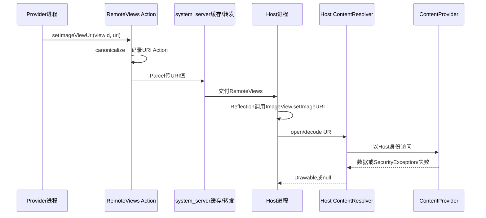
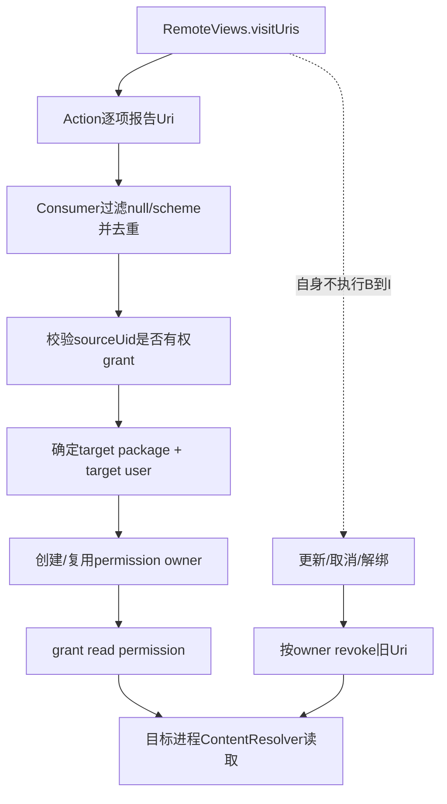
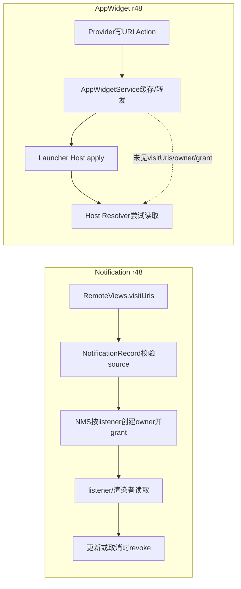

# 第 370 章 Android RemoteViews URI：发现、异步加载、Host 身份、Notification 授权对照与 AppWidget 缺口

> 源码基线：Android 11 / API 30 / `android-11.0.0_r48`。本章只在 macOS 阅读，不编译。上一章把 RemoteViews 写读协议拆开；本章跟踪 `setImageViewUri()`与 URI 型 Icon 从 Provider 对象进入 Host，再由谁的 `ContentResolver`打开内容。最重要的复读结论是：`RemoteViews.visitUris()`只是“枚举引用”的钩子，不会自己发 grant；Android 11 的 Notification 链明确消费它并管理临时读授权，而 AppWidgetService 全树没有对应调用，所以 AppWidget URI 能随 Parcel 到达不等于 Launcher 一定有权读取。

## 1. 本章问题从一张图片开始

Provider 调用 `views.setImageViewUri(R.id.icon, uri)`后，真正打开图片流的并不是 Provider，而是最终 apply RemoteViews 的 Host。若两进程权限不同，URI 字符串正确、Parcel 也正确，图片仍可能加载失败。

## 2. 先区分“携带”与“访问”

Parcelable 能把 URI 的结构化字符串送到另一进程；ContentProvider 权限决定另一进程能否 query/open。传值成功只证明 Host 知道地址，不代表 Provider 已把读能力一起交给 Host。

## 3. 本章四个源码区域

RemoteViews 的 URI Action 在 `frameworks/base/core/java/android/widget/RemoteViews.java`；实际图片打开在 `ImageView.java`与 `Icon.java`；Notification 的 URI 收集和校验在 `Notification.java`、`NotificationRecord.java`；授权生命周期在 `NotificationManagerService.java`。

## 4. AppWidget 侧需要反向证明

本章还要全树搜索 `frameworks/base/services/appwidget`。若没有 `visitUris()`、UriGrantsManager 或 grant/revoke 调用，就只能得出“r48 AppWidget 链未自动消费 RemoteViews URI”，不能凭 RemoteViews 注释补出不存在的授权步骤。

## 5. setImageViewUri 只是便捷包装

它调用 `setUri(viewId,"setImageURI",uri)`，创建 type=URI 的 ReflectionAction。它不会当场读取图片，不会把图片变成 Bitmap，也不会知道最终 Host 包名。

## 6. setUri 先做 canonical 处理

非 null 值先调用 `value.getCanonicalUri()`。对 `file://`，Uri 会尝试规范化文件路径，并处理旧式模拟外部存储路径；对普通 `content://`，实现通常原样返回。

## 7. canonical 不等于授权

路径规范化解决“同一路径不同写法”和部分跨用户旧路径转换，不会改变 ContentProvider 的 exported、readPermission、pathPermission 或动态 grant。不要把 canonical URI 翻译成“接收端可访问 URI”。

## 8. file URI 的 StrictMode 检查

若 VM file URI exposure 检查已开启，`setUri()`调用 `checkFileUriExposed("RemoteViews.setUri()")`；非 `/system/`的 file URI 可能触发 FileUriExposedException。它在 Provider 构建 Action 时发生，而非等 Host 解码才检查。

## 9. 为什么应优先 content URI

file URI 暴露真实文件路径，却没有自动跨 UID 文件访问能力；接收进程仍受 Unix 权限和存储隔离约束。content URI 能通过 ContentProvider 与细粒度 grant 表达访问能力，但本章会看到 grant 仍必须由真实上游链处理。

## 10. RemoteViews URI 总链



## 11. URI 在 Parcel 中怎样保存

ReflectionAction 写 viewId、methodName、type，再按 URI 类型调用 `Uri.writeToParcel()`。它不是 BitmapCache id，也不会把 URI 指向的字节内联进 RemoteViews。

## 12. 接收端恢复的是 Uri 对象

反 Parcel 后 Action.value 是新建的 Uri Java 对象；它保存 scheme、authority、path、query 等标识。底层图片仍留在 Provider/文件系统，直到 Host apply 才尝试获取。

## 13. apply 调用受限反射方法

ReflectionAction 用精确参数类型 `Uri.class`查找 `setImageURI(Uri)`，并要求目标方法有 `@RemotableViewMethod`。ImageView 的该方法满足要求，任意未标注方法不会因携带 URI 就开放。

## 14. ImageView 同步路径做什么

`setImageURI()`在 URI 变化时清旧 Drawable 和 resource，保存 mUri，然后同步 `resolveUri()`；尺寸变化会 requestLayout，最后 invalidate。读取与解码发生在调用 apply 的线程，通常是 Host UI 线程。

## 15. content 与 file 的打开方式

`ImageView.getDrawableFromUri()`对 content/file 使用 Host Context 的 ContentResolver 创建 ImageDecoder.Source，再 `decodeDrawable()`并指定 software allocator。IOException 被记录，方法返回 null。

## 16. android.resource URI 的分支

scheme 为 `android.resource`时，ImageView 通过 ContentResolver.getResourceId 找 Resources 与资源 id，再按 Host 主题取 Drawable。它依赖资源 URI 可解析，不走普通 content stream grant 路径。

## 17. 其他 scheme 的分支很危险

既非 android.resource、content、file 时，代码调用 `Drawable.createFromPath(uri.toString())`，把整个字符串当路径。它并不是通用 HTTP 下载器；`https://...`不会因此联网加载远端图片。

## 18. 加载失败为何常表现为空图

ImageView 捕获多类资源/IO异常并日志告警，resolve 失败后把 mUri 清掉、更新 Drawable 为 null。RemoteViews apply 不一定整体抛错，所以 Widget 可能正常显示文字、只有图片空白。

## 19. SecurityException 是否都会被 ImageView 吞掉

content 解码块只显式 catch IOException；权限失败可能以 SecurityException 等 RuntimeException 形式向上冒，也可能由更底层包装成其他失败。不要承诺所有无权限 URI 都只显示空白，具体失败形态要看 Provider/Resolver/ImageDecoder 路径。

## 20. 真正使用的是谁的 Context

RemoteViews inflate 创建 `RemoteViewsContextWrapper(baseHostContext, providerResourceContext)`。Wrapper 只覆写 Resources、Theme、packageName、isRestricted；没有覆写 `getContentResolver()`，因此 Resolver 从 base Host Context 委托而来。

## 21. 资源身份与数据身份被刻意拆开

布局、颜色、drawable resource 可按 Provider 包/user 加载；系统服务、Resolver 与执行进程仍属于 Host。Provider resource Context 不是让 Host 暂时“变成 Provider uid”的身份切换。

## 22. clearCallingIdentity 不能帮 Host

RemoteViews Host 本地 apply 通常已不在 Provider 的 Binder 调用栈上。即使某处清 calling identity，也只回到当前进程自身身份，不会得到 Provider 的文件或 ContentProvider 权限。

## 23. URI grant 的基本参与者

必须有 source UID（有权授予该 URI）、target package/user（需要读取者）、mode flags（通常 read）、可选 permission owner（统一撤销生命周期）。只传 `Uri`本身不包含这些完整决策。

## 24. 为什么 AppWidget Host 难以由 Provider写死

同一个 Widget Provider 可能被不同 Launcher、桌面、锁屏 Host 或不同用户托管。Provider 构建 RemoteViews 时未必可靠知道实际 target package，因此“直接 grant 给某固定 Launcher”不是通用 framework 方案。

## 25. exported Provider 是另一条能力模型

若 ContentProvider exported 且目标满足公开 readPermission/pathPermission，Host 可凭自身长期权限直接访问，不需要临时 grant。这虽然能让 URI 工作，却扩大长期可访问面，不能当默认安全建议。

## 26. 动态 grant 更适合最小权限

临时 grant 可只给目标包、只读、只覆盖特定 URI，并在对象生命周期结束时撤回。但前提是中间系统链知道实际目标并显式管理 owner；本章的 Notification 对照正展示这一套。

## 27. visitUris 的公开角色

RemoteViews 隐藏方法注释是：枚举内部引用的所有 URI，预期为渲染接收者发放 permission grants。关键词是“note/expectation”，方法签名只有 Consumer，没有目标包、uid 或 grant API。

## 28. visitUris 的实现非常薄

它只遍历顶层 `mActions`并调用每个 Action 的 `visitUris(visitor)`。基类实现为空；只有覆写的 URI 能被发现。方法既不去重，也不筛 scheme，也不捕获 visitor 异常。

## 29. ReflectionAction 发现 URI

type=URI 时直接 `visitor.accept((Uri)value)`；type=ICON 时交给 `visitIconUri()`。这意味着 null URI 也可能传给 visitor，真正消费者需要自行忽略 null。

## 30. visitIconUri 的类型过滤

仅 Icon.TYPE_URI 与 TYPE_URI_ADAPTIVE_BITMAP 会把 `icon.getUri()`交给 visitor。Bitmap、adaptive bitmap、resource、data 类型没有外部 URI，不应产生 grant 候选。

## 31. setImageViewIcon 的两层解析

RemoteViews Action type 是 ICON；Host 反射调用 ImageView.setImageIcon，后者执行 `icon.loadDrawable(mContext)`。URI Icon 再由 Icon.getUriInputStream 使用 Host ContentResolver 打开。

## 32. URI Icon 与普通 URI 解码实现不同

ImageView.setImageURI走 ImageDecoder；Icon.TYPE_URI 在 Android 11 走 `BitmapFactory.decodeStream`并包装 BitmapDrawable，adaptive URI 再包 AdaptiveIconDrawable。二者都需要 Host 访问权限，但密度、解码和失败日志可能不同。

## 33. TextView 复合图标也会枚举

TextViewDrawableAction 在 useIcons=true 时，依次对四个 Icon 调 `visitIconUri()`。所以 start/top/end/bottom 任一 URI Icon 都能被 Notification URI 收集链发现。

## 34. 资源型 compound drawable 不枚举

useIcons=false 的四个 int 是 Provider 资源 id，在 Host 用 Provider resources 解析，不是 content URI；`visitUris()`不访问它们是正确行为。

## 35. BitmapReflectionAction 不枚举 URI

Bitmap 已随根 BitmapCache 传输，Host 不再通过 ContentResolver打开 Provider 地址。因此它参与内存上限而不是 URI grant 计算。

## 36. PendingIntent 中的 URI 不由此枚举

点击 PendingIntent 是未来由系统发送的能力，里面 Intent 的 data/ClipData 权限遵循 PendingIntent/Intent 自己的 grant 语义。RemoteViews Action 基类没有把 PendingIntent 内所有 URI 当成“渲染所需 URI”。

## 37. fill-in Intent 也不是渲染 URI

集合 item 的 fill-in Intent 只有用户点击时才与模板合并。若把其中 URI 当成图片渲染依赖，会混淆显示阶段与交互阶段的权限生命周期。

## 38. RemoteAdapter Intent 的 data URI用途不同

它用于定位/区分 RemoteViewsService，FilterComparison 还可能将 data 纳入服务身份；RemoteViews 的 `visitUris()`没有遍历该 Intent。服务绑定权限由 AppWidgetService 的组件和 BIND_REMOTEVIEWS 校验处理。

## 39. ViewGroupActionAdd 的枚举缺口

Android 11 r48 的 ViewGroupActionAdd 覆写 setBitmapCache、prefersAsyncApply 等，却没有覆写 visitUris。因此外层 `RemoteViews.visitUris()`不会递归进入动态 add 的 nested RemoteViews。

## 40. 固定 List Action 也有类似缺口

旧的 SetRemoteViewsAdapterList Action 没有递归 visitUris。即使每一行用 setImageViewUri，顶层枚举也看不到这些 URI。第365章已指出它同时不接入顶层 BitmapCache。

## 41. 组合 landscape/portrait 是否递归枚举

顶层 `visitUris()`只看当前对象 `mActions`，没有像 setBitmapCache/prefersAsyncApply 那样对 `mLandscape/mPortrait`分支递归。因此组合根自身通常无 Actions 时，两个方向内的 URI 也可能被漏掉。

## 42. 这个缺口怎样验证

读 `visitUris()`时不要只看 Action 子类；还要搜索 `mLandscape`、`mPortrait`和 `mNestedViews`是否在该调用图出现。r48 结果是 Bitmap/async 路径递归程度与 URI 枚举路径并不一致。

## 43. 漏枚举不影响 Parcel 携带

URI Action 仍会正常写入 nested/组合 Parcel并在 Host apply；漏掉的是某个上游若依赖 visitUris 发 grant时看不到候选。于是“界面指令存在”与“权限准备完整”再次分叉。

## 44. 重复 URI 会怎样

RemoteViews 自身逐 Action调用 visitor，可能多次报告同一 URI。NotificationRecord 最后存 `ArraySet<Uri>`，在那个消费者里会去重；其他消费者若直接计数或重复 grant，需要自行处理。

## 45. visitUris 不筛 content scheme

ReflectionAction 可报告 file、android.resource 或其他 scheme；筛选责任交给调用者。NotificationRecord 的 `visitGrantableUri()`只继续处理 content scheme，避免对 file/http 做 UriGrantsManager 授权。

## 46. visitUris 不检查 Provider 可授予性

枚举阶段不问 source UID 是否拥有 URI、Provider 是否 grantUriPermissions，也不看 target。NotificationRecord 在下一阶段调用 UriGrantsManagerInternal.checkGrantUriPermission 才做能力验证。

## 47. visitUris 不创建 permission owner

permission owner 是服务端用于把一组 grants 绑定到 Notification 生命周期的 Binder token。RemoteViews 类是通用数据结构，不知道通知 key 或 Widget id，所以不在内部创建 owner。

## 48. “发现”与“授权”分层图



## 49. Notification 为什么是最佳对照

Notification 也可包含四套 RemoteViews，但它有明确系统服务和明确渲染/监听目标。Android 11 源码完整展示了 URI 收集、source 校验、按 listener grant、更新差集和取消撤销。

## 50. Notification.visitUris 先收 sound

它先把通知 sound 交给 visitor，再遍历 ticker/content/big/headsUp RemoteViews。之后还收 audio contents、background image、Person 图标、MessagingStyle 消息 data URI/发送者图标和 bubble icon。

## 51. Notification 的收集面更大

RemoteViews.visitUris只理解 Action；Notification.visitUris负责聚合整个 Notification 对象协议。两层职责避免 RemoteViews 知道 MessagingStyle、Channel 或 Bubble。

## 52. NotificationRecord 构造时计算

构造器在初始化重要度等状态后调用 `calculateGrantableUris()`。它让 Notification.visitUris 报告每项，再通过 `visitGrantableUri(uri,false)`验证和存储。

## 53. null 与非 content 会被忽略

`visitGrantableUri()`开头判断 uri==null 或 scheme 不是 content 就 return。因此 RemoteViews 的 null URI不会在 Notification 链形成 grant，file URI也不会进入 UGM。

## 54. source UID 从哪里来

NotificationRecord 使用 StatusBarNotification 的 uid，即入队应用身份，而不是 system_server 当前执行 uid。否则 clearCallingIdentity 后所有 grant 都会错误看成由 system_server 发起。

## 55. system UID 通知的特殊处理

源码注释“不能从 system grant URI”，当 sourceUid 是 SYSTEM_UID时直接 return。这是 r48 的具体策略；不要把 system 身份强大误解成能代表任意 Provider授予任意 URI。

## 56. checkGrantUriPermission 验什么

在 clearCallingIdentity 后，服务显式把 sourceUid、去用户前缀的 URI、READ flag 和 sourceUserId交给 UGM internal 检查。清身份避免用 Binder caller做下游调用，但授权主体仍通过参数保留为原通知 uid。

## 57. URI 内嵌 userId 的处理

`ContentProvider.getUserIdFromUri(uri,默认source user)`解析类似带用户前缀的 authority；`getUriWithoutUserId()`把前缀移除给底层校验/授权。URI 表达的数据用户与 source/target 用户都需要分别跟踪。

## 58. targetSdk P 的失败策略

对不可授予 URI，非 user-overridden 且通知应用 targetSdk>=P 时重新抛 SecurityException；旧 target 记录 warning 并忽略。于是新应用可能在发通知阶段直接失败，而不是等 SystemUI显示空图。

## 59. Channel 用户锁定声音例外

NotificationRecord 还检查 Channel sound；若声音由用户锁定覆盖，调用时 userOverriddenUri=true，安全异常不会按应用普通 URI路径抛回。这避免把用户选择的配置错误归罪于发布应用。

## 60. mGrantableUris 是过滤后的集合

只有 source 有权授予的 content URI 才进入 ArraySet；下游 NMS 注释明确称它已 vetted。后续授权仍有异常处理，但不再从原 Notification 每次重新扫描。

## 61. 授权目标按 listener 确定

NMS 在准备通知给每个可见 ManagedServiceInfo 前，取 listener component package 与目标 user，调用 updateUriPermissions，然后才异步 notifyPosted。目标不是写死的“com.android.systemui”。

## 62. 为什么先 grant 再回调

这样 listener 收到 StatusBarNotification 后立即加载 content URI时，权限已经存在。若先回调后异步 grant，会产生设备速度相关的竞态空图。

## 63. 每个通知 key 的 owner

有新 URI而尚无 owner 时，NMS 创建名为 `NOTIF:<key>`的 Uri permission owner，并保存到 NotificationRecord.permissionOwner。更新记录可继承旧 owner，让同一通知生命周期连续管理 grants。

## 64. 更新时只 grant 新增 URI

NMS比较 newUris 与 oldUris；新集合存在且旧集合不含的项才 grant。相同 URI不重复做新增操作，降低更新抖动。

## 65. 更新时撤销删除 URI

旧集合有而新集合没有时撤销。一般通知重发删除 URI的路径可对该 owner下的 URI做宽目标撤销；单个 listener移除时则只撤该 target，避免伤及仍需读取的其他 listener。

## 66. 通知取消的撤销顺序

NMS 先安排各 listener 的 removed 回调，之后 Handler post `updateUriPermissions(null,old,...)`销毁/撤销 owner。源码注释说明在 listeners 更新后撤访问，减少回调处理旧对象时立刻失权的窗口。

## 67. 撤销不是清理目标进程内存

若 listener 已把图片解码进自己的 Bitmap/Drawable，撤 grant 只阻止未来重新打开 URI，不能从目标堆里抹掉已读数据。这是所有 capability 撤销的现实边界。

## 68. permission owner 的价值

它把一批不同 target/URI grants绑定到通知生命周期，而无需逐个保存所有系统内部 grant token。销毁 owner可做集中回收，但 NMS仍维护差集以实现更新期间的精细变化。

## 69. onlyRevokeCurrentTarget 的原因

NotificationListenerService被禁用时，只应撤该 listener 的访问；通知仍在，SystemUI或其他 listener可能继续需要同一 URI。若直接销毁全 owner，会让其他目标无辜失权。

## 70. Notification 链证明了什么

它证明 RemoteViews.visitUris 设计上确实可用于 grant准备；也证明完整实现至少需要 source校验、target确定、grant-before-delivery、更新差集与撤销生命周期。只调用一次 visitor远远不够。

## 71. AppWidgetService 更新链再核对

`updateAppWidgetInstanceLocked()`只做 full replace/partial merge、Bitmap内存上限和 `scheduleNotifyUpdateAppWidgetLocked()`。该方法附近没有 URI枚举、source grant检查或 permission owner。

## 72. AppWidget 全树搜索结果

在 r48 的 services/appwidget、core appwidget 与 RemoteViews Host链搜索 `visitUris`，只有 RemoteViews定义和 Notification消费命中；AppWidgetService没有调用。搜索 grantUriPermission/UriGrantsManager也未出现为RemoteViews图片发授权的实现。

## 73. 结论必须限定版本与范围

准确说法是“Android 11 r48 这条 AppWidget框架链没有自动为RemoteViews URI创建临时grant”。不能无限推广到所有OEM、所有Android版本或通知；Notification恰好是反例。

## 74. URI为什么仍可能在Widget里正常显示

可能是 Provider本来对Host可读、双方共享某权限、URI来自公开媒体/资源、Provider显式授予实际Host，或Host与Provider恰好同包/uid。成功案例不能反证框架自动grant存在。

## 75. 同包Widget Host并不常见

桌面Widget通常由Launcher托管，与Provider不同UID；应用内自建 AppWidgetHost才可能同包。教程若只在同应用Host测试 setImageViewUri，容易遗漏真实Launcher权限问题。

## 76. 跨资料Widget更容易暴露问题

第357章的 parent Launcher可托管工作资料Provider。Provider resources可通过专用Context加载，但 content URI 还带 source user与target user边界；没有明确跨user grant时，资源成功不代表数据流成功。

## 77. URI user 前缀不是跨用户许可

给 content URI加 `userId@authority`只指出去哪个用户解析 Provider，不授予 INTERACT_ACROSS_USERS或URI read capability。路由信息与授权信息必须分开。

## 78. grantUriPermission 需要知道目标包

应用侧 `Context.grantUriPermission(targetPkg,uri,READ)`必须传目标。对Widget可从系统/Launcher交互设计中获得或约定，但 RemoteViews API本身没有返回实际Host package的通用接口。

## 79. FLAG_GRANT_READ_URI_PERMISSION 放哪也重要

把 flag放进另一个点击 Intent不会自动赋给图片加载阶段；Widget RemoteViews更新本身不是一个带 data/ClipData与grant flags的 startActivity Intent。必须沿真正授予链核对。

## 80. FileProvider 也不是自动答案

FileProvider能安全映射私有文件为 content URI，并声明可grant；但仍要把临时grant发给实际读取包。仅调用 `FileProvider.getUriForFile()`再 `setImageViewUri()`，不保证Launcher获得权限。

## 81. 更稳的Widget图片策略

小图可用 setImageViewBitmap并接受BitmapCache/内存上限；静态图用Provider资源id；大量集合图可设计可受控读取的ContentProvider并明确Host访问策略。选择要同时考虑隐私、更新频率、Binder大小与解码成本。

## 82. AppWidget与Notification对照图



## 83. 异步 apply 能否解决权限

不能。异步只改变图片打开/解码的线程；Host仍用同一进程身份和ContentResolver。无权限时从UI线程失败变成后台线程失败，不会凭空获得grant。

## 84. RemoteViews为何偏好URI异步

ReflectionAction 的 `prefersAsyncApply()`对 URI与ICON返回true，因为加载可能涉及Provider IPC、文件读取和图片解码。Host可据此选择 AsyncApplyTask，但“prefers”不是强制调度。

## 85. ImageView.setImageURIAsync 做什么

后台先 `getDrawableFromUri(uri)`；失败则把最终 uri置null；返回 ImageDrawableCallback。UI阶段Runnable设置已加载Drawable、URI状态与布局，而不是重新读流。

## 86. Icon异步路径

ImageView.setImageIconAsync调用 `icon.loadDrawable(mContext)`后包装callback；TextViewDrawableAction.initActionAsync也在后台对四个Icon loadDrawable。URI Icon访问仍发生在Host后台线程。

## 87. 同步与异步失败外观可能不同

同步 setImageURI先记录 mUri再resolve，失败会清；异步加载失败构造callback时直接把uri改null。最终多为空Drawable，但日志线程、异常传播与旧图替换时机可能不同。

## 88. 取消异步任务不撤 URI grant

RemoteViews AsyncTask cancel与Uri permission owner无关联。Notification grant由NMS通知生命周期管理；Widget又没有对应owner。不要把UI任务取消当权限回收。

## 89. Provider在解码时可能被拉起

Host ContentResolver打开 content URI可能启动或连接目标ContentProvider，因此图片显示延迟还包含Provider进程启动、Binder调用与Provider IO。prefersAsync正是为避免把这些都压在UI线程。

## 90. 大图即使走URI也消耗Host内存

URI避免把Bitmap像素放入RemoteViews Parcel和system_server BitmapCache上限，但Host解码后仍分配Drawable/Bitmap。超高分辨率图可能造成Launcher内存压力；它不是“零内存”传输。

## 91. ImageDecoder software allocator 的含义

ImageView URI分支显式选择software allocator，像素主要成为软件Bitmap内存。评估时应看Host解码尺寸，而不是只看RemoteViews.estimateMemoryUsage为0。

## 92. Icon URI流的关闭疑点

Icon.loadDrawableInner取得 InputStream后直接 BitmapFactory.decodeStream，所示代码未用 try-with-resources显式close。是否由底层/对象最终回收不能替代确定性关闭；这是r48源码可记录的资源管理边角，而非应用可直接修补的Widget代码。

## 93. URI内容变化与ImageView缓存

ImageView比较新旧 URI相等；同一个URI字符串再次set，且当前mResource=0时可能不重新加载。内容提供方原地址数据变了，不代表RemoteViews reapply同URI一定刷新Drawable。

## 94. 如何强制可观察更新

可使用版本化 URI/query令标识变化，或先清再设，但要同步考虑partial merge顺序、Provider缓存与grant集合变化。版本化URI也会让Notification NMS按差集撤旧授新。

## 95. content URI 稳定性与授权稳定性不同

URI可长期稳定，grant却可随通知取消、包停止、用户切换或显式撤销消失；反之某个长期Provider权限可存在但内容已删除。调试必须分别验证“能resolve/存在”和“当前target有read”。

## 96. 更新后的旧图片为什么还能看到

即使旧URI授权已撤，Host先前解码的Drawable仍可继续显示；若新URI加载失败，具体Action可能清图或旧图短暂保留。截图无法证明当前grant是否仍存在。

## 97. URI日志需要注意隐私

authority/path/query可能带用户标识或临时token。源码调试可记录scheme、authority、userId与哈希，不应在生产日志完整输出敏感query。

## 98. 安全检查先找source能力

NotificationRecord先检查发布uid能否grant，防止应用借system_server把自己无权读取的第三方URI转授给listener。这是confused deputy防护的核心。

## 99. clearCallingIdentity为何不破坏source校验

因为 sourceUid已从StatusBarNotification保存并作为显式参数传给UGM。清身份只是让system_server有权调用内部服务，不会把“谁拥有URI”替换成SYSTEM_UID。

## 100. AppWidget若补自动grant需哪些状态

理论上要为每个Widget/Host关系收集URI、验证Provider uid、按Host包/user grant、在partial/full更新做差集、Host删除/停止/Provider变化/用户删除时撤销，并覆盖nested/组合/list枚举缺口。这远不是加一行 `views.visitUris()`。

## 101. partial update使URI差集更复杂

system_server缓存的是merge后的RemoteViews Action历史；REPLACE会删除旧同key Action，APPEND保留。若做grant，应针对最终可执行对象图计算，而不是只看本次partial payload，否则会过早撤旧或漏授仍存Action。

## 102. 动态remove不等于删除URI Action历史

第368章看到remove/add Action多为APPEND；视觉上旧child被移除，历史nested对象仍可能留在Action链。如果URI枚举未来递归历史，可能保留已不可见URI grant，除非服务理解最终树语义或完整更新清基线。

## 103. landscape只需当前方向吗

只给当前方向URI授权会在旋转后产生竞态；给两方向全集又扩大授权面。r48 visitUris本身不递归组合，因此没有替AppWidget做这个政策选择。

## 104. 集合列表的生命周期更难

RemoteViewsService的每一行由Host按需跨Binder获取，图片URI可能随滚动出现；系统要自动grant还需绑定Factory、可见缓存、数据刷新和销毁生命周期。旧固定List漏枚举只是更明显的例子。

## 105. 用源码搜索证明“没有”

至少组合三类证据：定义处调用引用只有Notification；AppWidgetService更新函数只做cache/memory/callback；AppWidget目录无grant/UGM符号。单个 `rg`零结果可能因别名或封装漏检，必须交叉验证。

## 106. 不要把注释当调用事实

RemoteViews注释说“expectation that grants will need to be issued”，说明设计意图；只有具体消费者代码才能证明某产品链已经发grant。注释与调用图必须同时读。

## 107. URI问题的排查顺序

先确认Action确实到Host和目标View存在；再确认scheme/authority/user；随后以Host身份检查Provider解析与read权限；再看同步/异步日志和解码；最后检查更新同URI是否被ImageView短路。

## 108. Notification排查额外看什么

检查NotificationRecord是否把URI加入mGrantableUris、targetSdk失败策略、listener可见性、updateUriPermissions是否在notifyPosted前执行，以及通知更新/取消是否撤销。

## 109. AppWidget排查额外看什么

不要在AppWidgetService寻找并不存在的自动grant后就停止；还要查Provider manifest、调用方是否显式grant、Host包/user、跨资料关系、URI user前缀和Launcher日志。若无法可靠授权，换资源或Bitmap方案。

## 110. 最小示例的正确注释

```java
RemoteViews rv = new RemoteViews(pkg, R.layout.widget);
rv.setImageViewUri(R.id.icon, contentUri); // 只记录地址
manager.updateAppWidget(id, rv);           // r48不因此自动grant给Launcher
```

这两行证明更新描述已发送，不证明Host拥有read permission。

## 111. 练习统一要求

下面四题只用macOS只读命令或编辑器，不编译、不修改AOSP。每题都要写出“哪个进程构造URI、哪个进程打开URI、谁验证source、谁确定target、何时撤销”五列；某链不存在步骤时明确写“r48未见”。

## 112. macOS 只读练习一：追 setImageViewUri 到解码

用 `rg`定位 `setImageViewUri`、`setUri`、ReflectionAction、ImageView.setImageURI/Async与getDrawableFromUri。画Provider→Parcel→Host→Resolver→Provider时序，标出canonical、StrictMode、同步/异步线程和异常处理，不运行构建命令。

## 113. macOS 只读练习二：建立 visitUris 覆盖表

搜索RemoteViews所有 `visitUris`覆写，列出Reflection URI/Icon、TextView四Icon以及未覆盖的ViewGroupAdd、横竖组合、固定List、PendingIntent与RemoteAdapter Intent。分别说明“无需枚举”和“可能漏掉嵌套渲染URI”，不要只按类名猜。

## 114. macOS 只读练习三：复现Notification授权调用图

从 `Notification.visitUris`追到NotificationRecord.calculate/visitGrantableUri，再到NMS.updateUriPermissions的grant、diff、revoke。记录content筛选、sourceUid、source/target user、targetSdk P行为、permission owner和grant-before-notify顺序。

## 115. macOS 只读练习四：反证AppWidget自动grant

在services/appwidget、core appwidget和RemoteViews Host路径交叉搜索visitUris、grantUriPermission、UriGrantsManager；再读updateAppWidgetInstanceLocked。写出“缓存/内存检查/Host回调存在，URI收集/owner/grant/revoke未见”的证据链，并限定到Android 11 r48。

## 116. 练习答案自检

题一的Resolver必须属于Host；题二至少指出三类结构递归缺口；题三必须先校验source再grant目标且取消后撤销；题四不能写成“Android永远不支持”，只能写r48 AppWidget框架链未自动处理。

## 117. 复读后最容易改错的五句话

URI随Parcel到达≠Host可读；Provider资源Context≠Provider数据身份；visitUris枚举≠执行grant；异步加载≠绕过权限；Notification自动管理URI≠AppWidget也自动管理。把这五组等号拆开，本章主线才不会混乱。

## 118. 本章源码锚点

RemoteViews锚点是setUri、visitUris、visitIconUri与三个Action覆盖；执行端是RemoteViewsContextWrapper、ImageView的同步/异步URI方法和Icon.loadDrawable；授权对照是Notification.visitUris、NotificationRecord.calculateGrantableUris与NMS.updateUriPermissions；反证点是AppWidgetService.updateAppWidgetInstanceLocked。

## 119. 本章检查题

请回答：为什么同一content URI在Provider内可读、到Launcher却失败？visitUris为何不能自己grant？动态nested与组合布局漏枚举会造成什么后果？Notification怎样防止应用借system_server转授无权URI？撤grant后为何旧图片仍可能显示？

## 120. 本章结论与下一章入口

RemoteViews URI是一项延迟到Host执行的外部数据引用：Action负责携带，Host Resolver负责读取，权限必须由上游知道source、target与生命周期的系统链准备。r48 Notification实现了发现、校验、差集grant/revoke；AppWidget链没有消费visitUris，且visitUris自身还漏过nested/组合/固定List。下一章转入RemoteViews的资源Context、包与用户切换、主题/密度/Locale解析，以及资源id与content URI在跨用户Widget中的不同边界。
