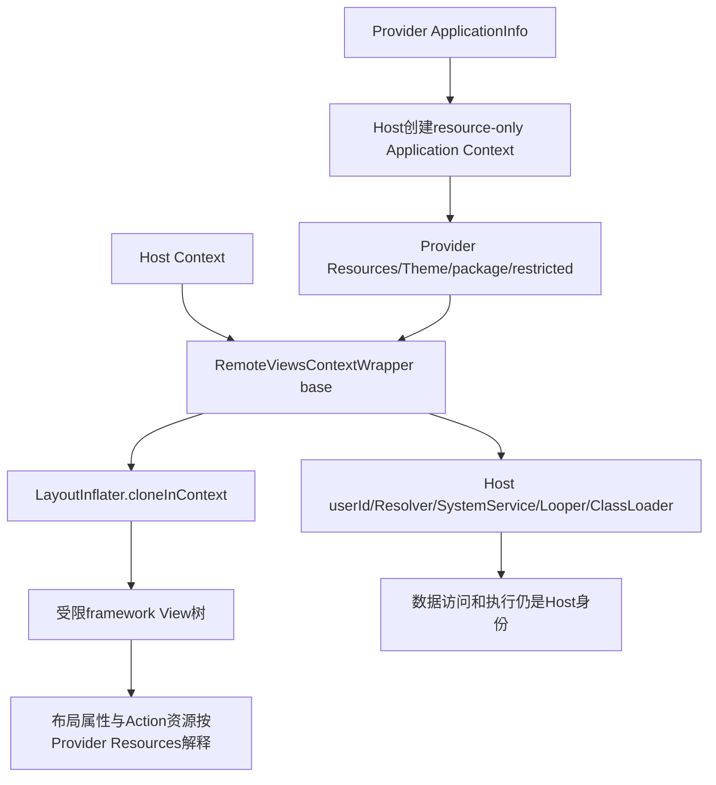
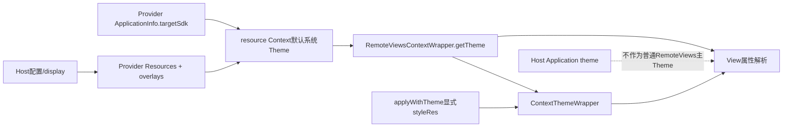
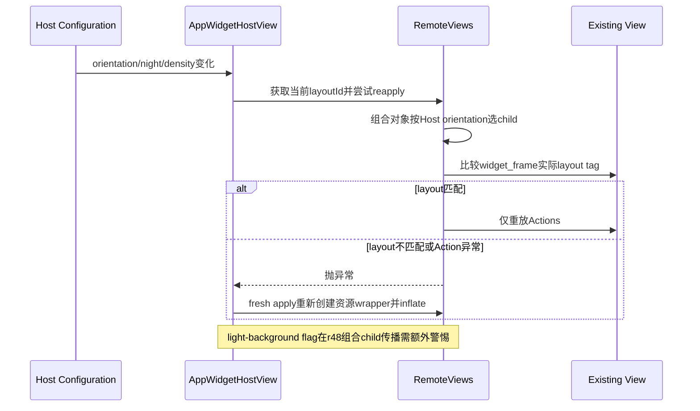

# 第 371 章 Android RemoteViews 资源 Context：跨用户包、主题、密度、Locale 与资源失效链

> 源码基线：Android 11 / API 30 / `android-11.0.0_r48`。本章只在 macOS 阅读源码，不编译。上一章确认 URI 由 Host 的 ContentResolver读取；本章解释为什么同一棵 View 又能正确使用 Provider 的 `R.layout/R.drawable/R.string`。RemoteViews 构造了一个“混合 Context”：Resources、Theme、packageName、restricted 状态来自 Provider 资源 Context，其余绝大多数能力仍委托 Host。这个设计既支持跨包/跨用户资源，又不加载 Provider 代码；它也带来主题、配置、reapply 和 light-background 组合布局的细致边界。

## 1. 本章要拆开的三种身份

先分别写下资源身份、执行身份、用户语义身份。资源身份回答“R.id对应哪个APK”；执行身份回答“代码和系统服务在哪个进程”；用户语义身份回答“日期格式、ContentResolver默认user等按谁处理”。RemoteViews 会故意让三者不完全相同。

## 2. 为什么不能直接用 Host Context inflate

`R.layout.widget`只是一个32位整数，不带包名。若Launcher直接用自身Resources解释Provider的layoutId，数值可能不存在，也可能碰巧指向Launcher的另一个资源，得到错误布局甚至类型异常。

## 3. 为什么也不能完整切成 Provider Context

完整Provider Context会让getUserId、ContentResolver、文件目录、服务缓存等语义向Provider用户倾斜，还可能诱导读者误以为Host获得Provider执行权限。RemoteViews只需要远端资源，不需要把Provider应用代码运行在Launcher。

## 4. 关键源码入口

主链在 `RemoteViews.inflateView()`、`getContextForResources()`和 `RemoteViewsContextWrapper`；资源Context的真实创建在 `ContextImpl.createApplicationContext(ApplicationInfo,flags)`；资源-only LoadedApk行为在 `ActivityThread.getPackageInfo()`与 `ResourcesManager`。

## 5. ApplicationInfo 是资源地图

RemoteViews保存的 `mApplication`至少带 packageName、uid、sourceDir、splitSourceDirs、resourceDirs、sharedLibraryFiles、targetSdk等。接收端不是只凭包名猜资源路径，而是用该ApplicationInfo创建对应LoadedApk/Resources。

## 6. 普通构造怎样得到 ApplicationInfo

同包同user时直接使用当前Application的ApplicationInfo；否则通过当前应用base Context的 `createPackageContextAsUser(package,user)`查询目标，再取其ApplicationInfo。包不存在会转成IllegalArgumentException。

## 7. 构造阶段仍受包可见性与系统查询约束

公开常用构造传本包名；隐藏跨user/跨包构造主要供系统框架。能写一个字符串不表示普通应用可合法构造任意用户的资源对象，PackageManager与跨用户权限仍在创建ApplicationInfo时起作用。

## 8. Parcel 后接收端不重新按包名查询

上一章看到root通常直接写完整ApplicationInfo，Host反Parcel后持有该快照。inflate时调用 `context.createApplicationContext(mApplication,CONTEXT_RESTRICTED)`，走接受ApplicationInfo的重载，而不是先按packageName重新查询全部字段。

## 9. 同包同user的快速路径

若Host Context的userId等于mApplication.uid中的userId，且Context.getPackageName等于mApplication.packageName，`getContextForResources()`直接返回传入Context，避免创建额外资源Context。应用内自建Host常能走这里，桌面Launcher通常不能。

## 10. Context 组合总图



## 11. createApplicationContext 使用 Provider user

ContextImpl从ApplicationInfo.uid解析userId，为新ContextImpl构造对应UserHandle。它同时沿用Host ActivityThread、窗口token和displayId，用Provider LoadedApk创建Resources。

## 12. 为什么跨用户资源不要求运行Provider代码

RemoteViews传 `CONTEXT_RESTRICTED`，没有传 `CONTEXT_INCLUDE_CODE`。ActivityThread的includeCode为false，会建立resource-only LoadedApk；ClassLoader执行Provider类不是这条链的目标。

## 13. resource-only 缓存分区

同用户且不includeCode时LoadedApk放在ActivityThread的 `mResourcePackages`弱引用表；includeCode才使用mPackages。不同用户时源码明确“不支持缓存”，每次可能建立新的LoadedApk对象。

## 14. 不同用户为什么不缓存

同包名在不同user的安装启用状态、overlay和资源路径快照可能不同，直接按packageName共享缓存容易串用户。r48选择不把跨user LoadedApk放入这两张进程级包名缓存。

## 15. 不缓存不等于每个资源字节都重读

ResourcesManager与AssetManager仍可能复用底层资源实现或文件映射；源码这里只证明ActivityThread不缓存不同user的LoadedApk引用。不要把一条注释夸大成“跨user每次都从磁盘完整加载APK”。

## 16. Resources 包含哪些路径

ContextImpl创建Resources时传Provider resDir、split paths、overlay dirs、shared library files，使用Host当前displayId、兼容信息与Provider classloader对象。资源查找因此能覆盖base APK、dynamic feature资源、RRO overlay和共享库资源表。

## 17. 没有includeCode为何仍有ClassLoader参数

Resources对象和LayoutInflater接口仍需要ClassLoader引用处理框架资源/类名，但LoadedApk不会把Provider代码作为可执行代码装入Host。RemoteViews的Inflater filter又把可创建View限制在允许类集合。

## 18. CONTEXT_RESTRICTED 的直接效果

新ContextImpl保存flags，`isRestricted()`检查CONTEXT_RESTRICTED。RemoteViews wrapper专门把isRestricted转到resource Context，用于字体等风险资源加载判断。

## 19. restricted 不是SELinux身份变化

它是Context API层的限制提示/策略状态，不会把Host进程换uid，也不会自动授予或撤销文件/Provider权限。内核和Binder检查仍看Host实际身份。

## 20. createApplicationContext 找不到包时的回退

RemoteViews捕获NameNotFoundException，记录包名not found后返回原Host Context。随后layoutId会按Host Resources解释，通常触发Resources.NotFoundException，也可能数值碰撞成错误资源；这是失败回退，不是可靠兼容机制。

## 21. 为什么不立即重新抛NameNotFound

实现选择记录日志并让后续inflate尝试，可能给系统/资源更新竞态留下容错机会。但最终Host仍可能转错误View；调试时应从最早“Package name ... not found”日志找根因。

## 22. RemoteViewsContextWrapper 的base是谁

构造器 `super(context)`传入原Host Context，另存 `mContextForResources`。这不是以Provider Context为base再覆写Host能力，而是以Host为base，只把四个资源相关入口指向Provider Context。

## 23. 明确覆写的四项

覆写 `getResources()`、`getTheme()`、`getPackageName()`、`isRestricted()`。前两项决定资源/样式，packageName让资源型Icon等默认包语义对准Provider，restricted延续受限资源加载策略。

## 24. getUserId 仍来自 Host

Wrapper未覆写getUserId，ContextWrapper委托base Host。源码注释明确这样可让日期/时间格式等按当前用户加载，而无需把整个Context切成另一个user。

## 25. getContentResolver 仍来自 Host

Wrapper未覆写Resolver，上一章因此得出content URI由Launcher/SystemUI身份访问。Provider Resources可用与Provider私有数据可读没有蕴含关系。

## 26. getSystemService 仍来自 Host

ContextWrapper默认把服务请求交给base。View若取Accessibility、LayoutInflater、Power等服务，得到Host进程的Manager/缓存与Binder关系，不会启动Provider进程内的Application服务缓存。

## 27. 主Looper与Executor仍来自 Host

`getMainLooper()`、`getMainExecutor()`同样委托base。RemoteViews Action最终UI阶段在Host UI线程，资源Context不会创建Provider Looper。

## 28. 文件目录仍来自 Host

Wrapper没有覆写filesDir/cacheDir/dataDir等。允许的framework View通常不应把RemoteViews inflate Context当Provider存储入口；若代码读取这些API，语义仍归Host，不能访问Provider私有目录。

## 29. PackageManager对象仍从 Host取得

`getPackageManager()`委托base Host Context，但调用PackageManager查询时可显式带包/user。对象属于Host进程包装器不等于只能查询Host包；实际结果仍由PMS权限、user与flags决定。

## 30. getApplicationInfo 是一个细微混合点

Wrapper没有覆写getApplicationInfo，因此一般委托Host base，而getPackageName却返回Provider包。大多数资源解析走getResources而正确；若某framework View同时假定这两个API描述同一应用，就必须额外审计。

## 31. getAssets 也没有被覆写

ContextWrapper.getAssets直接委托base Host；但 `wrapper.getResources().getAssets()`来自Provider Resources。标准LayoutInflater按context.getResources取得layout，所以主路径正确；直接调用context.getAssets的边角代码可能看到Host assets。

## 32. getClassLoader 仍来自 Host

Wrapper未覆写，避免把Provider自定义View类装进Launcher。RemoteViews布局只允许framework中标有 `@RemoteView`的类，普通Provider自定义View即便XML写出类名也会被filter拒绝。

## 33. getApplicationContext 仍是 Host Application

ContextWrapper直接返回base.getApplicationContext。View代码若保存application context，保存的是Launcher/SystemUI application，不是Provider Application；这再次说明该wrapper只为资源呈现服务。

## 34. 混合Context不是普通应用应复刻的契约

它是RemoteViews内部实现，覆写集合可随Android版本改变。应用代码不应在自定义View中依赖这些矛盾组合；事实上自定义View本就不能进入标准RemoteViews布局。

## 35. LayoutInflater 从哪里取得

RemoteViews先从原Host Context获取LAYOUT_INFLATER_SERVICE，再 `cloneInContext(inflationContext)`。这样不污染Host共享Inflater的filter，同时让新Inflater用混合Context解析布局。

## 36. 为什么不能直接修改Host共享Inflater

共享Inflater可能被Host其他UI同时使用；给它设置RemoteViews安全filter会影响Launcher自身布局。clone创建独立实例，Context与filter只作用本次远端inflate。

## 37. inflate(resource,parent,false) 的资源来源

LayoutInflater通过自己的mContext.getResources().getLayout(resource)打开XML；mContext正是混合wrapper，因此数字layoutId在Provider资源表中解析。parent只提供LayoutParams环境，不改变layout XML所属包。

## 38. parent LayoutParams 的远端资源问题

AppWidgetHostView在更新前保存 `mRemoteContext=getRemoteContext()`；其generateLayoutParams(AttributeSet)优先用该Provider资源Context构造FrameLayout.LayoutParams，帮助解析layout_width、margin等远端引用。

## 39. mRemoteContext 与 RemoteViews wrapper不是同一对象

AppWidgetHostView.getRemoteContext另行用ProviderInfo.applicationInfo创建restricted Context，主要服务Host父容器LayoutParams/default view；RemoteViews.inflateView内部又创建混合wrapper。两条资源准备路径目标相似，但对象和覆写语义不同。

## 40. default Widget View 的路径

没有RemoteViews内容时，HostView用ProviderInfo.initialLayout/initialKeyguardLayout和完整remote resource Context inflate，仍设置安全filter。它不是Provider进程执行onUpdate的替代，只是Host展示声明的默认资源。

## 41. View 对象最终保存哪个Context

Inflater构造的framework View通常保存传入混合inflationContext。此后Action调用target.getContext().getResources/getTheme继续得到Provider资源，而Resolver/服务仍按Host委托。

## 42. 同一树中能否有多个Provider资源Context

动态nested若使用不同package/user，nested.apply以外层View Context作为base，再由自身mApplication创建新的resource Context与wrapper；因此子树View可持有另一套Provider Resources，同时执行能力仍沿最初Host base链委托。

## 43. 同包nested的快速路径怎样工作

外层wrapper的getPackageName已返回Provider包，getUserId仍返回Host user。若Provider与Host同user但不同包，包不同仍创建资源Context；若同包同user则nested可直接复用外层Context作为资源来源。

## 44. 跨资料nested的user比较为何特殊

外层wrapper.getUserId返回Host user而非外层Provider user，所以即使nested与外层Provider同工作资料包，检查可能仍认为user不同并再建resource Context。它换取当前用户语义一致性，但增加跨user资源Context创建。

## 45. ApplicationInfo去重不会改变Context原则

Parcel child省AppInfo只表示继承父的同一ApplicationInfo对象；inflate时仍按上面条件选择/创建资源Context。去重优化不意味着child在Host资源表中解析。

## 46. 主题的默认来源

RemoteViewsContextWrapper.getTheme返回resource Context的Theme。新ContextImpl初始themeResId为0，首次getTheme按其ApplicationInfo.targetSdk选择系统默认Theme，而不是自动套用Provider Manifest的application theme字段。

## 47. “默认Theme.DeviceDefault”需要细化

源码注释概括为Theme.DeviceDefault；`Resources.selectDefaultTheme()`按targetSdk分段：老版本可能Theme/Holo/DeviceDefault，API 24+默认 `Theme_DeviceDefault_Light_DarkActionBar`。因此外观可能受Provider targetSdk兼容分支影响。

## 48. 为什么不使用Provider自定义AppTheme

RemoteViews必须在任意Host中保持受控、可预测的framework View样式；直接继承Provider application theme可能引入缺失属性或复杂overlay。若需要特定视觉，应在layout属性或允许的资源/Action中明确表达。

## 49. applyWithTheme 的显式主题

隐藏 `applyWithTheme(context,parent,handler,themeResId)`在混合wrapper外再套ContextThemeWrapper。非零style从Provider Resources解析并应用到base Theme上，只影响这次inflate的Theme查询。

## 50. ContextThemeWrapper 仍保留混合base

它覆写Resources/Theme和LayoutInflater服务，其他调用继续委托RemoteViewsContextWrapper，再回Host。显式theme不会把Resolver、userId、文件目录切成Provider。

## 51. 主题和资源解析图



## 52. 资源限定符使用哪套Configuration

createResources传相同Host displayId且overrideConfig=null，ResourcesManager使用Host进程收到的当前全局/显示配置，再叠加Provider兼容信息。orientation、night、density、locale等限定符以渲染环境当前配置为基础。

## 53. 为什么不是Provider进程构建时配置快照

RemoteViews只传资源id，不把当时解析出的layout XML/Drawable都打包。Host晚些时候inflate时按自己当前Configuration选择 `layout-land`、`drawable-night`等，能够适应旋转和主题状态。

## 54. 横竖屏双RemoteViews与资源限定符是两层

组合RemoteViews先按Host Context orientation选landscape/portrait对象；被选对象的layoutId随后还由Provider Resources按当前Configuration解析。不要以为用了组合构造就禁用了`layout-land`资源选择。

## 55. 未知orientation怎样选择

`getRemoteViewsToApply()`只有等于ORIENTATION_LANDSCAPE才选landscape，其余包括portrait和undefined都选portrait。它是明确二分，不会因undefined自动等待配置稳定。

## 56. density 由Host显示环境参与

ContextImpl使用Host当前displayId创建Resources；ResourcesImpl把Configuration.densityDpi与DisplayMetrics、Provider CompatibilityInfo结合。dp/sp/drawable-density最终适配显示设备，而不是按Provider构建RemoteViews时的屏幕像素固化。

## 57. Provider兼容缩放仍可能介入

旧target或声明不兼容屏幕的应用可能有CompatibilityInfo缩放；ActivityThread调用createApplicationContext时把Host当前Resources的compatibility info传入，再由LoadedApk/Resources生成实际metrics。分析异常尺寸需同时看display density和compat模式。

## 58. sp 还受fontScale

布局中的sp和Host时解析的文本尺寸Action若带SP单位，会依据当前Resources DisplayMetrics.scaledDensity，包含当前用户/显示配置的fontScale。Provider只传数值/单位，不锁死最终像素。

## 59. px Action 不随density变化

如ViewPaddingAction直接把整数当px，资源Context不会重新换算；资源dimen Action或layout XML则在Host解析。API名字相近时要先判断传的是px、unit+float还是resource id。

## 60. Locale 选择发生在Host渲染时

Provider资源表可含values-zh/values-en，但选哪套由Host Resources当前Configuration locales决定。Android 11主要按当前用户系统Locale；它不是Provider进程构建时Locale的永久快照。

## 61. 已解析CharSequence 不会重新本地化

Provider若先 `context.getString(R.string.title)`再setTextViewText，Parcel携带的是已解析文本；Host不会用Provider Resources重新选翻译。想随Locale变化，需要Provider重新更新或传在Host端解析的资源型Action（若对应API支持）。

## 62. layout XML里的文本资源会晚解析

`android:text="@string/title"`属于layout inflate，Host按当前Provider Resources/Locale解析。因此初始XML文本与之后setTextViewText覆盖文本可能具有不同配置时机。

## 63. 日期时间格式为何强调Host user

某些framework View/格式工具从Context.getUserId、Settings或系统服务读取用户偏好。Wrapper保留Host userId，避免为了加载工作资料APK资源而让Launcher无跨user权限地读取工作资料Settings。

## 64. 资源Locale与设置user可能形成混合

Resources来自Provider包但使用当前渲染Configuration，Context user语义来自Host。对标准Widget这是刻意行为：看目标包的翻译/图片，同时按正在看桌面的用户格式化。不要将其描述成完整Provider user UI环境。

## 65. night mode 的资源选择

Provider的`drawable-night`/color-night由Host当前uiMode配置决定。Host切深色模式后Resources会更新，但已有View是否重新读取所有属性取决于View配置回调与是否重新inflate。

## 66. 配置变化不会重跑所有Action

ResourcesManager更新ResourcesImpl使后续查询看到新配置，ViewRoot也分发onConfigurationChanged；然而RemoteViews历史Action不会自动由配置变化重新执行。已解析Bitmap/CharSequence/Drawable可能继续保持旧值。

## 67. 为什么Widget Provider常在配置后重发

重发可让Host选择新组合分支、重新解析layout和重新执行依赖资源的Action。仅等待Resources对象更新不保证整棵Widget视觉都重新建立。

## 68. 已有Drawable会不会自动换night版本

某些Drawable可响应theme/config，某些在加载时已解析具体状态；不能一概保证。最可靠证据是资源类型实现、View回调和Host是否fresh inflate。

## 69. reapply 不重新创建资源wrapper

`RemoteViews.reapply()`选择目标RemoteViews后，直接对现有View执行Actions，不调用inflateView/getContextForResources。Action中的resource id通常通过target.getContext()解析，因此沿用最初View保存的wrapper/Resources。

## 70. 同包更新后Resources对象可能被刷新

ActivityThread/ResourcesManager有包资源目录更新逻辑，LoadedApk检测AssetManager与overlay路径并更新ApplicationInfo。已有Resources引用可能被重定向到新资源路径，但这不保证旧layout树结构与新XML一致。

## 71. AppWidget包更新为何清views

第359章看到AppWidgetService在Provider包更新时替换info、清RemoteViews并通知Host providerChanged；这推动Host回到default/fresh路径，减少拿旧View树reapply新资源结构的风险。

## 72. resource id 在版本间不应当作永久数据库键

构建工具可能在版本变化中调整id；系统当前安装状态内R常量与resources.arsc一致，但跨APK版本持久化旧id可能指向别物。RemoteViews适合短期更新描述，不是长期资源协议。

## 73. layoutId数值相等不证明布局相同

AppWidgetHostView普通回收条件主要比较新 `getLayoutId()`与mLayoutId。Provider关系通常保证同包，但仅数值比较本身不携package/user；若对象身份被错误混用，可能尝试reapply到不相干树。

## 74. 组合RemoteViews额外做tag检查

reapply组合对象时，从当前orientation选child，再读取现有根的 `R.id.widget_frame`内部tag；若tag里的实际inflate layoutId不等所选child layoutId就抛，迫使Host走fresh apply。

## 75. 普通RemoteViews没有同样内部检查

非组合reapply不检查tag，依赖调用者保证View来自同一layout。AppWidgetHostView先比较自己的mLayoutId提供外层约束；直接使用RemoteViews API的Host应遵守reapply文档前提。

## 76. orientation切换的fresh fallback

Host外层可能先因记录值相同尝试reapply；组合内部发现现有tag属于portrait、当前选择landscape且layoutId不同，抛异常，AppWidgetHostView再fresh inflate。异常在这里是控制正确性的保护。

## 77. 两方向恰好同layoutId时可reapply

若landscape和portrait对象的根layoutId相同，内部tag检查通过，即使Actions不同也可在同一树执行。开发者仍需保证两个对象确实描述兼容结构，而不只是数值碰巧一致。

## 78. light-background 的目标

Host可标记Widget位于浅色/白色背景；RemoteViews若设置alternate `mLightBackgroundLayoutId`，`FLAG_USE_LIGHT_BACKGROUND_LAYOUT`让getLayoutId选择该布局，通常使用深色文字且减少背景保护。

## 79. Host如何请求dark-text版本

AppWidgetHostView在apply前发现mOnLightBackground，就调用 `remoteViews.getDarkTextViews()`。方法临时给源对象加flag，复制一个RemoteViews，再在finally从源外层清掉flag，避免永久修改调用者。

## 80. 已有flag时返回原对象

若RemoteViews本就含light flag，getDarkTextViews直接return this，不复制。调用者应继续把RemoteViews视为不可变描述，不因有时返回副本、有时返回本体而修改它。

## 81. alternate id为0时回退主布局

`getLayoutId()`同时要求flag存在且mLightBackgroundLayoutId!=0；没有备用布局就返回mLayoutId。Host设置light背景不会强迫Provider必须提供另一份XML。

## 82. dark text不等于系统自动改所有颜色

该机制只是选Provider提供的另一个layoutId；除非Provider在备用layout中写深色文本/图标，否则flag本身不会遍历TextView换色。另一个`overrideTextColors()`是不同Action。

## 83. r48组合布局的flag传播疑点

组合根getDarkTextViews临时只调用外层 `addFlags()`；复制构造器复制outer flags，但递归复制landscape/portrait时只复制各child原有flags。`getRemoteViewsToApply()`随后返回child，child.getLayoutId看不到新outer flag。

## 84. 结果为何可能“记录备用、实际主布局”

AppWidgetHostView先对组合外层调用getLayoutId，可能得到portrait外层的light id并记入mLayoutId；实际apply选child，child没有flag而inflate主layout。根内部tag也记录实际主layoutId，三者可能分叉。

## 85. 这是实现观察而非推荐技巧

源码没有说明应利用该差异。准确结论是Android 11 r48“组合RemoteViews + light-background alternate”存在flag未显式下传child的边界，需用真实Host/OEM测试；更稳妥的是让各方向本身颜色在当前Host场景可用。

## 86. nested Action读取flags还有另一时序

第369章确认外层Parcel最后才读mApplyFlags，ViewGroupActionAdd构造时把当时默认0传nested。它与本章组合copy未传播是两种不同原因：一个是反Parcel字段时序，一个是复制构造的层级flag语义。

## 87. 不要用一个“flags会递归”概括全部

setBitmapCache明确递归组合/nested；prefersAsync递归nested但组合入口行为另看；addFlags本身只OR当前对象。每项跨层传播都必须读自己的调用图。

## 88. 配置、reapply与备用布局图



## 89. 资源类型决定解析时机

layout/drawable/string resource id在Host Resources查询；Bitmap/CharSequence通常已在Provider构建时物化；Uri延迟由Host Resolver读取；Icon又按resource/bitmap/data/URI类型分支。不能把所有“图片/文字”视为同一时机。

## 90. setImageViewResource 的包来源

它生成ReflectionAction调用target ImageView.setImageResource(int)。target Context是最初inflate的混合wrapper，所以整数按Provider Resources解析，而不是按Action对象的ApplicationInfo单独解析。

## 91. nested跨包Action为何通常正确

跨包nested fresh apply创建其自己的View与wrapper，nested Action找到的target属于nested树，target.getContext指向nested包Resources。因此相同数值resource id可在不同子树分别解析。

## 92. Action误打到外层View的跨包风险

若nested/外层id碰撞、Action查找范围或动态树顺序让Action命中非预期View，资源id会按被命中View的Context解释。正确的viewId与树边界不仅影响目标控件，也影响资源包。

## 93. resource Icon自带包名

Icon.TYPE_RESOURCE可保存resPackage和resId；Icon.loadDrawable若尚无Resources，会用Context PackageManager加载指定包，空包名才用context.getPackageName。它比裸setImageResource整数携带更明确的包线索。

## 94. Icon资源仍受目标包可用性影响

包不存在或资源id无效会日志并返回null；指定任意包也不会绕过包资源访问/可见性策略。Icon有包名不等于包含资源字节。

## 95. overlay 会改变同一资源id的结果

Provider resource Context包含resourceDirs/overlayDirs；主题、图标或颜色可被RRO覆盖。源码阅读若只打开Provider APK原始res文件，可能与设备实际渲染不同，应检查overlay配置。

## 96. shared library资源也进入AssetManager

ApplicationInfo.sharedLibraryFiles参与Resources创建。某id若来自静态共享库，Host仍可通过Provider资源表解析；但库版本/路径更新也会触发资源目录刷新问题。

## 97. split资源缺失的失败方式

splitSourceDirs或相关split path未安装/不可用时，layout里引用可能NotFound。RemoteViews Parcel只带ApplicationInfo快照，不会把缺失split一起安装给Host。

## 98. direct boot 与资源读取

APK资源通常在用户解锁前可读取，和CE私有数据不同；所以锁定资料时系统仍可能inflateProvider资源并用masked Views替代真实内容。资源可读不表示Provider CE数据或content URI可读。

## 99. suspended/quiet mask 使用谁的资源

AppWidgetService可生成系统/Provider图标相关的masked RemoteViews，Host仍按该RemoteViews自身ApplicationInfo解析。解除mask后再交付真实RemoteViews，可能切换资源对象图。

## 100. Host进程资源缓存的更新边界

ResourcesManager维护全进程WeakReference与ResourcesImpl；配置/包路径更新会遍历并apply。缓存能减少重复解析，但也意味着排查旧资源时要区分“RemoteViews缓存旧Action”与“Host Resources缓存旧资产”。

## 101. NameNotFound 与 NotFoundException不同

前者发生在创建Provider Application Context失败；后者常发生在已有Resources中找不到具体layout/drawable id。日志与fallback层级不同，不能只写成“资源找不到”。

## 102. InflateException 又是更上层包装

XML解析、禁止类、构造器异常、主题属性缺失等可能包装为InflateException。AppWidgetHostView捕获RuntimeException后走fresh或error View；最终异常文字可能掩盖最早资源原因，应查看cause链。

## 103. 主题属性缺失怎样定位

先确认默认系统Theme还是applyWithTheme显式style，再查属性属于framework还是Provider包、overlay是否存在、targetSdk默认主题分支和当前night配置。不要直接在Host application theme中补属性，因为普通RemoteViews不以它为主Theme。

## 104. 密度问题怎样定位

记录Host displayId、Configuration.densityDpi、DisplayMetrics、Provider资源目录density、CompatibilityInfo，以及API传的是dp/sp/px/resource。截图“大小不对”不足以判断是哪一层换算。

## 105. Locale问题怎样定位

确认文本来自layout资源、Action传CharSequence还是运行时格式化；记录Host当前Configuration locales与userId；再查Provider values目录。只有前两类时机明确后，才知道需要重inflate还是Provider重发Action。

## 106. 跨user问题怎样定位

同时记录mApplication.uid中的Provider user、Host Context.getUserId、resource Context user、URI中的user前缀和实际Binder uid。任何一句“当前用户”都必须注明是哪一个对象返回的。

## 107. 只读审计Context的固定表格

列方法、返回来源、作用：getResources/provider，getTheme/provider默认系统主题，getPackageName/provider；getUserId/Host，Resolver/Host，SystemService/Host，ClassLoader/Host，ApplicationContext/Host，getAssets直接调用/Host。表格比“混合Context”四字更可验证。

## 108. 一个最小资源示例

```java
RemoteViews rv = new RemoteViews(providerPackage, R.layout.widget);
rv.setImageViewResource(R.id.icon, R.drawable.status);
rv.setTextViewText(R.id.title, providerContext.getString(R.string.ready));
```

layout与drawable在Host按Provider Resources晚解析；title已在Provider构建时解析成CharSequence，两者对Locale/更新的响应时机不同。

## 109. 一个最小跨配置推演

Provider在中文竖屏构建上例，Host交付前切英文横屏：若RemoteViews未提前物化layout文字，Host可选layout-land与英文资源；Action中的title仍是构建时中文。最终一棵树出现两种时机并不违反源码。

## 110. 本章不要求真实编译

所有结论可通过成对阅读构造器、wrapper覆写、Inflater与Resources调用图验证。设备实测适合未来确认OEM overlay和组合light边界，但不是本macOS学习阶段的完成条件。

## 111. 练习统一交付格式

下面四个练习只用`rg`、`sed`或编辑器，只读、不编译。每题输出“Host来源方法、Provider来源方法、配置时机、失败回退、一个易错结论”，并附源码路径与关键行附近上下文。

## 112. macOS 只读练习一：画混合Context方法表

阅读RemoteViewsContextWrapper和ContextWrapper，逐项列Resources、Theme、packageName、isRestricted、userId、Resolver、SystemService、Looper、ClassLoader、ApplicationInfo、ApplicationContext与Assets的委托来源。特别解释`getAssets()`和`getResources().getAssets()`为何可能不同。

## 113. macOS 只读练习二：追resource-only LoadedApk

从getContextForResources进入ContextImpl.createApplicationContext，再到ActivityThread.getPackageInfo与createResources。标出CONTEXT_RESTRICTED、未含INCLUDE_CODE、不同user不缓存、res/split/overlay/shared-library路径、displayId和CompatibilityInfo。

## 114. macOS 只读练习三：推演配置与reapply

对一组portrait/landscape RemoteViews手画Host orientation选择、inflate内部tag、Host mLayoutId、reapply检查与fresh fallback；再比较layout资源文字和已解析CharSequence在Locale变化后的结果。无需运行Widget。

## 115. macOS 只读练习四：核对light-background组合边界

顺序阅读AppWidgetHostView.mOnLightBackground、getDarkTextViews、addFlags、复制构造、getRemoteViewsToApply与getLayoutId。回答outer flag是否自动写入landscape/portrait child，并区分Host记录layoutId与实际child inflate tag；结论限定Android 11 r48。

## 116. 四题自检答案

题一至少七项仍归Host；题二必须明确resource-only且跨user LoadedApk不进缓存；题三应说明组合layout不匹配会抛并fresh；题四应看到addFlags只改当前对象、复制child取child旧flags，因此不能声称组合alternate必然生效。

## 117. 复读修正的核心句

“用Provider Context inflate”过于粗糙：准确说是Host创建Provider resource-only Context，再以Host为base包装，只替Resources/Theme/package/restricted；“配置变化自动刷新Widget”也过强，Resources会更新但旧树和已物化Action值未必重建。

## 118. 本章源码锚点清单

应能回到RemoteViews构造ApplicationInfo、getContextForResources、RemoteViewsContextWrapper、inflateView、reapply、getDarkTextViews；再到ContextImpl.createApplicationContext、ActivityThread.getPackageInfo/createResources、ContextWrapper委托，以及AppWidgetHostView.getRemoteContext/generateLayoutParams/fresh fallback。

## 119. 本章检查题

请回答：为什么Provider layout能在Launcher解析而content URI仍可能无权？wrapper有哪些方法来自Provider、哪些来自Host？Manifest application theme是否自动成为普通RemoteViews主题？Locale变化时layout string与Action CharSequence为何不同？组合light layout在r48为何存在flag层级疑点？

## 120. 本章结论与下一章入口

RemoteViews以资源-only Application Context加载Provider APK/split/overlay，再用Host base Context包装成受限混合环境：资源、默认Theme与包名面向Provider，user、Resolver、服务、线程、存储与代码面向Host；配置按Host渲染时机选择，reapply只重放Action，资源更新和组合light flag还有实现边界。下一章进入RemoteViews反射白名单：`@RemoteView`、`@RemotableViewMethod`、MethodHandle缓存、同步/异步签名、继承覆盖与异常传播。
