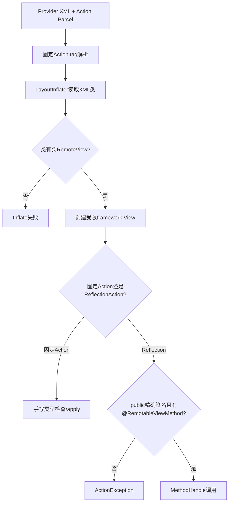
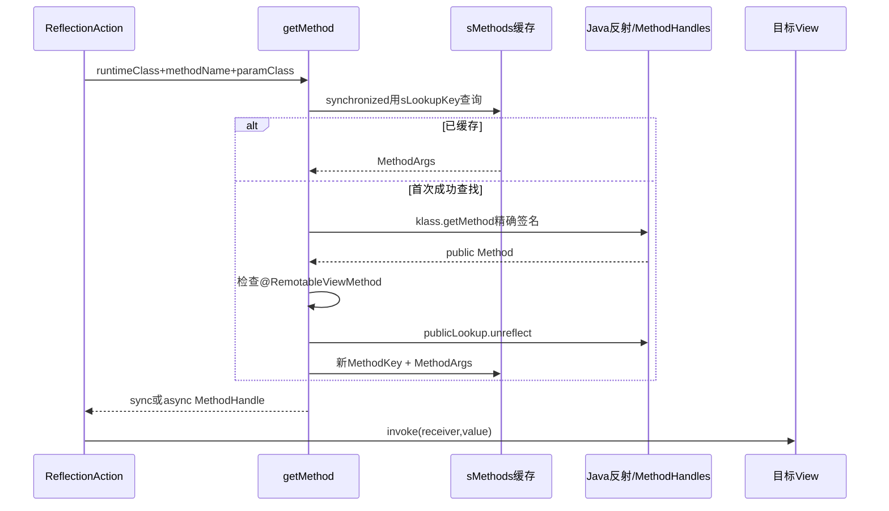
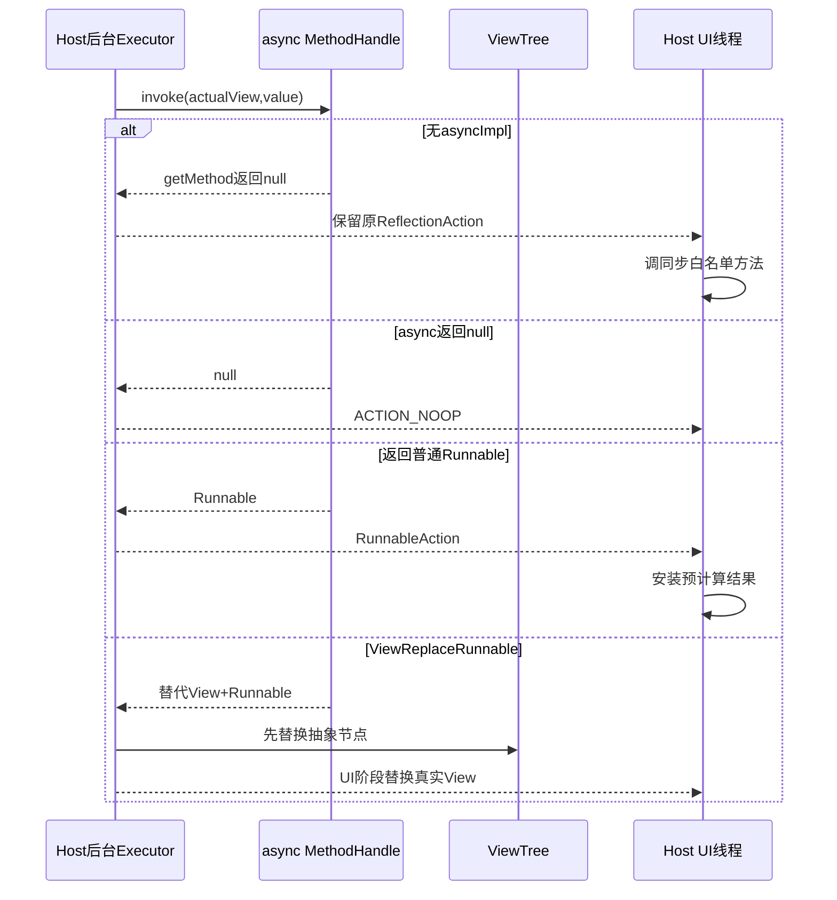

# 第 372 章 Android RemoteViews 反射白名单：RemoteView、RemotableViewMethod、MethodHandle 缓存与异步契约

> 源码基线：Android 11 / API 30 / `android-11.0.0_r48`。本章只在 macOS 阅读源码，不编译。上一章说明Host只加载Provider资源、不加载Provider代码；本章继续回答“Provider为什么能用字符串methodName改Host里的View，却不能调用任意公开方法”。安全边界由两道独立门组成：`@RemoteView`限制XML可创建的View类，`@RemotableViewMethod`限制ReflectionAction可调用的方法；固定Action则不走通用反射，而由固定tag和手写apply逻辑约束。

## 1. 反射看似危险的原因

`setInt(viewId,"setSomething",value)`把方法名作为字符串跨进程，直觉上像能调用View任何public方法。真实实现还要求目标方法精确存在并带运行时白名单注解，参数类型也必须来自固定枚举。

## 2. 两道门不能混为一谈

类门回答“XML能不能inflate这个类”；方法门回答“已经存在的View能不能执行这个setter”。一个类可被inflate，不代表其全部public方法可远程调用；一个方法有注解，目标类若不能进RemoteViews布局也很难从标准路径被命中。

## 3. 第三道边界是Action类型表

Parcel只接受固定Action tag。Provider不能写一个自定义Action类名让Host反射实例化；ReflectionAction也只接受boolean、int、Uri、Icon等固定参数编码。

## 4. 关键源码入口

读取 `RemoteViews.RemoteView`、Inflater filter、`android.view.RemotableViewMethod`、`ReflectionAction`、`getMethod()`、MethodKey/MethodArgs与AsyncApplyTask。具体白名单方法散布在View、TextView、ImageView、ProgressBar、Chronometer、TextClock等framework类中。

## 5. @RemoteView 注解标在哪里

它是RemoteViews内部、TYPE目标、RUNTIME保留的注解。Android 11 r48可见LinearLayout、FrameLayout、TextView、ImageView、Button、ProgressBar、ListView、StackView、ViewStub等一小组framework类显式标注。

## 6. RUNTIME 保留为何必要

LayoutInflater在Host运行时调用 `clazz.isAnnotationPresent(RemoteView.class)`。若注解只保留到source/class而不进runtime，Host无法用反射做准入判断。

## 7. @RemoteView 没有 @Inherited

定义上没有java.lang.annotation.Inherited，因此某个已标注类的任意子类不会仅因继承关系自动通过 `isAnnotationPresent()`。允许的framework子类需要自己标注。

## 8. 这会阻止普通自定义View

应用自定义类既不在Host可安全加载的framework集合中，也没有可被标准filter认可的framework注解身份。即使extends TextView并复刻同名注解概念，也不能替代真正的RemoteViews.RemoteView runtime注解与Host类加载边界。

## 9. 精确类列表为何比包名前缀安全

若只判断`android.widget.*`，包内新增或内部类可能无意开放。显式注解让每个类的维护者审查其构造、资源访问和生命周期是否适合远端布局。

## 10. 三层安全门图



## 11. static filter 的快速路径

标准RemoteViews使用静态lambda：类必须 `isAnnotationPresent(RemoteView.class)`。静态filter比把整个RemoteViews对象作为Filter更轻，避免每次inflate为同一准入逻辑持有外层实例。

## 12. shouldUseStaticFilter 的条件

只有运行时类精确等于RemoteViews.class才返回true。RemoteViews子类走实例自身作为LayoutInflater.Filter，并调用可覆盖的onLoadClass；系统注释要求子类若改行为应自行负责。

## 13. onLoadClass 已废弃但仍是边界点

标准实现也检查RemoteView注解。文档警告应用不应覆盖，且改变Provider进程中的方法不会影响真正渲染RemoteViews的Host进程对象/逻辑。

## 14. 远端布局失败在哪个阶段

不允许的类在inflate阶段就失败，Action还没有执行。`RemoteViewsTest.asyncApply_fail`使用含EditText的布局验证异步apply返回错误；EditText未列入r48 RemoteView白名单。

## 15. EditText为何特别不适合

可编辑控件涉及输入连接、焦点、IME和用户数据，不是只展示状态的简单投影。源码事实是它未标注；安全动机可以解释，但不要把推测写成唯一官方原因。

## 16. @RemotableViewMethod 的定义

它目标是METHOD、RUNTIME保留，含一个 `String asyncImpl() default ""`。注释明确：标记View子类上允许RemoteViews机制调用的方法；异步实现需同参数并返回Runnable或null。

## 17. 方法注解与类注解位置不同

`@RemoteView`是RemoteViews内部嵌套注解；`@RemotableViewMethod`位于`android.view`独立文件并标TestApi。阅读import时不要把两者当同一个注解的不同名字。

## 18. 方法注解不是普通权限

它没有uid、permission或AppOps字段，只是framework源码作者建立的静态能力白名单。真正调用仍发生在Host自己的View对象上。

## 19. public 是第一项签名要求

`klass.getMethod()`只寻找public方法（含继承的public方法）；随后用 `MethodHandles.publicLookup()`转换。private、protected、package-private即使反射能在别处找到，也不能通过这里。

## 20. 方法名必须精确匹配

大小写、拼写和重载名都按Java规则。`setimageResource`与`setImageResource`不同；框架不会做Bean模糊匹配或自动寻找最相近setter。

## 21. 参数Class也必须精确匹配

getMethod传runtime View类、methodName和由Action type映射的单一paramType。`int.class`不会匹配Integer参数，CharSequence不会匹配String重载，父类参数也不会因value可赋值就自动选择。

## 22. 为什么没有自动装箱匹配

反射查找本身要求声明参数列表精确；ReflectionAction的INT映射int.class。value在MethodHandle.invoke时可由调用机制处理Java值表示，但找到哪一个重载早已由primitive Class确定。

## 23. 固定支持的参数类型

Android 11 ReflectionAction覆盖boolean、byte、short、int、long、float、double、char、String、CharSequence、Uri、Bitmap、Bundle、Intent、ColorStateList与Icon。没有任意Parcelable或任意Object入口。

## 24. 每种setX只决定编码和paramType

`setInt()`本身不保证调用成功；它只创建type=INT的Action。真正到Host才查目标View运行时类是否有public `methodName(int)`且该Method对象带注解。

## 25. null不能替代重载类型信息

String、Uri、Icon等value可为null，但Action仍保存type，所以Host知道应查String.class还是Uri.class。若只传null而无type，Java反射无法唯一选择重载。

## 26. 非法type如何失败

畸形Parcel给未知type时getParameterType返回null；ReflectionAction在apply/initAsync先抛ActionException("bad type")。正常SDK setter不会产生未知type。

## 27. 无参数方法是特殊路径

ViewContentNavigation调用getMethod时paramType=null，getMethod使用 `klass.getMethod(methodName)`。它仍要求目标showNext/showPrevious带RemotableViewMethod，不是绕开方法白名单。

## 28. showNext为何依赖实际子类

AdapterViewAnimator基类的showNext/Previous在r48没有注解；允许的StackView、AdapterViewFlipper覆写并标注。ViewAnimator另一条层次的方法也标注。目标运行时类与override决定最终Method对象。

## 29. 注解不会自动继承到override

Java方法注解不会因父方法有注解就自动出现在子类覆盖Method上。子类若override一个remotable方法却不重新标注，`klass.getMethod()`返回子类Method，检查会拒绝。

## 30. 未override的继承方法可以工作

例如TextView继承View.setEnabled(boolean)而不覆盖时，getMethod返回声明在View且带注解的Method；目标runtime类仍作为缓存键，但方法白名单来自实际返回的继承Method。

## 31. override重新标注可保留能力

ImageView覆盖setVisibility并显式标RemotableViewMethod；StackView覆盖showNext/Previous也重新标注。源码作者需确认新实现仍适合远端调用。

## 32. final方法减少覆盖歧义

部分方法如ImageView.setColorFilter(int)声明final并标注，子类不能改写远端语义。不过是否final不是统一要求，真正准入仍以运行时Method注解检查为准。

## 33. getMethod 的runtime klass

`Class<? extends View> klass=view.getClass()`，不是根据XML标签字符串或声明类型查找。真实对象若是允许的具体子类，缓存和override判断都以具体Class为准。

## 34. 类白名单和方法override相互补强

即使某恶意子类能覆盖注解方法，缺RemoteView类注解通常先阻止其inflate；即使某允许framework子类进入，未标注override又会在方法门被拒。

## 35. MethodKey 的三个字段

缓存键由targetClass、paramClass、methodName构成。没有viewId、Action type整数、value、包名或具体View实例；因为方法查找结果只依赖Java类和签名。

## 36. paramClass能区分重载

同一个类的`setFoo(int)`与`setFoo(CharSequence)`生成不同键。ReflectionAction merge unique key也含type，但执行缓存与Action合并是两套独立索引。

## 37. 缓存键不含async boolean

一个MethodArgs同时保存syncMethod、asyncMethodName和可懒加载asyncMethod，因此同步/异步共用同一签名条目。先同步或先异步都能复用同步元数据。

## 38. sMethods 是Host进程静态缓存

它属于加载RemoteViews类的进程，每个Launcher/SystemUI进程各有一份；不会通过Binder共享，也不会存在system_server统一方法表。

## 39. sLookupKey 为什么可变

每次查询复用一个静态MethodKey，避免仅为map.get分配对象。因为它会被下一次调用改写，绝不能直接作为存储键放入sMethods。

## 40. 锁怎样保护 sLookupKey

整个set、map.get、首次反射和可能的async解析都在 `synchronized(sMethods)`内。两个异步任务并发查方法时不会同时改写lookup key。

## 41. 真正存入的是新 MethodKey

首次成功解析后创建新key并复制class/param/name，再put。这个key之后按约定不再变；否则ArrayMap哈希位置会被破坏。

## 42. hash异或碰撞是否会误调用

MethodKey.hashCode用三个对象hash异或，确实可能碰撞；ArrayMap仍会调用equals逐项比较Class和methodName，碰撞影响查找成本，不会把不同方法当相同。

## 43. 只缓存成功的同步查找

方法不存在、不可访问或缺注解时，在创建/put MethodArgs前抛ActionException。大量随机非法methodName会重复付反射成本，但不会把每个失败名永久塞进map。

## 44. 缓存没有显式上限

成功签名集合理论上随不同runtime View类/方法增长，r48没有LRU清理。标准允许类和注解方法有限，所以实际规模通常有界；不能说它完全不会增长。

## 45. 缓存不保存View实例

MethodHandle描述可调用方法，不引用某个target View作为bound receiver。每次invoke仍显式传当前view，因此静态缓存不会因键值直接留住整棵Widget View树。

## 46. MethodArgs 的同步内容

首次查到Method并验证注解后，用publicLookup.unreflect生成syncMethod，同时读取注解的asyncImpl字符串。此时不一定解析异步MethodHandle。

## 47. publicLookup 再做一层访问约束

即使getMethod返回public Method，其声明类/可访问性若不满足public lookup，unreflect会IllegalAccessException，并转成“doesn't have method”ActionException文本。错误文案不总能精确区分不存在与不可访问。

## 48. MethodHandle不是取消白名单的捷径

它只替代每次Method.invoke的查找/调用成本；MethodHandle来源仍是已通过注解检查的Method。缓存性能优化与安全准入按这个顺序串联。

## 49. 同步调用链

ReflectionAction先findViewById；不存在就静默return。存在则映射param Class，getMethod(...,async=false)取sync handle，再 `invoke(view,value)`；返回值若有不会被使用。

## 50. 同步方法通常应返回void

注解没有在定义层强制void，getMethod也不检查sync return type；MethodHandle.invoke的结果被忽略。framework白名单方法实际按setter语义设计，维护者仍应避免把有敏感返回副作用的方法标进来。

## 51. 缓存与调用时序图



## 52. 目标View不存在为何静默

RemoteViews布局可能因版本、条件分支或ViewStub变化缺某id；多数Action选择跳过以提高兼容性。静默不表示methodName有效，只有找到target后才做方法检查。

## 53. 找到错误类型View会怎样

同一个viewId若命中不含所需签名的类，getMethod抛ActionException。布局id碰撞可能把“method missing”表现成反射白名单错误，排查要先确认实际runtime class。

## 54. 缺方法与缺注解的文案不同

NoSuchMethod/IllegalAccess转“doesn't have method”；方法存在但无注解转“can't use method with RemoteViews”。这两个字符串能帮助区分签名错误与白名单拒绝。

## 55. MethodHandle会抛原方法异常

invoke可抛任意Throwable；ReflectionAction catch Throwable并包装ActionException。它不是Method.invoke的InvocationTargetException固定包装，cause链形态可能不同。

## 56. Error也会被包装

catch范围是Throwable，连某些Error也进入ActionException(Throwable)。Host外层主要按RuntimeException处理，最终可走fresh apply/error view；不要假设只有受检Exception。

## 57. 一个Action失败会中断后续

performApply按列表顺序执行且无逐Action隔离。某ReflectionAction抛出后，后面的Actions不会继续；之前已修改的View状态也不会事务回滚。

## 58. fresh fallback也可能重复前半段副作用

reapply失败后AppWidgetHostView可能fresh inflate再从第一Action重放；旧树上前半段改变可能被丢弃，新树重新执行。外部副作用型remotable方法应谨慎，因此白名单多是View局部setter。

## 59. Method缓存不会缓存调用结果

每次Action仍执行setter，缓存只省查Method/构建handle。幂等性由具体setter和Action顺序保证，不由sMethods保证。

## 60. 固定Action不都经过getMethod

ViewPaddingAction直接target.setPadding，TextViewSizeAction直接setTextSize，SetDrawableTint直接操作Drawable，点击Action直接装listener。它们由固定Parcel tag、目标类型判断和手写字段约束，而非RemotableViewMethod。

## 61. 专用Action为何可能更安全

它只暴露一个明确操作，可添加instanceof、null和资源处理，避免开放同类所有重载。例如drawable tint只允许选background或ImageView drawable并应用固定color/mode。

## 62. BitmapReflectionAction仍回到白名单

它在apply时构造type=BITMAP的ReflectionAction调用setImageBitmap；所以BitmapCache专用Parcel并没有绕过目标方法注解。

## 63. ViewContentNavigation也回到白名单

虽有专用Action tag和无参数调用，它使用getMethod检查showNext/showPrevious注解。这解释了StackView/AdapterViewFlipper覆写方法需要重新标注。

## 64. 便捷API不等于专用安全路径

setViewVisibility、setTextViewText、setImageViewResource等多数只是构造ReflectionAction，最终仍统一检查。阅读API名不足以判断内部Action类型，应追到addAction。

## 65. 异步契约从注解字符串开始

同步白名单方法可写 `@RemotableViewMethod(asyncImpl="setImageURIAsync")`。空字符串表示没有后台预处理实现，而不是异步方法与同步同名。

## 66. 没有asyncImpl时怎样处理

getMethod(...,async=true)看到asyncMethodName为空就返回null；ReflectionAction.initActionAsync随后返回`this`。AsyncApplyTask最终在UI阶段调用这个原ReflectionAction的同步apply。

## 67. “applyAsync”不保证每个Action后台执行

它在后台inflate并让各Action选择预处理；无asyncImpl或专用Action未覆写时仍在UI阶段执行。名称表示尽可能移动工作，不是所有setter都可离开UI线程。

## 68. 异步MethodHandle懒加载

首次同步查找只记async方法名；第一次真正请求async才构造MethodType并findVirtual。只使用同步apply的Host不会为所有async实现支付额外查找成本。

## 69. 异步签名怎样推导

sync handle type含receiver和原参数。代码先drop receiver，再把return type改成Runnable；然后在runtime klass上找同参数、精确返回Runnable的public virtual方法。

## 70. 返回Runnable必须是精确方法签名

findVirtual按MethodType精确匹配。声明返回Object、void或某个具体Runnable子类都不匹配期望的Runnable返回类型，即使Java赋值看似兼容。

## 71. 参数也必须与同步完全一致

sync `setImageURI(Uri)`对应async `setImageURIAsync(Uri)`；不能把async参数改成String或多加Context。需要的Context可由目标View字段/getContext取得。

## 72. async方法本身不要求注解

代码只检查同步Method上的RemotableViewMethod并读取受控asyncImpl名字，再publicLookup.findVirtual。异步实现通常是隐藏public方法，没有再次检查注解。

## 73. 这为何仍有安全边界

Provider不能自由指定asyncImpl名称；名称固化在framework同步方法注解中。只有framework维护者能把某个public Runnable方法连接到远端setter。

## 74. async实现错误的异常

名称不存在、访问不允许或精确签名不符时抛ActionException，文案包含声明名、同步方法名和期望`public Runnable ...`签名。错误发生在后台init阶段并由AsyncApplyTask报告listener.onError。

## 75. 异步查找失败不会负缓存

sync MethodArgs已在map里，但asyncMethod仍null；下次async请求会再次findVirtual并再次失败。修复需要framework代码/版本变化，不是重试当前对象能解决。

## 76. MethodArgs为什么无需async键

同一sync签名的注解只能声明一个asyncImpl。MethodArgs同时存两条handle即可；若把async boolean加进键，反而重复缓存sync元数据。

## 77. 后台invoke传的仍是真View

ReflectionAction.initActionAsync从ViewTree找到实际View，并在后台调用async MethodHandle(receiver,value)。因此async实现必须严格避免在后台执行需要UI线程的最终View变更。

## 78. 注解契约允许后台预计算

典型做法是读取资源/URI、创建Drawable或inflate替代View，返回Runnable在UI线程安装结果。后台方法可读取必要状态，但其线程安全由具体实现负责。

## 79. async返回null的含义

代码把null转ACTION_NOOP，UI阶段不再调用同步方法。这要求async实现已确定无需最终动作，或已经完成允许的状态更新；并不表示自动退回sync。

## 80. ImageView相同URI为何返回null

setImageURIAsync发现resource/URI状态无需变化时返回null，避免UI重复设置。若需要加载，它在后台解码并返回ImageDrawableCallback给UI安装。

## 81. ImageView资源异步示例

setImageResourceAsync在后台用target Context.getDrawable解析Provider资源，失败把resId改0；返回callback在UI阶段更新Drawable、resource id和布局状态。

## 82. Icon异步示例

setImageIconAsync后台执行icon.loadDrawable，返回ImageDrawableCallback。URI权限仍按Host，MethodHandle白名单只决定可调用性，不授予数据能力。

## 83. ViewStub的async方法更特殊

setLayoutResourceAsync、setInflatedIdAsync可直接更新stub字段并返回null；setVisibilityAsync可后台inflate替代View，返回ViewReplaceRunnable。RemoteViews识别这一具体Runnable以同步更新抽象ViewTree。

## 84. ViewReplaceRunnable为何要特判

后续Action可能定位新inflate出来的id。若后台只返回普通Runnable而ViewTree仍保留旧ViewStub，后续initActionAsync会找不到目标并变NOOP。

## 85. 特判本身也有空值风险

代码直接 `root.findViewTreeById(viewId).replaceView(...)`，依赖此前target确实来自该树且节点存在。标准路径满足前提；畸形动态树或并发结构变化需结合Action顺序审计。

## 86. RunnableAction 只存在Host运行时

它继承RuntimeAction，getActionTag固定0且writeToParcel抛UnsupportedOperationException。后台预处理结果不会再跨Binder返回Provider，而只在当前Host任务UI阶段执行。

## 87. ACTION_NOOP也不能Parcel

它同样是RuntimeAction。它表示本次Host任务中无需UI动作，不是可以写入RemoteViews缓存的正式Action tag。

## 88. 异步分工图



## 89. AsyncApplyTask怎样收异常

doInBackground包住inflate、ViewTree和所有Action init；catch Exception保存mError并返回null。ActionException是RuntimeException的子类，能进入该路径；onPostExecute调用listener.onError。

## 90. 为什么不是逐Action异步错误回调

一个Action预处理失败会令整次RemoteViews apply失败，后续Action不再初始化。HostView的ViewApplyListener若这是reapply，会再尝试fresh apply；fresh若仍同一坏方法也会失败。

## 91. 同步与异步可能暴露不同framework错误

同步只解析sync Method；异步还解析asyncImpl签名并执行后台逻辑。因此一个错误注解可能在同步显示正常、Host启用Executor后失败，必须两条路径都审计。

## 92. prefersAsyncApply与asyncImpl不是同一开关

ReflectionAction只有type URI或ICON返回prefers=true，但setImageResource(INT)也声明asyncImpl。Host是否选择async由外部Executor/策略；一旦进入applyAsync，任何Action都可使用其asyncImpl，而prefers只表达成本提示。

## 93. AppWidgetHostView并非自动因prefers切换

r48 HostView只有配置mAsyncExecutor且调用路径允许时才inflateAsync；RemoteViews.prefersAsyncApply是隐藏查询，具体消费者可决定。不能把URI/Icon偏好写成必然后台执行。

## 94. 方法缓存与线程切换关系

同一MethodArgs可被同步UI和后台init查询，sMethods锁保证构建可见性；handle返回后invoke在锁外发生，不会让所有Widget setter串行持有全局缓存锁。

## 95. 异步方法内部仍要自行线程安全

缓存锁只保护方法表，不保护View字段。ViewStub async方法直接写简单字段是framework作者明确设计；第三方无法把任意方法标注加入标准Host白名单。

## 96. 继承的asyncImpl怎样查找

findVirtual以runtime klass和注解声明名查public virtual方法，可找到继承实现；若子类override同签名，virtual调用语义可进入子类实现。类/同步override注解检查仍是前置门。

## 97. framework新增override的兼容风险

未来某允许子类若override旧remotable方法却漏注解，旧RemoteViews setter在新framework上可能被拒；若异步override签名改变，也可能只在async路径失败。因此注解属于framework兼容协议的一部分。

## 98. App不能通过同名方法注入

自定义View首先过不了RemoteView类filter；方法缓存键还含Class对象，不会因类全名或方法名相同复用framework类handle。Class identity不是字符串。

## 99. Parcel methodName本身仍不可信

Host必须假定Provider可填任意字符串，因此每次首次成功前做精确公开方法+注解检查。系统服务无需预先维护另一份methodName列表，真正的注解就在执行framework版本中。

## 100. Action type限制也防止对象注入

Provider不能借setObject传任意Host类实例作为参数；固定Parcelable类型各有CREATOR与安全边界。Bundle/Intent仍需各自Parcel审计，但方法签名白名单限制它们只能送入被批准setter。

## 101. Bundle类加载器仍是独立风险面

ReflectionAction读Bundle用Parcel.readBundle，复杂自定义Parcelable可能涉及classloader问题；不过普通remotable方法集合是否接受Bundle需实际搜索。支持编码类型不代表r48一定有一个公开白名单Bundle setter。

## 102. 支持类型与实际可调用面不同

ReflectionAction列出16类参数是协议上限；实际能力是“协议类型 ∩ runtime类public方法 ∩ Remotable注解”。没有匹配注解方法时，对应setX只是通用内部接口而非可用功能。

## 103. dedicated Action的instanceof策略

有些固定Action找不到target就return，类型不符也return或日志；ReflectionAction类型错通常抛。排错时先识别Action种类，不能假设所有RemoteViews API异常策略一致。

## 104. merge不会预验证方法

partial merge按Action key/behavior操作描述列表，不inflate View，也不调用getMethod。坏methodName可以进入system_server缓存，直到Host实际apply某个布局时才失败。

## 105. clone也不会预验证方法

复制构造只按Parcel语义重建Action；MethodHandle是Host执行期静态缓存，不写入RemoteViews Parcel。Provider侧clone成功不能证明Host有该白名单方法。

## 106. Android版本决定注解集合

同一个SDK方法在不同系统版本可能新增/调整asyncImpl；应用通过SDK兼容层应只调用该版本公开支持的RemoteViews API。隐藏setX组合更容易碰到版本差异。

## 107. 排查反射失败的固定顺序

记录实际target class、methodName、Action type→paramClass；用getMethod同样规则找public精确签名；检查返回Method上注解；若仅async失败再核对asyncImpl名称、同参数和精确Runnable返回。

## 108. 一个成功示例

```java
rv.setInt(R.id.icon, "setImageResource", R.drawable.ok);
```

目标必须实际是ImageView（或继承且未破坏注解的允许类）；r48 ImageView.setImageResource(int)带asyncImpl，sync可直接调用，applyAsync可后台加载Drawable后UI安装。

## 109. 一个不能只凭public判断的示例

```java
rv.setInt(R.id.title, "setTextColor", 0xff00ff00);
```

它是否成功要看目标runtime类的`setTextColor(int)`是否带Remotable注解；“TextView有这个public方法”本身不够。核对r48可见该int重载确实有注解，所以目标为TextView时本例通过；ColorStateList重载是另一paramClass和另一缓存键，也必须独立核对。

## 110. 不要用反射开放性推导任意代码执行

类不能自定义、方法须framework注解、参数类型固定、Provider代码不进入Host ClassLoader、Action tag固定。这些边界共同把能力收缩为一组UI setter，而不是Java反射通用执行器。

## 111. 练习统一要求

下面四题只用macOS的`rg`、`sed`或编辑器，只读、不编译。每题交付runtime class、精确签名、注解位置、缓存键、sync/async线程和失败类型六项；不要只列API名称。

## 112. macOS 只读练习一：建立类与方法双白名单

搜索所有`@RemoteView`类并任选TextView/ImageView/StackView；再搜索其`@RemotableViewMethod`。说明注解Retention、RemoteView未@Inherited、override为何需重新标方法，并用EditText坏布局测试验证类门先于Action。

## 113. macOS 只读练习二：手工模拟 MethodKey 查询

以ImageView.setImageResource(int)为例，写出targetClass、paramClass、methodName，跟踪sLookupKey、synchronized(sMethods)、新存储key、sync handle和async名字。再换成String参数，解释为何形成不同键并查找失败。

## 114. macOS 只读练习三：核对异步签名

对ImageView URI、resource、Icon和ViewStub visibility读取同步注解与async方法。逐一验证参数相同、返回精确Runnable/null契约、后台预计算和UI Runnable；说明无asyncImpl为何回退原Action而async返回null为何变NOOP。

## 115. macOS 只读练习四：比较异常与缓存

构造四个只读推演：目标id不存在、方法不存在、方法存在无注解、asyncImpl名/签名错误。记录是否静默、ActionException文案、是否写入sync缓存、是否负缓存async失败，以及AppWidgetHostView可能的reapply→fresh→error路径。

## 116. 练习答案自检

题一必须说注解不自动继承到自定义子类/override；题二键不含viewId/value/async；题三无asyncImpl返回原Action而非NOOP；题四id不存在不查方法，缺注解不缓存，async错误保留sync条目但下次仍重试async解析。

## 117. 复读后的五个精确修正

“public即可”应改成public+精确参数+Method对象有注解；“applyAsync都在后台”应改成仅asyncImpl预处理在后台；“注解会继承”应区分类注解无@Inherited与方法override不继承；“缓存存View”错误；“专用Action都绕过方法白名单”也错误，Bitmap和navigation仍回到getMethod。

## 118. 本章源码锚点

应能回到RemoteViews顶部Inflater filter、RemoteView定义、MethodKey/MethodArgs/sMethods、getMethod、ReflectionAction sync/async、RuntimeAction；再到RemotableViewMethod注解文件、ImageView/ViewStub异步实现、StackView/AdapterViewFlipper override与RemoteViewsTest坏布局。

## 119. 本章检查题

请回答：为什么setInt不能调用任意public setter？缓存键为何使用runtime Class而不只用类名？父方法有注解、子类override没注解会怎样？无asyncImpl与async返回null差别是什么？为什么固定Bitmap Action最终仍受setImageBitmap注解控制？

## 120. 本章结论与下一章入口

RemoteViews反射能力由“允许inflate的runtime类、固定Action/参数协议、public精确签名、运行时方法注解”共同限定；成功查找才进入Host进程静态MethodHandle缓存。异步实现名由framework注解控制，必须同参数并精确返回Runnable，后台只做预处理、UI Runnable完成变更。下一章进入RemoteViews异步任务整体调度：Executor、CancellationSignal、ViewTree快照、回调顺序、取消竞态与AppWidgetHostView的reapply/fresh fallback。
