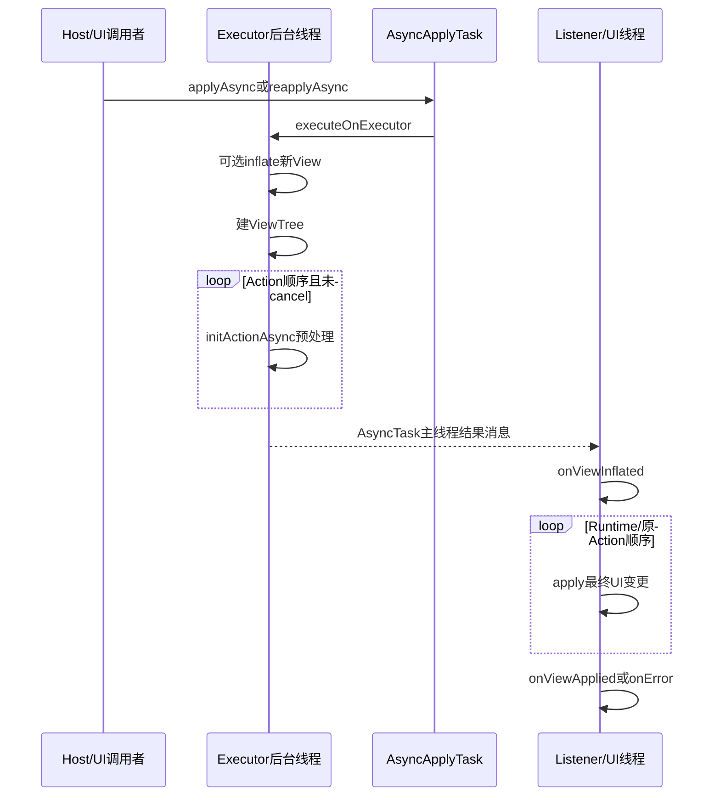
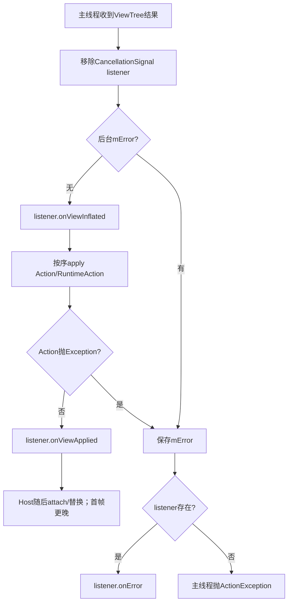
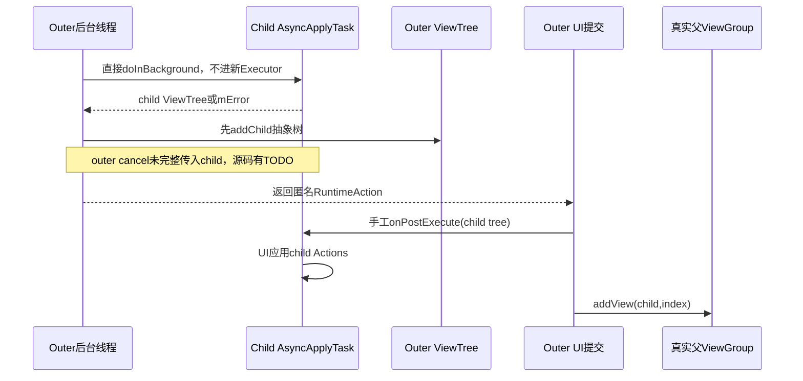

# 第 373 章 Android RemoteViews AsyncApplyTask：Executor、CancellationSignal、回调、取消竞态与 Host Fallback 链

> 源码基线：Android 11 / API 30 / `android-11.0.0_r48`。本章只在 macOS 阅读源码，不编译。上一章分析单个Action的asyncImpl；本章把整次 `applyAsync/reapplyAsync`拆成后台阶段和UI提交阶段，并接入AppWidgetHostView。重点是：异步任务不是事务，取消只是请求且没有RemoteViews终态回调；后台inflate/预处理完成后仍须在主线程按Action顺序提交；reapply失败会fresh apply，fresh再失败才显示error View。

## 1. “异步apply”到底异步什么

它把新View树inflate、ViewTree构建和支持asyncImpl的Action预处理放到Executor；最终Runnable/原Action、listener回调和Host换View仍回主线程。没有asyncImpl的setter并不会自动变成后台UI修改。

## 2. 两个公开隐藏入口

`applyAsync()`负责创建新树；`reapplyAsync()`使用已有View。两者都返回CancellationSignal、接受Executor/OnViewAppliedListener/可选OnClickHandler，内部统一使用AsyncApplyTask。

## 3. apply 与 reapply 的对象差别

apply构造task时mResult=null，后台先inflate；reapply传现有v作为mResult，后台跳过inflate，只围绕现有View建立ViewTree并初始化Actions。

## 4. 方向选择发生在task之前

`getAsyncApplyTask()`先调用getRemoteViewsToApply(context)，组合对象按Host当前orientation选分支。task保存的是选定mRV，不会在后台执行中再次根据旋转重新选择。

## 5. reapply的layout检查是同步的

组合RemoteViews在创建AsyncApplyTask前读取现有root内部layout tag并比较当前分支layoutId；不匹配立即抛RuntimeException，既没有任务也没有listener.onError。

## 6. 调用者必须处理启动前异常

AppWidgetHostView.inflateAsync用try/catch包住reapplyAsync启动；同步检查失败时mLastExecutionSignal仍null，随后直接启动fresh applyAsync。

## 7. AsyncApplyTask保存哪些状态

它保存选定RemoteViews、parent、Host Context、listener、click handler、result View，以及后台生成的ViewTree、Action数组和Exception。每次apply创建一次性task，不能重复execute。

## 8. parent并不表示自动attach

applyAsync文档明确不会把结果加入parent；parent用于inflate LayoutParams和Action rootParent语义。普通调用者需在onViewApplied自行attach，AppWidgetHostView由applyContent完成。

## 9. Executor为null的默认值

startTaskOnExecutor把null替换为`AsyncTask.THREAD_POOL_EXECUTOR`，不是AsyncTask的全局SERIAL_EXECUTOR。多个RemoteViews任务可并行，具体并发和排队由该线程池实现决定。

## 10. 整体两阶段图



## 11. THREAD_POOL_EXECUTOR 的r48形态

AsyncTask池core=1、maximum=20、SynchronousQueue、keepAlive=3秒；拒绝时退到5线程且无界队列的backup executor。它是通用池，阻塞图片/Provider IO与CPU inflate可能相互影响。

## 12. 自定义Executor为何有价值

Host可限制并发、隔离Widget工作或使用已有HandlerThread；但如果Executor串行且前一个任务IO很慢，新更新即使取消旧task也可能等旧工作真正退出后才运行。

## 13. AsyncTask回调Looper

AsyncApplyTask使用无参AsyncTask构造，callback handler指向主Looper。无论用户Executor在哪个线程运行doInBackground，onPostExecute/onCancelled都由主线程Handler处理。

## 14. 创建与execute的线程前提

AsyncTask文档要求构造和executeOnExecutor在UI线程；AppWidgetHostView更新正常在其UI线程。RemoteViews API本身没有在startTaskOnExecutor显式assertMainThread，错误调用可能造成更隐蔽的View线程问题。

## 15. onPreExecute没有自定义逻辑

AsyncApplyTask未覆写onPreExecute；execute只设置状态、把Future交给Executor。没有“开始加载”listener或进度回调。

## 16. 后台第一步是inflate

仅当mResult==null，`inflateView(mContext,mRV,mParent)`在Executor线程运行。Provider resource Context、LayoutInflater clone、安全filter和View构造都发生在这条后台路径。

## 17. View构造可以离开UI线程吗

framework专门为RemoteViews限定安全View集合并提供该路径，但View尚未attach到ViewRoot。允许后台inflate不表示任意自定义View可在线程池构造；自定义View本就被RemoteView filter拒绝。

## 18. inflate会读取parent状态

Inflater传parent且attachToRoot=false，用它生成LayoutParams；AppWidgetHostView还可能在generateLayoutParams读取mRemoteContext。后台访问UI对象的范围由framework实现控制，Host不应同时任意修改parent。

## 19. 新View尚不在屏幕树上

后台inflate得到离线View对象。它没有被parent.addView，因此不会参与真实布局/绘制/输入；直到AppWidgetHostView的UI listener调用applyContent。

## 20. reapply后台直接看已有View

reapply的mResult是已attach或曾显示的View，doInBackground围绕它建立抽象树并调用Action.initActionAsync。asyncImpl必须避免在后台执行最终UI变更，否则会违反View线程规则。

## 21. ViewTree 初始只是根包装

`new ViewTree(mResult)`先不递归children；需要查树结构的Action调用createTree惰性展开。普通ReflectionAction在mChildren为空时可委托真实root.findViewById。

## 22. 为什么需要抽象ViewTree

ViewStub替换、动态add/remove会改变后续Action可见节点。后台不能立刻把所有真实结构attach到UI parent，因此用ViewTree模拟Action顺序后的目标树。

## 23. Action数组大小固定

若mRV.mActions非null，按当前count创建等长`Action[]`。每个槽存原Action、预计算RuntimeAction或ACTION_NOOP，供UI阶段保持原始顺序执行。

## 24. 后台按Action顺序初始化

循环从0到count-1，每一步都可读取前一步更新后的ViewTree。即使两个Action都只加载图片，也没有在单个RemoteViews内部并行初始化。

## 25. 顺序是语义而非偶然

先inflate ViewStub后改其child、先remove再add、先add nested再定位nested控件都依赖顺序。把Actions并行会破坏查找目标和最终状态。

## 26. 每轮才检查isCancelled

循环条件是`i<count && !isCancelled()`；inflate之前、ViewTree构造之后没有显式check。取消可阻止后续Actions，但不保证立即停止正在进行的inflate或当前Action预处理。

## 27. nested取消有明确TODO

源码循环旁注“check if isCancelled in nested views”。ViewGroupActionAdd会同步深入child task，外层取消标志不会自动传到child的每层Action。

## 28. 后台异常捕获范围

doInBackground catch Exception，把它存mError并return null。常规InflateException、ActionException、SecurityException会进入listener错误路径。

## 29. Error不在该catch范围

OutOfMemoryError等Error不会被catch Exception捕获；AsyncTask worker捕获Throwable后标cancel并让Future异常，done可能抛包装RuntimeException。不能保证这类致命错误会变成OnViewAppliedListener.onError。

## 30. 返回null与错误绑定

正常doInBackground返回ViewTree；catch Exception时先写mError再返回null。onPostExecute只在未取消时运行，因此正常错误路径能通过mError选择onError而不会解引用null tree。

## 31. AsyncTask如何投递结果

worker finally调用postResult，把ViewTree装进主Handler消息。后台完成不等于View已显示；消息还需等待Host主Looper队列。

## 32. Binder flush 的位置

AsyncTask worker在doInBackground返回后调用Binder.flushPendingCommands，随后postResult。RemoteViews自身没有依赖这个行为提供完成确认，它只是AsyncTask通用实现。

## 33. onPostExecute先拆取消监听

第一行 `mCancelSignal.setOnCancelListener(null)`，保证之后Signal.cancel不会再调用task.onCancel。此时UI提交已开始进入不可取消区域。

## 34. 移除listener可能等待正在cancel完成

CancellationSignal.setOnCancelListener内部会等待mCancelInProgress结束，保证listener被移除后不会再被调用。极端并发cancel与UI提交时，主线程可能短暂等待取消回调退出。

## 35. onViewInflated 的准确时点

mError为空且listener非null时，先回调onViewInflated(root)，此时新树已inflate、后台预处理已结束，但所有最终Action尚未apply，且普通apply结果仍未attach到parent。

## 36. reapply也会调用onViewInflated

即使mResult是已有View、没有本次inflate，代码仍调用同一个callback。名称在reapply场景应理解为“UI提交前的root已准备好”，不是字面上的刚完成XML inflate。

## 37. listener可见的是live View

回调拿到实际root对象；若listener在onViewInflated修改树或抛异常，会影响后续Action。接口面向可信Host实现，不是Provider跨进程回调。

## 38. onViewInflated异常没有被Action try捕获

该callback位于后面的try块之外。listener自身抛RuntimeException会从AsyncTask主线程回调逸出，RemoteViews不会再调用onError。

## 39. UI阶段Action顺序不变

遍历mActions数组，每项调用apply(root,parent,handler)。RuntimeAction运行预计算Runnable；无asyncImpl的原Action此时执行同步setter；NOOP什么也不做。

## 40. 点击handler在UI阶段补默认值

mHandler为null时选DEFAULT_ON_CLICK_HANDLER，再传给每个Action。后台init虽也收到原mHandler，真正装listener的Runtime/原Action以UI阶段handler为准。

## 41. UI Action异常怎样收集

Action循环包在catch Exception中，异常写入mError并停止后续。此前Action副作用不回滚，listener随后收到onError。

## 42. UI Error仍不会被catch

try同样只catch Exception；若Runnable抛Error，既不会写mError也不会onError，可能直接冲击Host主线程。

## 43. onViewApplied 的定义

只有后台无mError且全部UI Actions无Exception时调用。它表示RemoteViews动作已应用到root，不表示root已attach、完成measure/layout/draw或像素已present。

## 44. onError 的定义

后台或UI Action的Exception都会走onError；root可能尚未attach，也可能是reapply时已被前半Action部分修改。错误对象不是事务回滚点。

## 45. 最终listener异常不隔离

onError/onViewApplied本身都没有try/catch。Host listener若抛异常，会在主线程传播；RemoteViews只负责向可信消费者报告，不保护消费者自己的callback代码。

## 46. listener为null的错误策略

若mError非null且无listener，onPostExecute在主线程重新抛：本来就是ActionException则原样抛，否则包装ActionException。异步API最好提供listener，避免错误成为Looper未捕获异常。

## 47. listener为null的成功策略

Actions仍执行，但没人收到root，也不会自动attach。直接调用applyAsync却传null listener通常无法取得新View，除非调用路径像nested task一样在内部持有mResult并手工调用post阶段。

## 48. RemoteViews没有进度callback

AsyncApplyTask不调用publishProgress。Host只看到最终inflated/applied/error，不能按已处理Action数更新进度条。

## 49. 一次task只可execute一次

AsyncTask状态从PENDING到RUNNING到FINISHED，重复execute会IllegalStateException。RemoteViews每次请求都new AsyncApplyTask，fallback也必须new新task。

## 50. applyAsync完成不改变RemoteViews

task保存/生成Host端View和RuntimeActions，不把结果写回Provider描述或Parcel。相同RemoteViews下一次apply会重新inflate/预处理。

## 51. UI回调顺序图



## 52. CancellationSignal不是Future本身

RemoteViews返回一个本地CancellationSignal，task把自己注册成OnCancelListener。调用signal.cancel最终进入AsyncApplyTask.onCancel，再 `AsyncTask.cancel(true)`。

## 53. Signal只允许第一次cancel生效

CancellationSignal在锁内设置mIsCanceled；重复cancel直接return。它还维护mCancelInProgress，避免移除listener与正在回调的cancel交叉。

## 54. 先cancel后装listener也不会漏

setOnCancelListener发现Signal已取消且新listener非null，会在锁外立即调用listener.onCancel。RemoteViews是先装listener再execute，但通用保证仍避免竞态。

## 55. cancel(true)只是尝试中断

AsyncTask文档明确cancel不等待后台终止。Future可设置线程interrupt，但LayoutInflater、图片解码、Binder调用或具体asyncImpl可能忽略/延迟响应。

## 56. canceled标志即使Future返回false也置true

AsyncTask.cancel先`mCancelled.set(true)`再mFuture.cancel。即便任务计算已结束、结果消息尚未onPost，finish看到isCancelled会走onCancelled而不是onPostExecute。

## 57. 结果已排队仍可压掉提交

若后台结果消息已在主队列但onPost尚未执行，Host调用cancel后，AsyncTask.finish选择onCancelled。AsyncApplyTask未覆写onCancelled，所以不会apply Actions或通知listener。

## 58. onPost已经开始则太晚

onPost首行移除Signal listener；之后cancel Signal不会触发task。Actions和callback继续完成。取消保证只覆盖onPost尚未开始的情况，不是正在提交UI的回滚机制。

## 59. AsyncApplyTask没有onCancelled实现

继承AsyncTask默认空方法，因此取消没有OnViewAppliedListener.onError/onApplied，也没有专门onCancelled回调。调用者必须把取消视为“可能没有终态通知”。

## 60. 测试如何证明旧task被取消

AppWidgetHostViewTest用收集Runnable的Executor连续更新两次，断言第一个Future.isCancelled；执行两个Runnable后只等待新View加入，旧task不会提交UI。

## 61. canceled任务仍可能消耗资源

若已经开始inflate或nested图片加载，它可继续运行到当前操作返回；结果最终被onCancelled丢弃。频繁更新大图会造成无效CPU/IO，即使界面只显示最后一次。

## 62. cancel不回收已创建View的确定时点

离线View/Drawable随task引用释放后由GC回收，没有显式逐View dispose。Bitmap/native资源释放时机不等于cancel返回时点。

## 63. interrupt不等同Thread.stop

Java中断是协作机制；代码必须检查interrupt或阻塞API响应。RemoteViews只在Action循环看isCancelled，没有强杀Executor线程。

## 64. Host为何保存mLastExecutionSignal

AppWidgetHostView只关心当前最新更新。新apply或setExecutor时，如果旧Signal非null就cancel并清空，减少旧结果晚到覆盖新界面。

## 65. 完成后Signal字段不会立即清null

ViewApplyListener成功/普通错误路径没有把mLastExecutionSignal置null；Host可能暂存一个已完成Signal。下一次更新对它cancel无实质UI影响，再赋新task。

## 66. 这不等于旧完成task可再次执行

Signal只是控制句柄，不是task重用接口。字段保留影响少量对象生命周期和下一次无效cancel，不改变AsyncTask一次性状态。

## 67. setExecutor 会先取消当前任务

无论切到另一个Executor还是null，Host先cancel last signal，再写mAsyncExecutor。切null后后续更新走同步apply；当前离线后台工作可能仍需时间退出。

## 68. 顶层Widget何时选择异步

`updateAppWidget()`调用 `applyRemoteViews(remoteViews,true)`；只要mAsyncExecutor非null就进入inflateAsync，未额外要求RemoteViews.prefersAsyncApply为true。

## 69. prefersAsync主要在集合行参与

RemoteViewsFrameLayout.onRemoteViewsLoaded把`forceApplyAsync || view.prefersAsyncApply()`传给applyRemoteViews。缓存命中且不昂贵时可同步减少闪烁；等待页换真实行时force=true。

## 70. Executor非null但useAsync=false会同步

AppWidgetHostView判断两个条件同时成立。集合行缓存命中、prefers=false时即使FrameLayout已配置Executor，也可在调用UI线程同步reapply/apply。

## 71. inflateAsync先准备mRemoteContext

它在启动task前设置Provider restricted Context，让parent.generateLayoutParams在后台inflate时可解析远端属性。集合RemoteViewsFrameLayout覆写getRemoteContext返回null，generateLayoutParams回退自身Context。

## 72. Host先尝试异步reapply

新layoutId等于mLayoutId且已有mView时，调用reapplyAsync。启动成功就保存Signal；无需先fresh inflate，后台主要做Action预处理。

## 73. 启动时异常会直接fresh

组合layout tag不匹配或parent转换等同步异常被catch，mLastExecutionSignal保持null，下面调用applyAsync创建新树。

## 74. 运行期reapply错误也会fresh

ViewApplyListener.onError发现mIsReapply=true，立刻用同一RemoteViews启动新的applyAsync，listener改为isReapply=false。旧树的部分Action修改不会被回滚，但fresh成功后会替换旧树。

## 75. fresh错误才显示error View

第二个listener收到onError时调用applyContent(null,false,e)；Host记录日志并创建getErrorView，避免无限reapply/apply循环。

## 76. fallback任务使用同一Executor

onError在UI线程启动mViews.applyAsync并传当时的mAsyncExecutor，代码没有锁定最初Executor快照；若字段已换成另一Executor就用新值，若已变null，applyAsync仍会选择默认THREAD_POOL_EXECUTOR，而不会在这个fallback点改走同步apply。

## 77. fallback没有重新比较“最新更新”token

Host依靠新更新先cancel mLastExecutionSignal。若旧reapply的onError已经开始并创建fresh signal，再来新更新会cancel它；但onPost已进入不可取消区的窄窗口仍需UI线程串行顺序保证。

## 78. UI线程串行减少提交交叉

ViewApplyListener、updateAppWidget典型都在Host主线程，onPost与新更新不会同时执行Java代码；事件先后决定谁最后apply。自定义Host若跨线程调用会破坏这一隐含前提。

## 79. 成功reapply不重新attach

listener传mIsReapply=true给applyContent；recycled=true时不prepare/addView，只确保mView仍指向同一对象。Actions已在UI阶段改好现有树。

## 80. 成功fresh怎样换树

recycled=false，applyContent先prepareView、addView(content)，然后若mView不同removeView(old)并更新mView。短暂顺序是先add新再remove旧，具体FrameLayout可能瞬间同时持有两者但同一UI调用栈内完成。

## 81. onViewApplied早于applyContent完成

RemoteViews先回调Host listener，listener内部才attach/replace。因此对通用RemoteViews而言onViewApplied仅完成Actions；对AppWidgetHostView而言callback返回前applyContent完成Host树替换。

## 82. mLayoutId何时更新

ViewApplyListener.onViewApplied先写Host mLayoutId和CONTENT模式，再调用applyContent。fresh失败则不走这里；error View路径由onError改变mViewMode。

## 83. mLastExecutionSignal与mLayoutId不是事务

Signal在启动时写，layoutId在成功UI回调写，中间可取消或错误。调试不能因Host已经持有Signal就认为新layout生效。

## 84. nested AsyncApplyTask不提交Executor

ViewGroupActionAdd.initActionAsync构造child task后直接调用`task.doInBackground()`，运行在外层当前后台线程。child不会成为线程池中的独立Future，也没有独立并行度。

## 85. nested task为何listener为null

外层Action需要控制child何时加入父ViewGroup；它传null listener，后台拿到child ViewTree，UI RuntimeAction再手工调用child.onPostExecute并addView。

## 86. 手工onPostExecute仍在UI线程

外层AsyncApplyTask的Action apply发生在主线程，匿名RuntimeAction在这里调用child.task.onPostExecute(tree)。虽然方法是手工调用，线程位置符合其UI提交预期。

## 87. child Actions先apply后attach

匿名RuntimeAction先child.onPostExecute，后`targetVg.addView(task.mResult,index)`。child内部View已构造并执行Actions，但直到下一行才成为父真实children。

## 88. nested链图



## 89. child后台错误如何上抛

child doInBackground捕获Exception、mError非null并return null；外层Add Action发现tree==null，抛new ActionException(task.mError)，再由outer task捕获并报告。

## 90. child UI错误如何上抛

child listener=null，onPostExecute遇mError会在UI重新抛ActionException；外层mActions循环的try catch Exception捕获它，outer listener收到onError。

## 91. child cancel signal从未启动

child task没有调用startTaskOnExecutor，所以它的CancellationSignal没装OnCancelListener，也不暴露给Host。取消只能依赖outer检查，而递归内部正是TODO缺口。

## 92. 深nested会占用同一后台线程

每层Add直接递归doInBackground，既不会并行加速，也不会让外层线程空闲。深度上限保护反Parcel，但已在内存/系统豁免结构仍可能产生长递归工作。

## 93. 抽象树先于真实attach的意义

outer后续Action在后台可以命中child节点并准备其setter；UI阶段Actions顺序同样先执行Add RuntimeAction，将child attach，再执行后续RuntimeAction，保持两阶段结构一致。

## 94. remove/add异步差异仍会传到本章

第368章的removeAllExcept抽象树错误会让后续init变NOOP；AsyncApplyTask本身忠实执行Action返回结果，不会在UI阶段重新查一次真实树来纠正后台建模。

## 95. ViewStub也是同样的两阶段思想

后台ViewReplaceRunnable先替抽象节点，UI Runnable再替真实View。nested Add和ViewStub虽实现不同，都为后续Action提供“未来UI树”的可查询模型。

## 96. 取消发生在抽象树修改后也安全提交吗

若outer task在onPost前被cancel，抽象ViewTree和离线Views只留在task内，不会attach真实Host；默认onCancelled不提交。已对reapply实际View做了不安全后台修改的asyncImpl则必须由framework实现自行保证。

## 97. asyncImpl直接改字段的边界

ViewStub setLayoutResourceAsync会在后台改mLayoutResource并返回null；对fresh离线View风险小，对reapply已有View则发生跨线程字段写。它是framework明确实现，不代表任意View字段都可这样处理。

## 98. 取消reapply可能留后台字段变化

cancel可阻止UI RuntimeAction和listener，但不能回滚asyncImpl在现有View上已经直接做的字段写入。因而“旧task取消后绝无任何影响”是过强说法。

## 99. onViewInflated可用于什么

可信Host可在Actions前观察/准备root，例如测试或渲染管线钩子；AppWidgetHostView的ViewApplyListener未覆写它，使用默认空实现。

## 100. loading template测量例子

RemoteViewsAdapter.LoadingViewTemplate用applyAsync加载第一行；onViewApplied后在主线程measure，得到defaultHeight。它再次证明Actions完成后还要有测量步骤，回调不代表屏幕显示。

## 101. 集合行为什么有专用Executor

RemoteViewsAdapter可用HandlerThreadExecutor作为mAsyncViewLoadExecutor；若当前就是该worker thread，execute直接run，否则post到Handler。AsyncTask结果仍回主Looper。

## 102. Executor直接run也不改变回调线程

doInBackground可能就在调用Executor的worker同步执行，但AsyncTask postResult仍发主Handler。若错误地在UI线程提供`Runnable::run`，后台阶段会阻塞UI，名字async也救不了错误Executor。

## 103. Host Executor要避免拒绝异常

executeOnExecutor调用exec.execute；自定义Executor若抛RejectedExecutionException，任务启动调用立即失败且没有listener回调。调用者应提供生命周期稳定的Executor并在关闭时处理更新。

## 104. CancellationSignal不是Binder取消通道

这里创建的是本地Signal，没有setRemote transport。取消只影响Host进程的AsyncTask；不会通知Provider撤回RemoteViews、取消ContentProvider自身全部IO或修改system_server缓存。

## 105. URI open是否响应interrupt取决于下层

ImageView/Icon async加载调用Resolver/解码，没有把RemoteViews CancellationSignal传给open API。线程interrupt是否让操作提前返回取决于具体Binder/IO实现，不能保证。

## 106. 调试异步问题的五个时间戳

记录任务创建、Executor真正开始、后台结束/postResult、主线程onPost开始、Host applyContent完成。只记录Provider update时刻和截图无法区分排队、计算与UI阻塞。

## 107. 调试取消还要记录task代次

给每次Host更新分配本地序号，记录旧Signal cancel、Future状态、listener代次和最终mLayoutId。system_server requestId与Host AsyncTask不是同一个序列概念。

## 108. 一个最小调用示例

```java
CancellationSignal signal = views.applyAsync(
        hostContext, parent, executor, listener);
// 新数据到达时：
signal.cancel(); // 请求停止；不等待，也没有RemoteViews取消回调
```

调用方不能在cancel返回后立即断言后台IO已停或所有临时对象已释放。

## 109. listener状态机建议

调用者可在外部维护generation：每次更新递增，callback只接受当前generation；取消时自行标记旧generation终止。即使框架通常压掉旧onPost，这仍能防自定义调度/重入逻辑误提交。

## 110. 本章不做真实线程实测

macOS阶段以AsyncTask、CancellationSignal、RemoteViews和AppWidgetHostView源码互证；未来设备可用慢Executor/慢ContentProvider制造竞态，但当前不编译、不部署。

## 111. 练习统一要求

下面四题只用`rg`、`sed`或编辑器，只读、不编译。每题画后台/UI泳道，标任务代次、取消点、View是否attach、listener结果和是否可能有部分副作用。

## 112. macOS 只读练习一：逐行拆AsyncApplyTask

从applyAsync/getAsyncApplyTask到doInBackground/onPostExecute，列出inflate、ViewTree、Action init、onViewInflated、UI Action、onViewApplied/onError顺序。指出两个try块各自不包含什么callback，以及catch Exception不覆盖Error。

## 113. macOS 只读练习二：推演三种取消时点

结合CancellationSignal.cancel/setOnCancelListener与AsyncTask.cancel/finish，分别推演任务未开始、后台/结果已排队、onPost已开始。说明Future、interrupt、onCancelled空实现、listener缺席和后台工作是否可能继续。

## 114. macOS 只读练习三：画Host fallback状态机

从AppWidgetHostView.applyRemoteViews/inflateAsync/ViewApplyListener画同layout reapplyAsync、启动前异常、运行期onError、fresh apply、error View和成功attach；标mLastExecutionSignal、mLayoutId、mViewMode写入时点。

## 115. macOS 只读练习四：追nested取消缺口

阅读ViewGroupActionAdd.initActionAsync，说明child task为何直接doInBackground、何时加入抽象树、何时手工onPost和真实addView；指出child Signal未启动、outer cancel TODO和已开始child IO不会被逐层及时终止。

## 116. 四题自检答案

题一onViewInflated在Action try外；题二cancel不等待且onPost未开始会改走空onCancelled；题三reapply运行错误启动新fresh task、fresh错误才error；题四child在同一outer后台线程递归，UI先child Actions后attach。

## 117. 复读修正的六个等号

applyAsync≠全部后台；cancel返回≠工作已停；onViewApplied≠已attach/首帧；onError≠状态回滚；Executor非null≠所有集合行必异步；旧task被cancel≠reapply现有View绝无后台字段残留。

## 118. 本章源码锚点

应能回到RemoteViews.applyAsync/reapplyAsync、AsyncApplyTask、ViewTree、ViewGroupActionAdd；AsyncTask worker/postResult/cancel/finish；CancellationSignal锁与listener；AppWidgetHostView.setExecutor/applyRemoteViews/inflateAsync/ViewApplyListener，以及RemoteViewsAdapter.FrameLayout/LoadingViewTemplate。

## 119. 本章检查题

请回答：为什么结果已进主队列仍可能被cancel压掉？onViewInflated抛异常为何不走onError？reapply失败后的fresh是哪一个新task？nested为何不能被outer Signal完整取消？取消reapply后为什么仍不能绝对保证旧任务没改任何字段？

## 120. 本章结论与下一章入口

AsyncApplyTask把一次RemoteViews执行拆成Executor后台建树/预处理和主线程按序提交；CancellationSignal借AsyncTask.cancel压掉尚未开始的onPost，却不等待、不回滚，也不提供取消终态。AppWidgetHostView以单个last signal压旧任务，并用async reapply→fresh apply→error View收敛。下一章进入AppWidgetHostView自身View模式、默认/错误布局、状态保存隔离、布局参数与尺寸裁剪链。
