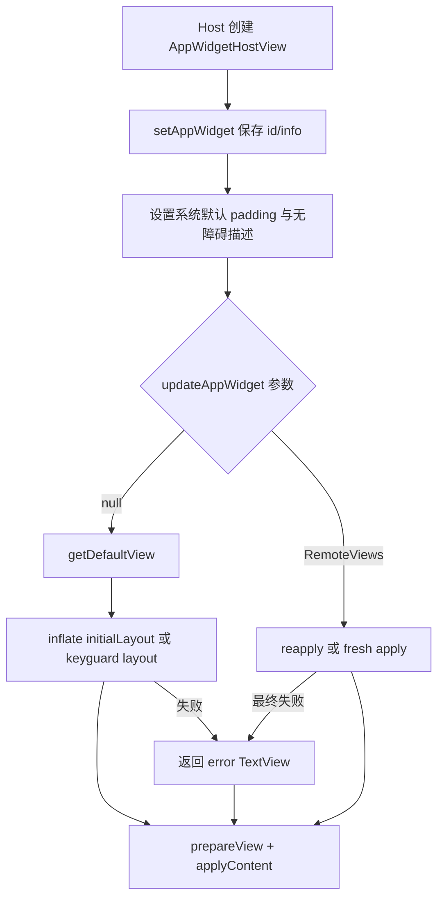
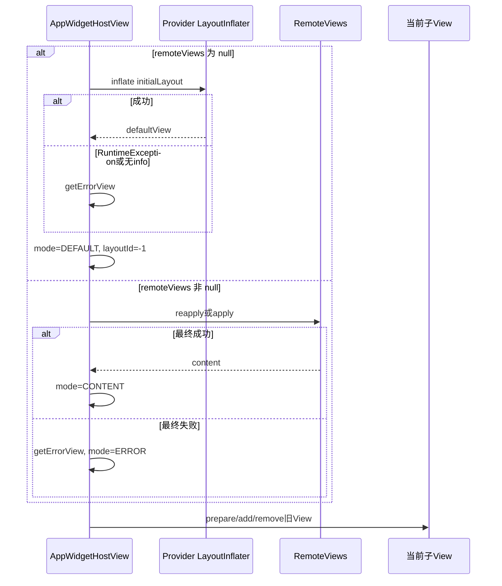
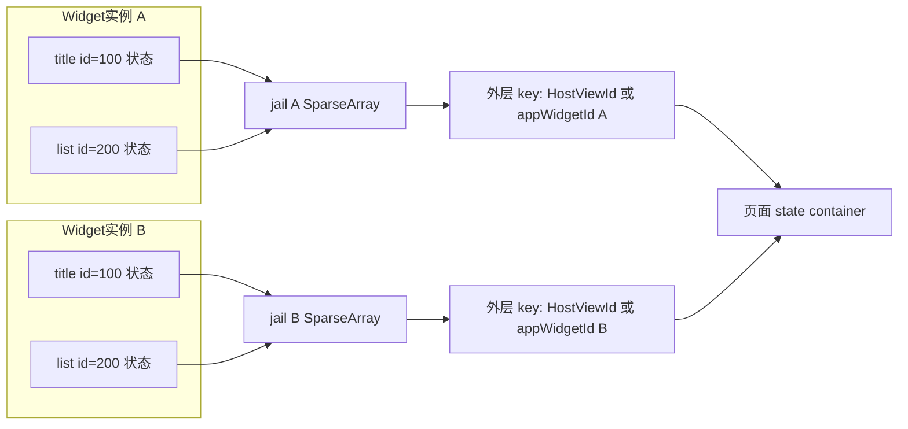

# 第 374 章 Android AppWidgetHostView：显示模式、默认/错误 View、状态 Jail、布局与 Padding 边界

> 源码基线：Android 11 / API 30 / `android-11.0.0_r48`。本章只在 macOS 阅读源码，不编译。上一章已经跟完 RemoteViews 异步应用与失败回退；本章回到承载它的 `AppWidgetHostView`，回答一个更贴近屏幕的问题：Host 到底如何在“初始布局、业务内容、错误提示”之间切换，为什么要把子 View 状态关进一个 jail，以及 Provider 的布局异常为什么不应拖垮 Launcher。

## 1. 先建立本章心智模型

`AppWidgetHostView` 可以看成一个带防护壳的 `FrameLayout`。里面通常只保留一个当前子 View；外壳负责默认 padding、跨包资源、RemoteViews 更新、状态隔离和异常兜底，Provider 只负责描述里面应显示什么。

## 2. 它位于哪条链上

Provider 通过 `AppWidgetManager` 提交 `RemoteViews`，system_server 保存并转发，Launcher 等 Host 收到更新后调用 `AppWidgetHostView.updateAppWidget()`。本章研究最后一段，不把它误认为 Provider 进程里的普通自定义 View。

## 3. 为什么不能只用普通 FrameLayout

Widget XML 来自别的包，View ID 可能与 Launcher 自身或其他 Widget 重复；布局或 setter 也可能抛异常；进程重建时还要恢复 EditText、列表等层级状态。普通容器没有这些跨包隔离和容错策略。

## 4. 四个模式常量

源码定义 `NOINIT=0`、`CONTENT=1`、`ERROR=2`、`DEFAULT=3`。它们是 Host 的内部决策状态，不是公开生命周期，也不是 Provider 能直接设置的枚举。

```java
static final int VIEW_MODE_NOINIT = 0;
static final int VIEW_MODE_CONTENT = 1;
static final int VIEW_MODE_ERROR = 2;
static final int VIEW_MODE_DEFAULT = 3;
```

## 5. NOINIT 表示什么

构造后 `mViewMode` 初值为 `NOINIT`，表示尚未决定展示哪类内容。它不是“没有 Java 对象”的严格保证；代码判断应以具体字段和当前调用路径为准，不要把模式名扩展成源码未保证的不变量。

## 6. CONTENT 表示什么

当非 null RemoteViews 被同步应用，代码在最终 `applyContent()` 前就把模式置为 `CONTENT`；异步路径则在 `onViewApplied()` 中设置。它表达业务 RemoteViews 路径成功走到提交点。

## 7. DEFAULT 表示什么

Host 收到 null RemoteViews 时，尝试 inflate `AppWidgetProviderInfo.initialLayout`，然后把模式记为 `DEFAULT`。这常发生于首次绑定、Provider 信息重置或还没收到动态更新时。

## 8. ERROR 表示什么

业务 RemoteViews 最终拿不到内容，或已显示子树在 `onLayout()` 抛 `RuntimeException` 时，Host 使用简化错误 TextView，并把模式置为 `ERROR`。它是防护状态，不是诊断根因本身。

## 9. 模式不是完整状态机

源码没有统一 `transition(from,to,event)` 方法；多个分支直接写 `mViewMode`。所以应沿调用路径理解赋值顺序，而不是自行假定所有转换都经过一张严格状态表。

## 10. 模式与真实 View 可能不完全同名

`getDefaultView()` 若 inflate 初始布局失败，会内部返回 `getErrorView()`；外层仍把 `mViewMode` 设为 `DEFAULT`。因此“画面是错误 TextView”并不总能推出模式一定是 `ERROR`。

## 11. 主要字段分工

`mView` 是当前内容引用，`mLayoutId` 用于判断能否 reapply，`mInfo` 是 Provider 元数据，`mRemoteContext` 用于解析远端资源和 LayoutParams；四者组合才描述当前承载状态。

## 12. 构造函数先建立 ID 命名空间边界

构造函数调用 `setIsRootNamespace(true)`。这样 `findViewById()` 从 Host 外层搜索时，不会随意穿透 Widget 子树，减少 Widget 内部 ID 与 Host 页面 ID 冲突造成的错误命中。

## 13. root namespace 与状态 jail 不是一回事

root namespace主要影响 ID 查找边界；状态 jail 则改变保存/恢复所用的 `SparseArray`。两道防线都针对 ID 冲突，但工作阶段和数据结构不同。

## 14. setAppWidget 的职责

`setAppWidget(id, info)`保存 Widget 实例 ID 和 ProviderInfo，设置默认 padding，并根据 Provider 标签设置无障碍描述。它不负责立刻 inflate RemoteViews。

## 15. appWidgetId 是实例身份

同一个 Provider 可在桌面放置多个实例，它们共享组件名却有不同 `appWidgetId`。Host 的状态隔离、options 查询、点击记账都需要实例 ID，而不能只靠包名或组件名。

## 16. mInfo 允许为 null

源码注释指出安全模式等场景下 `AppWidgetManager` 可能返回 null ProviderInfo。`setAppWidget()`只在 info 非 null 时加载标签；默认布局路径也会记录“mInfo missing”并回退错误 View。

## 17. 无障碍描述来自 Provider 标签

普通情况下调用 `info.loadLabel(PackageManager)`；若 Provider 应用带 `FLAG_SUSPENDED`，再用系统字符串包装成“已暂停应用”的描述，避免只靠图形状态传达不可用原因。

## 18. setAppWidget 不会清空旧描述

当本次 info 为 null，源码没有调用 `setContentDescription(null)`。因此若同一个 HostView 对象曾绑定有效 Provider，再传 null，旧描述可能仍留着；这是阅读源码能看到的状态残留边界。

## 19. 默认 padding 的入口

实例方法 `getDefaultPadding()`最终调用私有静态方法，从 `mContext.getResources()`读取四个 `default_app_widget_padding_*` 系统尺寸，并以像素返回 `Rect`。

## 20. component 参数在 r48 中未使用

公开 `getDefaultPaddingForWidget(context, component, padding)`直接转调不带 component 的私有方法。API 文档让人以为会按 Provider 组件计算，但本版本实现对所有组件使用同一组 Host 系统资源。

## 21. 传入 Rect 会被覆盖

若调用者提供非 null Rect，方法先 `padding.set(0,0,0,0)`，再写四边；它不会保留原值或在原值上累加。返回对象就是调用者传入的同一个对象。

## 22. padding 单位是 px

`getDimensionPixelSize()`给出当前 Host Resources 配置下的像素整数。它不是 dp；只有后续向 Provider 报告 options 尺寸时，代码才除以 density 转回 dips。

## 23. 历史注释与当前实现要分开

注释提到从 Android 4.0 起为目标版本较新的 Widget 自动加 padding，但 r48 这段方法没有读取 Provider targetSdk，也没有使用 component。解释当前源码时，以可执行代码为准，同时保留注释的历史背景。

## 24. padding 属于 Host 外壳

调用的是 `AppWidgetHostView.setPadding()`，不是修改 Provider 根布局 XML。Provider 内容区域因此位于 Host padding 内；Provider 若又在 XML 加同样边距，就会出现视觉上的“双重留白”。

## 25. 尺寸上报会扣除 padding

`updateAppWidgetSize()`把左右、上下 padding 从 px 除以 density 得到 dip 整数，再从 Host 分配的 min/max 宽高扣除，最后写入 options，使 Provider 得到更接近实际内容区的尺寸。

## 26. 转换使用截断而非四舍五入

源码强转 `(int)`，小数部分被截断。某些 density 下四边像素和除法结果可能比数学值略小；这通常只有 1dp 级差异，但写精确尺寸测试时要知道来源。

## 27. ignorePadding 的含义

隐藏重载允许 `ignorePadding=true`，此时不扣 Host padding。它改变的是上报的 options 数字，不会自动把 `AppWidgetHostView` 已设置的实际 padding 清零。

## 28. 只在尺寸改变时更新 options

代码读取旧 options，比较四个尺寸值；只有任一不同才把四项写进 newOptions 并调用 `updateAppWidgetOptions()`，避免无意义地反复通知 Provider。

## 29. newOptions 里的其他字段边界

只有 `needsUpdate` 为 true 才提交整个 newOptions。若四个尺寸完全相同但调用者只修改了其他自定义字段，这个方法不会提交它们；其他 options 应直接走 `updateAppWidgetOptions()`。

## 30. 从绑定到首屏的总览



## 31. null RemoteViews 是有语义的

`updateAppWidget(null)`不是简单的“清空子 View”，而是请求默认布局。若当前已经是 `VIEW_MODE_DEFAULT`，方法直接返回，避免重复 inflate。

## 32. DEFAULT 的快速返回边界

快速返回只看模式，不校验 `mInfo`、options 或 `mView` 是否外部变化。因此 ProviderInfo 变化时不能只再传 null；源码提供的 `resetAppWidget()`会先重置模式来强制重建。

## 33. resetAppWidget 的三步

它先用旧 appWidgetId 和新 info 调 `setAppWidget()`，再把模式改回 `NOINIT`，最后 `updateAppWidget(null)`。这样 DEFAULT 快速返回不会挡住新初始布局。

## 34. reset 不等于清除全部缓存

该方法没有先把 `mLayoutId`、`mView`、`mRemoteContext`全部置空；真正应用默认 View 时会令 `mLayoutId=-1`，随后 `applyContent()`替换旧子 View。要按实际语句顺序理解。

## 35. 默认布局 ID 的第一来源

`getDefaultView()`初始选择 `mInfo.initialLayout`。它来自 Provider 的 appwidget-provider XML 元数据，供尚无动态 RemoteViews 内容时展示。

## 36. Keyguard 类别的替代布局

Host options 若包含 `OPTION_APPWIDGET_HOST_CATEGORY`且值等于 `WIDGET_CATEGORY_KEYGUARD`，代码优先看 `initialKeyguardLayout`；该值为 0 时退回普通 initialLayout。

## 37. 只检查等值类别

源码是 `category == WIDGET_CATEGORY_KEYGUARD`，不是按位包含测试。即使类别常量可用于位掩码描述能力，这里的运行分支按精确等值处理，不能擅自改写为“包含 keyguard bit”。

## 38. 默认布局使用 Provider Context

`getRemoteContext()`基于 Provider 的 `ApplicationInfo`创建受限 Application Context；Inflater 从该 Context 获取并 clone，因此 `@layout`、`@drawable`、主题资源名按 Provider 包解析。

## 39. mRemoteContext 为什么在 inflate 前赋值

Host 覆写 `generateLayoutParams(AttributeSet)`，会优先使用 `mRemoteContext`。XML 子根的宽高、margin 等若引用 Provider 资源，必须让 LayoutParams 构造也处于正确资源上下文。

## 40. 受限 Context 不是安全结论的全部

`CONTEXT_RESTRICTED`限制某些操作，但真正允许哪些 View 类还依靠 LayoutInflater Filter，允许哪些 setter 还依靠 RemoteViews 白名单。不要把一个 flag 理解成完整沙箱。

## 41. 默认布局也受 @RemoteView 过滤

Inflater Filter只接受带 `RemoteViews.RemoteView` 注解的类。Provider 即使在 initialLayout 中写任意自定义 View，也会在 inflate 时被拒绝。

## 42. 注解检查针对实际 Class

Filter执行 `clazz.isAnnotationPresent(RemoteView.class)`。这与上一章反射白名单一样强调运行时类；不能因为父类被允许就推断任意子类自动被允许。

## 43. 默认布局不是 RemoteViews Action 回放

这里直接 inflate initialLayout，没有逐条执行 Provider 动态 setter Action。它只是静态首屏；后续非 null RemoteViews 到来后，Host 才进入 CONTENT 路径。

## 44. 默认根 View 的点击兜底

若 defaultView 不是 AdapterView，Host 为根设置 `onDefaultViewClicked`。这不是 Provider RemoteViews 中的 PendingIntent 点击，而是 Host 为尚未配置内容的默认画面提供的启动入口。

## 45. AdapterView 为什么排除

源码注释直接说明 AdapterView 不支持 `setOnClickListener`。因此对 AdapterView 根不会装这个默认点击；列表项交互应由 RemoteViews collection 机制处理。

## 46. 默认点击如何找 Activity

它通过 `LauncherApps.getActivityList(providerPackage, profile)`查询该包在对应用户中的可启动 Activity，列表非空时取第一个并调用 `startMainActivity()`。

## 47. “第一个 Activity”不是配置 Activity 保证

代码没有读取 `configure` 字段，也没有指定 Activity 排序语义，只取 LauncherApps 返回列表的第 0 项。因此不能把它描述成一定打开 Widget 配置页。

## 48. 默认点击带来源范围

`RemoteViews.getSourceBounds(view)`生成屏幕坐标范围传给启动 API，可用于启动动画等来源信息。它不代表共享元素动画，也不是安全授权。

## 49. 空 Activity 列表时静默不动

若查询结果为空，方法不抛异常也不显示 Toast。用户看到的只是点击无响应；排查时应检查 Provider 包是否存在 Launcher Activity 以及对应 profile 可见性。

## 50. getDefaultView 捕获范围

整个 info 检查、Context、Inflater、options、布局选择、inflate 和点击监听安装都包在 `catch (RuntimeException)`中；普通运行时错误被记录，随后回退错误 View。

## 51. NameNotFoundException 在更内层处理

`getRemoteContext()`自己捕获 `NameNotFoundException`并返回 Host Context。之后若用 Provider layoutId 在 Host Context inflate，很可能再因资源不匹配抛 RuntimeException，最终由默认路径兜底。

## 52. Error 不会被 getDefaultView 捕获

这里捕获的是 `RuntimeException`，不是所有 Throwable。`OutOfMemoryError`等 Error 不会可靠地变成错误 TextView，容错边界不能被夸大为“任何异常都安全”。

## 53. mInfo 为 null 的处理

代码记录 warning，不尝试猜包或复用旧 info，defaultView 保持 null，最后调用 `getErrorView()`。这条路径没有异常对象，但用户仍得到可布局的占位内容。

## 54. getErrorView 很朴素

它直接 `new TextView(mContext)`，设置内部系统字符串 `gadget_host_error_inflating`，并设置半透明黑色背景；没有 inflate Provider 资源，也不依赖 Provider Context。

## 55. 错误 View 为什么使用 Host Context

错误路径恰恰可能来自 Provider 资源损坏、包消失或跨用户 Context 创建失败；继续依赖 Provider 资源会让兜底再次失败。Host Context提供更稳定的系统字符串与基础 View。

## 56. 错误 View 不显示异常详情

屏幕只显示通用错误文本；具体异常写 log。这样避免把包路径、内部消息或堆栈暴露给桌面用户，也避免错误提示本身过长破坏布局。

## 57. 半透明黑背景的准确值

源码用 `Color.argb(127,0,0,0)`，alpha约一半。旁边还有 TODO“从某处获取颜色”，说明它不是主题化完成的 Material error component。

## 58. getDefaultView 返回 error 但模式仍 DEFAULT

外层 null 分支顺序是：`content=getDefaultView()`、`mLayoutId=-1`、`mViewMode=DEFAULT`。`getDefaultView()`内部没有改模式，所以静态初始布局失败时的通用错误占位仍属于 DEFAULT 决策路径。

## 59. 业务 RemoteViews 失败才由 applyContent 标 ERROR

同步 reapply/apply均失败会让 content 为 null并带 exception；`applyContent()`创建 error View并将模式改为 ERROR。异步 fresh apply 的 `onError()`最终也走同一逻辑。

## 60. 默认与错误选择时序图



## 61. prepareView 先读取现有 LayoutParams

代码把 `view.getLayoutParams()`强转为 `FrameLayout.LayoutParams`。RemoteViews inflate 时 parent就是 Host且 attachToRoot=false，正常根 View 应已获得匹配的 FrameLayout 参数。

## 62. 强转也可能抛异常

若自定义 Host 子类或错误调用者传来带其他 LayoutParams 的 View，强转会抛 `ClassCastException`。`prepareView()`本身没有 catch；框架信任其内部生成的 View 满足容器契约。

## 63. null LayoutParams 的默认尺寸

若参数为 null，就创建宽高均 `MATCH_PARENT` 的 `FrameLayout.LayoutParams`，保证错误 TextView等直接 new 出来的 View 能铺满内容区域。

## 64. Provider 请求尺寸会被保留

参数非 null 时，代码不强制改成 MATCH_PARENT，而是保留 XML 请求的 width/height、margin 等字段，只覆盖 gravity。故“所有 Widget 根都铺满”并不是源码保证。

## 65. gravity 被强制改为 CENTER

无论 XML 原 gravity为何，`requested.gravity=Gravity.CENTER`。这是子 View 在 Host FrameLayout 中的布局重力，不是 TextView 内部文字 gravity。

## 66. CENTER 与 padding 的关系

FrameLayout先从自身 padding 划出可用内容区域，再按 LayoutParams 和 CENTER摆放子 View。若子 View MATCH_PARENT，居中几乎不可见；若 WRAP_CONTENT，留白会在可用区域两侧分配。

## 67. applyContent 保持单当前 View

非 recycled 时先 prepare并 add新内容；若 `mView != content`，再 remove旧 mView并更新字段。短暂的 add-before-remove 顺序让新 View先进入容器，再移除旧 View。

## 68. removeView(null) 的边界

ViewGroup 的 removeView接收 null 时找不到目标并返回，不会因首次没有 mView 必然崩溃。阅读调用点不应仅凭参数可能为 null就断言 NPE。

## 69. recycled 时不重复添加

reapply成功返回的 content就是现有 `mView`，recycled=true；`applyContent()`跳过 prepare/add，且对象相同也跳过 remove。它保留同一 View 实例和 attach关系。

## 70. reapply 失败后的部分副作用

RemoteViews reapply不是事务。若前几条 Action 已修改旧 View、后面才抛异常，fresh apply可能最终替换它；但在替换完成前，旧树曾出现部分更新，异步取消时甚至可能继续留存。

## 71. mLayoutId 的作用边界

同步非 null路径读取 RemoteViews layoutId，与 `mLayoutId`相等才尝试 reapply；无论最后成功与否，之后把 mLayoutId设为新 layoutId。它是复用提示，不是 View 树完整性哈希。

## 72. 默认路径把 mLayoutId 置 -1

这保证下一次业务 RemoteViews不会误以为默认 initialLayout可按相同数值直接 reapply。即使恰好资源整数碰撞，-1也把默认树与业务内容缓存语义隔开。

## 73. ERROR 路径不总是改 mLayoutId

业务 RemoteViews失败前已经记录其 layoutId；`applyContent()`只改模式和 View，不重置 layoutId。下次同 layoutId更新可能先尝试对 error TextView reapply，失败后再 fresh apply，属于可容忍但值得诊断的额外尝试。

## 74. 连续失败的快速返回

`applyContent(content=null)`看到当前已经是 `VIEW_MODE_ERROR`就直接返回，避免用同样错误反复创建 TextView。但这也意味着新的失败异常可能不会替换画面；日志是否出现取决于返回前后的代码顺序。

## 75. 异常日志在 ERROR 快速返回之后

代码先判断 ERROR并 return，然后才记录 `exception`。因此已处于 ERROR 时再次 content=null，新的 inflation exception不会由这一处 `Log.w`输出；可能仍有上游日志，但不能依赖这里。

## 76. setExecutor 会取消旧异步任务

若存在 `mLastExecutionSignal`，先 cancel并清空，再保存新 Executor。取消没有回滚已对旧 View产生的动作，也不等待后台任务必然停止，这一点承接上一章。

## 77. setOnLightBackground 只存标志

方法不立即刷新当前画面，只写 `mOnLightBackground`。下一次非 null RemoteViews更新时才调用 `getDarkTextViews()`选择替代布局；调用后若希望立刻变化，需要触发一次更新。

## 78. generateLayoutParams 的跨包细节

Host 的 XML参数构造优先用最后一次 `mRemoteContext`，否则用 `mContext`。这解决 Provider 根属性引用远端资源的问题，也意味着这个可变字段必须在 RemoteViews/default inflate前准备好。

## 79. mRemoteContext 可能是旧值

字段不会在每次完成后清空。正常更新路径会重新赋值，但若外部在异常时机直接要求 Host inflate LayoutParams，可能使用最后一个远端 Context；它是内部配合字段，不应被当成稳定公开上下文。

## 80. 保存状态为什么会冲突

Android 常把整个页面各 View 的层级状态按 `viewId -> Parcelable`放进一个 SparseArray。多个 Widget 可以使用相同 Provider layout，因此其 TextView/ListView ID必然重复；直接共享容器会互相覆盖。

## 81. jail 的基本做法

Host 新建独立 SparseArray `jail`，把 `super.dispatchSaveInstanceState(jail)`的整棵 Widget子树状态先写入其中，再把 jail装进 Bundle，最后只把这一个 Bundle放进外部 container。

## 82. 外层 key 怎样产生

`generateId()`优先返回 AppWidgetHostView自己的 `getId()`；若 HostView没有 ID，即 `View.NO_ID`，才退回 `mAppWidgetId`。

## 83. HostView ID 优先的后果

若 Launcher给每个 HostView分配唯一 View ID，外层状态稳定隔离；若错误地让多个 HostView使用同一个非 NO_ID 值，它们仍可能在外层 container碰撞，appWidgetId不会来救场。

## 84. NO_ID 时实例 ID 是合理后备

appWidgetId在一个 Host管理的 Widget实例语境中用于区分实例，比 Provider layout内重复的资源 ID更合适。但它仍是 int key，调用者应维持实例身份的正确绑定。

## 85. 保存结构示意

外层不是直接看到 Widget 内的 `titleId`、`listId`，而只看到一个 Host key：`container[hostKey] = Bundle{jail = {titleId: state, listId: state...}}`。另一个 Widget有自己的 Bundle，即使内层 ID相同也不覆盖。

## 86. KEY_JAILED_ARRAY 是 Bundle 内部键

常量值为字符串 `"jail"`。它只用于 Host保存结构，不是 Provider Bundle options，也不是可依赖的公开协议；应用代码不应手工读写。

## 87. Bundle 让嵌套 SparseArray 可 Parcelable 化

外层 SparseArray的 value类型是 Parcelable；Bundle既能承载 `putSparseParcelableArray()`，又能作为单个 Parcelable存入外层，从而形成两级命名空间。

## 88. restore 先验证 value 类型

代码从 `container.get(generateId())`取值，只有 `instanceof Bundle`才读取 jail。错误类型不会强转崩溃，而会当成没有保存状态。

## 89. jail 缺失时使用空数组

外层找不到 key、Bundle没有 `jail`、或读出 null，都会创建空 `SparseArray`再调用 super。恢复因此退化为“没有可恢复状态”，而不是直接终止整个页面恢复。

## 90. restore 捕获 Exception

`super.dispatchRestoreInstanceState(jail)`被 try/catch包住；某个远端 View状态类不兼容或恢复逻辑抛异常时，Host记录 Widget ID和 Provider组件，阻止常规 Exception继续破坏 Launcher恢复流程。

## 91. save 没有同样的 catch

`dispatchSaveInstanceState()`直接调用 super，没有 try/catch。若子 View在保存状态时抛 RuntimeException，AppWidgetHostView这一层不会像 restore那样兜底；读源码时不要把恢复保护对称地想象到保存。

## 92. restore 仍不捕获 Error

catch类型是 Exception。严重 Error仍可能传播。Framework的策略是隔离常见的第三方状态恢复错误，不承诺在内存耗尽等进程级故障下保住 Host。

## 93. jail 与进程持久化的边界

它只是参与 View层次常规 instance state 保存，不是数据库，也不替 Provider保存业务数据。进程死亡后能否恢复还取决于上层是否保存并重新传回 container，以及状态对象能否成功反序列化。

## 94. jail 不隔离 Binder 或文件权限

名字像“监狱”，但它只隔离 View状态 SparseArray的 ID命名空间。它不创建进程沙箱、不改变 UID，也不控制 Provider资源访问；安全边界仍由 RemoteViews、Binder、权限和 SELinux共同提供。

## 95. 状态保存与恢复图



## 96. onLayout 是最后一道运行时防线

Host覆写 `onLayout()`，先尝试 `super.onLayout()`。RemoteViews inflate和 Action应用都成功，并不保证子 View在真正布局时不会因尺寸、Drawable或内部逻辑抛 RuntimeException。

## 97. 为什么异常可能延迟到 layout

部分 View直到 measure/layout才访问数组索引、计算文本、解析 Drawable尺寸或布局子项。于是“apply回调成功”只证明动作提交成功，不代表首帧布局必然成功。

## 98. 捕获范围是整个 FrameLayout layout

try包住 `super.onLayout(changed,left,top,right,bottom)`；只要其中任何当前子树 RuntimeException冒出，就进入统一错误替换。源码不会精确定位是哪一个孙 View后继续布局其余节点。

## 99. layout catch 的第一步

记录日志后调用 `removeViewInLayout(mView)`，在布局过程中直接移除失败的当前 View，避免使用普通 remove触发不必要的重新 requestLayout流程。

## 100. 然后创建并准备错误 View

`child=getErrorView()`后调用 `prepareView(child)`，因此它得到 MATCH_PARENT宽高和 CENTER gravity，再通过 `addViewInLayout()`加入索引0。

## 101. addViewInLayout 不走普通完整布局调度

当前已经处于 layout pass，不能只 add后等待下一帧；代码使用 in-layout API并立刻手工 measure/layout错误 child，争取在本次遍历内得到可显示结果。

## 102. 错误 child 的 measure spec

宽高都使用 Host的 `getMeasuredWidth/Height`并指定 `EXACTLY`。注意这是 Host完整测量尺寸；FrameLayout对子 View padding的常规扣减被这里的手工测量路径绕开。

## 103. 手工 layout 的坐标很特别

child从 `(0,0)`开始，右/下边界是 `child.getMeasuredWidth()+左右padding`和高度加上下padding。它可能大于 Host自身边界，而不是常规地放在 `(paddingLeft,paddingTop)`内容框内。

## 104. 不要把这段描述成精确 padding 裁剪

AppWidgetHostView没有在本类覆写 `dispatchDraw()`或显式 `setClipChildren(false)`。最终超出部分是否可见仍受 ViewGroup默认裁剪、祖先裁剪和硬件渲染影响；源码意图是容错布局，不是建立新的可见区域协议。

## 105. 默认 View 与 layout error 的差异

默认 inflate失败由 `getDefaultView()`返回 error，随后走普通 add/layout；运行时 layout失败则在正在执行的 onLayout内部替换并手工测量。两者画面相似，调用栈与模式不同。

## 106. layout error 会明确设 ERROR

手工替换完成后，代码更新 `mView=child`且 `mViewMode=VIEW_MODE_ERROR`。但没有把 `mLayoutId`重置为 -1，下一次相同 layout更新仍可能先尝试 reapply到 TextView。

## 107. 如果 error View 自己 layout 又出错

catch块内部没有第二层 try/catch。系统 TextView通常足够简单，但若 Host子类覆写 `getErrorView()`返回有问题的 View，异常仍会传播；扩展点必须保持兜底实现极简可靠。

## 108. Host 子类可覆写的扩展点

`prepareView()`、`getDefaultView()`、`getErrorView()`和`getRemoteContext()`是 protected。Launcher可定制外观或布局，但也同时承担不破坏状态、跨包资源和异常兜底的责任。

## 109. 覆写 getErrorView 的建议

只用 Host自身稳定资源和受控系统 View，避免再次访问 Provider包；布局参数可留 null让 prepareView补齐；不要执行网络、磁盘或复杂动画，因为它可能在 layout异常的敏感路径被调用。

## 110. 一个典型故障推演

Provider提交合法RemoteViews，inflate和Action均成功，Host切到CONTENT；首个layout时某子 View抛RuntimeException，Host移除整棵业务树、加入error TextView并切ERROR；下一次 Provider更新仍有机会 fresh apply恢复，不必重建整个Launcher页面。

## 111. 阅读时最容易混淆的五组概念

请分清：模式与实际 View类型、root namespace与state jail、Host padding与Provider XML padding、apply成功与layout成功、RuntimeException兜底与所有Throwable安全。把这五组边界分开，本章源码会清晰很多。

## 112. macOS 只读练习一：画出模式赋值点

在源码根目录执行 `rg -n "mViewMode =|VIEW_MODE_" frameworks/base/core/java/android/appwidget/AppWidgetHostView.java`，按行号记录每个赋值所属路径。特别回答：initialLayout inflate失败后，为什么画面可能是error但模式为DEFAULT？全程只读，不编译。

## 113. macOS 只读练习二：验证 padding 参数是否生效

执行 `sed -n '138,205p' frameworks/base/core/java/android/appwidget/AppWidgetHostView.java`，从公开三参数方法一路追到资源读取。写下 `component`、传入Rect、单位、Resources归属四个答案，并指出哪些来自注释、哪些来自执行代码。

## 114. macOS 只读练习三：手绘 jail 数据结构

执行 `sed -n '208,246p' frameworks/base/core/java/android/appwidget/AppWidgetHostView.java`，假设两个Widget内部都有id=100的TextView，Host都没有View ID，appWidgetId分别为21和22。手绘外层两个key、Bundle和各自SparseArray，解释为何不会覆盖。

## 115. macOS 只读练习四：复盘 layout 异常替换

执行 `sed -n '246,265p' frameworks/base/core/java/android/appwidget/AppWidgetHostView.java`，逐句标注remove、prepare、add、measure、layout、字段更新。再回答手工child边界为何可能大于Host测量尺寸；不要运行Launcher或进行真实编译。

## 116. 排障清单：默认画面一直不更新

先看传入是否长期为null、模式是否已DEFAULT快速返回；再看 `resetAppWidget()`是否因ProviderInfo变化被调用；检查 system_server是否真正转发非null RemoteViews，最后确认异步旧任务取消与新回调是否到达。

## 117. 排障清单：Widget 留白异常

分别测量 Host padding、Provider根布局padding/margin和Launcher单元格间距；确认单位px/dp转换；注意 r48公开helper不按component或targetSdk分支。不要一看到留白就只改Provider XML。

## 118. 排障清单：旋转或重建后控件状态串了

检查每个AppWidgetHostView是否有唯一非NO_ID View ID；若没有则确认appWidgetId稳定且绑定正确；检查上层是否正确传回SparseArray；再看日志中 `failed to restoreInstanceState for widget id`及具体Provider组件。

## 119. 排障清单：日志说 apply 成功却仍显示错误

继续查看随后的measure/layout堆栈，因为异常可能在 `AppWidgetHostView.onLayout()`才出现；区分初始布局inflate失败、RemoteViews Action失败和layout失败三条链，它们的模式、日志位置和mLayoutId残留不同。

## 120. 本章结论与下一章入口

AppWidgetHostView不是被动容器：它用四个宽松模式组织默认、业务和错误内容，用Host padding划定内容区，用受限Provider Context与白名单inflate跨包布局，用两级SparseArray jail隔离重复View ID，并在layout阶段替换崩坏子树。下一章继续进入AppWidgetHost/AppWidgetHostView如何接收system_server回调、处理ProviderChanged与ViewDataChanged，并梳理Host生命周期和监听边界。
