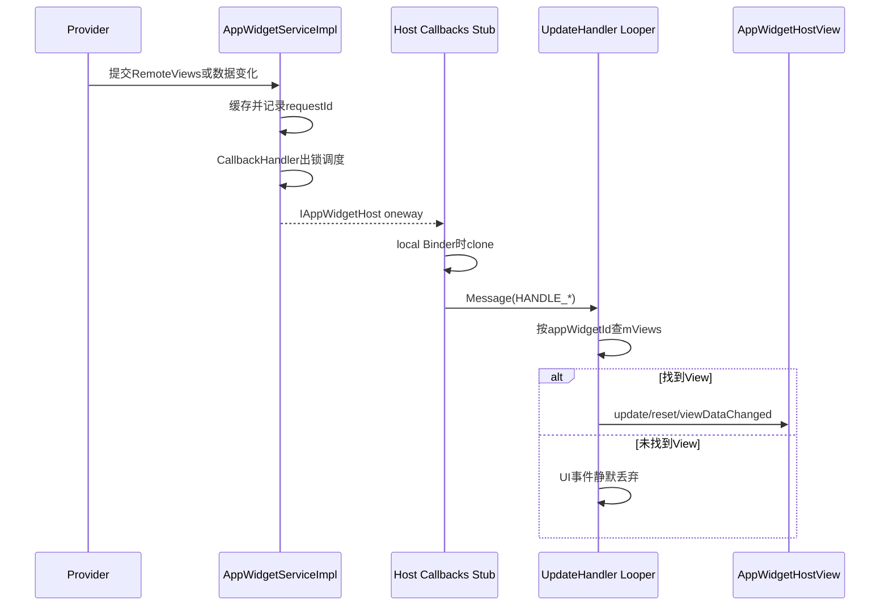
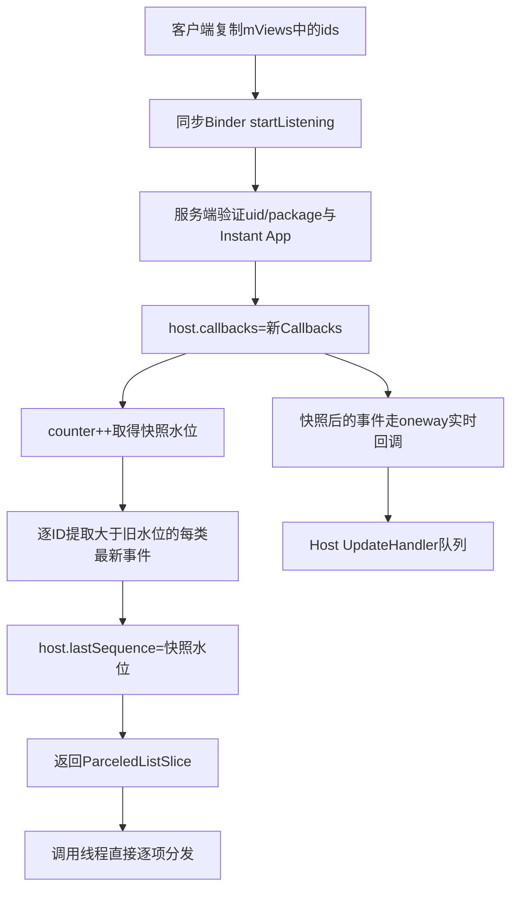
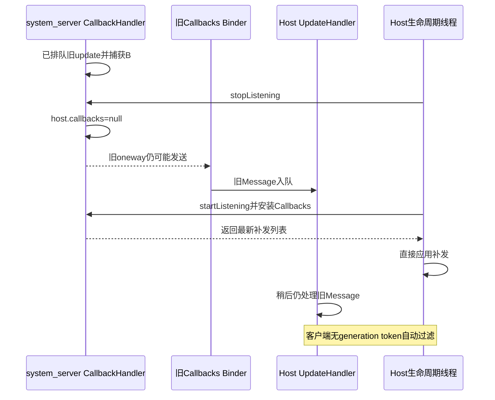

# 第 375 章 Android AppWidgetHost：监听生命周期、Callbacks Binder、断线补发、删除与竞态边界

> 源码基线：Android 11 / API 30 / `android-11.0.0_r48`。本章只在 macOS 阅读源码，不编译。上一章研究单个 `AppWidgetHostView` 如何安全承载内容；本章向外扩一层，跟踪 `AppWidgetHost` 如何把 system_server 的 one-way Binder 回调搬到 Host Looper，再分发给对应 View。重点不是背 API，而是识别三套同时存在的状态：服务端 Host/Widget 账、客户端 `mViews` 映射、两个进程各自的消息队列。

## 1. AppWidgetHost 是哪一层

`AppWidgetHost`是 Launcher等宿主应用与 `AppWidgetServiceImpl`之间的客户端协调器。它分配实例ID、注册回调、创建HostView、查询当前RemoteViews并删除关系；它本身不保存Provider业务UI的权威副本。

## 2. 三个关键对象

客户端有 `AppWidgetHost`、每实例一个 `AppWidgetHostView`和实现 `IAppWidgetHost.Stub`的Callbacks；system_server有Host、Widget、Provider记录。Binder只连接Callbacks与服务，屏幕View从不跨进程传递。

## 3. Host 身份不是只有 hostId

客户端传 `context.getOpPackageName()`和整数hostId；服务端再结合Binder callingUid构造 `HostId(uid, hostId, package)`。不同包或UID可复用同一整数hostId而不等于同一个服务端Host。

## 4. opPackageName 的作用

它用于AppOps归因并让服务端 `enforceCallFromPackage()`验证字符串确实属于调用UID。Host不能只改字符串冒充另一个Launcher包。

## 5. hostId 由宿主定义

hostId不是appWidgetId，也不是Provider ID。一个宿主包可按不同桌面空间或用途划分多个Host；但必须在重启后稳定复用，才能重新接上服务端保存的关系。

## 6. sService 是进程级静态代理

所有AppWidgetHost实例共享静态 `IAppWidgetService sService`。首次构造调用 `bindService(context)`，实际是从ServiceManager取名为APPWIDGET_SERVICE的Binder，不是Context.bindService的组件绑定。

## 7. sServiceLock 只保护初始化

静态锁保护 `sServiceInitialized`和代理赋值，不保护每次远程方法，也不保护实例 `mViews`。不要看到“service lock”就误以为整个Host操作串行。

## 8. 初始化是一次性尝试

源码先把 `sServiceInitialized=true`，再检查feature/config并查询ServiceManager。若当时功能禁用或Binder为null，本进程后续构造不会自动重试。

## 9. 没有注册 DeathRecipient

AppWidgetHost未对sService调用linkToDeath。远程调用遇到 `RemoteException`通常包装成“system server dead?” RuntimeException；它没有在此类中把代理清空并重连。

## 10. 无服务时的返回并不统一

start/stop/delete方法多为直接return，allocate返回-1，getIds返回空数组，createView返回null。调用者应查看每个API，而不能假设统一抛异常或统一返回false。

## 11. Handler 的 Looper 从哪里来

公开构造使用 `context.getMainLooper()`；隐藏构造允许传自定义Looper。Callbacks不直接碰View，而是把消息发送给这个UpdateHandler。

## 12. 没有显式主线程断言

若隐藏调用者提供后台Looper，`updateAppWidget()`和Provider changed最终也在后台线程操作View，可能违反UI线程规则。framework依赖正常Host传主Looper的使用约定。

## 13. mViews 是客户端路由表

`SparseArray<AppWidgetHostView>`以appWidgetId为key，决定回调最终落到哪个View。它不是服务端全部Widget ID清单，也不会持久化到磁盘。

## 14. 为什么用 synchronized(mViews)

create/delete/clear和Handler查找可能来自不同线程，锁保护SparseArray结构。取到View引用后通常在锁外调用View方法，避免把UI执行放在集合锁中。

## 15. 锁没有保护 View 内部

`synchronized(mViews)`只保证映射查找/修改，不保证同一个HostView不会被两个线程同时update。正确线程模型仍需由Looper和调用者维持。

## 16. Callbacks 为什么是静态内部类

静态类不会天然强引用外部AppWidgetHost；它只保存 `WeakReference<Handler>`。system_server长期握着Binder Stub时，弱引用可降低把已丢弃Host整个对象图永久留住的风险。

## 17. 弱引用不是 stopListening 的替代

只要Host仍被Activity、View或其他对象引用，Handler就存在，回调仍会入队。规范生命周期仍应显式stop；弱引用只是在客户端对象确实不可达时提供回收边界。

## 18. UpdateHandler 又持有外部 Host

它是非静态内部类，因此Handler引用AppWidgetHost；但服务端Binder只通过Callbacks弱引用Handler。Host与Handler内部形成的环本身不阻止GC，外部强根才决定是否存活。

## 19. IAppWidgetHost 是 oneway

AIDL声明整个接口为 `oneway`。system_server发update/providerChanged等调用时不等待Host处理完成，也拿不到Host Handler应用RemoteViews的结果。

## 20. oneway 成功的准确含义

调用没有立即RemoteException，大致只说明Binder事务已被接受；随后还要经过Host Binder线程、UpdateHandler队列、RemoteViews apply和layout。不能用服务端last sequence解释为像素已显示。

## 21. 五类回调

接口包含 `updateAppWidget`、`providerChanged`、`providersChanged`、`viewDataChanged`和`appWidgetRemoved`，分别对应内容、单Provider元数据、可用Provider集合、集合数据刷新和实例移除。

## 22. 回调 Stub 运行在线程池

跨进程时AIDL Stub方法由Host进程Binder线程池调用。它们只clone必要对象、获得Handler并发送Message，避免在Binder线程直接inflate和布局。

## 23. 五个 HANDLE 常量

客户端把回调映射为1到5的消息类型。appWidgetId放arg1，viewId放arg2，大对象放obj；UpdateHandler再switch分发。

## 24. Handler 消息携带的是快照引用

跨进程Parcelable已经反序列化成Host对象；发送Message没有再次Parcel。消息从Binder线程交给Looper时依靠MessageQueue同步建立可见性，但对象仍不应被其他线程继续修改。

## 25. 同进程 Binder 为什么 clone RemoteViews

若callingPid等于myPid，AIDL本地调用不会Parcel复制，服务端与客户端可能共享同一RemoteViews引用。Callbacks显式 `views.clone()`，避免Host apply/merge等行为与服务端缓存产生别名。

## 26. ProviderInfo 同样处理本地别名

`providerChanged()`在local Binder且info非null时调用clone。正常Launcher与system_server跨进程已有Parcel隔离；这个分支主要覆盖同进程测试或特殊系统部署。

## 27. local Binder 判断只比较 PID

`Process.myPid()==Binder.getCallingPid()`不比较UID。它关心是否绕过Parcel产生对象共享，而不是做授权判断；安全校验在服务入口完成。

## 28. Handler 已被回收时静默丢弃

WeakReference.get返回null，Callbacks直接return，不通知服务端。由于接口oneway，服务端可能仍把事务视为成功并推进水位，这是弱生命周期与可靠交付之间的折中。

## 29. 回调完整路径图

## 30. system_server 也先经过 Handler

服务在mLock内只构造SomeArgs并投递到 `mCallbackHandler`；真正Binder回调在该Handler处理。这样避免大多数跨进程调用持有全局AppWidget锁。

## 31. 调度时捕获 callbacks 引用

SomeArgs保存当时的 `widget.host.callbacks`。稍后即使stopListening把Host字段清空，已排队消息仍握有旧Binder接口并可能继续调用。

## 32. 服务端没有在发送前重新比对

handleNotify方法直接调用捕获的callbacks，未检查它是否仍等于host.callbacks。因此stopListening不是服务端队列的硬屏障。

## 33. RemoteException 的处理

内容、Provider、移除和providersChanged失败时，服务端在锁内把 `host.callbacks=null`；集合数据变化失败还进入RemoteViewsFactory的离线刷新兜底。

## 34. 旧回调失败可能影响新注册

由于失败处理未做 `host.callbacks==capturedCallbacks`比较，理论上旧消息在新startListening已替换callback后才失败，仍可能把新字段清null。分析竞态时要看CallbackHandler序列与Binder时序，不能只看字段最终赋值。

## 35. 服务端水位是什么

Host记录 `lastWidgetUpdateSequenceNo`，表示服务端认为成功送到callback的最近requestId。它不是客户端Handler ACK，也不是每个View独立水位。

## 36. 水位在 Binder 调用返回后推进

handleNotify成功执行oneway代理调用后就赋requestId。Host Stub可能只把消息排队，甚至弱Handler已null而静默return；水位仍可能前进。

## 37. Widget 还保存每类最新序号

`updateSequenceNos`以特殊ID记录最新完整View/Provider变化，并以真实viewId记录集合数据变化。相同类别的新事件覆盖旧requestId，天然压缩历史。

## 38. Provider changed 会清旧类别

scheduleProviderChanged先clear整个updateSequenceNos，只留下ProviderChanged requestId。它表达元数据/初始布局重置后，旧View与旧集合刷新不再作为断线补发基线。

## 39. Widget removed 没有留下 Widget 对象

删除后无法继续在对象上保存序号；startListening若请求的ID不再属于Host，`getPendingUpdatesForId()`合成 `TYPE_APP_WIDGET_REMOVED`。

## 40. startListening 客户端先收集哪些 ID

它在mViews锁内复制当前所有key成int数组。只分配但尚未createView的服务端Widget不会进入本次补发请求。

## 41. callbacks 注册覆盖旧值

服务端查找或创建Host后直接 `host.callbacks=callbacks`。重复start不会增加监听器列表；一个Host身份同时只保存一个Callbacks Binder。

## 42. Instant App 不能作为 Host

服务端若判断callingPackage是instant app，返回空更新列表且不继续建立可用托管关系。客户端方法本身不会抛出特定异常提示。

## 43. startListening 是同步 Binder 调用

与IAppWidgetHost回调不同，IAppWidgetService.startListening有返回值，不是oneway。调用线程会等待服务端生成 `ParceledListSlice<PendingHostUpdate>`并反序列化。

## 44. 为什么需要 ParceledListSlice

补发列表可能较大，BaseParceledListSlice支持分片跨Binder传输，避免把所有Parcelable强行内联进一次Parcel；客户端随后 `.getList()`取得完整List。

## 45. 客户端没有校验 updates 为 null

正常服务返回非nullslice/list；若异常实现违反契约，`updates.size()`会NPE。framework信任系统服务接口契约。

## 46. 建立补发快照的水位点

服务端在锁内先递增全局UPDATE_COUNTER得到 `updateSequenceNo`，然后为每个请求ID收集大于旧Host水位的最新事件，最后把Host水位设为这个快照值。

## 47. 新事件为何不应落进缝隙

收集和设置水位都持有mLock。需要同一锁记录的新Widget更新只能在锁释放后获得更大的requestId并走已注册callbacks，因此原则上处于“补发快照之后”的事件会走实时回调。

## 48. 补发不是完整事件日志

每个类别只保留最新requestId，同一View多次更新或同一collection多次notify不会逐条重放。目标是让Host收敛到当前状态，不是复现每个历史瞬间。

## 49. 单个 ID 内按 requestId 排序

服务端把事件放入LongSparseArray，key为requestId，因此对一个appWidgetId导出时从小到大。ProviderChanged通常已清掉更早类别。

## 50. 多个 ID 不是全局排序

外层按客户端 `idsToUpdate`顺序逐个ID收集，每轮clear临时map并追加到outUpdates。ID A的较新事件可能排在ID B的较旧事件前；它不是所有Widget全局requestId归并排序。

## 51. mViews 的 key 顺序

SparseArray按整数key有序，因此idsToUpdate通常按appWidgetId升序，而不是View创建时间或屏幕层级顺序。多ID补发顺序不应被用于动画因果关系。

## 52. 合成 removed 使用旧 Host 水位

找不到请求ID时，用 `lastWidgetUpdateSequenceNo`作为临时map key放removed。该值主要为了进入返回结构；PendingHostUpdate本身不把requestId Parcel给客户端。

## 53. PendingHostUpdate 不暴露序号

对象只含type、appWidgetId以及对应payload。客户端无法验证补发序号、去重或与实时回调做严格代际比较，只能按到达顺序执行。

## 54. startListening 的客户端补发是直接调用

Binder返回后，for循环直接调用update/onProviderChanged/viewDataChanged/remove，不经过mHandler。因此它们运行在调用startListening的线程。

## 55. 正常生命周期要求主线程调用

文档建议Activity.onStart调用，通常是主线程，因而直接补发仍安全。若后台线程调用startListening，补发会直接改View，而实时回调却在构造时指定Looper，形成线程不一致。

## 56. 实时回调可能与补发交错

服务端先安装callbacks再返回列表；快照后的事件可开始走oneway。正常同一主Looper下实时消息需等当前startListening返回后处理，但自定义Looper或其他调用线程下可并发交错。

## 57. 客户端没有 generation token

Message里只有类型和ID，没有“第几次start”的世代号。stop后残留消息、再次start的补发和新实时回调无法在客户端自动按代过滤。

## 58. startListening 补发流程图

## 59. 四种补发类型

PendingHostUpdate支持views、provider、viewData和removed，没有providersChanged。Provider集合在停止期间变化不会作为这份按实例列表补发。

## 60. providersChanged 是易失通知

它提醒Host重新查询可用Provider列表，但服务端不为它维护Widget序号；stop期间错过后，Host应在合适生命周期主动查询，而不是等待start补历史通知。

## 61. stopListening 做什么

同步调用服务端，验证Host身份后将 `host.callbacks=null`，可能prune空Host，并把该Host关联Provider UID的AppOps Widget visibility更新为false。

## 62. stop 不清 mViews

客户端仍保留HostView映射和屏幕对象，以便下一次start继续使用。stop表示暂停接收，而不是删除实例或销毁画面。

## 63. stop 不移除 Handler 消息

AppWidgetHost没有 `mHandler.removeCallbacksAndMessages()`。已进入Host消息队列的update/providerChanged/remove仍可在stop之后执行。

## 64. stop 也不撤销 RemoteViews 异步 apply

它不访问每个HostView的CancellationSignal。若之前View已启动后台inflate，仍可能完成并提交；暂停Binder监听与取消UI任务是两件事。

## 65. stop 后新更新如何保存

服务端仍更新Widget.views和updateSequenceNos，只因callbacks为空而不实时发送。下次start根据水位和每类最新序号生成收敛性补发。

## 66. stop 时 unbound Widget 的风险点

服务端随后调用 `host.getWidgetUids()`，r48实现直接解引用每个 `widget.provider.id`，没有provider null检查；而allocate后未bind的Widget允许provider为空。该组合存在NPE风险，解释时应标为源码审计发现而非理想契约。

## 67. pruneHost 的条件

只有 `host.widgets.size()==0 && host.callbacks==null`才从mHosts移除。stop一个仍有Widget的Host只清callback，不删除持久关系。

## 68. update 回调怎样路由

UpdateHandler调用 `updateAppWidgetView(id,views)`；它锁内取mViews映射，锁外执行 `v.updateAppWidget(views)`。找不到ID时静默丢弃。

## 69. 未创建 View 不代表服务端没 Widget

Host可能已allocate/bind但尚未createView。实时更新到来时客户端映射无目标而丢弃；之后createView会同步调用getAppWidgetViews取得服务端当前缓存，重新收敛。

## 70. createView 是 final 编排方法

子类不能覆写完整流程，只能覆写 `onCreateView()`返回自定义AppWidgetHostView。这保证click handler、setAppWidget、映射登记、查询当前views和初次update的基本次序。

## 71. onCreateView 的默认实现

返回 `new AppWidgetHostView(context,mOnClickHandler)`。随后final方法又调用 `view.setOnClickHandler(mOnClickHandler)`，默认实现中handler会被设置两次但语义相同。

## 72. 自定义 onCreateView 不能返回 null

源码立即调用view方法，没有null检查。子类若返回null会在客户端NPE，而不会退回默认HostView。

## 73. setAppWidget 在入表之前

createView先设置click handler和Widget元数据，再把View放进mViews。这保证后续回调命中时，View已有appWidgetId、ProviderInfo和padding。

## 74. 入表早于 getAppWidgetViews

View注册后才同步查询服务端当前RemoteViews。这样查询期间到来的回调至少能找到对象；但不同Looper/线程仍可能与最后的初始update交错。

## 75. 同一 ID 再 create 会覆盖映射

`mViews.put(id,view)`替换旧引用，却不会自动从Launcher视图层级移除旧HostView。旧View若仍显示，将不再收到后续AppWidgetHost路由更新。

## 76. 查询失败留下局部状态

若getAppWidgetViews抛RemoteException，方法已把新View放进mViews，然后抛RuntimeException；没有回滚映射。调用者重试前应意识到客户端状态已经改变。

## 77. 初次 views 为 null 的含义

HostView.updateAppWidget(null)进入上一章的DEFAULT路径，显示initialLayout或错误占位。null不是create失败，也不是自动删除实例。

## 78. createView 不自动 add 到屏幕

它只返回HostView；Launcher仍需把它放进自己的容器、设置单元格LayoutParams并参与measure/layout。服务端不知道其屏幕坐标。

## 79. ProviderChanged 与普通 update 不同

ProviderChanged表示Provider APK/元数据变化。客户端先把AppWidgetProviderInfo复杂尺寸按Host DisplayMetrics转换，再对现有View调用resetAppWidget，强制回到新initialLayout。

## 80. updateDimensions 在查 View 前执行

即使mViews中没有对应View，方法也会修改传入info的尺寸字段，然后找映射。这个对象随后没有被AppWidgetHost缓存；无View时这次UI元数据更新就结束。

## 81. info 为 null 会直接崩

`onProviderChanged()`没有null保护，第一句就 `appWidget.updateDimensions()`。系统协议正常应提供info；恶意或错误本地实现传null会导致Handler线程NPE。

## 82. reset 为什么先展示默认布局

Provider更新后旧RemoteViews的layout/resource可能已失效。reset写入新info、重置模式并update null，让Host使用新initialLayout，等待Provider随后发新业务内容。

## 83. providersChanged 默认什么都不做

protected hook为空，Launcher子类可覆写后刷新Widget选择器。它不是某个已放置Widget的内容更新，也不携带包名或变化差异。

## 84. onAppWidgetRemoved 是另一个 hook

dispatch方法先从mViews移除ID，再调用公开空实现。子类可清理Launcher数据库和页面；此时通过Host路由已找不到旧View。

## 85. removed 回调不等同 delete API 返回

服务端删除可能异步发oneway removed；客户端主动delete也先本地remove再同步请求。hook何时运行取决于是否收到/补发removed消息，不应拿它当同步delete完成回调。

## 86. viewDataChanged 的客户端落点

Handler按Widget ID找到HostView，再调用其 `viewDataChanged(viewId)`。目标是某个AdapterView ID，不是整个Widget重新apply RemoteViews。

## 87. BaseAdapter 的快速刷新

若Adapter存在且是BaseAdapter，调用notifyDataSetChanged；若adapter尚为null且View实现RemoteAdapterConnectionCallback，则标记defer，等远端Factory连接后再刷新。

## 88. 其他 Adapter 可能无动作

adapter非null但不是BaseAdapter时，这段HostView代码不调用通用刷新接口；找不到View或目标非AdapterView也静默返回。Provider发错viewId不会自动显示错误画面。

## 89. Host 离线时的数据刷新兜底

system_server发送viewDataChanged失败或无可用callbacks时，会查该Widget关联RemoteViewsService，临时bind并调用Factory `onDataSetChangedAsync()`，避免数据源完全不刷新；屏幕仍待Host重连后读取。

## 90. allocateAppWidgetId 只建空关系

客户端同步请求一个ID；服务端创建Widget并挂到Host，但provider仍为null，异步保存状态。之后还需bindAppWidgetId或用户授权流程。

## 91. allocate 返回 -1 的两种语境

客户端sService为null直接返回-1；服务端Instant App路径也返回INVALID_APPWIDGET_ID。调用者不能仅凭-1区分功能未初始化与身份不允许。

## 92. getAppWidgetIds 查服务端账

它返回当前Host身份绑定/分配的所有ID，不依赖mViews。可用于进程重建后先恢复Launcher数据库与HostView，再startListening。

## 93. mViews 与 getIds 可能不同

服务端有ID但页面尚未createView，或本地clearViews后，getIds仍有而mViews无；本地旧映射也可能因远端删除回调尚未处理而短暂多出ID。

## 94. deleteAppWidgetId 的客户端顺序

方法进入mViews锁，先remove本地View映射，再在同一锁内同步调用服务端delete。远端成功后服务端拆Widget/Provider/Host关系并保存。

## 95. 锁内远程调用是性能边界

若system_server调用缓慢，其他需要mViews锁的create/clear/Handler查找会等待。oneway Host回调本身能进Binder线程，但其Handler随后可能卡在该锁。

## 96. 远程失败不会恢复本地映射

remove已经发生，RemoteException再抛RuntimeException；源码没有把旧View put回去。服务端可能仍保留Widget，而客户端暂时不再路由更新。

## 97. delete 不从 Launcher 容器移除 View

删除mViews只是路由表操作，实际View是否还在页面树由宿主负责。子类通常还要同步自己的数据库和布局。

## 98. deleteHost 的范围

服务端删除这个Host身份及其全部Widget关系，用于Host数据库被清空或彻底释放资源。它不是stopListening的重型版本，调用后未来关系需重新分配。

## 99. deleteHost 不清客户端 mViews

AppWidgetHost方法只发远程请求，没有 `mViews.clear()`。调用者若继续保留页面，会出现本地View与服务端已删除关系分叉，应自行clear/remove。

## 100. deleteAllHosts 的范围

静态API让服务端删除调用包/UID的所有Host记录，而非只删某个hostId。由于是进程共享服务代理，使用前要明确这是包级破坏性操作。

## 101. clearViews 只影响客户端

protected `clearViews()`仅清SparseArray，不stop、不delete服务端Widget，也不移除Launcher页面。它适合子类重建UI路由，不是资源释放的完整操作。

## 102. 配置 Activity 的代理启动

`startAppWidgetConfigureActivityForResult()`让服务端为已绑定Widget创建IntentSender，适合Provider在另一profile、Host不能直接跨profile启动Activity的情况。

## 103. 没有配置 Activity 时

服务返回null，客户端抛ActivityNotFoundException；IntentSender发送异常也转换成同一异常。RemoteException则仍包装为system server dead RuntimeException。

## 104. 配置结果不自动决定删除

若用户取消配置，Host通常应调用deleteAppWidgetId清理先前allocate的空/已绑定实例。AppWidgetHost不会根据Activity result自动回收。

## 105. 生命周期的推荐配对

Activity可见时start，离开可见状态时stop；页面重建时根据持久数据库/getIds创建Views。不要在每次onResume反复create同一ID，也不要把stop误当delete。

## 106. 三套状态为何会短暂分叉

服务端关系通过Binder和异步XML保存，客户端映射按UI创建删除，消息队列又延迟交付。系统选择最终收敛而非跨进程事务，所以故障分析必须注明观察时刻和线程。

## 107. 停止与重启监听竞态图

## 108. 排障先画线程而非只看API顺序

至少标出调用start/stop的线程、system_server mCallbackHandler、Host Binder线程和UpdateHandler Looper。代码书写先后不等于跨队列实际执行先后。

## 109. 排障再画三个账本

记录服务端Host.widgets/callbacks/watermark、客户端mViews、Launcher页面/数据库。比如“屏幕仍有View但不更新”可能只是mViews已remove，而非Provider没有发更新。

## 110. 日志成功也不是UI成功

服务端oneway调用返回后推进水位；Host Stub又只是sendMessage；HostView可能异步apply、被取消或layout失败。要从request生成一直跟到HostView模式和首帧日志。

## 111. 本章最重要的四个否定句

stop不清已排队消息，clearViews不删服务端关系，deleteHost不清客户端View，start补发不重放完整历史。记住这四句，生命周期设计就不易写出隐蔽分叉。

## 112. macOS 只读练习一：追一条实时更新

执行 `sed -n '70,170p' frameworks/base/core/java/android/appwidget/AppWidgetHost.java`和 `sed -n '1960,2030p' frameworks/base/services/appwidget/java/com/android/server/appwidget/AppWidgetServiceImpl.java`，手绘system CallbackHandler、Binder Stub、Host Handler和HostView四段线程，只读不编译。

## 113. macOS 只读练习二：验证断线补发压缩

执行 `sed -n '842,890p' frameworks/base/services/appwidget/java/com/android/server/appwidget/AppWidgetServiceImpl.java`及 `sed -n '4100,4170p'`同一文件。假设两个Widget各有三类序号，算出旧水位后会返回哪些项，并验证跨ID为何不是全局排序。

## 114. macOS 只读练习三：比较 stop、clear、delete

执行 `rg -n "stopListening|clearViews|deleteAppWidgetId|deleteHost|deleteAllHosts" frameworks/base/core/java/android/appwidget/AppWidgetHost.java`，做一张两列清单：是否改mViews、是否改服务端Host/Widget、是否清Handler队列、是否移除真实页面View。

## 115. macOS 只读练习四：复盘 createView 失败窗口

执行 `sed -n '390,430p' frameworks/base/core/java/android/appwidget/AppWidgetHost.java`，逐句标出对象创建、handler设置、info设置、入mViews、远程查询和初次update。回答远程查询抛异常后哪些客户端状态已发生，仍只阅读不运行Launcher。

## 116. 排障清单：start 后没有首屏

确认mViews在start前是否已有目标ID；若没有，补发不会请求该ID，应先createView或靠createView的getAppWidgetViews收敛。再检查start调用线程、服务是否null、Provider current views是否null以及默认布局是否失败。

## 117. 排障清单：stop 后仍看到一次更新

检查system_server CallbackHandler是否已捕获旧callbacks、Host Binder是否已把Message排入Looper，以及HostView是否已有异步apply。一次尾部更新符合源码边界，不代表stop完全无效。

## 118. 排障清单：删除后旧卡片还在

区分mViews路由、Launcher真实View树和Launcher数据库。deleteAppWidgetId只自动处理前者与服务端关系；宿主仍需从父容器移除View并保存自己的布局状态。

## 119. 排障清单：重连后显示旧内容

检查补发与残留实时Message的交错、是否重复create同一ID覆盖映射、HostView异步旧任务是否被新任务取消，以及服务端watermark是否在弱Handler静默丢弃时已前进。必要时用getAppWidgetViews重新取得当前态。

## 120. 本章结论与下一章入口

AppWidgetHost用Callbacks弱引用、oneway Binder和指定Looper把系统回调安全搬到UI侧，并用服务端全局水位与每Widget分类序号在停听后补“最新状态”。它追求最终收敛，不提供端到端ACK、完整历史或stop硬屏障；删除、清View和停止监听也各改不同账本。下一章继续进入AppWidgetServiceImpl的CallbackHandler、requestId压缩与死亡处理，专门审计服务端通知可靠性和跨线程水位竞态。
