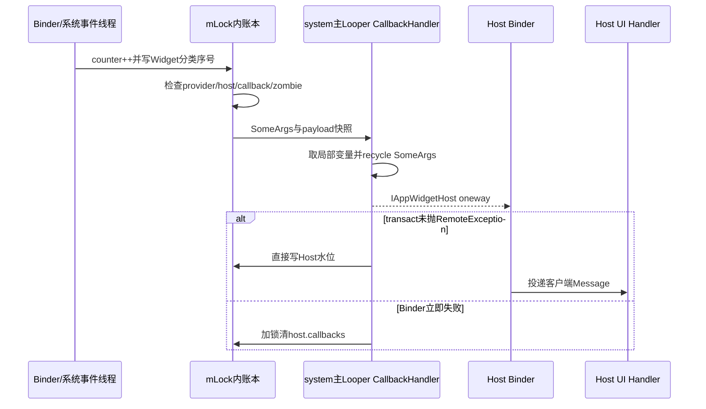
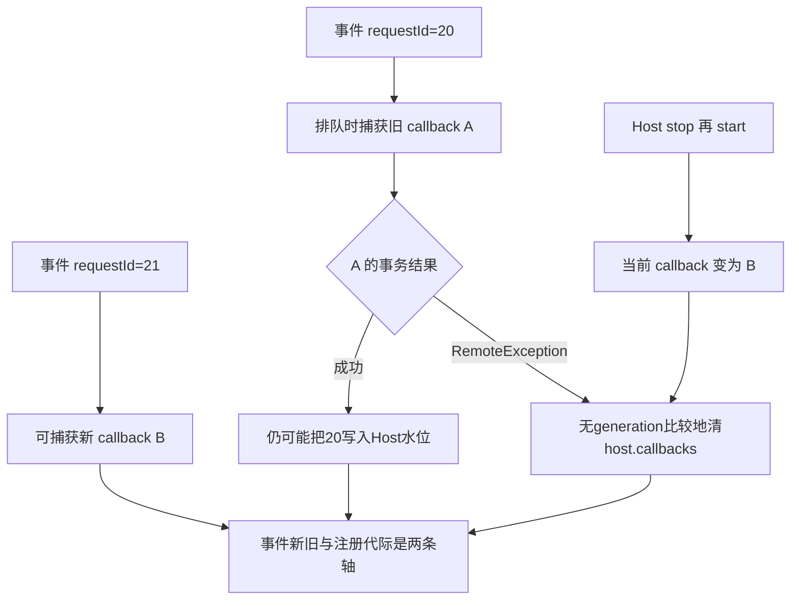
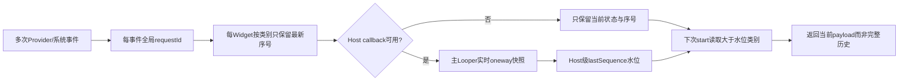

# 第 376 章 Android AppWidgetService 通知可靠性：序号压缩、CallbackHandler、Binder 死亡与水位竞态

> 源码基线：Android 11 / API 30 / `android-11.0.0_r48`。本章只在 macOS 阅读源码，不编译。上一章从Host客户端观察监听与补发；本章站到system_server内部，逐段审计“记录更新—排队—oneway发送—推进水位—失败重连”。核心结论是：这是一套追求最新状态收敛的通知系统，不是端到端确认队列；requestId有序，也不等于所有跨线程状态被同一把锁线性化。

## 1. 先分清三种数字

全局 `UPDATE_COUNTER`给每次通知请求分配requestId；每个Widget的 `updateSequenceNos`保存各类别最新requestId；每个Host的 `lastWidgetUpdateSequenceNo`保存服务端认为已送达该Host的水位。三者用途不同。

## 2. UPDATE_COUNTER 的类型

它是静态 `AtomicLong`，从system_server进程内所有用户、Host和Widget共享的0开始递增。原子递增保证requestId唯一且有全局数值顺序。

## 3. 静态不等于跨重启持久

system_server重启后AtomicLong重新从默认值开始，requestId不写入AppWidget XML。Host水位和Widget updateSequenceNos同样是运行时字段，因此这套比较只服务当前服务进程生命周期。

## 4. 为什么用 long

高频更新下int较易回绕，long实际耗尽几乎不可达。但long足够大不代表并发可见性自动成立；字段是否volatile、是否同锁访问是另一问题。

## 5. 两个保留类别 ID

`ID_VIEWS_UPDATE=0`、`ID_PROVIDER_CHANGED=1`作为SparseLongArray key；真实Android资源ID不会使用这两个小值，因此collection的viewId可直接作为其他key。

## 6. 错误 viewId 0/1 被拒绝

`scheduleNotifyAppWidgetViewDataChanged()`看到viewId等于两个保留常量就return，避免Provider伪造集合刷新覆盖完整View或ProviderChanged序号。

## 7. 其他非法 ID 仍可记录

例如View.NO_ID=-1未被过滤，可能进入序号表并回调Host；Host findViewById找不到后静默结束。服务端只防内部key冲突，不替Provider验证目标确实是AdapterView。

## 8. updateSequenceNos 是分类最新值

Widget用 `SparseLongArray`保存 `categoryKey -> requestId`，初始容量2只是优化，不是最多两项。多个collection viewId可各占一个条目。

## 9. 完整 View 更新会覆盖同类历史

每次 `put(ID_VIEWS_UPDATE,newId)`替换旧值。Host离线十次RemoteViews更新，重连通常只需要服务端缓存的最终effective views和最后一次序号。

## 10. 同一个 collection 也压缩

同一viewId多次notify只保留最后requestId；不同viewId分别保留。它表达“这些数据源已脏”，不是精确记录每次数据变化。

## 11. ProviderChanged 是代际重置

它先clear整个updateSequenceNos，再append provider changed。旧layout对应的RemoteViews和collection刷新不应在新ProviderInfo之后被补发。

## 12. ProviderChanged 后常紧跟 View 更新

`updateAppWidgetProviderInfo()`对每个Widget先schedule providerChanged，再调用updateAppWidgetInstanceLocked重新通知views；序号表最终含新代provider和views两项，按requestId恢复顺序。

## 13. Removed 清空实例序号

schedule removed先clear Widget序号，但删除后Widget对象会离开全局表；下次Host请求旧ID时，由Host.getPendingUpdatesForId合成removed，而不是从该数组读取。

## 14. requestId 在无监听时也产生

各schedule方法先increment并写Widget序号，之后才检查callbacks/zombie/provider。Host离线时事件仍留下“最新状态”标记，正是重连补发的基础。

## 15. null Widget 也会消耗序号

方法先increment，再判断widget是否null。虽然正常Locked调用通常传有效对象，但错误/特殊调用会让全局计数出现空洞；requestId只要求单调唯一，不要求每个值都有事件。

## 16. 序号不是持久业务版本

Provider不能读取它，Host收到PendingHostUpdate也看不到它。它只在AppWidgetServiceImpl内部比较“是否比Host水位新”。

## 17. schedule 与 handle 两阶段

schedule阶段通常在mLock内更新账、clone payload并投递SomeArgs；handle阶段在CallbackHandler线程取出参数，执行Binder回调并改Host水位。

## 18. 为什么必须出锁回调

Host属于另一个进程，Binder即使oneway也可能因驱动队列、目标死亡等耗时。若持全局mLock调用，会阻塞所有Widget增删改查并放大跨进程死锁风险。

## 19. 出锁的代价

SomeArgs是调度时快照：Host可能已stop/delete，callbacks可能已替换，Widget内容可能又更新。handle阶段不重新查当前账，因此可能发送已过时但曾合法排队的通知。

## 20. CallbackHandler 在哪个线程

onStart中使用 `new CallbackHandler(mContext.getMainLooper())`，所以所有Host出站回调共用system_server主Looper，而非BackgroundThread或独立ServiceThread。

## 21. 这条主线程边界很重要

代码已避免在主线程inflate RemoteViews，但仍会Parcel/发Binder事务。目标进程死亡通常快速失败；若oneway异步缓冲拥塞，Binder调用仍可能使system_server主线程承压。

## 22. 五类消息共享一个队列

View update、Provider changed、providers changed、viewData changed和removed都由同一个CallbackHandler按入队顺序处理，某个Host的大payload或Binder问题会延后其他Host通知。

## 23. Handler 非异步消息

构造 `super(looper,null,false)`，第三个参数false表示普通同步Handler。若主Looper消息队列存在同步屏障，这些通知不享有异步穿越特权。

## 24. SomeArgs 为什么使用对象池

它避免每次通知创建多个包装对象；handler读取字段后立即 `args.recycle()`。回收只减少分配，不改变payload对象本身的生命周期。

## 25. recycle 发生在 Binder 调用前

CallbackHandler先把字段复制到局部变量并回收SomeArgs，再调用handleNotify。局部变量仍强引用Host/callback/payload，池复用不会把本次参数改掉。

## 26. RemoteViews 在排队前 clone

schedule update把effective views clone后放SomeArgs，隔离服务端后续merge/替换。否则队列等待期间同一对象被修改，早事件可能意外携带晚状态。

## 27. clone 仍可能很重

RemoteViews clone通过Parcel重建对象图，包含Actions和Bitmap缓存；它在schedule调用线程、通常持mLock时执行。出站Binder虽出锁，克隆成本仍会延长全局锁占用。

## 28. ProviderInfo 没在schedule处clone

SomeArgs直接存 `widget.provider.info`。跨进程Binder会Parcel快照；同进程Host由客户端Callbacks检测local Binder再clone。排队等待期间若服务端原地修改同一info，旧通知可能观察新字段。

## 29. 基本通知流水线

## 30. 普通发送成功的水位写没有加锁

update、provider、viewData和removed在try内直接 `host.lastWidgetUpdateSequenceNo=requestId`。CallbackHandler位于主线程，此时未持mLock。

## 31. startListening 在另一线程访问水位

服务端Binder线程进入startListening后持mLock读取旧水位并写快照水位。字段不是volatile，成功回调写又不使用同锁，形成正式的数据竞争。

## 32. AtomicLong 不能修复 Host 字段可见性

AtomicLong只保障counter本身。requestId随后写入普通long字段并不能继承一套永久的volatile同步关系给其他任意字段访问。

## 33. 可能看到陈旧水位

按Java内存模型，start Binder线程不保证立刻看到主线程无锁写入的最新lastSequence，可能把已发事件再次判断为pending。重复补发通常幂等收敛，但会增加apply和Factory刷新。

## 34. 不能轻率断言一定撕裂

具体ART/架构可能让对齐long读写原子，但源码层仍缺少可见性与共同锁保证。文档应说“存在JMM数据竞争/陈旧风险”，而不是声称每台设备必然读到半个long。

## 35. 水位还可能数值倒退

若旧requestId=10已排在CallbackHandler，startListening先把Host水位写成快照11，随后旧消息成功发送又无条件写10，字段从11退回10。

## 36. FIFO 为什么没完全避免倒退

CallbackHandler内部消息按队列有序，但startListening在独立Binder线程直接写字段，不经过该队列。跨线程插入的快照写破坏了“只由队列单调推进”的假设。

## 37. 倒退的常见后果是重复

下一次start可能把序号大于10但其实已包含在上次快照边界内的最新类别再次补发。由于只保留每类最新值，通常不会还原完整旧历史，但会做额外工作。

## 38. 更稳健实现需要什么

可在同锁下用 `max(old,requestId)`，或把水位声明/访问按统一并发协议处理，并为callback代际做token比较。这里只用于理解，不在本学习任务中修改源码。

## 39. oneway 不提供应用层 ACK

Host Stub执行成功也只是Message入队；HostView apply可能失败、被取消或找不到mViews。服务端无法据此回退水位。

## 40. Weak Handler 丢弃仍被视为送达

Host Callback Binder对象仍活着但其WeakReference已null时，Stub直接return且oneway不报错；system_server照常写水位，重连补发可能不再包含该事件。

## 41. “成功收到”注释要保守解释

Host字段注释称successfully sent/received，结合实现最多是服务端代理调用未立即失败，不是HostView确认。源码注释应与真实协议一起阅读。

## 42. 发送前的共同过滤

update/provider/removed通常检查widget、provider非null、provider非zombie、host callback非null和host非zombie；viewData额外要求widget.host非null。任一失败就只留序号而不入队。

## 43. update 的 payload 是 effective views

调用方传入真实views或maskedViews选择结果，schedule再clone。Host看到的是策略遮罩后的当前画面，不一定是Provider最后提交的原始RemoteViews。

## 44. update 允许 views 为 null

SomeArgs中null合法，Host会进入默认布局路径。`arg3`仅在非null时clone，不把null当调度失败。

## 45. Provider changed payload 的风险

调度时只保存ProviderInfo引用；Provider包继续更新或对象被替换时，排队消息指向的是旧对象或旧对象后来被原地改动，精确行为取决于更新代码是替换还是修改。

## 46. Removed 要求 provider 非 null

未绑定Widget被删除时provider为null，schedule removed清序号后直接return，不通知Host。主动删除客户端本已移除映射；重连请求旧ID时仍可通过“找不到”合成removed。

## 47. Removed 调度发生在摘全局表之后

`removeWidgetLocked()`先从mWidgets删除，再调用onWidgetRemoved和schedule removed；Widget对象此时仍暂存host/provider引用，足以构造回调。

## 48. Removed 不是持久队列项

对象很快被拆边，服务端只靠“请求ID已不存在”在start时合成。若客户端也已忘记该ID、不把它放进idsToUpdate，就不会收到补发removed。

## 49. providersChanged 没有 requestId

调度不increment counter、不写Widget序号，handle成功也不改Host水位。它是Host组级易失提示，与按实例可靠补发机制分离。

## 50. providersChanged 按 profile group 广播

服务端取得enabled group profile IDs，遍历mHosts，只给Host user位于该组且非zombie、有callback的对象排消息。

## 51. 反向遍历不是优先级

Host列表从末尾到0遍历只是常见安全/实现习惯，没有排序契约。客户端不应依赖某个Launcher先收到Provider集合变化。

## 52. host null 检查位置多余

循环已经从mHosts取出并先调用 `host.getUserId()`，后面才检查host==null；列表按设计不含null，因此这不是有效的null防线。

## 53. Provider集合变化无差异payload

回调没有包名、用户或新增/删除类型，Host需重新查询完整Provider集合并自行diff。连续变化可被Looper排成多个相同提示。

## 54. RemoteException 表示什么

常见是Host进程死亡或Binder对象失效，代理事务立即失败。它不代表HostView应用RemoteViews失败，因为该失败发生在另一个进程的更后阶段。

## 55. update失败会记录日志

catch在mLock内打印“Widget host dead”并把host.callbacks清null。后续更新只记录序号，等待重新start。

## 56. provider/removed/providersChanged 类似

它们也在失败后加锁记录并清callback，但没有从mHosts删除；Host仍被Widget关系引用，未来可用同身份重连。

## 57. viewDataChanged 处理不同

catch只把局部变量callbacks设null，之后统一进入mLock：若null则清host.callbacks，并为关联RemoteViewsService临时bind调用Factory刷新。

## 58. viewData 成功也不保证列表刷新

成功只代表Host callback事务接受；客户端可能找不到View/Adapter，或Adapter非BaseAdapter。服务端不会收到UI层处理结果。

## 59. Factory 离线刷新目的

Host不可达时仍让Provider进程的数据Factory执行onDataSetChangedAsync，使数据源准备最新内容；下次Host连接RemoteViewsAdapter时可读取新数据。

## 60. 离线刷新按服务引用表扫描

服务遍历 `(providerUid,FilterComparison) -> widgetId Set`，仅对Set包含目标appWidgetId的Service建立临时连接。

## 61. 一个 Widget 可触发多个 Service

如果引用表中多项都包含该ID，循环会分别bind；没有“只刷新viewId对应Service”的映射，因为通知参数只有View ID，持久引用表按Intent/Widget关联。

## 62. bind 是 best effort

连接后取IRemoteViewsFactory，调用oneway异步刷新并unbind。失败只log；没有持久重试队列或完成ACK。

## 63. callbacks 局部置 null 的双重作用

它既标记需要清服务端Host callback，也选择触发Factory兜底。成功发送时不做兜底，即使Host客户端随后丢弃消息。

## 64. 捕获旧 callback 的问题

schedule把当时callback存SomeArgs；stop再start可能安装新对象，旧事务失败时catch无条件 `host.callbacks=null`，没有检查当前字段是否还是那个旧对象。

## 65. 旧死亡可误清新连接

在特定并发时序下，新start已成功写入callback，旧SomeArgs随后RemoteException，catch把新callback也清掉。后续更新转离线，直到Host再次start。

## 66. 这不是 Binder death recipient

服务没有为每Host callback显式linkToDeath；它通过实际通知RemoteException发现死亡。若长期没有通知，死callback可暂留字段，但通常不占用Host进程资源。

## 67. 为什么不立即prune Host

Host仍可能有Widget关系，需要保存和断线补发。仅callback死亡不能删除Widget；否则Launcher短暂重启会导致桌面实例丢失。

## 68. start 会直接替换死 callback

同HostId调用startListening后 `host.callbacks=newCallbacks`，无需先stop。只要没有旧失败竞态再清它，实时通知即可恢复。

## 69. 服务端无 callback generation

SomeArgs没有registration epoch，Host也没有代际字段。只有Binder对象引用和requestId，无法同时判断“事件新旧”和“监听注册新旧”。

## 70. requestId 不能替 generation

它标识更新事件，不标识Callback注册。一个旧requestId完全可能通过新callback补发，一个新requestId也可能已捕获旧callback。

## 71. 水位是 Host 级而非 Widget 级

一个Host所有Widget共享lastSequence。某Widget事件成功可把水位越过另一Widget尚未成功的较小序号，可靠性依赖同一CallbackHandler队列通常按requestId顺序发送。

## 72. 同队列 FIFO 提供了什么

在所有schedule都持mLock按increment后立即入同一Handler的正常路径，较小requestId先入队，减少跨Widget越过未送事件的机会；这是实现结构效果，不是字段级事务证明。

## 73. start 快照是队列外写入

Binder线程把水位直接设为新counter值，可能越过CallbackHandler尚未发送的旧消息。旧事件已同时包含在返回补发计算里或即将实时到达，因而以收敛为主，但顺序会复杂。

## 74. 返回补发与旧队列可重复

start计算时旧消息尚未推进水位，于是同一类别可能既出现在PendingHostUpdate列表，又仍在CallbackHandler里通过旧callback发送。客户端没有requestId去重。

## 75. 重复 View update 的代价

HostView可能取消上一次异步apply、重新inflate或reapply；最终内容通常一致，但消耗CPU、Bitmap解码和主线程Action时间。

## 76. 重复 viewData 的代价

Adapter/Factory可能多次刷新；若Provider实现onDataSetChanged不是幂等或成本很高，竞态会放大负担。接口设计应把刷新视为“重新同步当前数据”。

## 77. 补发列表只含最新payload

即使序号对应旧分类，views payload读取的是 `widget.getEffectiveViewsLocked()`当前值，而不是当时requestId的历史RemoteViews快照。它明确是状态恢复，不是事件重演。

## 78. 实时消息则保存调度时clone

队列中的update携当时effective views副本，因此旧实时消息可能在补发当前态之后到达客户端，短暂把UI改回旧状态，随后是否有更新消息决定能否再变新。

## 79. 同主Looper正常情况下的顺序缓冲

Host主线程调用start并直接处理补发时，实时Binder消息通常排到Host Handler稍后；若system旧队列此时发旧snapshot，确有“当前补发后旧消息”窗口。

## 80. 没有客户端版本比较

RemoteViews不携服务requestId，AppWidgetHost Message也没有序号。Host无法拒绝旧payload，只能信任服务调度大体有序并靠后续事件收敛。

## 81. 遮罩变化同样走 View update

锁定profile、quiet mode或suspended状态生成maskedViews，再schedule普通update requestId。解除遮罩也发真实effective views，可靠性边界与Provider更新相同。

## 82. mask 的序号会覆盖业务序号

它们共用ID_VIEWS_UPDATE类别。Host离线期间Provider更新又mask，重连只收到最终effective状态；解锁后另一次update再恢复真实缓存。

## 83. Bitmap内存检查先于通知

业务RemoteViews超上限时widget.views被清null并抛异常，schedule逻辑可能不执行；通知可靠性不能弥补更新入口已失败的事务。

## 84. clone 异常的边界

schedule update在持锁时调用RemoteViews.clone；若Parcel/对象图异常抛RuntimeException，消息不会入CallbackHandler，requestId和Widget序号却已先写，造成“标新但未实时排队”，重连时可能再次尝试clone。

## 85. SomeArgs 没有 finally recycle

CallbackHandler正常switch中先recycle；若取字段/强转在recycle前异常，池对象可能不归还，但更严重的是system主Looper异常。内部消息类型受framework控制，通常可信。

## 86. 未知 message.what 被忽略

switch没有default行为；若内部误投未知消息且obj是SomeArgs，它不会被recycle。正常常量封闭，风险只来自framework bug。

## 87. Binder payload 仍受事务限制

RemoteViews在system_server缓存通过内存估算不代表Parcel一定小于Binder事务上限；大Actions/非Bitmap数据仍可能让callback transact失败或抛运行时问题。

## 88. catch 只处理 RemoteException

handleNotify不捕获RuntimeException/Error。Parcel序列化或代理实现的其他运行时异常可能冲击system_server主Looper，而不会自动清callback。

## 89. oneway 也可能立即抛 RemoteException

目标Binder已死亡等情况下transact可立即失败，所以catch有意义；oneway只是没有reply等待，不是永不报发送失败。

## 90. system_server主线程应保持payload受控

服务在更新入口限制Bitmap内存、提前clone，并让Host做inflate，都是为了把主Looper工作压到传输与轻量状态。诊断卡顿仍应检查Binder buffer和Parcel大小。

## 91. 跨用户共享同一 CallbackHandler

UPDATE_COUNTER和主Looper都跨用户；工作资料Host大量更新可延迟主用户Launcher回调。安全数据仍按Host/Widget身份隔离，但调度资源共享。

## 92. zombie Host/Provider 的语义

安全模式下占位对象可能保留关系但不应向第三方发正常回调；schedule过滤zombie，仍可能先写Widget序号。解除状态后的重新扫描/通知负责收敛。

## 93. callbacks null 是离线状态

它不表示Host记录不存在，也不表示Host进程一定死亡；显式stop同样把它设null。服务无法仅凭字段区分主动不可见与崩溃。

## 94. 因此失败策略不能删除Widget

若RemoteException就删除关系，会把临时Launcher重启误判为用户移除。当前实现只清通信端点，保留服务端账。

## 95. 可靠性模型图

## 96. 一致性不是跨进程事务

Widget缓存、序号、CallbackHandler消息、Host水位、客户端Handler和屏幕View没有共同提交点。任何时刻观察都可能处在过渡态。

## 97. 正确目标是最终最新状态

完整View更新应该幂等，ProviderChanged应能重建默认树，viewDataChanged应重新读取当前数据。设计业务时不要依赖“每个中间更新必显示一次”。

## 98. 何时可能永久丢UI通知

Weak Handler静默return却让水位前进，或新callback被旧失败误清且之后无再start，都会使某次实时通知不再自动补发。createView/getcurrent views等状态查询仍可帮助收敛。

## 99. 何时只是延迟

callbacks null时序号继续记录，Host下一次start携正确ID，且水位未错误越过最新类别，就会收到PendingHostUpdate；这属于设计内离线恢复。

## 100. 何时只是重复

无锁水位陈旧、start与旧队列交错可能重复补发；UI操作幂等且后续最新事件存在时，结果正确但性能变差。

## 101. 何时可能短暂回旧

补发读取当前RemoteViews，随后旧CallbackHandler快照到达，客户端又无法按序号拒绝，画面可能暂回旧状态；下一条新快照或重新查询才恢复。

## 102. 日志应携带哪些身份

至少记录HostId的uid/hostId/package、appWidgetId、Provider组件、回调类型和本地时间。requestId源码没传给Host，若要端到端观测需framework级扩展而非应用日志猜测。

## 103. dumpsys 能看什么

AppWidget dump展示Host callbacks、Widget/Provider关系等，但不会完整打印CallbackHandler队列历史。取证要把dumpsys、system_server log和Host log按时间对齐。

## 104. Perfetto 应关注什么

只读学习阶段可设计未来验证：system_server main线程Binder transact耗时、Host Binder线程入站、Host main Handler和RemoteViews inflate/apply slice；不要把单个Provider update调用时间当整条链延迟。

## 105. 修复思路一：统一水位同步

所有lastSequence读写使用mLock或AtomicLong，并以max保证单调；但仍需考虑“发送成功”只是oneway入队，不能凭同步手段创造端到端ACK。

## 106. 修复思路二：callback 代际

注册时生成epoch，SomeArgs携epoch，失败清理和成功水位推进前核对当前epoch；客户端也可携序号拒绝旧消息。代价是AIDL/状态机复杂度上升。

## 107. 修复思路三：状态拉取兜底

Host在可见/创建时主动查询current views和ProviderInfo，以服务端缓存为权威收敛；这与现有createView/getAppWidgetViews思路一致，不能保证所有中间动画。

## 108. 不应简单改成同步 Binder

等待Host真正apply会把不可信Launcher UI工作耦合进system_server主线程，产生ANR和死锁风险。可靠性增强应靠代际、ACK异步协议或状态拉取，不是直接去掉oneway。

## 109. 不应保存完整无限事件日志

Widget更新可能频繁且RemoteViews很大，持久排队会消耗system_server内存/磁盘。分类压缩符合“桌面只需最新画面”的产品语义。

## 110. 业务Provider应怎样配合

发送完整可重建状态、让Factory刷新幂等、不要依赖每次notify次数累计业务值；业务真相放数据库，RemoteViews只是当前投影。

## 111. 本章复读后的三个关键限定

Atomic requestId有序不等水位线程安全；oneway发送成功不等Host UI成功；分类补发当前态不等历史重放。所有准确解释都必须带上这三个限定。

## 112. macOS 只读练习一：列出所有序号写点

执行 `rg -n "UPDATE_COUNTER|updateSequenceNos|lastWidgetUpdateSequenceNo" frameworks/base/services/appwidget/java/com/android/server/appwidget/AppWidgetServiceImpl.java`，按线程、是否持mLock、字段类型做表，指出哪一对读写缺少共同同步。只读不编译。

## 113. macOS 只读练习二：推演水位倒退

阅读 `sed -n '842,887p'`和 `sed -n '2040,2080p'`同一服务文件。设旧update requestId=10已排队，start快照=11先返回，之后旧handle执行；写出lastSequence的0→11→10变化及下一次补发可能重复什么。

## 114. macOS 只读练习三：比较五类失败处理

阅读 `sed -n '1960,2205p' frameworks/base/services/appwidget/java/com/android/server/appwidget/AppWidgetServiceImpl.java`，比较update/provider/providers/viewData/removed是否有requestId、是否改水位、RemoteException是否log、是否触发Factory兜底。

## 115. macOS 只读练习四：验证快照与当前态差异

找到schedule update中 `updateViews.clone()`和Host.getPendingUpdatesForId中的 `getEffectiveViewsLocked()`。解释实时队列为何携调度时快照、重连补发为何读取当前态，并手绘“新补发后旧实时消息”时序，仍不运行系统。

## 116. 排障清单：服务显示回调成功但Launcher没变

检查Host Weak Handler是否已回收、mViews是否存在ID、Host Handler是否堵塞、RemoteViews异步是否取消/失败、onLayout是否换error。服务端水位只能排除立即RemoteException。

## 117. 排障清单：重连后重复刷新

观察start与旧CallbackHandler是否并发、lastSequence是否被旧requestId倒退、同viewId是否多次notify以及客户端是否重复create。重复通常是水位/队列竞态而非Provider数据真的变化多次。

## 118. 排障清单：偶发不再实时更新

检查旧callback RemoteException是否在新start后清了host.callbacks、Host是否只start一次、是否发生弱Handler静默丢弃。重新start或createView拉当前态可验证是否只是通信端点丢失。

## 119. 排障清单：system_server 主线程卡顿

查看CallbackHandler发送大RemoteViews、Binder async buffer压力和大量跨用户Host通知；同时区分持锁clone成本发生在调用线程、真正oneway transact发生在system主Looper，两段都可能贡献延迟。

## 120. 本章结论与下一章入口

AppWidget通知用AtomicLong全局编号、Widget分类压缩和Host水位实现低成本离线收敛，再用system主Looper出锁oneway发送隔离全局锁。r48同时留下水位无共同同步、start写与旧队列导致倒退、旧callback失败误清新连接、无客户端序号去重等边界。下一章继续分析AppWidget Provider更新/包替换时，ProviderInfo、Views、周期Alarm与Host通知如何形成一次非事务迁移。
