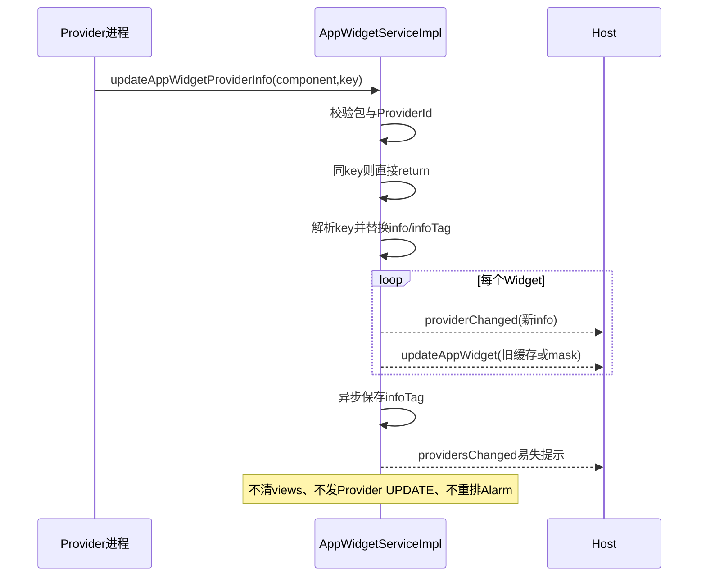
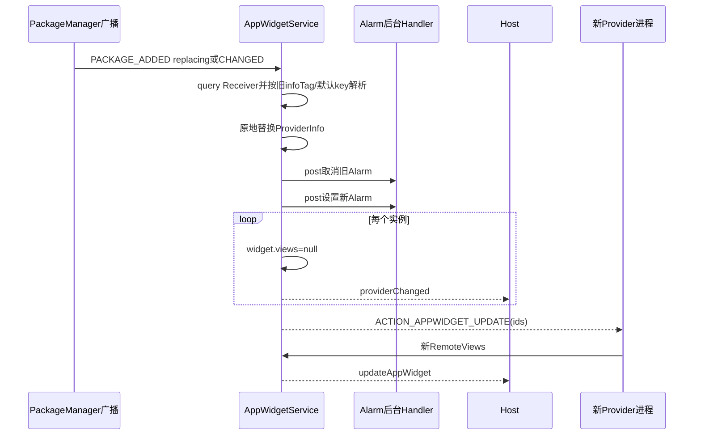

# 第 377 章 Android AppWidget Provider 包替换：元数据、Views、Alarm 与 Host 非事务迁移链

> 源码基线：Android 11 / API 30 / `android-11.0.0_r48`。本章只在 macOS 阅读源码，不编译。上一章研究通知可靠性；本章比较两条经常被混为一谈的“Provider 变化”：Provider 主动切换 metadata key，以及 PackageManager 报告 APK/组件变化。两条路径都会更新 `AppWidgetProviderInfo`，却对旧 RemoteViews、周期 Alarm、Host 默认布局和 Provider 广播采取不同策略。

## 1. 先给出两条入口

主动入口是Binder API `updateAppWidgetProviderInfo(component,metadataKey)`；被动入口是包广播/Locale变化调用 `updateProvidersForPackageLocked(package,user,...)`。前者针对一个已注册组件，后者重新查询一个包的全部Widget Receiver。

## 2. 为什么必须分开读

主动切key意图是在同一APK内换一套appwidget-provider XML；包更新意味着代码与资源可能整体换代、组件可能新增或消失。旧RemoteViews能否继续使用的风险不同。

## 3. 共同的服务端锁

两条主处理都在 `synchronized(mLock)`内修改Provider/Widget关系并安排通知，保证内存图局部一致；真正Host Binder回调、Alarm操作、Provider广播与XML保存仍异步，不构成跨组件事务。

## 4. ProviderId 的身份

它由Provider应用UID和Receiver ComponentName组成。主动API使用Binder callingUid；包扫描使用ActivityInfo.applicationInfo.uid。包更新若UID保持不变，可原地找到旧Provider对象。

## 5. 组件名稳定的重要性

只要Receiver类名不变，服务可保留Provider.widgets关系并替换info；若类名改变，旧组件被prune、新组件作为独立Provider加入，已有Widget不会自动迁移到新组件。

## 6. info 与 infoTag

`provider.info`是当前解析出的AppWidgetProviderInfo；`provider.infoTag`记录Provider主动选用的备用metadata key，null表示标准 `android.appwidget.provider`。

## 7. infoTag 会持久化

非空时写入Provider XML的 `info_tag`属性；服务重启加载状态后会尝试按该key重新解析。因此它是选择配置的持久意图，不只是一次调用参数。

## 8. AppWidgetProviderInfo 不直接持久完整字段

尺寸、布局和周期等主要从已安装APK metadata重新解析；状态文件保存关系与infoTag。包资源才是元数据权威来源。

## 9. 主动 API 先验证调用包

服务用组件包名调用 `enforceCallFromPackage()`，再用callingUid+component查Provider。其他应用不能替目标Provider切metadata。

## 10. userId 来自 Binder 身份

`UserHandle.getCallingUserId()`决定加载哪个用户组状态。组件包名正确但跨用户UID不匹配，ProviderId查找仍失败。

## 11. Provider 不存在时抛异常

主动更新找不到Provider不会静默创建，而是 `IllegalArgumentException("not a valid AppWidget provider")`。新增Receiver要等PackageManager扫描路径。

## 12. 相同 infoTag 快速返回

`Objects.equals(provider.infoTag,metadataKey)`为true就return，不重新读取XML、不通知Host、不保存。调用者不能用同一个key强制刷新同key资源。

## 13. null key 的准确含义

metadataKey为null时解析标准 `META_DATA_APPWIDGET_PROVIDER`，成功后仍把 `provider.infoTag=null`。null不是“保持旧key”。

## 14. 非 null key 是 manifest metadata 名

它不是XML资源ID，也不是文件路径；ActivityInfo通过该名字加载Receiver `<meta-data android:name=... android:resource=...>`关联的XML。

## 15. parse 失败保持旧状态

新key无法得到合法AppWidgetProviderInfo时先抛IllegalArgumentException；`provider.info/infoTag`赋值尚未发生，因此旧配置和旧Views仍保留，也不发通知。

## 16. parse 成功先替换两个字段

代码先写 `provider.info=info`、`provider.infoTag=metadataKey`，再遍历实例。Host通知看到的是新ProviderInfo。

## 17. 主动切换不会清 widget.views

循环中先schedule providerChanged，再调用 `updateAppWidgetInstanceLocked(widget,widget.views,false)`。参数与旧缓存引用相同，缓存内容被重新作为完整更新提交。

## 18. 为什么先 ProviderChanged

Host先resetAppWidget到新initialLayout/尺寸元数据，再收到Views update应用业务内容；服务端序号表也由ProviderChanged clear旧代，再由Views update加入新序号。

## 19. Host 可见的短暂默认画面

两个通知经同一system CallbackHandler排队，通常保持顺序，但客户端providerChanged会立刻reset默认布局，下一条RemoteViews再替换，可能产生短暂闪烁。

## 20. 旧 Views 与新布局可能不兼容

主动API不验证缓存RemoteViews layoutId/目标View ID是否适合新metadata；不过metadata的initialLayout与业务RemoteViews本来可以不同。真正apply失败时由Host fallback/error处理。

## 21. maskedViews 的优先级

`updateAppWidgetInstanceLocked`最终通知 `widget.getEffectiveViewsLocked()`；若Widget正被quiet/locked/suspended遮罩，Host重置后收到的是系统maskedViews，而非保存的真实views。

## 22. 内存上限会重新检查

即便传回同一个widget.views，方法仍估算Bitmap内存。若当前限制/对象状态导致超限，会清views并抛异常，循环在该Widget中断且后续保存/通知可能不执行。

## 23. 主动路径不发 ACTION_APPWIDGET_UPDATE

Provider自己发起metadata切换，服务没有再广播要求它重建Views，而是直接重发缓存。Provider若需要不同UI，应在调用后主动updateAppWidget。

## 24. 主动路径不重排周期 Alarm

源码没有cancelBroadcasts/registerForBroadcasts。即使新metadata的updatePeriodMillis不同，运行中的Alarm仍沿旧注册状态，直到包扫描、用户重启初始化或实例关系变化重新注册。

## 25. 从 0 改为正周期的边界

旧配置无Alarm、新metadata要求周期更新，主动API不会立即创建；仅切metadata不能让周期自动开始。

## 26. 从正周期改为 0 的边界

旧Alarm也不会在主动API中取消，仍可能继续发送ACTION_APPWIDGET_UPDATE。文档API语义若暗示立即完整应用，r48执行细节需要特别警惕。

## 27. 主动路径最后异步保存

遍历完成后 `saveGroupStateAsync(userId)`保存infoTag等关系；崩溃发生在内存更新/Host通知之后、写盘之前，重启可能回到旧tag。

## 28. 还会发 providersChanged

服务给同profile group活跃Host发送无payload提示，让Widget选择器等重新查询Provider列表/元数据；该通知无序号、停止监听期间不补发。

## 29. 主动切换流程图



## 30. 包广播来自哪些动作

PACKAGE_ADDED/CHANGED、永久REMOVED、外部应用available/unavailable和packages suspended/unsuspended进入统一解析；suspend还另走遮罩更新逻辑。

## 31. EXTRA_REPLACING 区分更新与卸载

包升级先收到REMOVED且replacing=true，服务在该阶段不永久删除关系，等待随后ADDED；真正卸载或外部不可用且非替换才删除Host/Provider。

## 32. 升级间隙保留旧对象

replacing remove阶段没有删Provider，避免升级瞬间丢Widget ID和Host布局。若后续added广播缺失，旧内存信息可能暂留到其他扫描/重启纠正。

## 33. added 与 changed 都重新扫描

对每个包调用 `updateProvidersForPackageLocked()`，重新query ACTION_APPWIDGET_UPDATE Receiver，新增、更新并按keep集合裁掉不再合法的组件。

## 34. 新安装才 resolve restored Host UID

`newPackageAdded`要求ADDED且不是replacing，并且只在system user处理，将备份恢复时UNKNOWN_UID的Host匹配到真实UID；普通升级不走这步。

## 35. 锁定用户会忽略包事件

若用户未unlocking/unlocked或profile parent锁定，处理直接return。后续用户解锁加载/扫描负责重建状态，不能假设这次广播被排队重试。

## 36. package list 可能含多个包

外部存储和suspend广播使用changed package list，服务逐包处理，最后只要任一componentsModified就异步保存并通知Provider集合变化。

## 37. 查询 Intent 只看 Provider Receiver

构造ACTION_APPWIDGET_UPDATE并setPackage，PackageManager返回匹配Receiver。普通Activity/Service存在不代表Widget Provider仍存在。

## 38. 外部存储 Provider 被过滤

ActivityInfo应用带FLAG_EXTERNAL_STORAGE时skip；AppWidget Provider需要稳定可用，不能依赖可卸载外置包位置。

## 39. disabled Receiver 的细节

全量查询结果及addProvider还会检查enabled状态；组件禁用后不会进入keep，旧Provider会在prune阶段删除。

## 40. keep 集合是本轮真相

每个成功解析的ProviderId加入keep；扫描结束遍历mProviders，同包同user但不在keep的Provider被delete。解析失败与组件消失在结果上都可能变成删除。

## 41. 新组件怎样加入

lookup不到Provider时调用addProviderLocked；解析成功后放mProviders或把restore zombie占位原地reify。新Provider通常还没有Widget实例。

## 42. 新组件不会继承旧组件实例

keep只按精确ProviderId；重命名Receiver相当于旧删新加。Widget关系指向旧Provider对象，会随旧组件删除，而非迁到同包新类。

## 43. restore 占位的特殊匹配

若真实UID Provider未找到，还查 `ProviderId(UNKNOWN_UID,component)`；非safe mode下把id、zombie和info补成真实值，保留恢复出的widgets关系。

## 44. reify 没复制 infoTag 的新对象

existing占位对象原地保留其infoTag等字段，只替id/zombie/info。包扫描解析是否先尝试旧infoTag取决于parseProviderInfoXml传入的oldProvider路径；addProvider调用传null解析默认key。

## 45. 已存在组件如何解析

调用 `parseProviderInfoXml(providerId,ri,provider)`：若oldProvider.infoTag非空，先尝试备用key；失败再回退标准metadata key。

## 46. fallback 是包更新的容错

新APK删除了旧备用metadata时，不立即判整个Provider无效；只要标准metadata可解析，Provider仍可保留并继续服务已有Widget。

## 47. 但 infoTag 没同步清空

成功parsed对象只提供info；更新代码执行 `provider.info=parsed.info`，没有把old `provider.infoTag`改为null。于是实际info来自默认key，选择字段仍记着已失效备用key。

## 48. 重启会再次先试旧 tag

状态保存仍写旧infoTag；下次加载先尝试它，失败再怎样处理要看加载路径。包扫描每次也会重复一次无效解析再fallback。

## 49. 主动同 key 快速返回的分叉

Provider若随后用那个旧字符串调用主动API，`Objects.equals(infoTag,key)`会直接return，即使当前info事实上来自fallback默认metadata，无法用同key触发重新尝试。

## 50. 这是状态账不一致风险

应描述为“r48字段选择意图与实际解析来源可能分叉”，而不是断言所有升级必错；只有旧备用key失效且默认key成功时出现。

## 51. 已存在Provider解析成功就换 info

Provider对象和widgets列表保持原引用，只替ProviderInfo。Host/Widget ID不变，跨用户Host关系也可延续。

## 52. M=0 时只换元数据

没有实例时不处理Alarm、Host providerChanged或Provider UPDATE广播；仍把providersUpdated置true，外层保存并发providersChanged提示。

## 53. 有实例先收集全部 IDs

`getWidgetIds(provider.widgets)`按列表顺序生成数组，供周期PendingIntent extras和ACTION_APPWIDGET_UPDATE广播。列表顺序不是公开排序保证。

## 54. 包更新会重排 Alarm

先 `cancelBroadcastsLocked(provider)`，再 `registerForBroadcastsLocked(provider,ids)`，注释明确按新updatePeriodMillis重新调度，不特判周期是否变化。

## 55. cancel 的字段更新是同步的

若provider.broadcast非null，方法捕获旧PendingIntent，向BackgroundThread post取消任务，然后立刻将 `provider.broadcast=null`。内存状态先表明未注册。

## 56. 真正 Alarm cancel 是异步的

后台Runnable依次 `mAlarmManager.cancel(broadcast)`和`broadcast.cancel()`。返回包扫描代码时，旧Alarm在系统服务中可能尚未取消。

## 57. register 立即创建 PendingIntent

若新period>0，用同requestCode=1、相同action/component/profile和FLAG_UPDATE_CURRENT取得PendingIntent，更新ids extras；因为字段刚清null，alreadyRegistered=false并post新的setInexactRepeating。

## 58. cancel 与 register 的身份竞态

旧PendingIntent真正cancel前，新getBroadcast可能按相同identity复用同一底层token；随后排在BackgroundThread的旧cancel又可能取消它，再执行新set。源码存在需要运行验证的复用/取消竞态，不能直接保证新Alarm一定有效。

## 59. 后台任务通常 FIFO

cancel post发生在set post之前且共用mSaveStateHandler，执行顺序通常先取消再设置；但如果两变量指向同一已cancel PendingIntent，FIFO本身不能恢复token能力。

## 60. 周期为 0 时只取消

register方法条件不成立，不创建新PendingIntent。异步旧Alarm可能在cancel任务执行前再触发一次UPDATE广播，属于尾部竞态。

## 61. 周期下限仍为30分钟

新metadata声明正值后取 `max(updatePeriodMillis,MIN_UPDATE_PERIOD)`；包更新不会绕过系统最小周期策略。

## 62. 第一次触发从现在加period

setInexactRepeating使用elapsedRealtime当前值+period。包更新即使period没变也重新起算，下次更新延后到新完整周期，而不是延续旧相位。

## 63. Alarm 不补升级期间漏掉的周期

重排只设置未来重复，不计算旧计划错过次数。Provider随后会收到一次立即ACTION_APPWIDGET_UPDATE，承担刷新当前UI。

## 64. 包更新会清每个 widget.views

Alarm处理后遍历实例，先 `widget.views=null`，再schedule providerChanged。旧APK构造的RemoteViews资源ID/Action不再被服务缓存或重发。

## 65. maskedViews 没在这里显式清

代码只写真实views字段；若maskedViews仍存在，它继续留在Widget对象。不过本路径只发送providerChanged，不立即schedule普通effective views。

## 66. Host收到 ProviderChanged 后 reset

客户端更新尺寸并让HostView回到新initialLayout，避免旧RemoteViews树引用已更新APK的无效资源。此刻屏幕显示静态默认内容。

## 67. 然后服务广播 Provider 自己更新

完成所有Host providerChanged调度后，向新Provider组件发ACTION_APPWIDGET_UPDATE，携所有实例ID。Provider进程按新代码生成RemoteViews并回写服务。

## 68. Host通知先于 Provider广播调用

源码排队providerChanged后才调用sendUpdateIntentLocked；但前者经system主Looper、后者经广播系统异步分发，跨队列最终到达顺序不能当成严格端到端屏障。

## 69. Provider可能很快回写 Views

新进程收到广播后调用updateAppWidget；服务再向Host排View update。通常CallbackHandler中已有providerChanged消息，因同一服务队列保持顺序，但广播/并发仍应按源码消息点分析。

## 70. 包更新迁移流程图



## 71. 包更新不发送 ENABLED

已有Provider已有实例，升级路径只发UPDATE，不重复ACTION_APPWIDGET_ENABLED。Provider应把进程重建初始化放在普通组件/Application生命周期或UPDATE处理中，不依赖再次enabled。

## 72. 包更新也不发 DISABLED

组件仍存在时关系延续；没有从1→0实例变化。DISABLED只在正常删除最后实例等路径发送，Provider升级不是使用状态切换。

## 73. 解析失败会落入 prune

已存在Provider parse返回null时不加入keep；扫描末尾同包同user且不在keep的对象会deleteProvider。一次metadata错误可让全部已有Widget关系被删除。

## 74. 查询暂时为空也很危险

包/组件状态竞态导致queryIntentReceivers空，同样keep为空并prune旧Provider。实现没有“保留旧信息等待下次扫描”的宽限期。

## 75. providersUpdated 仍为 true

existing分支无论parsed是否null最后都置true；外层会保存状态和发providersChanged。这符合“集合可能变化”，却无法区分元数据刷新成功还是Provider被删。

## 76. deleteProvider 的步骤

先deleteWidgetsFor all users，再从mProviders移除Provider，最后cancel周期广播；Receiver已经消失，不发送DISABLED。

## 77. deleteWidgets 倒序遍历

它直接从provider.widgets按末尾向前remove，避免删除时索引移动；可按Host user筛选，deleteProvider传USER_ALL。

## 78. 删除时先通知空 RemoteViews

对每个Widget调用 `updateAppWidgetInstanceLocked(widget,null,false)`，服务缓存views=null并可能给在线Host排update null，Host会显示DEFAULT。

## 79. 随后又安排 appWidgetRemoved

`removeWidgetLocked(widget)`从全局mWidgets删除并schedule removed；在线Host通常先收到update null，再收到removed，后者从mViews移除并调用hook。

## 80. 两条通知不是原子组合

Host可在中间短暂显示默认布局；stop/死亡/水位竞态也可能只观察其中一条。离线重连请求旧ID时因为对象已不存在，主要合成removed。

## 81. 然后断开双向关系

从host.widgets移除、widget.provider=null、prune host，最后widget.host=null。顺序允许schedule阶段仍读取旧host/provider构造回调。

## 82. 不发送 Provider DELETED/DISABLED

Provider Receiver本身已不可用，向它广播没有意义。Host侧removed是服务回调，不是Provider的onDeleted回调。

## 83. 永久包卸载还删除同包 Host

`removeHostsAndProvidersForPackageLocked()`先删这个包的Providers，再遍历mHosts删除host package同名且同user的Host。一个应用同时是Host和Provider时两边都会清。

## 84. deleteHost 会删除它托管的其他 Provider Widget

永久卸载Host包时，对host.widgets倒序调用deleteAppWidgetLocked；其他包Provider会收到相应DELETED，最后实例还会DISABLED并取消Alarm。

## 85. 包更新 remove 阶段为何不做这些

EXTRA_REPLACING=true明确跳过永久删除，否则每次APK升级都会丢桌面布局、给Provider发deleted/disabled，再无法凭原ID恢复。

## 86. 外部应用 unavailable 的语义

没有added/changed且通常视为永久不可用，会进入删除路径；即使稍后available可重新发现Provider，旧Widget关系已经删除，不能自动恢复。

## 87. componentsModified 的后处理

任一Provider/Host变化就 `saveGroupStateAsync(userId)`并向profile group活跃Host发providersChanged。内存变化和通知先发生，磁盘保存稍后执行。

## 88. 保存失败不回滚 UI

异步XML写失败或system_server在写前崩溃，Host可能已移除/重置卡片；重启再从旧XML和当前包扫描重建，可能出现再次迁移或关系分叉。

## 89. providersChanged 不保证 Widget removed 已处理

它与实例回调都排system CallbackHandler，但由不同调度点产生；客户端还各自再入Handler。Widget picker刷新和桌面卡片删除不构成一个UI事务。

## 90. Locale 变化也重解析 Provider

`onConfigurationChanged()`仅当Locale真正变化时复制installedProviders，按包调用同一updateProvidersForPackageLocked，使label/description等资源配置更新。

## 91. 为什么要复制 Provider 列表

更新函数可能prune Provider；直接遍历mProviders会跳项或越界。源码用快照并以removedProviders Set避免同一包被重复删除处理。

## 92. Locale 扫描按包可能重复

同包多个Provider时installed snapshot包含多个对象；removedProviders和包级更新逻辑减少重复破坏，但仍需要源码的skip集合，而非简单for-each原表。

## 93. locked profile 在配置变化时跳过

用户未解锁或parent锁定不重解析；下次解锁初始化会重新载入。不同profile可能短暂使用不同Locale代际的ProviderInfo。

## 94. Locale路径只异步保存 changed group

它记录哪些group发生provider更新后保存；这段自身没有像包广播尾部那样显式schedule group providersChanged，已有实例仍可能收到providerChanged。

## 95. ProviderInfo 更新不等 Widget options 更新

minWidth、resize等metadata变化由Host的ProviderChanged刷新Info；每实例options中的Host实际尺寸仍是另一份Bundle，不因metadata改变自动重算单元格或发送optionsChanged。

## 96. Launcher需要自行响应尺寸元数据

onProviderChanged默认只resetHostView；Launcher若要重新计算网格span、最小尺寸限制或配置UI，需要在宿主层额外处理，framework不替它移动卡片。

## 97. initialLayout 与缓存 Views 的两种策略

主动切key：先新initialLayout，再旧缓存Views；包升级：先新initialLayout，清缓存并等新ProviderViews。前者追求无数据空窗，后者优先避免旧资源对象污染。

## 98. Alarm 的两种策略

主动切key完全不改；包扫描有实例就无条件cancel/register。看到ProviderInfo.updatePeriodMillis变化时，必须先确认来自哪条入口。

## 99. Provider广播的两种策略

主动切key不发UPDATE；包升级对所有实例发一次UPDATE。两者都可能向Host发providerChanged/providersChanged，但业务重建责任不同。

## 100. infoTag fallback 状态图

```mermaid
stateDiagram-v2
    [*] --> Alternate: "infoTag=alt 且alt可解析"
    Alternate --> Fallback: "新APK删除alt，包扫描alt失败"
    Fallback --> Fallback: "默认metadata成功，info来自default"
    Fallback --> StaleTag: "字段infoTag仍为alt"
    StaleTag --> NoOp: "Provider主动再传alt，相等快速return"
    StaleTag --> Default: "Provider主动传null并成功"
    Default --> [*]
```

## 101. 包更新期间 Provider进程状态

PackageManager通常会杀旧包进程并装载新代码；AppWidgetService只通过广播触发新进程，不持有Provider进程内对象。RemoteViews缓存才是需要显式清理的跨进程数据投影。

## 102. Host进程通常不重启

Launcher继续运行，旧View树可能已引用旧包Resources；providerChanged让Host reset/fresh inflate新资源，是迁移链不可省的一步。

## 103. 旧 View 何时真正移除

Host收到providerChanged后 `resetAppWidget()`调用update null，applyContent加入新default并remove旧mView；异步旧RemoteViews任务是否还可能尾部提交，仍受前几章取消竞态影响。

## 104. 包版本与回调没有显式版本号

ProviderInfo/RemoteViews消息不携versionCode或迁移generation。Host依靠CallbackHandler顺序与layout资源可用性，无法精确拒绝升级前已排队的旧update。

## 105. 旧 update 可能晚到

升级前system CallbackHandler已捕获旧RemoteViews clone，包路径随后排providerChanged；正常同队列旧消息先到，但客户端异步apply可能比reset晚完成。reset/update会取消last signal，却非事务等待。

## 106. Provider应让新UPDATE幂等

广播可能因Alarm尾部、包更新立即广播或其他请求重复到达。实现应读取当前数据库生成全量RemoteViews，而不是假设“这一定是升级后的唯一一次”。

## 107. 迁移失败的可恢复来源

服务端仍有Host/Widget关系时，Provider后续主动update可恢复内容；组件被prune后关系已删，重新安装同组件只会成为新Provider，需用户重新添加或备份恢复。

## 108. 不要用旧 Views 作为业务数据库

包更新路径明确把它清null。业务状态必须在Provider自己的持久层；RemoteViews缓存只保证Host离线/进程间的最近画面投影。

## 109. 不要依赖 Alarm 做精确迁移

Alarm为inexact、最短30分钟且重排异步；包升级已显式发一次UPDATE。需要迁移数据应在应用升级/Provider执行路径完成，不能等周期刷新。

## 110. 本章最容易误解的四句

ProviderInfo变了不一定Alarm变；providerChanged不一定清Views；包升级保留Widget关系不等保留旧UI缓存；metadata fallback成功不等infoTag同步修正。

## 111. 复读后的准确边界

PendingIntent复用后被异步旧cancel影响是源码可推导竞态，需要设备运行验证，不能写成必现；infoTag字段分叉和主动路径不重排Alarm则由明确赋值/缺失调用直接证明。

## 112. macOS 只读练习一：对比两条元数据路径

执行 `sed -n '1610,1665p' frameworks/base/services/appwidget/java/com/android/server/appwidget/AppWidgetServiceImpl.java` 和 `sed -n '3400,3460p' frameworks/base/services/appwidget/java/com/android/server/appwidget/AppWidgetServiceImpl.java`，做表比较是否清views、重排Alarm、发Provider UPDATE、重发缓存和保存infoTag。只读不编译。

## 113. macOS 只读练习二：推演 infoTag fallback

执行 `sed -n '2595,2620p'`及包更新赋值段。假设旧infoTag=`alt`、新APK删除alt但保留默认metadata，逐句写出parse来源、provider.info与infoTag最终值，再判断主动传`alt`为何快速return。

## 114. macOS 只读练习三：审计 Alarm 重排

执行 `sed -n '1845,1875p'`和 `sed -n '2395,2435p'`同一文件，标出字段清null、后台cancel、同步get PendingIntent和后台set的线程/顺序。区分源码确定事实与“token可能复用”的待验证推论。

## 115. macOS 只读练习四：追组件消失删除链

执行 `sed -n '2290,2370p'`及 `sed -n '3400,3515p'`，从keep缺失追deleteProvider、update null、removed、双向摘链和Alarm取消，解释在线Host与离线Host分别可能看到什么。

## 116. 排障清单：切 metadata 后周期没变化

先确认调用的是主动updateAppWidgetProviderInfo；r48该路径不cancel/register Alarm。用包重扫/重启现象对比验证，并避免把ProviderInfo字段已变误判为Alarm已重排。

## 117. 排障清单：升级后卡片短暂默认或错误

检查providerChanged是否先reset、Provider新UPDATE广播是否收到、RemoteViews是否按新资源生成；再看旧异步apply取消、initialLayout parse和Host onLayout错误，而不是只查Provider onUpdate。

## 118. 排障清单：升级后 Widget 被整体删除

检查新APK Receiver类名、enabled/external flag、ACTION_APPWIDGET_UPDATE intent filter和metadata XML解析。任一导致Provider不入keep，都可能触发prune并删除已有关系。

## 119. 排障清单：备用 metadata 看似无法重新启用

检查infoTag是否仍等于旧key、当前info是否已由默认fallback产生；相同key调用会no-op。显式切null成功后再切目标key，或修复framework代际逻辑，才能强制重新解析。

## 120. 本章结论与下一章入口

主动metadata切换保留并重发Views、保存infoTag，却不重排Alarm或广播Provider更新；包替换则原地换Info、清真实Views、重排周期、通知Host reset并要求新Provider重建。组件/解析失败会被keep差集当成删除，迁移又跨Host回调、广播、Alarm后台和异步XML，故不存在共同事务。下一章继续研究Widget遮罩：locked/quiet/suspended三种原因如何生成系统RemoteViews、保留真实缓存并处理点击解锁。
