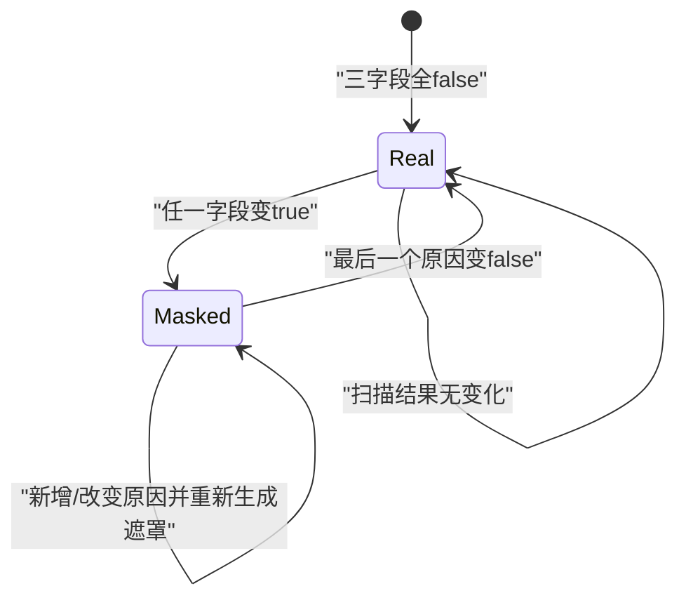
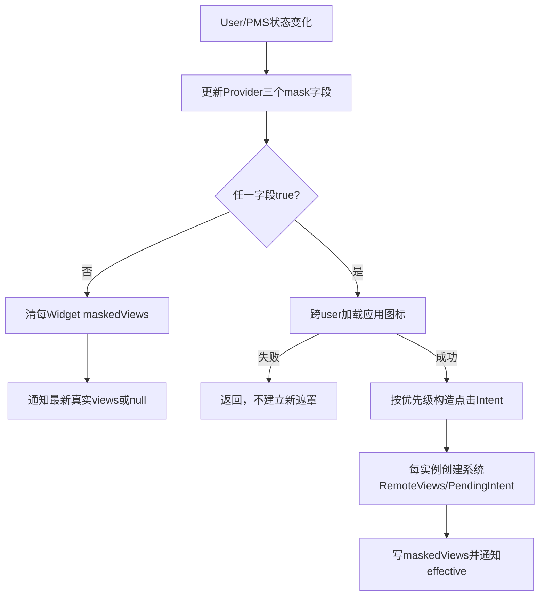
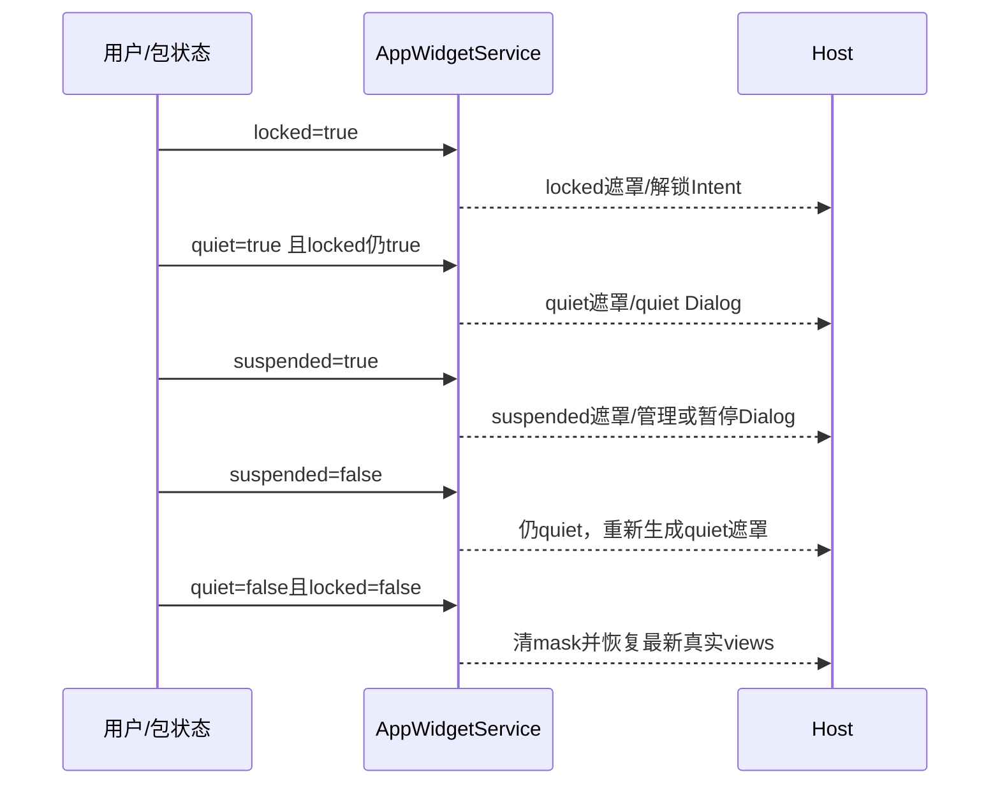

# 第 378 章 Android AppWidget 遮罩：Locked、Quiet、Suspended、系统 RemoteViews 与恢复链

> 源码基线：Android 11 / API 30 / `android-11.0.0_r48`。本章只在 macOS 阅读源码，不编译。上一章说明Provider包更新；本章研究当Provider所属用户/应用暂时不可用时，system_server为何不删除Widget关系，而是保留真实RemoteViews缓存、向Host投影一棵系统遮罩View。重点区分三种原因、优先级、点击动作和解除后的最新状态恢复。

## 1. 遮罩解决什么问题

工作资料锁定、quiet mode或应用suspended时，Launcher不应继续展示可能含敏感数据且可交互的Provider UI；但这些状态又是可逆的，删除Widget会破坏用户桌面布局。遮罩在“保关系”和“藏内容”之间折中。

## 2. 遮罩不在 Host 生成

AppWidgetServiceImpl在system_server创建一份系统包RemoteViews，缓存到Widget.maskedViews并通过普通update回调发给Host。Launcher只是像应用普通RemoteViews一样inflate/apply。

## 3. 三个 Provider 布尔字段

`maskedByLockedProfile`、`maskedByQuietProfile`、`maskedBySuspendedPackage`记录原因。状态挂在Provider上，因此同一Provider的全部实例通常一起遮罩。

## 4. isMasked 是逻辑 OR

任一字段true就返回true。解除一个原因不一定unmask；只有三个都false才恢复真实View。

## 5. 字段不是持久政策源

真实来源分别是UserManager的解锁/quiet状态和PackageManager的suspended状态。服务加载/用户状态变化时重新查询并刷新字段。

## 6. Widget 的双缓存

`views`保存Provider真实RemoteViews，`maskedViews`保存系统替代画面；`getEffectiveViewsLocked()`优先返回maskedViews，否则返回views。

## 7. Host只看到 effective

通知、startListening补发和getAppWidgetViews都走effective选择。Host无需知道遮罩原因，也拿不到隐藏的真实缓存。

## 8. 遮罩不是修改真实 Actions

服务没有merge系统Action进Provider RemoteViews，而是持有独立对象。解除时清masked引用即可重新暴露最新真实views。

## 9. group reload 入口

`reloadWidgetsMaskedStateForGroup(parentUser)`先要求parent已unlock，再锁住mLock，刷新parent和所有enabled profile的Provider状态。

## 10. parent 未解锁时直接返回

它不会继续扫描profile。系统依赖稍后的用户解锁路径再次调用，不能把一次return理解为永久不遮罩。

## 11. 单 user reload 清 Binder 身份

方法在mLock调用期间clearCallingIdentity，以system_server身份查询UserManager/PMS，最后finally恢复。身份清理不释放mLock，也不切线程。

## 12. locked 的判定

`!mUserManager.isUserUnlockingOrUnlocked(userId)`为true即locked。状态进入UNLOCKING时已视为可用，不必等完全UNLOCKED。

## 13. quiet 的判定

读取 `UserInfo.isQuietModeEnabled()`。quiet与locked是独立字段，工作资料进入quiet后可能同时处于锁定状态。

## 14. suspended 的判定

通过IPackageManager `isPackageSuspendedForUser(providerPackage,user)`逐Provider查询。应用暂停与用户profile状态不是同一政策。

## 15. 包不存在时 suspended=false

PMS抛IllegalArgumentException被解释为package not found并设false；注释认为包状态很快会由删除扫描清理。

## 16. PMS RemoteException 的边界

只记录错误，不更新本次suspended字段；locked/quiet字段可能已经改变。随后是否重建遮罩取决于changed累计值与旧suspended状态。

## 17. setter 返回“是否变化”

三个setter先保存旧值、写新值，再返回不等结果。reload用按位OR累计，确保每个setter都执行，不会因前一个true而短路。

## 18. 为什么使用 changed

三种状态都与旧值相同时不重新生成Bitmap/RemoteViews，也不通知Host，避免每次状态扫描都产生大对象与UI更新。

## 19. changed 后再看总 OR

若仍有任一原因true就调用mask；全部false才unmask。这样从suspended转quiet会重做遮罩，而不是错误恢复真实UI。

## 20. 三原因转换图

## 21. suspend 还有增量入口

PACKAGES_SUSPENDED/UNSUSPENDED广播携包名数组，服务只遍历相同profile和命中包的Providers，更新suspended字段，避免全量查询所有Provider。

## 22. 包名数组为null就忽略

没有目标集合无法安全推断，方法直接return。后续全量reload仍可纠正状态。

## 23. ArraySet 用于命中

把数组转Set后按Provider包名contains，多个Provider组件共享同包时都会更新。

## 24. 广播接收顺序

外层BroadcastReceiver对suspend动作先走普通package changed扫描，再调用增量遮罩更新。ProviderInfo/组件集合变化与遮罩是两段处理。

## 25. 增量路径也尊重多原因

unsuspend只把suspended设false；若quiet或locked仍true，`isMaskedLocked()`仍true并重新mask成对应原因。

## 26. Provider无实例时无需画遮罩

mask先看 `provider.widgets.size()==0`并return。状态字段仍保留，未来绑定新Widget时会单实例mask。

## 27. 新绑定怎样继承政策

`onWidgetProviderAddedOrChangedLocked()`发现Provider已masked，就调用 `maskWidgetsViewsLocked(provider,targetWidget)`，只给新Widget生成遮罩。

## 28. targetWidget 使用对象身份

循环条件比较 `targetWidget != widget`，不是appWidgetId。传null代表全部实例，传具体对象只处理同一引用。

## 29. 真实缓存仍可为空

新绑定尚未收到Provider update时views可能null；maskedViews仍能提供系统画面。解除后若真实缓存仍null，Host会进入默认initialLayout。

## 30. 创建遮罩的整体链

## 31. 图标来自Provider应用

服务用 `createPackageContextAsUser(providerPackage,0,user)`取得对应用户Context，再读ApplicationInfo并loadUnbadgedIcon。

## 32. 为什么是 unbadged icon

布局另有工作资料badge图标；若应用图标本身已badged再叠一次会重复。是否显示角标由原因/profile单独决定。

## 33. 图标被置灰

Drawable mutate后应用IconUtilities disabled color filter，再转成RemoteViews需要的Bitmap，表达当前不可用。

## 34. createIconBitmap 统一尺寸

IconUtilities按系统图标规格生成Bitmap，而不是直接把任意Drawable原始尺寸交给Host，减少不同应用遮罩尺寸差异。

## 35. 图标加载清调用身份

跨user包资源查询在clearCallingIdentity下执行，使用system_server权限；Provider或Host调用者身份不参与。

## 36. NameNotFound 时返回 null

方法记录错误并认为Provider包很快被purge。mask调用看到null直接return，不生成占位图标遮罩。

## 37. null 图标的隐私边界

Provider字段可能已经masked=true，但首次遮罩失败时Widget仍可能没有maskedViews，effective会继续返回真实views；这是政策状态与投影视图非原子窗口。

## 38. 已有旧 maskedViews 时又失败

函数在替换前return，因此旧遮罩保留；只有首次无遮罩或此前clear的实例更可能暴露真实/默认内容。

## 39. createMaskedRemoteViews 能接受null icon

该helper本身只在icon非null时setImage；但当前调用者在iconBitmap null时提前return，所以正常路径不会创建无图标遮罩。

## 40. 系统包拥有遮罩布局

RemoteViews包名是 `mContext.getPackageName()`，即android系统包，布局为内部 `work_widget_mask_view`。它不依赖被锁/暂停Provider资源。

## 41. 根是 match_parent FrameLayout

遮罩尽量覆盖整个Host内容区，背景为 `#F3374248`，近乎不透明的深色，阻止旧内容透出。

## 42. importantForAccessibility 的设置

根布局是 `noHideDescendants`，自身和后代不作为正常无障碍节点暴露；r48遮罩点击对无障碍用户的可发现性因此有限。

## 43. 根 clickable=true

即使没有PendingIntent，根仍会消费点击，不让事件落到被替换的旧Provider View；旧View本身已被Host换掉。

## 44. 中心应用图标

ImageView wrap_content且layout_gravity=center，不可点击。点击监听装在整个mask frame。

## 45. 右下工作资料角标

第二个ImageView使用 `ic_corp_badge_off`，bottom|right并有4dp边距；RTL中使用right而非end，是r48布局的方向细节。

## 46. 隐藏角标用 INVISIBLE

showBadge=false时RemoteViews设置INVISIBLE，不是GONE；角标不绘制但仍保留其布局占位。

## 47. 遮罩没有文字原因

布局只有图标与badge，不显示“已锁定/暂停”文本。具体解释依靠点击后系统Activity/Dialog；无click Intent时用户只见静态遮罩。

## 48. 三原因有固定优先级

代码if/else顺序是suspended第一、quiet第二、最后locked。多个字段同时true时只展示最高优先原因的点击行为。

## 49. 优先级不是最近变化顺序

无论哪一个最后变true，只要suspended为true就选suspended；它是源码固定策略，不看时间戳。

## 50. Suspended 的 badge 规则

`showBadge=userInfo.isManagedProfile()`；个人用户应用被暂停时不显示corp badge，工作资料应用暂停时显示。

## 51. 谁暂停了应用

PackageManagerInternal返回suspendingPackage。不同暂停者决定点击进入管理员支持页还是通用SuspendedAppActivity。

## 52. platform 暂停分支

若suspendingPackage等于android平台包，调用DevicePolicyManagerInternal `createShowAdminSupportIntent(user,true)`，向用户解释管理政策。

## 53. DPM 可选依赖边界

onStart注释把DevicePolicyManagerInternal视为optional，但platform suspend分支直接使用字段无null检查；特殊无DPM配置下存在NPE风险，正常企业系统通常发布该LocalService。

## 54. 非 platform 暂停分支

读取SuspendDialogInfo，构造SuspendedAppActivity intercept Intent，携Provider包、暂停者和用户；onUnsuspend参数为null，注释明确不希望从Widget点击直接解暂停。

## 55. Quiet 分支

总是showBadge=true，使用 `UnlaunchableAppActivity.createInQuietModeDialogIntent(profileId)`，通常引导用户理解/开启工作资料。

## 56. Locked 分支

总是showBadge=true，通过KeyguardManager为Provider user创建confirm credential Intent，让用户解锁对应资料。

## 57. credential Intent 可能为 null

没有可用确认Activity/凭据等情况下不装PendingIntent；遮罩仍显示且clickable，但点击不会启动恢复流程。

## 58. Locked Intent flags

非null时覆盖为NEW_TASK与EXCLUDE_FROM_RECENTS。这里调用 `setFlags`，会替换Intent此前flags而非追加。

## 59. 构造原因 Intent 时清身份

mask在决定管理支持/quiet/keyguard Intent前clearCallingIdentity，finally恢复，避免沿用触发状态变化的外部Binder身份。

## 60. 一个 Provider 共享原因 Intent

循环外先构造单个onClickIntent，所有实例基于它创建PendingIntent；每实例再用不同requestCode区分能力。

## 61. requestCode 是 appWidgetId

`PendingIntent.getActivity(context,widget.appWidgetId,intent,FLAG_UPDATE_CURRENT)`，防止同Provider多个实例完全折叠成同一PendingIntent记录。

## 62. PendingIntent 属于 system_server

创建者能力来自系统Context，不是Provider；Host点击只是发送已授予的系统能力，不能修改目标组件授权边界。

## 63. r48 未显式 IMMUTABLE

flags只有FLAG_UPDATE_CURRENT。Android 11尚未强制显式可变性；安全分析应记录这是系统构造受控Intent，但不要套用新版本强制规则。

## 64. 相同实例更新会复用 PendingIntent

状态变化重新mask时相同requestCode/Intent identity配合UPDATE_CURRENT更新extras；旧Host View中的能力可能在View替换完成前短暂仍可点击。

## 65. 每个Widget新建RemoteViews

循环调用createMaskedWidgetRemoteViews，避免所有实例共享一个顶层RemoteViews可变对象；它们可共享同一iconBitmap引用作为输入。

## 66. Bitmap缓存的成本

每份RemoteViews建立自己的BitmapCache并在通知clone/Parcel时处理图标；服务先为Provider只生成一次Bitmap，但多实例仍产生对象与传输成本。

## 67. replaceWithMasked 总返回 true

方法无相等比较，直接赋值并return true。因此一旦maskWidgets真正运行，目标实例必然schedule一次View更新。

## 68. setter changed 减少重复

全量reload状态没变化不会调用mask，弥补replace方法不比较；新绑定targetWidget则即使Provider状态没变也需要首次生成。

## 69. 通知仍走普通 requestId

遮罩更新使用 `scheduleNotifyUpdateAppWidgetLocked`，覆盖Widget `ID_VIEWS_UPDATE`分类序号。Host离线只补最终effective遮罩。

## 70. Provider不会收到“被遮罩”回调

这条代码只更新服务缓存和Host。它不发专用Provider广播；Provider是否还能运行/更新由用户锁定、quiet、suspend等系统策略另行控制。

## 71. 遮罩期间完整更新如何处理

Provider提交RemoteViews仍写入 `widget.views`，内存上限检查后通知effective；因为maskedViews非null，Host收到的仍是遮罩，而真实最新内容被藏在后面。

## 72. 遮罩期间 partial 如何处理

partial merge发生在真实views上，maskedViews不参与Provider Actions合并。解除时显示的是合并后的最新真实状态。

## 73. 真实更新也会重发同一遮罩

每次Provider更新都会schedule effective maskedViews，即使遮罩对象没变；Host可能重复apply相同系统布局，分类序号同时被刷新。

## 74. 这会让水位代表遮罩投影

Host成功接收后水位越过真实业务更新requestId，但真实内容未显示；解除遮罩会产生新的update requestId交付最新真实缓存。

## 75. 数据保密依赖所有读取入口选effective

实时通知、start补发和get views必须一致使用getEffectiveViewsLocked。若某个新API直接返回widget.views，会绕过遮罩；审计扩展代码时要检查这一点。

## 76. unmask 的步骤

遍历Provider全部Widget，`clearMaskedViewsLocked()`仅在非null时清空并返回true，然后schedule当前effective，即真实views或null。

## 77. clear 已为空则不通知

Provider字段从masked变false但某实例从未成功建立遮罩时，maskedViews本来null，unmask不会发送更新；Host可能一直显示之前真实内容，本就无需切换。

## 78. 真实views非null时立即恢复

不要求Provider重新onUpdate；system_server使用遮罩期间持续缓存的最新RemoteViews，Host重新inflate/reapply。

## 79. 真实views为null时恢复默认

schedule允许null，Host进入DEFAULT initialLayout。Provider后续更新再进入CONTENT。

## 80. 解除不销毁旧Bitmap显式资源

字段赋null后Java对象等待GC，源码没有手动recycle遮罩Bitmap。多个实例的RemoteViews引用释放后才可回收。

## 81. 多原因优先级时序

## 82. 同一视觉布局承载不同语义

三种原因都用work_widget_mask_view，只是badge可见性和PendingIntent不同。只看截图无法准确判断原因，需看Provider字段和点击Intent。

## 83. contentDescription 的边界

遮罩layout没有显式contentDescription且隐藏无障碍后代；AppWidgetHostView自身可能保留Provider label，suspended时setAppWidget曾包装“disabled”描述，但quiet/locked变化不会重调setAppWidget。

## 84. Host仍可保存遮罩View状态

它是普通RemoteViews树，也会进入AppWidgetHostView state jail；不过遮罩本身状态简单，恢复后服务的最新update可替换它。

## 85. 点击先经过 Host OnClickHandler

RemoteViews设置PendingIntent后，AppWidgetHostView默认handler仍会noteAppWidgetTapped，再发送系统PendingIntent；自定义Host handler可改变发送行为。

## 86. 点击不直接调用 UserManager

Host进程只send PendingIntent，真正的quiet dialog、credential或suspended Activity由系统组件执行，避免把跨user管理权限交给Launcher。

## 87. PendingIntent不是永久解锁证明

启动确认界面只发起用户交互；状态真正变化后UserManager/包广播再驱动reload/unmask。点击返回不等遮罩立即消失。

## 88. unmask 与Activity结果无直连

AppWidgetService不等待遮罩点击Activity result；它观察系统状态事件。这降低进程耦合，也允许从Settings等其他入口解除。

## 89. 包 suspended 与DPC白名单不是一回事

Cross-profile widget provider允许名单决定能否建立关系；suspended字段决定已存在关系当前是否展示系统遮罩。允许跨资料不代表应用始终可用。

## 90. quiet profile 不删除跨profile关系

父用户Launcher仍保留Widget ID和位置，只显示带corp badge的遮罩；资料恢复后真实缓存重新出现。

## 91. locked状态保护启动阶段

工作资料尚未解锁时Provider CE数据和业务进程可能不可用，遮罩避免Host继续呈现上次敏感快照。

## 92. Direct Boot Provider也会被统一遮罩

判定基于Provider user锁状态，没有按Receiver directBootAware分支。即使Provider可在DE阶段运行，Widget投影仍遵守这里的资料隐私策略。

## 93. maskedViews 不写AppWidget XML

状态文件保存关系/options/infoTag等，不持久化RemoteViews对象；system_server重启后需重新查询状态并由Provider/遮罩路径重建显示缓存。

## 94. views同样主要是内存缓存

重启恢复关系后会发ENABLED/UPDATE让Provider重新提交。因此“解除后立即恢复最新views”主要指同一system_server生命周期内。

## 95. 图标可能反映新包版本

每次mask重新从PackageManager加载应用图标；包升级且遮罩状态变化后可得到新图标。状态无变化则不会仅因图标资源变化自动重建，除非其他路径触发mask。

## 96. ProviderInfo包替换与遮罩交错

包扫描可能先清真实views/providerChanged，随后suspend增量生成mask；多个通知跨队列，Host应最终以服务端effective为准，不能依赖单个中间画面。

## 97. createMaskedBitmap 在mLock内做资源工作

调用链通常持全局mLock，却跨User/PackageManager加载Drawable、滤镜和Bitmap。大图标或包服务延迟会阻塞其他Widget操作。

## 98. clearCallingIdentity 不等于无死锁

它只改变权限身份，mLock仍持有；下游UserManager/PMS/DPM调用若反向等待AppWidget锁，仍可能形成锁依赖。

## 99. Bitmap内存限制也覆盖遮罩

遮罩最终走schedule update，但maskedViews不通过Provider更新入口那段非system UID bitmap上限检查；它由system_server生成且尺寸受IconUtilities控制。

## 100. Provider真实大图仍在内存

遮罩不会释放widget.views及其BitmapCache，因解除要快速恢复；长期quiet的多个大Widget会同时占真实缓存和系统遮罩缓存。

## 101. 删除Widget会释放两类引用

Widget从全局/Provider/Host关系摘除后整个对象可GC，views和maskedViews随之释放；遮罩状态不改变正常删除链。

## 102. Provider删除不需要先unmask

deleteProvider直接删除Widgets并取消Alarm；不会先把真实内容暴露。在线Host最终收到removed。

## 103. updatePackageSuspension 无用户解锁检查

增量方法按profileId直接锁内遍历，不像包扫描入口先检查unlock；它只改内存Provider状态，所需包/用户信息由广播上下文提供。

## 104. UserInfo null 的健壮性

reload直接对 `user.isQuietModeEnabled()`调用，没有null保护；正常已加载有效user应存在，异常用户删除竞态可能导致NPE。

## 105. suspended分支 UserInfo也无null保护

为了决定managed-profile badge再次getUserInfo并直接调用isManagedProfile。用户生命周期竞态是内部系统假设边界。

## 106. showBadge 不是安全条件

角标只提供视觉提示；真正隐藏内容靠effective RemoteViews替换，真正点击授权靠系统PendingIntent。角标加载/可见性不能当权限检查。

## 107. 遮罩也不是进程冻结机制

它只控制Widget展示。应用是否被冻结、后台执行是否受限由quiet/suspend/user状态其他服务执行，AppWidgetService不负责阻止所有Provider代码。

## 108. 状态改变不是跨服务事务

UserManager/PMS先改变政策，AppWidget广播/回调后到，Host再异步apply；中间可能短暂显示旧内容。敏感策略若要求零窗口，需要更底层同步显示保护。

## 109. 设计Provider时的建议

把RemoteViews视为可能被长期隐藏又突然恢复的快照；不要在View文本嵌入过期一次性秘密，解除后最好主动全量更新当前业务状态。

## 110. 设计Host时的建议

不要绕过AppWidgetService自行缓存/重放Provider RemoteViews；否则可能在服务选择maskedViews时仍显示宿主自己的旧真实副本。

## 111. 本章四个关键限定

mask保关系不保每次中间画面；多原因按固定优先级而非时间；真实更新继续缓存但Host只见effective；mask标志true不保证遮罩View一定已成功生成。

## 112. macOS 只读练习一：推演三原因组合

执行 `sed -n '502,575p' frameworks/base/services/appwidget/java/com/android/server/appwidget/AppWidgetServiceImpl.java`，列出locked/quiet/suspended从false到true再逐个false时changed、isMasked和mask/unmask调用，验证OR与优先级是两层判断。

## 113. macOS 只读练习二：检查系统遮罩布局

阅读 `frameworks/base/core/res/res/layout/work_widget_mask_view.xml`，记录背景alpha、accessibility、clickable、两个ImageView位置及INVISIBLE/GONE差异，再对照createMaskedWidgetRemoteViews的Actions。只读不渲染、不编译。

## 114. macOS 只读练习三：追点击能力

执行 `sed -n '617,680p' frameworks/base/services/appwidget/java/com/android/server/appwidget/AppWidgetServiceImpl.java`，分别画suspended(platform/other)、quiet、locked的Intent来源、badge、flags和null边界，解释appWidgetId requestCode为何区分实例。

## 115. macOS 只读练习四：验证真实缓存保留

执行 `rg -n "getEffectiveViewsLocked|maskedViews|widget.views" frameworks/base/services/appwidget/java/com/android/server/appwidget/AppWidgetServiceImpl.java`，从遮罩期间完整/部分update追到unmask，写出真实views、maskedViews和Host看到内容的三列表。

## 116. 排障清单：政策已生效但仍见真实内容

检查createMaskedWidgetBitmap是否NameNotFound返回null、maskedViews是否原本为空、状态广播/reload是否运行以及Host旧异步apply是否尾部提交；不要只看Provider三个布尔字段。

## 117. 排障清单：点击遮罩没有反应

确定当前优先原因，检查credential/admin support/suspended Intent是否为null、PendingIntent是否装到mask frame、自定义Host OnClickHandler是否发送，以及目标profile用户状态。

## 118. 排障清单：解除后内容过旧

检查遮罩期间Provider更新是否真正进入widget.views、partial是否有完整基线、服务是否重启丢内存缓存；必要时Provider在unquiet/unlock相关时机提交全量RemoteViews。

## 119. 排障清单：遮罩反复刷新耗电

查看Provider是否在不可用期间仍高频update，使每次都重发同一effective mask；再检查多原因状态抖动、图标Bitmap重建和Host重复inflate/apply。

## 120. 本章结论与下一章入口

AppWidgetService把locked、quiet、suspended作为Provider级可叠加原因，以suspended优先、quiet其次、locked最后选择点击语义；系统RemoteViews遮住真实缓存，Provider更新仍在幕后收敛，最后原因解除才清mask并恢复最新views。实现仍有图标失败不建遮罩、锁内跨服务/Bitmap工作、无代际UI窗口等边界。下一章继续分析AppWidget的备份恢复广播、旧ID到新ID映射、Host/Provider双方确认与prune事务。
