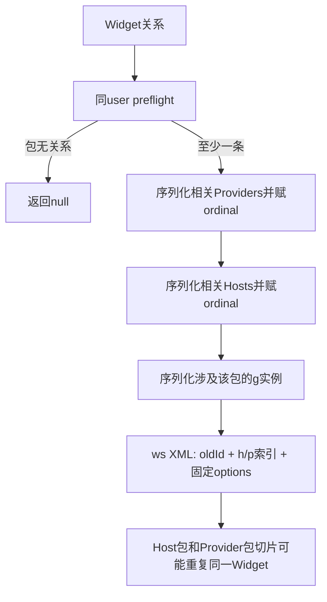
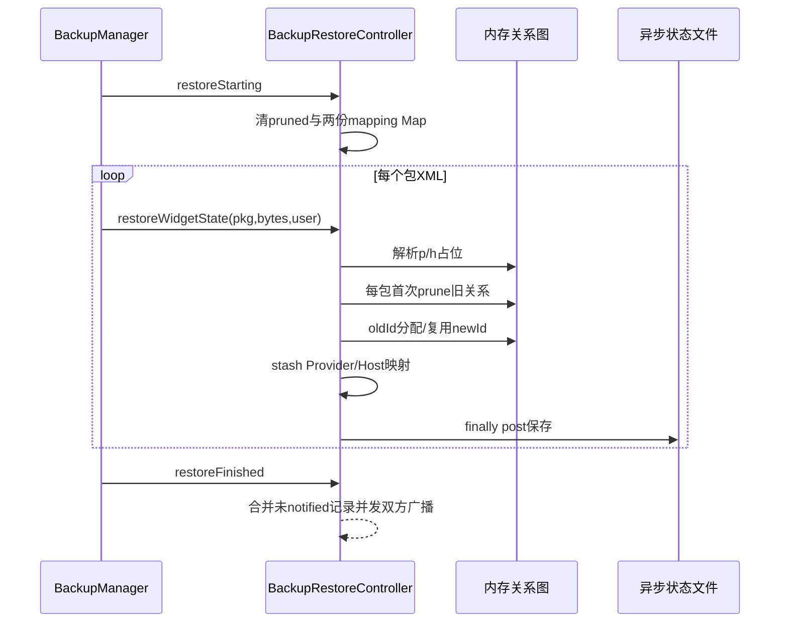
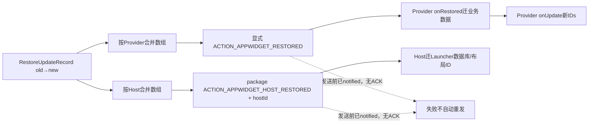

# 第 379 章 Android AppWidget 备份恢复：旧新 ID 映射、双方广播、Prune 与部分提交链

> 源码基线：Android 11 / API 30 / `android-11.0.0_r48`。本章只在 macOS 阅读源码，不编译。上一章研究可逆遮罩；本章进入设备迁移/恢复：旧设备的appWidgetId不能直接沿用，system_server需要重建Host—Widget—Provider图，再分别告诉Provider和Host“旧ID变成了哪个新ID”。重点是包级备份切片、一次restore session的内存账、prune偏差和广播无确认边界。

## 1. 为什么 ID 必须重映射

appWidgetId由目标设备AppWidgetService按用户计数器分配，可能与已有实例冲突。恢复XML中的旧ID只作为ancestral identity，新设备调用increment生成新ID。

## 2. 谁负责备份

AppWidgetServiceImpl实现WidgetBackupProvider，外层方法委托内部 `BackupRestoreController`。BackupManager按参与包读取/恢复Widget状态。

## 3. 备份不是Launcher数据库替代品

服务保存的是Host、Provider、Widget关系和少量options；Launcher自己的网格位置、文件夹等仍由Launcher应用备份。双方通过old/new ID映射重新对接。

## 4. Provider也有自己的业务数据

Provider若按appWidgetId保存城市、账户等配置，必须在onRestored中把旧key迁到新key。system_server不会理解或改Provider数据库。

## 5. WIDGET_STATE_VERSION

备份XML版本为2，根标签 `ws`带version和pkg。恢复拒绝高于2的版本，但接受等于或更低版本，没有显式逐版本迁移switch。

## 6. session 内三个容器

`mPrunedApps`记录本轮已清旧状态的包；`mUpdatesByProvider`和`mUpdatesByHost`按对象积累old/new ID记录，等待restoreFinished合并广播。

## 7. 容器只在内存

它们不写AppWidget XML。system_server在restoreWidgetState和restoreFinished之间崩溃，会保留部分持久关系，却丢待发映射广播清单。

## 8. restoreStarting 的职责

在mLock内clear三个容器，声明新的system restore pass开始。它不先删除所有Widget；实际按包prune延迟到解析每个g实例。

## 9. 容器没有 user key

三个Map/Set是Controller全局字段，restoreStarting(userId)直接全清。实现假设系统恢复串行；多用户恢复若并发交错会互相覆盖session状态。

## 10. 注释提到 install-time restore

mPrunedApps在一次system pass开始时清空，但后续安装时restore调用间保留，以确保同包只prune一次。调用序列由BackupManager约束。

## 11. getWidgetParticipants 做什么

遍历mWidgets，只保留Host和Provider都在指定user的实例；把Host包加入Set，Provider非null再加入Provider包，最终返回无序ArrayList。

## 12. cross-user预检被排除

`isProviderAndHostInUser`要求host user匹配，provider为null或也同user。跨profile Widget不会单独使某包成为该user的backup participant。

## 13. 未绑定实例只贡献Host包

provider为null仍通过同user检查并加入host package。Host知道这个已分配ID，理论上需要恢复其空槽关系。

## 14. HashSet 返回无稳定顺序

包备份顺序不能依赖participants顺序；恢复逻辑用pruned Set和dedup映射适应不同包切片先后。

## 15. getWidgetState 先 preflight

`packageNeedsWidgetBackupLocked(package,user)`再次只检查同user关系；包既非Host也非Provider时返回null，不生成空XML。

## 16. preflight 与真实序列化不完全一致

一旦包有至少一个同userWidget通过预检，后续Provider/Host/Widget三个序列化循环没有统一再次调用isProviderAndHostInUser，可能把同包参与的跨user关系也写入切片。

## 17. 这是条件泄漏而非设计目标

注释写“backup only parent profile”，但执行过滤只在入口预检；文档应明确r48潜在跨profile序列化偏差，而非把它描述成正式跨资料备份功能。

## 18. 包级切片会重叠

同一Widget既涉及Host包又涉及Provider包，会出现在双方各自的备份XML中。恢复必须识别同一ancestral实例，避免创建两份新Widget。

## 19. Provider列表选择

Provider只要应持久化，且自身属于backedupPackage/user，或被该包在user中托管，就分配本切片ordinal tag并写p元素。

## 20. Provider shouldBePersisted

有widgets或infoTag非空就true。即使暂无实例，主动选择过备用metadata的Provider也可能作为配置实体持久化。

## 21. Host列表选择

Host必须widgets非空，且自身是备份包/user，或它托管了该备份包在user中的Provider。写入pkg与hostId。

## 22. tag 是切片内 ordinal

遍历时给Provider/Host对象可变tag字段赋0、1、2；g元素用h/p十六进制值引用本XML中的数组位置，不是全局稳定数据库ID。

## 23. tag 会留在 live 对象

序列化后源码没有复位。下一次切片会为纳入对象重写；若错误把未纳入对象的旧tag用于g，就可能产生错误引用，因此三个选择循环必须一致。

## 24. Widget选择条件

Host属于备份包/user，或Provider属于备份包/user就serialize。这里同样没有总的cross-user guard。

## 25. 备份 g 保存哪些字段

旧appWidgetId、restoredId、Host tag、可选Provider tag，以及min/max宽高与host category；不保存RemoteViews、maskedViews、业务数据库或点击能力。

## 26. restore_completed 特意不备份

备份调用 `serializeAppWidget(...,false)`，不会写OPTION_APPWIDGET_RESTORE_COMPLETED。新设备Provider需要重新确认恢复完成。

## 27. options 只保存固定键

自定义options和未知Bundle字段不序列化；负/零尺寸写0。恢复后Provider不能期待任意Host扩展键仍在。

## 28. XML输出失败返回null

只catch IOException并记录warning。FastXmlSerializer内存写通常稳定，但失败不会返回部分byte数组。

## 29. 备份切片结构图

## 30. restoreWidgetState 输入边界

它用byte[]创建ByteArrayInputStream，再让XmlPullParser按UTF-8读取。null数组会在try之前NPE，契约假设BackupManager传非null数据。

## 31. 局部 restoredProviders/Hosts

每个包切片新建两个ArrayList，按p/h元素出现顺序append；g的h/p数字直接作为索引读取。

## 32. 根 version 解析不够宽容

`Integer.parseInt(version)`的null/非法字符串抛RuntimeException，不在只catchXmlPullParserException/IOException范围；高版本则warning后return。

## 33. package 名必须一致

ws的pkg与BackupManager传入packageName不等就return，防止把甲包切片当乙包恢复；TODO表明canonical/current包名迁移尚未处理。

## 34. return 仍会执行 finally 保存

根校验发生在try内，提前return也进入finally `saveGroupStateAsync(userId)`，即使本次没有有效修改也排一次保存。

## 35. RuntimeException 也会先 finally

数组越界、NumberFormatException等未catch异常会传播，但Java finally仍排异步保存，可能把解析异常前已做的部分修改固化。

## 36. Provider元素恢复

读取pkg/cl构成ComponentName，在指定user查live Provider；找不到则创建UNKNOWN_UID、最小ProviderInfo、zombie占位并加入mProviders。

## 37. zombie占位的意义

即使Provider应用尚未安装，g仍可连到对象并分配新ID；后续PACKAGE_ADDED可按组件reify为真实Provider，保留关系。

## 38. 占位 info 只有 component

它没有完整尺寸、updatePeriod或ProviderInfo.applicationInfo。依赖这些字段的路径必须等包扫描补齐。

## 39. Host元素恢复

读取pkg和十六进制hostId，查询包UID；未安装时UID为UNKNOWN_UID，再lookupOrAdd Host占位，等待PACKAGE_ADDED resolve。

## 40. Host身份含 UID

安装后需要把UNKNOWN_UID HostId替成真实uid，否则正常Host Binder调用用真实callingUid无法匹配恢复关系。

## 41. g 的 Provider 可缺失

没有p属性表示旧设备只allocate尚未bind。代码令p=null，但findRestoredWidget要求p非null，因此每份重复切片都会新建空Provider Widget的风险更高。

## 42. g 索引没有显式范围校验

h/p越界会IndexOutOfBoundsException并传播；恢复数据被视为系统备份可信输入，而非面向恶意应用的宽容解析器。

## 43. 每个 g 先 prune Host包

调用 `pruneWidgetStateLocked(host.id.packageName,user)`；若p非null再prune Provider包。Set保证每包session只执行一次。

## 44. prune 的注释意图

应删除由该包托管的全部实例，以及其他Host中由该包提供的实例，为恢复切片重建干净状态。

## 45. 实际 Host 条件写错方向

代码用 `host.hostsPackageForUser(pkg,user)`，它检查这个Host是否托管“Provider包名等于pkg”的Widget，不是 `host.isInPackageForUser(pkg,user)`检查Host自身身份。

## 46. Host侧旧实例可能未清

恢复Launcher包时，如果其托管Provider都属于其他包，hostsPackageForUser(Launcher包)为false；仅凭Host身份不会命中，旧Widget可能与恢复新实例并存。

## 47. 也可能误扩整个 Host

只要一个Host托管了pkg Provider，`host.hostsPackageForUser`对该Host中每个Widget都返回true，循环可能连同其他Provider实例一起prune，而不是只删与pkg直接相关的当前Widget。

## 48. provider null 可触发 NPE

条件因Host中另一个pkg Widget为true时，当前未绑定Widget的provider可能null；命中分支却无null检查地执行 `provider.widgets.remove(widget)`，存在恢复期NPE风险。

## 49. prune 倒序遍历

从mWidgets末尾删除，结构索引安全；从host/provider列表摘除、递减RemoteViewsService引用，再removeWidgetLocked。

## 50. prune 不发 Provider deleted/disabled

它不是用户删除，而是预备恢复；没有调用deleteAppWidgetLocked的Provider广播逻辑。不过removeWidgetLocked会安排Host appWidgetRemoved回调。

## 51. prune 后把包加入Set

即使清理条件有偏差或中途没有匹配，也认为包已pruned；本session后续切片不会再次尝试。

## 52. restoreStarting 才能重置 prune记忆

若一次恢复异常后不进入新restoreStarting，同包后续install-time restore会看到already pruned并保留现有部分状态，这是注释所需行为，也是失败恢复边界。

## 53. findRestoredWidget 去重条件

要求restoredId、HostId、ProviderId三者相等。它允许Host包切片和Provider包切片找到同一新Widget，复用newId。

## 54. restoredId 是旧ID

新建Widget同时保存 `appWidgetId=new`与 `restoredId=old`，用于后续重复切片匹配；正常新分配Widget的restoredId默认0。

## 55. p=null 时不去重

find方法看到p或host null直接return null，所以未绑定实例的重复备份切片可能各分配新ID；Host切片通常是主要来源，但实现没有通用空Provider dedup。

## 56. 新ID按目标user生成

`incrementAndGetAppWidgetIdLocked(userId)`更新用户计数器，避开当前目标设备已用ID；不会试图保留数值相等。

## 57. 新Widget options 来自g

parse固定尺寸/category键，restore_completed因备份未写而默认缺失/false；views与maskedViews均为空。

## 58. 连接对象图的顺序

先设host并加host.widgets，再设provider并可选加provider.widgets，最后addWidgetLocked加入全局列表与包缓存/遮罩逻辑。

## 59. zombie Provider也可进入包缓存

addWidgetLocked调用onWidgetProviderAddedOrChanged；provider非null即读取其component包名加入mWidgetPackages。若mask字段默认false就清空mask。

## 60. 新建恢复实例不立即通知Provider更新

restoreWidgetState只重建账并stash映射；注释明确等待全部target可用后由restoreFinished广播，避免过早启动未恢复完成的应用。

## 61. Provider映射何时stash

只要id.provider和provider.info非null就加入mUpdatesByProvider；占位ProviderInfo也非null，因此未安装Provider同样可进入待广播Map。

## 62. Host映射总是stash

对id.host无条件stash。Host即使UNKNOWN_UID也积累记录，restoreFinished时再决定能否发送。

## 63. stash 去重是 old/new pair

同对象列表线性查找完全相同的oldId/newId，重复切片不再添加；同oldId映到不同newId则会保留两条，暴露更早去重失败。

## 64. Map key 是对象身份语义

Provider/Host没有覆写equals时HashMap按对象引用；lookup/add努力复用同一对象。若关系被删后重建成新对象，同逻辑身份可能分成两组广播。

## 65. finally 总异步保存

每个包切片解析结束、提前return或被catch后都调用saveGroupStateAsync。多包恢复产生多次后台保存，且每次可能固化部分图。

## 66. XML恢复不是事务

解析边走边prune/创建，没有临时完整模型和最终commit；后部损坏不会回滚前部。catch只记录Unable to restore。

## 67. save 与下一包可交错

保存Runnable在BackgroundThread稍后取mLock并写当时的最新状态，不一定精确对应某个restoreWidgetState返回点。

## 68. 恢复主流程图

## 69. restoreFinished 先Provider后Host

代码先遍历mUpdatesByProvider，再mUpdatesByHost。两张HashMap内部顺序不稳定，但阶段顺序固定为Provider广播尝试先于Host广播尝试。

## 70. countPending 看 notified

只有notified=false记录进入本次数组。restoreFinished被重复调用时，已标记记录不会再次发。

## 71. old/new数组严格对齐

同一循环把每条record.oldId和newId写入相同下标，接收方必须按索引映射，不能分别排序两个数组。

## 72. notified 在发送前设 true

循环组装数组时先改record.notified，再调用sendBroadcast。它表示“已安排尝试”，不是接收方确认。

## 73. 广播无送达 ACK

sendBroadcastAsUser返回不代表Receiver完成；目标未安装、被停用或进程异常时记录也不会自动回false。

## 74. Provider没有UNKNOWN_UID过滤

即使是zombie占位，也尝试显式广播到component并立刻视为notified。若包尚未安装，广播可能无人接收，后续install-time流程是否补救取决于外部调用时序。

## 75. Host有UNKNOWN_UID过滤

Host uid未知就整个entry跳过，records保持notified=false；当前restoreFinished不发送，未来若Host resolve且再次调用restoreFinished才有机会。

## 76. Host广播是package scoped

ACTION_APPWIDGET_HOST_RESTORED先清component、setPackage(host package)，附hostId、old/new arrays；包内Receiver可据hostId更新对应Launcher数据库。

## 77. Provider广播是显式component

ACTION_APPWIDGET_RESTORED定向到Provider Receiver，附old/new arrays，不附hostId，因为Provider只关心自己的实例配置。

## 78. 两类广播都以恢复user发送

使用restoreFinished的UserHandle，而不是分别从Provider/Host对象推导；备份设计本意仅同user关系。

## 79. sendWidgetRestore 可处理二选一

helper接受provider或host；当前调用分别只传一个。若两者同时非null，会复用同Intent先显式Provider、再清component改package发Host。

## 80. send 时仍持 mLock

restoreFinished整个遍历在全局锁内，sendBroadcastAsUser由framework包装异步发送，但跨服务调用和Intent复制仍增加锁占用。

## 81. Provider onReceive 的自动行为

AppWidgetProvider收到RESTORED且oldIds非空，先调用 `onRestored(context,oldIds,newIds)`，紧接着调用 `onUpdate(...,newIds)`。

## 82. Provider应先迁数据库

onRestored完成旧配置key到新ID搬迁，随后onUpdate才能用新ID读到正确配置并生成RemoteViews；顺序由基类保证。

## 83. newIds null 未保护

onReceive只检查oldIds非null且length>0，不显式验证newIds非null/等长；正常系统广播保证契约，伪造广播可能让应用回调异常。

## 84. Provider要设置 restore completed

文档要求成功后通过options将OPTION_APPWIDGET_RESTORE_COMPLETED设true，向系统/Host表达Provider侧恢复已完成；系统备份故意不沿用旧true。

## 85. Host没有AppWidgetHost自动回调

HOST_RESTORED是包广播，不经IAppWidgetHost/AppWidgetHost.onAppWidgetRemoved等API。Launcher需声明Receiver或其他包内组件更新自己的持久数据库。

## 86. Host更新数据库应原子

对同一hostId按数组一次性把所有旧ID替成新ID，避免处理中崩溃造成半数卡片仍指向旧ID；这是Host应用责任。

## 87. 映射广播模型图

## 88. Provider与Host没有共同完成点

Provider可能已迁移并更新Views，Host数据库广播却尚未处理；反之Host已指新ID，Provider配置仍旧。系统用最终广播/应用幂等恢复，而非两阶段提交。

## 89. 广播顺序不能当接收完成顺序

服务先send Provider再Host，但广播分发、进程启动和Receiver执行异步；Host Receiver可能先完成，不能用代码循环顺序做跨进程事务假设。

## 90. restoreFinished 不清三个容器

它只把records标notified，Maps和mPrunedApps保留到下次restoreStarting；支持后续install-time条目追加并只发新pending，也让内存长期保留本session对象。

## 91. 对象删除后的Map key

Map强引用Provider/Host，即使它们从mProviders/mHosts移除也暂时不GC；下一次restoreStarting clear才释放。

## 92. 恢复实例没有旧RemoteViews

备份不含Views；Host在Provider onUpdate前可能显示initialLayout/default。恢复完成广播要求Provider立即onUpdate正是为了缩短空窗。

## 93. 恢复期间遮罩仍可能介入

addWidgetLocked发现Provider已masked会为新实例建立系统mask；Provider恢复更新写真实views但Host仍见mask，解除后再显示最新配置。

## 94. 周期Alarm何时建立

restoreWidgetState本身不register；真实Provider reify、用户解锁初始化或后续包扫描会依据有实例关系注册并发UPDATE。恢复广播的立即onUpdate不依赖Alarm。

## 95. zombie关系允许延迟安装

Provider/Host应用恢复数据顺序不确定，占位使系统先保留图；但映射广播送达仍依赖restoreFinished/install-time协调，没有磁盘持久待发队列。

## 96. package slice重复的好处

无论Host包还是Provider包先恢复，都有足够p/h/g信息建立关系；findRestoredWidget和stash dedup应使第二份切片复用同newId。

## 97. 重复的坏处

prune条件、p=null、对象身份或异常导致dedup失败时，同一旧ID可能映射多个新ID；stash允许old相同/new不同并广播双方，接收应用难以决定哪条有效。

## 98. mPrunedApps 只按包名

Set不含userId；若同Controller session混入多个user的同名包，第二个user会被视为already pruned。再次说明实现依赖单用户串行restore约束。

## 99. prune provider.remove 的null缺口

代码命中后直接 `provider.widgets.remove(widget)`，不像条件第二项那样保护provider非null。结合Host-wide错误条件，未绑定Widget是明确崩溃测试点。

## 100. prune 不调用 pruneHostLocked

它从host.widgets摘Widget但不删除空Host；恢复随后可能复用Host。空Provider也不立即从mProviders删，维持恢复实体。

## 101. removeWidget 会发 removed回调

若旧Host正在线监听，prune期间可能收到旧appWidgetId removed；稍后Host恢复广播又要求数据库从old映射new。Launcher需让两类异步事件幂等协调。

## 102. removed序号与restore映射无共同代际

IAppWidgetHost removed有requestId内部水位，恢复广播没有该序号；客户端无法在统一队列按generation排序。

## 103. 安全边界主要靠BackupManager

restore入口是内部系统接口，XML解析没有全面的防恶意校验。若扩展成应用可调用API，必须补大小、层级、索引、数字和包/用户授权验证。

## 104. byte[]大小没有本地上限

方法直接在内存创建stream和数组列表；备份基础设施应限制数据规模。畸形巨大XML可能占system_server内存和mLock时间。

## 105. parser 在 mLock 内完成

从parser.next到全部对象重建都持全局AppWidget锁；大切片会阻塞正常Widget更新、Host监听和包事件。

## 106. 异步保存不是成功确认

restoreWidgetState返回只说明解析流程结束/异常被部分catch，状态文件可能尚未写。BackupManager随后restoreFinished也不等待每次save完成。

## 107. 崩溃恢复可能看到部分图

某个包XML前半已创建并被后台保存，后半失败；重启从XML加载这些实例，却没有mUpdates映射广播内存，Host/Provider数据库可能不知道新ID。

## 108. 可靠Provider迁移应幂等

onRestored按old/new检查目标是否已迁、源是否存在，允许重复或部分执行；onUpdate始终从当前数据库生成完整RemoteViews。

## 109. 可靠Host迁移应保留恢复日志

Host可在自身数据库事务中记录映射已处理标志，避免广播Receiver中途崩溃；启动时再用getAppWidgetIds与本地布局核对孤儿。

## 110. 不要假设 oldId 全局唯一

它属于备份源用户/Host语境；接收方还需使用Provider组件或hostId及数组批次确定配置表范围，不能在整个应用所有用户盲目替换相同整数。

## 111. 本章复读后的五个关键结论

备份按包重叠切片；newId由目标重新分配；prune实现与注释存在Host方向偏差；恢复解析/保存非事务；notified代表已尝试安排广播而非接收确认。

## 112. macOS 只读练习一：画包级备份切片

阅读 `sed -n '4330,4430p' frameworks/base/services/appwidget/java/com/android/server/appwidget/AppWidgetServiceImpl.java`，假设Launcher L托管Provider P的两个Widget，分别列L/P切片中的p、h、g，并找出cross-user过滤只出现在哪些阶段。

## 113. macOS 只读练习二：推演重复切片去重

阅读 `sed -n '4448,4600p'`与 `sed -n '4695,4790p'`同一文件，设oldId=7，L切片先恢复成newId=21，P切片后到；逐项验证find条件、restoredId和两个stash如何避免第二次分配。

## 114. macOS 只读练习三：审计 prune 偏差

阅读 `sed -n '4810,4845p' frameworks/base/services/appwidget/java/com/android/server/appwidget/AppWidgetServiceImpl.java`，对比Host的`isInPackageForUser`与`hostsPackageForUser`实现，构造一个同Host含P包Widget和provider=null空槽时的NPE路径。只读不触发恢复。

## 115. macOS 只读练习四：追双方广播

阅读 `sed -n '4605,4690p'`服务文件和 `sed -n '80,105p' frameworks/base/core/java/android/appwidget/AppWidgetProvider.java`，标出notified写点、old/new数组对齐、Provider onRestored→onUpdate顺序及Host UNKNOWN_UID跳过条件。

## 116. 排障清单：恢复后出现重复卡片

检查同oldId是否生成多个newId、Host侧prune是否因hostsPackageForUser偏差未删旧实例、p=null是否绕过去重，以及两个包切片中的HostId/ProviderId是否完全一致。

## 117. 排障清单：Provider配置丢失

确认ACTION_APPWIDGET_RESTORED是否送达、old/new数组等长、onRestored数据库迁移是否在onUpdate前成功、restore_completed是否重新设置；不要期待system_server迁业务数据。

## 118. 排障清单：Launcher数据库仍是旧ID

检查HOST_RESTORED包广播Receiver、hostId筛选、Host安装时UID是否仍UNKNOWN、restoreFinished是否在resolve前已经跳过，以及Host自己的数据库事务/进程崩溃日志。

## 119. 排障清单：恢复中途后关系异常

查解析RuntimeException、数组索引/十六进制字段、mPrunedApps是否已标记、异步XML保存时点和system_server重启；部分状态可能已固化而映射Map已丢，不能简单重放后半段。

## 120. 本章结论与下一章入口

AppWidget恢复以包级重叠XML重建同一关系图，用restoredId+HostId+ProviderId复用newId，再在finish阶段分别合并广播给Provider和Host。它能适应应用安装顺序，却没有事务、持久映射队列或送达ACK；r48 prune还把Host身份检查写成hostsProviderPackage，带来漏删、误删和null Provider风险。下一章继续研究AppWidget XML主状态格式、AtomicFile写入、tag跨用户文件连接和损坏加载回退。
