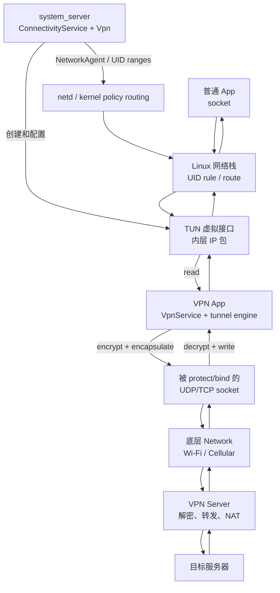
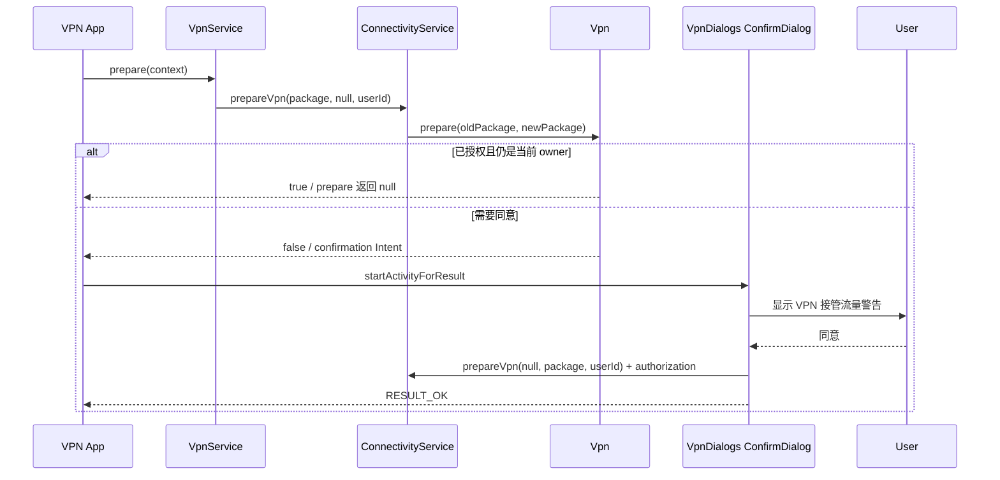
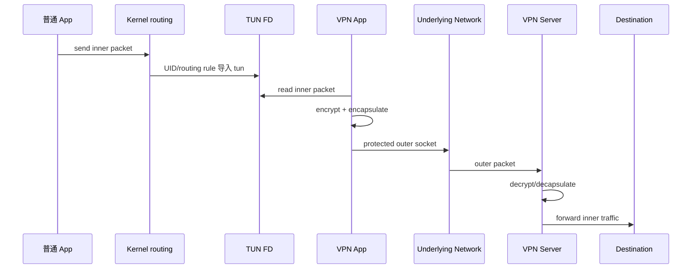
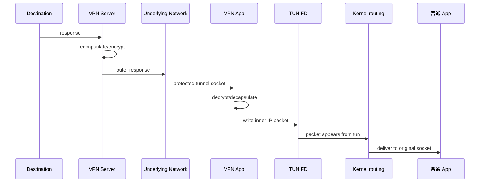

# 38 Android VPN 系统、VpnService、TUN 与网络路由

> 源码版本：Android 11 / API 30 / `android-11.0.0_r48`  
> 学习方式：macOS 只读源码，不要求编译  
> 前置章节：[23 权限、AppOps 与 SELinux](./23-Android权限AppOps与SELinux.md)、[24 网络栈](./24-Android网络栈ConnectivityService与NetworkAgent.md)、[37 Wi-Fi](./37-AndroidWiFi系统WifiService与ClientModeImpl.md)

VPN 最容易产生的误解是：“系统把包交给 VPN App，然后 VPN App 再把同一个包直接发到互联网。”更准确的说法是：内核把匹配 UID 和路由的**内层 IP 包**送进 TUN；VPN 程序读取它，加密并封装成新的**外层传输包**，通过真实的 Wi-Fi/蜂窝网络发给 VPN 服务器；服务器解封装后代为访问目标。回程完全反向。

本章先研究第三方 `VpnService`，再区分系统管理的 Legacy/Platform VPN。

---

## 1. 先记住两张网

| 名称 | 例子 | 作用 |
|---|---|---|
| VPN 虚拟网络 | `tun0`、虚拟地址 `10.8.0.2` | 接住被 VPN 覆盖的应用流量 |
| underlying network | Wi-Fi `wlan0` 或蜂窝网络 | 承载到 VPN 服务器的加密隧道 |

VPN 不是凭空联网。没有底层网络，TUN 仍可能存在，但隧道服务器不可达。

---

## 2. 总体架构



图中控制面主要由 Framework/netd 建立，数据面的加解密通常在 VPN App 或其 native library 中。Android 不替第三方 `VpnService` 实现具体 VPN 协议。

---

## 3. 核心进程与边界

- 普通 App 与 VPN App：各自应用进程。
- `ConnectivityService`、`Vpn`：`system_server`。
- netd：native daemon。
- TUN 与策略路由：Linux kernel。
- VPN server：远端主机。

一次请求可能跨越 App → kernel → VPN App → kernel → 物理网卡 → server；回包再走一遍反方向。

---

## 4. Android 11 核心源码

```text
frameworks/base/core/java/android/net/VpnService.java
frameworks/base/core/java/android/net/VpnManager.java
frameworks/base/core/java/android/net/IConnectivityManager.aidl
frameworks/base/core/java/com/android/internal/net/VpnConfig.java
frameworks/base/services/core/java/com/android/server/ConnectivityService.java
frameworks/base/services/core/java/com/android/server/connectivity/Vpn.java
frameworks/base/services/core/jni/com_android_server_connectivity_Vpn.cpp
frameworks/base/services/core/java/com/android/server/NetworkManagementService.java
frameworks/base/core/java/android/os/INetworkManagementService.aidl
system/netd/server/RouteController.cpp
system/netd/server/FwmarkServer.cpp
system/netd/client/FwmarkClient.cpp
system/netd/server/binder/android/net/INetd.aidl
frameworks/base/packages/VpnDialogs/src/com/android/vpndialogs/ConfirmDialog.java
frameworks/base/services/core/java/com/android/server/net/LockdownVpnTracker.java
```

---

## 5. 三种概念不要混淆

| 概念 | 谁实现隧道 | 典型入口 |
|---|---|---|
| VpnService VPN | 第三方 App 自己读写 TUN、实现协议 | `VpnService.Builder.establish()` |
| Platform VPN | Android 平台用 IKEv2/IPsec 等能力管理 | `VpnManager`、`VpnProfile` |
| Legacy VPN | 旧式 PPTP/L2TP/IPsec 配置及守护进程链 | `Vpn.startLegacyVpn()` 等 |

本章主链是第一种。不要看到 `Vpn.java` 中 IKE/Legacy runner，就误以为所有第三方 VPN 都由系统负责加密。

---

## 6. VpnService 是 Service，不是虚拟网卡

应用在 Manifest 中声明继承 `VpnService` 的服务，并要求：

```xml
<service
    android:name=".MyVpnService"
    android:permission="android.permission.BIND_VPN_SERVICE"
    android:exported="true">
    <intent-filter>
        <action android:name="android.net.VpnService" />
    </intent-filter>
</service>
```

`VpnService` 提供授权、Builder、protect、underlying network 等 API。真正的协议循环由应用编写。

这里设置 `exported="true"` 是为了让 system_server 能解析并绑定服务；安全边界来自普通应用拿不到的 `BIND_VPN_SERVICE` signature 权限。不要为了“更安全”机械改成 `false`，那可能让系统也无法按这条服务契约建立连接。

---

## 7. 为什么必须是 BIND_VPN_SERVICE

系统在 `Vpn.establish()` 中解析目标 Service，并检查它声明了 `BIND_VPN_SERVICE`。这是 signature 级绑定权限，普通 App 不能随意绑定并驱动 VPN Service。

它解决“谁能绑定服务”，但不能替代用户对“谁能接管流量”的明确同意。

---

## 8. prepare() 只是申请资格

典型代码：

```java
Intent intent = VpnService.prepare(context);
if (intent != null) {
    startActivityForResult(intent, REQUEST_VPN);
} else {
    startVpn();
}
```

- 返回非 null：需展示系统确认界面。
- 返回 null：该包当前已获准备资格。

`prepare()` 成功不等于 VPN 已连接；甚至还没创建 TUN。

---

## 9. 用户确认链



授权由系统保存和裁决，不能用 App 自己画一个相似对话框替代。

---

## 10. 每个用户同一时刻只有一个 owner

`Vpn` 是按 Android user 管理的。新包取得资格时，旧 owner 会被撤销、解绑或停止，旧接口和 NetworkAgent 被清理。

这里的“一个”是每用户当前 VPN 管理对象的语义；工作资料等不同用户/受限 profile 还涉及 UID 范围合并，不能简单理解成整台设备永远只有一个进程。

---

## 11. prepareInternal 做了什么

主干包括：

1. 断开旧 NetworkAgent。
2. reset 旧 TUN interface。
3. 通知并解绑旧 VpnService，或停止旧 runner。
4. 对旧 owner UID 执行 `denyProtect`。
5. 更新 package 与 owner UID。
6. 对新 owner UID 执行 `allowProtect`。
7. 状态回到 IDLE，并重算 lockdown。

所以授权切换同时改变接口、服务连接、protect 权限与防泄漏规则。

---

## 12. Builder 是配置收集器

常见配置：

```java
ParcelFileDescriptor tun = new VpnService.Builder()
        .setSession("Study VPN")
        .setMtu(1400)
        .addAddress("10.8.0.2", 24)
        .addRoute("0.0.0.0", 0)
        .addDnsServer("10.8.0.1")
        .establish();
```

Builder 先填充 `VpnConfig`。真正创建接口发生在 `establish()` 的跨进程调用中。

---

## 13. address 与 route 完全不同

- `addAddress("10.8.0.2", 24)`：给 TUN 配本机虚拟地址。
- `addRoute("0.0.0.0", 0)`：声明哪些目的地址应进入 VPN。

地址不是“VPN 服务器公网 IP”，route 也不是“服务器地址”。服务器地址通常属于外层 tunnel socket 的远端。

---

## 14. DNS 配置意味着什么

`addDnsServer()` 把 DNS 放入 VPN 的 `LinkProperties`。被 VPN 覆盖的 App 做系统 DNS 查询时，解析器会按网络/netId 选择 DNS。

它不保证所有 DNS 都进隧道：应用可能自带 DoH、使用固定地址，或 split VPN 路由没有覆盖 DNS 地址。要同时看 DNS 网络选择、route 与协议设计。

---

## 15. 全隧道与分流

```text
0.0.0.0/0  +  ::/0       → 通常称全隧道
10.0.0.0/8                 → 只有企业内网走 VPN
allowed/disallowed apps    → 再按 UID 选择哪些应用受影响
```

VPN 生效范围至少是“UID 范围 × 目的路由 × 地址族”的组合，不能只看有没有默认路由。

---

## 16. allowed 与 disallowed applications

- 调过 `addAllowedApplication()`：只有白名单 App 使用 VPN。
- 调过 `addDisallowedApplication()`：这些 App 绕过，其余使用 VPN。
- 二者互斥。

Framework 把包名解析成 UID ranges，最后不是靠 App 名在每个数据包上匹配。

共享 UID 会让“按包分流”出现直觉偏差：内核路由看到的是 UID，不知道包名层面的业务边界。

---

## 17. 地址族与不可达路由

若配置没有允许某地址族，`Vpn.makeLinkProperties()` 会为其加入 unreachable default route，例如 IPv6 未允许时加入 `::/0` 不可达路由。

这用于阻断未配置族的泄漏。`allowFamily()` 是允许该族 fallback，并不自动给 TUN 分配地址或让服务端支持它。

---

## 18. MTU 为什么重要

隧道封装会增加外层 IP、UDP/TCP、协议头和加密开销。若内层包仍接近物理网络 MTU，封装后可能超限。

症状可能是：小包正常、大网页卡住、TLS 握手或上传失败。应结合隧道开销、Path MTU Discovery、ICMP 是否被过滤选择 MTU，不能机械照抄 1500。

---

## 19. establish() 客户端入口

Builder 最终：

```text
VpnService.Builder.establish
 → IConnectivityManager.establishVpn(VpnConfig)
 → ConnectivityService.establishVpn
 → 当前 user 的 Vpn.establish
```

返回值是 `ParcelFileDescriptor`。null 常表示授权/owner 条件不成立，不应立即解引用。

---

## 20. system_server 的安全检查

`Vpn.establish()` 先检查：

- calling UID 是否等于当前 `mOwnerUID`。
- 用户同意/AppOps 是否仍有效。
- user 是否受限。
- Service 是否存在。
- Service 是否要求 `BIND_VPN_SERVICE`。

客户端传来的 `VpnConfig` 不是被无条件信任的指令。

---

## 21. TUN 怎样创建

`Vpn.establish()` 调用 JNI：

```java
ParcelFileDescriptor tun =
        ParcelFileDescriptor.adoptFd(jniCreate(config.mtu));
String iface = jniGetName(tun.getFd());
jniSetAddresses(iface, addresses);
```

native 代码打开 `/dev/tun`，使用 `TUNSETIFF` 请求 TUN interface，并设置 MTU。TUN 工作在三层，读写的是 IP packet；TAP 才是二层 Ethernet frame。

Android 11 的真实主干代码还体现了一个重要顺序：先创建 FD、取得接口名、配置地址，随后才绑定应用服务并建立 Framework 网络状态：

```java
ParcelFileDescriptor tun = ParcelFileDescriptor.adoptFd(jniCreate(config.mtu));
String interfaze = jniGetName(tun.getFd());
if (jniSetAddresses(interfaze, builder.toString()) < 1) {
    throw new IllegalArgumentException("At least one address must be specified");
}
```

这是经过裁剪的源码片段，位于 `Vpn.establish()`；`builder` 在原方法中由 `config.addresses` 逐项拼出。阅读时应回到完整方法观察异常路径如何关闭新 FD、恢复旧配置和旧 NetworkAgent。

---

## 22. 一个 FD，两种视角

同一个 TUN 有两侧：

```text
kernel network side  ←→  TUN driver  ←→  userspace file descriptor
```

- kernel 把路由到 TUN 的出站 IP 包变成 FD 可读数据。
- VPN App 向 FD 写入一个 IP 包，kernel 把它当作从 TUN 收到的入站包继续投递。

“read 是上行、write 是下行”是站在 VPN App 视角的常用说法。

---

## 23. 为什么至少一个虚拟地址

Android 11 的 `Vpn.establish()` 对 `jniSetAddresses()` 的结果要求至少 1。没有虚拟地址，接口缺少基本三层身份和地址族信息。

这不意味着包源地址永远就是 Builder 中的地址；VPN server、NAT、IPv6 与具体协议可能改变外部可见地址。

---

## 24. Framework 为什么绑定 VPN Service

系统用 `bindServiceAsUser()` 连接应用声明的 VpnService：

- 维持 owner/service 生命周期联系。
- 资格被撤销时可通过 Binder 触发 `onRevoke()`。
- 验证确实是声明合规的目标服务。

返回 TUN FD 后，应用应尽快进入数据循环，并正确响应撤销和关闭。

---

## 25. NetworkAgent 注册

接口配置后，`Vpn.agentConnect()` 创建 VPN `NetworkAgent`，填入：

- `LinkProperties`：interface、addresses、routes、DNS、MTU、proxy。
- `NetworkCapabilities`：VPN transport、INTERNET、owner UID、适用 UID ranges 等。
- `NetworkAgentConfig.allowBypass`。
- VPN 默认 score。

VPN 因此成为 ConnectivityService 管理的一张逻辑 Network，而不只是 `/dev/tun` 的 FD。

---

## 26. INTERNET 不等于已验证公网

VPN NetworkAgent 会声明 `NET_CAPABILITY_INTERNET`，表达它按配置提供互联网能力，并保证受影响 App 查询默认网络时看到 VPN。

能力声明不能证明 VPN server 真可达，也不能证明隧道已成功转发数据。VPN 图标、NetworkAgent connected、实际业务连通是不同证据。

---

## 27. UID ranges 怎样落到内核

ConnectivityService 发现 VPN capabilities 的 UID ranges 变化后：

```text
ConnectivityService.updateUids
 → NetworkManagementService.addVpnUidRanges
 → netd / RouteController
 → UID policy routing rules
```

Framework 更新时先加新范围再删旧范围，尽量避免切换窗口中流量意外绕过 VPN。

---

## 28. 路由选择的两个维度

普通 Linux 最长前缀路由只回答“目的地址去哪个接口”。Android VPN 还要先回答“这个 UID 是否属于此 VPN”。

```text
socket UID / fwmark / explicit Network
          ↓
Android policy rule 选择 network table
          ↓
该 table 内按目的前缀选 route
```

因此同一目的 IP，不同 App 可能分别走 VPN 和 Wi-Fi。

---

## 29. netId 与 fwmark

Android 给 Network 分配 netId。socket 可以通过网络绑定、默认网络选择和 fwmark 携带选择信息；FwmarkServer/FwmarkClient 配合 netd 的规则控制后续路由。

不要把 netId 当 interface index：一张逻辑 Network 有 LinkProperties 和接口，一次连接中的标记也不等价于 Linux ifindex。

---

## 30. protect() 是防递归关键

假设全隧道覆盖 `0.0.0.0/0`。VPN App 创建到服务器的 UDP socket，如果它也受 VPN route 影响：

```text
外层隧道包 → tun0 → VPN App → 再封装 → tun0 → ...
```

形成死循环，永远到不了 Wi-Fi/蜂窝。`VpnService.protect(socket)` 让该 socket 绕过 VPN，直接使用 underlying network。

---

## 31. protect 不等于 bindSocket

| API | 核心含义 |
|---|---|
| `protect(socket)` | 排除 VPN 路由，允许走非 VPN 网络 |
| `Network.bindSocket(socket)` | 明确绑定某张底层 Network |
| `setUnderlyingNetworks()` | 告知系统 VPN 实际依赖哪些 Network |

protect 后若不显式 bind，通常随系统默认底层网络；Wi-Fi/蜂窝切换时要处理 socket 重建、迁移或多路径协议。

---

## 32. protect 的权限不是人人都有

切换 owner 时，`Vpn.prepareInternal()` 调 netd：

```text
denyProtect(oldOwnerUid)
allowProtect(newOwnerUid)
```

所以 protect 不是任意 App 用来逃离企业 VPN 的通用后门。资格撤销后调用也应失败。

---

## 33. 正向数据链：普通 App 到互联网



内层目的可能是网站，外层目的则是 VPN server。抓包时必须先问自己看到哪一层。

例如手机通过 Wi-Fi `192.168.1.20` 连接 VPN server `203.0.113.8`，TUN 地址为 `10.8.0.2`，用户访问网站 `198.51.100.9`：

| 层次 | 一个简化后的包 |
|---|---|
| 内层业务包 | `10.8.0.2 → 198.51.100.9` |
| 外层隧道包 | `192.168.1.20 → 203.0.113.8`，payload 中承载加密后的内层包 |

其中 `192.168.1.20` 是局域网私有地址，`198.51.100.0/24` 和 `203.0.113.0/24` 是文档示例地址段；上表用于说明地址角色，不代表真实可访问服务器。

---

## 34. 回程数据链



App 没有直接从 VPN Service 收到 Java 对象；它仍从自己的 socket 正常读取数据。

---

## 35. TUN FD 读写循环示意

```java
FileInputStream in = new FileInputStream(tun.getFileDescriptor());
FileOutputStream out = new FileOutputStream(tun.getFileDescriptor());

while (running) {
    int n = in.read(packet);
    // parse inner IP; encrypt and send through protected tunnel socket
    // receive encrypted reply; decrypt into replyPacket
    out.write(replyPacket);
}
```

这只是教学伪代码。生产实现需解决并发、非阻塞 I/O、buffer ownership、校验和、重传、拥塞、fragment、IPv6、DNS、密钥轮换和恶意包输入。

---

## 36. 非阻塞与 blocking

Builder 默认配置会影响 TUN FD 是否阻塞。非阻塞模式下应使用 selector/epoll 或可靠的事件循环，并处理 `EAGAIN`；阻塞模式也不能在 Android main thread 永久 read。

数据泵线程停住会表现为“VPN 图标还在，但所有受影响 App 卡住”。

---

## 37. underlyingNetworks 的三种值

| 值 | 含义 |
|---|---|
| `null` | 使用系统默认网络 |
| 非空数组 | 明确使用这些底层 Network，按偏好顺序 |
| 空数组 | 当前没有可用 underlying，无法承载 App 流量 |

它既帮助系统展示和依赖计算，也防止 VPN 的 capability 继承/计量判断产生错误。声明不替代 tunnel socket 实际绑定。

---

## 38. 底层网络切换

Wi-Fi 断开、蜂窝接管时可能发生：

1. Connectivity callback 报告 Network 丢失/可用。
2. VPN 保护并绑定新的 transport socket。
3. 重连或迁移隧道 session。
4. 调用 `setUnderlyingNetworks()` 更新声明。
5. VPN NetworkAgent 可保持逻辑连续，也可能断开重建。

TUN interface 没变不代表外层隧道没断。

---

## 39. 网络验证与 VPN

底层 Wi-Fi/蜂窝通常各自有 validation。VPN 网络的能力和默认网络语义又由 ConnectivityService 管理。

排障需分别验证：

- underlying 是否 validated。
- VPN server 地址是否可达。
- 隧道握手/鉴权是否成功。
- TUN 是否有包。
- 服务端是否能转发/DNS。

“Wi-Fi 有网”只能排除其中一层。

---

## 40. allowBypass

Builder 允许配置 bypass 时，应用可显式选择其他 Network；但 lockdown 开启时 system_server 会禁止 bypass。

允许 bypass 不等于所有 App 自动绕过，它是赋予显式网络选择的可能性。默认 socket 仍受默认网络与 VPN UID rules 影响。

---

## 41. Always-on VPN

Always-on 表示系统保存指定 VPN package，并在开机、用户解锁、包变化等条件下尝试启动/维持它。

它提升可用性，但不等于零中断：进程重启、底层断网、服务端不可达期间仍可能没有隧道。

---

## 42. Lockdown 的目标

Lockdown 的安全目标是：VPN 尚未连好或掉线时，受保护 UID 不得偷偷直连底层网络。

`Vpn.setVpnForcedLocked()` 与 netd/防火墙规则共同施加限制，并考虑 VPN owner、白名单、系统必要流量等例外。它解决防泄漏，不负责让不可达的 VPN 自动可达。

---

## 43. Always-on 与 Lockdown 区别

| 模式 | 主要目标 | VPN 掉线时普通流量 |
|---|---|---|
| 普通 VPN | 用户主动连接 | 可能回落到底层网络 |
| Always-on | 自动保持/重启 VPN | 未必阻断 |
| Always-on + lockdown | 自动保持并防旁路泄漏 | 被规则阻断，除非在允许名单 |

企业安全问题中必须确认两项开关，不能把 always-on 当作 lockdown 同义词。

---

## 44. 包级白名单与 Lockdown 白名单

Builder 的 allowed/disallowed apps 决定 VPN 网络适用哪些 UID。Always-on lockdown whitelist 则决定哪些 package 在 VPN 未连接时仍可使用底层网络。

二者所在阶段和安全语义不同，虽然最后都会涉及 UID 集合。

---

## 45. 多用户与工作资料

Android UID 包含 userId。`Vpn` 为主用户计算 ranges 时还可能纳入其 restricted profiles；工作资料由 Device Policy 和对应用户 VPN 策略影响。

排查“个人区走 VPN、工作区不走”时，应记录完整 UID、user/profile、owner package 和 UID ranges，不能只查包名。

---

## 46. 前台服务与生命周期

面向较新 Android 的 VPN App 通常需及时进入前台服务并展示通知。系统绑定能建立 Framework 联系，但不能保证应用数据线程永不被杀。

应处理：`onStartCommand()` 重入、`onRevoke()`、底层网络丢失、FD close、进程重启、always-on 恢复和用户主动停止。

---

## 47. onRevoke 的意义

其他 VPN 获授权、用户撤销或策略改变时，系统可通知旧 VpnService。服务应停止 tunnel loop、关闭 TUN 与外层 socket、清除密钥并停止前台状态。

不要等下一次 write 报错才被动清理。

---

## 48. 关闭 FD 会发生什么

关闭应用持有的 `ParcelFileDescriptor` 会终止其 TUN 数据通道；服务 stop 或 owner 切换还会由 system_server reset interface、断开 NetworkAgent 和移除规则。

只把 Java 引用设为 null 不等于及时关闭内核 FD。

---

## 49. 无缝切换不是无条件的

重新 establish 时，`Vpn` 尝试原地更新 LinkProperties。但 allowBypass 或 allowed/disallowed application 改变等情况无法简单复用 NetworkAgent，需要断开/重建。

源码中的 “seamless handover” 指 Framework 尽量避免规则泄漏窗口，不保证 VPN 协议 session、TCP 连接和用户体验绝对无损。

---

## 50. DNS 泄漏怎样产生

常见原因：

- split route 未覆盖所用 DNS。
- VPN 没配置 DNS，沿用默认网络解析策略。
- App 自带 DoH/DoT 并被排除在 VPN 外。
- IPv6 未纳入隧道却可从底层直出。
- VPN 掉线且没有 lockdown。

诊断要把系统 resolver、应用私有 resolver、UID 与 IPv4/IPv6 分开。

---

## 51. IPv6 泄漏与黑洞

仅配置 IPv4 全路由时，IPv6 的结果取决于是否允许该 family、是否有 unreachable route、underlying 是否提供 IPv6、应用如何 Happy Eyeballs。

错误配置可能不是泄漏，而是 IPv6 黑洞：DNS 返回 AAAA，连接先等 IPv6 超时再回落 IPv4，用户感到“首次打开很慢”。

---

## 52. split tunnel 的三种切法

1. 按目的前缀：企业网段走 VPN。
2. 按 UID/App：指定应用走 VPN。
3. 按协议/域名：通常由 VPN engine 自己解析和代理，但 Android 内核 route 本身只认识 IP 前缀，不认识域名。

“让 example.com 走 VPN”若靠解析出的 IP，需处理 CDN、多地址、TTL 和连接复用。

---

## 53. VPN server 地址为何要特殊考虑

全隧道默认路由也覆盖 VPN server 的公网 IP。protect 可在 socket 层解决递归；有些实现还显式选择 underlying Network。

不要简单往 VPN LinkProperties 里加一条“server 走网关”的普通 route，Android 多 Network 与 UID policy 使这种桌面 Linux 直觉不一定成立。

---

## 54. TCP-over-TCP 问题

若内层 TCP 被封装到外层 TCP，丢包时两层重传和拥塞控制可能相互放大，产生 head-of-line blocking。许多 VPN 使用 UDP 承载并在协议层实现可靠性/拥塞策略。

这不是 Android Framework bug，但会呈现为 TUN 有包、underlying 有网、吞吐仍异常。

---

## 55. 用户空间 VPN 的性能成本

- 每个包跨 kernel/user 边界读写 TUN。
- 加密、认证、封装消耗 CPU。
- buffer copy 与内存分配。
- Java/native 边界或低效单线程循环。
- 小包、MTU、GSO/GRO 能力差异。

性能分析应同时看 CPU、包率、吞吐、丢包、RTT、电量和热降频。

---

## 56. 数据统计归属

一份业务数据会同时出现内层 TUN 流量和外层 underlying 流量。Android 需要把 VPN 流量合理归因给原始 UID 与 VPN owner，避免简单双计或全算给 VPN App。

读网络统计时要确认统计层次、接口和 UID；抓到两份大小相近的数据不是自动重发的充分证据。

---

## 57. 安全边界

VPN App 能观察被纳入隧道的明文 IP 元数据；若应用协议本身没有 TLS，它还可能看到内容。因此系统要求明确同意、常驻指示，并限制同一用户的 owner。

VPN 不会自动破解端到端 TLS；它仍能观察目标 IP、时序、流量大小，若安装受信 CA/受管设备策略则是另一个安全层面。

---

## 58. TUN 输入必须视为不可信

被覆盖 App、远端 server 和网络都可能送来畸形包。VPN engine 解析 IPv4/IPv6、extension headers、fragment 与传输层头时必须做长度、版本、边界和资源限制检查。

native parser 越靠近不可信数据，越需关注整数溢出、越界读写与无限循环。

---

## 59. Platform IKEv2/IPsec 概览

Android 11 的 `VpnManager`/`VpnProfile` 与 `Vpn` 中 IKEv2 runner 可让平台管理密钥协商、IPsec tunnel interface、NetworkAgent 和重试。

其数据面可能由内核 XFRM/IPsec 处理，不等同于第三方 App 每包 read/write TUN。读源码时先确认走 `establish(VpnConfig)` 还是 `startVpnProfile`/runner。

---

## 60. Legacy VPN 概览

Legacy 路径包含旧配置类型、daemon orchestration 和 `LegacyVpnInfo`。它用于理解历史兼容，不应作为新应用首选架构。

本章看到的用户同意、NetworkAgent、UID policy 等概念仍有交集，但接口创建与协议进程链不同。

---

## 61. 建立成功的七个完成点

```text
user consented
 → service prepared/current owner
 → TUN created/configured
 → VPN NetworkAgent registered
 → UID/routing rules active
 → tunnel handshake authenticated
 → bidirectional forwarding works
```

`Builder.establish()` 返回非 null 大约完成到 TUN/Framework 网络阶段，不证明远端握手和双向业务已经完成。

---

## 62. 典型时间线

| 时间 | 事件 | 可以证明什么 |
|---|---|---|
| 10:00:00 | 用户同意 VPN | App 获资格 |
| 10:00:01 | establish 返回 `tun0` FD | 虚拟接口已建立 |
| 10:00:01.1 | VPN NetworkAgent connected | 系统已纳管逻辑网络 |
| 10:00:01.3 | tunnel socket 连到 server | 外层通道可达，未必鉴权完成 |
| 10:00:01.8 | 协议握手成功 | 安全隧道可用 |
| 10:00:02 | 内层探测请求收到正确回包 | 至少一条端到端数据链闭环 |

时间仅为教学示例，不是 Android 固定期限。

---

## 63. “VPN 已连接但没网”分层

| 层 | 证据 | 常见问题 |
|---|---|---|
| Framework | TUN、NetworkAgent、UID ranges | 授权、配置、route、family |
| TUN | read/write 包计数 | 数据泵卡死、解析错误 |
| Outer socket | server 收发 | 未 protect、底层切换、端口封锁 |
| Tunnel protocol | handshake/keys | 证书、时间、账号、密钥 |
| Server forwarding | NAT/route/DNS | 服务端转发、防火墙、DNS |
| Destination | TCP/TLS/HTTP | 目标侧限制、MTU、应用协议 |

先定位层，再读对应源码或日志，效率远高于反复断开重连。

---

## 64. 无限递归的证据

可疑现象：TUN read 包率暴涨、每个包都被再次封装、underlying 网卡却看不到发往 VPN server 的外层包、CPU 飙高。

检查 tunnel socket 是否在 connect 前后成功 `protect()`，是否又被错误地 bind 到 VPN Network，而不是只检查路由字符串。

---

## 65. MTU 黑洞的证据

- 小 ping/小请求通，大响应失败。
- 降低 TUN MTU 后恢复。
- TCP SYN 成功，TLS/上传阶段卡住。
- 抓包看到重复重传或需要分片的包无回应。

不能仅凭“大包失败”直接定论，还需排除 server buffer、拥塞和应用层限制。

---

## 66. dumpsys 阅读

只读观察可从：

```bash
adb shell dumpsys connectivity
adb shell dumpsys netd
adb shell ip rule
adb shell ip route show table all
adb shell dumpsys package <vpn.package>
```

不同 build 的权限与输出会不同。macOS 不连接设备也可以先在源码中搜索 dump 方法和字段含义。

---

## 67. 日志阅读原则

按同一时间轴对齐：

- Vpn/ConnectivityService 状态。
- VPN App handshake 与 tunnel loop。
- Connectivity callbacks 的 underlying 变化。
- netd/interface/route 事件。
- server 端认证与转发日志。

只看“VPN connected”一行无法证明数据闭环。

---

## 68. 抓包位置决定看到什么

| 位置 | 通常看到 |
|---|---|
| TUN 用户侧 | 内层原始 IP 包 |
| wlan0/rmnet | 发往 VPN server 的加密外层包 |
| VPN server tunnel side | 解封装后的内层包 |
| 目标服务器 | server 转发/NAT 后的连接 |

比较地址、端口和包长时必须标注位置，否则会把封装误认为异常改写。

---

## 69. 源码路线一：授权

```text
frameworks/base/core/java/android/net/VpnService.java
frameworks/base/services/core/java/com/android/server/ConnectivityService.java
frameworks/base/services/core/java/com/android/server/connectivity/Vpn.java
frameworks/base/packages/VpnDialogs/src/com/android/vpndialogs/ConfirmDialog.java
```

练习：从 `prepare()` 追到确认 Activity，再找授权保存、owner 切换与 `onRevoke()`。

---

## 70. 源码路线二：Builder 与 establish

```text
frameworks/base/core/java/android/net/VpnService.java
frameworks/base/core/java/com/android/internal/net/VpnConfig.java
frameworks/base/services/core/java/com/android/server/connectivity/Vpn.java
frameworks/base/services/core/jni/com_android_server_connectivity_Vpn.cpp
```

练习：记录 Builder 每个 API 写入 VpnConfig 哪个字段，以及 system_server 如何校验和消费。

---

## 71. 源码路线三：NetworkAgent

```text
frameworks/base/services/core/java/com/android/server/connectivity/Vpn.java
frameworks/base/services/core/java/com/android/server/ConnectivityService.java
```

练习：追 `agentConnect()` 构造的 LinkProperties、NetworkCapabilities、UID ranges 和 allowBypass。

---

## 72. 源码路线四：UID 路由

```text
frameworks/base/services/core/java/com/android/server/ConnectivityService.java
frameworks/base/services/core/java/com/android/server/NetworkManagementService.java
system/netd/server/RouteController.cpp
system/netd/server/FwmarkServer.cpp
```

练习：解释为什么先添加新 UID ranges 再移除旧 ranges，以及 socket mark 如何参与 policy routing。

---

## 73. 源码路线五：protect

```text
frameworks/base/core/java/android/net/VpnService.java
frameworks/base/core/java/android/net/NetworkUtils.java
frameworks/base/services/core/java/com/android/server/connectivity/Vpn.java
system/netd/server/FwmarkServer.cpp
```

练习：画出未 protect 的递归环，再追 owner UID 的 allowProtect/denyProtect。

---

## 74. 源码路线六：Always-on 与 lockdown

```text
frameworks/base/services/core/java/com/android/server/connectivity/Vpn.java
frameworks/base/services/core/java/com/android/server/net/LockdownVpnTracker.java
frameworks/base/services/core/java/com/android/server/ConnectivityService.java
```

练习：区分自动启动、强制阻断、bypass 和 whitelist 四个概念。

---

## 75. 八组只读练习

1. **授权图**：标出 App、VpnDialogs、ConnectivityService、Vpn 与 AppOps。
2. **配置表**：逐项记录 address、route、DNS、MTU、app allowlist。
3. **接口链**：从 Builder.establish 追到 `/dev/tun` 和返回 FD。
4. **正反数据图**：分别画内层/外层地址。
5. **递归实验纸算**：解释 protect 缺失会发生什么。
6. **UID 路由图**：选两个 UID，说明为何同一目的走不同 Network。
7. **切网图**：Wi-Fi → cellular 时列出不变与必须重建的对象。
8. **故障证据表**：对“图标在但没网”按六层给出证据。

---

## 76. 初学者最容易混淆的十点

1. VpnService 不是协议实现本身。
2. prepare 成功不是隧道连接成功。
3. TUN 是三层虚拟接口，不是远端服务器。
4. address、route、server address 是三件事。
5. TUN read 得到内层包，外层包由 VPN engine 新建。
6. protect 是防止外层 socket 再进 TUN。
7. NetworkAgent connected 不证明 server 握手成功。
8. 全隧道仍要同时考虑 UID 和 IPv4/IPv6。
9. Always-on 不自动等于 Lockdown。
10. underlying network 和 VPN logical network 不能混为一张网。

---

## 77. 自测题

1. 为什么建立 VPN 需要系统确认？
2. Builder.establish 返回的是什么？
3. TUN read/write 分别表示什么？
4. `10.8.0.2/24` 与 `0.0.0.0/0` 各是什么？
5. VPN server 的 socket 为什么要 protect？
6. protect 与 bindSocket 有何区别？
7. UID ranges 如何影响默认网络？
8. NetworkAgent connected 能否证明互联网可用？
9. Always-on 与 lockdown 有何不同？
10. 如何区分 DNS 泄漏和 IPv6 黑洞？
11. Wi-Fi 切蜂窝时哪些对象可能保持、哪些要重建？
12. 为什么抓 TUN 和 wlan0 会看到两套不同地址？

---

## 78. 参考答案

1. VPN 可接管用户流量，需要明确同意与唯一 owner 裁决。
2. 指向 TUN 的 `ParcelFileDescriptor`，不是已连接服务器的 socket。
3. read 取出内核导入的内层出站 IP 包；write 注入解封装后的内层回包。
4. 前者是 TUN 虚拟地址，后者是覆盖全部 IPv4 目的的 route。
5. 否则外层包也命中全隧道路由，反复回到 TUN。
6. protect 排除 VPN；bindSocket 明确选择一张 Network。
7. Framework/netd 为适用 UID 安装 policy rules，使其选择 VPN netId/table。
8. 不能，只证明 Framework 已纳管该逻辑网络。
9. Always-on 负责自动维持；lockdown 负责 VPN 不可用时阻止旁路泄漏。
10. 查各族 route/DNS、TUN 与 underlying 抓包；泄漏是从底层直出，黑洞是请求无有效回程。
11. TUN/NetworkAgent 可能保持；外层 socket 和协议 session 常需迁移或重建。
12. TUN 是内层业务包，物理接口是发往 VPN server 的加密外层包。

---

## 79. 最终主线

```text
VpnService.prepare
 → 用户确认 / 当前 package 成为 VPN owner
 → Builder 填 VpnConfig
 → establish 跨 Binder 到 ConnectivityService/Vpn
 → JNI 打开 /dev/tun、配置 address/MTU
 → 注册 VPN NetworkAgent、安装 UID + route 规则
 → 普通 App 包被 kernel 导入 TUN
 → VPN App read、加密、封装
 → protected/bound socket 经 underlying 发到 VPN server
 → server 解封装并转发
 → 回包经外层 socket 到 VPN App
 → 解密后 write TUN
 → kernel 投递给普通 App socket
```

读完本章，最重要的能力不是记住类名，而是面对任何 VPN 故障都能先问：授权完成了吗、TUN 建了吗、UID/route 命中了吗、外层 socket protect 了吗、underlying 可达吗、协议握手成功吗、内层回包写回了吗？这七问能把一句“VPN 没网”拆成可验证的问题。
