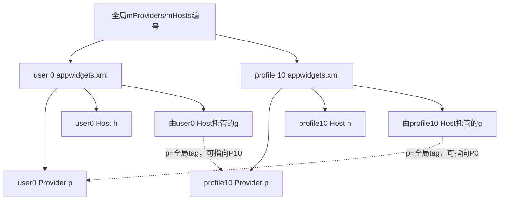
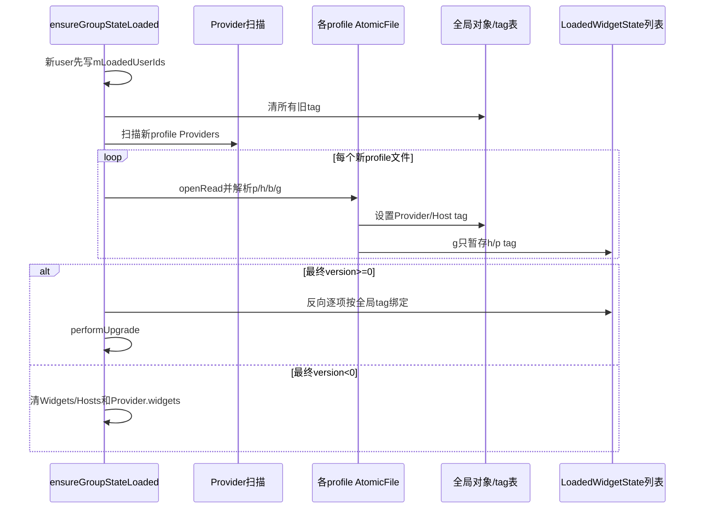
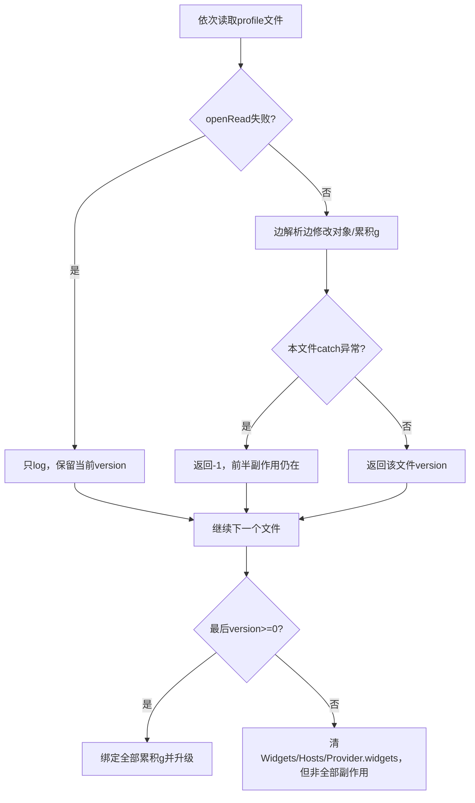

# 第 380 章 Android AppWidget 主状态：分用户 XML、AtomicFile、跨用户 Tag 与损坏加载链

> 源码基线：Android 11 / API 30 / `android-11.0.0_r48`。本章只在 macOS 阅读源码，不编译。上一章分析BackupManager迁移格式；本章回到设备日常运行的 `/data/system/users/<userId>/appwidgets.xml`。重点不是XML语法本身，而是：Provider按所属用户保存、Widget按Host用户保存，却用整个profile group的全局ordinal tag连边；AtomicFile只保护单个文件，多文件没有共同提交。

## 1. 主状态与备份状态不同

主文件根标签是`gs`、CURRENT_VERSION=1，用于本机重启恢复；备份根是`ws`、版本2，用于跨设备old/new ID迁移。两者复用p/h/g序列化helper，但生命周期和过滤规则不同。

## 2. 文件位置

每个用户文件位于 `Environment.getUserSystemDirectory(userId)/appwidgets.xml`，通常即`/data/system/users/<id>/appwidgets.xml`。普通应用无法直接读写。

## 3. 为什么分用户文件

用户删除、停止和加密解锁可独立管理状态，也避免把所有profile资料放进user 0单文件。但跨profile Widget又要求加载整个group后才能连边。

## 4. 文件不是每Widget一份

一个用户文件包含该用户Providers、Hosts、由该用户Host托管的Widgets，以及该用户永久bind白名单。更新任一关系可能重写整个group的多个文件。

## 5. saveGroupStateAsync 的线程

调用方只向BackgroundThread Handler post SaveStateRunnable；Runnable稍后取mLock、ensureGroupStateLoaded，再调用saveStateLocked。API返回不代表文件已落盘。

## 6. 多次保存不会天然合并

源码只是逐次post Runnable，没有在此处remove旧任务或generation去重。后台任务串行执行时每次写它获得锁时的当前状态，可能产生重复I/O。

## 7. 保存先给全局对象编号

`tagProvidersAndHosts()`按mProviders和mHosts全局ArrayList下标，分别给所有对象写0、1、2……tag，不按用户重新从0编号。

## 8. Provider与Host各有独立编号域

Provider tag=3与Host tag=3不冲突，因为g的p和h字段分别在不同对象表查找；同一类型内部则必须在整个group唯一。

## 9. 为什么需要全局编号

一个父用户Host可引用工作资料Provider。Widget g写在Host用户文件，Provider p写在资料用户文件；只有共享全局tag才能在读完两个文件后重连。

## 10. tag 不是稳定业务ID

它取决于ArrayList当前顺序，Provider/Host增删后下次保存可整体重排。只能在同一批分片文件的同一代际内解释。

## 11. 保存遍历enabled profile group

`getEnabledGroupProfileIds(userId)`返回本组启用成员，saveStateLocked逐个取得AtomicFile并写该profile切片。未启用/未纳入的profile本次不会刷新。

## 12. Provider写入归属文件

仅 `provider.getUserId()==fileUserId`且shouldBePersisted时写p。Provider有Widget或非空infoTag才需要留档。

## 13. Host写入归属文件

所有 `host.getUserId()==fileUserId`的Host都会写h，没有在写入处要求widgets非空。正在监听但尚无Widget的Host也可能进入文件。

## 14. Widget按 Host 用户分片

只检查 `widget.host.getUserId()==fileUserId`。Provider可以来自另一个profile，p tag仍写进g，等待另一个文件提供对应p元素。

## 15. bind白名单按授权用户分片

`mPackagesWithBindWidgetPermission`中的Pair first等于file user才写b元素；只保存包名，不保存UID，加载时重新解析当前安装UID。

## 16. 主XML写入顺序

固定为根gs、全部p、全部h、全部g、全部b。解析器虽然按tag处理，不严格依赖顺序，但p/h先出现便于同文件对象先建立。

## 17. Provider元素字段

p保存包名、Receiver类名、全局tag，以及可选info_tag；完整AppWidgetProviderInfo仍从当前APK metadata解析。

## 18. Host元素字段

h保存包名、hostId和全局tag；callingUid不直接写盘，重启后用PackageManager按包名重新求UID。

## 19. Widget元素字段

g保存appWidgetId、restoredId、Host tag、可选Provider tag，以及固定尺寸、host category和restore_completed状态。

## 20. 不保存 RemoteViews

真实views、maskedViews、Actions、Bitmap、callbacks和通知水位都只在内存；重启后Provider需重新UPDATE，Host先显示initialLayout/遮罩。

## 21. options仍是白名单字段

只写min/max宽高、category和restore_completed，自定义Bundle键重启丢失。与第366章options持久化边界一致。

## 22. restore_completed在主文件保存

主状态调用serializeAppWidget(...,true)，与备份切片false不同；本机重启保留Provider已完成恢复标志，跨设备恢复则要求重新确认。

## 23. XML写入示意

## 24. AtomicFile startWrite

每个profile调用file.startWrite取得stream。AtomicFile会保留旧版本/临时新版本，使单次写失败可恢复旧完整文件。

## 25. finishWrite 与 failWrite

serializer成功返回true就finishWrite；catch IOException返回false则failWrite并warning，恢复该文件备份版本。

## 26. 打不开文件时继续下一个

startWrite抛IOException只记录“Failed open”，循环仍处理其他profile。一个用户写失败不会回滚已经成功写完的其他用户文件。

## 27. write helper只catch IOException

NullPointerException、RuntimeException等会逸出，saveStateLocked没有finally调用failWrite；AtomicFile下次openRead可能恢复backup，但本次任务会异常终止且后续profile不写。

## 28. AtomicFile保证的范围

它保证一个appwidgets.xml不会通常留下半截新XML，不保证内存状态与Host回调同步，也不保证profile group多个文件同时处于同一tag代际。

## 29. 多文件提交窗口

循环先finish user0，再写profile10；此间system_server/设备掉电，user0可能是新tag表，profile10仍是旧tag表，两个文件各自都完整。

## 30. 跨代际 tag 的后果

新user0 g的p=5可能在旧profile10文件中对应另一个Provider或根本不存在；加载按tag首次匹配，可能丢Widget或错误连到同tag对象。

## 31. AtomicFile无法识别组代际

XML没有group transaction ID、epoch或共同manifest；加载器无法判断两个完整文件是否来自同一saveStateLocked循环。

## 32. 更严格设计需要什么

可给所有分片写同一generation并在加载时校验，或先写全组临时文件再以manifest提交；r48未实现。本章只做源码理解，不修改系统。

## 33. tag字段保存后不会清

tagProvidersAndHosts写入对象字段，save完成不调用clear。字段留到下次重新编号或加载前清理，dump/其他序列化可能看到最近值。

## 34. clearTags 的调用时机

ensureGroupStateLoaded发现新profile成员时，先把所有现有Provider/Host tag置TAG_UNDEFINED，再扫描新成员Provider并读新文件。

## 35. mLoadedUserIds 先记后读

新profile IDs在真正loadGroupState前就put入mLoadedUserIds。后续文件解析失败也没有从此表撤销，本进程再次ensure通常认为已加载而不自动重试。

## 36. 这是失败恢复边界

一次暂时文件损坏/读取异常可能让该user在本system_server生命周期保持“loaded但内容被清/缺失”，需要用户停止重启或服务重启等外部状态变化再读。

## 37. 加载先扫描已安装Providers

`loadGroupWidgetProvidersLocked(newProfileIds)`查询Receiver建立Provider对象，随后XML p主要给它们恢复tag/infoTag；正常模式不盲目信任文件创建不存在Provider。

## 38. safe mode 例外

Provider合法ActivityInfo但lookup不到且mSafeMode时，解析p会创建zombie Provider占位，保护关系不因第三方组件暂不可用被prune。

## 39. loadGroupState 的loadedWidgets暂存

读取各profile文件时g不立即绑定，只创建Widget和host/provider tag对，追加到共享List；全部文件读完后才bind。

## 40. 延迟绑定支持跨profile

Host h可能在user0文件、Provider p在profile10文件；只有两边都解析完成，findHostByTag/findProviderByTag才有对象。

## 41. loadGroupState 流程图

## 42. AtomicFile openRead 的恢复

openRead会按AtomicFile规则选择已提交或备份版本；加载器本身不手工解析`.bak`。打不开只catchIOException并继续。

## 43. 文件不存在不等于解析失败

openRead IOException只log，不把version设-1。初值version=0，全部文件都不存在时仍走空状态bind并执行version0升级。

## 44. version变量是单个共享值

循环每成功调用read就覆盖version，没有按profile保存版本数组。最终判断和upgrade只看最后一次成功/返回的值。

## 45. 早坏后好可能被“覆盖”

前一文件read返回-1但已对对象表做部分修改，后一文件返回1会把version改为1；最终仍bind共享loadedWidgets，前一坏文件的部分副作用不会回滚。

## 46. 后坏则清全组UI关系

若最后读取文件返回-1，else清mWidgets、mHosts及每个Provider.widgets，即使前面文件完全成功。

## 47. 版本不一致看最后文件

user0 version0、profile10 version1时，最后遍历项决定是否执行keyguard升级；没有校验同组版本一致。

## 48. read的catch范围更宽

捕获NullPointerException、NumberFormatException、XmlPullParserException、IOException和IndexOutOfBoundsException，记录failed parsing并return -1。

## 49. Security/IllegalState等仍可能逸出

未列出的RuntimeException/Error不被read捕获。系统文件虽可信，PackageManager/内部假设异常仍可能中断启动路径。

## 50. 解析不是临时事务

p/h/b遇到时直接修改mProviders、mHosts、grants；g直接推进next ID并加到loaded list。后面出错返回-1不会自动撤销这些前半副作用。

## 51. 失败清理并不彻底

else清Widgets、Hosts和Provider.widgets，但不清mProviders本身，也没有清本次已加入的bind白名单；部分p的infoTag/tag和b授权可能留下。

## 52. clearWidgets 会清包缓存

`clearWidgetsLocked()`清mWidgets并清mWidgetPackages，避免isBoundWidgetPackage继续报告已失败加载的关系。

## 53. Provider对象为何保留

它们主要来自当前PackageManager扫描，即使状态文件坏，已安装Provider集合仍应存在；只清其widgets关系，而非删除组件发现结果。

## 54. Host全部清除

Host是由状态文件关系恢复的对象，失败时mHosts.clear。之后真实Launcher startListening可lookupOrAdd一个新空Host。

## 55. p解析先规范包名

读取pkg/cl后调用getCanonicalPackageName处理旧包名映射；返回null就continue。签名一致性仍有TODO，没有存/比旧签名。

## 56. Provider包未安装就跳过

getUidForPackage<0或getProviderInfo null都continue，不创建普通zombie；safe mode占位只在providerInfo存在但lookup缺失分支。

## 57. legacyProviderIndex 仍递增

每遇p就加一，即使该Provider被continue；老格式无tag时后续合法Provider的legacy ordinal仍对应XML位置，不因跳过重新压缩。

## 58. Provider tag 优先显式属性

有tag按十六进制解析，无tag使用legacyProviderIndex，兼容旧版本按出现顺序引用。

## 59. 正常模式 provider 理应已存在

lookupProviderLocked依赖前置Receiver扫描；如果providerInfo有效但lookup仍null且非safe mode，后续 `provider.tag=...`会NPE，被外层catch成整个文件-1。

## 60. infoTag 的加载

先保存字符串；非空且非safe mode时按备用metadata重解析，成功才替provider.info，失败保留扫描阶段默认info但infoTag字符串仍旧存在。

## 61. 这重现第377章分叉

实际Info来自default而选择字段仍指失效key；未来同key主动更新可能相等no-op，包扫描每次先试失败key。

## 62. Host包未安装的处理

UID<0就host.zombie=true；正常模式不加入mHosts，safe mode则保留UNKNOWN_UID zombie Host，避免安全模式永久丢桌面关系。

## 63. Host tag也兼容legacy

显式tag优先，否则用每遇h递增的legacyHostIndex。hostId按十六进制解析。

## 64. b授权只给已安装包

加载packageName后重新查UID，>=0才把(user,package)加入授权Set；包未安装不会保留zombie grant。

## 65. g先恢复实例ID

十六进制id写入Widget，同时 `setMinAppWidgetIdLocked(user,id+1)`推进下次分配下限，避免与磁盘旧ID冲突。

## 66. 即使之后绑定失败也推进ID

Host/Provider tag找不到时Widget会被drop，但计数器已提高。ID空洞是安全代价，不会回退复用。

## 67. rid 允许缺失

老文件无restoredId就设0；options helper解析固定属性，缺失键保持Bundle默认。

## 68. provider tag允许缺失

没有p属性设TAG_UNDEFINED，代表已allocate未bind实例。bindLoadedWidgets当前却先找Provider，null就continue，因而这种未绑定磁盘Widget不会恢复Host空槽。

## 69. 这是空槽持久化落差

写入会保存provider为null的g，但加载bind直接丢弃它；服务重启后已分配未绑定ID关系消失，计数器仍因读g推进。

## 70. Host查找发生在Provider之后

bind先findProvider，null即continue，甚至不查Host；Provider存在后再findHost，缺失也drop。

## 71. findByTag 不校验 user

两个方法遍历全局列表，只比较tag，取第一个匹配对象。正确性完全依赖同一save代际的全局唯一tag。

## 72. 跨代际重复tag更危险

若不同profile文件来自不同编号代际，p=5可能错误连到另一个用户Provider，而不是简单找不到；后续安全检查并不会在bind处重新验证Host—Provider方向。

## 73. bind使用反向顺序

从loadedWidgets末尾向前remove并add，最终mWidgets/Provider.widgets/Host.widgets顺序与XML读取顺序相反。功能不依赖公开顺序，但getWidgetIds广播数组会受此影响。

## 74. 成功绑定的四步

设widget.provider、设widget.host、分别加入两侧widgets列表，再addWidgetLocked进入全局并更新包缓存/遮罩。

## 75. 缺一端不做半连接

Provider或Host不存在都continue，不把Widget加入任何列表；但前面解析计数器/options临时对象已经产生并被丢弃。

## 76. 增量加载新profile的tag问题

ensure只读newProfileIds，却先清所有已加载对象tag。新文件中的跨profile g若引用旧用户Host/Provider，旧对象tag未从旧文件重读，可能无法绑定。

## 77. 这是源码推导的增量风险

是否在实际profile启用流程触发取决于组加载时机与已有内存关系；应标为需要场景验证，不能断言所有工作资料都会丢Widget。

## 78. 加载成功后版本升级

`performUpgradeLocked(version)`只实现0→1：把旧android包Keyguard HostId迁到`com.android.keyguard`真实UID。

## 79. version缺失/非法视为0

gs version parse NumberFormatException时version=0，走兼容升级；这比备份ws解析更宽容。

## 80. 未来版本会怎样

read可返回2等数值，performUpgrade没有1→2或降级路径，最终 `version!=CURRENT_VERSION`抛IllegalStateException，可能中断服务初始化。

## 81. 降级不是支持场景

新系统写过更高版本后回刷旧framework，r48不会安全忽略未知字段并继续，而是upgrade失败；系统OTA通常需配套data downgrade策略。

## 82. 旧Keyguard迁移条件

精确查 `HostId(Process.myUid(),KEYGUARD_HOST_ID,"android")`，新包安装且UID可查才替换；找不到旧Host或新UID时静默保留/跳过。

## 83. upgrade 后没有立即同步保存语句

loadGroupState只改内存；后续正常save事件会写version1与新HostId。若升级后立即崩溃，下一次可能再次执行幂等查找。

## 84. 旧全局文件迁移

user0目标文件不存在时，getSavedStateFile尝试把`/data/system/appwidgets.xml`rename到新用户目录，兼容早期单文件位置。

## 85. rename失败被忽略

注释明确rename不抛且错误忽略；随后AtomicFile指向新位置，openRead可能报不存在并按空状态继续。旧文件不会再被本方法读取。

## 86. 只为system user迁旧路径

profile用户从未使用旧全局路径，不执行rename。目录不存在时user0会mkdirs，但未检查返回值。

## 87. 主状态不是加密业务数据仓库

它位于系统用户目录并受系统权限/用户存储生命周期管理，但不保存Provider内容；敏感业务数据仍归应用CE/DE存储策略。

## 88. 用户停止时内存会拆关系

onUserStopped删除该user同端Widget/Host/grants、清loaded标记和nextId；跨profile Provider可保留供父Host显示mask。之后再启动会重新加载文件。

## 89. stop与异步save可能竞态

SaveStateRunnable获取mLock时写“当时”启用组内存图；用户状态变化可能让profileIds集合变化。没有每次mutation对应固定快照。

## 90. 文件完整不等语义完整

AtomicFile只能证明XML字节可解析；包卸载导致p/h跳过、tag跨代际、Provider metadata失败都可能让语义关系丢失。

## 91. 损坏加载决策图

## 92. 诊断先确认是哪一用户文件

Widget按Host用户保存，不一定在Provider用户文件；跨资料卡片应同时检查parent Host文件和profile Provider文件，单看一个会误判g或p缺失。

## 93. 再确认tag代际

列出所有profile文件p/h tag与g引用，检查同类型tag唯一、引用目标存在且组件/Host user符合预期。不要只验证XML well-formed。

## 94. 再查PackageManager现态

文件有p不代表加载会保留：包UID、canonical名称、Receiver ActivityInfo、safe mode和metadata解析都影响Provider对象。

## 95. nextAppWidgetId为何跳大

损坏文件前半读到高ID后即调用setMin，即使g最终drop/全组clear，计数器可能保留较大下限；空洞不是ID泄漏安全问题。

## 96. bind白名单残留审计

文件后部损坏导致全组clear时，本次前半读取的b可能仍在Set；服务安全入口还会验证调用包/UID，但“损坏即完全回默认授权”并不成立。

## 97. Provider infoTag残留审计

同理p已写入旧infoTag、后部g损坏返回-1，Provider对象保留，infoTag不会在失败else清掉，可能影响后续包扫描metadata选择。

## 98. 为什么不能逐文件立即bind

跨profile Provider/Host可能尚未读取；立即bind会把合法跨用户g误判缺端。共享loadedWidgets延迟绑定是必要设计。

## 99. 为什么延迟绑定仍不够

多文件无共同generation且incremental加载不重读旧tag，延迟只能解决“读取顺序”，不能解决“分片代际”和“未参与本轮文件”的tag问题。

## 100. 可靠性修复方向

组级generation、按稳定ProviderId/HostId直接引用、解析到临时图后整体commit、失败清理完整化，都可降低风险；代价是格式迁移和更大内存。

## 101. 不应直接把ComponentName替代全部tag

Host身份还含UID/hostId，Provider跨包升级/canonical名称也需处理；稳定key设计要覆盖用户和恢复占位，不是简单写一个类名字符串。

## 102. 保存时持mLock的好处

tag分配与所有分片序列化期间内存关系不会被其他正常AppWidget mutation改变，单次循环内部看到一致对象图。

## 103. 持锁I/O的代价

XML序列化、AtomicFile写和finish都在mLock下，慢闪存/大量Widget会阻塞Binder调用、通知schedule和包状态处理。

## 104. BackgroundThread只避免主线程阻塞

它没有避免AppWidget全局锁竞争。调用者异步返回，但稍后服务请求仍可能等待SaveStateRunnable。

## 105. Host数据库与系统XML无共同事务

Launcher先保存网格后system save失败，或反过来，都可能产生孤儿ID。启动时Host应把本地ID与getAppWidgetIdsForHost核对。

## 106. Provider数据库同样独立

Provider按ID配置可能已写而system关系未落盘，重启后成为孤儿配置；onDeleted/onRestored与定期清理需幂等。

## 107. RemoteViews不持久的好处

避免大Bitmap/Actions膨胀系统XML、资源版本过期和反序列化攻击面；代价是重启后必须依赖Provider及时更新。

## 108. restore_completed 是少数握手状态

它以boolean进入主options，帮助本机重启记住跨设备恢复完成；但映射广播notified本身不持久，二者不能互相替代。

## 109. 阅读主状态的四层法

先看物理文件原子性，再看profile分片归属，再看全局tag连边，最后看PackageManager解析/对象绑定；只读XML字段无法得出最终mWidgets。

## 110. 本章最重要的三个否定句

AtomicFile完整不等group一致；最后version成功不等前面文件无损坏；解析失败清Widgets不等所有副作用/授权都回滚。

## 111. 复读后的风险分级

单文件Atomic与分片字段是直接事实；跨代际错误绑定和incremental tag缺失是源码可推导风险，是否在具体设备时序触发需场景验证；文档不把后两者写成普遍必现。

## 112. macOS 只读练习一：手写跨profile XML

阅读 `sed -n '3016,3130p' frameworks/base/services/appwidget/java/com/android/server/appwidget/AppWidgetServiceImpl.java`，设parent Host tag=2、profile Provider tag=5，分别写两个文件最小p/h/g，并说明g为何放Host文件。

## 113. macOS 只读练习二：推演多文件崩溃

假设旧代Provider tag=3、新代tag=5，user0新文件已finish、profile10仍旧时掉电。对照findProviderByTag只比tag的实现，列出“找不到”和“误连同tag对象”两种结果，全程只读不改文件。

## 114. macOS 只读练习三：验证损坏覆盖规则

阅读 `sed -n '2831,2868p'`和 `sed -n '3132,3275p'`同一文件，推演profile A坏/B好与A好/B坏两种顺序，记录最终version、已累积对象和失败清理未覆盖的grants/infoTag。

## 115. macOS 只读练习四：检查未绑定Widget

阅读g解析和 `bindLoadedWidgetsLocked()`，构造无p属性的合法g，标出ID下限推进、providerTag=-1、findProvider返回null和continue，解释为何写盘存在但重启不恢复空槽。

## 116. 排障清单：重启后跨资料Widget消失

同时检查Host用户g与Provider用户p、全局tag是否一致、profile是否本轮enabled/loaded、provider/host包是否存在，以及incremental加载前清tag后是否重读了目标端。

## 117. 排障清单：文件看似正常却关系错

不要只跑XML parser；比较各文件generation语义、tag唯一性、ComponentName/UID/user、findByTag首次匹配和PackageManager过滤结果。

## 118. 排障清单：一次损坏后服务不再重读

查看mLoadedUserIds是否在读取前已标记、最终version与失败清理日志；本进程ensure可能直接return，需要通过正确用户/服务生命周期触发新的加载，而不是反复调用普通API。

## 119. 排障清单：授权或infoTag异常残留

检查read前半是否已加入b/infoTag，后半才failed parsing；失败else不清这两类状态。结合包UID和实际bind权限重新核对，避免只删除Widget列表。

## 120. 本章结论与下一章入口

AppWidget主状态把Provider/Host/Widget/授权按用户分片，却用全局ordinal tag跨文件连接；AtomicFile保护单文件字节，不提供group事务。加载又边解析边改对象、以最后version决定全组绑定/清理，并留下未完整回滚和增量tag风险。下一章继续分析AppWidget ID分配计数器、Host/Provider访问查询和同UID多包授权判定，理解每个Binder入口如何找到正确Widget。
