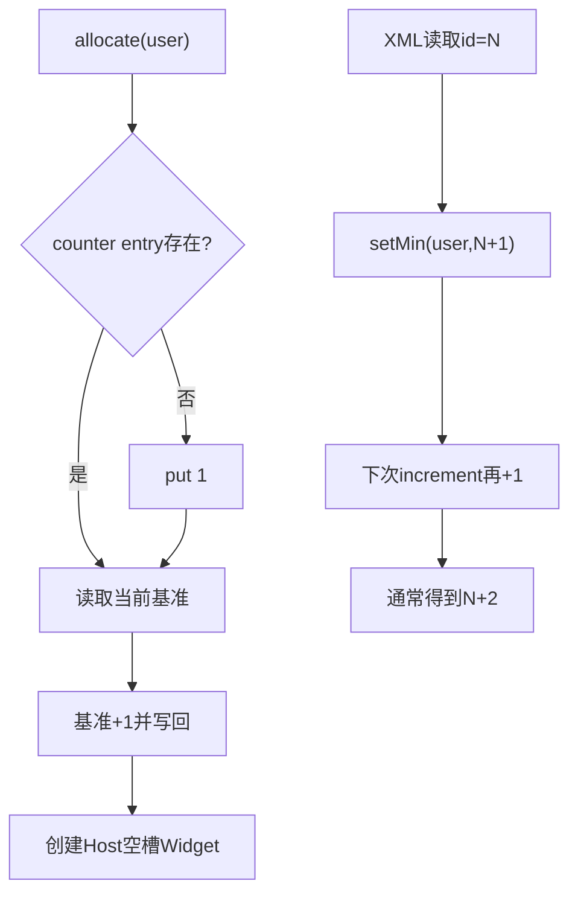
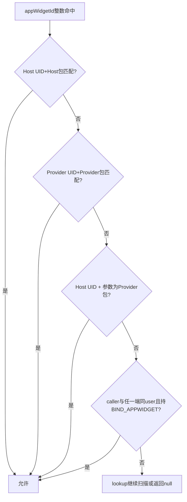
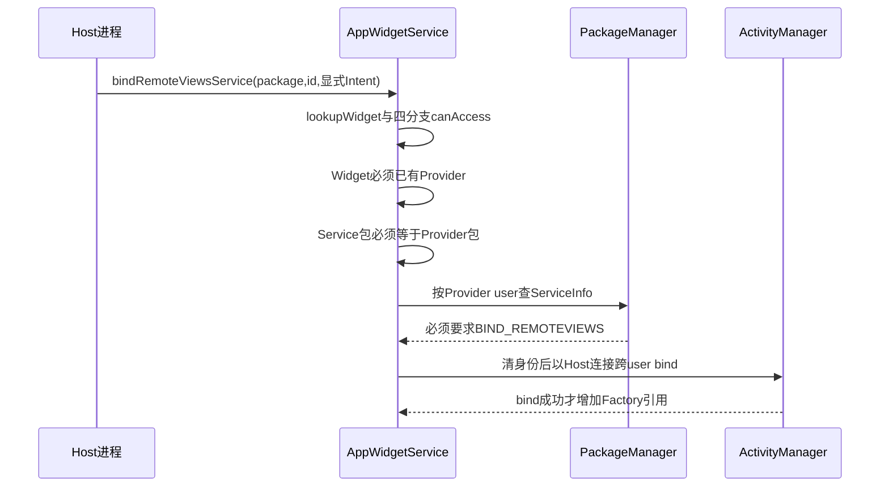

# 第 381 章 Android AppWidget ID 与访问判定：计数器、Lookup、共享 UID、包名和跨用户边界

> 源码基线：Android 11 / API 30 / `android-11.0.0_r48`。本章只在 macOS 阅读源码，不编译。上一章恢复了内存关系图；本章回答所有Binder入口共同的问题：一个整数appWidgetId怎样定位到Widget，调用者凭什么读取、更新或删除它？重点区分AppOps包名校验、HostId/ProviderId精确身份和`canAccessAppWidget()`四条授权分支。

## 1. 三种 ID 不要混淆

appWidgetId标识一个Widget实例；hostId由宿主包自行选择，区分同包多个Host；Provider用Receiver ComponentName标识。服务端关系是Widget{appWidgetId,Host,Provider?}。

## 2. appWidgetId 的无效值

`AppWidgetManager.INVALID_APPWIDGET_ID=0`。正常服务分配正整数；客户端无服务或instant app失败也可能得到0/无效值，部分旧客户端包装曾用-1返回，要看具体层。

## 3. 计数器按 user 保存

`SparseIntArray mNextAppWidgetIds`以userId为key，不按Host或Provider。不同用户可以出现相同整数ID，访问时还要结合UID/关系判定。

## 4. peek 的默认值

user尚无entry时返回 `INVALID_APPWIDGET_ID+1`，即1。它不是直接返回“下一个要发的ID”，而是increment方法的基准。

## 5. incrementAndGet 的实现

读取peek后加1、把结果写回Map并返回。因此新用户第一次直接调用得到2，而不是1。

```java
final int appWidgetId = peekNextAppWidgetIdLocked(userId) + 1;
mNextAppWidgetIds.put(userId, appWidgetId);
return appWidgetId;
```

## 6. allocate 中还有一次初始化put

若Map无user，allocate先put `INVALID+1`即1，再调用increment，结果同样是2。这个put与peek默认值语义重复但明确建立entry。

## 7. ID 不要求连续

删除不会回退计数器，恢复/损坏加载也会推进下限；空洞是正常现象。应用只能把ID当opaque token，不能用相邻关系推断创建顺序。

## 8. setMin 的用途

从主XML读到旧ID时调用 `setMinAppWidgetIdLocked(user,id+1)`，若当前基准更小就提高，避免未来重新分配已存在ID。

## 9. 加载会多留一个空洞

若最高磁盘ID=20，setMin写21，下一次increment再加1返回22；21不会被分配。它是r48执行结果，不影响唯一性。

## 10. drop的Widget也能推高计数器

g解析在Host/Provider tag绑定前就setMin；后来因缺端被丢弃，ID下限仍升高。服务优先避免碰撞，不尝试回收解析过的数字。

## 11. 用户stop会移除计数器

onUserStopped从mNextAppWidgetIds删user entry；下次加载文件重新扫描所有g并setMin。若文件空/关系丢失，编号可能从较低基准重新开始，但内存旧Widget也已拆除。

## 12. int溢出未处理

increment没有MAX_VALUE检查；实际设备不可能正常创建约21亿实例，但源码没有形式化回绕保护。

## 13. 分配流程

Host调用allocate，服务先AppOps验证包、拒绝instant app、加载group、生成ID，再按callingUid+hostId+package查/建Host，创建provider=null Widget并异步保存。

## 14. allocate不等于bind

新Widget只是Host空槽；随后Settings授权或Host调用bindAppWidgetId才连接Provider。中途取消应delete该ID。

## 15. ID生成图



## 16. HostId 是三元组

字段为uid、hostId、packageName；equals逐项比较，hashCode也包含三者。整数hostId相同但包或UID不同，不是同一Host。

## 17. 为什么既要 UID 又要包名

UID证明内核身份，包名区分共享UID下的不同宿主/做AppOps归因；包重装UID变化时旧Host不会被新调用者直接冒领，恢复路径需resolve。

## 18. hostId 只在包内有意义

Launcher通常使用固定hostId重连自己的数据库；另一个包可用相同数字而不冲突。一个包也可建立多个hostId隔离不同UI空间。

## 19. lookupOrAddHost

先线性lookup精确HostId，找不到就new Host加入mHosts。它不验证hostId正负或范围，调用前安全入口负责身份。

## 20. 空Host何时prune

只有widgets为空且callbacks=null才从列表移除；正在listen的空Host保留，stop后可能被prune。

## 21. ProviderId 是二元组

字段为Provider应用uid与Receiver ComponentName；ComponentName自身包含包名和类名。相同UID下两个Provider组件仍是不同对象。

## 22. Provider不使用任意metadata名字作身份

infoTag、initialLayout、label变化不会改变ProviderId；Receiver组件改名则成为新Provider，旧Widget不会自动迁移。

## 23. Provider/Host lookup 都是线性

遍历ArrayList并equals，没有HashMap主索引。典型Widget数量小，换取状态加载/顺序管理简单；大量Provider会增加锁内查找成本。

## 24. Widget lookup 先比整数

遍历mWidgets，appWidgetId相等后才调用canAccessAppWidget。因为ID按user可重复，不能仅命中第一个整数就返回。

## 25. 找第一个“可访问”的同号实例

不同user同ID时，不符合调用身份的项跳过，继续扫描；若状态损坏在同一访问域产生重复ID，返回列表中最先匹配的一项。

## 26. lookup返回null是常见拒绝方式

许多API对不存在或无权ID都返回null/空/直接return，不向调用者区分“对象不存在”和“权限不匹配”，减少ID枚举信息。

## 27. bindRemoteViewsService例外

lookup为null时明确抛IllegalArgumentException("Bad widget id")，因为Host内部集合绑定错误需要诊断；入口安全仍依赖canAccess。

## 28. 三层身份验证

多数入口先`enforceCallFromPackage(callingPackage)`，再构造精确Host/ProviderId或lookupWidget，最后按API检查provider/zombie/profile/permission。前一层不能替后两层。

## 29. enforceCallFromPackage 用 AppOps

`mAppOpsManager.checkPackage(Binder.getCallingUid(),packageName)`验证该UID拥有该包名。它不接受调用者随意声称另一个UID的包。

## 30. UID 已编码 userId

同一个appId在user0与profile10会形成不同完整UID；checkPackage和Host/ProviderId因此天然带用户边界。

## 31. shared UID 的含义

多个包声明同sharedUserId时拥有同UID，AppOps认为该UID合法拥有其中每个包。它们本来就共享进程/权限信任边界，包名不构成强安全隔离。

## 32. shared UID仍分开Host对象

HostId含packageName，所以包A和B用同hostId会建两条Host记录；但同UID进程可以在checkPackage中合法传A或B包名访问对应记录。

## 33. Provider也是组件精确

Provider API先验证component包属于callingUid，再构造`ProviderId(callingUid,component)`；同UID包A不能拿A组件名查B组件，除非明确传B的合法ComponentName。

## 34. 第一条Widget访问分支

`isHostInPackageForUid`要求host.id.uid==caller uid且host package==callingPackage。普通Launcher读Views/options、删除和note tap主要走这里。

## 35. 第二条访问分支

`isProviderInPackageForUid`要求provider非null、Provider UID相同且组件包==callingPackage。Provider可更新、查询甚至通过通用lookup访问自己的实例。

## 36. Provider可以访问别的Host中的自身Widget

这正是updateAppWidgetIds需要的能力；Provider拿到自己实例IDs后提交RemoteViews，不需要Host授权每次更新。

## 37. 第三条访问分支很特殊

`isHostAccessingProvider`要求caller uid等于Host UID，但传入packageName等于Provider包，不要求等于Host包。

## 38. 为什么允许这种组合

源码注释说明Host可能创建Provider package Context来绑定集合Service：传入包名表现为Provider包，但Binder调用仍来自Host UID。普通RemoteViews混合Context的`getOpPackageName()`是否沿Host base委托要看具体Context，不能一概而论。

## 39. 该入口刻意不先checkPackage

`bindRemoteViewsService()`没有调用enforceCallFromPackage，否则Host UID通常不拥有Provider包，会在到达第三分支前被拒绝。

## 40. 第三分支不是通用冒充

它只帮助lookupWidget，随后还强制Intent显式Service与Widget Provider同包、Service位于Provider user且要求BIND_REMOTEVIEWS，再由system身份跨user bind。

## 41. 若普通入口先checkPackage

Host传Provider包会被AppOps拒绝，无法利用第三分支；所以必须结合具体Binder入口看前置校验，不能孤立地把canAccess视为所有API最终权限。

## 42. 第四条特权分支

若caller user等于Host user或Provider user，并持有BIND_APPWIDGET权限，则可访问该Widget，不要求包名匹配Host/Provider。

## 43. BIND_APPWIDGET是signature级能力

通常给系统Launcher/Settings等受信组件，不是普通应用运行时权限。它允许系统管理者跨包处理同userWidget。

## 44. 特权仍限制用户关系

caller必须与Host或Provider一端同user；仅持权限不自动访问任意其他无关用户实例。

## 45. 四分支图



## 46. provider=null 对分支的影响

Host精确分支仍可访问未绑定空槽；Provider、RemoteViewsService和provider-user特权判断都需null保护。后续具体API若直接解引用provider仍可能崩。

## 47. updateOptions 的空槽风险

Host可通过第一分支找到provider=null Widget，方法merge options后无null检查调用sendOptionsChangedIntentLocked，后者解引用widget.provider.info，存在NPE路径。

## 48. noteAppWidgetTapped也有空槽风险

Host精确lookup成功后直接读取 `widget.provider.id`。正常屏幕只对已绑定Widget点击，但恶意/错误Host可用已allocate未bind ID触发null解引用。

## 49. stopListening的相似风险

Host.getWidgetUids遍历所有Widget直接读provider.id；Host含未绑定空槽时stop调用visibility=false可能NPE，前章已记录。

## 50. getInfo处理更稳健

lookup后要求provider非null且非zombie才clone info，否则返回null；不会把占位ProviderInfo当正常API结果。

## 51. getViews允许空槽

lookup成功就返回effective views，空槽通常为null；Host据此显示默认/等待绑定，不解引用Provider。

## 52. getOptions允许空槽

只看widget/options非null并clone，allocate时options可能尚未设置；否则返回Bundle.EMPTY。

## 53. cloneIfLocalBinder的原因

跨进程Parcel天然复制；system_server同进程调用则需要clone避免客户端直接修改服务缓存。Bundle clone只是浅复制，嵌套可变对象仍可能共享。

## 54. update API为何先校验包

Provider提交RemoteViews时callingPackage来自自身Context；AppOps确认UID拥有它，再lookup第二分支确保每个ID确为该Provider实例。无权ID被静默跳过。

## 55. 批量更新是逐ID授权

一个数组可混入合法/非法ID；循环对每个lookup，合法项更新，非法项跳过，不做整批原子拒绝。

## 56. 因此可能部分提交

前面合法Widget已更新，后面超内存抛异常或无权跳过，不会回滚前项。调用者不能把批量API当事务。

## 57. delete API也允许Provider身份

lookup注释写“hosts or provides”，第二分支会让Provider删除自己的Widget关系；常规public客户端由Host调用，但服务端判定面更宽。

## 58. delete无权与不存在都静默

widget null直接return，不抛SecurityException。前置callingPackage伪造仍由AppOps抛。

## 59. get IDs for Provider

先验证component包，再精确ProviderId；返回该Provider.widgets全部ID，可能由不同Host user托管，但Provider自身有权知道。

## 60. get IDs for Host

按callingUid+hostId+package精确HostId返回其widgets，包含跨profile Provider实例；Host身份属于caller user。

## 61. startListening不接受任意Host

同样精确构造HostId，lookupOrAdd只会建立caller自己的Host；不能只猜别人的整数hostId接管callback。

## 62. stop/deleteHost也精确匹配

二者先checkPackage，再三元HostId lookup；shared UID调用者若明确传同UID另一包名，AppOps仍可能认可并操作该包Host，这是shared trust语义。

## 63. deleteAllHosts是重要例外

方法没有callingPackage参数，也不构造HostId；它遍历并删除所有 `host.id.uid==Binder.getCallingUid()`的Host。

## 64. shared UID下会跨包删除

包A调用deleteAllHosts会连包B的Host一起删，只要二者共享UID。这与名称“AllHosts”在UID信任域内一致，但应用开发者易误以为仅当前package。

## 65. deleteAllHosts没有AppOps包归因

它只信Binder UID，因此不存在伪造字符串；也无法区分同UID哪个包发起。shared UID已是共同安全主体。

## 66. HostId恢复中的UNKNOWN_UID

包尚未安装时可用-1占位；真实包added后resolveHostUidLocked替换id。此前正常callingUid无法精确匹配占位Host。

## 67. resolve只修第一个匹配

遍历mHosts，找到第一个UNKNOWN_UID且包名相等就替换并return。若损坏/重复恢复产生多个同包占位，其余保持未知。

## 68. Provider恢复占位也需reify

UNKNOWN_UID+component Provider在addProviderLocked中按组件查找并替换真实id/zombie/info；ProviderId变化是显式迁移，不靠equals自动匹配。

## 69. getUidForPackage清调用身份

服务用IPackageManager查指定user包信息，finally恢复身份；RemoteException被忽略并返回-1。它是存在性解析，不替代入口checkPackage。

## 70. 包未安装与无权要分开

getUidForPackage=-1用于加载/白名单/绑定目标判断；AppOps checkPackage针对当前调用者。两者失败产生不同异常或返回路径。

## 71. bind白名单键

永久允许集合存Pair(userId,packageName)，不是UID；包重装若同名且仍在XML，加载会重新查UID后恢复grant。

## 72. 绑定权限检查顺序

先尝试调用者是否持BIND_APPWIDGET；没有则看named package是否在user白名单。bindAppWidgetId入口此前已checkPackage，阻止拿别包白名单。

## 73. 白名单helper自身不比UID

它会查package存在并看Set，但不显式比较packageUid与callingUid；安全依赖调用它的bind入口已执行enforceCallFromPackage。

## 74. 这是组合式安全的重要例子

私有helper单独看似可被任意caller传白名单包，完整调用链前置AppOps补上边界。代码审计必须从Binder入口开始。

## 75. 管理白名单需要另一权限

has/setBindAppWidgetPermission先要求MODIFY_APPWIDGET_BIND_PERMISSIONS；它面向Settings/系统管理，不允许普通Launcher自行给自己授权。

## 76. Instant app Host被拒绝

startListening和allocate按明确callingPackage/user调用isInstantApp，instant应用不能托管Widget；返回空updates或INVALID ID而非建立Host。

## 77. isCallerInstantAppLocked的首包问题

另一些查询用callingUid的packages数组第0项判断instant；shared UID/多包下首项代表性有限，不过instant app通常不参与shared UID。

## 78. Provider列表查询的跨profile门

caller可看自身profile Provider；看managed profile时必须parent关系且DPM cross-profile provider包白名单包含目标包。

## 79. profile enabled 是另一层

绑定前还检查目标profile属于caller group且enabled。包白名单不代表停用profile仍可绑定。

## 80. bind目标Provider UID按profile求

服务使用providerComponent包名和providerProfileId查UID，再构造ProviderId；同包在两个user安装会得到不同UID/Provider对象。

## 81. bind前Widget必须属于caller

lookup空槽用callingUid/callingPackage，通常走Host精确分支；Provider不能把另一个Host空槽绑定给自己。

## 82. 已绑定不能重复bind

widget.provider非null直接false，避免用同ID换Provider。要换必须删除旧Widget并重新allocate/bind。

## 83. zombie Provider不可普通绑定

safe mode第三方占位拒绝新关系；已有恢复关系可保留并遮罩/等待正常模式。

## 84. RemoteViewsService入口为何特殊

它代表Host请求，却兼容Host侧Provider package Context产生的包名；所以不checkPackage字符串，而是以Host UID+Provider package第三分支识别，再严格校验目标Service。



## 85. Service必须显式Component

代码直接取intent.getComponent并取package，隐式Intent为null会NPE/失败；正常RemoteViews setRemoteAdapter构造显式Service。

## 86. Service包必须等于Provider包

即使Host有权访问Widget，也不能借系统跨user bind任意服务。类名可不同，但包必须与Provider Receiver包一致。

## 87. Service用户必须等于Provider用户

enforceServiceExists...按widget.provider.getUserId查询ServiceInfo，避免相同包名在Host user中解析成错误服务。

## 88. BIND_REMOTEVIEWS是必需权限

Service声明该signature权限，只有系统代bind；否则抛SecurityException。包相同仍不足以建立集合数据通道。

## 89. 真正bind清调用身份

AppWidgetService以system身份请求AMS，却传Host的IApplicationThread/activityToken/connection，使连接归Host进程，目标user为Provider user。

## 90. 引用计数只在bind成功后增加

AMS返回非0才记录(providerUid,FilterComparison)->appWidgetId，供Widget删除时决定RemoteViewsFactory销毁。

## 91. callingPackage不总是安全主体

普通入口它必须属于caller UID；RemoteViewsService入口它可能是Provider包而caller是Host UID。真正安全主体是Binder UID、关系图和入口专用校验的组合。

## 92. note tap 的额外TOP限制

先check Host包/lookup，再清身份查询caller UID进程状态；只有TOP及更前才给Provider记可见/UsageStats交互，后台Host不能伪造用户点击提升Provider。

## 93. TOP检查在关系lookup之前

非TOP直接return，减少锁工作；TOP后才取mLock查Widget。进程状态与真实点击没有加密证明，但调用来自可信Host UI路径。

## 94. note tap只给Provider记账

读取ProviderId并向AppOps visibility/UsageStats报告Provider包/用户，不给Host自身重复记Provider交互。

## 95. zombie/空Provider边界

note tap没有显式检查provider null/zombie；正常Host错误View/default点击路径是否调用note需结合OnClickHandler，错误调用可产生NPE或对占位记账。

## 96. canAccess不检查Widget当前在全局表之外

lookup只遍历mWidgets；已删除但仍被旧callback/局部对象引用的Widget不会被新Binder请求访问。

## 97. 锁保证关系判定快照

所有lookup与canAccess通常在mLock内，Host/Provider边不会同时被删除；权限的PackageManager/AppOps前置检查部分在锁外，存在常规TOCTOU但UID/包安装变化由系统管理。

## 98. AppOps checkPackage失败是显式异常

它不是lookup null；伪造包名通常抛SecurityException。无权Widget ID则多数被模糊成null/return。

## 99. 权限错误排障顺序

先确认Binder callingUid/user，再确认传入callingPackage是否属于UID，再看HostId/ProviderId精确字段，最后看canAccess四分支和API额外门。

## 100. 不要只看Java进程包名

共享UID、ContextWrapper opPackageName和跨user Provider Context会让“当前Context.getPackageName”与Binder主体关系不同；以服务收到的UID/字符串/入口为准。

## 101. 不要把appWidgetId当全局数据库主键

跨用户可重复。系统内部Widget对象还需Host/Provider/user关系；应用数据库至少在自身user/Host语境使用，跨profile管理工具要带user。

## 102. 不要自行构造相邻ID扫描

ID有空洞且lookup模糊不存在/无权；枚举应使用getAppWidgetIdsForHost或Provider API，而不是从1递增猜测。

## 103. shared UID的工程建议

共享UID包应视为共同信任域；deleteAllHosts、传另一包名操作精确Host等行为可能跨包影响。现代Android也逐步不鼓励新sharedUserId设计。

## 104. 特权调用要带正确user

BIND_APPWIDGET只允许访问Host/Provider一端同user的Widget；system组件跨任意user还需正确Binder user上下文或专门cross-user入口。

## 105. 错误修复不应只加package比较

RemoteViewsService第三分支是有意混合Host UID与Provider包。粗暴要求所有入口package属于caller会破坏跨包/跨profile集合，应在具体入口建立专用capability。

## 106. 空Provider健壮性应在使用点补

canAccess正确允许Host管理空槽；updateOptions/noteTap/stop等需要Provider的操作应显式拒绝或跳过，而不是收紧第一分支导致Host无法delete空槽。

## 107. ID计数修复要兼容磁盘

若想消除N+1空洞，必须统一peek语义、allocate初始化与setMin调用，并保证旧文件最高ID不碰撞；空洞本身比重复ID安全。

## 108. lookup性能优化需保留多user语义

从ArrayList改Map不能只用appWidgetId作key，应使用user/关系复合索引或一ID多候选，否则跨user同号会被覆盖。

## 109. 安全审计固定问题

入口是否checkPackage？lookup传的是Host包还是Provider包？Binder UID属于谁？Provider可null吗？是否有BIND_APPWIDGET/profile/Service额外门？五问缺一都可能误判。

## 110. 本章最重要的三个例外

新用户首ID不是1；deleteAllHosts不按package而按UID；bindRemoteViewsService不checkPackage并允许Host UID+Provider包组合。这三处最能提醒我们别从API名字猜实现。

## 111. 复读后的准确结论

共享UID跨包操作不是绕过内核身份，而是shared UID本来就是同安全主体；第三canAccess分支也不是普遍包名伪造，它只在缺少前置AppOps的专用集合入口有实际用途。

## 112. macOS 只读练习一：计算ID序列

阅读 `sed -n '920,955p'`和 `sed -n '1780,1805p' frameworks/base/services/appwidget/java/com/android/server/appwidget/AppWidgetServiceImpl.java`，算新user前三次allocate结果，再假设XML最高ID=20计算重启后下一ID。只读不调用服务。

## 113. macOS 只读练习二：手算四条canAccess

阅读 `sed -n '3860,3945p'`同一文件，构造Host uid/package、Provider uid/package、caller uid/package/user五组组合，逐条写true/false，并注明哪些普通入口会先被checkPackage挡住。

## 114. macOS 只读练习三：对比Host删除API

阅读deleteHost与deleteAllHosts实现，设包A/B共享UID且各有hostId=1，推演A分别调用两个API会删除哪些Host，解释HostId三元组与UID级“All”语义。

## 115. macOS 只读练习四：追RemoteViewsService特例

阅读 `sed -n '1265,1345p' frameworks/base/services/appwidget/java/com/android/server/appwidget/AppWidgetServiceImpl.java`和AppWidgetManager bind包装，标出callingPackage来源、第三访问分支、同Provider包/用户和BIND_REMOTEVIEWS四层检查。

## 116. 排障清单：明明有ID却lookup为null

检查是否跨user同号、callingPackage是否精确Host/Provider包、UID是否因重装变化、HostId/ProviderId是否zombie/UNKNOWN，以及BIND特权分支的user条件。

## 117. 排障清单：集合Service报Bad widget id

检查RemoteViewsAdapter Context的opPackageName、Binder调用是否仍来自正确Host UID、Widget是否已删除/未绑定、Service Intent是否显式；通过lookup后再查包/user/permission错误。

## 118. 排障清单：共享UID包互相影响

审查deleteAllHosts和调用时传入的包名，列出同UID全部Host；不要假设HostId数字或Java调用类自动限定当前APK。

## 119. 排障清单：空槽触发system_server异常

检查allocate后未bind却调用updateOptions、stopListening或noteTap；这些入口的lookup允许Host访问空槽，但后续部分代码直接解引用provider。应先delete取消ID或在framework修复使用点null检查。

## 120. 本章结论与下一章入口

AppWidget ID按用户递增且允许空洞，真正访问由Binder UID、AppOps包名、HostId/ProviderId关系和四分支canAccess共同决定。大多数入口先checkPackage，RemoteViewsService却有意允许Host UID+Provider包并追加严格Service校验；shared UID又扩大为共同信任域。下一章继续分析AppWidget options、ProviderInfo与本地Binder clone的对象所有权和可变Bundle边界。
