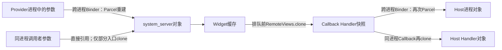
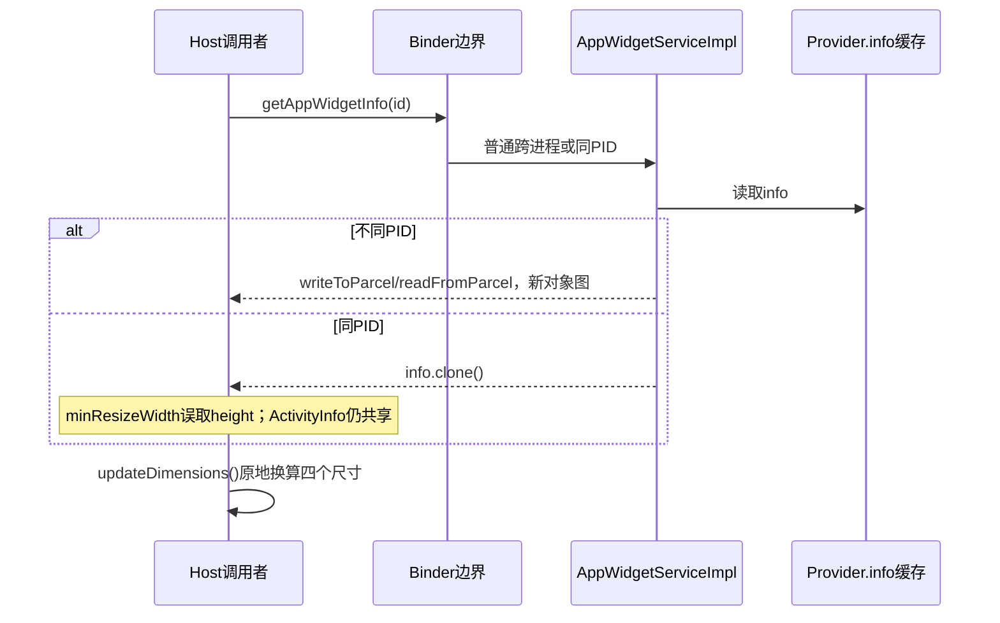
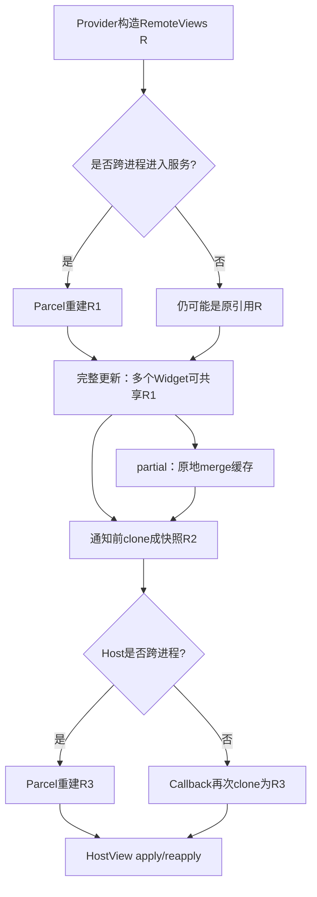

# 第 382 章 Android AppWidget 对象所有权：Bundle、ProviderInfo 与 RemoteViews 复制链

> 源码基线：Android 11 / API 30 / `android-11.0.0_r48`。本章只在 macOS 阅读源码，不编译。上一章解决“谁能访问哪个 Widget”；本章继续追问：调用参数进入 `system_server` 后还是不是调用者手里的那个对象？返回对象、缓存对象和异步消息又是否共享？答案不能只用“Binder 会序列化”一句话概括，因为同进程 Binder、服务内部批量更新和浅复制会形成完全不同的所有权边界。

## 1. 本章要解决的问题

我们分别研究 `Bundle options`、`AppWidgetProviderInfo` 和 `RemoteViews`。每一种都实现了 `Parcelable`，但它们的 `clone()` 语义、内部可变字段和服务端使用位置不同，不能互相套用结论。

## 2. 先定义对象所有权

这里的“拥有”不是 Java 访问权限，而是：谁可以继续修改某对象、修改是否会被另一方立即观察、谁负责在跨线程前建立稳定快照。看到赋值 `a=b` 时，两个变量只是指向同一实例，并未复制。

## 3. 四种边界

需要同时区分四种边界：普通跨进程 Binder 会经 Parcel 重建；同进程 Binder 可能直接传引用；服务内部字段赋值仍是引用共享；向 Handler 排队时若不复制，排队后的修改也会污染待处理消息。

## 4. Parcelable 不等于随时自动复制

实现 `Parcelable` 只说明对象知道怎样写入和读出 Parcel。只有真正走 Binder 跨进程、显式写 Parcel或复制构造器时才会执行这套协议；同一进程普通方法调用不会自动 Parcel 化。

## 5. AppWidget 的典型进程

第三方 Provider、Launcher Host 和 `system_server` 通常是三个进程。因此日常设备上参数一般在进程边界形成新对象，但 SystemUI、Keyguard、系统测试或同进程调用仍会触发本地 Binder 特例。

## 6. 本地 Binder 的判断

服务端 helper 并不检查某个 Java Binder 类型，而是比较：

```java
private static boolean isLocalBinder() {
    return Process.myPid() == Binder.getCallingPid();
}
```

两端 PID 相同才补做 clone。

## 7. 为什么只在 local 时 clone

跨进程时 Binder 已经给服务端或客户端重建了对象，再 clone 一次通常只是额外成本；同进程时没有 Parcel 隔离，所以 helper 用 clone 模拟通常的跨进程所有权边界。

## 8. 不能把 helper 理解成安全沙箱

`cloneIfLocalBinder()` 只在几个返回/绑定路径被调用，并非所有输入都统一复制。必须查看每个入口在哪里调用helper，不能见到这个方法就推断整个服务没有别名共享。

## 9. 三个 clone helper

服务分别为 `RemoteViews`、`AppWidgetProviderInfo`、`Bundle`提供重载。前两个调用各自 `clone()`；Bundle helper旁边还明确警告它只是浅复制。

## 10. Bundle 的基本结构

`Bundle`继承 `BaseBundle`。逻辑上它是 `String -> Object`映射；对象可能尚在 `mParcelledData` 中，也可能已经解包到 `mMap`，所以复制实现同时处理两种内部状态。

## 11. Bundle.clone 的源码承诺

源码注释非常明确：内部Map会克隆，但key和值按引用复制。实现只是：

```java
public Object clone() {
    return new Bundle(this);
}
```

因此它是容器级浅复制。

## 12. BaseBundle 浅复制已解包 Map

`BaseBundle.copyInternal(from,false)`在已有 `mMap` 时执行 `new ArrayMap<>(from.mMap)`。新旧Bundle可独立增删key，但某个key对应的可变value仍可能是同一个对象。

## 13. 尚未解包时的复制

若来源仍持有 `mParcelledData`，copyInternal新建Parcel并用 `appendFrom`复制字节。此时还看不到Java value共享；以后各自unparcel会分别重建内容，但这不应被概括为所有Bundle.clone都深复制。

## 14. 状态相关但API语义仍是浅复制

同一个clone调用的即时实现效果会受Bundle是否已unparcel影响。应用不能依赖这种内部时机，应按公开注释的保守规则理解：keys/values可能共享引用。

## 15. Bundle.deepCopy 也不是万能深复制

`deepCopy()`递归复制Bundle、PersistableBundle、ArrayList和基本类型数组；其他Parcelable或Serializable仍按原引用保留。名字“deep”也有明确类型边界。

## 16. putAll 同样是浅合并

`Bundle.putAll()`先让双方unparcel，再执行 `mMap.putAll(bundle.mMap)`。它复制映射项，不递归复制value；若value是可变List或自定义Parcelable，本地调用可能继续共享。

## 17. 所有权判断口诀

先问“有没有真实跨进程”，再问“有没有显式clone”，最后问“clone复制到哪一层”。三问缺一不可。

## 18. 总体边界图



## 19. bindAppWidgetId 的 options

绑定成功时服务执行：

```java
widget.options = options != null
        ? cloneIfLocalBinder(options) : new Bundle();
```

因此普通Launcher跨进程传入的是服务端已解包副本；同进程时建立一个浅克隆。

## 20. null options 的处理

bind入口允许options为null，并创建可写的空 `Bundle`。随后若没有Host category，服务会补 `OPTION_APPWIDGET_HOST_CATEGORY=HOME_SCREEN`。

## 21. 为什么bind必须避免直接共用Map

服务会补默认category并长期把Bundle挂到Widget。若同进程仍直接保存调用者Bundle，服务补字段会反向修改调用者容器；浅clone至少隔离了顶层Map。

## 22. bind 的嵌套值仍可能共享

如果本地调用者options里放了可变嵌套对象，clone只复制Map。调用后修改该对象，服务缓存可能观察到变化；源码注释也说未来若options开始放对象会有问题。

## 23. 注释为何提到 keyguard

helper注释把风险限定到local使用者，并举keyguard作为现实场景：普通第三方跨进程已有Parcel副本，只有与服务同PID的调用才会绕过天然隔离。

## 24. updateAppWidgetOptions 不替换整个Bundle

更新options时服务不是 `widget.options=options`，而是 `widget.options.putAll(options)`。未出现的旧key继续保留，同名key被覆盖。

## 25. update入口没有 clone helper

`updateAppWidgetOptions()`直接把输入putAll进缓存。普通跨进程输入已由Binder重建；同进程输入的value引用会被浅合并进服务缓存。

## 26. 调用后修改顶层key

本地调用完成后，对原Bundle执行 `putInt("x",2)`只改原Bundle的Map，通常不会改服务Map；因为putAll复制了entry。但若取出旧List再修改List内容，服务可能同步看到。

## 27. options 为 null 的边界

update入口没有null保护，随后 `widget.options.putAll(options)`会访问null参数。公开API把options作为应提供的Bundle；源码层面传null可能导致NPE，而不是被当作清空。

## 28. 未绑定空槽的风险

lookup可能让Host找到provider=null的已分配Widget；putAll之后 `sendOptionsChangedIntentLocked(widget)`直接访问 `widget.provider.info`。因此对未绑定空槽更新options存在NPE路径，这与上一章的访问判定是两层问题。

## 29. options changed 广播

服务把缓存中的 `widget.options`放入显式广播Intent，目标是Provider Receiver。广播跨到Provider进程时再次Parcel，Provider通常拿到独立对象。

## 30. 广播发送前仍是同一引用

`intent.putExtra(..., widget.options)`在system_server内只是把引用放入Intent；真正跨进程调度和Parcel发生在后续广播链。分析并发时不能把putExtra这一行当成复制点。

## 31. 全局锁提供的稳定区间

update options与send broadcast调用发生在 `mLock`内，其他受同一锁保护的Widget更新不能在中间改缓存。但外部服务调用发生在锁内会增加复杂度，这不等于Intent永远持有不可变快照。

## 32. getAppWidgetOptions 的返回

找到Widget且options非null时返回 `cloneIfLocalBinder(widget.options)`。普通跨进程返回值经Parcel重建；同进程返回顶层Map浅副本。

## 33. getter为何不能直接暴露缓存

若local getter直接返回缓存，调用者 `clear()`就会清空服务状态。浅clone让增删key与服务隔离，但仍不保证嵌套可变value隔离。

## 34. 找不到Widget返回 Bundle.EMPTY

服务返回静态 `Bundle.EMPTY`。它初始化后把 `mMap`设为 `ArrayMap.EMPTY`，表示共享空对象，不是每次new一个Bundle。

## 35. 不要修改 Bundle.EMPTY

调用者应把它视为不可变空结果。跨进程返回时会Parcel成客户端对象；同进程可能直接得到静态实例，因为返回分支没有clone helper，尝试写共享空Map不是可靠用法。

## 36. 正确的调用者写法

只读可直接查询；要构造后续修改对象时使用 `new Bundle(result)`。若里面包含自定义可变对象，还要根据value类型另行复制，不能只依赖Bundle构造器。

## 37. options 的持久化范围

AppWidget主状态XML只持久化几个已知尺寸/category字段，而不是任意Bundle对象图。因此嵌套自定义对象即使暂时进入内存，也不能据此推断重启后存在。

## 38. options 小结

跨进程通常由Parcel隔离；local bind/get只做浅clone；local update使用浅putAll；空结果是共享EMPTY。四种行为不能缩写成“options会被复制”。

## 39. ProviderInfo 是什么

`AppWidgetProviderInfo`保存Provider组件、最小尺寸、resize尺寸、更新周期、布局、配置Activity、标签、图标、类别、features以及底层 `ActivityInfo providerInfo`。

## 40. Parcel构造器复制哪些字段

跨进程时构造器依次读取ComponentName、int、String和ActivityInfo。它会按Parcel协议创建客户端侧对象图，而不是直接把system_server里的Java引用交出去。

## 41. writeToParcel 与构造器必须成对

字段顺序就是协议。写端先provider、尺寸、周期、布局等，读端必须同序；这也是为什么新增字段通常追加在末尾以维持版本兼容思路。

## 42. ProviderInfo.clone 手工逐字段复制

local helper调用的不是Parcel round-trip，而是该类手写clone。ComponentName调用clone，String和int直接赋值，`providerInfo`字段却只做引用赋值。

## 43. ActivityInfo 是共享引用

源码是 `that.providerInfo = this.providerInfo`。因此同进程克隆后的两个AppWidgetProviderInfo共享同一个ActivityInfo，以及它下面更深的对象；clone不是完整深复制。

## 44. ComponentName 的情况

provider与configure会调用ComponentName.clone。ComponentName的核心package/class字符串本身不可变，复制主要建立独立包装对象，不会带来ActivityInfo那样的可变共享面。

## 45. 标签字符串的情况

`label`直接赋值，但String不可变，所以引用共享通常安全。判断共享风险不能只看是否同引用，还要看对象能否被修改。

## 46. r48 的 minResizeWidth 复制错误

源码写成：

```java
that.minResizeWidth = this.minResizeHeight;
that.minResizeHeight = this.minResizeHeight;
```

第一行应直觉上读取 `this.minResizeWidth`，但r48确实读了height。

## 47. 这个错误的可观察结果

若原值 `minResizeWidth=100`、`minResizeHeight=60`，clone后两者都是60。它会扭曲Host看到的最小横向resize约束。

## 48. 影响主要落在 local clone 路径

普通跨进程getter走writeToParcel，那里正确写入两个独立字段；同PID返回才调用有误的clone。因此不能说“Android 11所有Host都会读错width”。

## 49. Provider列表也调用 local clone

查询安装Provider列表时，每个符合条件的info都经 `cloneIfLocalBinder(info)`加入结果。跨进程由ParceledListSlice负责Parcel；同进程会碰到上述clone字段错误与ActivityInfo共享。

## 50. 单个 getAppWidgetInfo

找到非zombie Provider时同样返回 `cloneIfLocalBinder(widget.provider.info)`。不存在、未绑定或zombie则返回null。

## 51. updateDimensions 会原地修改

`AppWidgetProviderInfo.updateDimensions(DisplayMetrics)`把四个TypedValue complex字段转换成像素并直接写回对象。它不是纯函数，调用对象的尺寸语义发生变化。

## 52. 为什么返回隔离很重要

Host拿到info后可能调用updateDimensions。跨进程Parcel副本不会改服务缓存；local浅clone可隔离四个int字段，所以即使ActivityInfo共享，尺寸转换仍不反写原info。

## 53. clone bug 与 updateDimensions 叠加

local路径先把width错成height对应complex值，再做像素转换；最终width像素来自height。若只看updateDimensions结果，容易误判是密度换算公式错误，实际污染发生在clone阶段。

## 54. ProviderInfo 路径图



## 55. providerChanged 服务端通知

Provider元数据改变时，服务把info放进回调任务。若Host跨进程，回调Binder会Parcel；若Host和服务同进程，还要注意Callback Stub的额外clone。

## 56. AppWidgetHost.Callbacks 再检查 local

`providerChanged()`若 `isLocalBinder()`且info非null，会执行 `info=info.clone()`，再把它放入Handler Message。这是为了防止服务端后续修改排队对象。

## 57. 为什么Callback端还要clone

服务端调用Callback时的“调用者”变成system_server；Host Callback用同样的PID比较判断是否没有跨进程。它保护的是从Callback线程到Host Handler队列的对象所有权。

## 58. 可能发生重复clone

某些同进程链可能在服务构造数据时clone一次，Callback收到时再clone一次。复制看似冗余，但两处保护不同时间边界；同时r48手写clone错误也可能重复传播。

## 59. PendingHostUpdate 的 ProviderInfo

Host离线期间，startListening会根据序列号构造PendingHostUpdate。providerChanged分支直接放 `widget.provider.info`，跨进程返回列表时Parcel重建；同进程列表返回是否隔离要结合外层Binder与容器行为，源码这里没有显式clone。

## 60. 不应修改框架返回的Info作为配置源

Host可以对自己的副本做显示换算，但不应假定修改后能更新服务端Provider元数据。真正元数据来自Manifest XML/PackageManager解析和服务更新路径。

## 61. RemoteViews 不是实际 View

它是“在哪个包的哪个layout上执行哪些Action”的可序列化描述。Provider构造它，服务缓存它，Host最终apply/reapply生成真实View树。

## 62. RemoteViews 的可变性

`setTextViewText`、`setOnClickPendingIntent`等调用会向 `mActions`追加或替换Action。调用Provider更新API后继续修改原RemoteViews是否安全，取决于有没有进程/复制边界。

## 63. 跨进程Provider输入

普通第三方Provider调用AppWidgetManager，RemoteViews通过AIDL进入system_server。服务拿到的是Parcel重建对象，所以Provider随后改自己原对象不会改服务缓存。

## 64. local Provider输入

`updateAppWidgetIds`入口没有对输入调用 `cloneIfLocalBinder`。若调用者与服务同PID，服务可能直接把原RemoteViews引用作为Widget缓存。

## 65. 完整更新是直接赋值

核心代码：

```java
if (isPartialUpdate && widget.views != null) {
    widget.views.mergeRemoteViews(views);
} else {
    widget.views = views;
}
```

完整更新没有复制。

## 66. 批量完整更新的别名

一个 `updateAppWidgetIds(ids, views)`循环多个ID，把同一个服务端views引用赋给每个Widget。即使Provider跨进程，Binder只为整次方法调用解包一次，而不是为每个数组元素对应Widget复制一次。

## 67. 批量别名的后果

服务内部若后来直接修改其中一个 `widget.views`对象，其他Widget可能同时变化。常规完整更新多为替换字段，风险不一定立刻表现；partial merge则会原地改已有对象，组合场景更值得注意。

## 68. partial update 的语义

已有完整views时，`mergeRemoteViews(new)`把新Action合并到旧缓存。若旧缓存和其他Widget共享，合并可能污染其他Widget缓存，这不是Provider进程仍持有引用，而是system_server内部别名。

## 69. 没有完整缓存时的partial

若 `widget.views==null`，partial分支条件不成立，服务直接把本次views作为完整缓存。它不会凭空补Provider的默认完整状态。

## 70. 同一个partial对象用于多个ID

循环每个Widget。已有缓存的Widget把输入merge进去；无缓存Widget直接引用输入。输入对象与merge实现之间的动作复制/移动语义要继续查看RemoteViews源码，不能只按方法名猜。

## 71. mergeRemoteViews 会复制输入

该方法先 `RemoteViews copy = new RemoteViews(newRv)`，再处理Action合并。因此对已有缓存的partial更新，不是简单把newRv的mActions列表引用挂进去。

## 72. merge 仍会原地改旧缓存

复制的是增量输入，接着旧RemoteViews移除相同uniqueKey的旧Action并加入copy动作。因此旧缓存本身发生变化，若旧缓存被多个Widget共享，别名问题依然存在。

## 73. 内存上限检查发生在缓存赋值后

服务先赋值/merge，再估算Bitmap内存。非system UID超限时把当前 `widget.views=null`并抛IllegalArgumentException。

## 74. 批量更新的部分提交

循环前面的Widget可能已经更新和排队通知，后面某个Widget超限抛异常后不会自动回滚前面状态。共享RemoteViews还让内存估算与缓存关系更难用事务思维理解。

## 75. schedule前为什么clone

`scheduleNotifyUpdateAppWidgetLocked`把有效views克隆后放入SomeArgs：

```java
args.arg3 = updateViews != null ? updateViews.clone() : null;
```

Handler稍后执行，因此这里建立排队时快照。

## 76. 这次clone与Binder无关

即便Host最终跨进程，排队到Callback Handler之间仍在system_server内。如果不先clone，缓存可能在消息处理前被下一次更新修改，导致旧requestId携带新内容。

## 77. requestId 与内容快照配套

服务为更新递增序列号，并把clone后的RemoteViews与requestId一起排队。序列号解决顺序/补发判定，clone尽量固定该序列对应的内容。

## 78. mask 下的快照

通知使用 `widget.getEffectiveViewsLocked()`：有遮罩时clone的是maskedViews，而真实widget.views继续在后台更新。解除遮罩后再对最新真实views建立新通知快照。

## 79. RemoteViews.clone 的前置条件

clone要求 `mIsRoot`为true；已附着到另一个RemoteViews成为child的对象不能单独clone，否则抛IllegalStateException。服务缓存通常持有root。

## 80. clone 实际调用复制构造器

实现返回 `new RemoteViews(this)`。复制构造器先复制基础字段，递归复制landscape/portrait，再通过Parcel写读Action，最后安装新的BitmapCache。

## 81. Action 采用 Parcel round-trip

源码对 `mActions`申请Parcel、写入Actions、重置position并读回。这比简单 `new ArrayList<>(mActions)`更强，目标是重建Action对象。

## 82. BitmapCache 被重新建立

构造开始暂用来源cache以便读取动作，末尾 `setBitmapCache(new BitmapCache())`重新初始化缓存。克隆拥有自己的cache容器，而动作里的Bitmap如何复制仍由Parcelable/Bitmap语义决定。

## 83. ApplicationInfo 仍直接赋值

复制构造器使用 `mApplication=src.mApplication`，不是clone。它主要用于包名、UID、targetSdk等资源上下文；若同进程任意修改这个可变对象，仍可能被双方看到。

## 84. class cookies 也共享

`mClassCookies=src.mClassCookies`，并把它交给临时Parcel。源码没有复制cookie map，因此“RemoteViews深复制”不能解释为所有字段递归独立。

## 85. 官方注释的“deep copy”要结合实现

clone注释称deep copy，主要针对RemoteViews结构、子RemoteViews和Actions；实现保留ApplicationInfo/classCookies等引用。阅读时应以具体字段为准，而不是把术语扩展为通用对象图深拷贝。

## 86. 同步 getAppWidgetViews

服务读取effective views后返回 `cloneIfLocalBinder`。跨进程由Binder Parcel隔离；同进程显式RemoteViews.clone，避免调用者直接修改服务缓存。

## 87. getter得到的是当前有效视图

有mask时返回maskedViews而非真实views；无mask才返回widget.views。对象复制解决所有权，不改变第378章的effective选择规则。

## 88. Callback 端再次clone RemoteViews

`AppWidgetHost.Callbacks.updateAppWidget()`在local Binder时先 `views=views.clone()`，再投递Handler。它防止回调发起者在Message消费前继续改参数。

## 89. 服务端排队clone加Host端clone

在线通知至少在服务排队前clone一次；若跨进程，再经Parcel；若同进程，Host Callback再clone。不同链路复制次数不同，但目标都是让异步消费者看到稳定描述。

## 90. 不要用复制次数推断内容版本

真正版本由更新顺序、requestId和Host last sequence共同决定。复制只能固定某次携带的对象，不能自动取消已经排队的旧消息。

## 91. RemoteViews 生命周期图



## 92. 离线Host的Pending更新

Host重新startListening时，服务根据 `updateSequenceNos`重建待补发列表。views分支使用 `cloneIfLocalBinder(widget.getEffectiveViewsLocked())`。

## 93. 跨进程Pending列表

常规Launcher跨进程时helper先不clone，随后PendingHostUpdate与ParceledListSlice写Parcel，RemoteViews在客户端重建；缓存不会直接暴露给Launcher。

## 94. 同进程Pending列表

同PID时helper先clone有效views，再放入PendingHostUpdate，避免返回列表中的对象就是缓存。ProviderInfo pending分支却没有同样显式helper，这是r48实现上的不对称。

## 95. PendingHostUpdate 自身不复制字段

其factory只是 `update.views=views`或 `update.widgetInfo=info`。隔离来自调用factory之前的clone或之后的Parcel，而不是这个包装类本身。

## 96. PendingHostUpdate Parcel协议

它先写appWidgetId和type，再按type写RemoteViews、ProviderInfo或viewId。客户端构造器按type选择对应Parcelable构造器。

## 97. 复制不能修复逻辑别名历史

如果两个Widget缓存早已因批量更新共享，并被一次partial merge共同污染，通知前clone只会忠实复制污染后的结果，不会恢复每个Widget原本应有的独立状态。

## 98. Provider调用后的安全习惯

即使常规第三方跨进程天然隔离，也建议把已提交的RemoteViews视为不可再修改；下一次更新新建对象。这样系统应用、测试环境或未来进程部署变化时行为更稳定。

## 99. Host getter后的安全习惯

把返回RemoteViews视为只读描述，若必须改动先明确创建 `new RemoteViews(old)`。不要期望修改getter结果能反向更新Widget；正式更新必须走AppWidgetManager接口。

## 100. Bundle可变值的安全习惯

options最好只放框架定义的基本数值。若业务层额外保存List/Parcelable，应在传入和取出两端自行复制，并确认它不会依赖主状态XML持久化。

## 101. ProviderInfo的安全习惯

ProviderInfo是框架元数据快照。Host可读取、显示和对副本做dimension换算，但不要修改其ActivityInfo内部字段，也不要把对象身份作为Provider版本标识。

## 102. Java引用相等不是协议保证

同一次批量服务调用里两个Widget可能 `views==`；跨进程后客户端又不相等。对象identity是实现细节，业务只能依据appWidgetId、内容字段和更新协议。

## 103. 线程边界与进程边界不同

Handler不会自动Parcel对象。服务在schedule中显式clone正是因为“换线程”不等于“复制”；Binder跨进程才有序列化隔离。

## 104. 锁也不等于复制

`mLock`保证临界区内关系与字段操作有序，却不能阻止锁外持有同一对象引用的一方修改它。别名泄漏与锁保护是两个维度。

## 105. Parcel复制也有类型语义

Parcel会按各Parcelable实现重建，不代表数学意义的全对象图深拷贝。Binder对象、文件描述符、共享内存和某些框架资源有自己的跨进程语义。

## 106. 调试对象所有权的方法

先画“对象创建点—字段赋值—clone/Parcel点—异步排队点”，再标PID和线程。仅打印 `identityHashCode`只能在同一进程比较，跨进程数字没有可比意义。

## 107. 测试 local 路径的价值

绝大多数应用只覆盖跨进程路径，clone bug和浅复制风险容易长期隐藏。框架单测或系统组件测试应刻意构造同PID调用，验证顶层与嵌套对象是否隔离。

## 108. 测试批量别名的思路

为两个Widget做一次批量完整更新，再仅对其中一个做partial更新，观察另一个缓存/通知是否出现动作。源码推导表明存在共享可能，但具体Action合并结果应由对应测试确认。

## 109. 对 minResizeWidth bug 的验证思路

构造width与height明显不同的ProviderInfo，分别走Parcel round-trip和clone，比较结果。预期Parcel保持两个值，r48 clone把width变成height。

## 110. 对 Bundle 浅复制的验证思路

Bundle内放ArrayList，clone后修改新Bundle的顶层key，再修改List内容。预期顶层Map互不影响，而同一List的内容变化可能两边可见。

## 111. 本章只读练习说明

以下四个练习都只使用macOS终端阅读/搜索源码，不要求编译Android，也不修改AOSP。请先预测，再用源码行证明；不要把推测写成运行结论。

## 112. macOS只读练习一：核对三种helper

运行 `rg -n "cloneIfLocalBinder|isLocalBinder" frameworks/base/services/appwidget/java/com/android/server/appwidget/AppWidgetServiceImpl.java`，列出RemoteViews、ProviderInfo、Bundle三种重载，并写下Bundle旁边的浅复制警告。

## 113. macOS只读练习二：手工追ProviderInfo字段

运行 `sed -n '275,430p' frameworks/base/core/java/android/appwidget/AppWidgetProviderInfo.java`，做一张writeToParcel与clone字段对照表，圈出 `minResizeWidth`来源错误和ActivityInfo直接赋引用。

## 114. macOS只读练习三：证明Bundle只复制Map层

运行 `sed -n '420,470p' frameworks/base/core/java/android/os/BaseBundle.java`以及 `sed -n '280,300p' frameworks/base/core/java/android/os/Bundle.java`，分别解释copyInternal(false)与putAll为什么都不会递归复制已解包value。

## 115. macOS只读练习四：画RemoteViews缓存到回调链

运行 `rg -n "updateAppWidgetInstanceLocked|scheduleNotifyUpdateAppWidgetLocked|getPendingUpdatesForId" frameworks/base/services/appwidget/java/com/android/server/appwidget/AppWidgetServiceImpl.java`，按“赋缓存—内存检查—clone排队—Callback”画箭头，并标出哪一步在锁内、哪一步异步。

## 116. 易错结论一：Binder参数一定是副本

错误。只有真实跨进程才经Parcel；同PID Binder可能直接引用，所以r48专门做local clone，而且还不是所有入口都做。

## 117. 易错结论二：clone一定是深复制

错误。Bundle.clone明确浅复制；ProviderInfo.clone共享ActivityInfo且有字段bug；RemoteViews虽重建Actions，仍共享ApplicationInfo与class cookies等字段。

## 118. 易错结论三：每个Widget都有独立RemoteViews

错误。单次批量完整更新在服务循环里可把同一对象赋给多个Widget。后续通知各自clone，并不能否认缓存层曾经共享。

## 119. 本章复读后的修正

复读时特别删掉了三个过度表述：没有把跨进程Parcel叫“绝对深拷贝”，没有说Bundle未解包时必然共享value，也没有断言批量别名一定造成UI错误；准确结论是复制效果依类型与状态而定，别名提供了可发生污染的条件。

## 120. 本章结论与下一章入口

AppWidget对象所有权由“进程边界、显式复制、复制深度、缓存赋值、异步排队”共同决定。r48用local helper补偿缺失的Parcel边界，却留下Bundle浅复制、ProviderInfo clone错误和RemoteViews输入/批量缓存别名。下一章将沿 `RemoteViews` 内部继续阅读Action、ReflectionAction、合并uniqueKey、Parcel白名单与apply/reapply执行模型。
