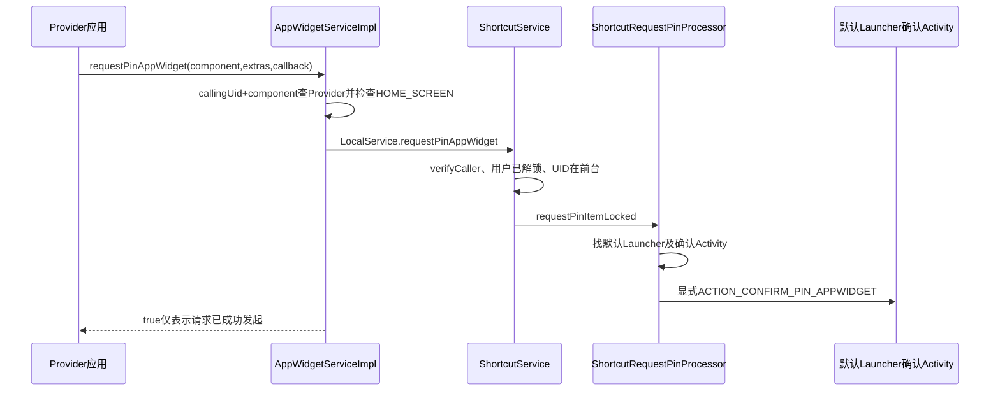
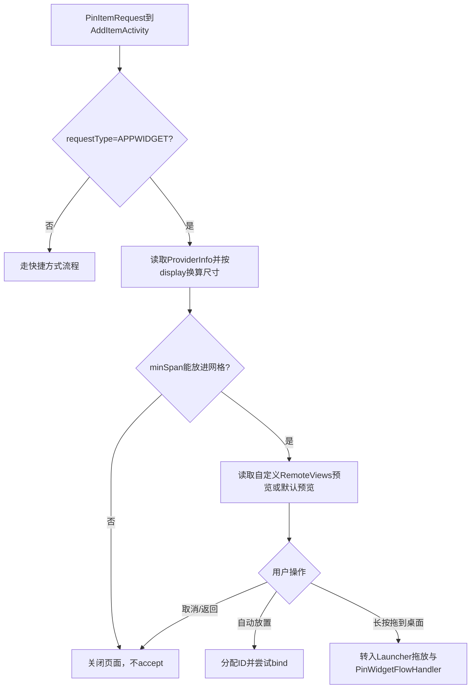
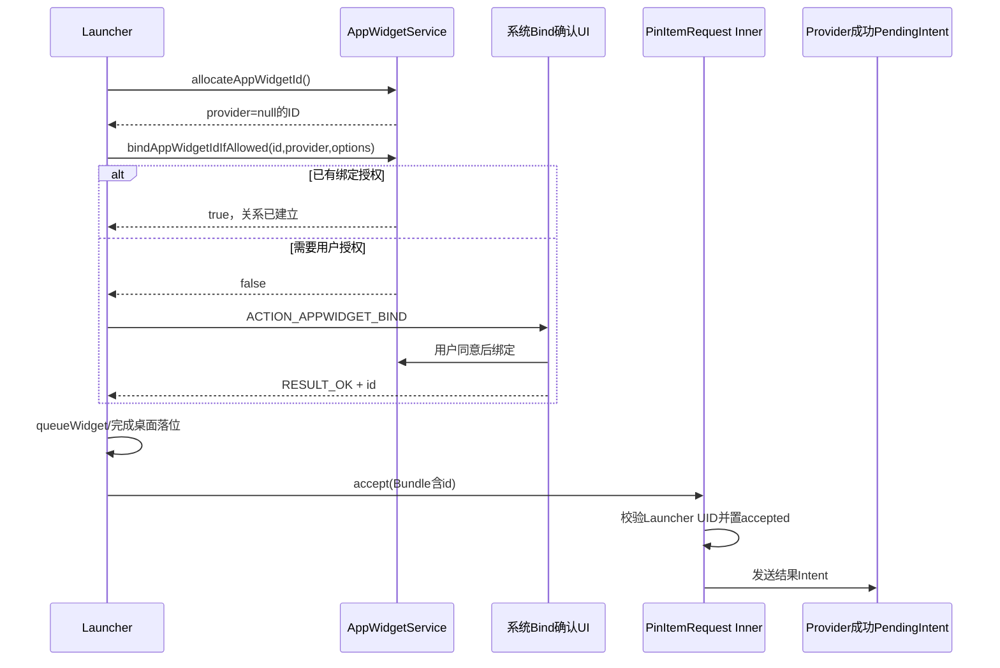

# 第 383 章 Android AppWidget 请求固定：默认 Launcher、PinItemRequest、绑定与成功回调链

> 源码基线：Android 11 / API 30 / `android-11.0.0_r48`。本章只在 macOS 阅读源码，不编译。第 360 章讲过Host主动分配和绑定；本章研究Provider怎样请求桌面“帮我放一个Widget”。最重要的边界是：系统只把一次性确认能力交给创建请求时的默认Launcher，真正的 `appWidgetId` 分配、Provider绑定、桌面落位和失败清理由Launcher完成；`PinItemRequest.accept()`本身不替它完成这些工作。

## 1. 功能入口

Provider应用调用 `AppWidgetManager.requestPinAppWidget(provider, extras, successCallback)`。这是“请求”，不是命令；Launcher可以展示确认页、让用户拖放、拒绝或暂不处理。

## 2. 返回true不代表已经固定

公开文档明确说API不等待用户响应。true只表示默认Launcher支持该请求且确认Activity成功启动；用户是否接受、Launcher是否完成绑定，要等后续流程。

## 3. 用户拒绝没有失败回调

用户取消时Launcher不调用accept，请求方不会收到successCallback。调用者不能把“长时间没回调”严格区分成拒绝、Launcher被杀、请求丢失或用户尚未决定。

## 4. successCallback 的含义

它是调用者提供的 `PendingIntent`所对应 `IntentSender`。只有Launcher调用accept且服务的widget请求accept路径成功后，系统才尝试发送；回调Intent应包含Launcher传回的 `EXTRA_APPWIDGET_ID`。

## 5. 配置Activity的特殊规则

固定请求流程要求Launcher不要自动启动Provider声明的configure Activity，而是假定Widget已配置。Provider可以在请求前自行配置，或在successCallback拿到ID后再展示配置UI。

## 6. extras 的用途

request extras交给Launcher用于展示/决策，不自动成为AppWidgetService里的Widget options。典型字段是 `EXTRA_APPWIDGET_PREVIEW`，值可为自定义 `RemoteViews`预览。

## 7. 第一层：AppWidgetManager客户端

客户端把Context包名、Provider ComponentName、Bundle和PendingIntent的IntentSender交给IAppWidgetService。RemoteException被重抛为system_server异常。

## 8. Provider参数必须非空

公开方法给provider加 `@NonNull`，但客户端实现没有显式 `Objects.requireNonNull`；真正服务端lookup对畸形null会在后续对象构造/比较中表现，正常应用应遵守API契约。

## 9. 调用者包名来自Context

传入服务的是AppWidgetManager创建时保存的 `mPackageName`，不是每次由用户自由输入的公开参数。但服务仍必须按Binder UID复验包身份。

## 10. AppWidgetService先保留原Binder身份

`requestPinAppWidget()`读取 `Binder.getCallingUid()`和其userId；它在转入ShortcutService本地接口前没有清identity，因此后者仍能看到原应用UID。

## 11. 服务先加载用户组状态

在 `mLock`内调用 `ensureGroupStateLoadedLocked(userId)`，确保Provider列表和跨profile关系可用于精确lookup。

## 12. ProviderId 防止请求别人的组件

服务用 `new ProviderId(callingUid, componentName)`查Provider。即使调用者知道别人的Receiver名称，UID不同也找不到该Provider。

## 13. callingPackage 的二次验证稍后发生

AppWidgetService这段没有直接调用 `enforceCallFromPackage`，但它把callingPackage传给ShortcutService；`requestPinItem()`首先 `verifyCaller(callingPackage,userId)`，把包名重新绑定到仍保留的Binder UID。

## 14. Provider不存在的返回

lookup为null或provider.zombie时直接false，不启动Launcher。zombie常见于安全模式保留的第三方记录，不能被固定为新实例。

## 15. 只允许主屏类别

`widgetCategory`必须包含 `WIDGET_CATEGORY_HOME_SCREEN`。只声明KEYGUARD类别的Provider不能走桌面固定请求。

## 16. 位掩码不是精确相等

检查是 `(category & HOME_SCREEN) == 0`。同时支持HOME_SCREEN和KEYGUARD仍可请求；不要误写成category必须只等于HOME_SCREEN。

## 17. 传给ShortcutService的是ProviderInfo引用

AppWidgetService与ShortcutService都在system_server，通过LocalServices直接调用；`provider.info`在这一步没有Parcel。Launcher稍后通过IPinItemRequest getter跨进程才拿到Parcelable副本。

## 18. 请求前半段总览

## 19. 为什么复用ShortcutService

Android把“固定快捷方式”和“固定Widget”的用户确认能力统一为 `LauncherApps.PinItemRequest`。ShortcutService负责找默认Launcher、启动确认Activity、守护一次性Binder请求和发送结果。

## 20. Widget与Shortcut仍是不同提交模型

Shortcut accept会进入 `directPinShortcut()`修改ShortcutService账本；Widget的Inner没有覆盖tryAccept，accept只转发结果。Widget关系仍由AppWidgetService的allocate/bind API建立。

## 21. verifyCaller 的作用

ShortcutService核对callingPackage、userId与Binder调用者。因为调用来自system_server内LocalService但未清原identity，这里验证的仍是请求Provider应用，而不是SYSTEM_UID。

## 22. appWidget参数绕过Shortcut归属校验

`requestPinItem()`中shortcut为null时，条件会调用 `verifyShortcutInfoPackage(callingPackage,null)`；该helper对null路径用于确认没有错误Shortcut载荷，真正Widget归属已经由AppWidgetService的ProviderId校验完成。

## 23. user必须已解锁

锁内 `throwIfUserLockedL(userId)`。公开文档因此声明用户锁定时抛IllegalStateException，而不是先缓存到解锁后继续。

## 24. UID必须处于前台

服务用 `Preconditions.checkState(isUidForegroundLocked(callingUid),...)`要求前台Activity或前台/绑定前台服务等级。后台广播Receiver单独发起通常不能通过。

## 25. 前台阈值的具体值

r48阈值是 `PROCESS_STATE_BOUND_FOREGROUND_SERVICE`。system UID被特殊视为前台；其他UID先查ShortcutService缓存，缓存显示后台时再向ActivityManagerInternal确认。

## 26. 为什么需要前台门

请求会打断默认Launcher并启动确认界面。前台限制把用户可感知操作和调用来源关联起来，降低后台应用突然弹出固定请求的骚扰。

## 27. 前台门是请求时检查

创建PinItemRequest后，Provider进程退到后台不会自动使请求失效。后续accept验证的是Launcher UID与一次性状态，不再检查原Provider前台状态。

## 28. 支持性查询不等同请求检查

`isRequestPinAppWidgetSupported()`只检查instant caller并查询默认Launcher是否声明确认Activity；它不验证某个Provider组件、HOME_SCREEN类别，也不要求调用UID此刻前台。

## 29. instant app 查询返回false

AppWidgetService对instant UID直接false并打印警告。实际请求还要通过Provider发现、归属和ShortcutService校验，不能因为支持查询逻辑简单就推断instant app可绕过。

## 30. 默认Launcher的目标用户

处理器先 `getParentOrSelfUserId(callingUserId)`。普通用户仍是自己；managed profile请求会把确认UI路由到父用户的默认Launcher。

## 31. 跨profile确认不等于允许绑定

确认Activity位于父用户，只表示谁向用户展示请求。真正bind时AppWidgetService仍检查profile关系、跨profile Widget白名单和绑定权限；确认不能绕过第357章策略。

## 32. 默认Launcher如何确定

ShortcutService调用 `getDefaultLauncher(launcherUserId)`取得HOME默认组件。没有默认Launcher就记录错误并返回不支持。

## 33. 确认Activity的发现

随后只在默认Launcher包中查询 `ACTION_CONFIRM_PIN_APPWIDGET` Activity，取查询结果的第一个ComponentName。其他非默认Launcher即使声明同action也不会收到。

## 34. Launcher3的Manifest声明

AOSP Launcher3的 `AddItemActivity`同时声明CONFIRM_PIN_SHORTCUT和CONFIRM_PIN_APPWIDGET，设置专用主题、excludeFromRecents和autoRemoveFromRecents。

## 35. 查询使用 exportedOnly=false

ShortcutService内部查候选时没有要求exported；因为最终由system_server用显式Intent启动。真正启动若因Activity状态/权限等失败，会被RuntimeException捕获并让请求返回false。

## 36. Launcher user也必须解锁

处理器在创建请求前 `throwIfUserLockedL(launcherUserId)`。managed profile源用户已解锁但父用户锁住时，同样不能展示确认。

## 37. support true的准确含义

它只证明当前能找到默认Launcher包中的确认Activity；在查询后Activity被禁用、默认Launcher变化或启动异常仍可能让实际request返回false。

## 38. PinItemRequest的外壳

这是一个Parcelable，字段只有requestType和 `IPinItemRequest`强Binder。ProviderInfo、extras与accepted状态实际留在system_server的Inner对象中。

## 39. 为什么不是把全部数据塞进Intent

Binder外壳允许Launcher按需调用getter，并让system_server在accept时验证调用UID和一次性状态。单纯Parcelable数据无法阻止其他应用复制后提交。

## 40. Widget Inner保存什么

`PinAppWidgetRequestInner`保存ProviderInfo、原extras、结果IntentSender，并从确认Activity所在包解析出launcherUid快照。

## 41. launcherUid是创建时快照

accept只比较Binder caller UID是否等于当时默认Launcher UID，不重新查询当前默认Launcher。默认Launcher后来切换时，旧Launcher仍可完成其旧请求，新Launcher不能接管那个Binder对象。

## 42. Request type常量

Shortcut为1，AppWidget为2。Launcher必须先看 `getRequestType()`，Widget请求的getShortcutInfo返回null；快捷方式请求的ProviderInfo/extras对应返回null。

## 43. PinItemRequest进入Intent

处理器创建显式Intent，action为CONFIRM_PIN_APPWIDGET，component为找到的Activity，把request放入 `EXTRA_PIN_ITEM_REQUEST`。

## 44. 启动Flags

Intent添加 `FLAG_ACTIVITY_NEW_TASK | FLAG_ACTIVITY_CLEAR_TASK`。system_server没有Activity栈，只能NEW_TASK启动；CLEAR_TASK让确认界面以新的任务状态进入，具体任务复用仍由ATMS规则决定。

## 45. 启动前清Binder identity

处理器清除原Provider调用身份，再以system_server上下文 `startActivityAsUser(launcherUser)`。否则跨用户启动和Activity启动权限会错误归因于Provider。

## 46. identity恢复

无论启动成功或RuntimeException，finally都会恢复原身份。返回AppWidgetService之前Binder线程仍处于原调用者语境。

## 47. 启动异常的返回

ActivityNotFound等RuntimeException被记录并返回false。PinItemRequest对象虽已构造，但没有交付成功，调用者也不应等待回调。

## 48. 请求不做持久化

Inner是system_server内存Binder对象，没有写入Shortcut XML或AppWidget XML。重启后请求和accepted状态都消失，系统不会自动恢复确认页。

## 49. 没有超时字段

r48 Inner没有创建时间、deadline或定时失效逻辑。只要Binder对象和旧Launcher UID条件仍成立且未accept，`isValid()`可继续为true。

## 50. 新请求不撤销旧请求

源码TODO明确说同一应用再次requestPin时应使旧pending请求失效，但r48没有实现。多个确认请求可以各自保持有效并分别创建Widget。

## 51. 用户取消如何表示

Launcher直接关闭Activity，不调用任何reject API。Inner的mAccepted仍false；如果请求对象仍可到达，理论上旧Launcher后来仍能accept。

## 52. Launcher提取请求

`LauncherApps.getPinItemRequest(intent)`只是读取Parcelable extra。Launcher3的PinRequestHelper还检查extra对象是否真是PinItemRequest，否则返回null并结束页面。

## 53. ProviderInfo getter跨Binder

Launcher调用 `getAppWidgetProviderInfo(context)`，外壳转调Inner。system_server返回ProviderInfo，经Binder Parcel到Launcher进程后，再调用 `updateDimensions(displayMetrics)`原地把尺寸转换为像素。

## 54. 与第382章clone bug的关系

这里通常是system_server到Launcher跨进程，走ProviderInfo Parcel，不走有 `minResizeWidth`错误的local clone。若系统定制让Launcher同PID，getter可能直接返回服务缓存引用，因为Inner getter自身没有clone，这是更强的local所有权风险。

## 55. extras getter跨Binder

常规Launcher拿到Parcel重建Bundle与RemoteViews preview。Widget Inner直接返回mExtras；同PID定制下缺少显式clone，Launcher修改可能影响请求内extras。

## 56. Launcher确认阶段图

## 57. Launcher3的网格适配

AddItemActivity把框架ProviderInfo包装为LauncherAppWidgetProviderInfo，计算minSpan；若最小尺寸超过当前网格列/行，直接finish且不accept。

## 58. 预览的两种来源

`PinItemDragListener.getPreview()`从request extras取 `EXTRA_APPWIDGET_PREVIEW`且验证值是RemoteViews；没有则WidgetCell走Provider previewImage或默认占位生成逻辑。

## 59. 自定义预览不是最终内容

preview仅供确认和拖动展示，不写入 `widget.views`服务缓存。Widget绑定后仍等待Provider的正常ACTION_APPWIDGET_UPDATE和RemoteViews更新。

## 60. Provider要控制预览成本

RemoteViews preview同样可能包含Bitmap和Actions，通过请求Bundle跨系统与Launcher；它不是绕过RemoteViews安全规则的任意View树，也不应塞过大图片。

## 61. Launcher计算默认Widget options

Launcher3根据待添加span、网格和Host category生成 `mWidgetOptions`，用于首次bind尝试，并最终作为accept回调extras的基础Bundle。

## 62. 自动放置先分配ID

用户点“自动放置”时，LauncherAppWidgetHost调用allocateAppWidgetId。此时AppWidgetService创建provider=null的Host空槽并持久化，尚未与请求Provider连接。

## 63. bindAppWidgetIdIfAllowed

Launcher用新ID、request ProviderInfo及mWidgetOptions调用bind。如果Launcher已有BIND_APPWIDGET能力或对应授权，服务完成关系绑定、生命周期广播和首次UPDATE。

## 64. bind成功之后才accept

Launcher3只有bind返回true才执行acceptWidget。这个顺序使successCallback中的ID通常已经属于该Host和Provider，而不是先承诺再尝试绑定。

## 65. bind失败不等于最终拒绝

false通常表示缺少直接绑定授权。Launcher启动系统 `ACTION_APPWIDGET_BIND` Activity，让用户批准这个Host ID与Provider的连接。

## 66. bind确认Intent的字段

LauncherAppWidgetHost放入ID、Provider Component和Provider profile。系统绑定UI最终仍调用AppWidgetService安全入口，不由请求Inner直接授权。

## 67. r48 fallback没有传options

Launcher3源码TODO指出startBindFlow没有把options放进ACTION_APPWIDGET_BIND Intent。因此首次direct bind失败、经系统确认成功时，服务端绑定options可能缺少Launcher已经算好的尺寸字段。

## 68. callback里的options不能补服务缓存

acceptWidget后来把ID加进mWidgetOptions并交给PinItemRequest.accept；这些options只被转换为successCallback的Intent extras，不会自动调用 `updateAppWidgetOptions()`。两本账可能不同。

## 69. bind UI取消时清ID

`onActivityResult`非RESULT_OK会调用 `deleteAppWidgetId(widgetId)`，再把pending ID设为-1。这样清除allocate产生的provider-null空槽。

## 70. data为null时的ID

结果Intent缺失时Launcher使用保存的 `mPendingBindWidgetId`；有data则优先读取 `EXTRA_APPWIDGET_ID`，默认值仍是pending ID。

## 71. 旋转恢复pending ID

AddItemActivity在instance state保存mPendingBindWidgetId并恢复，避免绑定UI期间旋转后失去清理/接收对象。但它没有在普通finish路径统一删除所有可能已分配ID，仍要按分支看。

## 72. acceptWidget先排桌面数据

Launcher3先 `InstallShortcutReceiver.queueWidget(info,id,this)`，再把ID放进Bundle并调用request.accept。桌面模型落位与服务回调不是一个事务。

## 73. queueWidget为何名字仍有Shortcut

Launcher3复用了旧安装快捷方式广播/队列基础设施来串行落工作区项目；名字不能说明它创建的是ShortcutService快捷方式，实际Item是AppWidget。

## 74. accept返回值被忽略

`acceptWidget()`没有检查 `mRequest.accept(mWidgetOptions)`的boolean。正常Widget Inner首个合法调用总true，但重复/UID异常会抛异常或失败，Launcher已先queue的本地记录可能与回调状态分叉。

## 75. 自动放置不启动configure

AddItemActivity绑定成功就queue+accept，没有检查ProviderInfo.configure。它遵守固定请求“Provider已配置”的契约。

## 76. 拖放流程保留同一请求

长按确认页时PinItemDragListener带着PinItemRequest启动HOME并发起跨窗口拖动。onDragStart先检查request.isValid，已被其他路径accept则拒绝拖动。

## 77. PinWidgetFlowHandler的作用

拖放生成PendingAddWidgetInfo，并覆盖handler为PinWidgetFlowHandler。它让常规Launcher Widget添加流程继续负责ID分配、bind和桌面放置。

## 78. needsConfigure固定false

PinWidgetFlowHandler明确返回false，即使ProviderInfo.configure非null也不启动配置Activity。这与公开固定请求约定一致。

## 79. startConfigActivity被改作通知点

其override创建仅含appWidgetId的Bundle，调用mRequest.accept(extras)，然后返回false。方法名来自通用添加流程，但固定Widget里它承担“绑定完成后发成功回调”。

## 80. 两条Launcher路径传回的extras不同

自动放置把mWidgetOptions连同ID传回；拖放handler只传ID。请求方不能假定successCallback一定收到尺寸options，唯一核心字段应是EXTRA_APPWIDGET_ID。

## 81. 真正的提交链图

## 82. isValid检查什么

Inner先验证当前Binder caller UID等于创建时launcherUid，再在synchronized(this)中返回 `!mAccepted`。它不查Widget是否已绑定、桌面是否有空位、Provider是否仍安装。

## 83. 非Launcher调用isValid

返回false而不是抛SecurityException。Launcher可以把false当作不再继续UI的信号；其他拿到Binder对象的UID不能用它探测accepted状态。

## 84. accept的UID失败

accept先检查isCallerValid，失败直接SecurityException。仅仅拿到Intent/Parcelable副本不等于有确认能力，Binder调用身份才是门。

## 85. 为什么绑定到UID而不是包名

Binder直接提供可信UID，避免调用者自报包名；代价是共享UID内包属于共同安全主体，且默认Launcher更新/UID变化会使旧请求不可用。

## 86. accept先强制解包options

若options非null，调用 `options.size()`触发unparcel，并用 `new Intent().putExtras(options)`构造结果extras。未知类或坏Parcelable导致IllegalArgumentException。

## 87. 解包检查保护谁

它避免把system_server无法稳定解析的Bundle继续塞进结果Intent。检查不是内容schema校验，不要求存在appWidgetId，也不确认ID类型或归属。

## 88. mAccepted何时置true

完成UID与options解包后进入synchronized(this)：若已accepted则抛IllegalStateException，否则先 `mAccepted=true`，然后才调用tryAccept和发送回调。

## 89. 先置true避免并发双提交

两个Launcher Binder线程同时accept，只有一个能越过同步块；另一个看到true并抛异常。一次性是Inner对象级，不依赖Launcher UI自行防抖。

## 90. 失败也不会恢复valid

如果tryAccept返回false，mAccepted仍保持true。Shortcut路径可能因状态变化失败；Widget路径tryAccept继承基类固定true，但结果Intent发送异常同样不回滚accepted。

## 91. Widget没有override tryAccept

这是全章最关键的源码事实。PinAppWidgetRequestInner只覆盖ProviderInfo和extras getter，基类 `tryAccept(){ return true; }`原样生效。

## 92. accept不验证appWidgetId

即使options为null、没有EXTRA_APPWIDGET_ID、ID为0或属于别的Widget，Widget Inner仍返回true并尝试发送这些extras。框架信任默认Launcher已按协议完成allocate/bind。

## 93. accept不调用AppWidgetService

处理器没有反向调用allocate、bind或查询Widget。不能把accept当作AppWidget事务提交；它只是一次受UID保护的结果通知闸门。

## 94. 默认Launcher是被信任组件

系统允许它管理工作区、Host ID和绑定UI，因此协议把语义正确性委托给它。恶意/有bug的默认Launcher可以回传无效ID，请求方仍应谨慎处理结果。

## 95. sendResultIntent的载荷

options先被放进一个新Intent，随后 `IntentSender.sendIntent(context,0,extras,...)`。这会以原PendingIntent的创建者语义投递，并叠加Launcher传回的fill-in extras规则。

## 96. null callback不影响accept

result IntentSender为null时send helper直接return；accept仍返回true。successCallback是可选通知，不是Widget存在的必要条件。

## 97. SendIntentException被吞掉

结果PendingIntent被取消等情况只记录warning；accept仍返回true且mAccepted保持true。Launcher无法靠返回值判断Provider是否真正收到回调。

## 98. 回调收到不等于桌面已绘制

Launcher通常已绑定并queue桌面项，但模型持久化、HostView创建、Provider首个RemoteViews和首帧都可能尚未完成。回调只证明Launcher走过接受协议。

## 99. Provider如何验证ID

如果业务必须依赖ID，可在后续Provider更新/Options广播或AppWidgetManager查询中核对它确实连接本Provider。不要仅凭任意Intent int就修改不可逆业务状态。

## 100. 成功回调的幂等处理

虽然Inner只发送一次，PendingIntent目标组件仍应按幂等方式记录ID；进程恢复、业务重试和Launcher实现差异可能让外围逻辑重复执行。

## 101. 请求期间Provider卸载

PinItemRequest的ProviderInfo是创建时快照。若Provider随后卸载/禁用，Launcher bind会在AppWidgetService重新lookup时失败；Inner本身不会因包变化主动invalid。

## 102. 默认Launcher切换竞态

请求创建后切换HOME应用，旧请求仍只认可旧launcherUid。旧确认Activity若仍运行可accept；新Launcher无法接手。源码没有generation或“当前默认”复验。

## 103. Launcher进程死亡

确认UI和Binder proxy消失时没有拒绝回调。Provider只看到没有success；重开是否还能继续取决于Activity/Intent能否被系统恢复，Pin请求本身未持久化，不能承诺恢复。

## 104. system_server重启

Inner Binder对象和mAccepted都丢失，旧客户端proxy死亡；已有AppWidget绑定关系若此前已写主状态仍可能恢复，但successCallback不会由Pin处理器补发。

## 105. 请求和绑定的锁不统一

ShortcutService用自己的mLock管理请求创建，AppWidgetService用mLock管理Provider/Widget关系，Launcher数据库又是第三本账。没有跨三者的原子事务或共同回滚。

## 106. 诊断“返回true但没出现”

依次检查默认Launcher确认Activity是否启动、用户是否接受、allocate是否成功、direct bind还是ACTION_APPWIDGET_BIND、bind结果、Launcher queue/数据库、Host监听与Provider RemoteViews。不要只查request返回值。

## 107. 诊断“回调没来”

确认Launcher是否调用accept、是否重复accept抛异常、PendingIntent是否已取消、sendIntent warning、system_server是否重启。用户拒绝本来就没有回调。

## 108. 诊断“尺寸不对”

比较Launcher计算的mWidgetOptions与AppWidgetService实际Widget options。若走fallback绑定UI，r48 Launcher3没有把options放入ACTION_APPWIDGET_BIND，是重要分叉点。

## 109. 诊断“配置页没打开”

固定请求设计上故意不由Launcher打开configure。应检查Provider是否在请求前配置，或successCallback中是否按业务设计启动自己的配置流程。

## 110. 与普通添加流程的差别

普通Launcher从Widget选择器添加时可在绑定后启动configure Activity；固定请求由Provider主动发起并承诺已配置，Launcher确认的对象是PinItemRequest，接受后还要回调请求方。

## 111. 本章只读练习说明

以下四个练习都只在macOS用rg/sed阅读本地r48源码，不编译、不启动模拟器。每个练习先写“谁创建ID、谁改变服务关系、谁只发送通知”，再用行号证明。

## 112. macOS只读练习一：追请求的三道门

运行 `sed -n '1660,1710p' frameworks/base/services/appwidget/java/com/android/server/appwidget/AppWidgetServiceImpl.java`和 `sed -n '2140,2190p' frameworks/base/services/core/java/com/android/server/pm/ShortcutService.java`，标出Provider UID+Component、HOME_SCREEN、verifyCaller、user unlocked与foreground检查。

## 113. macOS只读练习二：证明accept不绑定Widget

运行 `sed -n '50,175p' frameworks/base/services/core/java/com/android/server/pm/ShortcutRequestPinProcessor.java`，比较PinAppWidgetRequestInner和PinShortcutRequestInner谁覆盖tryAccept；解释为什么Widget options缺ID仍可能accept返回true。

## 114. macOS只读练习三：追Launcher3自动放置

运行 `sed -n '235,310p' packages/apps/Launcher3/src/com/android/launcher3/dragndrop/AddItemActivity.java`，画出allocate→bind→可能启动绑定UI→queueWidget→accept，以及取消时delete ID的位置。

## 115. macOS只读练习四：对比自动与拖放回调Bundle

运行 `sed -n '35,85p' packages/apps/Launcher3/src/com/android/launcher3/dragndrop/PinWidgetFlowHandler.java`并回看AddItemActivity.acceptWidget，比较两条路径传给accept的keys，确认configure为何被跳过。

## 116. 易错结论一：support true就是能固定

错误。它只表示能找到默认Launcher确认Activity；真实请求还受Provider类别、调用者前台、用户解锁和启动竞态影响，接受后还要分配、绑定、落位。

## 117. 易错结论二：accept会创建Widget

错误。Widget Inner的tryAccept固定true，accept不接触AppWidgetService；ID和关系必须由Launcher提前通过Host/AppWidgetManager建立。

## 118. 易错结论三：accept Bundle就是Widget options

错误。它被包装为successCallback extras。只有此前bindAppWidgetIdIfAllowed传入的options才进入服务缓存；Launcher3 fallback绑定UI甚至没有携带那份options。

## 119. 本章复读后的修正

复读后修正了三处容易过度推断的表述：未把用户拒绝说成请求立即失效，因为r48没有reject/timeout；未把确认Activity发现说成必须exported，因为查询明确用exportedOnly=false而实际启动才裁决；未把回调说成桌面已绘制，只把它界定为Launcher已调用一次性accept。

## 120. 本章结论与下一章入口

固定Widget是跨三本账的协作协议：AppWidgetService验证请求Provider，ShortcutService把一次性Binder能力交给创建时默认Launcher，Launcher负责用户确认、ID、绑定和桌面数据，accept只守UID/一次性并发送回调。下一章继续读AppWidget交互记账：Host点击如何通过 `noteAppWidgetTapped()`更新AppOps可见性与UsageStats，以及Widget显隐、本地服务查询和进程重要性之间的边界。
