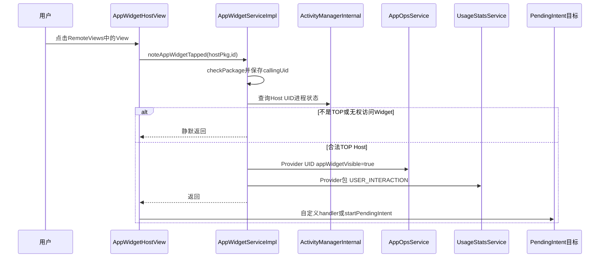
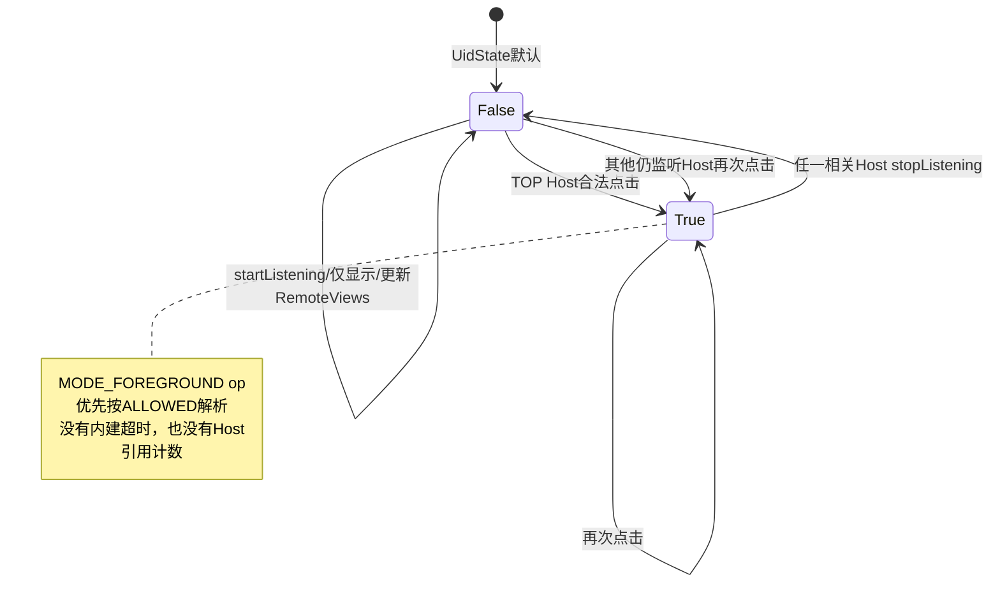
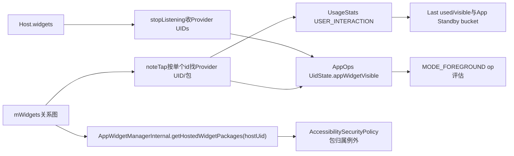

# 第 384 章 Android AppWidget 点击记账：AppOps 可见性、UsageStats 与 Accessibility 包归属链

> 源码基线：Android 11 / API 30 / `android-11.0.0_r48`。本章只在 macOS 阅读源码，不编译。上一章完成固定请求；本章研究用户真正点击桌面Widget时，为什么 `AppWidgetHostView`要在启动PendingIntent之前同步通知system_server。结论要特别谨慎：r48的 `appWidgetVisible`不是精确屏幕可见性，而是“合法TOP Host发生点击后置true、Host停止监听时置false”的UID级闩锁。

## 1. 从一次点击开始

Provider在RemoteViews里设置PendingIntent，Host inflate后给目标View安装监听器。用户点击时真正执行监听器的是Launcher进程，而不是Provider进程。

## 2. 为什么需要额外记账

PendingIntent可能启动Provider的Activity/Service，也可能让Provider在用户可见交互后访问while-in-use资源。系统需要知道这次交互确实来自前台Widget Host，而非后台Provider自报。

## 3. AppWidgetHostView包装点击handler

`getHandler()`返回一层wrapper：先调用 `AppWidgetManager.noteAppWidgetTapped(mAppWidgetId)`，再调用Host自定义handler；没有自定义handler才走 `RemoteViews.startPendingIntent()`。

## 4. 调用顺序非常关键

记账发生在PendingIntent启动之前。这样AppOps/UsageStats状态可先更新，再让目标Provider代码因点击运行。

## 5. 自定义handler也绕不过记账

AppWidgetHost构造时可提供OnClickHandler，但HostView仍把它包在noteTap之后。自定义handler返回false或自己处理启动，也已经产生点击记账。

## 6. handler不是Provider代码

RemoteViews的Action只描述点击响应；实际OnClickListener、AppWidgetHostView wrapper和Binder调用都运行在Host UI进程/线程，之后PendingIntent才跨进程调度。

## 7. noteTap是隐藏API

`AppWidgetManager.noteAppWidgetTapped(int)`标记为hide，普通Provider不会直接使用；它面向框架HostView自动调用。

## 8. 客户端传什么身份

AppWidgetManager把Context的opPackageName与appWidgetId传给IAppWidgetService。system_server同时从Binder获得真实callingUid。

## 9. 第一道门是包名归属

服务立即 `enforceCallFromPackage(callingPackage)`，通过AppOps checkPackage验证包名属于Binder UID，防止任意应用冒充Launcher包。

## 10. 清identity之前保存UID

代码先保存 `callingUid=Binder.getCallingUid()`，再 `clearCallingIdentity()`。否则清理后再取UID会得到system_server身份，TOP检查和Widget lookup都失真。

## 11. 为什么清Binder identity

后续调用ActivityManagerInternal、AppOpsManagerInternal和UsageStatsManagerInternal都应以系统服务身份执行，而不是把Host权限传播到内部服务。

## 12. finally恢复identity

所有return和异常都会经过finally恢复。Binder线程不会把SYSTEM_UID身份泄漏给下一段服务逻辑。

## 13. 第二道门是Host必须TOP

服务读取 `mActivityManagerInternal.getUidProcessState(callingUid)`；只有state不大于 `PROCESS_STATE_TOP`才继续。

## 14. 这里比“前台服务”更严格

上一章requestPin允许到BOUND_FOREGROUND_SERVICE；noteTap只接受TOP。后台Host、前台服务Host或不可见Activity不能借Widget ID制造用户点击记账。

## 15. TOP是调用时快照

Host点击发生到Binder线程检查之间可能有生命周期变化。源码按检查时的UID procState裁决，不保存Input事件或窗口token作为额外证明。

## 16. TOP不等于一定是Launcher

任何合法AppWidget Host应用在其TOP Activity中都可调用，但还必须通过包名和Widget关系lookup；接口保护的是“合法前台Host”，不是硬编码某个HOME包。

## 17. 第三道门是Widget访问

锁内调用 `lookupWidgetLocked(appWidgetId,callingUid,callingPackage)`。它复用第381章的Host/Provider/特权访问判定，而正常点击由Host精确分支命中。

## 18. 点击前半链图

## 19. 找不到Widget静默返回

删除/切换竞态导致lookup为null时不抛异常，也不记账；Host wrapper随后仍会继续处理PendingIntent，因为客户端note调用正常返回。

## 20. Provider不能为空的隐含假设

找到Widget后源码直接 `widget.provider.id`，没有null保护。理论上Host对allocate后未bind空槽调用隐藏接口可触发NPE；正常HostView点击只存在于已绑定Widget。

## 21. NPE如何影响点击

RuntimeException可穿过Binder客户端包装，使Host UI点击中断，后续自定义handler/PendingIntent可能不执行。它是畸形状态边界，不代表普通已绑定Widget每次有风险。

## 22. ProviderId提供目标UID

服务从Widget关系读取ProviderId，不相信Host传Provider包或UID。这样记账总归到真实绑定端。

## 23. 包名来源

Provider包来自 `providerId.componentName.getPackageName()`。若意外null则静默return；正常ComponentName构造保证非null字符串。

## 24. SparseArray只放一项

点击路径构造 `SparseArray<String>`，key是provider UID，value是Provider包，交给AppOpsManagerInternal更新visibility。

## 25. AppOps当前忽略value

r48 `updateAppWidgetVisibility()`只遍历key UID，没有使用packageName值。Map形状保留包语义/扩展空间，但真正状态存于UidState。

## 26. 状态是UID级

`UidState.appWidgetVisible`与pending版本是boolean。共享UID中的其他包、同UID不同Provider都会共享这一个位。

## 27. 点击把pending设true

若旧pending不同，写 `pendingAppWidgetVisible=true`；若它又不同于已提交位，立即调用 `commitUidPendingStateLocked()`。

## 28. 不是延迟settle

普通进程state降级可能有settle时间，Widget visibility变化直接commit。点击Binder返回前AppOps判定通常已看到true。

## 29. commit还会通知watcher

若UID有foreground op观察者，visibility变化会参与“旧/新是否仍foreground”的比较；相关MODE_FOREGROUND watcher通过Handler收到op变化通知。

## 30. appWidgetVisible如何影响evalMode

当某op配置为 `MODE_FOREGROUND`时，`UidState.evalMode()`第一项就是：若appWidgetVisible，返回MODE_ALLOWED。

## 31. 它先于进程状态判断

源码在pending-top、TOP state、前台能力检查之前读取Widget位。即使Provider进程当前后台，只要该位true，MODE_FOREGROUND先被允许。

## 32. 它先于位置capability判断

位置op通常还需 `PROCESS_CAPABILITY_FOREGROUND_LOCATION`；但appWidgetVisible分支在switch之前直接allowed。源码注释把Widget点击视为while-in-use交互依据。

## 33. 不等于绕过所有权限

只有最终AppOps mode为MODE_FOREGROUND时这条分支生效。Manifest/runtime permission、固定MODE_IGNORED/ERRORED、SELinux和API自身其他检查仍然存在。

## 34. 不能说“所有AppOps都允许”

准确说法是：对这个Provider UID，任何正在按MODE_FOREGROUND评估的op会因appWidgetVisible直接解析为MODE_ALLOWED；其他mode不由该分支改写。

## 35. true没有内部超时

AppOpsService不为Widget位安排定时清除。它一直保持，直到AppWidgetService显式传false或UidState被整体移除/系统重启等生命周期事件。

## 36. startListening不置true

Host开始监听只注册callback并补发更新，完全没有调用updateAppWidgetVisibility(true)。因此“Widget在桌面显示”本身不让位变true。

## 37. 第一次点击前可能仍false

即便Launcher已运行且Widget可见，只要没有合法noteTap，AppOps位仍为默认false。字段名“visible”容易让人误读成View visibility。

## 38. true更像交互闩锁

在r48具体实现里，更准确模型是“这个Provider曾被当前仍监听的Host中的Widget点击”。它与逐帧可见区域、页面切换、遮挡比例都无关。

## 39. false来自stopListening

Host调用stop时，服务清 `host.callbacks`、prune空Host，然后以 `host.getWidgetUids()`收集其全部Provider UID并批量传false。

## 40. stop不是按单个Widget

它以HostId为单位，把该Host所有Widget Provider UID都设false。没有传具体appWidgetId，也不判断其中哪一个被点击过。

## 41. Host客户端的建议生命周期

AppWidgetHost注释建议Activity可见的onStart调用startListening、不可见的onStop调用stopListening。但具体Launcher实现可采用不同生命周期。

## 42. Launcher3的实际做法

r48 Launcher在onCreate很早startListening，主要在onDestroy stopListening；普通暂停、All Apps或状态切换未必stop。因此点击后true可能维持很久。

## 43. Launcher3还捕获stop NPE

onDestroy用try/catch NullPointerException包住stopListening并记录warning。这与服务 `Host.getWidgetUids()`对provider-null直接解引用的已知边界相呼应。

## 44. provider-null如何阻断清除

Host同时含未bind空槽时，getWidgetUids循环遇到null provider会NPE，整个false调用不执行；先前某Provider UID的true可能因此残留。

## 45. getWidgetUids会按UID去重

SparseArray相同key后写覆盖，多个Widget同Provider UID最终一个entry。值可能变成同UID最后遍历到的包，但AppOps当前只看key。

## 46. 多Host没有引用计数

AppOps位只是一位。Host A和Host B都承载同Provider时，A点击置true，B随后stop就可置false，即使A仍监听并显示。

## 47. 反向竞态也存在

B stop置false后，A下一次点击又置true。最终状态依最近一次true/false调用，不是所有Host可见性的OR聚合。

## 48. 多用户通过完整UID隔离

SparseArray key是包含userId的Linux UID，同appId在user 0与profile user拥有不同key。跨profile Host点击会更新Provider所属profile的完整UID。

## 49. mask点击归谁

系统遮罩RemoteViews的点击PendingIntent可能处理quiet/locked/suspended提示，但HostView wrapper仍按该appWidgetId调用noteTap，关系中的原Provider UID可能被标true。源码没有按effective views来源区分。

## 50. 点击记账不验证PendingIntent来源

noteTap发生在handler入口，服务不接收PendingIntent，也不确认它属于Provider。合法HostView中任一RemoteViews点击响应都会先给绑定Provider记交互。

## 51. handler最终不启动也会记账

自定义OnClickHandler可返回false，PendingIntent也可能被取消；noteTap已经完成。记账代表用户点了Widget，不保证目标操作成功。

## 52. 快速连续点击

第一次把位从false变true并commit；后续true==pending时不重复commit watcher，但UsageStats USER_INTERACTION仍会每次上报。

## 53. AppOps闩锁状态图

## 54. 点击还上报UsageStats

同一锁内服务调用 `reportEvent(providerPackage, providerUserId, USER_INTERACTION)`。目标是Provider包，不是Launcher包。

## 55. 为什么归到Provider

用户操作的是Provider提供的Widget内容。即使真实触摸和View运行在Launcher进程，使用统计语义归于内容应用。

## 56. userId来自Provider UID

使用 `UserHandle.getUserId(providerId.uid)`。跨profile Widget因此更新资料用户的Provider统计，而不是父用户Launcher统计。

## 57. LocalService异步排队

UsageStatsManagerInternal构造elapsedRealtime事件；用户已解锁时向UsageStats Handler发送MSG_REPORT_EVENT，不在AppWidget锁内同步写磁盘。

## 58. 用户锁定时的队列

UsageStats LocalService若用户未解锁会把event放mReportedEvents链表，首次待处理事件还安排flush。AppWidget点击通常要求可用Host/profile，但实现仍有队列路径。

## 59. 时间基准转换

事件先记录elapsedRealtime，UserUsageStatsService处理时转换成系统墙钟时间，用于daily/weekly等UsageStats区间。

## 60. USER_INTERACTION写事件流

它不是SYSTEM_INTERACTION等被过滤的私有事件；daily stats会保存该Event，具备QUERY_USAGE_STATS权限的消费者按规则可能查询到。

## 61. 更新lastTimeUsed

UsageStats.update遇到USER_INTERACTION：有foreground Activity则先结算foreground时长，否则直接把mLastTimeUsed设为事件时间。

## 62. 也更新lastTimeVisible

若有visible Activity就结算visible时长，否则把mLastTimeVisible设为点击时间。这使无Activity的Widget交互也被视为应用最近可见使用。

## 63. 不增加launchCount

launchCount只在ACTIVITY_RESUMED且符合包切换逻辑时增加。单纯Widget点击的USER_INTERACTION不会被误算成Activity启动次数。

## 64. PendingIntent随后启动Activity会再记账

若点击再启动Provider Activity，系统还会产生ACTIVITY_RESUMED等事件。USER_INTERACTION与Activity生命周期事件是两条记录，不应去重成一个。

## 65. AppStandby也消费事件

UsageStatsService处理完用户统计后把事件交给AppStandbyController。USER_INTERACTION属于强使用事件。

## 66. 默认提升到ACTIVE

Controller对USER_INTERACTION走强使用else分支，把包的standby bucket提升为ACTIVE，并记reason为USAGE|USER_INTERACTION。

## 67. 默认保持窗口

r48 `DEFAULT_STRONG_USAGE_TIMEOUT`是一小时，可由DeviceConfig的strong_usage_duration调整。到期后只是重新按阈值评估，不保证恰好立即降到某固定bucket。

## 68. 点击可唤醒idle语义

若包此前idle，提升后会通知BatteryStats package active；这会影响后台限制、Job/Alarm调度资格等App Standby消费者。

## 69. 跨profile使用传播

若AppStandby配置允许link cross-profile apps，Controller会查相同包的有效关联profile，并对那些profile也reportEventLocked。原始UsageStats事件仍按Provider user记录，bucket影响可能传播。

## 70. 不要把一小时套到AppOps位

一小时是AppStandby强使用保持时长，不是appWidgetVisible超时。两条链同时由点击触发，但清除条件完全不同。

## 71. UsageStats失败不会回滚AppOps

先更新AppOps再调用UsageStats，二者没有事务。如果后者异常或用户服务不可用，前者的visibility true不会自动撤销。

## 72. AppWidget锁内调用外部服务

noteTap在mLock内调用AppOps与UsageStats内部服务。AppOps同步持自己的锁，UsageStats主要排消息；锁顺序仍值得审计，不能把LocalService等同零成本。

## 73. 点击Binder在Host UI线程

HostView listener同步调用noteTap。system_server繁忙或锁竞争会延迟随后PendingIntent启动，成为Widget点击“卡一下”的潜在位置。

## 74. oneway与否

IAppWidgetService的noteAppWidgetTapped不是声明oneway的单独异步事件，客户端要等待服务方法返回/异常。因此其安全检查和AppOps更新有明确先后。

## 75. Provider不会收到专门点击广播

noteTap只做系统记账。Provider业务事件仍由原PendingIntent的Activity/Service/Broadcast接收；不要在AppWidgetProvider里等“note”回调。

## 76. stopListening的主要职责仍是callback

服务先把host.callbacks=null，之后Provider更新只记序号供重连补发；AppOps false是附带的交互权限收敛，不会删除Widget关系或RemoteViews缓存。

## 77. pruneHostLocked何时删Host

只有host.widgets为空且callbacks=null才从mHosts移除。正常仍有Widget的Launcher stop后Host记录保留，只是离线。

## 78. stop不写主状态

它改变callback和AppOps运行态，不调用saveGroupStateAsync。监听状态和appWidgetVisible都不是AppWidget XML持久字段。

## 79. system_server重启的效果

AppOps UidState内存位回默认false；Widget关系从XML恢复，UsageStats历史可能已/后续持久化。三者恢复能力不同。

## 80. Host崩溃是否自动false

回调Binder死亡只在发送RemoteException时清host.callbacks，源码该路径没有同步调用updateAppWidgetVisibility(false)。若Host未正常stop，true可能留到其他事件或系统重启。

## 81. 这不是窗口可见性监听

服务没有从WMS接收Launcher窗口遮挡、页面位置或Widget view attach状态。变量名不能取代调用点事实。

## 82. getHostedWidgetPackages的另一条能力

AppWidgetService还向LocalServices注册 `AppWidgetManagerInternal`，允许system_server其他服务按Host UID查询它承载的Provider包集合。

## 83. 查询扫描全部Widget

`getHostedWidgetPackages(uid)`在mLock内遍历mWidgets，只要 `widget.host.id.uid==uid && provider!=null`就加入Provider包名。

## 84. 它不要求Host正在监听

callbacks可null、Launcher可后台、Widget可被mask；只要绑定关系仍在内存就返回。这个集合是“关系归属”，不是当前显示集合。

## 85. 它不按hostId或Host包过滤

输入只有UID。共享UID下所有Host包、所有hostId的Provider集合合并，符合UID级信任域但扩大了包归属范围。

## 86. 返回null与空集

初始局部变量为null，只有命中才new ArraySet；无Widget时返回null。消费者通常同时判断null/empty，不能无保护遍历。

## 87. 这个查询不暴露给第三方Binder

AppWidgetManagerInternal是system_server LocalService接口，仅内部服务可调用；普通应用不能直接枚举任意Host承载包。

## 88. Accessibility为何需要它

Provider View实际inflate在Launcher进程。无障碍事件的Binder发送者UID是Launcher，但事件packageName可能应标为Provider包；常规“包必须属于调用UID”会把它误判为冒充。

## 89. resolveValidReportedPackage的例外

AccessibilitySecurityPolicy若发现上报包不属于Host UID，会查询getHostedWidgetPackages；若集合包含该Provider包，就允许保留原packageName。

## 90. 不是任意代理权限

例外只用于Accessibility事件包归属校验。它不会让Launcher以Provider UID调用Provider权限、读取数据或绕过AppOps checkPackage。

## 91. computeValidReportedPackages

策略为目标UID构造所有合法报告包：先放targetPackage，再追加Host承载的Provider包。这服务于窗口/事件来源验证。

## 92. 包集合没有user标签

元素只是String。关系扫描使用完整Host UID并从每个Provider Component取包；跨profile同包名会折叠，但无障碍验证关注报告包字符串而非借此授予目标user权限。

## 93. 删除Widget后的收敛

关系从mWidgets摘除后，下一次getHostedWidgetPackages不再返回该Provider。调用者不能长期缓存集合作为永久授权。

## 94. Provider包更新仍可能保留关系

升级替换阶段AppWidget关系通常保留，集合继续含包名；真正组件删除/Provider清理后才消失。

## 95. Accessibility与AppOps两条集合不同

Accessibility实时遍历全局关系；AppOps stop使用特定Host.widgets构造UID map。一个是按需查询包名，另一个是改变Provider UidState，不要混为同一“可见列表”。

## 96. 本地能力图

## 97. 共享UID对AppOps的放大

Provider A与B共享UID，仅A Widget被点击也会把整个UID的appWidgetVisible设true；B包的MODE_FOREGROUND op评估也可能受益，因为状态不按包分开。

## 98. 共享UID对Accessibility的放大

Host侧共享UID中的任一包承载Widget，查询输入同UID即可得到合并Provider集合。Android把共享UID应用视为共同安全主体，这是设计后果而非字符串漏洞。

## 99. 点击已删除Provider的竞态

若服务已摘除Widget，lookup null安全返回；若Widget仍在但provider字段异常null则有NPE窗口。关系变更都在mLock内，正常删除不会在取provider的同一临界区中途发生。

## 100. Host包切换或重装

UID/HostId/package是Host身份。重装导致UID变化后旧关系不会让新UID凭相同包名noteTap；恢复/清理逻辑需重新建立Host关系。

## 101. 点击View的mAppWidgetId必须正确

HostView在 `setAppWidget(id,info)`保存ID，wrapper使用该字段。自定义Host错误复用HostView却未更新ID，可能给错误Widget记账或静默lookup失败。

## 102. 默认/错误View是否可点击

Host的默认View可能安装打开Provider主Activity的点击；只要走同一mOnClickHandler wrapper也会noteTap。错误TextView是否有点击响应取决于HostView创建逻辑，不是所有触摸都自动记账。

## 103. 集合项点击同样经过wrapper

PendingIntent template + fillIn响应最终调用RemoteViews OnClickHandler，因此AppWidgetHostView包装层仍先noteTap；无需集合Adapter单独调用服务。

## 104. mask点击也经过wrapper的安全含义

它保证用户对锁定/暂停Widget的显式操作仍被视为交互，但也说明appWidgetVisible不是“Provider内容已成功运行”的证据。

## 105. 诊断while-in-use失败

先查Host UID调用时是否TOP、包名校验、Widget lookup和provider是否正确，再看AppOps UidState的appWidgetVisible与具体op mode/runtime permission。不要只看PendingIntent是否启动。

## 106. 诊断位长期为true

检查Host是否真的stopListening、Launcher生命周期是否只在destroy停止、Binder死亡路径、provider-null NPE以及是否有其他Host再次点击。没有内建timer是首要事实。

## 107. 诊断位意外变false

列出同Provider UID的所有Host；任一Host stop都能false，服务没有引用计数。之后活动Host需再次产生合法点击才true。

## 108. 诊断UsageStats变化

看Provider user的USER_INTERACTION事件、lastTimeUsed/Visible、AppStandby reason与bucket；不要在Launcher包统计里找这次Widget内容使用。

## 109. 诊断无障碍包名被改写

确认getHostedWidgetPackages是否仍包含事件声明包、Widget关系是否已删、真实Binder调用UID和targetPackage。无Widget关系时策略会回退到UID自身第一个包等兼容行为。

## 110. 一次点击的四个时间点

触摸到达Host View、noteTap Binder完成、PendingIntent被AMS接受、目标组件实际运行是四个不同点。AppOps/UsageStats位于第二点，不能用后两点结果倒推前面一定成功或失败。

## 111. 本章只读练习说明

下面四个练习都只用macOS终端阅读源码，不编译。请分别画出“调用UID、目标Provider UID、目标userId、同步/异步”和状态清除条件。

## 112. macOS只读练习一：追HostView点击顺序

运行 `sed -n '710,730p' frameworks/base/core/java/android/appwidget/AppWidgetHostView.java`和 `sed -n '3648,3688p' frameworks/base/services/appwidget/java/com/android/server/appwidget/AppWidgetServiceImpl.java`，证明note先于自定义handler/PendingIntent，并列出包、TOP、lookup三道门。

## 113. macOS只读练习二：证明visible是UID闩锁

运行 `sed -n '505,555p' frameworks/base/services/core/java/com/android/server/appop/AppOpsService.java`与 `sed -n '3848,3870p' frameworks/base/services/core/java/com/android/server/appop/AppOpsService.java`，解释true如何短路MODE_FOREGROUND、为什么packageName值和超时都未参与。

## 114. macOS只读练习三：找唯一false路径

运行 `rg -n "updateAppWidgetVisibility" frameworks/base/services/appwidget frameworks/base/services/core/java/com/android/server/appop`，确认AppWidgetService只有点击true和stopListening false，并分析两个Host交错调用的最终位。

## 115. macOS只读练习四：追Accessibility包例外

运行 `sed -n '180,250p' frameworks/base/services/accessibility/java/com/android/server/accessibility/AccessibilitySecurityPolicy.java`与 `sed -n '4870,4905p' frameworks/base/services/appwidget/java/com/android/server/appwidget/AppWidgetServiceImpl.java`，解释Launcher为何能为Provider View上报Provider包，以及该例外为何不等于一般身份代理。

## 116. 易错结论一：Widget显示就会visible=true

错误。startListening和View attach都不置true；只有合法TOP Host noteTap置true，stopListening置false。

## 117. 易错结论二：true只持续一次操作

错误。r48无AppOps计时清除；一小时只属于AppStandby强使用窗口。位通常保持到Host stop或其他生命周期收敛。

## 118. 易错结论三：每个Widget独立记位

错误。AppOps按Provider完整UID存单boolean，同UID Provider共享；任一Host stop又可批量false且无多Host引用计数。

## 119. 本章复读后的修正

复读后把“可见Widget获得前台权限”改成更准确的“点击后UID级MODE_FOREGROUND闩锁”；把“stop一定清理”限定为getWidgetUids成功且无provider-null异常；并区分UsageStats/AppStandby一小时强使用保持与AppOps无超时，避免把两条同时触发的链混成一个机制。

## 120. 本章结论与下一章入口

一次Widget点击在PendingIntent前把真实绑定Provider UID标为AppOps Widget可见，并给Provider包记USER_INTERACTION；前者是无超时、无多Host计数的UID闩锁，后者更新使用历史和Standby bucket。另一路LocalService让Accessibility认可Host代Provider View上报包名。下一章继续审计AppWidget删除与清理：单实例、Host、Provider、包卸载和用户停止如何拆关系、发回调、销毁RemoteViewsService并收敛授权与内存缓存。
