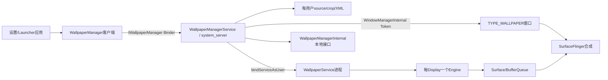
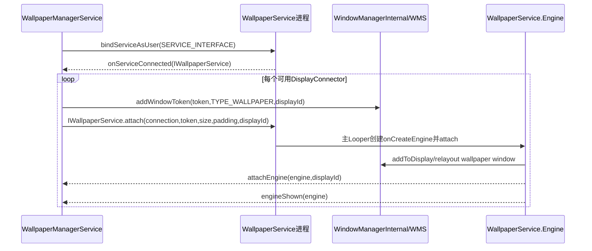
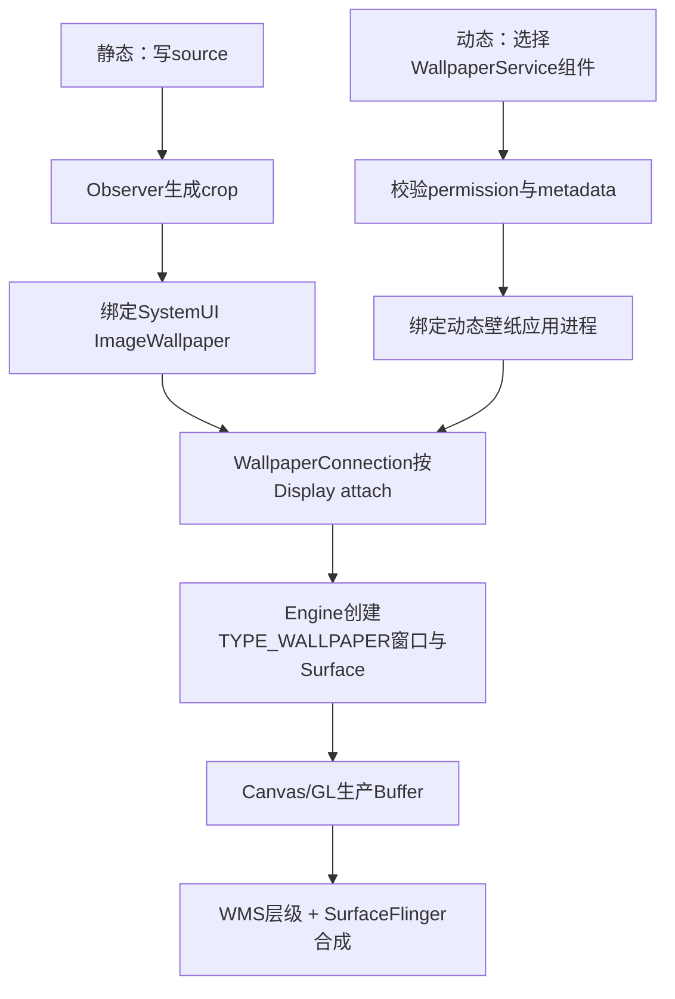

# 第 385 章 Android Wallpaper 总架构：ManagerService、ImageWallpaper、Engine、WMS 与分用户状态

> 源码基线：Android 11 / API 30 / `android-11.0.0_r48`。本章只在 macOS 阅读源码，不编译。第384章收束AppWidget；从本章开始进入Wallpaper专题。先建立总地图：`WallpaperManagerService`负责策略、文件、用户和服务连接，`WallpaperService.Engine`负责窗口与Surface，WMS负责Wallpaper Window在窗口树中的位置，静态图片也由SystemUI的 `ImageWallpaper` Engine通过GL绘制。

## 1. Wallpaper不是一个类

至少有五层：应用侧WallpaperManager、system_server中的WallpaperManagerService、壁纸应用中的WallpaperService、每显示器Engine、WMS/SurfaceFlinger显示链。只读一个类会把策略与绘制混在一起。

## 2. 两类壁纸

静态壁纸是用户选择的一张图片；动态壁纸是实现WallpaperService的组件。两者在“内容生产”上不同，在最终显示时都通过WallpaperService Engine和Wallpaper窗口进入合成。

## 3. 最反直觉的事实

静态图不是system_server拿Canvas直接画。服务保存/crop文件后绑定系统配置的 `mImageWallpaper`组件；AOSP该组件是SystemUI中的ImageWallpaper。

## 4. 三个关键进程

普通设置应用调用API；WallpaperManagerService运行system_server；动态WallpaperService运行其APK进程，ImageWallpaper通常运行SystemUI进程。WMS也在system_server，SurfaceFlinger另属native进程。

## 5. 客户端入口

应用通过 `context.getSystemService(Context.WALLPAPER_SERVICE)`拿WallpaperManager。常用API包括setBitmap/setStream、clear、setWallpaperComponent、getWallpaperFile、getWallpaperInfo和颜色监听。

## 6. WallpaperManager不是服务本体

它保存Context、色彩管理proxy等客户端状态，把跨进程请求交给IWallpaperManager。大图的编码/输入流复制有一部分发生在调用进程。

## 7. 进程级Globals

WallpaperManager用静态 `sGlobals`复用IWallpaperManager和回调/Bitmap缓存。一个进程多个Context取得的Manager实例共享底层Globals，不是每Context独立缓存。

## 8. Globals也是回调Stub

它继承IWallpaperManagerCallback，接收壁纸变化/颜色变化，维护listener及缓存失效。Binder线程到客户端Handler的切换要按具体方法继续追。

## 9. 服务发布名

Lifecycle在onStart通过 `publishBinderService(Context.WALLPAPER_SERVICE,mService)`注册，ServiceManager键即wallpaper系统服务。

## 10. 实现类可由资源替换

Lifecycle不是直接new固定类，而读取 `config_wallpaperManagerServiceName`，反射构造实现。厂商可替换，设备禁用方案也可使用Disabled实现。

## 11. 反射失败的后果

异常被catch并Slog.wtf，mService无法发布；后续WallpaperManager看到服务缺失会返回空或抛DeadSystemException，取决于API。

## 12. Lifecycle转发生命周期

SystemService的onBootPhase和onUnlockUser只转给实际IWallpaperManagerService实现，保持可替换实现仍参与系统阶段。

## 13. 核心全局锁

WallpaperManagerService以 `mLock`保护用户Map、WallpaperData、Connection、颜色listener与大部分切换状态。文件IO/跨服务调用有些也在锁内，是后续并发审计重点。

## 14. SystemServer启动阶段

PHASE_ACTIVITY_MANAGER_READY调用systemReady，初始化system user状态、注册用户切换/删除/关机监听；PHASE_THIRD_PARTY_APPS_CAN_START才switchUser(0)并真正选择绑定显示组件。

## 15. 为什么分两个阶段

先让持久账与默认文件就绪，等第三方包可启动后再绑定动态壁纸进程，避免过早拉起应用组件。

## 16. initialize做什么

注册PackageMonitor、创建user 0 system目录、从wallpaper_info.xml加载状态，再保证system WallpaperData存在。

## 17. systemReady检查静态crop

若next组件是ImageWallpaper而crop文件缺失，尝试从source重新generateCrop；仍失败则clear并回退默认。

## 18. 总体架构图

## 19. 两个ComponentName

`mImageWallpaper`来自image_wallpaper_component，专门显示静态crop；`mDefaultWallpaperComponent`来自产品默认配置，可能是动态组件，也可能为null。

## 20. null组件的选择规则

bind时componentName为null先选默认组件；默认也null才选ImageWallpaper。因此“清除壁纸”未必总回到静态图，产品可指定默认动态壁纸。

## 21. fallback WallpaperData

服务还维护mFallbackWallpaper。当前动态壁纸不支持多显示器时，fallback ImageWallpaper可负责其他可用display，而默认display仍由动态组件绘制。

## 22. mLastWallpaper

它指当前用户正在展示且非fallback的WallpaperData。切用户/换组件时服务detach旧连接、更新该引用。

## 23. 分用户Map

`mWallpaperMap`保存各user系统壁纸，`mLockWallpaperMap`只保存独立锁屏壁纸。key是userId，不是profile group。

## 24. 没有独立锁屏记录时

锁屏查询/切换会把system WallpaperData当作lock内容。这表示系统壁纸同时覆盖桌面与锁屏，并非两份相同文件。

## 25. FLAG_SYSTEM与FLAG_LOCK

set/clear/get的which使用位掩码。部分API要求恰好一个，set可同时包含两位；必须逐入口看验证，不能统一认为都可组合。

## 26. WallpaperData是一本内存账

它包含userId、source/crop文件、写入pending、whichPending、完成callback、allowBackup、name、component、ID、颜色、连接、崩溃时间、observer、回调与cropHint。

## 27. 系统静态文件名

system source为 `wallpaper_orig`，裁剪结果为 `wallpaper`。ImageWallpaper主要读取适合展示的crop，不直接依赖调用者原输入流。

## 28. 锁屏静态文件名

独立lock source为 `wallpaper_lock_orig`，crop为 `wallpaper_lock`。没有独立lock数据时可回退system文件语义。

## 29. 配置文件

`wallpaper_info.xml`保存尺寸、padding、cropHint、组件、ID、颜色与备份等元数据。它和图片文件不是一个原子文件事务。

## 30. 每用户目录

`getWallpaperDir(userId)`返回Environment.getUserSystemDirectory(userId)，常见对应 `/data/system/users/<id>/`。源码笔记只理解结构，不在macOS尝试访问设备路径。

## 31. Wallpaper ID

全局mWallpaperId递增，makeWallpaperIdLocked跳过0。每次设置可赋新ID，外部据此检测内容版本；它不是文件inode或组件UID。

## 32. source与crop分离的意义

保留原图便于按新尺寸重新裁剪；crop避免每帧解码超大原图。两者生命周期和失败恢复不同。

## 33. WallpaperObserver

FileObserver监听每用户目录的CLOSE_WRITE、MOVED_TO、DELETE等，完成client写文件后的裁剪、绑定、通知与颜色更新。

## 34. 为什么set API返回FD

大图片不经Binder Parcel直接传Bitmap字节。服务建立目标文件/状态并返回ParcelFileDescriptor，客户端把压缩图或stream写入，close触发FileObserver完成后半段。

## 35. 这是一种两阶段协议

Binder setWallpaper建立pending和FD；客户端写入/close；FileObserver看到文件完成再generateCrop、切ImageWallpaper、通知callback。Binder返回不等显示完成。

## 36. imageWallpaperPending

它标识当前source正由客户端写新静态图，帮助Observer区分外部文件变化和受控set流程。

## 37. whichPending

当一次写同时作用SYSTEM/LOCK，后半段依该位决定复制/拆分WallpaperData和通知哪些颜色。不要只看被写文件名推断目标。

## 38. setComplete callback

客户端可传IWallpaperManagerCallback，Observer在裁剪/切换完成后通知。进程死亡与FileObserver失败使它不是磁盘事务ACK。

## 39. allowBackup

这是该壁纸图像是否允许被系统备份的元数据，不等于所有WallpaperData都能恢复；动态组件、lock/system与transport还有各自条件。

## 40. 静态图仍绑定Service

Observer完成裁剪后通常bind `mImageWallpaper`。因此静态壁纸也有WallpaperConnection、IWallpaperService、Engine、窗口token和surface。

## 41. ImageWallpaper在哪里

AOSP实现位于 `frameworks/base/packages/SystemUI/src/com/android/systemui/ImageWallpaper.java`，继承WallpaperService，onCreateEngine返回GLEngine。

## 42. 为什么放SystemUI

它是受信任常驻系统组件，能读取受保护壁纸文件/使用系统Wallpaper API并稳定承载静态图渲染，不把原文件普遍暴露给应用。

## 43. ImageWallpaper不是普通ImageView

GLEngine建立EGL context/surface，ImageWallpaperRenderer加载纹理并绘制，再swap buffer。没有Activity、DecorView或XML View树。

## 44. 渲染工作线程

ImageWallpaper Service创建HandlerThread；Engine的surface回调把EGL初始化、尺寸、绘制和销毁post到worker，避免服务主线程做GL工作。

## 45. Engine主回调仍来自框架

WallpaperService的IWallpaperEngineWrapper用HandlerCaller在Service进程主Looper创建/attach Engine、处理visibility/offset/command；ImageWallpaper再将耗时GL细分到worker。

## 46. WallpaperService的职责

动态壁纸应用继承该Service并实现 `onCreateEngine()`。每个Engine独立管理一个显示目标的Surface、可见性、尺寸、offset、触摸、command、颜色和销毁。

## 47. Service不是Engine

一个Service进程可同时有多个Engine，例如默认display、外接display或preview。业务状态可共享，Surface生命周期必须按Engine区分。

## 48. WallpaperConnection

system_server创建它并同时实现IWallpaperConnection.Stub和ServiceConnection。它连接策略服务与远端WallpaperService。

## 49. Connection保存什么

包含WallpaperInfo、IWallpaperService proxy、WallpaperData、组件UID、reply和每display Connector。Service死掉时由此执行重绑/回退。

## 50. WallpaperInfo何时存在

动态组件通过metadata解析为WallpaperInfo；ImageWallpaper特殊路径允许mInfo为null。源码多处以 `mInfo==null`识别系统静态引擎。

## 51. 绑定权限门

候选Service必须声明 `android.permission.BIND_WALLPAPER`，否则用户显式设置时抛SecurityException，恢复/内部路径则记录并返回false。

## 52. 接口发现门

非ImageWallpaper还必须出现在WallpaperService.SERVICE_INTERFACE查询中并有可解析metadata，否则不能仅凭任意Service Component冒充壁纸。

## 53. Ambient额外权限

WallpaperInfo声明支持ambient mode时，包还必须拥有AMBIENT_WALLPAPER权限。声明能力和取得特权是两步。

## 54. 绑定flags

bindServiceAsUser使用AUTO_CREATE、SHOWING_UI、FOREGROUND_SERVICE_WHILE_AWAKE、INCLUDE_CAPABILITIES，让当前壁纸进程按用户与显示体验保持适当重要性。

## 55. 服务连接后的attach

onServiceConnected取得IWallpaperService，调用attachServiceLocked，遍历display Connector并各自connect。

## 56. Binder连接链图

## 57. DisplayConnector

每个display有独立Binder token、IWallpaperEngine proxy和尺寸/padding待同步位。token标识该display上的TYPE_WALLPAPER窗口容器。

## 58. 先加Window Token

connectLocked先调用WindowManagerInternal.addWindowToken，再调用远端Service.attach。没有合法token，Engine向WMS添加Wallpaper窗口会被拒。

## 59. attach携带参数

传connection、token、TYPE_WALLPAPER、preview=false、desired width/height、padding和displayId。Engine由此创建匹配显示的Context和Surface。

## 60. Engine再回报system_server

远端创建后通过IWallpaperConnection.attachEngine把IWallpaperEngine交回；绘制首帧后engineShown通知切换reply完成。

## 61. IWallpaperService与IWallpaperEngine

前者是Service级attach/detach入口；后者是单Engine控制面，可setDesiredSize、setDisplayPadding、setVisibility、dispatch commands、request colors、destroy等。

## 62. WMS不画壁纸内容

WMS管理TYPE_WALLPAPER窗口token、层级、可见性、offset、命令和relayout；buffer由Engine Surface生产，最后由SurfaceFlinger合成。

## 63. Engine的Window

WallpaperService.Engine内有BaseIWindow、IWindowSession、WindowManager.LayoutParams和SurfaceHolder，逻辑与普通窗口相似但type/flags/权限受Wallpaper框架约束。

## 64. updateSurface是核心

它根据创建、format、size、flags、redraw等决定向WMS add/relayout窗口，分发生命周期callback并在需要时finishDrawing/reportShown。

## 65. SurfaceHolder暴露绘制目标

动态壁纸可在onSurfaceCreated/Changed/RedrawNeeded中Canvas或GL绘制。系统不为应用自动保存每一帧。

## 66. keepScreenOn被禁止

WallpaperSurfaceHolder.setKeepScreenOn抛UnsupportedOperationException，防止壁纸借Surface长期保持屏幕亮。

## 67. fixedSize默认受限

普通动态壁纸不能随意setFixedSize，特定受信实现可setFixedSizeAllowed。ImageWallpaper启用后按纹理尺寸设置且有64px最小Surface。

## 68. 可见性来源

WMS通过IWindow.dispatchAppVisibility通知Engine；preview模式由预览Activity控制。Engine还结合Display.STATE_OFF计算reported visible。

## 69. onVisibilityChanged的意义

动态壁纸应在false时暂停动画/传感器，true时恢复。它不等于Service销毁，Surface也可能保留以便快速回显。

## 70. Display OFF会变不可见

`reportedVisible = mVisible && displayState != OFF`。即便窗口逻辑可见，屏幕关闭也触发onVisibilityChanged(false)。

## 71. offset来源

Launcher/WMS发送x/y offset、step、像素偏移和zoom，Engine合并pending消息后调用onOffsetsChanged/onZoomChanged。

## 72. offset可禁用

Engine可 `setOffsetNotificationsEnabled(false)`减少回调。ImageWallpaper禁用传统offset通知，但仍支持独立zoom行为。

## 73. Wallpaper命令

WMS可派发tap、drop等action与坐标/Bundle到onCommand。它是墙纸交互协议，不是一般广播Intent。

## 74. 触摸事件

Engine启用touch events后，WallpaperInputEventReceiver只处理pointer class MotionEvent，复制无history并投主Handler；默认并非所有壁纸都接收原始输入。

## 75. 颜色能力

Engine实现onComputeColors，notifyColorsChanged经IWallpaperConnection回system_server；静态ImageWallpaper也可从Bitmap计算颜色。

## 76. notifyColorsChanged有限流

WallpaperService内有颜色失效频率限制，过快调用会延迟合并。颜色不是每帧强制同步计算。

## 77. 颜色listener按user+display

WallpaperManagerService的mColorsChangedListeners第一层user/USER_ALL，第二层displayId，再用RemoteCallbackList管理远端死亡。

## 78. DisplayData

服务为每display保存desired width/height、padding和displayId。它与每用户WallpaperData不同：显示参数按display，内容选择按user。

## 79. 默认尺寸兜底

ensureSaneWallpaperDisplaySize至少设为display maximum size dimension，保证未知hint时仍有合理宽高。

## 80. 多显示支持判断

ImageWallpaper因mInfo==null被视为支持多display；动态WallpaperInfo需声明supportsMultipleDisplays。

## 81. 可用display门

display必须允许组件UID访问；默认display直接可用，非默认还需WMS认为应显示system decor。

## 82. 动态壁纸不支持多屏时

它只连接DEFAULT_DISPLAY；fallback ImageWallpaper为其他可用display建Engine，避免副屏黑背景。

## 83. 支持多屏时

系统动态/静态连接覆盖所有可用display，fallback连接器被断开并清空，避免同display双引擎竞争。

## 84. display移除

DisplayListener找到承载该display的主或fallback Connection，destroy Engine、移除token/connector和DisplayData，并删除该display颜色listener。

## 85. display新增的接入

DisplayListener.onDisplayAdded本身空；WMS通过WallpaperManagerInternal.onDisplayReady(displayId)通知服务建立正确connector，不能只看DisplayManager callback。

## 86. LocalService用途

WallpaperManagerInternal只公开onDisplayReady，供system_server WMS使用；普通应用不能经Binder调用。

## 87. 用户切换

ActivityManager UserSwitchObserver调用switchUser。服务取得目标user system WallpaperData和lock数据，启动observer并switchWallpaper。

## 88. 切换时颜色异步

真正绑定在锁内进行，颜色通知post到FgThread，避免用户切换主线程同步提取Bitmap颜色。

## 89. Direct Boot问题

用户锁定时非direct-boot-aware动态壁纸无法绑定。服务临时用ImageWallpaper fallback并设mWaitingForUnlock。

## 90. 解锁后恢复

onUnlockUser若当前user且waiting，重新switchWallpaper到目标组件并通知callback；同时后台restorecon各Wallpaper文件。

## 91. 非当前user状态

服务可因API/加载预先持有其他user WallpaperData，但只为mCurrentUserId维护mLastWallpaper实际显示连接。

## 92. 用户删除

userId>=1时停止observer、移除两Map，并删除五个per-user文件和restorecon标记；不会删除system user。

## 93. managed profile支持门

`isWallpaperSupported(callingPackage)`借OP_WRITE_WALLPAPER AppOp判断，某些user type如managed profile可被产品/系统设为不支持。

## 94. “支持”与“允许设置”不同

另有isSetWallpaperAllowed检查用户限制/设备策略。设备有Wallpaper功能不表示当前包、当前user能修改。

## 95. 读取壁纸也有权限边界

getWallpaperFile/getDrawable可能因READ_EXTERNAL_STORAGE兼容、内部权限或策略返回null。屏幕能显示不等于任意App可读原图像素。

## 96. Window显示与文件读取分权

WallpaperService组件获得绘制/读取所需系统通路；普通客户端读取API单独鉴权。不要从Surface可见推断底层文件world-readable。

## 97. Connection崩溃恢复

onServiceDisconnected会延迟1秒区分包更新竞态，再尝试重绑；10秒内仍失败可回退built-in，非默认组件短时间重复崩溃也触发清理。

## 98. wallpaperUpdating位

包更新期间避免把正常Service重启误判成崩溃。PackageMonitor与ServiceConnection异步顺序存在竞态，代码用延迟与两次死亡规则缓和。

## 99. detach做什么

通知旧reply、调用远端detach、unbindService、逐display移除token/destroy Engine、移除三个重试Runnable、清connection和mLastWallpaper。

## 100. detach不是清图片

它拆运行连接；source/crop/XML是否删除由clear/设置/用户删除流程决定。进程资源与持久内容是两层生命周期。

## 101. 静态图显示时间线

应用写source→Observer生成crop→绑定ImageWallpaper→每display Engine取得Surface→Renderer从WallpaperManager读取图→EGL画buffer→WMS层级+SF合成。

## 102. 动态图显示时间线

选择组件→服务验证permission/metadata→bind app Service→创建Engine→WMS token/window/surface→应用自己逐帧绘制。

## 103. 两条链共同部分

Connection、DisplayConnector、token、attach、Engine、visibility、Surface和SF相同；差异主要是内容源、Renderer实现、配置能力和崩溃主体。

## 104. 不要把WallpaperManagerService简称WMS

Wallpaper服务常缩写WMS，但WindowManagerService也叫WMS。笔记中用WPMS或完整名，WMS保留给窗口服务，避免调用链读反。

## 105. 线程地图

WPMS Binder入口在Binder线程，用户/包回调可能主Handler/FgThread/BackgroundThread；WallpaperService Wrapper多在应用主Looper；ImageWallpaper GL在专用HandlerThread；WMS/SF各自线程体系。

## 106. 锁地图

WPMS mLock、WallpaperConnection display集合、WallpaperService Engine mLock、WMS global lock相互独立。跨Binder/LocalServices时要关注持锁调用和回调重入。

## 107. 数据真值地图

图片真值分source/crop；配置真值在XML+WallpaperData；当前运行真值在component/connection/engine；屏幕真值在WMS窗口与Surface buffer。单看一层不足以诊断。

## 108. 诊断黑屏的顺序

先看目标user/component与crop，再看bind/Connection/Engine，随后token/window/surface与ImageWallpaper EGL日志，最后看SF/HWC。不要一开始就重设图片掩盖层级故障。

## 109. 诊断切换不生效

区分Binder set返回、文件close、Observer、crop完成、bind新组件、engineShown reply和首帧。它们不是一个同步事务。

## 110. 本专题后续路线

第386起依次深入静态写入裁剪、XML双账、动态绑定与崩溃、Engine/WMS、锁屏/Direct Boot、多屏、颜色、SystemUI渲染、备份恢复和诊断，400章综合审计。

## 111. 本章只读练习说明

下面四个练习只在macOS读取r48源码，不编译。目标是能从任意Wallpaper API判断“此刻在哪个进程、哪本账、是否已经产生屏幕buffer”。

## 112. macOS只读练习一：列出五层组件

运行 `rg -n "class WallpaperManagerService|class WallpaperConnection|class Engine|class ImageWallpaper" frameworks/base/services/core/java/com/android/server/wallpaper/WallpaperManagerService.java frameworks/base/core/java/android/service/wallpaper/WallpaperService.java frameworks/base/packages/SystemUI/src/com/android/systemui/ImageWallpaper.java`，为每个类标进程和职责。

## 113. macOS只读练习二：核对每用户文件

运行 `sed -n '185,235p' frameworks/base/services/core/java/com/android/server/wallpaper/WallpaperManagerService.java`与 `sed -n '850,940p' frameworks/base/services/core/java/com/android/server/wallpaper/WallpaperManagerService.java`，画source/crop/XML、system/lock与WallpaperData字段对应关系。

## 114. macOS只读练习三：追一次Engine attach

运行 `sed -n '1070,1160p' frameworks/base/services/core/java/com/android/server/wallpaper/WallpaperManagerService.java`和 `sed -n '1600,1645p' frameworks/base/core/java/android/service/wallpaper/WallpaperService.java`，写出addWindowToken、IWallpaperService.attach与onCreateEngine顺序。

## 115. macOS只读练习四：证明静态图也走GL Engine

运行 `sed -n '35,180p' frameworks/base/packages/SystemUI/src/com/android/systemui/ImageWallpaper.java`，指出GLEngine、worker、EglHelper、renderer、swapBuffer与延迟释放context的位置。

## 116. 易错结论一：静态壁纸由system_server绘制

错误。system_server管理文件和连接，SystemUI ImageWallpaper Engine通过EGL向Surface生产buffer。

## 117. 易错结论二：一个Service只有一个Engine

错误。Connection按display持Connector，WallpaperService可为每display和preview创建独立Engine。

## 118. 易错结论三：图片写完就已经显示

错误。close后还需Observer、crop、bind/attach、Engine surface、绘制和SF合成；set callback也不等于首帧物理present。

## 119. 本章复读后的修正

复读后限定三点：默认组件不一定是ImageWallpaper；DisplayManager.onDisplayAdded为空但WMS会走LocalService onDisplayReady；“多屏Engine”只对组件可访问且应显示system decor的display成立，不能写成所有物理display无条件创建。

## 120. 本章结论与下一章入口

Wallpaper是文件策略服务、远端Service/Engine、WMS窗口和Surface合成协作系统。静态与动态只在内容生产端分叉，最终都走Engine。下一章从setBitmap/setStream精读返回FD、pending字段、FileObserver、crop算法、100MB限制、SYSTEM/LOCK拆分及失败后的非事务边界。
