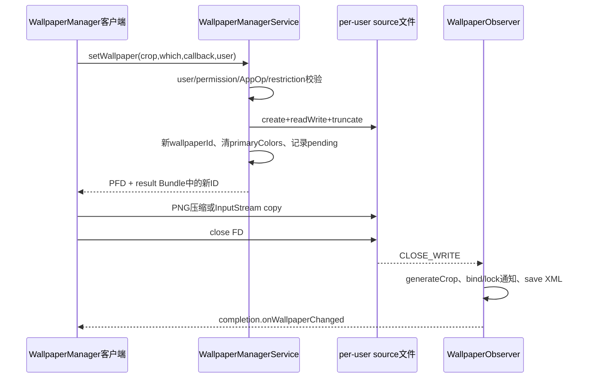
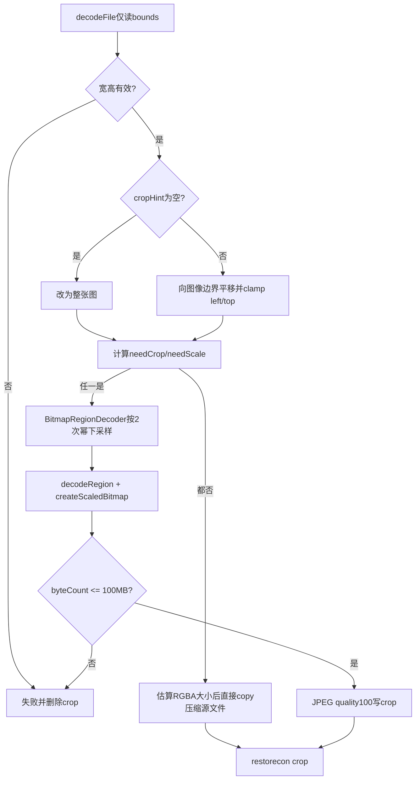
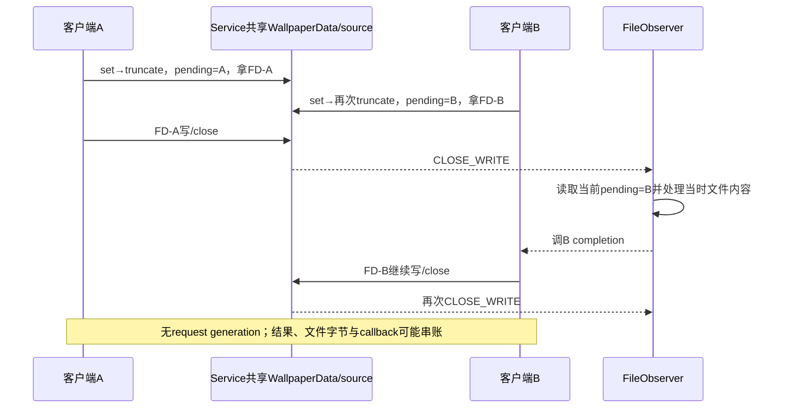

# 第 386 章 Android Wallpaper 静态图设置：FD 写入、FileObserver、裁剪、System/Lock 与失败边界

> 源码基线：Android 11 / API 30 / `android-11.0.0_r48`。本章只在 macOS阅读源码，不编译。上一章建立Wallpaper总架构；本章精读 `setBitmap()`/`setStream()`。它不是一个原子“上传并显示”调用，而是：Binder准备并截断source、返回FD、客户端写入关闭、FileObserver持锁裁剪、切换ImageWallpaper、保存XML、回调；任一步失败都没有共同回滚。

## 1. 三个静态设置入口

WallpaperManager提供setResource、setBitmap和setStream，最终都调用IWallpaperManager.setWallpaper取得可写ParcelFileDescriptor，再把数据写进服务端选定的source文件。

## 2. 为什么不用Binder传大图

Bitmap或图片字节可能远超Binder transaction限制。FD让客户端直接流式写服务创建的文件，Binder只传name、cropHint、which、callback和少量结果Bundle。

## 3. setBitmap的编码格式

客户端执行 `fullImage.compress(Bitmap.CompressFormat.PNG,90,fos)`。PNG是无损格式，quality参数通常不起有损压缩等级作用；源码仍传90。

## 4. setStream不重编码输入

它用FileUtils.copy把InputStream原字节写source。文档要求是BitmapRegionDecoder可识别的图片格式，不代表服务会保留任意非图片文件。

## 5. setResource的name

它把 `"res:"+resources.getResourceName(resid)`作为wallpaper.name，并复制raw resource。hasResourceWallpaper之后用同字符串检查当前/历史用户记录。

## 6. InputStream所有权

setStream只复制，不关闭调用者传入的bitmapData；调用方仍应关闭自己的InputStream。AutoCloseOutputStream则由WallpaperManager负责关闭。

## 7. 默认which

无which重载的setBitmap/setStream默认 `FLAG_SYSTEM | FLAG_LOCK`，意味着新图片同时作为桌面和锁屏内容，不只是system。

## 8. visibleCropHint客户端检查

WallpaperManager的validateRect只拒绝 `rect.isEmpty()`。负left/top但正width/height可通过客户端，再由服务端更严格拒绝。

## 9. 服务端第一步处理user

`ActivityManager.handleIncomingUser(... full=true)`把显式userId与调用身份对齐；跨用户设置需要INTERACT_ACROSS_USERS_FULL等系统授权。

## 10. SET_WALLPAPER权限

随后 `checkPermission(SET_WALLPAPER)`。有公开API并不表示任意应用无需权限即可修改。

## 11. which的最低验证

服务只要求 `(which & (SYSTEM|LOCK)) != 0`。公开@IntDef应传合法组合；r48入口没有显式拒绝附加未知bit。

## 12. 功能支持门

`isWallpaperSupported(callingPackage)`检查OP_WRITE_WALLPAPER。某些managed profile或产品形态可返回false，设置请求无效果并返回null FD。

## 13. 用户策略门

`isSetWallpaperAllowed()`先验证包属于callingUid，再检查Device/Profile Owner例外和DISALLOW_SET_WALLPAPER限制。

## 14. 被策略拒绝的客户端结果

服务返回null，结果Bundle没有新ID；客户端不写、不等待，最终返回0。它不是IOException，调用者应先查询两个allowed API或检查返回值。

## 15. null crop的内部表示

服务把null转成 `(0,0,0,0)`空Rect，generateCrop再解释为整张源图。空Rect是内部sentinel，不是实际零面积裁剪输出。

## 16. 非null crop的服务检查

拒绝负width/height、负left或负top。它不在Binder入口验证right/bottom一定小于源图，因为此刻文件尚未写入，尺寸未知。

## 17. 前半段流程图

## 18. SYSTEM-only为何先迁移

若which恰好SYSTEM且当前没有独立lock记录，锁屏正共享旧system图。服务必须先把旧system文件迁到lock文件，才能截断system source而不改变锁屏。

## 19. 迁移仅对精确SYSTEM触发

SYSTEM|LOCK不迁移，因为本来就要一起换；LOCK-only直接写专用lock文件；含额外未知bit时 `which==FLAG_SYSTEM`为false，可能绕开预期迁移。

## 20. migrate复制哪些元数据

新lock WallpaperData继承旧system的wallpaperId、cropHint、allowBackup和primaryColors。

## 21. 迁移不复制动态连接

lock WallpaperData没有WallpaperConnection/component运行链；锁屏静态内容由Keyguard路径使用。动态Wallpaper不能简单作为独立lock Engine复制。

## 22. 两次rename不是事务

先rename source，再rename crop。两者之间崩溃或第二次失败会留下部分迁移，没有目录级原子组合。

## 23. 第二次rename失败的处理

catch后删除lock source/crop并return。如果source第一次已成功搬到lock，delete又会删除它，而原system source已经不存在，旧原图可能丢失。

## 24. 迁移失败仍继续set

调用者随后照常打开并截断system source。无独立lock记录时最终锁屏可能继续回退到新system内容，违背“只改桌面”的用户直觉，但源码没有让set整体失败。

## 25. getWallpaperSafeLocked的选择

which精确等于LOCK才用mLockWallpaperMap；SYSTEM或SYSTEM|LOCK都用mWallpaperMap。组合操作只写system source一次。

## 26. 首次LOCK-only会建账

若lock Map无记录，服务new WallpaperData指向wallpaper_lock_orig/wallpaper_lock，放入Map并ensure sane defaults。

## 27. updateWallpaperBitmapLocked先建目录

目录不存在就mkdir并设user/group rwx、other execute。mkdir返回值未单独检查，后续open失败统一FileNotFoundException。

## 28. open会立即截断旧source

PFD flags为CREATE|READ_WRITE|TRUNCATE。此时客户端尚未得到FD，旧source内容已经不可恢复地清空；crop仍可能保留旧显示。

## 29. restorecon在open之后

服务对source执行SELinux.restorecon。若失败返回null，但已经open/truncate；该分支源码也未显式close刚创建的PFD，存在描述符与旧source损失边界。

## 30. 新ID生成得很早

open/restorecon成功后立即 `wallpaperId=makeWallpaperIdLocked()`并写到out Bundle。图片还没有一个字节写入，ID已代表“尝试中的新版本”。

## 31. name也先修改

wallpaper.name在返回FD前赋值。客户端写失败时内存name可能已变化，直到后续持久化/重载再收敛。

## 32. primaryColors立即清空

服务把旧颜色置null，要求后续重新提取。若写/裁剪失败，旧crop可能尚可见但颜色缓存已失效。

## 33. pending字段在拿到PFD后设置

只有update返回非null才置imageWallpaperPending、whichPending、setComplete、cropHint和allowBackup。

## 34. 客户端拿ID不等于成功

out Bundle随setWallpaper Binder返回，故客户端甚至在开始compress/copy前就拥有非0 ID。最终return该ID只是请求版本，不是首帧/裁剪成功证明。

## 35. setBitmap忽略compress布尔值

Bitmap.compress返回boolean，但源码没有检查。若返回false且未抛异常，仍close并等待Observer；无效source最终可能裁剪失败却返回新ID。

## 36. 显式close是协议触发点

客户端注释说明close触发服务端图像处理，必须在等待completion之前执行。只flush不close可能让FileObserver尚未收到CLOSE_WRITE。

## 37. AutoCloseOutputStream

关闭FileOutputStream也关闭底层ParcelFileDescriptor，通知内核最后写端关闭并产生FileObserver事件。

## 38. 写异常的finally

finally会quietly close输出流，因此partial source仍可触发Observer；但显式close后的wait语句没执行，客户端直接抛IOException，不等待后半段。

## 39. setStream原格式保留到source

JPEG输入source仍JPEG、PNG仍PNG。只有需要crop/scale的最终crop会重新压成JPEG 100。

## 40. completion最多等待约60秒

WallpaperSetCompletion连续两次调用`CountDownLatch.await(30,SECONDS)`，两个boolean都被忽略。回调一旦到达，后续await会立即返回；若始终没有回调，最坏会等待约60秒后正常返回当前新ID，不抛TimeoutException。这是r48容易看漏的重复调用。

## 41. 中断处理

InterruptedException被吞掉且未重新设置线程interrupt flag，调用继续返回。这是r48源码行为，不宜用它实现严格可取消任务。

## 42. completion没有成功字段

callback只有onWallpaperChanged，无result code。它表示服务后半段走到发布点，不证明generateCrop的success为true。

## 43. FileObserver线程

WallpaperObserver回调不在原Binder调用线程；它随后取得WPMS mLock并同步执行generateCrop。因此对客户端是异步，对Wallpaper服务其他锁内请求却可能形成长阻塞。

## 44. Observer先识别文件

只有wallpaper_orig或wallpaper_lock_orig匹配sys/lock变化；目录里其他文件事件不会进入主要流程。

## 45. CLOSE_WRITE与MOVED_TO

正常FD写入是CLOSE_WRITE；恢复/rename可产生MOVED_TO。MOVED_TO还会reload metadata和restorecon。

## 46. system→lock迁移的特殊事件

若MOVED_TO命中lock source，Observer只restorecon、通知Keyguard和lock颜色，然后return，不重新crop，因为crop也由迁移rename直接搬过来。

## 47. 一般callback早于crop

进入sys/lock事件后先 `notifyCallbacksLocked(wallpaper)`，其中向已注册callback调用onWallpaperChanged并发送ACTION_WALLPAPER_CHANGED；随后才generateCrop。

## 48. 广播不是ready ACK

ACTION_WALLPAPER_CHANGED可能在新crop生成前到达。消费者应重新查询并容忍旧/缺失内容，不把广播到达当首帧完成。

## 49. 广播目标user的边界

notifyCallbacksLocked使用 `mCurrentUserId`发送广播，而不是WallpaperData.userId。跨用户API修改非当前user时，回调账与广播user可能分叉。

## 50. 何时真正进入crop

组件为空、事件不是CLOSE_WRITE或imageWallpaperPending为true之一成立，且事件written，才generateCrop。正常受控set靠pending=true进入。

## 51. 外部随意改source不总重裁

当前component非null、普通CLOSE_WRITE且pending=false时，Observer会发一般变化通知，却跳过crop。直接写设备文件不是支持的设置协议。

## 52. generateCrop持有WPMS锁

Observer的synchronized(mLock)包住decode、scale、文件写、bind和save。大图处理会阻塞其他Wallpaper Binder/用户切换路径。

## 53. 裁剪流程图

## 54. 第一步只读bounds

BitmapFactory用inJustDecodeBounds分析source宽高，不分配完整Bitmap。<=0视为Invalid wallpaper data。

## 55. 空crop变整图

把left/top置0，right/bottom设outWidth/outHeight。null hint因此尽量保留全图，但后续仍可能为显示尺寸缩放/调整。

## 56. 超出右下边界先平移

若right/bottom超源图，用负offset把整个Rect向左/上移动，尽量保留请求大小，而不是简单截断right/bottom。

## 57. 过大crop再clamp

平移后left/top可能负，源码把它们设0；right/bottom已经由前一步平移到源图右/下边界。结果会缩小超大hint，而不是保持调用者要求的原宽高。

## 58. needCrop判断

只要源图任一维大于最终cropHint对应维就true。crop等于整图时false。

## 59. needScale判断

desired wallpaper height不等crop高度，或crop任一维超过GL最大纹理尺寸即true。主要是height-biased，不直接要求width等desired width。

## 60. 屏幕宽度补偿

按height缩放后newWidth若小于display logicalWidth，代码用屏幕高宽比直接重设cropHint.bottom并强制needCrop，避免输出宽度覆盖不了屏幕。这里赋的是绝对bottom而非`top+height`，非零top hint可能形成额外边界，应按实际Rect复算。

## 61. 只按default display生成crop

generateCrop明确取DEFAULT_DISPLAY的DisplayData/DisplayInfo。多显示器复用同crop，由各ImageWallpaper Engine适配，不为每display生成独立文件。

## 62. 快路径直接copy

无需crop/scale时不重新解码，直接把source压缩文件复制为crop，节省CPU和内存。

## 63. 快路径100MB只是估算

用width×height×4估算解码RGBA体积，而非source文件字节数。注释承认不准确。

## 64. 估算存在int溢出

outWidth/outHeight都是int，表达式先做int乘法再赋long。极端伪造bounds可能溢出为小/负值并错误通过 `< MAX_BITMAP_SIZE`。

## 65. 快路径边界是严格小于

estimateSize必须 `< 100MB`才copy；恰好100MB走失败删除。Fancy路径只在 `byteCount > 100MB`时抛，恰好100MB反而允许，边界不一致。

## 66. 快路径失败没有默认回退

copy失败会delete crop，源码留TODO“fall back to default”。本方法只记录Unable to apply，不直接恢复旧crop。

## 67. Fancy路径的下采样

先算cropHeight/desiredHeight的actualScale，再选不超过它的最大2次幂作为inSampleSize，降低decodeRegion瞬时内存。

## 68. actualScale小于2

scale保持1，不下采样；后续createScaledBitmap执行精确缩放。

## 69. estimateCrop坐标

把原cropHint按1/inSampleSize缩到decoded region坐标，hRatio再按desired height计算最终尺寸。

## 70. 宽度超过纹理上限

源码尝试以wpData width/height反推新crop，在原hint中心收窄/收高，再重新缩放estimateCrop。

## 71. decodeRegion

BitmapRegionDecoder只解裁剪区域而非整张源图；失败返回null或抛异常，统一不生成成功crop。

## 72. 精确缩放

`Bitmap.createScaledBitmap(cropped,safeWidth,safeHeight,true)`使用过滤生成最终Bitmap。

## 73. Fancy输出固定JPEG

最终用JPEG quality100写crop，即使source为PNG。透明度不保留，壁纸本就作为不透明背景使用；色彩/编码仍发生变化。

## 74. 真实内存限制

检查 `finalCrop.getByteCount()>100MB`就抛RuntimeException，随后被外围catch吞为crop失败，不把异常传回最初客户端。

## 75. success依赖flush

compress后显式bos.flush才设success=true，避免只因close未报错就误记成功。compress返回boolean本身仍未检查。

## 76. 失败统一删crop

任一异常/无效图令success=false，方法末尾delete crop。旧可显示crop因此可能被删除，不保留last-known-good文件。

## 77. 成功后restorecon

crop存在就restorecon；返回false只在DEBUG记录，没有把success回滚或删除crop。

## 78. crop失败后Observer仍继续

generateCrop返回void，不向调用者报告boolean。Observer照常清pending、可能bind ImageWallpaper、更新lock账、saveSettings并调用completion。

## 79. completion表示处理结束

因此客户端wait醒来只能说明onWallpaperChanged被调用，不能说明crop exists。返回非0 ID与callback两者都不是成功证明。

## 80. ImageWallpaper可能面对缺crop

Observer仍强制bind静态组件。Renderer的WallpaperManager读取使用returnDefault=true，缺当前crop时可能退到内置默认；默认也不可用或纹理加载失败才可能只清出黑色，不能把completion当作新图已显示。

## 81. system变更会重bind

sysWallpaperChanged后强制bind mImageWallpaper，哪怕此前是动态壁纸。设置静态图因此切换组件类型。

## 82. LOCK-only不bind桌面Engine

lock source完成只通知Keyguard/颜色，不切mLastWallpaper。锁屏图由SystemUI锁屏消费，不替换桌面WallpaperService连接。

## 83. SYSTEM|LOCK如何统一

写的是system source/crop；Observer看到whichPending含LOCK时移除mLockWallpaperMap，使锁屏重新回退system内容，并通知Keyguard。

## 84. 旧lock文件可能残留

该分支只从Map移除独立lock记录，没有在此处delete wallpaper_lock_orig/crop。XML不再保存lock账，但磁盘可暂留孤儿文件，后续lock set会truncate覆盖。

## 85. save发生在completion之前

Observer调用saveSettingsLocked后再setComplete.onWallpaperChanged，故callback表示XML保存流程已被调用；它仍不保证跨文件原子落盘或物理fsync所有图片语义。

## 86. setComplete没有清null

r48调用完成callback后未把字段设null，whichPending也未归零。下一次受控set会覆盖它们；某些后续restore/move事件仍可能看到旧值。

## 87. 并发set的核心竞态

mLock只保护“打开文件和写pending”，客户端拿FD后锁已释放。第二个调用可再次truncate同一source、覆盖ID/cropHint/completion，两个客户端随后并发写同一inode。

## 88. 没有generation绑定FD

FileObserver事件只查WallpaperData当前pending字段，不知道哪个PFD/哪个wallpaperId产生本次close。后关闭者、最后写入字节和最新metadata可能不是同一个请求。

## 89. completion可串账

第二请求覆盖setComplete后，第一个FD close触发Observer可能唤醒第二客户端；第一客户端等待超时。源码没有per-request token避免这种交叉。

## 90. 并发流程图

## 91. FileObserver不是事务协调器

它按文件事件做best-effort处理，没有锁住整个客户端写窗口，也不验证source完整性hash、长度或请求ID。

## 92. source/crop/XML三文件提交

source先被原地truncate写，crop随后delete/重建，XML最后JournaledFile保存。任意崩溃点都可留下代际不一致。

## 93. 为什么保留source仍有价值

即便非事务，成功路径保留原图可在display hint变化/启动发现crop缺失时重新generateCrop。

## 94. allowBackup的写入时点

pending建立时就改内存allowBackup，Observer最后写XML。写失败但Observer仍保存时，新备份标志可能与缺失crop一起持久化。

## 95. primaryColors重算时点

ID建立时清null，Observer完成后notifyWallpaperColorsChanged会触发extract或Engine request；颜色提取失败可继续保持null。

## 96. 一般callback与completion不同

WallpaperData.callbacks是读取方注册的变化监听，Observer在crop前通知；setComplete是本次写调用者专用，crop/save后通知。两者同名方法但时点不同。

## 97. Keyguard callback

独立lock或SYSTEM|LOCK提交会调mKeyguardListener.onWallpaperChanged。RemoteException被忽略，不重试也不移除字段。

## 98. 颜色通知在mLock外

Observer累积notifyColorsWhich，退出锁后调用notifyWallpaperColorsChanged，避免颜色提取自同步再次长时间占有同一锁。

## 99. crop本身却仍在锁内

这是性能诊断重点：颜色通知已刻意移锁外，但BitmapRegionDecoder/createScaledBitmap/文件压缩仍位于锁内。

## 100. setBitmap的调用线程风险

客户端同步compress、File IO并最多等待约60秒。若从应用主线程调用，大图可造成明显卡顿甚至ANR风险；应由应用自行放后台线程。

## 101. system_server内存风险

Fancy crop虽先下采样，仍同时可能持cropped和finalCrop，100MB上限只检查final对象，瞬时内存更高；异常被吞但GC压力已经发生。

## 102. 100MB不是source文件限制

高度压缩的JPEG文件很小也可能解码超100MB；反之大文件字节不一定产生大Bitmap。限制针对绘制Bitmap估算/byteCount。

## 103. Max texture也参与

即使低于100MB，只要crop宽高超过GLHelper max texture就强制scale/crop，保护ImageWallpaper上传纹理。

## 104. cropHint是提示不是严格输出框

服务可能平移、截取、按height缩放、为屏宽调整bottom或为纹理限制居中收窄。调用者不能用它要求逐像素不变裁剪。

## 105. 诊断返回0

先查服务是否运行、SET_WALLPAPER、AppOp支持、DISALLOW_SET_WALLPAPER/owner例外、跨用户权限、文件open/restorecon；null FD对应0。

## 106. 诊断非0但没显示

查source bounds、generateCrop日志、crop是否存在/SELinux label、ImageWallpaper bind/Engine与Renderer，而不是仅看new wallpaperId。

## 107. 诊断锁屏被意外替换

确认which是精确SYSTEM还是SYSTEM|LOCK、原先是否有lock Map、system→lock rename是否两步成功，以及未知bit是否绕开精确迁移条件。

## 108. 诊断回调提前

区分一般Wallpaper callback/ACTION_WALLPAPER_CHANGED（crop前）与WallpaperSetCompletion（save后）；r48客户端重复await，两次30秒都超时后才继续，也仍可能受并发串账影响。

## 109. 诊断旧lock文件

Map/XML已无lock标签但wallpaper_lock文件仍在并不代表锁屏还使用它；查询当前账与which回退语义，不能只看磁盘文件存在。

## 110. 安全的应用使用模型

后台线程调用；传合法which/crop；检查返回ID但仍监听/重新查询；串行化同user设置请求；保留自己的源图与业务状态，不把系统API当唯一事务存储。

## 111. 本章只读练习说明

下面四个练习只在macOS读r48源码，不编译。每个练习必须标出“旧数据何时被破坏、新ID何时出现、哪个回调是否携带成功结果”。

## 112. macOS只读练习一：追客户端close与等待

运行 `sed -n '1385,1545p;2135,2165p' frameworks/base/core/java/android/app/WallpaperManager.java`，比较setBitmap和setStream，确认compress返回值、InputStream所有权、显式close、finally close及连续两次30秒await。

## 113. macOS只读练习二：追服务端截断与pending

运行 `sed -n '2400,2535p' frameworks/base/services/core/java/com/android/server/wallpaper/WallpaperManagerService.java`，按顺序标出迁移、open TRUNCATE、restorecon、新ID、清颜色和pending字段。

## 114. macOS只读练习三：手算裁剪分支

运行 `sed -n '576,780p' frameworks/base/services/core/java/com/android/server/wallpaper/WallpaperManagerService.java`，任选4000×3000源图、1080×2400 display hint与一个crop，计算needCrop、needScale、inSampleSize和safeWidth/Height。

## 115. macOS只读练习四：证明通知时点不同

运行 `sed -n '260,345p' frameworks/base/services/core/java/com/android/server/wallpaper/WallpaperManagerService.java`，圈出notifyCallbacksLocked、generateCrop、saveSettings、setComplete和锁外颜色通知的实际顺序。

## 116. 易错结论一：set返回ID就是成功

错误。ID在写入前生成；crop失败、wait超时和并发串账仍可返回非0。

## 117. 易错结论二：cropHint会原样裁剪

错误。它是提示，服务会平移/clamp、按height和屏幕宽度调整、受纹理与100MB约束。

## 118. 易错结论三：SYSTEM-only天然不动lock

错误。它依赖旧system→lock两次rename成功；迁移失败仍继续设置，锁屏可能回退新system。

## 119. 本章复读后的修正

复读后纠正三处：100MB快路径估算是int表达式后赋long，存在溢出而非可靠上限；FileObserver所谓“后台裁剪”仍在WPMS mLock内；completion在crop失败后也会调用且await超时结果被忽略，不能称成功ACK。

## 120. 本章结论与下一章入口

静态设置是无generation的多阶段文件协议：旧source先截断，新ID先发布，close触发Observer持锁裁剪，system/lock账再收敛，callback不携成功结果。下一章精读wallpaper_info.xml与JournaledFile：system/lock标签、尺寸padding、颜色、组件、版本迁移、损坏恢复及图片/XML代际不一致如何在启动时被修补或放大。
