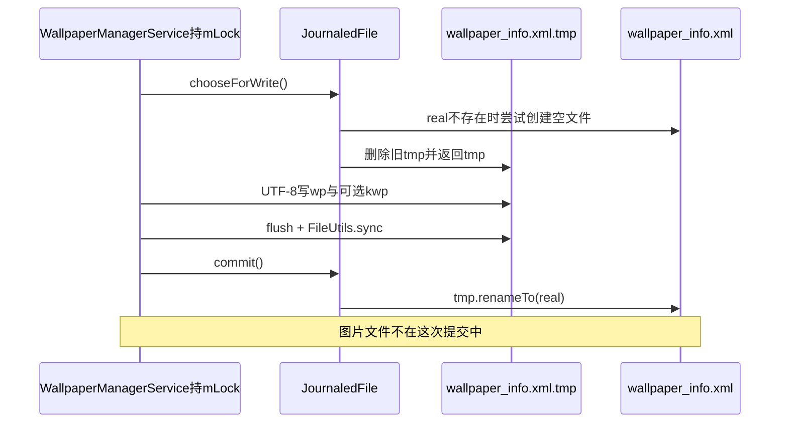
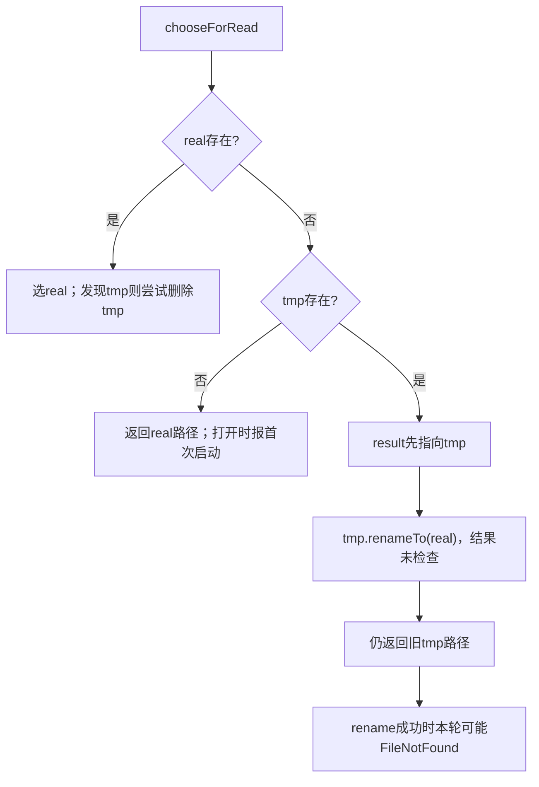
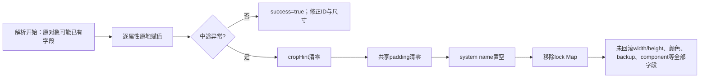

# 第 387 章 Android Wallpaper 状态 XML：JournaledFile、加载保存、损坏与代际一致性

> 源码基线：Android 11 / API 30 / `android-11.0.0_r48`。本章只在 macOS 阅读源码，不编译。上一章已经看到静态图片会经历 source、crop 和回调三条链；本章专门研究第四份状态：`wallpaper_info.xml`。重点不是背 XML 字段，而是弄清内存账、XML、原图和裁剪图分别何时更新，以及异常后系统究竟恢复了什么。

## 1. 本章先建立四份状态

同一用户的壁纸不是“一个文件”，而是内存中的 `WallpaperData`、`wallpaper_info.xml`、source 原图和 crop 显示图四份状态。动态壁纸可能没有可用静态图，但仍依赖内存账和 XML 记住组件。

## 2. XML位于哪里

`getWallpaperDir(userId)` 返回 `Environment.getUserSystemDirectory(userId)`，即系统用户数据目录，而不是普通应用沙箱。服务把主文件命名为 `wallpaper_info.xml`。

## 3. 临时文件名

`makeJournaledFile()` 用主路径和同路径加 `.tmp` 构造 `JournaledFile`：

```java
String base = new File(getWallpaperDir(userId), WALLPAPER_INFO).getAbsolutePath();
return new JournaledFile(new File(base), new File(base + ".tmp"));
```

## 4. JournaledFile已经废弃

r48 类注释明确建议新代码使用 `AtomicFile`。旧格式不能随意切换，因为升级或降级时两种类对备份文件的语义不同，迁移不严谨反而可能丢数据。

## 5. 它只管理两个路径

`JournaledFile` 只有 `mReal`、`mTemp` 和当前对象内的 `mWriting`。它没有版本号、校验和、文件锁、目录事务或跨进程协调器。

## 6. 服务锁才是写互斥

`chooseForWrite()` 只防同一个 JournaledFile 对象重复写；但每次 `saveSettingsLocked()` 都新建对象。因此运行期主要依靠 `WallpaperManagerService.mLock` 串行化，启动初始化则依靠 systemReady 的单线程时序；不能把 `mWriting` 当全局锁。

## 7. 方法名中的Locked是契约

`saveSettingsLocked` 和 `loadSettingsLocked` 的命名提示它们通常操作受 `mLock` 保护的状态，但方法自身没有 `synchronized`。尤其 `systemReady()->initialize()` 会在服务启动的单线程阶段直接load；所以必须检查具体调用上下文，不能只看方法后缀就断言已经持锁。

## 8. 写入目标永远是tmp

`chooseForWrite()` 最终返回 `mTemp`。新 XML 不会直接逐字节覆盖主文件，正常情况下旧主文件会一直保留到新内容写完。

## 9. 首次写为何先造空主文件

若主文件不存在，方法尝试 `mReal.createNewFile()`。它想让并发读优先看到 real，从而不会把尚未写完的 tmp 当成有效数据。

## 10. createNewFile失败被忽略

IOException 被直接忽略。接下来的 tmp 写入仍可能成功；但若此时发生读，是否误选半成品取决于实际文件状态和外部锁，JournaledFile自身没有解决全部竞态。

## 11. 旧tmp会先删除

开始新写前若 tmp 存在就调用 `delete()`，返回值不检查。删除失败时随后以 truncate 模式打开同一路径，仍可能覆盖；若打开也失败则进入 IOException 回滚。

## 12. save的编码与文档头

`FastXmlSerializer` 以 UTF-8 输出，`startDocument(null, true)` 声明 standalone。文件没有额外根容器，而是依次写 `<wp .../>` 与可选 `<kwp .../>` 两个顶层标签。

## 13. XML为何能有两个顶层标签

严格 XML 通常要求单一根元素；Android 的 XmlPullParser/FastXmlSerializer 在这份历史格式上按顺序处理两个标签。阅读时应按平台既有格式理解，不要用通用 XML schema 的直觉重写。

## 14. 保存主流程图



## 15. wp代表什么

`wp` 来自 `mWallpaperMap.get(userId)`，表示该用户的 system 壁纸账。它既能描述静态 ImageWallpaper，也能描述第三方动态 WallpaperService。

## 16. kwp代表什么

`kwp` 来自 `mLockWallpaperMap.get(userId)`，只在存在独立 lock 壁纸账时写出。没有该标签不代表锁屏为空，而通常表示锁屏复用 system 壁纸。

## 17. 标签顺序固定

保存先写 `wp`，后写 `kwp`。加载循环并不强制顺序，但 DisplayData 是共享对象；恶意或损坏文件中后出现的标签可能覆盖某些共享字段。

## 18. id字段

每个标签写 `WallpaperData.wallpaperId`。ID用于变化版本和颜色回调等逻辑，不是文件内容哈希，也不能证明 source/crop 与 XML 属于同一成功事务。

## 19. width与height来自DisplayData

两种标签都写 default display 的 `DisplayData.mWidth/mHeight`，而非 Bitmap 宽高或 cropHint 宽高。它们是壁纸引擎期望的最小显示尺寸提示。

## 20. 只持久化默认显示尺寸

`writeWallpaperAttributes` 固定调用 `getDisplayDataOrCreate(DEFAULT_DISPLAY)`。其他 display 的 desired size/padding 不写这份 XML，重启后不能依靠它恢复。

## 21. crop四边

`cropLeft/Top/Right/Bottom` 直接来自相应 WallpaperData 的 `cropHint`。空的 `0,0,0,0` 是“使用整图并由服务计算”的常见 sentinel。

## 22. padding四边

padding 也来自 default DisplayData，但值为 0 时省略属性。加载使用默认 0，因此“缺字段”和“显式写0”语义相同。

## 23. wp和kwp重复写尺寸padding

虽然 system 与 lock 各有 cropHint，它们共享 default DisplayData。保存两个标签时 width、height、padding会重复；这是历史格式冗余，不是两套显示尺寸。

## 24. 颜色字段何时存在

只有 `primaryColors != null` 才写 `colorsCount`、`colorValueN` 和 `colorHints`。没有字段表示尚未提取、提取失败或缓存已清，不表示颜色一定是黑色。

## 25. 颜色用ARGB整数

`Color.toArgb()` 返回有符号 int，XML中可能出现负十进制。加载用 `Integer.parseInt` 和 `Color.valueOf(int)` 还原，负数本身不是损坏证据。

## 26. 主色数量

保存使用 `getMainColors().size()`。Android WallpaperColors 正常最多表达 primary、secondary、tertiary；加载循环也只给前三个变量赋值。

## 27. colorsCount过大时的实际行为

加载循环一旦 `i > 2` 就 break，因此不会读取后续 colorValue。它仍用前三色构造 WallpaperColors；字段数与声称count不一致并没有完整性校验。

## 28. colorsCount为负

判断仅是 `> 0`。负值不会创建新 WallpaperColors，也不会抛错；若对象此前已有颜色，parse函数也没有先清空它，可能保留旧内存值。

## 29. name字段

保存无条件写 `wallpaper.name`。正常 WallpaperData 会初始化为空串；若某条异常路径使其为 null，serializer 的行为可能抛运行时异常，而 save 只捕获 IOException。

## 30. component只描述非ImageWallpaper

只有 `wallpaperComponent != null` 且不等于 `mImageWallpaper` 时才写 component。静态壁纸通过“省略组件”在加载时归一化为 ImageWallpaper。

## 31. component使用短字符串

`flattenToShortString()` 常得到 `包名/.ServiceName`。加载用 `ComponentName.unflattenFromString`，字符串格式错误会返回 null，而不是一定抛异常。

## 32. backup字段

`allowBackup` 为 true 才写 `backup="true"`。加载严格用字符串 `"true".equals(...)`；`TRUE`、`1` 等都视为 false。

## 33. 哪些运行态不写XML

`connection`、每显示器 connector/engine、回调列表、pending写入、setComplete、crash时间、当前绑定状态都不持久化。重启必须由组件名和文件重新构建运行链。

## 34. flush与sync的区别

先 `stream.flush()` 把 BufferedOutputStream 数据推给 FileOutputStream，再 `FileUtils.sync(fstream)` 请求把文件内容同步到存储。只flush不能提供相同掉电持久性。

## 35. close发生在commit前

sync后关闭stream，再执行 `journal.commit()`。因此 rename 之前写端已关闭，避免继续向已改名文件写数据。

## 36. IOException回滚

任一受检 IOException 会 quiet close stream，并调用 `rollback()` 删除 tmp；旧 real 理论上保持不变。这是 JournaledFile最主要的保护价值。

## 37. rollback不恢复图片

同一设置动作中 source 可能早已截断、crop可能已删除或重建。XML rollback 只删 tmp，不会把图片文件恢复到旧版本。

## 38. save吞掉IOException

catch中不记录日志也不向调用者返回失败。内存状态可以继续是新值，而磁盘 XML 仍是旧值；问题常在重启后才暴露。

## 39. RuntimeException不在catch内

`IllegalArgumentException`、`IllegalStateException`、SecurityException 或其他运行时错误不会被这个 catch 捕获。方法签名里的 writer 异常并不等于所有失败都会静默回滚。

## 40. commit忽略rename结果

`commit()` 调用 `mTemp.renameTo(mReal)`，但不检查 boolean。rename失败时方法仍把 `mWriting=false` 并返回，调用者误以为已提交。

## 41. 没有目录fsync

代码同步的是 tmp 文件描述符，没有显式 fsync 父目录。rename 的目录项在突发掉电下是否落盘，不能仅由 FileUtils.sync(temp)完全保证。

## 42. 保存触发点很多

静态写入完成、宽高提示改变、padding改变、清除lock、动态组件切换、颜色提取完成等路径都可能保存。XML不是仅在关机时写一次。

## 43. 频繁保存仍不是事件日志

每次都覆盖完整当前快照，没有追加历史、事务ID或时间戳。无法仅靠 XML 回溯“哪次调用造成当前状态”。

## 44. load首先选择文件

`loadSettingsLocked` 先创建 JournaledFile，再执行 `chooseForRead()`，之后才建立/取得 WallpaperData 并打开返回的 File。

## 45. real存在时的选择

若 real 存在，返回 real；若 tmp 也存在，则假定 tmp 是未完成写入并删除。这里优先旧的完整主文件。

## 46. tmp删除失败不影响本次读real

`delete()` 返回值不检查。本次仍打开 real；遗留 tmp 可能在后续状态变化中继续造成混淆，但当前选择不变。

## 47. 仅tmp存在时的注释意图

类注释声称应使用 temp，并把它转成 real。这代表“写完了但提交前/主文件缺失”的恢复意图。

## 48. 仅tmp存在时的r48实际代码

代码先令 `result=mTemp`，再 `mTemp.renameTo(mReal)`，最后返回 `result`。`File` 对象路径不会因 rename 自动改变，所以成功改名后返回值仍指向已不存在的 `.tmp` 路径。

## 49. 这一实现差异的后果

`new FileInputStream(file)` 可能在本轮抛 FileNotFoundException，尽管有效内容已被移到 real。下一次load也许能读real，但本轮会走失败默认化；不能把“只剩tmp”描述成无条件透明恢复。

## 50. 加载决策图



## 51. 首次建立system WallpaperData

若 `mWallpaperMap` 没有该用户，load创建指向 `wallpaper_orig` 与 `wallpaper` 的 WallpaperData，默认 `allowBackup=true` 并放入Map。

## 52. migrateFromOld只做一次式初始化

只有本用户system WallpaperData原先不存在时调用迁移。迁移函数实际固定处理 user 0 的旧路径，因此它是历史兼容，不是每个用户通用文件修复器。

## 53. crop缺失时先看source

新建账后若 crop 不存在但 source 存在，会在解析 XML 前 `generateCrop(wallpaper)`。这能从原图补裁剪图，但此时 cropHint 尚是新对象默认值。

## 54. 补crop早于读cropHint的影响

磁盘 XML 即使保存过非空 cropHint，本轮预修复也先按默认空hint生成。之后解析只更新内存cropHint，不自动再生成一次，所以显示图可能与恢复出的hint不一致。

## 55. source也没有时

只记录“No static wallpaper imagery; defaults will be shown”。它不会因此拒绝加载动态组件，静态 ImageWallpaper之后可回退产品默认图。

## 56. fallback初始化

首次建任意system账的这条路径还会 `initializeFallbackWallpaper()`。fallback是system user的ImageWallpaper运行账，主要服务不支持多显示的动态壁纸场景。

## 57. parser循环

XmlPullParser不断 `next()` 到 END_DOCUMENT，只关心 START_TAG。未知标签被忽略，没有版本号协商或严格schema验证。

## 58. 遇到wp

先 `parseWallpaperAttributes(parser, wallpaper, keepDimensionHints)`，再单独解析 component。公共字段解析失败会使整轮success保持false。

## 59. system组件归一化

component缺失、格式错误，或解析出的包名恰好为 `android`，都会把 `nextWallpaperComponent` 设为 `mImageWallpaper`。

## 60. 为什么android包被强制替换

这防止旧配置或内部实现组件直接作为一般动态壁纸恢复；服务统一使用当前解析出的专用ImageWallpaper组件。它不是“所有系统包动态壁纸都可信”的白名单。

## 61. wallpaperComponent与nextWallpaperComponent

load设置的是“下一步应绑定”的 component；当前 `wallpaperComponent` 通常在实际bind成功后才反映运行组件。磁盘意图与运行结果应分开看。

## 62. 遇到kwp

若lock Map尚无对象就创建指向 `wallpaper_lock_orig` 与 `wallpaper_lock` 的 WallpaperData，再用 `keepDimensionHints=false` 解析属性。

## 63. kwp没有component解析

独立lock账只读取通用字段，不读取动态组件。r48的独立锁屏壁纸是静态文件/颜色账，不建立一套lock WallpaperService Engine。

## 64. 重复wp标签

parser没有“只接受一次”检查；后一个wp会覆盖同一WallpaperData的多数属性。损坏或手改文件中“最后一次解析值”常占优。

## 65. 重复kwp标签

同理会重复解析同一lock对象。它不会为每个标签新建不同锁屏版本。

## 66. 缺少wp但有kwp

循环仍可success=true，因为success在正常到END_DOCUMENT后统一设置。system WallpaperData保持默认值，lock可存在；之后system ID若<=0会补新ID。

## 67. 空文件

parser通常在到达合法END_DOCUMENT前抛解析异常，因此走失败清理，而不是成功的“零标签配置”。

## 68. id加载与全局上界

存在id属性时解析为int并赋给wallpaper；若大于 `mWallpaperId` 就提升全局上界，避免之后生成重复或更小ID。

## 69. id缺失

直接调用 `makeWallpaperIdLocked()` 生成。成功解析结束后还有一次 `wallpaperId<=0` 兜底，但只针对system账。

## 70. 负数或零id

parse本身接受合法整数0/负数；成功结束后system会补新正ID。lock账没有同等的末尾 `<=0` 补正逻辑，需结合后续使用理解。

## 71. 超大id

超过int范围会 NumberFormatException，整轮加载失败。接近Integer.MAX_VALUE还会让后续ID生成面对环绕逻辑，ID不应由用户手改。

## 72. keepDimensionHints的用途

为true时跳过 XML 的width/height，以保留当前设备算出的显示尺寸提示。它常用于文件事件后重新加载或恢复场景，避免旧设备尺寸覆盖本机值。

## 73. 它只保width和height

即使 `keepDimensionHints=true`，padding仍会从XML读取并覆盖，cropHint、颜色、name、backup同样照常读取。方法名容易让人误以为所有显示提示都被保留。

## 74. kwp强制不保尺寸

load调用parse lock时固定传false。因此若文件有kwp，它会再次写共享DisplayData的width/height；这可能抵消前面对wp使用keepDimensionHints=true的保护。

## 75. 这是值得警惕的格式耦合

wp与kwp重复携带共享尺寸，后解析的kwp可覆盖。正常save写两份相同值所以看不出；跨设备恢复或损坏文件才会暴露差异。

## 76. width和height是必填式读取

keepDimensionHints为false时直接对 `getAttributeValue("width"/"height")` 做 Integer.parseInt。缺字段会触发 NumberFormatException，而不是使用默认值。

## 77. crop和padding有默认值

`getAttributeInt` 在属性不存在时返回传入的0；存在但格式非法仍会 NumberFormatException。可选不等于容忍任意内容。

## 78. crop几何只做有限修复

加载结束 `ensureSaneWallpaperData` 只在width<0或height<0时把crop清零。零面积、超出source范围或巨大正坐标不会在这里完整验证。

## 79. DisplayData的修复

`ensureSaneWallpaperDisplaySize` 保证期望尺寸至少符合显示屏的合理下限；所以 XML 中过小/零的width、height不一定原样留在内存。

## 80. padding负数来自手改文件

公开setter拒绝负padding，但loader直接解析，没有在所示路径对四边做非负校验。持久文件可信边界依赖其系统私有目录权限。

## 81. 颜色缺字段的默认

colorValueN缺失时 `getAttributeInt(...,0)` 返回透明黑0，并非整轮失败。因此 colorsCount=3但少两个值仍可构造三色对象。

## 82. primary必须非null

colorsCount>0时i=0一定赋一个Color，所以构造WallpaperColors的primary非null。真正异常更可能来自恶意count、数值格式或构造约束。

## 83. 没有colorsCount不会清旧颜色

parse仅在count>0时赋primaryColors；count=0或缺失不会显式设null。若复用已有WallpaperData重新load，旧颜色缓存可能残留。

## 84. name缺失会成为null

`parser.getAttributeValue("name")` 无默认值。解析成功也可能把name设null；后续 `name.equals` 或保存attribute时需警惕空指针边界。

## 85. backup缺失会变false

与首次新建system账的 `allowBackup=true` 不同，一旦成功解析一个没有backup属性的wp，就会赋false。这体现“只有显式true才允许备份”的保守语义。

## 86. 捕获哪些加载异常

源码分别捕获 FileNotFoundException、NullPointerException、NumberFormatException、XmlPullParserException、IOException 和 IndexOutOfBoundsException，统一记录warning。

## 87. 为什么捕获NullPointerException

历史配置字段缺失或内部对象异常都可能触发NPE。宽泛捕获让系统继续启动，但也会把真正编程缺陷伪装成“配置解析失败”。

## 88. 并非捕获所有异常

IllegalArgumentException、OutOfMemoryError等不在列表里。损坏恢复是best-effort，不是任何输入都能安全降级。

## 89. success何时为true

只有parser正常走到END_DOCUMENT才置true。前面已经部分修改 WallpaperData/DisplayData 后若在后半文件报错，代码不会事务性恢复所有旧字段。

## 90. 失败后的状态图



## 91. 失败清理system crop

`wallpaper.cropHint.set(0,0,0,0)`，下次生成crop时倾向整图。但本轮不会因为这句立刻重新生成已缺失/错误crop。

## 92. 失败清理padding

只把共享default DisplayData padding归零。width/height没有在失败块中恢复旧值，若异常发生在它们赋值之后，部分新值可残留。

## 93. 失败清理name

system name设为空串，避免null；但allowBackup、primaryColors、wallpaperId等不统一重置，说明这不是完整“恢复出厂默认”。

## 94. 失败移除lock账

`mLockWallpaperMap.remove(userId)` 使锁屏语义回退system。磁盘的lock source/crop文件没有在这里删除，可能成为不再被当前账引用的孤儿文件。

## 95. 失败不重写XML

load失败后没有立即save一个修复后的文件。下一次加载还可能再次遇到同一损坏real，除非其他操作触发保存覆盖它。

## 96. FileNotFound也走同一失败块

首次启动没有XML会打印“first boot?”，随后同样清crop/padding/name和lock Map，再通过ensure sane建立可运行默认值。这是预期初始化与损坏共用的路径。

## 97. 成功只补system ID

success分支检查的是本地变量 `wallpaper`，即system账。独立lock若缺id会在parse时生成；若提供0/负数则末尾没有相同兜底。

## 98. nextWallpaperComponent失败时可能残留

若异常发生在wp公共字段解析期间，component赋值尚未执行；失败块又不清nextWallpaperComponent。复用旧对象时可能继续保留上一次意图。

## 99. 图片与XML没有共同generation

source/crop文件名固定，XML只保存一个ID，没有把ID写进图片头、扩展属性或伴随文件。因此启动时无法证明三者属于同一次设置。

## 100. 崩溃窗口一：source新、crop旧、XML旧

客户端已截断写入source但Observer尚未裁剪时system_server/设备崩溃，就会留下新原图、旧显示图和旧XML。下次load因crop仍存在，不会自动根据新source重裁。

## 101. 崩溃窗口二：source新、crop新、XML旧

裁剪完成但save前崩溃，ImageWallpaper下次可能显示新crop，而ID、name、backup、colors/component仍从旧XML恢复。

## 102. 崩溃窗口三：XML新、图片失败

上一章看到generateCrop失败后仍可能save。因此XML可持久化新ID和cropHint，但crop不存在；ImageWallpaper只能回退默认或等待后续修复。

## 103. 为什么启动补crop不够

补偿条件仅是“crop不存在且source存在”，不验证crop内容与source时间、ID或hash。所以“文件都存在但代际不一致”不会被识别。

## 104. JournaledFile保护范围的准确结论

它降低“XML写到一半就覆盖唯一旧XML”的风险；它不保证rename一定成功，不保证目录落盘，不保证只剩tmp本轮透明恢复，更不保证壁纸整体原子性。

## 105. 诊断先看四份证据

分别记录内存 `dumpsys wallpaper`、real/tmp XML、source/crop存在性和mtime/尺寸。只看其中一个，很容易把旧孤儿文件当成当前显示状态。

## 106. 诊断component不生效

确认XML是否真的有component、能否unflatten、包名是否android、Service是否安装/具备BIND_WALLPAPER权限与metadata，以及实际bind后wallpaperComponent是否仍被回退。

## 107. 诊断重启后裁剪变化

检查crop是否在启动前缺失、load是否先用默认cropHint生成、XML后来是否恢复非空hint。这个顺序可解释“hint正确但crop图看起来没按hint”的现象。

## 108. 诊断锁屏突然复用桌面

查kwp是否缺失或解析中途失败；失败路径会移除lock Map但不必删除lock文件。账的存在比孤立文件的存在更有决定性。

## 109. 诊断尺寸被旧值覆盖

检查load调用的keepDimensionHints及文件中是否同时有kwp。即便wp保留本机width/height，后面的kwp仍以false解析共享DisplayData。

## 110. 更稳健实现应有哪些概念

可考虑统一AtomicFile语义、检查rename结果、目录fsync、XML schema/version/default、解析到临时对象后整体替换，并给source/crop/XML加入共同generation；这些是设计建议，不是r48已有行为。

## 111. 本章只读练习说明

下面恰好四个练习都只在macOS读取r48源码，不修改、不编译。每个练习都要写出“源码注释的意图、实际语句顺序、异常后仍可能残留的状态”。

## 112. macOS只读练习一：画JournaledFile状态表

运行 `sed -n '1,180p' frameworks/base/core/java/com/android/internal/util/JournaledFile.java`，分别推演real/tmp为00、10、01、11四种组合；特别验证仅tmp存在且rename成功后返回的File对象仍指向哪个路径。

## 113. macOS只读练习二：手写一份最小XML

运行 `sed -n '2917,3005p' frameworks/base/services/core/java/com/android/server/wallpaper/WallpaperManagerService.java`，列出wp必写字段、条件字段与可选kwp；说明为什么width/height不是图片尺寸。

## 114. macOS只读练习三：制造纸面损坏案例

运行 `sed -n '3100,3225p' frameworks/base/services/core/java/com/android/server/wallpaper/WallpaperManagerService.java`，在纸上假设kwp的height写成abc，逐行记录此前已改字段、catch类型和失败块没有回滚的字段。

## 115. macOS只读练习四：追字段默认与覆盖

运行 `sed -n '3231,3275p' frameworks/base/services/core/java/com/android/server/wallpaper/WallpaperManagerService.java`，比较id、width、crop、padding、colors、name、backup缺失时的结果，并验证keepDimensionHints不保护padding。

## 116. 易错结论一：JournaledFile等于AtomicFile

错误。它是已废弃的双路径历史类，rename结果与目录同步未验证，恢复语义也不同；只能按r48实际代码分析。

## 117. 易错结论二：XML损坏就完整恢复默认

错误。解析原地修改对象，失败块只清crop、padding、name并移除lock Map；width、颜色、backup、ID、component等没有统一事务回滚。

## 118. 易错结论三：wp和kwp各有独立显示尺寸

错误。两标签读写的都是同一个default DisplayData；kwp后解析甚至可覆盖wp阶段保留或恢复的width/height。

## 119. 本章复读后的修正

复读源码后修正四个容易写错的说法：保存格式没有单一根标签；keepDimensionHints只跳过width/height且会被kwp再次覆盖；load失败不会删除损坏XML或lock图片；“只剩tmp自动恢复”只是注释意图，r48返回旧tmp路径使本轮可能FileNotFound。

## 120. 本章结论与下一章入口

`wallpaper_info.xml` 是可重建运行态的快照，却不是图片事务清单。JournaledFile主要保住旧XML，source/crop/XML仍可能跨代；loader又是原地、部分默认化的best-effort恢复。下一章转向动态壁纸组件绑定：Component解析、Service权限与metadata、用户解锁、bindService、超时和失败回退如何共同决定“XML写了组件”能否真正启动。
