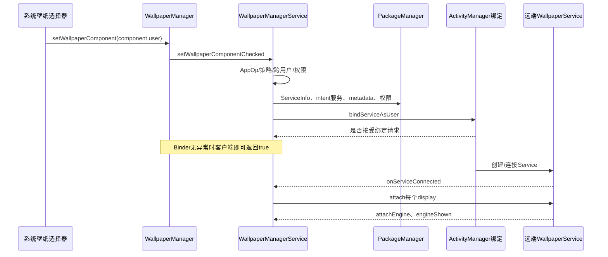
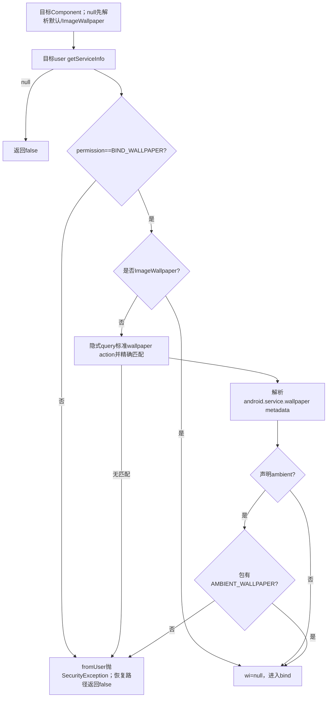
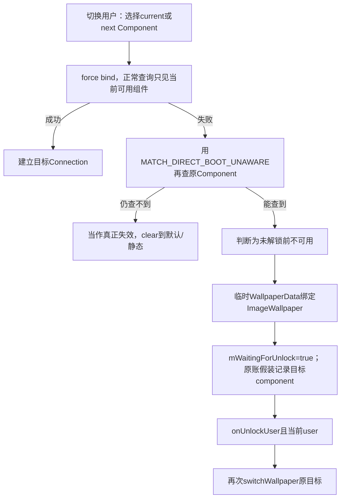

# 第 388 章 Android Wallpaper 动态组件：选择、权限、Metadata、Direct Boot、绑定与回调边界

> 源码基线：Android 11 / API 30 / `android-11.0.0_r48`。本章只在 macOS 阅读源码，不编译。上一章说明 XML 中的 component 只是“希望恢复谁”；本章继续追到 `bindWallpaperComponentLocked()`，区分组件合法、AMS接受bind、Service连接、Engine创建和首帧显示五个时点。

## 1. 动态壁纸不是直接启动Activity

它是声明了 `android.service.wallpaper.WallpaperService` action 的 Service。system_server以特殊绑定标志连接，远端Service再为一个或多个Display创建Engine和壁纸窗口。

## 2. 三个重要对象名

`ComponentName` 只是包名+类名；`WallpaperInfo` 是从manifest与 `android.service.wallpaper` XML metadata解析出的描述；`WallpaperConnection` 是一次实际绑定及其每display连接的运行账。

## 3. mImageWallpaper不是普通动态选择

静态图片也借WallpaperService/Engine显示，但 `mImageWallpaper` 是framework配置出的专用SystemUI组件，校验路径对它有特例，不构造WallpaperInfo。

## 4. 默认动态组件

`mDefaultWallpaperComponent` 可能来自系统属性 `ro.config.wallpaper_component`，否则来自可overlay的 `default_wallpaper_component` 资源；二者都没有时为null。

## 5. 默认组件只先验包存在

`WallpaperManager.getDefaultWallpaperComponent()` 只用PackageManager确认包能按Direct Boot aware/unaware任一方式找到，并没有在这里验证具体Service、权限和metadata。

## 6. 真正校验发生在bind

因此“默认组件非null”不等于可绑定。`bindWallpaperComponentLocked` 仍会查询ServiceInfo、BIND_WALLPAPER、intent匹配、metadata与ambient权限。

## 7. componentName为null的语义

null不是“清空并什么也不显示”，而是先尝试产品默认动态组件；产品没有默认时再使用ImageWallpaper。

## 8. XML省略component的语义不同

上一章的load会把缺失component直接归一化为 `mImageWallpaper`。只有运行期显式传null给bind，才会重新走产品默认选择。

## 9. API入口setWallpaperComponentChecked

WallpaperManager调用AIDL时传ComponentName、op package和userId。服务先做壁纸支持/AppOp与用户策略检查，通过后才进入真正组件设置。

## 10. 客户端方法的true很弱

r48客户端在AIDL调用正常返回后无条件 `return true`；服务端方法又返回void。策略拒绝造成的静默no-op或某些bind返回false，都可能让客户端仍看到true。

## 11. SET_WALLPAPER_COMPONENT权限

真正设置方法要求签名/特权级 `SET_WALLPAPER_COMPONENT`。普通应用一般通过系统壁纸选择器交互，而不是直接把任意Service设为当前壁纸。

## 12. 跨用户处理

`ActivityManager.handleIncomingUser(... full=true)` 约束目标user。修改其他用户还需完整跨用户授权，Component查询与bind都在最终目标user下进行。

## 13. callingPackage防伪

`isSetWallpaperAllowed` 用 `getPackagesForUid(callingUid)` 验证调用包属于UID。伪造包名返回false；Device/Profile Owner可获得策略例外。

## 14. 入口与成功点总图

## 15. managed profile支持门

`isWallpaperSupported` 实际检查 OP_WRITE_WALLPAPER。某些用户类型被AppOp禁用时，checked入口直接结束，不抛“不支持”的专用异常。

## 16. 用户限制门

非Device/Profile Owner通常受 `DISALLOW_SET_WALLPAPER` 控制。限制检查基于calling user，而目标user还要经过handleIncomingUser，两层概念不要混在一起。

## 17. WallpaperData必须已初始化

进入锁后从 `mWallpaperMap.get(userId)` 取system账；若没有就抛IllegalStateException。此入口不像getWallpaperSafeLocked那样懒创建。

## 18. 为什么只设置system

动态WallpaperService只作为system壁纸运行，不能建立独立keyguard Engine。因此初始which从FLAG_SYSTEM开始。

## 19. 从共享静态图切动态前的迁移

若当前运行组件是ImageWallpaper且没有独立lock账，旧静态system图也正被锁屏共享。服务先尝试把它迁到lock文件，让切换动态桌面后锁屏仍保留旧图。

## 20. 迁移失败不会必然阻止切换

上一章已经看到迁移由两次rename组成且无共同事务。这里调用后没有检查返回成功值，动态bind仍会继续。

## 21. which为何可能含LOCK

迁移后若lock Map仍为空，服务认为新动态壁纸同时也是锁屏的回退来源，于是颜色通知用SYSTEM|LOCK；并不表示创建了lock Engine。

## 22. Binder身份清除

进入核心切换前 `Binder.clearCallingIdentity()`，后续PackageManager、bindService等以system_server身份执行；入口权限校验必须在清身份前完成。

## 23. finally恢复身份

无论bind成功或抛异常都在finally恢复原Binder身份，避免system身份泄漏到同一Binder线程后续请求。

## 24. imageWallpaperPending被清除

选择动态组件前将静态图写入pending设false，避免旧FileObserver写协议继续被解释为当前选择动作。

## 25. changingToSame的前提

只有 `wallpaper.connection != null` 才可能判断“相同”。仅component字段相等但连接已丢失，不会短路，仍尝试重绑。

## 26. null与默认的相同判断

当前wallpaperComponent为null且新参数也null时视为仍使用默认；不过成功绑定后通常会把解析出的实际默认Component写入wallpaperComponent。

## 27. force参数

`force=false` 且changingToSame为true会直接返回true，不做PackageManager校验、不重新bind。user switch与故障恢复常传force=true以强制重建连接。

## 28. 同组件重新应用

外层发现same时不会清primaryColors，而是向现有每个Engine发送 `COMMAND_REAPPLY`。它是oneway式远程命令，RemoteException只记录。

## 29. 同组件也生成新ID

只要bind方法返回true，外层仍 `makeWallpaperIdLocked()`、通知callback和颜色。即使只是REAPPLY，外部也会观察到新wallpaperId。

## 30. 不同组件先清颜色

新动态服务尚未上报颜色，旧组件的primaryColors不能继续代表新画面，所以先置null，后续Engine request/onComputeColors再补。

## 31. 第一步查询ServiceInfo

使用目标user调用 `getServiceInfo(component, GET_META_DATA|GET_PERMISSIONS)`。返回null表示组件不存在、对查询不可见或此刻不可用，bind返回false。

## 32. Service必须声明BIND_WALLPAPER

`ServiceInfo.permission` 必须精确等于 `android.permission.BIND_WALLPAPER`。这是限制谁能绑定该Service的保护权限，不是给Service自身申请的普通能力。

## 33. 为什么不能只看action

任何应用都能在manifest声明相同action；若没有BIND_WALLPAPER保护，别的调用方也可能直接绑定并驱动它暴露的接口。

## 34. fromUser改变错误呈现

用户主动选择路径传 `fromUser=true`：权限错误抛SecurityException，metadata解析错误多转IllegalArgumentException。启动恢复传false时通常只记日志并返回false。

## 35. 组件不存在是一个例外

`si==null` 分支无论fromUser为何都直接返回false，不抛。外层set方法没有返回值把false传给客户端，因此客户端仍可能得到true。

## 36. 构造隐式Wallpaper intent

服务创建action为 `WallpaperService.SERVICE_INTERFACE` 的Intent，先查询目标user所有匹配Service，再精确寻找与ServiceInfo同包同类的一项。

## 37. query结果是第二重身份验证

即使按Component能取得ServiceInfo，也必须出现在标准WallpaperService action查询结果里，否则不能被视为可选择动态壁纸。

## 38. ImageWallpaper跳过WallpaperInfo解析

当component等于mImageWallpaper时不做隐式query与metadata构造，`wi=null`。内部组件由系统资源指定，并由后续Service权限检查保护。

## 39. 普通动态组件必须有metadata

`new WallpaperInfo(context, ResolveInfo)` 调用 `loadXmlMetaData(..., "android.service.wallpaper")`。缺少metadata会抛XmlPullParserException。

## 40. metadata根标签

解析器寻找第一个START_TAG，要求名称精确为 `wallpaper`。写成service、live-wallpaper或多包一层都会被拒绝。

## 41. metadata来自应用Resources

WallpaperInfo用目标Service应用的Resources解析styleable，资源引用按目标包解析，不按system_server资源ID空间直接解释。

## 42. settingsActivity

`settingsActivity` 只为预览/设置UI提供入口名称，不参与Service绑定授权。缺失不会使动态壁纸非法。

## 43. thumbnail、author、description

这些是选择器展示元数据，也不是运行所必需。资源不存在可能在加载展示时失败，不能把缩略图成功当绑定成功证明。

## 44. contextUri与说明

它们用于提供内容上下文链接/说明，仍属于描述层。system_server不会因为有URI就自动授予任意外部读取能力。

## 45. showMetadataInPreview

这是选择器表现标志，不改变Service权限、进程或Engine生命周期。

## 46. supportsMultipleDisplays

metadata布尔值决定普通动态组件是否声明支持多显示；不支持时主动态组件只接default display，其他合适display交给fallback ImageWallpaper。

## 47. ImageWallpaper默认支持多显示

`supportsMultiDisplay(connection)` 在 `mInfo==null` 时直接true，注释明确把这解释为image wallpaper。

## 48. metadata是声明不是能力探测

服务不会运行一段测试来证明组件真的正确处理多display。错误声明可导致远端收到多个attach并自己崩溃或显示异常。

## 49. supportsAmbientMode

若metadata声明支持ambient，服务还要求目标包获得 `AMBIENT_WALLPAPER`。仅写XML布尔值不能获得AOD/ambient能力。

## 50. 校验决策图

## 51. WallpaperInfo不验证Service继承关系

Java层无法可靠要求类一定直接extends WallpaperService；关键是manifest action、保护权限、metadata与运行时Binder协议。实现错误最终会在连接/接口阶段失败。

## 52. metadata解析异常分类

XmlPullParserException与IOException在用户选择路径包装成IllegalArgumentException；自动恢复路径记录warning并false。相同坏包在不同场景表现不同。

## 53. NameNotFound也归解析异常

WallpaperInfo内部无法取得目标应用Resources时把NameNotFoundException转XmlPullParserException，最终遵循上一节的fromUser分支。

## 54. 获取组件UID

绑定前用 `getPackageUid(package, MATCH_DIRECT_BOOT_AUTO, userId)`，保存为WallpaperConnection.mClientUid，后续用于判断某display对目标UID是否可访问。

## 55. UID不是从Binder调用者取

壁纸Service可能与选择器完全不同包/UID。display访问判断必须用Service包UID，而不是发起设置请求的系统UI UID。

## 56. 创建Connection时初始化display集合

支持多显示的ImageWallpaper/声明支持组件，会枚举可用display；普通单显示动态组件只预放default connector。

## 57. 可用display条件一

`display.hasAccess(mClientUid)` 必须为true。私有虚拟display不会因为壁纸是系统选中的就自动暴露给无访问权Service。

## 58. 可用display条件二

default display直接允许；非默认display还需WMS判断 `shouldShowSystemDecorOnDisplay`，因为没有系统装饰的display通常也不需要系统壁纸。

## 59. Binder身份再次清除

查询WMS非默认display策略时清除调用身份再恢复，保证检查以系统服务身份进行。

## 60. 绑定Intent变成显式

完成隐式query校验后 `intent.setComponent(componentName)`。真正bind不会被另一个同action Service抢走。

## 61. EXTRA_CLIENT_LABEL

绑定Intent携带系统字符串，用于系统对这个Service连接的用户可见说明，不是安全token。

## 62. EXTRA_CLIENT_INTENT

附带一个immutable PendingIntent，打开ACTION_SET_WALLPAPER chooser。远端Service拿到的是系统创建的受限能力，不是system_server完整Context。

## 63. PendingIntent面向目标user

使用 `getActivityAsUser(... new UserHandle(serviceUserId))`，避免从工作用户壁纸的客户端Intent错误跳到另一用户的选择器。

## 64. 四个bind flag

`BIND_AUTO_CREATE` 拉起Service；`BIND_SHOWING_UI` 表示与可见UI相关；`BIND_FOREGROUND_SERVICE_WHILE_AWAKE` 提升清醒时调度；`BIND_INCLUDE_CAPABILITIES` 传播合适能力。它们不等于Service成为普通前台服务通知。

## 65. bindServiceAsUser返回true代表什么

只代表系统接受这次绑定请求，并不代表目标进程已启动、`onServiceConnected` 已回调、Engine已attach或产生首帧。

## 66. bind返回false的用户路径

fromUser=true时转换成IllegalArgumentException。客户端WallpaperManager不吞该运行时异常，因此不会走无条件true。

## 67. bind返回false的恢复路径

fromUser=false时只日志并返回false，交给switchWallpaper决定清除还是Direct Boot临时fallback。

## 68. RemoteException边界

PackageManager Binder查询RemoteException在统一catch中处理：用户路径转IllegalArgumentException，恢复路径日志+false。bindService自身是本地Context API，不通过这个catch返回RemoteException。

## 69. 旧壁纸何时detach

新 `bindServiceAsUser` 已返回true后，如果是当前user且已有mLastWallpaper，立即detach旧Connection；它没有等新Service连接或EngineShown。

## 70. 可能出现显示空档

旧Engine已destroy/window token移除而新进程迟迟不连接时，短暂黑屏/默认背景是可能的。bind请求成功不是无缝切换事务。

## 71. 非当前用户不立即替换mLastWallpaper

可为其他用户准备账和连接，但mLastWallpaper代表当前显示用户；只有目标user==mCurrentUserId且不是fallback才更新。

## 72. 写入wallpaperComponent的时点

bind请求一旦被接受，就立刻把最终Component赋给WallpaperData并放入new Connection，不等onServiceConnected。

## 73. nextWallpaperComponent不会同步清空

该函数主要更新wallpaperComponent；next字段仍用于启动/恢复意图。阅读dump时两者可能相同或处于不同过渡状态。

## 74. reply保存在哪

user switch传入的IRemoteCallback放进 `newConn.mReply`。它不是bindService返回回调，而是等待壁纸引擎报告显示。

## 75. onServiceConnected仍需身份校验

回调进入后先检查 `mWallpaper.connection == this`。若期间已经换壁纸，旧Connection迟到的回调被忽略。

## 76. Service Binder转IWallpaperService

`Stub.asInterface(service)` 得到远端接口，随后 `attachServiceLocked` 遍历Connection的DisplayConnector发attach。

## 77. 连接成功才保存XML

非fallback在onServiceConnected中调用saveSettingsLocked。bind请求接受后、Service连接前崩溃，component可能只在内存改变而XML未更新。

## 78. 为什么注释仍说恢复优先

源码TODO提到也许可等Engine后再save，但选择连接时就保存，理由是即便Engine有问题仍需要能够恢复/诊断所选组件。

## 79. attach不是engine已创建

system_server调用IWallpaperService.attach，远端WallpaperService随后异步/跨Binder建立Engine，并通过Connection.attachEngine回报。

## 80. attach失败的初步回退

DisplayConnector.connectLocked捕获调用oneway接口时的Binder传输RemoteException；若还没有任何Engine、不是包更新中，会尝试bind默认组件。远端Wrapper随后抛出的实现异常不会沿oneway调用同步落入这个catch，也没有向最初用户返回结构化失败原因。

## 81. attachEngine带displayId

Connection验证/创建该display的connector；若display不再可用，会调用传入engine.destroy并结束，避免无合法窗口目标的Engine泄漏。

## 82. attachEngine不是首帧

它保存IWallpaperEngine、补发延迟的尺寸/padding、设置ambient并请求颜色。此时Surface可能还没真正绘出内容。

## 83. engineShown才发送reply

远端明确回调 `engineShown(engine)` 时，Connection才发送并清空mReply。这是用户切换等待链的“显示完成”信号，但payload仍为null，无画面质量信息。

## 84. reply不校验engine参数归属

r48的engineShown实现没有把传入engine与某个connector.mEngine比较；只要持有该Connection Binder并能调用，就可消耗一次reply。安全主要依赖绑定接口只交给受信Service进程。

## 85. reply只发送一次

发送后mReply=null；多display的后续EngineShown不会重复完成user switch。

## 86. detach也会提前完成旧reply

detach旧Connection时若mReply仍非null，会直接sendResult并清空，避免等待者永久卡在已经被替换的壁纸；这不表示旧Engine真的shown。

## 87. 初始bind缺少独立EngineShown超时

本路径没有为“bind已接受但永不连接/永不shown”建立与reply严格配套的成功超时。系统其他用户切换机制可能有总超时，但WallpaperConnection自身不把它转为失败结果。

## 88. save在Service连接、不是EngineShown

所以XML中component可表示“Binder Service曾连接”，并不保证Engine创建或首帧成功。重启会再次尝试它。

## 89. default与image的回退层次

显式/恢复目标失败后可调用null，让bind先选产品default；只有default不存在才选ImageWallpaper。某些clear路径传defaultFailed=true则明确强制ImageWallpaper，避免坏default循环。

## 90. Direct Boot流程图

## 91. switchWallpaper如何选目标

优先已有 `wallpaperComponent`，否则使用 `nextWallpaperComponent`。这让运行账存在时重绑当前组件，刚从XML加载时使用待恢复组件。

## 92. force=true的意义

用户切换必须为目标user新建实际Service连接，即使Component名与旧字段相同，所以强制绕过changingToSame。

## 93. 首次bind失败不立刻等于坏包

用户仍锁定时，credential-encrypted应用/非Direct-Boot-aware Service可能在普通查询和bind中不可用。switchWallpaper因此做第二次PackageManager探测。

## 94. 第二次查询只匹配unaware

使用 `MATCH_DIRECT_BOOT_UNAWARE` 查询同Component。查得到说明它存在，只是当前锁定阶段不可运行。

## 95. si仍为null时

认为不是单纯Direct Boot问题，调用 `clearWallpaperLocked(false, SYSTEM, user, reply)`，尝试产品默认而非一定强制ImageWallpaper。

## 96. unaware时为何修改wallpaperComponent

源码担心锁定期间有保存动作，所以把 `wallpaperComponent` 设为 `nextWallpaperComponent`，避免临时ImageWallpaper被持久化成永久选择。典型的“刚从XML加载”场景里next就是原目标；若current与next本来分叉，这次赋值未必等于前面实际尝试的 `cname`，是额外状态边界。

## 97. 临时fallback是独立WallpaperData

它指向lock原图/crop文件名，但不放入常规system Map作为用户永久账；随后强制绑定mImageWallpaper，只承担解锁前显示。

## 98. 这里的fallback与多屏fallback要区分

二者都可能绑定ImageWallpaper，但Direct Boot临时对象用于锁定用户的桌面过渡；`mFallbackWallpaper` 是长期为不支持多显示的动态组件填其他display。

## 99. mWaitingForUnlock是服务级boolean

r48不是per-user Map。它与mCurrentUserId联合使用；快速多用户切换时必须按具体赋值/切换顺序分析，不能认为每个用户独立记等待。

## 100. 每次switch先清false

`switchWallpaper` 开头 `mWaitingForUnlock=false`，只有识别到unaware fallback才再次置true，防旧用户等待状态无条件带到新切换。

## 101. 解锁回调只处理当前user

`onUnlockUser` 要求 `mCurrentUserId==userId` 且waiting为true才重新switch。后台用户解锁不会抢占当前屏幕壁纸。

## 102. 解锁重试后通知

再次switch后调用 `notifyCallbacksLocked(systemWallpaper)`。即使内部回退路径已做部分通知，也要理解可能出现多次变化信号。

## 103. SELinux重标记是另一件事

onUnlockUser还异步restorecon各壁纸文件，这是修复文件label，不等于动态Service权限或Direct Boot校验。

## 104. 用户主动路径不会用Direct Boot临时判断

setWallpaperComponent直接调用bind fromUser=true；失败按异常/false处理。完整Direct Boot fallback逻辑位于switchWallpaper的启动/切用户恢复路径。

## 105. set成功后的通知时点

bind请求被接受后外层立刻生成ID并notifyCallbacks，不等Service连接/EngineShown。观察者可能先收到“壁纸变化”，屏幕仍在切换中。

## 106. 颜色通知在锁外

shouldNotifyColors为true后退出mLock，再通知system以及fallback颜色，避免在核心锁内完成潜在提取/回调链。

## 107. same时COMMAND_REAPPLY并非ACK

dispatchWallpaperCommand异常被记录，但仍生成新ID和通知。它不返回远端是否真正重载内容的成功值。

## 108. XML何时记录不同组件

通常onServiceConnected保存；若Service永不连接，内存component和对外ID可已变化而XML仍旧。反之连接后Engine失败，XML仍会是新组件。

## 109. 诊断“API返回true但没切换”

依次查策略门是否静默return、ServiceInfo是否null导致false、bind是否接受、onServiceConnected是否到达、attachEngine/engineShown是否到达，而不是把客户端true当终点。

## 110. 诊断“重启前后组件不同”

对比内存wallpaperComponent/next、wallpaper_info.xml component、onServiceConnected保存日志与ImageWallpaper省略规则。内存切换早于XML提交是核心时间窗。

## 111. 本章只读练习说明

下面恰好四个练习只用macOS文本工具阅读源码，不启动模拟器、不编译。每项都必须分别写出“权限成功、bind请求成功、Service连接、EngineShown”四列结果。

## 112. macOS只读练习一：追客户端true

运行 `sed -n '1760,1802p' frameworks/base/core/java/android/app/WallpaperManager.java` 与 `sed -n '2528,2595p' frameworks/base/services/core/java/com/android/server/wallpaper/WallpaperManagerService.java`，找出策略静默return、bind false和客户端无条件true的组合。

## 113. macOS只读练习二：审一份manifest

运行 `sed -n '2634,2738p' frameworks/base/services/core/java/com/android/server/wallpaper/WallpaperManagerService.java` 与 `sed -n '94,158p' frameworks/base/core/java/android/app/WallpaperInfo.java`，列出action、BIND_WALLPAPER、metadata根标签和ambient额外权限。

## 114. macOS只读练习三：画异步成功线

运行 `sed -n '2738,2780p;1268,1290p;1420,1470p' frameworks/base/services/core/java/com/android/server/wallpaper/WallpaperManagerService.java`，标出bind返回true、旧连接detach、保存XML、attachEngine和reply五个不同时间点。

## 115. macOS只读练习四：推演锁定用户

运行 `sed -n '1878,1910p;1793,1808p' frameworks/base/services/core/java/com/android/server/wallpaper/WallpaperManagerService.java`，分别推演aware、unaware、已卸载三种组件，并解释临时WallpaperData为何不能写成用户已改选ImageWallpaper。

## 116. 易错结论一：有BIND_WALLPAPER就合法

错误。还必须按标准action被查询到、metadata可解析；声明ambient还要AMBIENT_WALLPAPER，具体user和Direct Boot状态也必须可用。

## 117. 易错结论二：bindService返回true就是显示成功

错误。它只接受绑定请求；Service连接、attach、Engine创建和EngineShown都在后面，旧壁纸却可能已经detach。

## 118. 易错结论三：动态壁纸有独立lock Engine

错误。动态组件运行于system账；无独立lock静态图时锁屏复用其结果，独立kwp仍是静态账。

## 119. 本章复读后的修正

复读后重点修正四处：默认组件只先验包存在；ImageWallpaper仍要ServiceInfo与BIND_WALLPAPER但跳过WallpaperInfo；组件字段在bind请求接受后就更新而XML到onServiceConnected才保存；Direct Boot临时ImageWallpaper与长期多屏fallback不是同一个WallpaperData。

## 120. 本章结论与下一章入口

动态选择是一条分段承诺链：权限/metadata只证明候选合法，bind true只证明请求被接纳，onServiceConnected才保存组件，attachEngine建立控制面，engineShown才完成显示等待。下一章进入WallpaperService和Engine内部，追主线程Wrapper、Engine创建销毁、窗口Token、SurfaceHolder、可见性与首帧报告。
