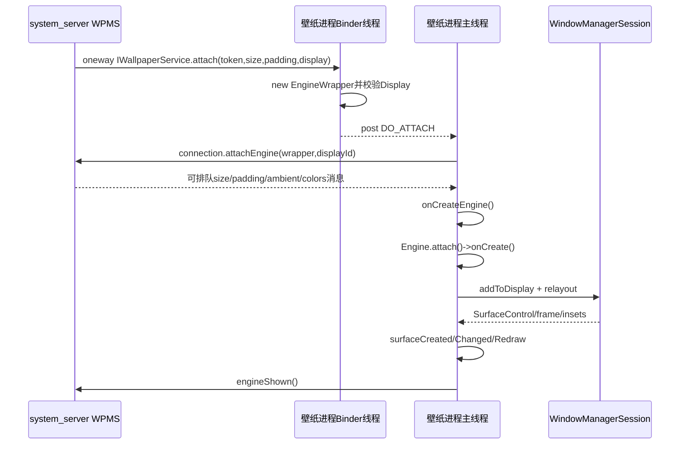
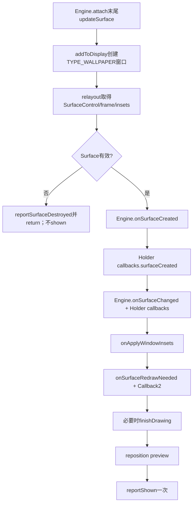
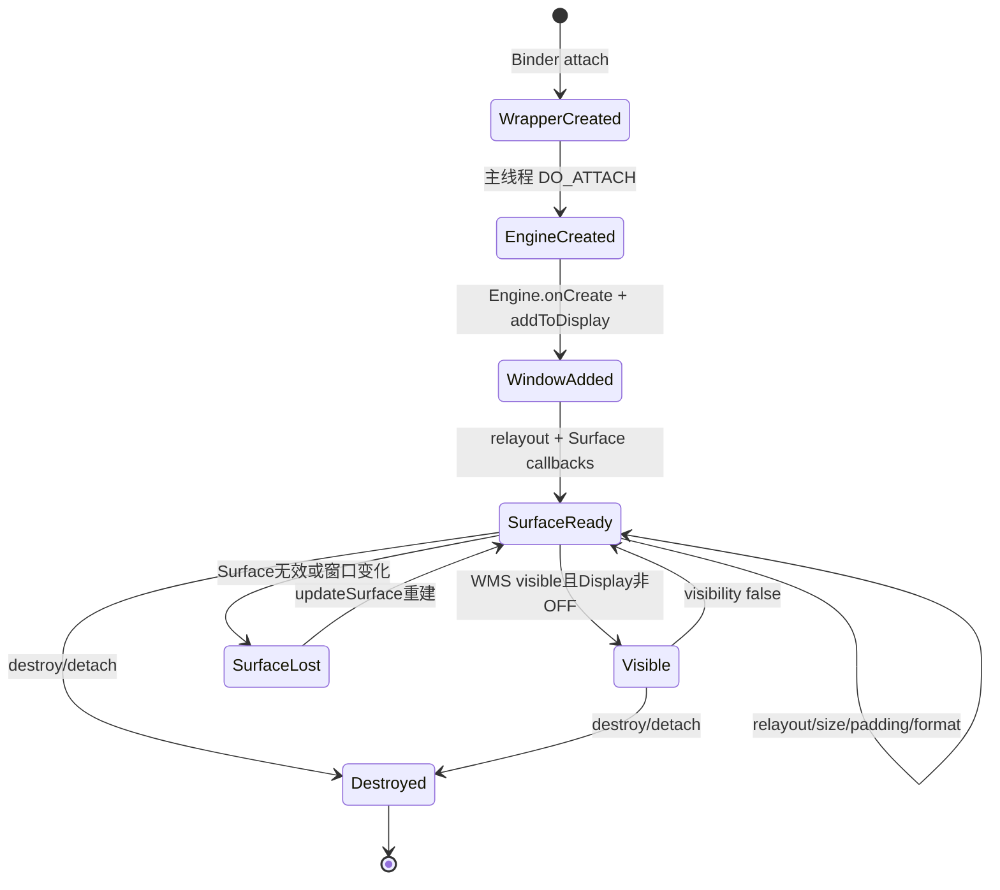

# 第 389 章 Android WallpaperService/Engine：主线程、窗口、Surface、可见性与首帧生命周期

> 源码基线：Android 11 / API 30 / `android-11.0.0_r48`。本章只在 macOS 阅读源码，不编译。上一章停在system_server调用 `IWallpaperService.attach()`；本章进入壁纸应用进程，追Binder Wrapper如何切回主线程、Engine如何向WMS添加TYPE_WALLPAPER窗口、取得Surface并报告shown。

## 1. WallpaperService运行在哪

第三方动态壁纸运行在提供它的应用进程；ImageWallpaper运行在SystemUI进程。`WallpaperManagerService` 与WMS仍在system_server，双方靠IWallpaperService/IWallpaperEngine/IWallpaperConnection Binder接口交互。

## 2. Service只是Engine工厂

开发者继承WallpaperService，最关键的方法是 `onCreateEngine()`。真实绘制、可见性、Surface与输入状态都属于每个Engine实例。

## 3. 一个Service可有多个Engine

当前壁纸、选择器preview和多display可同时创建实例。把纹理、线程或计时器写成“全Service仅一份”时必须自行处理Engine间共享与释放。

## 4. onBind不可由子类覆盖

WallpaperService的final `onBind()` 返回内部 `IWallpaperServiceWrapper`。应用实现只提供Engine，不自行设计对system_server暴露的Binder协议。

## 5. 两层Wrapper

IWallpaperServiceWrapper代表Service级attach入口；每次attach创建IWallpaperEngineWrapper，后者既是system_server持有的IWallpaperEngine Binder，也是本地Engine的消息代理。

## 6. attach最初在Binder线程

system_server通过 `oneway IWallpaperService.attach` 发起跨进程调用，目标应用Binder线程稍后执行。Wrapper构造不会直接调用开发者onCreateEngine，而是向主Looper投递DO_ATTACH；远端实现异常也不会作为同步reply回到system_server。

## 7. HandlerCaller绑定主Looper

构造使用 `new HandlerCaller(context, context.getMainLooper(), this, true)`。绝大多数生命周期回调最终在WallpaperService进程主线程执行。

## 8. 构造阶段先取Display

IWallpaperEngineWrapper在投消息前通过DisplayManager按displayId取Display；找不到就抛IllegalArgumentException，此次attach无法进入Engine创建。由于外层attach是oneway，这个异常发生在壁纸进程Binder分发侧，宿主不会从原调用同步拿到它。

## 9. Display Context准备顺序

源码注释说要在onCreateEngine前创建display上下文；Wrapper先保存Display，Engine.attach稍后再用它创建真正 `createDisplayContext(mDisplay)` 的Context。

## 10. DO_ATTACH消息的第一步

主线程executeMessage先调用 `mConnection.attachEngine(this, displayId)` 向system_server登记IWallpaperEngine，而不是先创建本地Engine。

## 11. 为什么先回报Wrapper

system_server可尽早把Engine Binder放到DisplayConnector，并把此前积累的desired size、padding、ambient与颜色请求发回Wrapper消息队列。

## 12. 这些回调不会插入当前栈

回发的setDesiredSize/requestColors等通常又投到同一主Looper；它们排在正在执行的DO_ATTACH之后，等onCreateEngine和engine.attach完成后再处理。

## 13. attachEngine远程失败

若system_server Connection已死亡，catch RemoteException后直接return，不调用onCreateEngine，也不加入mActiveEngines。

## 14. 跨进程与线程时序图

## 15. onCreateEngine必须返回新对象

每次调用应返回适配该实例的新Engine。r48没有null检查；返回null后加入列表并调用 `engine.attach` 会在主线程空指针崩溃。

## 16. mActiveEngines的意义

Service记录所有已创建Engine，供onDestroy统一detach和dumpsys输出。它是进程内运行列表，不是system_server持久账。

## 17. Engine.attach复制哪些桥接对象

从Wrapper复制HandlerCaller、IWallpaperConnection、windowToken，并保留Wrapper本身以读取请求尺寸、padding、preview和display字段。

## 18. WindowSession

Engine通过 `WindowManagerGlobal.getWindowSession()` 获得IWindowSession，与普通ViewRootImpl一样最终调用WMS，但不创建Activity或DecorView。

## 19. mWindow是什么

Engine内部有IWindow实现接收WMS的resize、offset、command和pointer等回调。它是壁纸窗口客户端端点，不等于应用View树。

## 20. windowToken从哪里来

system_server的DisplayConnector先调用WMS `addWindowToken(token, TYPE_WALLPAPER, displayId)`，再把同一token传给WallpaperService.attach。

## 21. Token不是应用随意生成的权限

Engine只使用宿主分配的token向WMS addToDisplay。普通应用拿随机Binder无法合法添加TYPE_WALLPAPER窗口。

## 22. onCreate发生在窗口添加前

Engine.attach准备session、display/context后先调用开发者 `onCreate(surfaceHolder)`，之后才updateSurface创建窗口。onCreate里可配置Holder格式、触摸或offset选项。

## 23. onCreate不是SurfaceCreated

此时Surface还没通过relayout取得。真正开始Canvas/GL绘制应等待onSurfaceCreated/onSurfaceChanged，不能在onCreate假定Surface有效。

## 24. mInitializing边界

调用onCreate期间mInitializing=true，返回后false。framework内部可据此区分初始化设置与运行时修改。

## 25. 首次updateSurface

attach末尾把mReportedVisible=false并调用 `updateSurface(false,false,false)`。即使WMS还没报告visible，也要先建立窗口与可绘制Surface。

## 26. updateSurface的触发条件

创建窗口/Surface、格式/尺寸/type/flag改变、强制relayout、redrawNeeded或尚未reportShown都会进入更新块。

## 27. destroyed检查存在缺口

方法发现mDestroyed只打印“Ignoring updateSurface: destroyed”，r48这里没有紧接着return。正常消息门会避免多数调用，但迟到/直接调用仍可能继续执行后续逻辑。

## 28. 默认尺寸来自layout

Holder requested width/height<=0时使用MATCH_PARENT；设置正固定尺寸会走fixedSize路径，但普通壁纸默认不允许调用setFixedSize。

## 29. fixedSizeAllowed是隐藏能力

`setFixedSizeAllowed` 属隐藏/兼容用途。公开动态壁纸不能依赖固定Surface尺寸完成一般动画设计。

## 30. 默认像素格式

BaseSurfaceHolder初始化requestedFormat为 `PixelFormat.RGBX_8888`。开发者可在onCreate中用Holder改格式，随后formatChanged触发relayout。

## 31. 默认不可触摸

`mWindowFlags` 初始含FLAG_NOT_TOUCHABLE。调用 `setTouchEventsEnabled(true)` 才移除此flag，并在窗口已创建时updateSurface。

## 32. 仍然不可聚焦

updateSurface固定再加FLAG_NOT_FOCUSABLE。动态壁纸即便收触摸也不是输入焦点窗口，事件由Wallpaper专用路由而来。

## 33. 其他窗口flag

还加LAYOUT_NO_LIMITS、LAYOUT_INSET_DECOR和LAYOUT_IN_SCREEN，让壁纸覆盖系统背景范围并由WMS管理insets。

## 34. offset通知默认开启

private flag初始含WANTS_OFFSET_NOTIFICATIONS。静态ImageWallpaper可关闭以节省开销；普通动态壁纸不需要滚动效果也应主动关闭。

## 35. LayoutParams的type

来自Wrapper传入的windowType，正常由system_server给TYPE_WALLPAPER。应用不能通过Engine回调任意换成更高权限窗口类型。

## 36. 窗口标题

title设为WallpaperService类名，主要用于诊断，不作为身份授权依据。

## 37. addToDisplay

首次创建调用IWindowSession.addToDisplay，传mWindow、LayoutParams、目标display与InputChannel，并接收frame、insets、cutout等结果。

## 38. add失败的行为

返回值<0时日志并return，不置mCreated、不进入Surface回调，也不reportShown；等待reply可能只能依靠外部超时/后续回退。

## 39. InputChannel

add成功后用当前Looper创建WallpaperInputEventReceiver。只有启用触摸并由WMS路由的事件才会到Engine.onTouchEvent。

## 40. shouldZoomOutWallpaper

窗口创建后把Engine的返回值告诉WindowSession，决定系统是否默认做壁纸缩放深度效果；false时可自行处理onZoomChanged。

## 41. Surface锁

relayout前获取 `mSurfaceHolder.mSurfaceLock` 并置mDrawingAllowed=true，用来协调Surface替换与Canvas绘制。

## 42. 锁释放并非finally保护

r48在正常relayout与尺寸计算后显式unlock；若IWindowSession.relayout在持锁期间抛RemoteException，外层catch会吞异常但没有对应finally unlock，后续绘制可能卡在该锁。

## 43. padding怎样作用

非fixedSize时把display padding放入LayoutParams.surfaceInsets；WMS frame出来后又把四边加到Surface宽高并调整content/stable insets和cutout。

## 44. fixedSize为何不加padding

固定Surface尺寸由调用者明确指定，代码把surfaceInsets清零并直接使用myWidth/myHeight，避免再扩张。

## 45. relayout返回什么

WMS返回窗口frame、各类insets、DisplayCutout、MergedConfiguration、SurfaceControl和Surface尺寸等；这一步把窗口布局与可生产buffer的Surface连接起来。

## 46. Surface.copyFrom

仅当返回的mSurfaceControl有效时，把其底层Surface复制到SurfaceHolder.mSurface。Holder随后才向开发者暴露实际绘制目标。

## 47. Surface无效

调用reportSurfaceDestroyed后直接return，不进入本轮surface callbacks的finally，也不会reportShown。

## 48. mCreated与mSurfaceCreated不同

mCreated表示IWindow已成功加入WMS；mSurfaceCreated表示开发者Surface生命周期已报告。窗口可以存在但当前Surface无效。

## 49. callback收集方式

framework先调用Engine override，再遍历通过SurfaceHolder注册的Callback。二者都在壁纸主线程串行执行。

## 50. 首次Surface回调图

## 51. onSurfaceCreated职责

适合创建EGL context/renderer或标记Canvas资源可用；它不保证尺寸已经是最终值，所以通常还要在onSurfaceChanged更新viewport。

## 52. onSurfaceChanged参数

传当前format和按frame/padding计算后的mCurWidth/mCurHeight。它们是Surface尺寸，不是上一章XML的desired minimum size。

## 53. 回调可能多次发生

display旋转、padding、格式、固定尺寸、Surface重建都可再次触发Changed；Created/Destroyed也可能成对多次出现，代码不能只按一次初始化编写。

## 54. Insets回调

content/stable/cutout变化时构造WindowInsets调用onApplyWindowInsets。壁纸可据此避开圆屏/切口，但画满背景与放置关键内容是两种需求。

## 55. RedrawNeeded

首次创建或WMS返回FIRST_TIME会置redrawNeeded，调用onSurfaceRedrawNeeded及Callback2。这里应同步完成WMS等待的重绘工作。

## 56. finishDrawing

redrawNeeded时finally调用 `mSession.finishDrawing(mWindow,null)`，告诉WMS这轮绘制阶段完成。默认回调为空也会完成协议。

## 57. finishDrawing不验证buffer

framework没有检查开发者是否真的lockCanvas/post或eglSwapBuffers。协议完成与屏幕已有正确像素仍是两个概念。

## 58. reportShown的时点

同一finally最后执行 `mIWallpaperEngine.reportShown()`，Wrapper再调用system_server Connection.engineShown。

## 59. shown只报告一次

Wrapper用mShownReported布尔值保护；后续relayout或Surface重建不会再次向宿主engineShown。

## 60. shown也不是首帧证明

它发生在Surface回调返回后，却没有读取BufferQueue是否已有新buffer。空实现、异步线程稍后绘制甚至callback异常的finally都可能先报告shown。

## 61. callback抛RuntimeException

Surface回调位于try/finally而非catch RuntimeException；finally仍置mSurfaceCreated、可能finishDrawing并reportShown，随后异常可逃到主线程并导致壁纸进程崩溃。

## 62. mSurfaceCreated赋值也在finally

因此回调中途失败后对象仍可能标成Surface已创建，直到崩溃/重连清理；不能把此布尔值当“所有初始化成功”。

## 63. 初始不可见时的true/false抖动

若本轮确有Surface回调且mReportedVisible=false，创建Surface时源码可能先调用onVisibilityChanged(true)，紧接着调用false，强迫忽略重复false的旧壁纸真正停下。

## 64. 为什么先true再false

有些实现收到过false后会忽略下一次相同false；Surface创建回调却可能启动渲染。临时true/false让它明确观察一次状态边沿并停止。

## 65. onVisibilityChanged必须幂等

开发者不能假定true一定代表用户已经看见，也不能假定false只出现一次。应按最终状态启动/停止动画，并允许初始化抖动。

## 66. WMS可见请求

IWallpaperEngineWrapper.setVisibility只向主Looper投MSG_VISIBILITY_CHANGED；Engine.doVisibilityChanged保存requested mVisible，再调用reportVisibility计算最终值。

## 67. Display OFF会压成不可见

最终visible为 `mVisible && displayState != STATE_OFF`。WMS仍希望visible但屏幕关闭时，Engine收到/保持reported false以节省CPU。

## 68. DisplayListener

Engine注册目标display监听，display state变化时重新reportVisibility；屏幕亮起可在不重新bind的情况下恢复true。

## 69. 变为visible的顺序

先把mReportedVisible设true，再补offset，强制updateSurface确保preview等丢失Surface的场景重建，最后调用开发者onVisibilityChanged(true)。

## 70. updateSurface回调期间已reported true

因此visible路径重建Surface时不会执行前述“创建时true/false抖动”；Surface callback可以查询isVisible得到true。

## 71. 变为false不主动销毁Surface

一般只回调onVisibilityChanged(false)，Surface仍保留以便快速恢复。preview或WMS其他事件才可能导致Surface重建/销毁。

## 72. CPU使用契约

API注释特别要求壁纸仅在visible时耗CPU。即便Surface仍有效，动画ticker、传感器和后台渲染都应在false停止。

## 73. isVisible返回reported值

它不是原始mVisible，也不是“SurfaceFlinger此刻一定合成”。Display OFF等条件已纳入，但遮挡、过渡和buffer状态仍可能更复杂。

## 74. desired size变化

system_server调用setDesiredSize后投主线程，更新Wrapper请求宽高，调用onDesiredSizeChanged，并强制重新计算offset；不一定直接重建Surface尺寸。

## 75. display padding变化

不同值才更新Wrapper Rect并force relayout。该调用可能触发Surface尺寸、Insets和Changed回调。

## 76. 延迟状态补发

如果system_server在Service已连接但Engine尚未attach时改变尺寸/padding，DisplayConnector用布尔标记；attachEngine后ensureStatusHandled再发给Wrapper。

## 77. offset消息会合并

Engine在锁内保存最新pending offset，并用mOffsetMessageEnqueued避免每个滚动采样都排消息；消费时读取最新值并清标记。

## 78. 不可见时offset延后

Surface存在但mReportedVisible=false时不调用开发者onOffsetsChanged，而把mOffsetsChanged留true，下一次visible再补。

## 79. pixel offset计算

用desiredWidth-currentSurfaceWidth乘归一化offset得到负像素偏移；若desired不大于Surface则像素偏移为0。

## 80. sync offset完成

WMS要求同步时，处理末尾调用 `wallpaperOffsetsComplete(windowBinder)`。即使Engine已destroy或不可见没有执行业务回调，也会尽量完成协议。

## 81. 触摸MOVE合并

dispatchPointer把最新ACTION_MOVE放mPendingMove；主线程处理旧MOVE时若已不是最新则skip并recycle，降低队列积压。

## 82. 非触摸MotionEvent直接回收

`event.isTouchEvent()` 为false时不投给onTouchEvent。Wallpaper专用输入链不是通用鼠标/键盘焦点分发替代品。

## 83. command同步完成

onCommand返回Bundle；若cmd.sync，Engine调用WindowSession.wallpaperCommandComplete。destroyed时结果null但仍完成，避免WMS等待。

## 84. Wrapper部分方法先看mEngine

dispatchPointer/dispatchWallpaperCommand在Engine未创建时丢弃或回收；其他方法直接排消息，依赖DO_ATTACH先到队列。

## 85. onComputeColors线程

requestWallpaperColors被投到主Looper，执行Engine.onComputeColors，再通过IWallpaperConnection回system_server。耗时计算会阻塞壁纸主线程。

## 86. notifyColorsChanged节流

Engine主动通知有1秒限频；过快会安排延迟Runnable而不是每次立即计算。本章只定位生命周期，颜色细节在后章展开。

## 87. ambient消息

setInAmbientMode投主线程，更新mIsInAmbientMode并调用onAmbientModeChanged；只有上一章通过metadata与权限的组件会被system_server当支持者使用。

## 88. preview标志

Wrapper保存isPreview，Engine.isPreview读取它。Preview有独立token/Engine/Surface，不应修改当前壁纸的持久业务状态。

## 89. preview缩放

scalePreview只在preview且初始position为空等条件下记录位置，用SurfaceControl.Transaction调整position/matrix；它不重新编码壁纸图片。

## 90. 生命周期状态图

## 91. system_server的destroy与Service detach

旧连接拆除时先可调用Service级detach，再对每DisplayConnector的IWallpaperEngine.destroy。后者向各Wrapper投DO_DETACH，最终逐个Engine清理。

## 92. Service Wrapper只保存一个字段

`IWallpaperServiceWrapper.mEngineWrapper` 每次attach都会覆盖为最新Wrapper。多display下Service级detach只对最后一次字段set detached；各Engine的destroy消息仍是完整清理的重要路径。

## 93. AtomicBoolean detached

Service级detach可来自Binder线程，用AtomicBoolean让主线程executeMessage安全观察。如果DO_ATTACH尚未执行，消息到达时直接返回，不创建Engine。

## 94. DO_DETACH清单

`doDetachEngine` 从mActiveEngines移除并调用Engine.detach。正常顺序要求mEngine已建立；边界消息时序依靠主Looper FIFO与detached门。

## 95. Engine.detach先置destroyed

重复调用立即return，确保资源释放大体幂等。之后注销DisplayListener，停止可见状态，报告SurfaceDestroyed，调用onDestroy，再移除窗口。

## 96. detach可见性用mVisible

源码判断的是原始requested mVisible，不是mReportedVisible。若display OFF曾把reported压成false而mVisible仍true，detach可能再次调用onVisibilityChanged(false)。

## 97. Surface销毁回调顺序

先遍历Holder callbacks的surfaceDestroyed，再调用Engine.onSurfaceDestroyed；这与创建时“Engine override先、Holder callbacks后”的顺序相反。

## 98. onDestroy在窗口remove前

Engine先收到onDestroy，随后才IWindowSession.remove和Surface.release。开发者仍应在onDestroy前后的规定回调中主动停线程/释放GL，而不依赖进程死亡。

## 99. InputReceiver释放

窗口存在时先dispose WallpaperInputEventReceiver，再remove窗口，避免清理后继续向已毁Engine投输入。

## 100. Surface release

remove后释放Holder中的Surface并置mCreated=false。mDrawingAllowed字段没有在该路径重置false，真正可画性仍要结合destroyed与Surface有效性判断。

## 101. Service.onDestroy兜底

Service进程组件销毁时遍历mActiveEngines直接detach，然后clear列表。它是异常/解绑路径的最后清理，不能替代每Engine正确处理回调。

## 102. 遍历期间为何不由Engine移列表

Service.onDestroy直接Engine.detach，不走Wrapper.doDetachEngine，所以列表大小不会在for中改变，最后统一clear。

## 103. 主线程卡顿影响整条链

onCreateEngine、onCreate、Surface callbacks、visibility、offset、command和颜色大多串行在主Looper；任一耗时会推迟EngineShown、WMS draw完成及其他Engine事件。

## 104. 绘制线程可以自建

复杂GL渲染可使用专用线程，但Surface生命周期和可见性状态仍从主线程驱动，必须建立线程安全的启动/暂停/销毁协议。

## 105. Canvas基本安全模型

只在Surface有效生命周期内lockCanvas，使用try/finally确保unlockCanvasAndPost；SurfaceDestroyed/onDestroy要阻止旧线程再次使用已release对象。

## 106. GL基本安全模型

onSurfaceCreated建立或绑定EGL资源，Changed更新viewport，Redraw同步产出等待帧，Destroyed解绑/销毁surface；context是否跨Surface保留由实现自行决定。

## 107. 诊断“onCreate有但无SurfaceCreated”

查addToDisplay返回、window token/display有效性、relayout RemoteException、SurfaceControl有效性与主线程异常，不要只怀疑绘制代码。

## 108. 诊断“engineShown但仍黑”

核对onSurfaceRedrawNeeded是否真正post buffer、异步绘制是否晚于reportShown、Canvas/eglSwap错误与SurfaceFlinger层；shown只表示framework生命周期走完。

## 109. 诊断“隐藏后仍耗电”

记录mVisible、mReportedVisible与display state，检查onVisibilityChanged(false)是否真正停动画、传感器和Handler Runnable，以及初始化Surface的true/false抖动是否被错误处理。

## 110. 诊断销毁后崩溃

查渲染线程是否仍持Surface、延迟Runnable是否取消、updateSurface的destroyed分支无return，以及重复false/SurfaceDestroyed/onDestroy是否做到幂等。

## 111. 本章只读练习说明

下面恰好四个练习都只在macOS读r48源码，不编译。每个练习要画出“Binder线程、壁纸主线程、system_server Binder线程、WMS”四列时序。

## 112. macOS只读练习一：追DO_ATTACH

运行 `sed -n '1378,1530p' frameworks/base/core/java/android/service/wallpaper/WallpaperService.java`，标出Display查询、post消息、attachEngine、onCreateEngine、active list和Engine.attach的准确顺序。

## 113. macOS只读练习二：拆updateSurface

运行 `sed -n '824,1082p' frameworks/base/core/java/android/service/wallpaper/WallpaperService.java`，列出addToDisplay、Surface锁、relayout、四类回调、finishDrawing和reportShown，并找出RemoteException时Surface锁缺少finally的边界。

## 114. macOS只读练习三：推演可见性

运行 `sed -n '1212,1265p' frameworks/base/core/java/android/service/wallpaper/WallpaperService.java`，分别推演WMS visible=true但Display OFF、初始不可见Surface创建、重新亮屏三种状态。

## 115. macOS只读练习四：核对销毁顺序

运行 `sed -n '1300,1360p;1485,1528p;1609,1648p' frameworks/base/core/java/android/service/wallpaper/WallpaperService.java`，比较Service detach、Engine destroy、SurfaceDestroyed、onDestroy、remove window和Surface release。

## 116. 易错结论一：onCreateEngine运行在Binder线程

错误。Binder attach只创建Wrapper并投DO_ATTACH；开发者工厂和Engine生命周期在Service主Looper执行。

## 117. 易错结论二：Engine attach就能Canvas绘制

错误。onCreate之后还要addToDisplay、relayout并拿到有效Surface；应等待Surface callbacks。

## 118. 易错结论三：engineShown证明首帧上屏

错误。它在回调finally中报告，没有验证应用post了buffer；异常回调甚至可能先shown再让进程崩溃。

## 119. 本章复读后的修正

复读后补正四处关键细节：Connection.attachEngine早于onCreateEngine；Surface创建时不可见可能收到true/false抖动；destroyed的updateSurface只日志不return；多display的Service Wrapper只记最后EngineWrapper，完整清理由每Engine.destroy消息保证。

## 120. 本章结论与下一章入口

Wallpaper Engine是一套主线程驱动的窗口客户端：宿主token授权addToDisplay，relayout交付Surface，生命周期回调让应用产帧，finishDrawing/engineShown完成协议但不验证像素。下一章回到WMS一侧，精读WallpaperWindowToken、壁纸目标选择、可见性、offset同步、command与窗口层级如何驱动本章这些消息。
