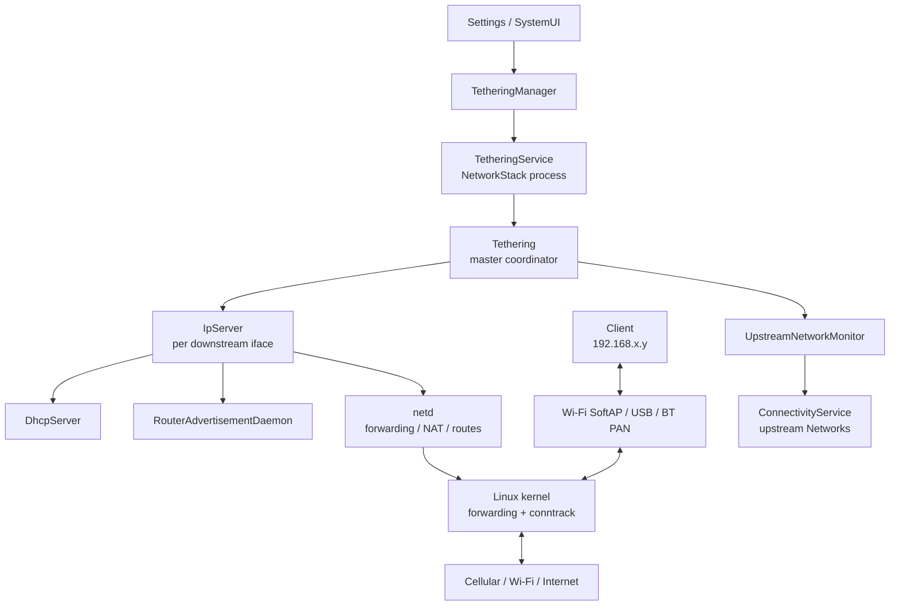
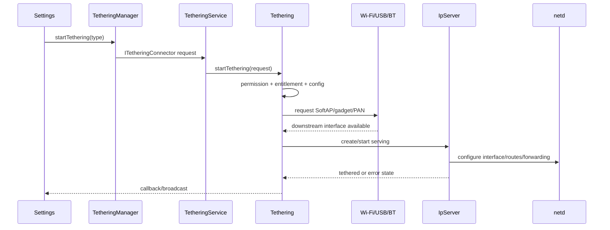
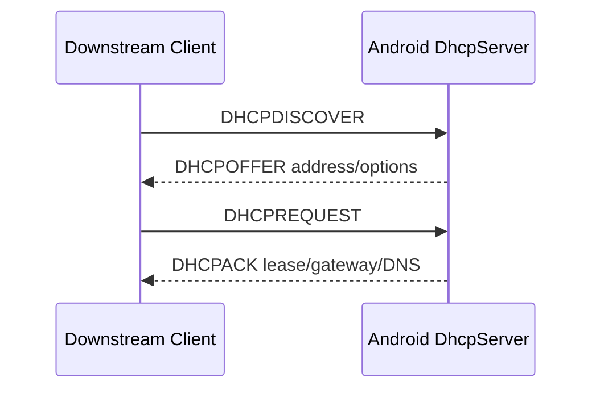
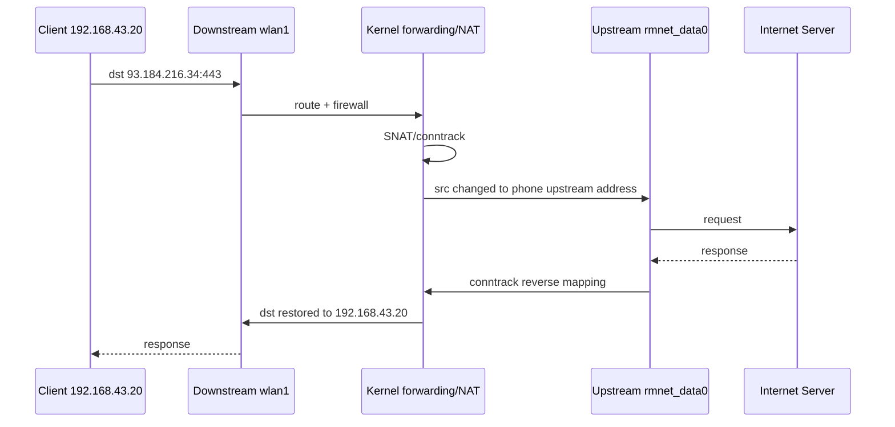

# 39 Android 网络共享、Tethering、IpServer 与 NAT

> 源码版本：Android 11 / API 30 / `android-11.0.0_r48`  
> 学习方式：macOS 只读源码，不要求编译  
> 前置章节：[24 网络栈](./24-Android网络栈ConnectivityService与NetworkAgent.md)、[37 Wi-Fi](./37-AndroidWiFi系统WifiService与ClientModeImpl.md)、[38 VPN](./38-AndroidVPN系统VpnServiceTUN与网络路由.md)

开启手机热点后，手机同时扮演两个角色：面向 Wi-Fi、USB 或蓝牙客户端，它是提供地址、网关和 DNS 能力的“小路由器”；面向蜂窝或另一张 Wi-Fi，它又是普通上网终端。本章把“热点已打开”拆成接口可用、下游配网、上游选定、转发/NAT 建立和端到端可达五个完成点。

---

## 1. 先分清上游和下游

| 方向 | 例子 | 手机的角色 |
|---|---|---|
| downstream 下游 | 热点 `wlan1`、USB `rndis0`、Bluetooth PAN | 网关、DHCP server、IPv6 router |
| upstream 上游 | 蜂窝 `rmnet_data0`、Wi-Fi `wlan0` | 普通网络客户端 |

下游接口“已启动”不等于已有上游；没有上游时，客户端仍可能连上热点、拿到地址并访问手机局域网，但不能访问互联网。

---

## 2. 总体架构



`Tethering` 负责全局协调；`IpServer` 负责一个具体下游接口。不要把它们都笼统叫成“热点服务”。

---

## 3. Android 11 核心源码

```text
frameworks/base/packages/Tethering/common/TetheringLib/src/android/net/TetheringManager.java
frameworks/base/packages/Tethering/common/TetheringLib/src/android/net/ITetheringConnector.aidl
frameworks/base/packages/Tethering/src/com/android/networkstack/tethering/TetheringService.java
frameworks/base/packages/Tethering/src/com/android/networkstack/tethering/Tethering.java
frameworks/base/packages/Tethering/src/android/net/ip/IpServer.java
frameworks/base/packages/Tethering/src/com/android/networkstack/tethering/UpstreamNetworkMonitor.java
frameworks/base/packages/Tethering/src/com/android/networkstack/tethering/TetheringConfiguration.java
frameworks/base/packages/Tethering/src/com/android/networkstack/tethering/PrivateAddressCoordinator.java
frameworks/base/packages/Tethering/src/com/android/networkstack/tethering/IPv6TetheringCoordinator.java
frameworks/base/packages/Tethering/src/android/net/ip/RouterAdvertisementDaemon.java
frameworks/base/packages/Tethering/src/com/android/networkstack/tethering/OffloadController.java
frameworks/base/packages/Tethering/src/com/android/networkstack/tethering/BpfCoordinator.java
frameworks/base/packages/Tethering/src/com/android/networkstack/tethering/EntitlementManager.java
frameworks/base/packages/Tethering/src/com/android/networkstack/tethering/ConnectedClientsTracker.java
frameworks/base/services/core/java/com/android/server/NetworkManagementService.java
system/netd/server/TetherController.cpp
system/netd/server/RouteController.cpp
system/netd/server/binder/android/net/INetd.aidl
```

---

## 4. 进程边界

- Settings/SystemUI：发起请求的应用进程。
- Tethering 模块：Android 11 中运行于 NetworkStack/Tethering 模块进程。
- ConnectivityService：`system_server`，提供上游 Network 状态。
- netd：native daemon，配置转发、接口和规则。
- DHCP server、RA daemon：模块内组件。
- 转发、路由、conntrack/NAT：Linux kernel。

数据包不会逐个穿过 Java `Tethering` 对象；Java 主要配置控制面，稳态转发在内核或硬件 offload 中进行。

---

## 5. 网络共享类型

典型 downstream type：

```text
TETHERING_WIFI
TETHERING_USB
TETHERING_BLUETOOTH
```

还可能有 Ethernet、Wi-Fi P2P 等设备/版本能力。类型是产品功能入口，真正执行时仍要落到某个 interface name 和 `IpServer`。

---

## 6. Wi-Fi 热点与 Tethering 的职责边界

Wi-Fi 子系统负责 SoftAP 射频和 802.11：SSID、安全、信道、AP interface、客户端关联。Tethering 负责该 interface 上的 IP 配置、DHCP、上游、转发/NAT。

所以：

```text
客户端连不上 SSID → 先看 SoftAP/认证
连上但拿不到地址 → 看 IpServer/DHCP
拿到地址但没网 → 看 upstream/forwarding/NAT/DNS
```

---

## 7. USB 与蓝牙的边界

USB framework/gadget 创建 RNDIS/NCM 类接口，Bluetooth PAN 创建 BNEP 类接口。Tethering 等待接口出现并按 regex 分类，再对它启动 IpServer。

因此“USB 网络共享开关成功”可能只说明 gadget 请求已发出；真正 tethered 还要等接口出现、配置完成。

---

## 8. TetheringManager

Framework API 通过 `ITetheringConnector` 与模块服务通信，典型操作包括：

- `startTethering()` / `stopTethering()`。
- 查询 supported/regex/configuration。
- 注册 event callback。
- 获取 tethered/local-only/error 状态。

Binder 调用被接受不代表无线接口和 NAT 已经全部建立。

---

## 9. TetheringService

`TetheringService` 是模块 Service 外壳：创建 `Tethering`，发布 connector，检查调用权限/包身份，并把请求投递到内部 handler。

模块化的意义之一是网络共享逻辑可随系统模块更新；阅读 Android 11 时路径在 `frameworks/base/packages/Tethering`，不要套用更高版本目录。

---

## 10. Tethering 总协调器

`Tethering` 管理：

- 下游 interface → `IpServer` 映射。
- master state machine。
- upstream monitor/选择。
- entitlement/provisioning。
- IPv6 coordinator。
- offload 与 BPF coordinator。
- 通知、广播、callback 与错误汇总。

它不是单接口状态机；同时开 Wi-Fi 热点和 USB 共享时会有多个 IpServer。

---

## 11. IpServer 是什么

每个 downstream interface 对应一个 `IpServer` 状态机。它负责把接口从“可用但未共享”推进到 local-only 或 tethered，并完成：

- IPv4 地址配置。
- DHCP server。
- IPv6 RA。
- interface route。
- 与 upstream 间转发/NAT。
- LinkProperties 与错误上报。

类名叫 Server，是因为它向下游提供 IP 网络能力，并非 HTTP server。

---

## 12. IpServer 主要状态

不同分支命名细节可能变化，理解主线即可：

```text
InitialState
  → LocalHotspotState       仅本地连接
  → TetheredState           可经上游共享互联网
  → UnavailableState        接口消失/不可用
```

状态切换携带 serving mode、upstream interface set 和 error code。

---

## 13. 五个完成点

```text
downstream interface available
 → serving mode requested
 → IPv4/DHCP and IPv6 RA configured
 → upstream selected
 → forwarding/NAT active
```

客户端真正联网还需自己的 DHCP 成功、DNS 正常以及上游具有互联网能力。

---

## 14. 启动主链



这是异步链。UI 上的 loading、失败回调和最终 active 状态应分别理解。

---

## 15. 接口怎样被分类

`TetheringConfiguration` 从 resources/carrier config 读取 Wi-Fi、USB、Bluetooth 等 interface regex。接口状态回调到来后，Tethering 用名称匹配类型。

定制设备接口名若不匹配配置，底层虽出现 `rndis0` 类接口，Framework 仍可能不把它纳入共享。

---

## 16. 下游 IPv4 地址

`IpServer` 与 `PrivateAddressCoordinator` 为下游选择私有前缀，避免与其他 downstream 及 upstream 冲突。例如：

```text
phone gateway: 192.168.43.1/24
client lease:  192.168.43.20/24
DNS/gateway:   192.168.43.1
```

具体网段不是 API 保证，厂商/版本和冲突处理都可能改变它；应用不能硬编码 `192.168.43.1`。

---

## 17. 为什么要避免前缀冲突

若下游和上游都是 `192.168.1.0/24`，手机无法仅凭目的地址判断 `192.168.1.50` 在哪一侧，还可能错误 ARP 或选路。

PrivateAddressCoordinator 结合已使用 upstream/downstream prefixes 选择地址。上游切换后新前缀冲突也可能要求下游重新配置。

---

## 18. DHCP 四步



客户端“已关联热点”发生在此之前。拿不到 IP 要看 discover 是否到达、server 是否启动、地址池是否可用、offer/ack 是否返回。

---

## 19. DHCP 提供什么

常见 option：

- 租约 IPv4 地址和掩码。
- 默认网关（手机下游地址）。
- DNS server。
- lease time。
- 可能的 MTU/域相关选项。

DHCP ACK 证明局域网配置成功，不证明手机选到了互联网 upstream。

---

## 20. 客户端列表从哪里来

`ConnectedClientsTracker` 综合 Wi-Fi 客户端关联信息与 DHCP lease 信息。只有 MAC 关联可能没有主机名/IP；只有 DHCP 记录也可能已过期。

设置页显示的“已连接设备”是多来源状态拼合，不是内核连接表的绝对真相。

---

## 21. Local-only hotspot

local-only 模式允许设备间通信，不承诺互联网共享。它仍需要下游地址/DHCP，但不应因为没有 upstream 就报告普通 tethering 错误。

因此日志里看到 IpServer serving 不能立即断言启用了 NAT；先看 serving mode 是 local-only 还是 tethered。

---

## 22. UpstreamNetworkMonitor

它向 ConnectivityService 注册 Network callbacks，维护候选网络的：

- `Network`。
- `NetworkCapabilities`。
- `LinkProperties`。
- lost/available/changed 状态。

选择依据由 TetheringConfiguration 和当前请求决定，不是简单读取“系统当前默认接口名”。

---

## 23. 上游候选与优先级

典型候选包括 cellular、Wi-Fi、Ethernet。配置可以表达优先顺序、DUN requirement、legacy type 等。

网络 `available` 不等于适合作 upstream：还要看能力、LinkProperties、interface、计量/运营商策略和 entitlement。

---

## 24. 移动网络 DUN

某些运营商要求 tethering 使用专门 DUN APN，而不是手机普通默认数据 APN。Tethering 会依据 carrier config 请求合适的 cellular Network。

所以“手机自身移动数据正常但热点无网”可能是 DUN/运营商授权问题，不一定是 NAT 坏了。

---

## 25. EntitlementManager

运营商可要求 provisioning/entitlement 检查。EntitlementManager 协调：

- 是否需要检查。
- 启动 UI 或 silent provisioning。
- 缓存/重检结果。
- 失败时停止或拒绝相应 tethering type。

这是商业策略层，不等同于 Android runtime permission。

---

## 26. 上游选择时序

```text
master tethering active
 → monitor candidates
 → select preferred usable Network
 → derive upstream interface set from LinkProperties
 → notify every tethered IpServer
 → update forwarding/NAT/offload/IPv6
```

一张 Network 可能有多个接口（例如 stacked CLAT）；所以传递的常是 `InterfaceSet`，不总是单字符串。

---

## 27. IPv4 转发

下游包到手机后，kernel 默认不会自动把它从另一个接口送出。Tethering 需要启用 IP forwarding，并建立 downstream → upstream 的 forwarding path。

概念链：

```text
client packet
 → downstream interface
 → kernel route/forward chain
 → NAT/conntrack
 → upstream interface
```

这条稳态数据链不逐包回调 `IpServer`。

---

## 28. NAT 做了什么

例子：客户端 `192.168.43.20:51000` 访问 `93.184.216.34:443`，手机蜂窝地址为 `10.20.30.40`。

```text
出站前：192.168.43.20:51000 → 93.184.216.34:443
NAT 后：10.20.30.40:62001   → 93.184.216.34:443
```

回包命中 conntrack/NAT 映射后恢复目标为 `192.168.43.20:51000`，再转到下游。公网通常看不到客户端私网地址。

---

## 29. NAT 不等于路由

- routing：决定包从哪个接口出去。
- forwarding：允许包穿过本机。
- NAT：改写地址/端口并维护映射。
- firewall：决定包是否允许。

热点联网依赖它们协作。看到 route 正确不能证明 NAT/forward chain 正确。

---

## 30. netd 的职责

IpServer/Tethering 通过 netd 或 NetworkManagementService 配置：

- interface forwarding。
- tether interface。
- NAT/masquerade。
- routes。
- DNS forwarding。
- traffic stats/offload 配合。

Android 11 正处于旧 NMS API 向稳定 netd AIDL 和模块化实现迁移阶段，源码中可能同时看到新旧封装。

---

## 31. 一个真实的控制面形态

`IpServer` 在进入 tethered 状态及上游变化时，会根据 downstream/upstream interface 调用 netd 启用或清理转发。当前 Android 11 代码的主干片段是：

```java
for (String ifname : added) {
    mNetd.tetherAddForward(mIfaceName, ifname);
    mNetd.ipfwdAddInterfaceForward(mIfaceName, ifname);
}
```

这里 `mIfaceName` 是 downstream，`ifname` 是新增 upstream。异常时源码会 `cleanupUpstream()`、记录 `TETHER_ERROR_ENABLE_FORWARDING_ERROR` 并退回 InitialState。旧资料常写 `enableNat`、`startInterfaceForwarding`；概念仍相近，但追此版本应以 `tetherAddForward`、`ipfwdAddInterfaceForward` 和对应删除调用为准。

---

## 32. DNS 转发

下游 DHCP 常把手机下游地址作为 DNS。客户端查询到手机后，由系统 DNS forwarding/resolver 路径借助 upstream DNS 完成解析。

故障分层：

```text
能 ping 公网 IP，域名失败 → 优先检查 DNS
公网 IP 也不通          → 优先检查 upstream/forwarding/NAT
只部分域名慢            → IPv6、Private DNS、MTU、服务端策略
```

---

## 33. IPv6 为什么通常不做传统 NAT66

IPv6 tethering 倾向把 upstream prefix 信息下发到下游，通过 RA/SLAAC 和路由提供端到端地址能力，而不是照搬 IPv4 私网 + NAT44。

实际行为受上游前缀、运营商、接口和 Android 版本影响；没有可下发的 prefix 时可能只有 IPv4 共享。

---

## 34. IPv6TetheringCoordinator

它在 upstream IPv6 `LinkProperties` 与多个 downstream 间协调：

- 选择/分配 downstream prefix 信息。
- 生成每个 IpServer 的 IPv6 LinkProperties。
- 上游变化时更新。
- 避免多个下游错误复用状态。

IPv4 私网地址选择和 IPv6 prefix 协调是两套机制。

---

## 35. RouterAdvertisementDaemon

RA daemon 在下游发送 ICMPv6 Router Advertisement，向客户端公告：

- prefix。
- default router lifetime。
- MTU。
- DNS/RDNSS 等信息。

客户端据此 SLAAC 地址并安装默认路由。它不是 DHCPv4 server，也不代表一定使用 DHCPv6。

---

## 36. 上游切换

蜂窝切 Wi-Fi 时：

1. UpstreamNetworkMonitor 收到候选变化。
2. Tethering 选择新 Network/interface set。
3. IpServer 清理旧 upstream forwarding/NAT。
4. 建立新 forwarding/NAT。
5. offload、DNS、IPv6 prefix 随之更新。

已有 TCP 连接可能因外部源地址变化而断开；控制面切换成功不保证 transport session 无损迁移。

---

## 37. 为什么先建新还是先拆旧很重要

切换顺序要在两个风险间权衡：

- 先拆旧：产生短暂断网窗口。
- 先建新：若规则交叠错误，可能重复转发、泄漏或统计异常。

读状态机时要看异常回滚和 cleanup，而不仅是 happy path。

---

## 38. Hardware offload

纯 CPU 转发会耗电并限制吞吐。`OffloadController`/`OffloadHardwareInterface` 尝试让硬件数据路径承担稳定流量，同时保留控制和统计。

offload 启动失败通常应回退软件转发，而不是让热点完全没网；具体产品实现和能力不同。

---

## 39. BPF coordinator

Android 11 代码包含 `BpfCoordinator`，用于协调 BPF tethering data path、规则和统计。BPF/offload 与传统 netfilter 路径可能并存或按能力选择。

诊断时必须先确认实际激活的数据路径，否则只查看 iptables 可能漏掉 BPF/offload 状态。

---

## 40. 流量统计

共享流量需要按 downstream/upstream、客户端或规则统计，并在上游切换/规则清理前刷新累计值。

硬件 offload 的包没走传统 CPU 路径，统计必须从 offload/BPF 同步；统计为 0 不总等于没有包，也可能是读取层不对。

---

## 41. SoftAP client 与 IP client 的差别

Wi-Fi 层看到 station MAC 已关联，只证明二层连接。DHCP lease 才能给出 IPv4/hostname 信息；IPv6 地址还可能由 SLAAC 生成而不出现在 DHCPv4 lease。

因此客户端列表的 MAC、IPv4、IPv6 和 hostname 到达时间不同。

---

## 42. 热点安全不在 NAT 层

WPA2/WPA3 密码认证由 SoftAP/Wi-Fi 栈完成。NAT 只处理已进入三层转发的数据，不能阻止未授权设备完成 802.11 association。

同样，隐藏 SSID 不是强安全措施；安全主要依赖正确加密、强口令和客户端管理。

---

## 43. 防火墙与隔离

热点需要控制：

- downstream → upstream 允许范围。
- unsolicited upstream → downstream 阻断。
- 客户端间是否隔离。
- tethering owner/system 必要流量。
- VPN、Data Saver、企业策略的交互。

NAT 会隐藏私网地址，但 NAT 本身不是完整防火墙策略。

---

## 44. VPN 与 Tethering

手机自身启用 VPN 时，下游流量是否进入 VPN 取决于 Android 版本、VPN 配置、UID/routing 和厂商策略。Tethered 客户端流量并不是某个普通 App UID 发出的 socket 流量。

不要默认“手机 VPN 图标亮，所以热点客户端一定走 VPN”；必须用路由、外网出口 IP 和抓包验证。

---

## 45. Data Saver 与计量网络

上游可能是 metered cellular。Tethering 的系统级转发不等同于普通后台 App socket，但运营商策略、配额、Data Saver 和用户设置仍可能影响可用性或提示。

排障时记录 upstream capabilities 中 metered/validated，以及 entitlement 结果。

---

## 46. 热点自动关闭

无客户端超时、用户策略、省电、飞行模式、Wi-Fi/蜂窝能力冲突、温度或厂商规则都可能关闭热点。

自动关闭是上层策略触发的 stop，不应误判成 netd 转发崩溃。沿 callback/state reason 追源头。

---

## 47. 错误码的层次

常见类别包括：

- service unavailable/unsupported。
- entitlement/provisioning failed。
- interface configuration error。
- DHCP error。
- forwarding/NAT error。
- upstream unavailable。

UI 可能统一显示“无法开启热点”，源码诊断应保存第一原因，避免 cleanup 的次生错误覆盖它。

---

## 48. 停止主链

```text
stopTethering(type)
 → 取消 serving request
 → IpServer 离开 tethered/local-only
 → 停 DHCP/RA
 → 清 upstream forwarding/NAT/routes
 → 恢复/清理 interface IPv4
 → 请求 SoftAP/gadget/PAN 停止
 → 无下游时停止 master/offload/upstream monitoring
```

清理应幂等；接口可能在 stop 请求前已因硬件断开而消失。

---

## 49. 客户端完整 IPv4 数据链



Java 控制器在建立规则后通常不参与每个包。

---

## 50. 典型完成时间线

| 时间 | 完成事件 | 仍不能证明什么 |
|---|---|---|
| 12:00:00.5 | SoftAP interface 出现 | 客户端能拿 IP |
| 12:00:01.0 | IpServer 启动 DHCP/RA | 已有 upstream |
| 12:00:02.0 | 客户端关联 | DHCP 成功 |
| 12:00:02.4 | 客户端获得 lease | 互联网可达 |
| 12:00:02.7 | upstream 选定、NAT 建立 | DNS/目标服务一定正常 |
| 12:00:03.0 | 客户端端到端探测成功 | 至少该路径已闭环 |

时间仅为教学示例，不是固定超时。

---

## 51. “连上热点但无互联网”六层排查

| 层 | 先看什么 |
|---|---|
| L2 | station 是否 association，是否反复 deauth |
| 下游 IP | DHCP lease、地址/网关、IPv6 RA |
| 手机本地 | 客户端能否到达下游网关 |
| upstream | Network、validated、interface、DUN/entitlement |
| forwarding | IP forwarding、NAT、firewall、offload/BPF |
| DNS/业务 | 公网 IP 与域名分别测试、MTU、目标服务 |

---

## 52. 能拿 IP 但网关不通

优先检查：客户端掩码/ARP、AP client isolation、interface address 是否还在、firewall、IpServer 是否已 teardown。DHCP ACK 可能来自稍早状态，不能证明接口当前仍正确。

---

## 53. 网关可达但公网 IP 不通

优先检查 upstream 是否存在和 validated、forwarding 是否启用、downstream/upstream pair 的 NAT 是否建立、上游 route 是否正确、运营商是否阻断 tethering。

此时反复改 DNS 没有意义。

---

## 54. 公网 IP 通但域名失败

检查 DHCP 下发的 DNS、手机 DNS forwarding、upstream DNS/Private DNS、IPv4/IPv6 family 与防火墙。客户端缓存旧 DNS 时需区分新查询和缓存结果。

---

## 55. 部分网站失败

常见于 MTU/PMTU、IPv6 黑洞、QUIC/UDP 被限、DNS 返回不同地址、上游 captive portal 或运营商策略。小 ping 成功不能排除 MTU 问题。

---

## 56. 上游切换后旧连接断开

NAT 外部地址和 conntrack path 改变，远端四元组不再匹配，TCP/QUIC session 可能失效。新连接成功说明新控制面大体正常，不代表旧连接应无缝保留。

---

## 57. dumpsys 与只读观察

```bash
adb shell dumpsys tethering
adb shell dumpsys connectivity
adb shell dumpsys wifi
adb shell ip address
adb shell ip route show table all
adb shell ip rule
```

某些 build 还可观察 netd、BPF map 或 offload 状态，但权限和命令随版本不同。没有设备时可先搜索各类 `dump()` 输出字段。

---

## 58. 抓包位置

| 位置 | 看到的地址 |
|---|---|
| downstream interface | 客户端私网源地址 |
| NAT 前转发点 | 私网源地址 |
| upstream interface | 改写后的手机上游地址 |
| Internet server | 手机/运营商出口地址 |

运营商网络还可能再做 CGNAT，所以服务端看到的地址未必等于手机接口地址。

---

## 59. 日志对齐

同一时间轴至少对齐：SoftAP/USB/BT interface、Tethering master、IpServer、DHCP、upstream callback、netd/offload、客户端事件。

先发生的根因可能触发多条 cleanup error；不要把最后一条错误当第一原因。

---

## 60. 源码路线一：API 与服务

```text
frameworks/base/packages/Tethering/common/TetheringLib/src/android/net/TetheringManager.java
frameworks/base/packages/Tethering/common/TetheringLib/src/android/net/ITetheringConnector.aidl
frameworks/base/packages/Tethering/src/com/android/networkstack/tethering/TetheringService.java
frameworks/base/packages/Tethering/src/com/android/networkstack/tethering/Tethering.java
```

练习：从 start request 追到 master state machine，并记录每个进程/线程边界。

---

## 61. 源码路线二：下游 IpServer

```text
frameworks/base/packages/Tethering/src/android/net/ip/IpServer.java
frameworks/base/packages/Tethering/src/com/android/networkstack/tethering/PrivateAddressCoordinator.java
```

练习：追 interface available 到 serving state，标出 IPv4、DHCP、route、NAT 的建立和清理。

---

## 62. 源码路线三：DHCP 与客户端

```text
frameworks/base/packages/Tethering/src/android/net/dhcp/DhcpServingParamsParcelExt.java
frameworks/base/packages/Tethering/src/com/android/networkstack/tethering/ConnectedClientsTracker.java
frameworks/base/packages/Tethering/src/android/net/ip/IpServer.java
```

练习：记录 lease 参数如何生成，以及 MAC、lease、hostname 如何合成客户端信息。

---

## 63. 源码路线四：上游

```text
frameworks/base/packages/Tethering/src/com/android/networkstack/tethering/UpstreamNetworkMonitor.java
frameworks/base/packages/Tethering/src/com/android/networkstack/tethering/TetheringConfiguration.java
frameworks/base/packages/Tethering/src/com/android/networkstack/tethering/EntitlementManager.java
```

练习：构造 Wi-Fi 可用、cellular validated、DUN required 三种条件，纸算选择结果。

---

## 64. 源码路线五：IPv6

```text
frameworks/base/packages/Tethering/src/com/android/networkstack/tethering/IPv6TetheringCoordinator.java
frameworks/base/packages/Tethering/src/android/net/ip/RouterAdvertisementDaemon.java
```

练习：从 upstream LinkProperties 的 prefix 追到 downstream RA 参数，并区分 SLAAC 与 DHCPv4。

---

## 65. 源码路线六：内核数据面

```text
frameworks/base/services/core/java/com/android/server/NetworkManagementService.java
system/netd/server/TetherController.cpp
system/netd/server/RouteController.cpp
system/netd/server/binder/android/net/INetd.aidl
```

练习：区分 tether interface、forwarding pair、route、NAT 与 DNS forwarding 的调用。

---

## 66. 源码路线七：offload/BPF

```text
frameworks/base/packages/Tethering/src/com/android/networkstack/tethering/OffloadController.java
frameworks/base/packages/Tethering/src/com/android/networkstack/tethering/OffloadHardwareInterface.java
frameworks/base/packages/Tethering/src/com/android/networkstack/tethering/BpfCoordinator.java
```

练习：找启动失败如何回退、上游变化如何更新、停止前如何刷新统计。

---

## 67. 八组只读练习

1. **角色图**：画手机的 downstream router 与 upstream client 双角色。
2. **启动链**：从 API 追到 interface 和 IpServer serving。
3. **DHCP 表**：记录 Discover/Offer/Request/Ack 各自证明什么。
4. **地址纸算**：写客户端、下游网关、上游接口、服务端四组地址。
5. **NAT 图**：画正向改写和 conntrack 回程恢复。
6. **切网图**：列蜂窝 → Wi-Fi 时需更新的规则。
7. **IPv6 图**：从 upstream prefix 追到 RA/SLAAC。
8. **故障表**：按 L2、IP、upstream、forwarding、DNS 分层取证。

---

## 68. 初学者最容易混淆的十二点

1. 热点 SoftAP 与 Tethering 不是一个状态机。
2. 客户端关联不等于 DHCP 成功。
3. DHCP 成功不等于有 upstream。
4. upstream available 不等于 validated/可共享。
5. route、forwarding、NAT、firewall 是四件事。
6. Tethering Java 控制面不逐包转发。
7. local-only 不要求互联网。
8. IpServer 一般是一接口一个，不是全局单例。
9. IPv6 RA 不是 DHCPv4。
10. NAT 不是完整防火墙。
11. 手机 VPN 不保证热点客户端走 VPN。
12. offload 开启后只看传统规则/统计可能误判。

---

## 69. 自测题

1. downstream 与 upstream 分别是什么？
2. Tethering 与 IpServer 如何分工？
3. SoftAP started 能证明 DHCP 已可用吗？
4. 为什么避免上下游前缀冲突？
5. DHCP ACK 能证明互联网可达吗？
6. NAT 和 routing 有何区别？
7. 回包如何找到原客户端？
8. 为什么一张 upstream Network 可能对应多个接口？
9. local-only hotspot 与 tethered mode 有何区别？
10. IPv6 下游如何获得 prefix/router 信息？
11. offload 失败是否必然导致热点没网？
12. 公网 IP 通、域名不通应先查哪层？

---

## 70. 参考答案

1. 下游连接客户端；上游承载客户端去互联网的流量。
2. Tethering 全局协调；每个 IpServer 管一个下游接口的 IP serving 和转发状态。
3. 不能，还要等接口、IpServer 和 DHCP server。
4. 否则目的地址选路/邻居发现产生歧义。
5. 不能，只证明下游 IPv4 配置成功。
6. routing 选出口；NAT 改写地址/端口并维护映射。
7. conntrack/NAT 用已有映射反向恢复私网目标地址与端口。
8. 可能有 stacked interface，例如 IPv4 translation 相关接口。
9. 前者只承诺本地通信；后者还建立 upstream forwarding。
10. Router Advertisement 通告 prefix、router lifetime、MTU、DNS 等，客户端 SLAAC。
11. 通常应回退软件数据面，但依产品实现和失败点而定。
12. DHCP DNS、手机 DNS forwarding、upstream resolver 与地址族。

---

## 71. 最终主线

```text
TetheringManager.startTethering
 → TetheringService / Tethering master
 → 请求 SoftAP、USB gadget 或 Bluetooth PAN
 → downstream interface 出现
 → 创建 IpServer
 → 配置私网地址、route、DHCP 与 IPv6 RA
 → UpstreamNetworkMonitor 选择可用 Network/interface set
 → netd/kernel 建立 IP forwarding、firewall 与 NAT
 → 可选 BPF/hardware offload
 → 客户端包从 downstream 转发并改写到 upstream
 → 回包由 conntrack 恢复并送回客户端
```

面对“热点没网”，先问五个问题：客户端是否完成二层连接、是否取得正确 IP/网关/DNS、手机是否选到可共享 upstream、downstream/upstream 转发与 NAT 是否建立、DNS/IPv6/MTU 是否造成局部失败。这样才能从一句模糊现象定位到正确源码层。
