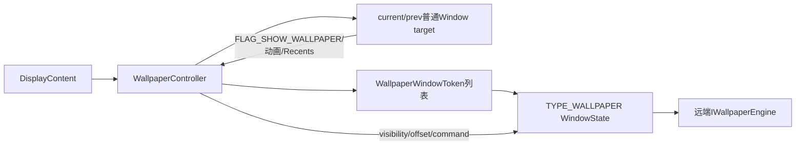
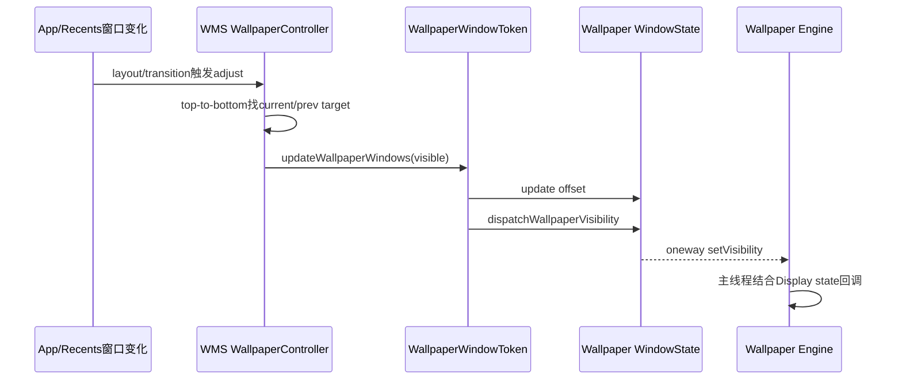
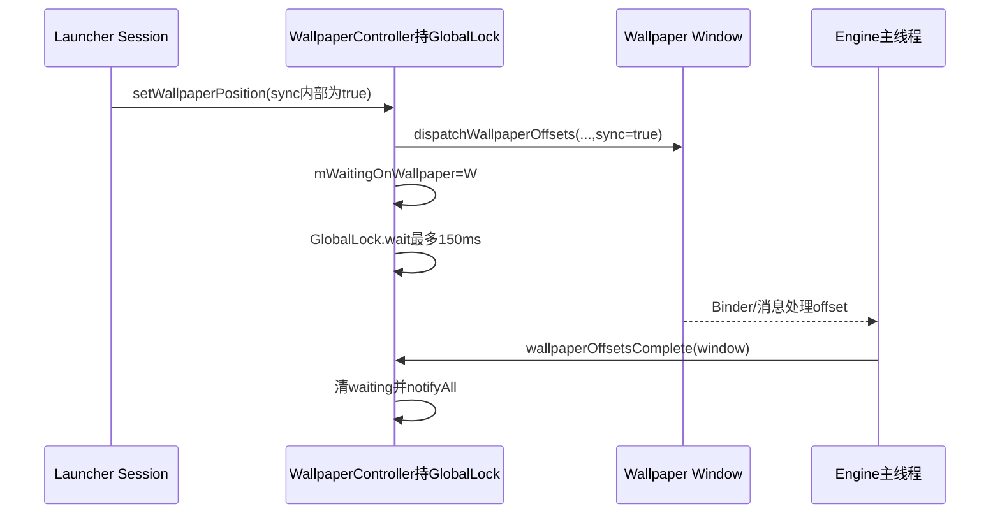

# 第 390 章 Android WMS 壁纸：Token、目标、层级、可见性、Offset、Command 与等待链

> 源码基线：Android 11 / API 30 / `android-11.0.0_r48`。本章只在 macOS 阅读源码，不编译。上一章从Engine看窗口；本章站在WMS的每个DisplayContent内，理解“哪扇普通窗口需要壁纸”、壁纸放在哪里、何时可见，以及offset/command同步究竟等待了什么。

## 1. 每个Display有一个Controller

`WallpaperController` 隶属DisplayContent，目标选择、Token列表、offset缓存和等待状态均按display隔离，不是一份全局桌面状态。

## 2. WallpaperWindowToken

它是windowType固定为TYPE_WALLPAPER的WindowToken，一枚Token可包含一个或多个壁纸WindowState。

## 3. Token注册

构造时加入该Display的mWallpaperTokens，并强制fullscreen windowing mode；setExiting时从列表移除。

## 4. Token来自WPMS

WallpaperManagerService为每个DisplayConnector先调用WMS内部addWindowToken，再让Engine用同一Binder token添加窗口。

## 5. 类型校验

WMS addWindow会核对TYPE_WALLPAPER窗口使用的Token也是TYPE_WALLPAPER，普通Token不能冒充。

## 6. Wallpaper Window不是Target

壁纸Window负责画；`mWallpaperTarget` 通常是要求在自己后面显示壁纸的应用窗口。二者名字很容易混淆。

## 7. FLAG_SHOW_WALLPAPER

普通窗口以该flag表达“我后面需要壁纸”。Launcher、锁屏或转场动画也可通过专用条件成为目标。

## 8. 当前与前任Target

mWallpaperTarget是当前目标；mPrevWallpaperTarget仅在两个目标动画交接期间保留，防壁纸过早隐藏或层级跳变。

## 9. visible的WMS定义

Controller只要current或prev target非null就认为壁纸可见；这不是像素级遮挡判定。

## 10. 自顶向下寻找

findWallpaperTarget遍历Display窗口从top到bottom，跳过不可见且不动画的Activity窗口。

## 11. 壁纸窗口也被记录

遍历遇到TYPE_WALLPAPER会记topWallpaper，但继续寻找普通target；某些fallback场景才让壁纸自身充当target。

## 12. Freeform特例

可见freeform stack时启用useTopWallpaperAsTarget，因为没有单一全屏应用窗口能自然决定背景可见。

## 13. 替换窗口防闪

窗口处于mWillReplaceWindow、又没有旧target时，可临时使用top wallpaper作target，等待替代窗口完整出现。

## 14. 总体对象图

## 15. Keyguard退出特例

带KEYGUARD_GOING_AWAY_WITH_WALLPAPER的转场会保留壁纸，避免解锁动画背景突然消失。

## 16. showWhenLocked非全屏

锁屏被遮挡时，最低的SHOW_WHEN_LOCKED窗口若不全屏或Activity不fillsParent，也要求背后保留壁纸。

## 17. 动画可声明show wallpaper

即使窗口attrs没有flag，AnimatingContainer的Animation.getShowWallpaper也能让它成为候选。

## 18. Recents优先

RecentsAnimationController判定某窗口需要壁纸时立即设target并结束搜索，以满足手势转场。

## 19. 普通候选还要on-screen

hasWallpaper不足以入选；窗口须isOnScreen，且若不是既有target还要isDrawFinishedLw，避免未画好的新窗口过早接管。

## 20. 旧target动画时继续找

找到的正是旧target且它还在动画，搜索可继续看后面的候选，再由交接逻辑决定current/prev。

## 21. 双目标只在双方动画时

新旧target都存在且都isAnimatingLw、旧窗口仍在Display中，才进入特殊双目标模式。

## 22. hidden选择

新target hidden、旧target不hidden时继续把旧者当current；两者hidden状态相同还结合opening/closing列表选择。

## 23. FindResult保留真实新目标

即便current临时回退旧者，result仍记新target，供转场层级与后续收敛使用。

## 24. 动画结束收敛

再次更新发现prev不再动画时，清prev并把current切到最新找到的target。

## 25. 没target就不可见

adjustWallpaperWindows最终visible要求mWallpaperTarget非null；随后对所有Token更新窗口可见性并重新分层。

## 26. 为什么prev仍影响visibility

独立updateWallpaperVisibility用current或prev；转场中即便current短暂变化，也不会立即让Engine停绘。

## 27. 延迟隐藏

AppTransition运行时hideWallpapers可把待隐藏窗口记入mDeferredHideWallpaper，动画结束再真正hide。

## 28. hide的保护条件

离开的窗口不是current，或仍有prev时直接return，避免无关窗口关闭把共享壁纸隐藏。

## 29. Token传播visibility

遍历所有壁纸子窗口；变visible前先更新offset，再调用WindowState.dispatchWallpaperVisibility。

## 30. Engine端对应

dispatch最终到IWallpaperEngine.setVisibility；上一章的主Looper再结合Display OFF计算reported visibility。

## 31. Visibility传播图

## 32. Token可见变化要求layout

若Token当前isVisible与新值不同，DisplayContent.setLayoutNeeded，确保壁纸尺寸/层级同步重算。

## 33. fixed rotation跟随

target有fixed rotation时WallpaperToken可链接其transform；Recents也有专门链接路径，让壁纸与目标方向一致。

## 34. 非全屏壁纸尺寸修正

Token.adjustWindowParams遇到宽高都非MATCH_PARENT时，按display逻辑尺寸取最大scale放大，并加FLAG_SCALED。

## 35. 保持纵横覆盖

取max(height比例,width比例)保证至少覆盖整个display；一边可能超出，由offset/裁剪决定显示区域。

## 36. 壁纸层级

assignWindowLayers在更新Token后执行，WallpaperWindow依目标与WMS策略放在需要它的应用之后，而非简单永远最底层。

## 37. 输入消费者也看Target

InputMonitor结合isWallpaperTarget和FLAG_SHOW_WALLPAPER决定应用WindowHandle的hasWallpaper，影响触摸向壁纸复制的专用路径。

## 38. offset两种含义

归一化x/y供Engine业务回调；像素xOffset/yOffset则由WMS用于移动/缩放壁纸Surface。

## 39. 默认X考虑RTL

没有缓存x时LTR默认0、RTL默认1，让超宽壁纸从符合阅读方向的一侧开始。

## 40. 默认Y居中

无y时默认0.5；x/y step无值时为-1。

## 41. 可移动宽度

`availw = wallpaper frame width - display logical width`；正数时像素偏移约为 `-availw*x`，否则0。

## 42. displayOffset叠加

显式整数display offset在归一化计算后相加，可把整个壁纸位置额外平移。

## 43. rawChanged

x/y/step或zoom值写入Wallpaper WindowState时置rawChanged，用于决定是否向远端发送dispatchWallpaperOffsets。

## 44. surface changed

WindowStateAnimator.setWallpaperOffset返回的changed表示Surface位置/缩放是否改变；它与rawChanged不是同一个布尔值。

## 45. 通知可关闭

只有壁纸窗口private flag含WANTS_OFFSET_NOTIFICATIONS且rawChanged，才向Engine发归一化offset；Surface移动仍可发生。

## 46. zoom聚合

多个普通窗口都可请求zoom out，Controller取最大值，维护统一“景深”语义。

## 47. zoom参数检查

Session拒绝NaN和超出0..1；Controller再将zoom映射到1与config_wallpaperMaxScale之间的scale。

## 48. shouldScale是壁纸选择

Engine shouldZoomOutWallpaper的结果经WindowSession写入壁纸WindowState；false时Surface scale固定1，但Engine仍可收到zoom自行画。

## 49. position setter的r48边界

`setWindowWallpaperPosition` 仅在x或y变化时才同时更新step；只改变xStep/yStep而x/y相同会被忽略。

## 50. offset同步时序

## 51. 谁能设置Position

Session先用windowForClientLocked确认Binder window属于当前Session，再操作它所在Display的Controller；不是仅凭任意token改全局壁纸。

## 52. 参数未在此限制0..1

setWallpaperPosition源码段没有像zoom一样显式范围检查；公开调用契约期望合法值，异常值会进入偏移计算。

## 53. last值来源优先级

有current target时优先取其有效x/y/displayOffset/step，否则才用changingTarget，避免非target窗口随意覆盖当前桌面意图。

## 54. target为空不更新last

updateWallpaperOffsetLocked只在target非null时采集，随后仍把已有last值传播给WallpaperTokens。

## 55. 同步等待150ms

dispatch sync时设置mWaitingOnWallpaper，释放GlobalLock通过Object.wait最多WALLPAPER_TIMEOUT，让Engine完成回调能取得同一锁。

## 56. 为什么wait不死锁

Java wait会暂时释放mGlobalLock；Wallpaper Engine经Session回到wallpaperOffsetsComplete后才能进入同步块并notifyAll。

## 57. 完成身份校验

只有回调window Binder等于mWaitingOnWallpaper.mClient.asBinder才清等待，别的壁纸窗口不能完成它。

## 58. 超时不是异常返回

超过150ms只日志并记last timeout；原setWallpaperPosition继续返回，调用者没有TimeoutException。

## 59. 十秒恢复窗口

一次超时后10秒内不再真正wait，避免卡顿壁纸反复阻塞WMS关键锁；仍可能发送sync标记。

## 60. clear timeout

`clearLastWallpaperTimeoutTime` 可让Controller重新允许同步等待，需结合调用场景判断。

## 61. Token只想同步一个孩子

遍历Wallpaper Window时，一旦updateWallpaperOffset返回changed便把sync=false，注释称只同步一个wallpaper。

## 62. 判断条件并非是否已wait

返回值是Surface animator changed，不是rawChanged/dispatch成功；故极端情况下第一个已同步回调但Surface未变，后续孩子仍可能拿sync=true。

## 63. RemoteException吞掉

offset dispatch Binder失败不清晰上报；方法继续返回Surface changed，等待字段也可能由超时清理。

## 64. Engine不可见时仍完成

上一章Engine把offset留待可见，但如果sync仍立即调用wallpaperOffsetsComplete，WMS等待的是“消息已处理”，不是画面已滚到位。

## 65. Surface offset与业务回调可分离

关闭WANTS_OFFSET_NOTIFICATIONS只省Engine回调；WMS仍用WindowStateAnimator移动Surface满足静态超宽壁纸。

## 66. display offset setter

仅值变化才更新，并调用同步offset链；Integer.MIN_VALUE在内部表示未指定。

## 67. Command入口

Session.sendWallpaperCommand同样先解析调用者Window，并只允许current或prev wallpaper target发送。

## 68. 非target结果

请求直接忽略并返回null，不抛“不是target”的异常。

## 69. Token广播Command

向每个WallpaperToken的孩子从后往前dispatch；第一个使用sync，之后在同Token内改false。

## 70. 多Token的sync边界

Controller给每个Token都传原始sync；所以每个Token的第一个孩子都可能看到sync=true，并非全Display严格只有一个。

## 71. Command没有实现等待

Controller保存doWait却只留TODO“Need to wait for result”，最终无论sync都立即返回null。

## 72. 结果Bundle被丢弃

Engine.onCommand可返回Bundle、Session也收到wallpaperCommandComplete(result)，但Controller方法忽略result。

## 73. commandComplete复用waiting字段

它检查mWaitingOnWallpaper并清除/notify；发送command本身却没有设置该字段，正常command无法建立独立等待。

## 74. 潜在交叉完成

若恰好存在同一wallpaper window的offset等待，commandComplete也能清它；r48两个完成入口共用一字段而无请求类型/generation。

## 75. 同步Command名不副实

sync只传给Engine让其回complete，WMS API既不等待也不返回Bundle，应理解为未完成的历史协议。

## 76. command action来源

常见tap/drop/reapply等动作由系统/目标窗口发送；extras经Binder到壁纸进程，Service仍应校验内容并快速处理。

## 77. Draw readiness另有等待

Offset的150ms与壁纸首次draw的500ms是两套机制；不要把engineShown或offsetComplete当transition draw ready。

## 78. visible-not-drawn

任一Token有可见但未画的壁纸，wallpaperTransitionReady先返回false并进入PENDING。

## 79. 500ms超时

Handler消息到期把状态设TIMEOUT；若Recents动画在等则强制开始，宁可暂时看不到壁纸也不无限卡转场。

## 80. 画好后复位

所有壁纸ready时状态回NORMAL并移除timeout消息。

## 81. shown与WMS drawn不同

Engine的reportShown是WPMS切换回调；WMS的WindowState drawn依Surface提交/绘制状态判断，二者不共享同一布尔值。

## 82. hasVisibleNotDrawnWallpaper

Token遍历孩子调用WindowState判断，是真正转场门使用的数据源。

## 83. Recents与普通AppTransition

Recents有独立target判断、fixed rotation和timeout启动逻辑；不能只按FLAG_SHOW_WALLPAPER解释手势回桌面。

## 84. layout触发

pendingLayoutChanges含FINISH_LAYOUT_REDO_WALLPAPER，或opening Activity的windowsCanBeWallpaperTarget时，会重新adjust。

## 85. obscured变化

DisplayContent发现target可见且obscured状态变化会updateWallpaperVisibility，说明目标不只在窗口增删时重算。

## 86. top visible wallpaper

截图路径遍历Token/Window，要求Animator shown且lastAlpha>0，取顶部可见壁纸。

## 87. 屏幕关闭不截图

Policy screen off或找不到可见Window时返回null。

## 88. 截图范围

以Wallpaper Window bounds归零后captureLayers其SurfaceControl，再wrap HardwareBuffer，不经过应用重新绘制。

## 89. 截图不是source原图

它捕获当前合成层内容/尺寸，可能已缩放、裁剪、动态渲染，与wallpaper_orig完全不同。

## 90. Token参数缩放

非MATCH_PARENT窗口被放大并FLAG_SCALED只是窗口几何策略，不保证应用buffer分辨率足够清晰。

## 91. hideWallpaperWindow

延迟隐藏最终逐个Window调用专用hide，保留wasDeferred/reason便于动画与诊断。

## 92. updateVisibility与updateWindows

两者都传播visible/offset；updateWindows还处理fixed rotation并记录调层信息，调用语境不同。

## 93. current target层级查询

`isBelowWallpaperTarget` 用target layer与候选baseLayer比较，辅助判断窗口相对壁纸目标的位置。

## 94. Target动画判断

只有target正在TRANSITION/PARENTS动画且Activity未等待transition start，才视为wallpaper target animating。

## 95. 默认offset缓存

mLastWallpaperX/Y等保留上一有效target值，新target未显式提供时沿用，避免页面切换突然跳回默认。

## 96. cache也是每Display

外接屏和主屏可以保留不同last offset/zoom/timeout，不应从default display推断所有display。

## 97. Zoom延迟重算

setWallpaperZoomOut把mShouldUpdateZoom=true；compute时遍历所有非Wallpaper窗口取最大值，再清flag。

## 98. zoom scale方向

`lerp(1,maxScale,1-zoom)` 的具体视觉方向要结合maxScale资源；不要仅凭“zoomOut”名字猜scale大于还是小于1。

## 99. Offset rounding

计算加0.5后转int再取负，正avail与0..1时近似四舍五入；异常负参数的Java截断表现不同。

## 100. GlobalLock性能风险

目标搜索、Binder dispatch与最多150ms wait都发生在WMS全局锁语境；wait会释放锁，但前后计算/发送仍需短小。

## 101. Engine慢回调影响

oneway dispatch不直接执行Engine业务，但sync等待会让调用链最多停150ms；超时抑制机制避免连续放大。

## 102. 多壁纸窗口现实

preview、过渡、fallback或多Token可让列表不止一个；源码反复写“只同步一个”正说明不能假设永远单实例。

## 103. target消失竞态

current/prev与Window列表会在动画/移除中变化，所有操作依赖GlobalLock串行；跨进程回调则用window Binder再次验证。

## 104. 诊断壁纸不显示

先查Display的current/prev target、FLAG/Recents/keyguard条件，再查Token visible、Wallpaper Window drawn和Engine，不要只看WPMS绑定成功。

## 105. 诊断offset不回调

查target是否提供有效值、Wallpaper Window是否开启WANTS_OFFSET_NOTIFICATIONS、rawChanged是否实际发生以及Engine是否不可见延后。

## 106. 诊断offset卡顿

查150ms timeout日志、last timeout recovery、壁纸主线程消息拥塞，以及是否错误把同步完成当已绘制。

## 107. 诊断command返回null

这是r48实现：Controller未等待也未保存result；不是一定说明Engine.onCommand没运行。

## 108. 诊断转场等500ms

查hasVisibleNotDrawnWallpaper、Surface是否post buffer与finishDrawing，区分WPMS engineShown回调。

## 109. 诊断RTL初始位置

无显式x时RTL默认1、LTR默认0；这是Launcher边缘习惯，不是图像解码方向错误。

## 110. 设计上的三类ACK

offsetComplete表示消息处理、commandComplete协议在Controller未落地、Window drawn表示合成准备；三者语义不可互换。

## 111. 本章只读练习说明

下面恰好四个练习只在macOS读源码，不编译；每项都写出目标Window、壁纸Window、Binder回调和WMS锁四个角色。

## 112. macOS只读练习一：找Target

运行 `sed -n '110,220p;503,610p' frameworks/base/services/core/java/com/android/server/wm/WallpaperController.java`，推演Launcher、全屏App、Recents和双动画四种target。

## 113. macOS只读练习二：手算Offset

运行 `sed -n '298,390p' frameworks/base/services/core/java/com/android/server/wm/WallpaperController.java`，用2400宽壁纸、1080 display、x=0/0.5/1和RTL默认值计算像素偏移。

## 114. macOS只读练习三：证明Command不等待

运行 `sed -n '65,88p' frameworks/base/services/core/java/com/android/server/wm/WallpaperWindowToken.java` 与 `sed -n '425,505p' frameworks/base/services/core/java/com/android/server/wm/WallpaperController.java`，圈出TODO、null结果和共用waiting字段。

## 115. macOS只读练习四：区分两个超时

运行 `sed -n '62,115p;650,705p' frameworks/base/services/core/java/com/android/server/wm/WallpaperController.java`，比较offset 150ms/恢复10s与draw 500ms的触发者、等待对象和超时后行为。

## 116. 易错结论一：WallpaperTarget就是Engine窗口

错误。Target通常是要求显示背景的普通应用窗口；真正绘制的是WallpaperToken的TYPE_WALLPAPER孩子。

## 117. 易错结论二：sync Command会返回Bundle

错误。Engine可回Bundle，但r48 Controller不等待、忽略result并恒返回null。

## 118. 易错结论三：offsetComplete证明画面移动完成

错误。不可见Engine也可立即complete；它证明消息消费，不证明新buffer合成。

## 119. 本章复读后的修正

复读后补正四点：visible由current或prev target决定；position只改step不会触发；“仅同步一个”实际以Surface changed而非是否dispatch判断；commandComplete与offsetComplete共用waiting字段却没有command专用等待。

## 120. 本章结论与下一章入口

WMS把壁纸当Display级背景窗口系统：普通窗口决定target，Token承载绘制窗口，动画保留prev，offset同时移动Surface并可通知Engine，多个ACK各有边界。下一章转入SystemUI ImageWallpaper的GLEngine/EGL/Renderer，看看静态crop如何真正成为纹理和屏幕buffer。
