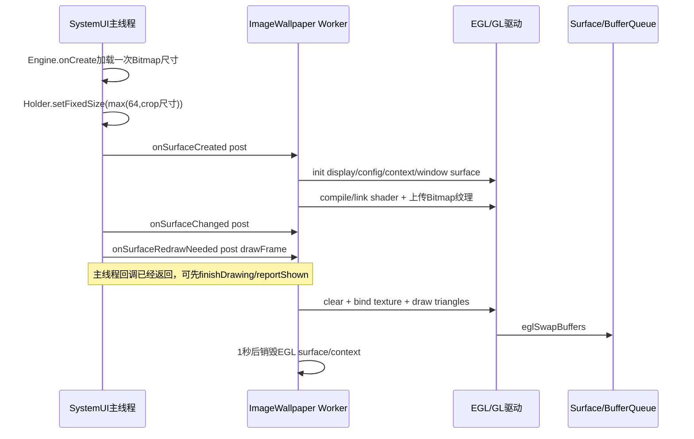
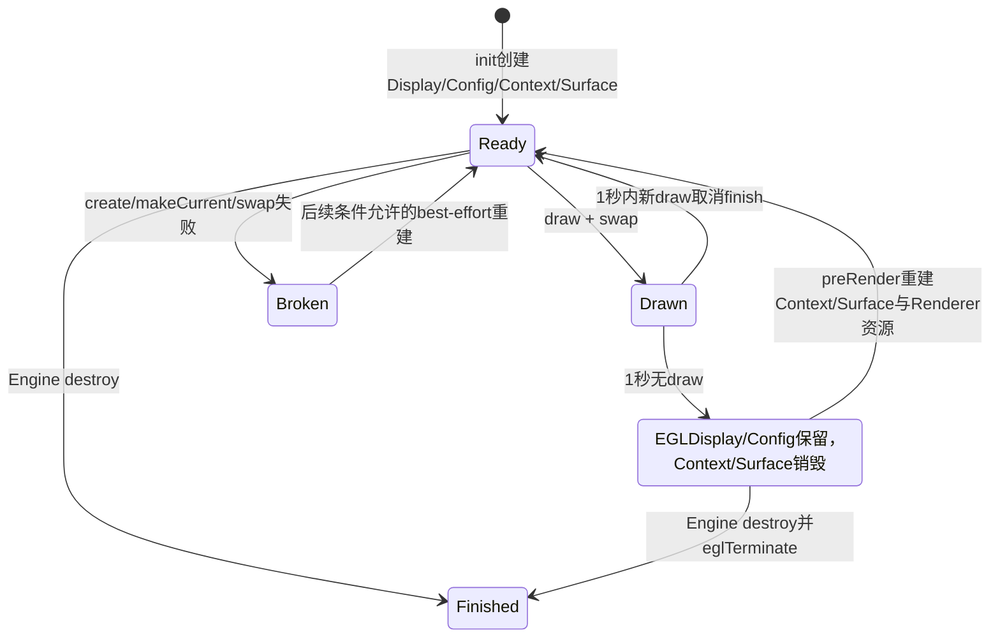
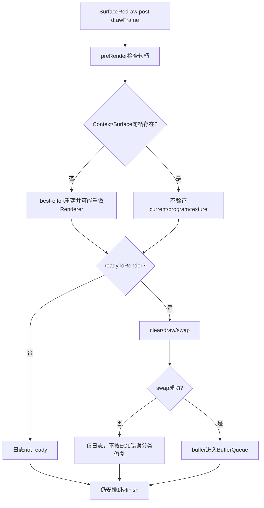

# 第 391 章 Android ImageWallpaper：GLEngine、EGL、纹理绘制与延迟销毁/重建链

> 源码基线：Android 11 / API 30 / `android-11.0.0_r48`。本章只在 macOS 阅读源码，不编译。上一章说明WMS的drawn与WPMS的shown不同；本章进入SystemUI内置静态壁纸，证明Surface redraw回调只是把任务投到Worker，真正的OpenGL绘制与swap发生得更晚。

## 1. 静态壁纸也是WallpaperService

`image_wallpaper_component` 指向SystemUI的 `com.android.systemui.ImageWallpaper`。system_server不直接把JPEG画进Surface，而是绑定这个Service。

## 2. 它显示的是crop

Renderer通过WallpaperManager取得当前system壁纸Bitmap；正常路径对应WPMS生成的display crop，而非让SystemUI重新执行上一章的裁剪算法。

## 3. 四个核心类

ImageWallpaper管理Service/Worker，GLEngine承接Wallpaper Engine生命周期，EglHelper管理EGL，ImageWallpaperRenderer与ImageGLWallpaper管理shader、纹理和全屏矩形。

## 4. 进程与线程

Service/Engine生命周期先在SystemUI主线程；耗时EGL初始化、纹理上传和drawFrame被投到名为ImageWallpaper的HandlerThread。

## 5. Worker属于整个Service

`mWorker` 在Service.onCreate只创建一个，所有Engine共享它。多display Engine任务按同一Handler队列串行，不是每屏一条GL线程。

## 6. 为什么需要Worker

Bitmap加载、EGL创建、shader编译、texImage2D和swap可能耗时，把它们移出主线程可减少SystemUI主Looper卡顿。

## 7. onCreateEngine很轻

只new GLEngine；真正EglHelper/Renderer等到Engine.onCreate才构建，因为此时基类已经准备好display context。

## 8. Service销毁顺序

ImageWallpaper.onDestroy先调用super，使活动Engine detach并把清理任务投给仍存在的Worker；随后quitSafely并把mWorker设null。

## 9. Engine.onCreate仍在主线程

它创建EglHelper和Renderer、允许fixed size、关闭offset通知，再调用updateSurfaceSize；此阶段还没有EGL window surface。

## 10. EglHelper构造已接display

构造函数立刻eglGetDisplay(EGL_DEFAULT_DISPLAY)，保存extension集合；真正eglInitialize、选config、建context/surface在后面init。

## 11. Renderer为何延迟到onCreate

`getRendererInstance()` 使用 `getDisplayContext()`，可按当前display的density/config资源构造，而非始终使用Service默认display Context。

## 12. Renderer构造取得WallpaperManager

若system service为null只打印warning，仍构造WallpaperTexture；后续调用会空指针。源码假设SystemUI环境一定提供WallpaperManager。

## 13. 固定Surface尺寸来源

Renderer.reportSurfaceSize加载Bitmap尺寸，GLEngine把宽高分别与64取max后调用Holder.setFixedSize。

## 14. 启动与绘制图

## 15. 为什么最小64像素

注释说明部分设备拒绝过小Surface，CTS覆盖该约束。即使Bitmap某边小于64，也至少申请64×64。

## 16. 固定尺寸不是display尺寸

Surface按crop Bitmap尺寸创建，WMS再以FLAG_SCALED/zoom/offset把它适配display；这与MATCH_PARENT窗口Surface不同。

## 17. 大图风险由上游控制

WPMS裁剪阶段限制纹理尺寸和Bitmap内存；ImageWallpaper本身没有再次把reportSurfaceSize clamp到GL_MAX_TEXTURE_SIZE。

## 18. reportSurfaceSize会真的解码

WallpaperTexture.use在mBitmap为空时调用 `WallpaperManager.getBitmap(false)`。它不只读文件header，因此Engine.onCreate主线程可能承担一次Bitmap加载。

## 19. false表示软件Bitmap

getBitmap(false /* hardware */)请求非hardware配置，便于随后GLUtils.texImage2D读取像素。

## 20. 尺寸加载后立刻释放

consumer为null也会在refcount降为0时recycle Bitmap；只把width/height保存在mDimensions，避免长期占用完整Java Bitmap内存。

## 21. forgetLoadedWallpaper

拿到Bitmap/WCG信息后调用WallpaperManager.forgetLoadedWallpaper，清其进程级缓存，使WallpaperTexture自己控制当前短生命周期对象。

## 22. 同一图片会加载两次

第一次只为尺寸/WCG；EGL onSurfaceCreated上传纹理时mBitmap已recycle并清null，因此会再次getBitmap。节省常驻内存的代价是重复解码/映射。

## 23. AtomicInteger引用计数

use先increment，再在synchronized块加载，调用consumer后decrement；降到0就recycle。它允许尺寸查询和纹理使用重叠时共享同一Bitmap。

## 24. 锁对象很特别

源码直接以AtomicInteger实例作为monitor，同时又用其原子操作。原子性与互斥是两套机制，调用方仍必须通过use遵守生命周期。

## 25. consumer在锁外

Bitmap加载受锁保护，但consumer.accept在锁外；refcount保证其他use不会在本consumer结束前把Bitmap recycle。

## 26. consumer异常边界

没有try/finally包住consumer。若mWallpaper.setup抛RuntimeException，decrement/recycle不会执行，refcount与Bitmap可能泄漏到进程重启。

## 27. mDimensions不会在释放时清空

后续reportSurfaceSize可继续用旧尺寸；壁纸文件在同一Engine期间变化时没有generation校验，本Engine通常由重绑/Surface事件重建。

## 28. WCG标志的取得

加载Bitmap后调用 `wallpaperSupportsWcg(FLAG_SYSTEM)`，结果存mWcgContent；Bitmap释放后该boolean仍供EGL surface创建选择。

## 29. WCG不是看Bitmap Config猜

判断委托WallpaperManager/服务的颜色空间能力，而非仅以ARGB_8888或文件扩展名决定。

## 30. offset通知被关闭

静态全图不需要Engine业务onOffsetsChanged，GLEngine调用setOffsetNotificationsEnabled(false)；WMS仍能在Surface层做位置/zoom。

## 31. shouldZoomOut返回true

ImageWallpaper允许WMS使用Surface缩放实现系统景深效果，无需SystemUI每次重画纹理。

## 32. SurfaceCreated只投任务

主线程回调检查mWorker非null，然后post：EglHelper.init，再Renderer.onSurfaceCreated；它不等待init结果。

## 33. init返回值被忽略

即使eglInitialize/config/context/surface失败，下一句仍执行shader和纹理GL调用，可能在没有current context时静默失败。

## 34. Worker FIFO维持基本顺序

SurfaceCreated、SurfaceChanged、Redraw从主线程依次post到同一Handler时通常按入队顺序执行，先init/upload，再viewport，再draw。

## 35. 但生命周期仍有竞态

Surface销毁/Engine销毁可在任务尚排队时发生；任务闭包直接访问mRenderer/mEglHelper，清理任务又会把它们置null，需要依赖队列顺序而非generation token。

## 36. SurfaceChanged

Worker调用Renderer.onSurfaceChanged(width,height)，只执行glViewport；实际draw时又会用mSurfaceSize尺寸设置一次viewport。

## 37. RedrawNeeded的关键异步

主线程 `onSurfaceRedrawNeeded` 仅post drawFrame并立即返回。基类WallpaperService随即可以finishDrawing/reportShown，Worker尚未swap。

## 38. shown早于首帧的具体证据

第389章是framework可能性，本章是实际实现：reportShown属于主线程Surface回调finally，eglSwapBuffers位于另一个线程稍后执行。

## 39. drawFrame三段式

`preRender()` 确保EGL可用，`requestRender()` 发GL draw/swap，`postRender()` 安排延迟释放。

## 40. Trace分段

三段各有Trace section，性能分析可区分重建、实际渲染和调度清理，但Bitmap上传发生在renderer onSurfaceCreated，可能属于init或preRender重建段。

## 41. 先取消延迟销毁

每次preRender移除mFinishRenderingTask，避免前一帧安排的1秒清理正好在新绘制前执行。

## 42. Context缺失时

先destroyEglSurface，再createEglContext。Context重建意味着原GL program/texture id全部失效，所以记contextRecreated。

## 43. 为什么先销毁Surface

旧EGLSurface可能与丢失Context状态不再匹配；先解除并销毁，之后以新Context重新create/makeCurrent。

## 44. Context创建失败仍继续检查

只日志；后面只有hasContext才尝试Surface。requestRender最终会打印not ready，但postRender仍安排清理。

## 45. Surface缺失时

有Context但没有EGLSurface才调用createEglSurface(holder,wcg)。它要求Holder底层Surface有效。

## 46. Context重建后的Renderer重建

仅当Context和Surface都有效且本轮确实重建Context，重新调用Renderer.onSurfaceCreated和onSurfaceChanged，恢复shader/program/texture/viewport。

## 47. 只重建Surface不重传纹理

若Context仍在，GL对象也仍存在，只需新window surface并makeCurrent，原texture/program可继续用。

## 48. 一秒策略为何销毁Context

静态壁纸不连续动画，绘完后释放Surface和Context节省GPU资源；短时间内再请求则cancel，避免频繁destroy/create。

## 49. 实际总会在一秒后丢Context

finishRendering同时destroyEglSurface和destroyEglContext，所以超过1秒的下次draw必须重新编译shader并重新加载/上传Bitmap。

## 50. 延迟销毁/重建图

## 51. mEglReady可能误导

init成功才置true；延迟finishRendering只销毁Context/Surface，不把mEglReady改false。dump可显示ready=true同时hasContext/hasSurface=false。

## 52. 完整finish才清ready

Engine.onDestroy的Worker任务先renderer.finish，再EglHelper.finish；后者销毁Surface/Context、eglTerminate Display并置ready=false。

## 53. Renderer.finish为空

r48没有显式glDeleteTexture/program/shader；正常依赖EGL Context销毁回收其GL对象。

## 54. EGLDisplay会长期保留

一秒清理不eglTerminate，下一帧能复用display、extensions和config；只有Engine最终销毁才terminate。

## 55. EGL config

选择RGB各8bit、alpha/depth/stencil为0、OpenGL ES 2、无caveat，适合不需要深度测试的全屏不透明图片。

## 56. 只取第一个Config

eglChooseConfig数组长度1，确认count>0后用configs[0]，不对多个匹配项做评分。

## 57. Context版本

attribute指定EGL_CONTEXT_CLIENT_VERSION=2，shader采用ES2 attribute/varying语法。

## 58. 低优先级Context

设备支持EGL_IMG_context_priority时附加LOW_IMG，使壁纸渲染更容易被重要图形工作抢占。

## 59. 无共享Context

eglCreateContext的share_context为EGL_NO_CONTEXT；不同Engine的纹理/program不能直接共享，即便使用同一Worker。

## 60. createSurface的WCG条件

内容声明WCG、支持KHR_gl_colorspace且支持Display P3 passthrough三者同时成立，才给window surface附颜色空间attrs。

## 61. 条件不满足就普通Surface

WCG图片不会因此拒绝显示，而是无attrs创建；实际色彩可能走默认空间/转换，不能称保持P3 passthrough。

## 62. eglMakeCurrent

创建EGLSurface后把它同时设为draw/read surface，并绑定当前Context到Worker线程；GL调用只能依赖这个线程当前状态。

## 63. makeCurrent失败缺口

方法返回false但mEglSurface仍是有效句柄；下一次preRender看到hasSurface=true可能不重建，requestRender的ready检查也不验证“current”，会继续GL调用。

## 64. destroySurface先解绑

用EGL_NO_SURFACE/EGL_NO_CONTEXT makeCurrent，再eglDestroySurface并置NO_SURFACE，避免当前线程继续引用被毁Surface。

## 65. destroyContext不检查结果

直接eglDestroyContext并置NO_CONTEXT；错误只会在后续操作/日志间接暴露。

## 66. swapBuffer

eglSwapBuffers把本帧提交给BufferQueue；返回boolean，并额外eglGetError记录非SUCCESS。

## 67. swap失败不立即重建

GLEngine只打印drawFrame failed，不根据EGL_BAD_SURFACE/CONTEXT_LOST销毁对应对象；下次preRender仍可能误判句柄存在。

## 68. readyToRender检查

只看hasContext、hasSurface与Holder frame正尺寸，不验证mEglReady、eglMakeCurrent状态、program或texture id。

## 69. frame与mSurfaceSize

ready用Holder实际frame；Renderer draw的viewport却固定为最初Bitmap尺寸mSurfaceSize。正常fixed size二者一致，最小64或布局变化时可能不同。

## 70. 小Bitmap的viewport边界

Bitmap若32×32，Surface至少64×64，但mSurfaceSize仍32×32；drawFrame只覆盖32×32 viewport，其余区域保持clear后的黑色。

## 71. onDrawFrame先清黑

glClearColor在SurfaceCreated设为不透明黑；每帧glClear COLOR_BUFFER，再画纹理。纹理无效时至少意图得到黑底。

## 72. Shader非常简单

vertex shader直接传position/texture coordinate；fragment shader用mediump采样sampler2D，没有颜色滤镜、裁剪或动态效果。

## 73. 全屏矩形

六个顶点组成两个三角形，覆盖NDC -1..1；无需index buffer。

## 74. 纹理坐标翻Y

顶点与UV把Bitmap从Android坐标映到GL纹理方向，避免上下颠倒。

## 75. Direct FloatBuffer

顶点/UV用native-order direct ByteBuffer，便于JNI/OpenGL直接读取；对象随Renderer生命周期保留，数据很小。

## 76. program编译流程

从SystemUI raw资源读vertex/fragment字符串，分别glCreateShader/glShaderSource/glCompileShader，再attach/link/use。

## 77. 不检查编译状态

没有glGetShaderiv、glGetProgramiv或info log；`useGLProgram` 无条件返回true。shader失败可能只表现为handle/属性位置异常和黑屏。

## 78. 资源读取失败

返回空字符串继续compile，不把失败上传给GLEngine。

## 79. 属性位置

查询aPosition、aTextureCoordinates，设置每顶点2个float并enable；返回-1时也没有显式分支处理。

## 80. sampler uniform

查询uTexture；draw前激活texture unit 0、bind mTextureId，并把sampler设0。

## 81. 上传Bitmap

glGenTextures后bind，`GLUtils.texImage2D` 把完整软件Bitmap复制到GPU texture，设置缩小/放大都GL_LINEAR。

## 82. 没显式wrap参数

坐标只在0..1边界内，默认wrap通常不影响正常像素；此实现也没有mipmap。

## 83. Bitmap无效

null或recycled只日志return；mTextureId可能仍是默认0，后续draw绑定0并不能显示目标图片。

## 84. glGenTextures失败

ID为0就return，没有向上抛，Renderer仍继续draw/swap。

## 85. texImage异常边界

只catch IllegalArgumentException；若已生成texture但上传失败，不delete临时ID且不赋mTextureId，直到Context销毁回收。

## 86. Context重建会重新加载Bitmap

Renderer.onSurfaceCreated再次WallpaperTexture.use；上次use结束已recycle，所以每次超过一秒后的新draw都可能重新从WallpaperManager取得像素。

## 87. 静态壁纸为何仍可能耗IO

频繁触发redraw且间隔超过1秒，会反复解码/上传，而不是永久保留GPU纹理；策略在GPU常驻与重建成本间取舍。

## 88. 没有onVisibilityChanged override

ImageWallpaper不因每次visible直接绘帧/停动画；它是静态内容，只响应Surface redraw，之后自动释放EGL。

## 89. mNeedRedraw未使用

字段在r48声明但没有读写，不能据名字推导去重或丢帧恢复逻辑。

## 90. 失败传播图

## 91. onDestroy异步清理

GLEngine.onDestroy不在主线程直接调EGL，而是向Worker post；保证EGL对象在创建它们的线程清理。

## 92. 清理闭包会置null

调用renderer.finish、eglHelper.finish后分别置null，帮助发现误用并释放Java引用。

## 93. onDestroy没有worker空检查

正常Service顺序保证super.onDestroy时Worker仍在；若异常调用时mWorker已null会NPE，这依赖生命周期契约。

## 94. Surface回调有空检查

Created/Changed/Redraw发现mWorker null就return，防Service销毁后继续排新绘制。

## 95. 已排任务不会被空检查撤销

它们捕获this，执行时直接解引用字段；quitSafely和同队列清理顺序决定是否安全，没有每Engine generation或cancel token。

## 96. quitSafely语义

允许队列中已到期工作有序结束，未来延迟消息可能被丢弃；清理任务在super.onDestroy期间先post，意图让它先执行。

## 97. 多Engine共享队列影响

一个display的大Bitmap上传会延迟另一个display draw；但也避免多个GL线程同时争用内存/GPU。

## 98. 每Engine EGL仍独立

GLEngine各自new EglHelper/Renderer/Context，只有执行线程共享；不能把一个Engine的hasContext当另一个的状态。

## 99. getDisplayContext的价值

Renderer读取SystemUI shader资源通常相同，但WallpaperManager与配置能按Engine display建立，适配多显示。

## 100. dump线程风险

GLEngine.dump直接访问mEglHelper/mRenderer，没有同步或null保护；若恰与Worker清理交错，诊断本身可能遇到不一致/NPE边界。

## 101. dump能看到什么

Holder Surface有效性/frame、EGL版本/ready/context/surface、config列表、Renderer surface size/WCG；ImageGLWallpaper.dump为空。

## 102. mEglVersion默认值

只有eglInitialize成功才写major/minor；失败时dump可能显示0.0。

## 103. extension集合时点

connectDisplay时eglQueryString收集extension，后续Context/Surface创建据此选择低优先级和P3能力。

## 104. 诊断“shown但黑屏”

查Worker draw是否在shown之后、init返回是否被忽略、shader/program/texture ID、viewport、小图64边界和swap日志。

## 105. 诊断每秒后重绘慢

确认finishRendering是否已毁Context，下一帧是否重新getBitmap、编译shader、texImage2D；这是r48设计路径而非必然泄漏。

## 106. 诊断WCG不生效

同时核对wallpaperSupportsWcg、KHR colorspace、P3 passthrough extension和createWindowSurface attrs，不能只看图片ICC。

## 107. 诊断swap持续失败

注意hasContext/hasSurface只看句柄，makeCurrent失败仍可能被当ready；需要结合eglGetError，r48不会自动分类重置。

## 108. 诊断小图黑边

比较Bitmap mSurfaceSize、64最小fixed surface、Holder frame与draw viewport；小于64时源码确实没有把viewport扩大。

## 109. 诊断Bitmap内存峰值

尺寸查询和纹理上传各会取Bitmap；use结束会recycle，但texImage期间Java Bitmap与GPU texture同时存在，瞬时内存仍高。

## 110. 安全阅读结论

这不是“一个永远活着的GLRenderer”，而是按需绘一帧、短暂保留、1秒后释放Context，下次best-effort重建的静态渲染器。

## 111. 本章只读练习说明

下面恰好四个练习都只在macOS读r48源码，不编译；每项都标出主线程、Worker、EGL线程当前状态与buffer提交时点。

## 112. macOS只读练习一：证明shown早于swap

运行 `sed -n '138,225p' frameworks/base/packages/SystemUI/src/com/android/systemui/ImageWallpaper.java` 与 `sed -n '970,1085p' frameworks/base/core/java/android/service/wallpaper/WallpaperService.java`，画出post drawFrame、回调return、reportShown与eglSwapBuffers顺序。

## 113. macOS只读练习二：推演一秒重建

运行 `sed -n '158,260p' frameworks/base/packages/SystemUI/src/com/android/systemui/ImageWallpaper.java`，分别推演两次draw间隔500ms和1500ms，列出Context/Surface/program/texture是否重建。

## 114. macOS只读练习三：审EGL失败状态

运行 `sed -n '100,350p' frameworks/base/packages/SystemUI/src/com/android/systemui/glwallpaper/EglHelper.java`，记录init各失败点残留字段，并验证makeCurrent失败后hasEglSurface仍可为true。

## 115. macOS只读练习四：追Bitmap两次加载

运行 `sed -n '40,180p' frameworks/base/packages/SystemUI/src/com/android/systemui/glwallpaper/ImageWallpaperRenderer.java`，从reportSurfaceSize到onSurfaceCreated数getBitmap、forget、recycle、texImage2D次数。

## 116. 易错结论一：静态图由system_server Canvas绘制

错误。system_server管理文件和绑定，SystemUI ImageWallpaper进程用EGL/OpenGL把Bitmap纹理提交到Surface。

## 117. 易错结论二：SurfaceRedrawNeeded返回前已swap

错误。它只post Worker；framework可先finishDrawing/reportShown。

## 118. 易错结论三：EGL ready=true代表可画

错误。延迟清理不清ready，且makeCurrent失败可留下有效Surface句柄；必须同时看实际current与错误。

## 119. 本章复读后的修正

复读后补正四点：尺寸查询本身会加载并recycle Bitmap；超过1秒不仅Surface连Context也销毁；init返回值被忽略仍调用Renderer；小图Surface扩到64但draw viewport仍用原图尺寸，可能留下黑区。

## 120. 本章结论与下一章入口

ImageWallpaper以共享Worker串行运行每Engine独立EGL：短暂加载Bitmap、上传全屏纹理、swap一帧并延迟释放；性能好坏与失败恢复都受异步时序影响。下一章精读WallpaperColors：静态Bitmap提取、动态Engine上报、缓存、监听器、system/lock与display分发。
