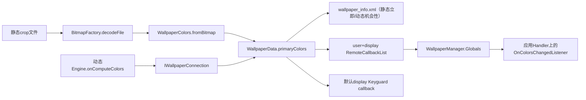
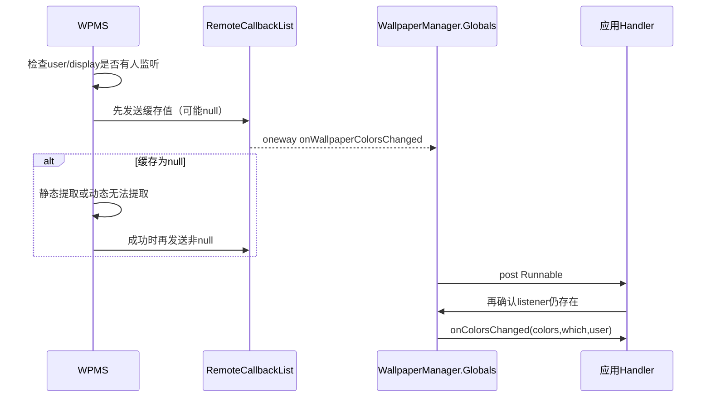
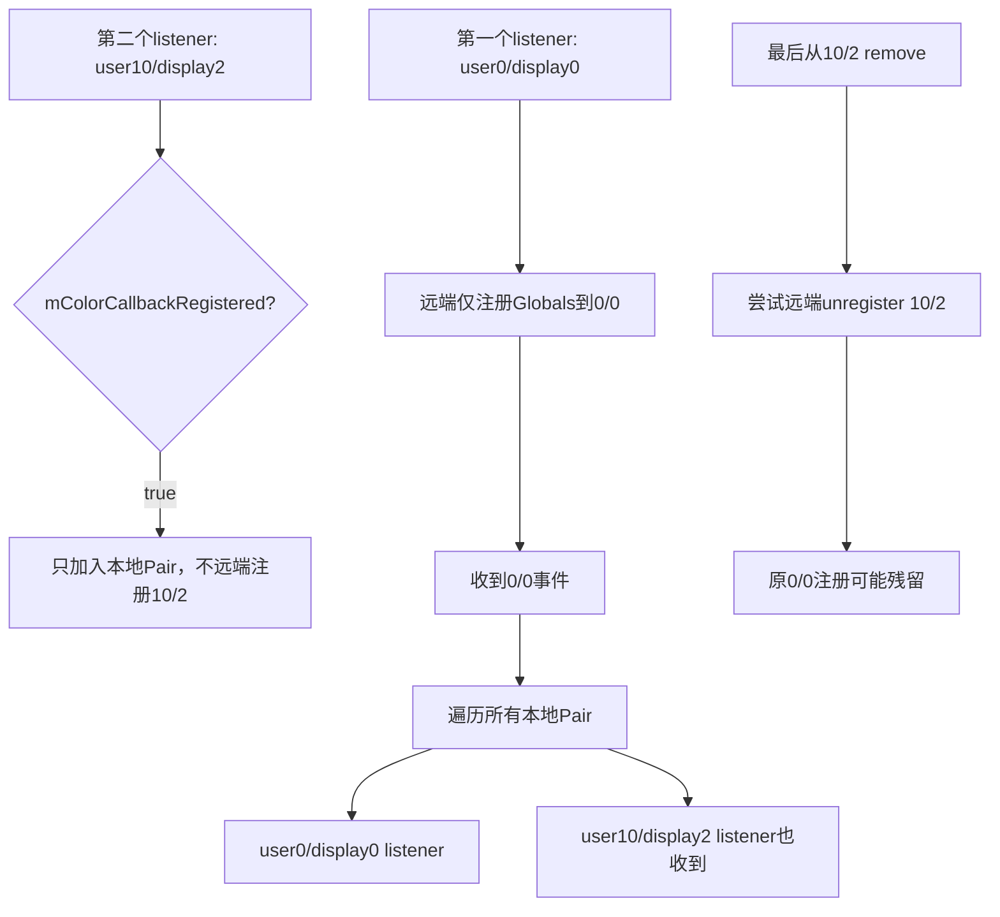

# 第 392 章 Android WallpaperColors：静态提取、动态上报、缓存、Which 与监听分发链

> 源码基线：Android 11 / API 30 / `android-11.0.0_r48`。本章只在 macOS 阅读源码，不编译。上一章完成静态图像素上屏；本章研究同一画面如何变成最多三种代表色和dark text/theme提示，以及system、lock、display、user监听器怎样收到结果。

## 1. WallpaperColors是什么

它是最多三个按重要性排序的 `Color` 加一个bit hints集合，不是完整直方图、调色板图片或主题资源。

## 2. 三种颜色

primary必需，secondary可空，tertiary只有secondary非空时才允许存在；构造器会拒绝“只有第一和第三色”。

## 3. 三个hint

HINT_SUPPORTS_DARK_TEXT表示亮背景适合深色文字，HINT_SUPPORTS_DARK_THEME表示画面暗、适合深色主题，HINT_FROM_BITMAP表示由像素算法提取。

## 4. hint不是命令

Launcher/SystemUI可结合自己的对比度、无障碍与用户主题策略选择是否采用，不应把它当强制切换深浅色。

## 5. 两条颜色生产链

静态ImageWallpaper由WPMS解码crop并调用WallpaperColors.fromBitmap；动态Wallpaper由每个Engine.onComputeColors返回，经IWallpaperConnection上报。

## 6. 为什么不让ImageWallpaper上报

WPMS的Connection明确忽略mImageWallpaper回传颜色，因为服务已能直接读取crop，避免静态Engine与服务端重复成为权威。

## 7. primaryColors存在哪里

WallpaperData只有一个 `primaryColors` 字段；system、独立lock与fallback各自对象分别缓存，但同一动态Wallpaper的多个display共享一个字段。

## 8. 缓存不是按display

多显示动态Engine可上报不同颜色，后一次会覆盖WallpaperData共享值；通知虽带目标display路由，随后查询另一display可能读到最后一次上报值。

## 9. 设置新壁纸先清缓存

静态FD设置与切换不同动态组件会把primaryColors置null，表示旧结果失效；same组件REAPPLY则可能保留。

## 10. XML可持久化颜色

第387章看到colorsCount/colorValueN/colorHints。静态提取成功会立即save，重启可避免再次解码。

## 11. 动态上报不立即save

Connection.onWallpaperColorsChanged只改内存并通知，没有直接saveSettings；若后来其他动作保存XML，颜色可能顺带持久化，否则重启需Engine重新上报。

## 12. null也是有效未知状态

动态Engine可以返回null；监听器可能先收到null，表示当前不知道，并不等于黑色或透明色。

## 13. 总体数据流图

## 14. notify先找display

有WallpaperConnection时遍历其DisplayConnector逐屏通知；没有Connection的独立lock WallpaperData只通知DEFAULT_DISPLAY。

## 15. fallback颜色

非多屏动态壁纸占default display，其他合适display由mFallbackWallpaper/ImageWallpaper显示；这些display查询/通知应返回fallback默认图颜色。

## 16. findWallpaperAtDisplay

若fallback Connection包含该display就返回fallback，否则返回指定user的system WallpaperData。

## 17. lock查询的回退

getWallpaperColors(FLAG_LOCK)先查独立lock Map；没有时再findWallpaperAtDisplay，体现锁屏复用system壁纸。

## 18. which必须精确单值

主动查询只接受FLAG_SYSTEM或FLAG_LOCK，SYSTEM|LOCK会IllegalArgumentException；回调which却可以是两者组合。

## 19. dynamic which基本值

动态壁纸上报始终先设FLAG_SYSTEM，因为动态Engine属于system账。

## 20. 何时再加LOCK

仅default display且该user没有独立lock WallpaperData时加FLAG_LOCK，表示锁屏也复用此动态画面。

## 21. 次屏不加LOCK

即便没有独立lock，非default display动态颜色只报SYSTEM；Keyguard仅在default display显示。

## 22. 静态system通知组合

Observer依据本次whichPending和lock Map变化构造which；同一静态图同时作用system/lock时可把两个bit一起通知。

## 23. listener存储结构

服务端是 `SparseArray<userId, SparseArray<displayId, RemoteCallbackList>>`，同一Binder回调可在不同user/display列表分别登记。

## 24. USER_ALL

通知会同时收集实际user列表与UserHandle.USER_ALL列表，供具备跨用户授权的系统组件监听所有用户。

## 25. 注册跨用户检查

register/unregister都经handleIncomingUser，允许all且要求相应跨用户能力，普通应用不能任意监听其他用户。

## 26. displayId未显式验证

注册函数直接以传入ID建SparseArray；不存在display不会立刻报错，只是通常没有对应实际通知。

## 27. 空列表壳不清理

unregister只从RemoteCallbackList移除callback，不删除空display/user容器，长期多组合注册可能留下空结构。

## 28. 没人监听就不通知也不提取

notifyWallpaperColorsChangedOnDisplay先检查当前user和USER_ALL列表都空则return；颜色事件本身采用按需策略。

## 29. Keyguard不参与“有人监听”判断

早退条件没有检查mKeyguardListener。若仅Keyguard callback存在、没有普通颜色listener，本次路径也会return，Keyguard收不到该颜色事件。

## 30. 常见系统环境会掩盖边界

SystemUI通常还注册普通颜色监听，因此Keyguard常能顺带收到；源码语义仍不能写成“Keyguard自身保证触发提取”。

## 31. 第一次先发当前值

有监听器时，不论primaryColors是否null，服务先调用notifyColorListeners发送当前缓存。

## 32. 需要提取再发第二次

若初始null，随后同步extractColors；成功后再次通知非null，因此同一变化可能产生“null→颜色”两次回调。

## 33. 方法注解与实际null

notifyColorListeners参数标@NonNull，但调用点可传wallpaper.primaryColors=null；接口实现必须以实际代码为准并容忍未知。

## 34. 提取失败只有第一次

crop无法读取或live壁纸无静态可提取内容时primaryColors仍null，函数return，不发第二次。

## 35. 监听分发时序

## 36. 服务端先快照再出锁

在mLock内beginBroadcast把callback引用复制到ArrayList并finishBroadcast，之后出锁逐个Binder调用，避免远端卡住核心锁。

## 37. RemoteCallbackList死亡清理

回调是oneway，RemoteException被忽略；死亡Binder由RemoteCallbackList维护，无需手动unregister。

## 38. USER_ALL可能重复

同一Binder若同时注册实际user与USER_ALL，会被加入快照两次；不同RemoteCallbackList之间没有去重。

## 39. Keyguard通知条件

notifyColorListeners最后只在displayId==DEFAULT_DISPLAY调用mKeyguardListener，which和userId原样传递。

## 40. Keyguard颜色与普通变化回调不同

同一IWallpaperManagerCallback还有onWallpaperChanged；锁屏文件变化和颜色变化是两个时点/方法，不应合并理解。

## 41. 客户端Globals是进程单例

同进程所有WallpaperManager实例共享sGlobals、一枚Binder callback、mColorListeners和缓存。

## 42. 第一个本地listener触发远端注册

mColorCallbackRegistered为false时用该次userId/displayId注册Globals Binder，成功后置true。

## 43. 关键多用户/多屏缺口

该boolean不是按user/display；后续另一display或user添加listener不会再向服务注册相应组合。

## 44. 本地Pair不记路由

mColorListeners只保存(listener,handler)，没有userId/displayId。收到第一组合的事件后会post给进程内全部listener。

## 45. 事件不含displayId

IWallpaperManagerCallback颜色方法只传colors、which、userId；客户端即使想过滤，也不知道事件来自哪块display。

## 46. r48实际结果

一个进程跨display/user复用WallpaperManager监听时，可能漏掉未注册组合的事件，并把已注册组合事件广播给不相关本地listener。

## 47. remove用对象身份

`removeIf(pair.first == callback)` 按同一实例删除所有Pair，不看equals、handler、user或display。

## 48. 最后一个移除才远端unregister

列表空且registered才调用服务；但使用的是这次remove传入的user/display，不一定等于第一次实际注册的组合。

## 49. 错组合unregister后果

服务端可能在另一个列表找不到Globals Binder，原始注册残留；本地已空却继续收到Binder事件并什么也不post。

## 50. 客户端路由图

## 51. register失败仍保留本地listener

RemoteException时registered仍false，但Pair照样加入；下一次add会重试，已有listener则在注册成功前收不到事件。

## 52. 回调默认线程

listener的handler为null时使用Globals构造时的mMainLooperHandler；公开重载注解虽常传non-null，内部支持null。

## 53. Handler投递消除Binder线程业务

Globals在Binder callback里只遍历并post，应用onColorsChanged不会直接运行在Binder线程。

## 54. 移除竞态复查

Runnable执行时重新在sGlobals锁内contains(pair)；已remove则跳过，避免排队后仍调用已注销listener。

## 55. listener异常

应用onColorsChanged在Handler Runnable中直接调用，没有framework catch；异常会影响该Handler线程，通常是应用主线程。

## 56. add不会立即回放当前颜色

注册只是等待后续服务通知；需要当前值应显式getWallpaperColors，不能假定add立即收到。

## 57. get可能同步阻塞

公开文档明确不建议主线程调用；缓存为空时Binder线程内可解码完整crop并计算Palette。

## 58. 并发提取无in-progress标志

多个get/notify同时看到null可重复解码计算；最后都用wallpaperId检查，避免旧版本写入但不能避免浪费。

## 59. 静态提取先判组件

wallpaperComponent等于ImageWallpaper或为null才视为可读静态图；普通live wallpaper即使crop文件残留也不会使用。

## 60. null component为何算静态

独立lock WallpaperData没有动态component，其crop正是需要提取的静态锁屏图。

## 61. crop存在时优先

保存绝对路径，出锁后BitmapFactory.decodeFile。使用最终显示crop比原图更能代表屏幕实际区域。

## 62. crop缺失但source存在

既不选crop，也不判default；colors保持null并warning。它不会为颜色提取单独触发generateCrop。

## 63. crop/source都无

ImageWallpaper账被视为产品默认静态图，调用openDefaultWallpaper提取。

## 64. full crop先解码

BitmapFactory.decodeFile没有inSampleSize；先把完整crop解码到内存，之后WallpaperColors才缩到小图，瞬时内存仍可能大。

## 65. recycle所有权

fromBitmap不会recycle调用者原Bitmap；extractColors在返回后显式recycle。若fromBitmap内部创建scaled副本，则只回收副本。

## 66. wallpaperId防旧结果

出锁前快照ID，耗时计算后只有当前ID仍相同才写primaryColors/save XML；设置新壁纸中途完成的旧计算会被丢弃。

## 67. ID不保护同ID文件变动

若文件被外部/异常路径替换却wallpaperId未变，旧结果仍可能写入；正常设置协议会换ID。

## 68. 静态成功立即保存

在mLock内赋colors并saveSettingsLocked，把颜色写进XML；save IOException静默的边界沿用第387章。

## 69. 失败不保存哨兵

primaryColors继续null，下次查询/事件会再次尝试，既能自愈也可能重复昂贵失败。

## 70. 默认图全局缓存

mCacheDefaultImageWallpaperColors只存一份，成功后复用；默认壁纸被设计为服务启动后不变。

## 71. 默认缓存不是按display/user

产品默认图从system资源/属性读取，fallback和无文件system账共享颜色；运行期overlay变化通常需进程/系统重启收敛。

## 72. fallback无ID检查

fallback分支先查缓存、提取默认图后直接赋值，不比较wallpaperId，也不save per-user XML；fallback对象本来就是稳定系统账。

## 73. default解码异常

捕获OutOfMemoryError和关闭stream的IOException；decodeStream返回null也日志失败，缓存保持null。

## 74. 动态Engine上报线程

WallpaperService主线程执行onComputeColors，Connection Binder进入system_server后在mLock内更新共享字段，再出锁通知目标display。

## 75. ImageWallpaper上报被丢弃

Connection首先判断当前component是mImageWallpaper就return，即使其Engine实现未来返回颜色，也不覆盖服务端静态算法。

## 76. 动态null会清旧值

`mWallpaper.primaryColors = primaryColors` 无null保护；Engine返回null可把之前有效缓存清空。

## 77. null后服务尝试extract

通知函数看到null会调用extractColors；由于component是普通live，没有crop/default候选，只warning并保持null。

## 78. display上报身份只靠Connection

Engine通过绑定时获得的IWallpaperConnection回传displayId；服务随后按该ID通知，但WallpaperData cache仍共享。

## 79. 无connector存在校验

onWallpaperColorsChanged源码段未先验证displayId仍属于Connection；通知查listener组合，恶意/错误Engine可传其他ID，但绑定接口权限限制攻击面。

## 80. WallpaperColors缩放上限

MAX_BITMAP_SIZE=112，实际以面积112×112=12544为主，保持长宽比；极宽图某一边可能大于112，另一边至少修正为1。

## 81. calculateOptimalSize

面积超限时scale=sqrt(maxArea/requestedArea)，宽高分别乘scale取int；结果0的边被设1。

## 82. int面积溢出边界

`width*height` 先以int计算，理论超大Bitmap可溢出而跳过缩放；正常可分配Bitmap和WPMS上限降低了实际概率。

## 83. Palette量化器

使用VariationalKMeansQuantizer，maximumColorCount(5)，clearFilters，不沿用Palette默认排除规则。

## 84. 为什么先最多5色

量化得到少量代表cluster，再按人口过滤排序，最终只取前三；不是简单统计出现次数最多的原始ARGB。

## 85. 5%过滤

population少于当前分析Bitmap面积5%的swatch移除，弱小点缀色通常不进入主色。

## 86. 排序依据

剩余swatch按population降序，第一/二/三分别成为primary/secondary/tertiary。

## 87. Palette又设置resizeArea

调用方已可能缩放，Builder仍指定同一最大面积，属于双重保护。

## 88. HINT_FROM_BITMAP

fromBitmap最终总把该bit与dark hints OR；显式构造动态颜色默认没有此bit，除非Engine自己传hint构造器。

## 89. Dark hint使用HSL lightness

变量名叫luminance，实际来自ColorUtils.colorToHSL的L，不是Color.luminance的线性相对亮度。

## 90. dark text条件

平均lightness严格大于0.75，并且不满足黑字对比的非透明暗像素严格少于面积2.5%，才支持深色文字。

## 91. 对比阈值

逐像素计算与BLACK对比，必须大于6才不计dark；alpha==0的像素不增加darkPixels。

## 92. 透明像素仍进平均值

总lightness对所有像素累加，没有按alpha排除；透明像素的RGB可能影响mean，虽然壁纸crop通常不透明。

## 93. dark theme条件

平均lightness严格小于0.25就设置深色主题提示；与>0.75的dark text条件不会同时成立。

## 94. 小面积取整边界

maxDarkPixels=(int)(length×0.025)。少于40像素时为0，条件 `darkPixels < 0` 永远false，即便没有暗像素也不给dark text。

## 95. 构造器两种hint语义

三Color公开构造器会仅按primary HSL补dark theme；带显式hints的隐藏/SystemApi构造器直接采用传值，不重新计算。

## 96. 代表色对象可变hint

颜色列表不可修改，但setColorHints可改mColorHints；WallpaperColors并非完全不可变，进程内共享引用时需注意别名。

## 97. system到lock迁移共享引用

migrateSystemToLockWallpaperLocked直接赋primaryColors引用；若随后对对象setColorHints，两个账可能同时观察变化，直到某方替换对象。

## 98. Parcel复制

跨进程写mainColors数量、每色ARGB和hints，接收端新建Color/List；不会共享原Java对象。

## 99. Parcel构造不验count

读取任意count并允许空列表，之后getPrimaryColor会越界；安全依赖受信framework协议和Binder Parcel边界。

## 100. equals/hashCode

同时比较颜色顺序列表与hints；相同三色但hint不同视为不同。

## 101. 服务通知不做equals去重

动态Engine重复上报相同WallpaperColors仍赋值并通知；静态事件也可重复发送缓存，监听器需幂等。

## 102. which是位集合

回调可能SYSTEM、LOCK或二者OR；应用不能用 `which == FLAG_SYSTEM` 判断所有system变化，应做bit test。

## 103. userId重载

公开listener常只实现两参数；三参数default方法转调两参数。系统多用户组件可override三参数区分owner。

## 104. display信息在客户端丢失

即使WallpaperManager来自display Context，回调接口不提供displayId；r48只能靠注册上下文假设，而Globals单注册缺口会破坏该假设。

## 105. 诊断颜色一直null

查是否有人监听/是否主动get、crop是否存在可解码、component是否live、Engine onComputeColors是否返回、wallpaperId是否在计算中变化。

## 106. 诊断回调两次

先null后非null是按需提取的设计时序；若业务只想应用最终主题，应容忍null并去重有效值。

## 107. 诊断次屏颜色错

检查display实际使用system还是fallback、动态多个Engine上报顺序，以及primaryColors并非per-display。

## 108. 诊断跨用户listener串消息

审计Globals单boolean、Pair不记路由、第一次远端注册组合与最后unregister组合，而不是只看服务端二维Map。

## 109. 诊断提取卡顿

getWallpaperColors可能在调用Binder线程同步全图decode、缩放、Palette与逐像素HSL；避免应用主线程并观察重复并发提取。

## 110. 安全使用模型

先注册、后台主动get当前值；回调容忍null/重复/组合which；按userId过滤；多display或多user同进程需特别规避r48 Globals路由缺口。

## 111. 本章只读练习说明

下面恰好四个练习只在macOS读r48源码，不编译；每项都画出颜色对象所有者、user/display键、执行线程和是否持mLock。

## 112. macOS只读练习一：追静态两次通知

运行 `sed -n '362,545p' frameworks/base/services/core/java/com/android/server/wallpaper/WallpaperManagerService.java`，标出无人早退、null通知、crop解码、ID检查、XML保存和第二次通知。

## 113. macOS只读练习二：手算Palette与hint

运行 `sed -n '154,210p;382,430p' frameworks/base/core/java/android/app/WallpaperColors.java`，用一张80%亮背景+1%暗点图片计算5%swatch过滤、2.5%暗区和0.75均值条件。

## 114. macOS只读练习三：证明Globals路由缺口

运行 `sed -n '304,410p' frameworks/base/core/java/android/app/WallpaperManager.java`，按user0/display0与user10/display2各注册一个listener，逐行记录远端注册次数和本地投递对象。

## 115. macOS只读练习四：推演动态多屏

运行 `sed -n '1390,1425p;2358,2405p' frameworks/base/services/core/java/com/android/server/wallpaper/WallpaperManagerService.java`，让display0上报红、display2上报蓝，再分别查询两屏并解释共享primaryColors结果。

## 116. 易错结论一：颜色总由SystemUI画面实时采样

错误。静态由system_server读取crop，动态由Engine主动上报；服务并不通用截图每一帧。

## 117. 易错结论二：primaryColors按display缓存

错误。通知/监听按display，WallpaperData字段却共享；fallback是另一个对象才有独立值。

## 118. 易错结论三：注册多个listener会按各自user/display过滤

错误。服务端二维Map正确，但客户端Globals只远端注册首组合、本地Pair不保存路由。

## 119. 本章复读后的修正

复读后补正四点：无人监听时Keyguard也不能单独触发本路径；首次可先发null再提取；动态上报不立即保存XML；dark hint所谓luminance实际是HSL lightness且透明像素仍参与均值。

## 120. 本章结论与下一章入口

WallpaperColors是一条懒计算、可null、可重复的提示链：静态crop做小图量化，动态Engine主动上报，服务按user/display通知却共享部分缓存，客户端又有单注册路由缺口。下一章进入system/lock与Keyguard语义：共享、迁移、清除、读取回退和颜色which如何共同决定锁屏看到什么。
