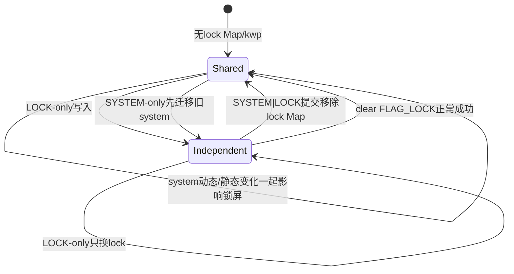
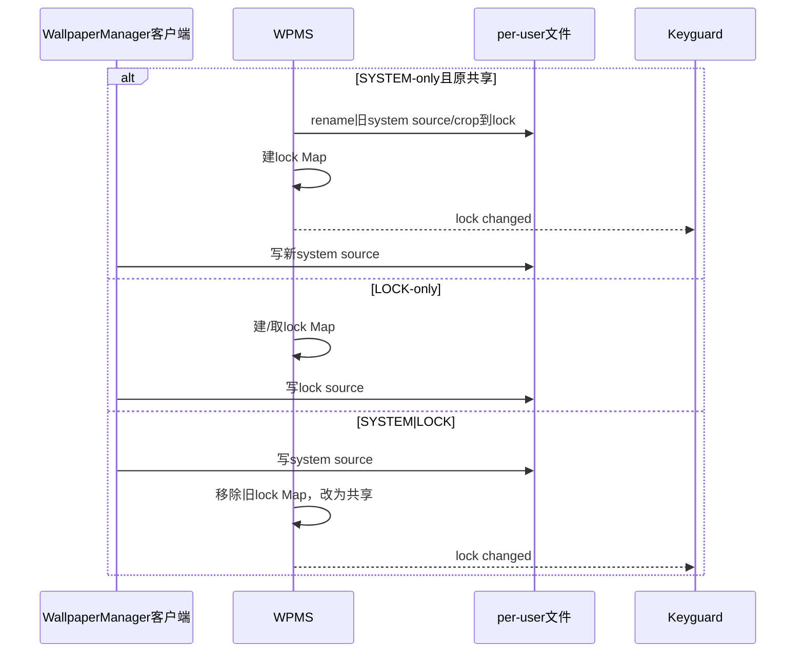
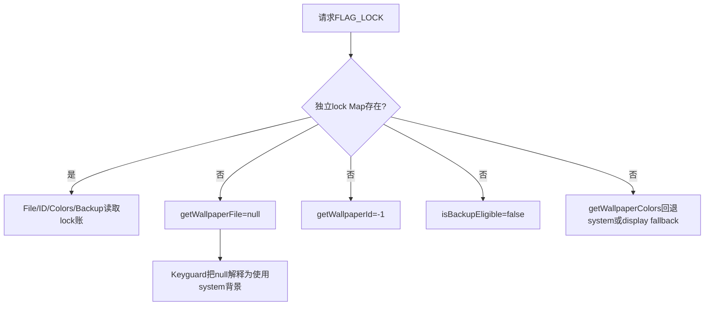

# 第 393 章 Android Wallpaper System/Lock：共享、迁移、清除、读取回退与 Keyguard 链

> 源码基线：Android 11 / API 30 / `android-11.0.0_r48`。本章只在 macOS 阅读源码，不编译。核心不变量是：`mLockWallpaperMap` 没有该user时，锁屏复用system；Map有记录时，锁屏使用独立静态文件。磁盘上是否残留lock文件不能取代这份内存/XML账。

## 1. 两个Map

`mWallpaperMap` 始终承载system壁纸，`mLockWallpaperMap` 只承载独立lock静态图；不是每个user天然都有两条记录。

## 2. “共享”用缺席表达

没有lock WallpaperData就是共享system，并不存在第三个shared对象或布尔字段。

## 3. 共享不等于复制

锁屏直接沿用system当前结果；以后system改变时若不先迁移，锁屏也会跟着改变。

## 4. 独立lock没有Engine

Lock WallpaperData的component/connection通常为null，Keyguard读取其crop Bitmap；动态WallpaperService只运行在system账。

## 5. 动态也能出现在锁屏

若没有独立lock图，Keyguard背景可复用system动态Engine画面；这不是建立了第二个lock Engine。

## 6. 四个文件名

system source/crop为 `wallpaper_orig`/`wallpaper`，独立lock为 `wallpaper_lock_orig`/`wallpaper_lock`。

## 7. XML标签

system写 `wp`，只有独立lock Map存在才写 `kwp`；重启依kwp重建lock账。

## 8. 默认set行为

WallpaperManager不带which的setBitmap/setStream/setResource默认SYSTEM|LOCK，意图让新静态图同时用于桌面和锁屏。

## 9. LOCK-only

getWallpaperSafeLocked精确看到FLAG_LOCK时选择lock Map；没有记录就new WallpaperData指向lock文件。

## 10. SYSTEM或组合

只要which不是精确LOCK，就使用system WallpaperData并只写system source一次。

## 11. SYSTEM|LOCK如何实现

Observer处理system source后移除lock Map，让锁屏重新复用新system；并非复制同一新图到两套文件。

## 12. 旧lock文件可能残留

移除Map时没有在该分支删除wallpaper_lock_orig/crop，所以磁盘残留不表示仍被Keyguard选中。

## 13. 状态模型图

## 14. 为什么SYSTEM-only必须迁移

共享状态下旧system正是锁屏内容。客户端新写前必须把旧source/crop搬成独立lock，才能只改桌面。

## 15. 迁移触发条件很严格

入口要求 `which == FLAG_SYSTEM` 且lock Map为空；带未知bit即便含SYSTEM也绕过，公开调用应只传合法flags。

## 16. 迁移前system账必须存在

mWallpaperMap无记录就日志return，后续仍可能继续system设置；无法凭空保留旧锁屏图。

## 17. 新lock元数据

复制旧system的wallpaperId、cropHint、allowBackup与primaryColors。

## 18. 哪些不复制

name、component、connection、callbacks、pending与crash状态不复制；lock是静态内容账，不是system运行账快照。

## 19. primaryColors是引用赋值

两账暂时共享同一WallpaperColors对象；该类hints可变，存在别名边界。

## 20. 两次rename

先system source→lock source，再system crop→lock crop；没有共同原子事务。

## 21. rename不是copy

成功后system路径消失，随后set入口以TRUNCATE/CREATE重新建立system source。

## 22. 第二步失败

catch会删除lock source/crop并return；第一次已搬走的system source可能被删除，旧图损失。

## 23. 迁移失败仍继续设置

调用方不检查成功结果；新system写入照常开始，锁屏可能因无lock Map继续共享新system。

## 24. Map何时加入

只有两个rename都成功才put lockWP；文件先于内存账出现，FileObserver MOVED_TO事件与put之间存在异步时序。

## 25. MOVED_TO专用处理

Observer发现lock source是迁移进入时restorecon、通知Keyguard与lock颜色后直接return，不重新裁剪。

## 26. 为什么不裁剪

对应system crop也被原样rename成lock crop，旧显示图已经可用；重新按同hint裁剪只是浪费。

## 27. MOVED_TO事件竞态

若事件处理早于Map put，dataForEvent会回退system WallpaperData，通知对象可能仍是system；文件监听不是迁移事务提交器。

## 28. 动态切换也会迁移

从ImageWallpaper共享静态图切到动态component时，同样尝试把旧system图保留为lock-only。

## 29. 动态切换后的which

迁移成功有lock Map，动态颜色只算SYSTEM；迁移未建立lock Map则动态system也被视为LOCK来源。

## 30. 三类设置时序

## 31. Observer按文件名判类别

system source变化设sysWallpaperChanged，lock source变化设lockWallpaperChanged；一个目录Watcher同时服务两类。

## 32. dataForEvent回退

lock事件先取lock Map，取不到就用system；sys事件直接用system，最后再回构造Watcher时的mWallpaper。

## 33. 一般变化先通知callbacks

进入裁剪前调用notifyCallbacksLocked；ACTION_WALLPAPER_CHANGED广播使用current user，不是专门Keyguard回调。

## 34. lock相关判定

lock source变化，或system写的whichPending含FLAG_LOCK，都进入“Lock-relevant”分支。

## 35. 组合提交移除账

若不是lock文件自身变化，就说明SYSTEM|LOCK写system文件，故remove lock Map。

## 36. Keyguard时点

裁剪之后、save之前调用notifyLockWallpaperChanged；Keyguard收到后异步重载，XML提交还未完成。

## 37. 颜色时点

锁内累计FLAG_LOCK，退出锁后notifyWallpaperColorsChanged；颜色可能先null再提取。

## 38. completion更晚

set调用者专用completion在save之后；Keyguard变化回调与completion不是同一ACK。

## 39. whichPending会留存

Observer处理后把imageWallpaperPending=false，但源码段没有清whichPending/setComplete；下次非pending事件的条件与旧字段需结合分析。

## 40. lock query的两种策略

文件/ID/备份查询严格只看独立lock；颜色查询则在没有lock时回退system。这是API语义差异，不是实现矛盾。

## 41. getWallpaperFile(LOCK)

服务精确选择mLockWallpaperMap；共享时返回null，不自动把system crop FD交给调用者。

## 42. 为什么返回null合理

调用者可用null判断“没有独立锁屏图”，让Keyguard直接显示背后的system静态/动态壁纸。

## 43. 文件读取权限

需要READ_WALLPAPER_INTERNAL或StorageManager图片读取权限；targetSdk<O_MR1客户端WallpaperManager会兼容吞SecurityException并返回null。

## 44. 兼容null有歧义

旧应用无法区分“共享lock”“没有文件”“权限被兼容拒绝”，不能用null作安全授权判断。

## 45. getWallpaperId(LOCK)

同样严格查lock Map；共享时返回-1，而不是返回system ID。

## 46. ID的产品含义

-1表示没有独立lock wallpaper配置，不表示锁屏画面为空。

## 47. getWallpaperColors(LOCK)

先查lock Map，缺失就findWallpaperAtDisplay回退system/fallback，因此共享时仍可得到当前锁屏可见颜色。

## 48. backup eligible(LOCK)

仅system UID可调用，严格查lock Map；共享时返回false，不继承system allowBackup。

## 49. 备份层如何理解

没有独立lock内容就没有第二份lock文件需要备份；system文件的资格由FLAG_SYSTEM单独查询。

## 50. 查询对照图

## 51. clearWallpaper服务入口

要求SET_WALLPAPER、AppOp支持、用户策略和跨用户检查；which必须精确SYSTEM或LOCK。

## 52. public clearWallpaper()

隐藏/System API无参方法先清LOCK再清SYSTEM，顺序保证独立lock先消失，再让system恢复默认。

## 53. WallpaperManager.clear()不是同一路

公开旧API `clear()` 是把产品默认system InputStream经setStream写入，默认setStream flags为SYSTEM|LOCK；它不是直接调用服务clearWallpaperLocked。

## 54. clear(int)的惊讶点

若which含SYSTEM就调用clear()，因而默认图写为SYSTEM|LOCK；随后若又含LOCK再精确clear lock。不能把它简单等同逐bit服务clear。

## 55. openDefaultWallpaper(LOCK)

r48直接return null，代码注释说工厂默认独立lock壁纸尚不支持；默认背景来自system。

## 56. 正常clear LOCK前提

先从lock Map取WallpaperData；Map本来为空就直接return，已经处于共享状态。

## 57. source存在的正常路径

删除lock source/crop、remove Map、通知Keyguard、save XML并return。

## 58. delete结果不检查

即使文件delete失败仍移除账并保存无kwp；遗留文件成为孤儿，不再决定显示语义。

## 59. clear后颜色通知

外层发现lock Map已空就选择system WallpaperData，再以which=LOCK通知其颜色，表示锁屏现在回退system。

## 60. fallback颜色也通知

clear外层额外notify mFallbackWallpaper FLAG_SYSTEM，保持多display颜色消费者更新。

## 61. source缺失的损坏分支

若lock Map存在但wallpaper_lock_orig不存在，源码不会进入正常remove Map分支。

## 62. 它继续执行system式逻辑

清primaryColors/pending；非当前user直接return，Map和XML仍保留坏lock账。

## 63. 当前user更奇怪

会对这份lock WallpaperData调用bindWallpaperComponentLocked(default或ImageWallpaper)，可能挂上动态Connection；因为user正是current，它还可能detach原mLastWallpaper并把这份lock账设成新的mLastWallpaper，严重偏离“独立lock是静态账”的正常不变量。

## 64. crop-only孤儿

source缺失但crop存在时也不会删除crop；随后错误绑定路径可能继续，属于损坏文件恢复缺口。

## 65. clear SYSTEM正常路径

取/加载system账；若source存在就删source/crop，但不移除system Map，因为每user仍需要system WallpaperData。

## 66. 然后清运行状态

primaryColors=null、imageWallpaperPending=false；当前user尝试强制绑定产品default，defaultFailed时强制ImageWallpaper。

## 67. 非当前user提前return

删除文件后若user不是current就返回，不立即bind也不save；内存component/XML可能到以后switch/load才收敛。

## 68. 当前user bind成功也先return

XML通常等新Service onServiceConnected再save；clear本身不是文件+组件+XML共同事务。

## 69. SYSTEM clear不碰独立lock

已有lock Map/文件保持，锁屏继续显示独立图；桌面回产品默认。

## 70. SYSTEM clear在共享状态

没有lock Map，锁屏自然也跟随system恢复的默认动态/静态背景。

## 71. defaultFailed参数

故障恢复传true以绕过可能坏掉的产品默认component，直接ImageWallpaper；用户清除传false可尝试OEM默认动态壁纸。

## 72. 默认component也失败

捕获IllegalArgumentException并记录“Default wallpaper component not found”，随后clearWallpaperComponentLocked以detach/清component；若有reply仍发送null完成。系统可暂时无可用壁纸，但不让配置错误崩system_server。

## 73. Keyguard listener权限

`setLockWallpaperCallback` 要求INTERNAL_SYSTEM_WINDOW，普通应用不能注册这条高权限文件变化通道。

## 74. 只有一个字段

WPMS保存单个mKeyguardListener，新注册直接覆盖旧值，不使用RemoteCallbackList。

## 75. Binder死亡

回调RemoteException被忽略，没有显式清字段/重注册；SystemUI进程重启后由新对象再次set覆盖。

## 76. Keyguard颜色回调共用接口

同一callback既接onWallpaperChanged也可能接onWallpaperColorsChanged，但LockscreenWallpaper的颜色方法为空，颜色主题由SysuiColorExtractor等普通listener处理。

## 77. LockscreenWallpaper是SystemUI缓存器

它注册高权限callback、缓存独立lock Bitmap，并通知KeyguardUpdateMonitor是否有专用锁屏图。

## 78. onWallpaperChanged运行在线程

Binder线程只postUpdateWallpaper；Handler先remove旧Runnable再post，合并密集变化到主线程。

## 79. 主线程再启动AsyncTask

run取消旧loader但不interrupt，捕获current/selected user快照，后台loadBitmap，结果回主线程。

## 80. 旧任务取消边界

cancel(false)不停止正在decode；onPostExecute若isCancelled就丢结果，避免旧用户图片覆盖新状态，但IO/解码资源仍消耗。

## 81. getBitmap可同步加载

缓存无效时直接调用loadBitmap；调用者若在主线程会同步Binder取FD和Bitmap decode，不能假定所有路径都AsyncTask。

## 82. 独立lock解码配置

用getWallpaperFile(LOCK) FD，BitmapFactory Options指定HARDWARE，降低Java像素内存但需要硬件Bitmap使用约束。

## 83. decode null也算success

只捕获OOM；decodeFileDescriptor返回null会包装success(null)，更新“无独立lock”状态，无法区分损坏图片与共享。

## 84. OOM返回fail

不更新cache/hasLockscreenWallpaper；同步getBitmap可能继续返回旧mCache，即使mCached仍false，存在短暂陈旧显示。

## 85. 无FD且未选特殊user

返回success(null)，明确让下游显示system wallpaper而不是再次解码system Bitmap。

## 86. selectedUser特例

若锁屏UI选择了另一user而该user无独立lock，就显式getBitmapAsUser(system,true)，因为当前合成背景不是那个被选择user的system Engine。

## 87. wallpaper unsupported

缓存success(null)，表示使用system/产品背景；Automotive等可能完全禁用服务。

## 88. 当前user变更

若与selectedUser关系不冲突就mCached=false；真正新图下次get或callback异步加载。

## 89. selectedUser变更

相同对象直接return；不同则保存并post更新。

## 90. 主线程结果副作用

成功后写cache、更新hasLockscreenWallpaper，并让NotificationMediaManager重新计算媒体封面/进入动画。

## 91. 媒体封面可能覆盖

Keyguard最终背景还可受媒体artwork策略影响；LockscreenWallpaper只提供静态lock底图，不等于最终每一帧合成。

## 92. 动态共享与LockscreenWallpaper

无独立lock时它缓存null，Keyguard不另画Bitmap，让底层system Wallpaper窗口（可能动态）可见。

## 93. 静态共享也返回null

ImageWallpaper已在WMS壁纸层显示system crop，Keyguard同样无需重复BitmapDrawable覆盖。

## 94. 为什么独立lock需要SystemUI画

r48没有lock WallpaperService Engine；SystemUI读取wallpaper_lock crop并在Keyguard UI路径使用。

## 95. 回调早于XML的影响

Keyguard可在Observer saveSettings前开始读新lock FD；文件/crop已生成，但系统崩溃时XML账可能仍旧。

## 96. 迁移回调更早

MOVED_TO source就通知，而第二个crop rename/Map put可能与事件异步交错；Loader若立即读crop可能遇到瞬时缺失。

## 97. Async重试能力有限

LoaderResult.fail不自动定时重试；需下一个callback/user/UI触发。瞬时迁移竞态可能暂时保留旧缓存。

## 98. system/lock ID不同场景

迁移复制同一旧ID；以后system设置生成新ID，lock仍保留旧ID，正好表达内容分叉。

## 99. SYSTEM|LOCK重新共享

独立lock Map移除后getWallpaperId(LOCK)变-1，而锁屏视觉内容的新system有自己的system ID。

## 100. colors which与ID语义不同

共享时LOCK颜色查询有值/回调含LOCK，但LOCK ID仍-1；不要用ID存在性推断颜色是否可用。

## 101. allowBackup迁移

SYSTEM-only迁移把旧system allowBackup复制给独立lock；新system使用本次调用的新allowBackup。

## 102. SYSTEM|LOCK backup

只写system账的新allowBackup并移除lock账；备份只需system文件，LOCK eligibility严格返回false。

## 103. clear lock与备份

正常clear移除kwp，遗留lock文件即便delete失败也不应被备份账引用。

## 104. 诊断锁屏被桌面替换

查设置flags是否SYSTEM|LOCK、SYSTEM-only迁移是否两步成功、lock Map/kwp是否存在，而不是只查lock文件mtime。

## 105. 诊断clear lock无效

重点查Map存在但lock source缺失的分支、crop-only状态、是否错误建立Connection，以及save XML是否执行。

## 106. 诊断Keyguard不刷新

查mKeyguardListener是否被覆盖/死亡、Observer是否走lock-relevant、Loader Handler/AsyncTask取消和FD decode结果。

## 107. 诊断getWallpaperFile null

可能是共享lock、无账、权限兼容吞异常或文件不存在；结合getWallpaperId、Map/XML和权限判断。

## 108. 诊断锁屏动态不见

若无独立lock，检查WMS Keyguard target是否让system Wallpaper可见；不要寻找不存在的lock Engine。

## 109. 安全API模型

设置时显式合法which；把LOCK FD/ID缺失理解为“无独立内容”；颜色可回退；监听Keyguard变化后仍容忍异步文件准备和失败重试。

## 110. 本章总不变量

当前语义由Map/XML决定：lock Map有→独立静态；无→复用system。文件、ID、颜色、备份各API只是对该模型的不同投影。

## 111. 本章只读练习说明

下面恰好四个练习只在macOS读r48源码，不编译；每项都同时记录Map、四个图片文件、XML标签、Keyguard cache和两个ID。

## 112. macOS只读练习一：推演三种set

运行 `sed -n '2405,2498p;300,345p' frameworks/base/services/core/java/com/android/server/wallpaper/WallpaperManagerService.java`，从共享状态分别执行SYSTEM、LOCK、SYSTEM|LOCK并画状态表。

## 113. macOS只读练习二：证明查询不一致是设计

运行 `sed -n '2196,2280p;2358,2405p;2881,2892p' frameworks/base/services/core/java/com/android/server/wallpaper/WallpaperManagerService.java`，在共享状态写出LOCK File/ID/Colors/Backup四个返回值。

## 114. macOS只读练习三：走clear损坏分支

运行 `sed -n '1942,2010p' frameworks/base/services/core/java/com/android/server/wallpaper/WallpaperManagerService.java`，假设lock Map有、source无、crop有，逐行记录为何不remove Map及可能绑定什么组件。

## 115. macOS只读练习四：追Keyguard缓存

运行 `sed -n '80,210p' frameworks/base/packages/SystemUI/src/com/android/systemui/statusbar/phone/LockscreenWallpaper.java`，比较独立lock、共享当前user、共享selectedUser、OOM与decode-null五种结果。

## 116. 易错结论一：没有lock文件就没有锁屏壁纸

错误。正常共享状态本来就没有独立lock文件，锁屏显示system静态或动态内容。

## 117. 易错结论二：LOCK查询都自动回退system

错误。只有颜色查询回退；File=null、ID=-1、Backup=false分别表达无独立内容。

## 118. 易错结论三：clear lock一定移除Map

错误。r48正常分支依赖source存在；账有而source缺失会落入错误的组件绑定路径。

## 119. 本章复读后的修正

复读后补正四点：SYSTEM|LOCK移除账但不删旧lock文件；Keyguard callback发生在save前；公开clear()是写默认stream而非服务clear；LockscreenWallpaper在共享selectedUser场景会显式取该user system Bitmap。

## 120. 本章结论与下一章入口

System/Lock不是两套永远并行的壁纸：lock账缺席就是共享，SYSTEM-only靠非原子迁移制造分叉，组合设置/clear又让它合并。下一章进入Direct Boot与用户切换：CE/DE可用性、临时ImageWallpaper、observer/restorecon与多用户状态如何收敛。
