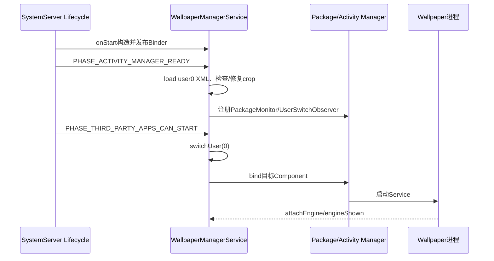
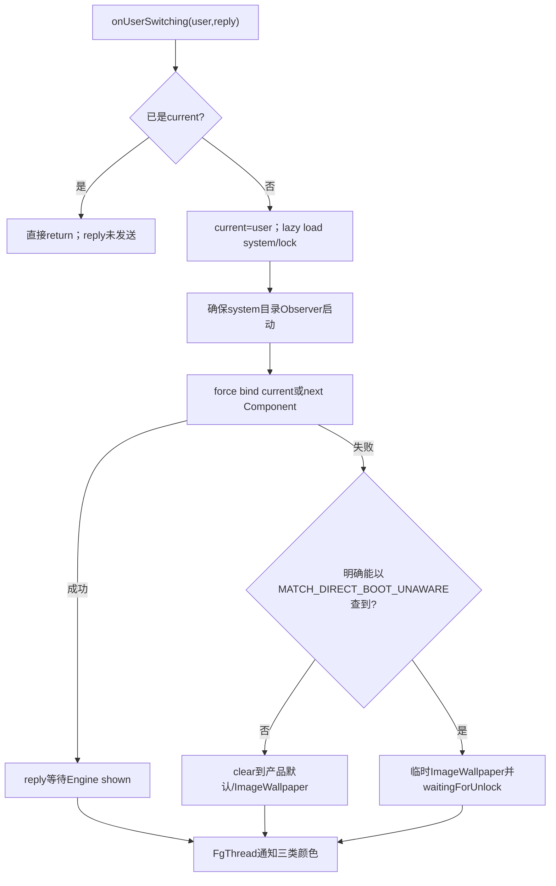

# 第 394 章 Android Wallpaper 用户切换：Direct Boot、临时回退、Observer 与解锁收敛链

> 源码基线：Android 11 / API 30 / `android-11.0.0_r48`。本章只在 macOS 阅读源码，不编译。重点是区分“壁纸文件在锁定阶段可读”和“第三方WallpaperService是否Direct-Boot-aware可启动”，并追踪用户切换reply究竟由目标动态壁纸还是临时ImageWallpaper完成。

## 1. 服务很早发布Binder

Lifecycle.onStart从可overlay的class name反射构造实现并publish `wallpaper` Binder；完整状态初始化要等后续boot phase。

## 2. 构造期缓存组件

读取ImageWallpaper Component、产品默认Component，取得WMS/PackageManager/AppOps/DisplayManager并发布WallpaperManagerInternal。

## 3. Display listener也在构造期注册

使用null Handler，回调线程由DisplayManager注册语义决定；内部再以mLock保护连接/DisplayData。

## 4. PHASE_ACTIVITY_MANAGER_READY

调用systemReady/initialize：注册PackageMonitor、创建user0目录、加载user0 XML/文件并保证system WallpaperData存在。

## 5. PHASE_THIRD_PARTY_APPS_CAN_START

才调用switchUser(user0)，真正绑定ImageWallpaper或第三方动态Service；加载状态与运行组件分两个阶段。

## 6. 为什么不能更早绑定第三方

应用进程/包生命周期尚未允许启动时强行bind会失败；boot phase把system_server内存初始化与应用Service拉起隔离。

## 7. 壁纸目录

`getUserSystemDirectory(userId)` 是 `/data/system/users/<id>` 历史系统目录，系统在用户凭据解锁前能读取其壁纸状态。

## 8. 目录API已deprecated

Environment注释建议新服务考虑system_ce/system_de以支持快速wipe；Wallpaper r48仍沿用历史路径格式兼容。

## 9. 文件可读不代表Service可启动

静态source/crop/XML属于system管理数据；非Direct-Boot-aware动态应用在用户锁定时仍不能由AMS正常运行。

## 10. user0首次load

解析wp/kwp、恢复next component、ID、crop/colors等；connection仍null，直到switchUser。

## 11. 静态crop启动修复

load新建WallpaperData时crop缺失且source存在会generateCrop；systemReady又对ImageWallpaper检查一次，仍缺会再次尝试。

## 12. 两次仍失败

clearWallpaperLocked(false,SYSTEM,user0)回产品default/ImageWallpaper，防启动后长期无可显示crop。

## 13. 动态组件不要求crop

next不是ImageWallpaper时systemReady“gracefully ignoring”静态文件缺失，等待第三方Service运行。

## 14. 启动总时序



## 15. UserSwitchObserver

systemReady向ActivityManager注册observer；onUserSwitching得到newUserId和IRemoteCallback，交给switchUser。

## 16. reply的含义

ActivityManager希望壁纸准备后继续用户切换；reply被存到新WallpaperConnection，通常等Engine.engineShown发送。

## 17. duplicate user边界

switchUser发现mCurrentUserId已等于userId就直接return，没有发送传入reply；正常AMS不应重复触发，异常调用可能让等待方靠外部超时。

## 18. 先更新current user

锁内先 `mCurrentUserId=userId`，再load/绑定；后续bind逻辑因此会detach旧mLastWallpaper并把新账设为当前。

## 19. lazy load其他用户

`getWallpaperSafeLocked` 发现Map无记录才load XML/文件；服务不在boot时一次读取所有用户。

## 20. system账必建

load失败/首次用户也new system WallpaperData并ensure sane，保证切换总有可回退状态。

## 21. lock账选择

Map有独立lock就用于后续lock颜色通知；没有则局部变量直接指向system WallpaperData。

## 22. Observer延迟启动

仅在用户真正switch到前台时，若systemWallpaper.wallpaperObserver==null才new并startWatching。

## 23. 提前查询不启动Observer

hasNamedWallpaper等可lazy load后台user，但不会监听其目录，直到该user成为当前。

## 24. 一个Observer看整个用户目录

虽然挂在system WallpaperData字段上，它同时识别system与lock source文件；lock WallpaperData通常没有独立Watcher。

## 25. switchWallpaper强制bind

目标优先wallpaperComponent，否则nextWallpaperComponent，并传force=true，确保新用户实际建立自己的进程/Connection。

## 26. 旧用户何时detach

bindService请求被接受后，bindWallpaperComponentLocked看到当前user与mLastWallpaper，detach上一用户运行连接。

## 27. 新bind前旧壁纸可能短暂存在

旧连接直到新bindService返回true才detach；若目标校验/绑定立刻失败，switchWallpaper走回退而不是先无条件清旧。

## 28. bind接受不等Engine shown

reply仍挂在Connection；用户切换完成点可能晚于switchUser方法返回。

## 29. switch后颜色异步

退出mLock后向FgThread post system、lock、fallback三次颜色通知/提取，避免主线程用户切换被Bitmap分析阻塞。

## 30. shared状态可重复通知

lock局部变量与system是同一对象时，会先以SYSTEM、再以LOCK通知同一颜色；监听器需按which幂等处理。

## 31. 无listener时颜色早退

FgThread仍执行函数，但第392章的listener检查可避免实际解码。

## 32. 用户切换主流程图



## 33. 正常Package查询为何会失败

锁定user下这次普通getServiceInfo/bind不能得到可运行的unaware Service（具体flags还会由PackageManager按用户状态规范化），所以目标会查询失败或无法绑定。

## 34. 第二次探测

失败后以MATCH_DIRECT_BOOT_UNAWARE精确查询原Component；查得到说明包/Service存在，只是锁定阶段不可用。

## 35. si==null的解释

组件真不存在、被卸载/禁用或不是单纯unaware问题，服务clear system到默认，而不无限等解锁。

## 36. aware成功路径

Service声明directBootAware且依赖的DE数据可用，就像普通bind一样启动；无需临时ImageWallpaper。

## 37. aware实现责任

标志只允许启动，不保证代码不访问CE文件；若Engine自己读credential-encrypted数据仍可能崩溃/黑屏。

## 38. unaware临时对象

new WallpaperData使用该user目录和lock文件名，ensure cropHint sane，但不放入mWallpaperMap/mLockWallpaperMap。

## 39. 为什么不改永久Map

临时对象只承载ImageWallpaper Connection；永久system账必须继续记住用户选的动态Component，解锁后恢复。

## 40. “假装已绑定”

永久wallpaper.wallpaperComponent被赋为nextWallpaperComponent，避免锁定期间某次save把临时ImageWallpaper写成永久选择。

## 41. current/next分叉边界

赋的是next，不一定等于前面选择的cname；典型XML加载场景二者吻合，复杂重绑状态要分别检查。

## 42. 临时对象会成为mLastWallpaper

bind ImageWallpaper时user==current且它不等于全局mFallbackWallpaper，因此正常更新mLastWallpaper为临时账。

## 43. 这里不是多屏fallback

它服务“当前用户锁定且动态组件unaware”；全局mFallbackWallpaper服务“主动态组件不支持非默认display”。

## 44. 临时ImageWallpaper画什么

SystemUI通过当前user的WallpaperManager读取system crop；若没有有效静态crop则可回产品默认图。临时WallpaperData的lock文件字段并非Renderer直接读取路径。

## 45. reply仍传给临时Connection

临时ImageWallpaper engineShown即可完成ActivityManager用户切换，不会等到用户输入凭据后目标动态壁纸出现。

## 46. 用户体验语义

锁定阶段先有安全可用背景，解锁后再切用户选择；reply表示当前阶段壁纸已显示，不表示永久组件已运行。

## 47. mWaitingForUnlock是全局boolean

不是per-user SparseBooleanArray；它只描述当前显示用户是否处于临时回退。

## 48. 每次switch先清false

进入switchWallpaper立即mWaitingForUnlock=false，只有unaware分支最后再true，避免上一用户状态带入下一用户。

## 49. 快速切换用户

A设true后切B会清false；A后台解锁不会触发恢复。以后切回已解锁A时正常bind应直接成功。

## 50. Direct Boot状态图

```mermaid
stateDiagram-v2
    [*] --> LoadedLocked: XML保留用户目标
    LoadedLocked --> DesiredRunning: 目标Direct-Boot-aware且bind成功
    LoadedLocked --> TemporaryImage: 目标存在但unaware
    LoadedLocked --> Default: 目标已失效
    TemporaryImage --> DesiredRunning: 当前user onUnlockUser重试成功
    TemporaryImage --> Default: 解锁重试仍失效
    TemporaryImage --> SwitchedAway: 切到另一user清全局waiting
    SwitchedAway --> DesiredRunning: 以后已解锁再切回
```

## 51. onUnlockUser入口

SystemService只转发user解锁事件；WPMS没有独立onStartUser/onStopUser处理。

## 52. 只处理current user

锁内要求mCurrentUserId==userId；后台用户解锁不改变当前屏幕Connection，也不做本段restorecon。

## 53. waiting才重切

若mWaitingForUnlock为true，取永久system WallpaperData并再次switchWallpaper。

## 54. 重入锁安全

onUnlockUser已持mLock，switchWallpaper内部再次synchronized同一对象；Java intrinsic lock可重入。

## 55. switch开头清waiting

解锁重试先false；若仍被判断unaware/失败，可再次true或clear默认。

## 56. 临时连接被detach

目标bind请求接受后detach mLastWallpaper（临时ImageWallpaper），再把永久system账Connection设为current。

## 57. 解锁不带用户切换reply

调用switchWallpaper(...,null)，不会等待Engine shown才返回onUnlockUser。

## 58. 立即发一般变化通知

重切后调用notifyCallbacksLocked(systemWallpaper)，时点是bind请求/回退处理完成，不是目标首帧。

## 59. 解锁颜色不在这里显式通知

新动态Engine attach会request colors并上报；一般callback与颜色callback仍是两条链。

## 60. restorecon集合

对source/crop、lock source/crop和wallpaper_info.xml五个文件逐一检查存在并SELinux.restorecon。

## 61. 为什么解锁时重标

历史move/restore可能留下错误label；解锁不是文件首次可见的必要条件，而是方便的低时延修复时点。

## 62. restorecon移后台线程

先在mUserRestorecon把user标true，再向BackgroundThread post，避免阻塞解锁主链。

## 63. 标志早于成功

restorecon返回值被忽略，且标记在任务执行前写入；本次失败不会因下一次onUnlock自动重试。

## 64. 只对当时存在文件

任务遍历时不存在就跳过；之后新建/移动文件依赖设置/Observer路径各自restorecon。

## 65. mUserRestorecon生命周期

进程内每user一次；用户删除时delete该key，服务重启后自然清空。

## 66. Observer切走后不会停止

switchUser只为新user启动Watcher，没有停止旧user Watcher；曾经前台的多个user目录可继续被监视。

## 67. 这样做的好处

系统/备份跨用户修改已加载目录时仍能裁剪、通知和持久化，不必等下次切回。

## 68. 资源代价

用户越多、都曾切换过，FileObserver与WallpaperData长期保留越多；只在用户删除时清。

## 69. 后台user文件事件

Observer仍可generateCrop/save；sys source提交还会bind ImageWallpaper Connection，即便user不是current。

## 70. 后台bind不会替换屏幕

bindWallpaperComponentLocked只在wallpaper.userId==mCurrentUserId时detach mLast/update mLast，故后台Connection不成为当前显示。

## 71. 但仍可能占资源

后台ImageWallpaper Service binding/Connection可存在，需结合跨用户设置与包生命周期诊断。

## 72. set/clear对非current不对称

clear system在删文件后遇到noncurrent直接return不bind；新静态写的Observer路径没有同样早退，会bind。

## 73. 用户删除广播

systemReady注册ACTION_USER_REMOVED receiver，读取EXTRA_USER_HANDLE调用onRemoveUser。

## 74. user0不可删除

`if (userId < 1) return` 同时保护system user和无效负ID。

## 75. stopObserversLocked

停止system和lock对象上的Watcher（后者通常null），然后从两个Map移除。

## 76. 未显式detach Connection

该方法不调用detachWallpaperLocked；通常用户移除前已切走、AMS/包进程清理会收尾，但单看WPMS存在残留Connection边界。

## 77. 删除五个文件

在mLock内逐个File.delete，返回值不检查；目录本身由用户删除基础设施自动清理。

## 78. XML tmp未列入

sPerUserFiles只有real wallpaper_info.xml，不含 `.tmp`；用户目录整体删除会处理，单独onRemoveUser显式循环不会删tmp。

## 79. 清restorecon状态

mUserRestorecon.delete(userId)，防userId未来重用时误认为已修label。

## 80. 颜色listener没有随user remove显式清

mColorsChangedListeners另有user键，本段onRemoveUser未删除；Remote callbacks依Binder死亡/服务生命周期，可能留空或旧组合。

## 81. PackageMonitor覆盖ALL users

initialize以UserHandle.ALL注册，包更新/移除可处理各user当前/next壁纸组件。

## 82. 包更新与Direct Boot竞态

ServiceDisconnected与PackageMonitor通知同Looper可能先后不定，崩溃恢复代码用延迟/两次死亡规则降低误判；详细在第396章。

## 83. shutdown标志

ACTION_SHUTDOWN把mShuttingDown=true；Connection重连timeout看到它就不把关机中的Service停止误判为崩溃。

## 84. shutdown不主动保存

receiver只置布尔；持久化依每次变化即时save，不在关机集中flush全部状态。

## 85. onRemove与当前用户假设

代码没有在onRemoveUser里纠正mCurrentUserId；系统用户管理层应先切到合法user再发送删除。

## 86. user目录mkdir

initialize只显式mkdir user0；其他user写壁纸时updateWallpaperBitmapLocked按需mkdir并设权限。

## 87. lazy只读用户目录

加载不存在文件不一定创建目录；首次写才确保。

## 88. migrateFromOld固定user0

每个首次WallpaperData load都可能调用历史迁移函数，但内部路径固定user0；它不是多用户通用迁移。

## 89. 系统服务反射失败

Lifecycle捕获Exception并Slog.wtf，mService为空时boot/unlock回调跳过；Binder服务也不会发布。

## 90. 线程分工

onUserSwitching通常AMS主线程回调→WPMS锁内load/bind；颜色去FgThread；restorecon去BackgroundThread；远端Engine在目标进程主/Worker。

## 91. 锁内耗时边界

load XML、PackageManager Binder、bind与某些crop路径都可能在mLock内，用户切换卡顿需按trace“switch-user-N”分段定位。

## 92. TimingsTraceAndSlog

switchUser/onUnlockUser建立trace section，即使return/异常也在finally traceEnd，便于系统启动性能分析。

## 93. reply成功不带结果

IRemoteCallback.sendResult(null)，无字段说明desired还是temporary、是否WCG或颜色完成。

## 94. 旧Connection reply兜底

detachWallpaperLocked若旧mReply仍存在会先sendResult(null)，防已被替换的壁纸让用户切换永远等待。

## 95. 临时fallback bind失败

switchWallpaper没有检查第二次bind mImageWallpaper的boolean，却仍mWaitingForUnlock=true；reply可能无人完成，需靠外部用户切换超时。

## 96. permanent字段与临时运行态分叉

dumpsys可见永久system component指向第三方，而mLastWallpaper可能是临时ImageWallpaper对象；这是预期Direct Boot过渡。

## 97. XML在锁定期保存风险的处理

通过“假装component为next”避免把临时组件写入wp；但其他字段仍可在锁定期间被save。

## 98. 静态壁纸Direct Boot最简单

ImageWallpaper自身是系统aware组件且crop位于system目录，可在解锁前直接显示。

## 99. 产品默认不走同一探测链

XML缺component在load时已归一化为ImageWallpaper，正常switch通常有明确cname；clear路径传null才由bind内部选择产品default，但它不经过switchWallpaper后续对原cname的MATCH_DIRECT_BOOT_UNAWARE临时判定，不能把两条路径混为一谈。

## 100. fallback默认图颜色

用户切换后FgThread也通知mFallbackWallpaper颜色；无监听早退，有监听时缓存默认图颜色。

## 101. shared lock颜色

system/lock局部变量相同仍分别发送which，使Keyguard/Launcher主题各自更新，而不复制颜色对象。

## 102. user unlock和file observer竞态

解锁重bind与后台restorecon可和文件CLOSE_WRITE/MOVED_TO交错；mLock保护内存账，文件/SELinux操作没有共同generation。

## 103. 诊断锁定阶段显示默认图

查目标Service directBootAware、普通getServiceInfo失败后UNAware是否可查、mWaitingForUnlock和mLastWallpaper是否临时ImageWallpaper。

## 104. 诊断解锁后没换回

查onUnlockUser是否针对current user、waiting是否被中途switch清掉、permanent next/current字段、目标bind与notifyCallbacks日志。

## 105. 诊断用户切换卡住

区分duplicate same-user未reply、目标/临时Engine未shown、第二次Image bind失败和旧reply detach兜底。

## 106. 诊断后台用户占资源

列出曾切换user的Observer与WallpaperData、后台文件事件和非current Connection；不能只看mLastWallpaper。

## 107. 诊断label问题

看mUserRestorecon是否已提前置true、BackgroundThread任务执行结果、文件是否任务后才创建，以及Observer是否对新文件restorecon。

## 108. 诊断user removed仍有回调

onRemove只删Map/Watcher/五文件，不清颜色listener容器且不显式detach；结合Binder/AMS user cleanup判断残留。

## 109. 安全组件设计

需要锁定前显示就声明directBootAware并只读DE/系统可用数据；否则接受临时静态背景，解锁回调后再启动CE依赖。

## 110. 本章恢复模型

持久选择始终留在per-user system账，当前运行可临时分叉；user switch建立运行态，unlock把分叉收敛，remove回收账和文件。

## 111. 本章只读练习说明

下面恰好四个练习都只在macOS读r48源码，不编译；每项记录currentUser、mLastWallpaper、永久Map、temporary对象、waiting和reply六列。

## 112. macOS只读练习一：画boot phase

运行 `sed -n '140,180p;1640,1755p' frameworks/base/services/core/java/com/android/server/wallpaper/WallpaperManagerService.java`，标出Binder发布、load、crop修复、第三方可启动与首次bind。

## 113. macOS只读练习二：推演aware/unaware/失效

运行 `sed -n '1844,1912p' frameworks/base/services/core/java/com/android/server/wallpaper/WallpaperManagerService.java`，对三种Component记录reply由谁完成、mLast与永久component分别是什么。

## 114. macOS只读练习三：快速切换再解锁

运行 `sed -n '1793,1830p;1878,1910p' frameworks/base/services/core/java/com/android/server/wallpaper/WallpaperManagerService.java`，推演A-unaware→B-aware→A后台解锁→切回A。

## 115. macOS只读练习四：审用户删除

运行 `sed -n '1755,1843p' frameworks/base/services/core/java/com/android/server/wallpaper/WallpaperManagerService.java`，列出被停止/删除的对象和未处理的Connection、tmp XML、颜色listener。

## 116. 易错结论一：壁纸文件在CE，未解锁不可读

错误。r48存于历史/data/system/users目录；真正常被锁住的是unaware应用Service及其CE依赖。

## 117. 易错结论二：临时ImageWallpaper改写用户选择

错误。它使用独立临时WallpaperData，永久账仍保留第三方Component并在解锁重试。

## 118. 易错结论三：切走user会停止其Observer

错误。Watcher通常保留到user removed，后台文件事件仍可处理。

## 119. 本章复读后的修正

复读后补正四点：同user早退不发送reply；mWaitingForUnlock是全局非per-user；restorecon标志在后台任务成功前就置位；用户删除不显式detach Connection，也不删除wallpaper_info.xml.tmp或颜色listener键。

## 120. 本章结论与下一章入口

Wallpaper多用户运行态是“lazy持久账+当前Connection+可选临时回退”：文件早期可读，unaware动态服务等解锁，reply可由临时画面完成，unlock再收敛。下一章深入多显示：DisplayConnector创建资格、主动态能力、fallback分工、Display增删与尺寸账。
