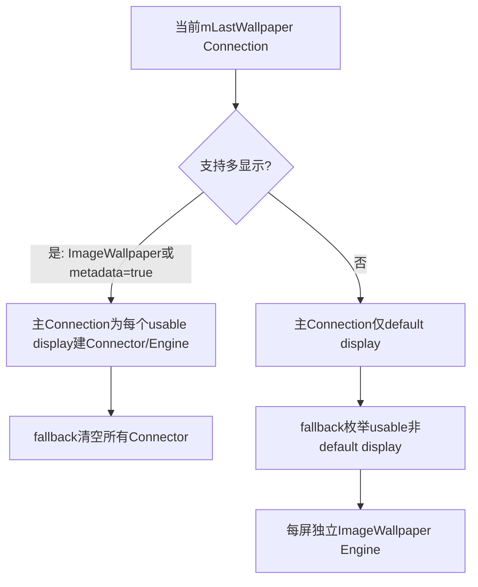
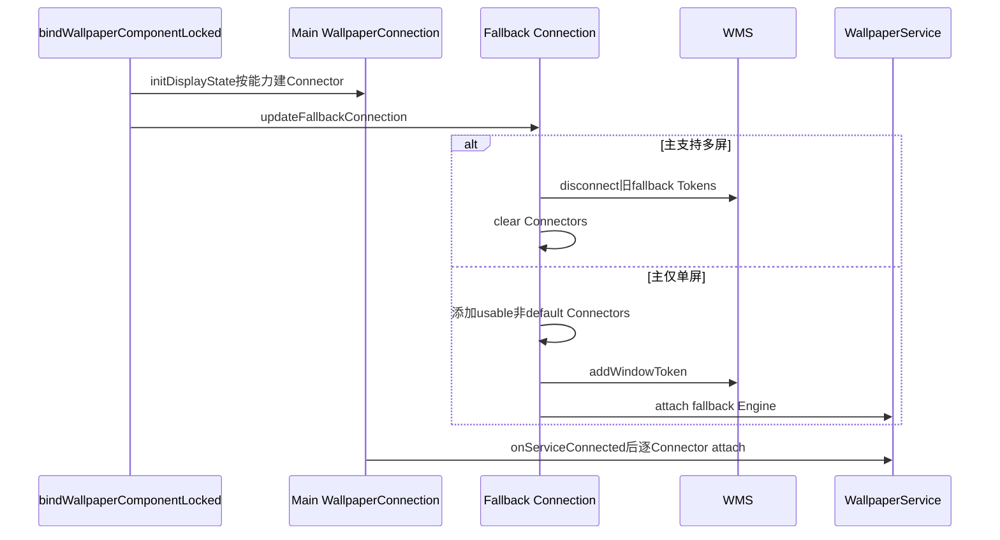
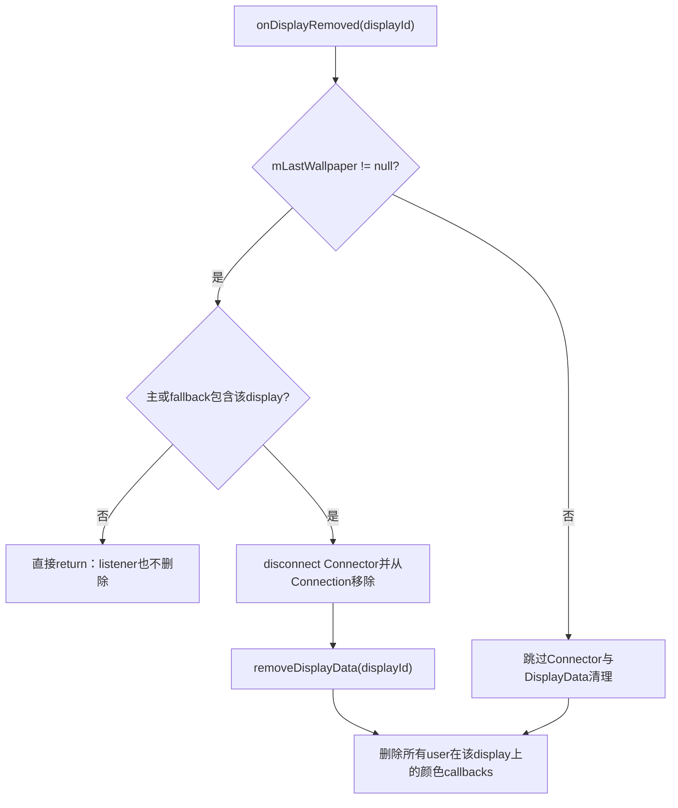

# 第 395 章 Android Wallpaper 多显示：Connector、Fallback、能力资格、尺寸与增删链

> 源码基线：Android 11 / API 30 / `android-11.0.0_r48`。本章只在 macOS 阅读源码，不编译。多显示不是“同一Engine自动复制到所有屏”：每个可用display都有DisplayConnector、WMS Token和Engine实例；不支持多屏的主动态组件只占默认屏，其他屏由system user的fallback ImageWallpaper补位。

## 1. 三层多显示对象

DisplayManager提供Display，WallpaperConnection持每display Connector，WallpaperService为每次attach创建Engine；三层ID必须一致。

## 2. Connector保存什么

`mDisplayId`、独立Binder window token、IWallpaperEngine，以及尺寸/padding延迟补发标志。

## 3. 每屏独立Token

Connector.connectLocked先向WMS添加TYPE_WALLPAPER Token，再把同Token和displayId交给IWallpaperService.attach。

## 4. 一个Connection可多Engine

同一动态Service进程可收到多个attach，每屏返回一个Engine；组件内部资源共享需自行同步。

## 5. supportsMultiDisplay入口

Connection非null且mInfo==null，或WallpaperInfo.supportsMultipleDisplays为true，才算支持。

## 6. mInfo null的特殊含义

WPMS把它解释为ImageWallpaper，而不是“metadata解析失败的普通动态组件”；普通组件校验失败根本不会建Connection。

## 7. metadata只是声明

`supportsMultipleDisplays` 来自应用wallpaper XML，系统不预运行测试；错误声明会把多个Engine压力交给应用。

## 8. 单屏动态组件

initDisplayState不枚举显示，只无条件加入DEFAULT_DISPLAY Connector。

## 9. 多屏组件

枚举DisplayManager当前所有display，用isUsableDisplay逐个筛选并建立Connector。

## 10. fallback不在构造时初始化Connector

mFallbackWallpaper的Connection被initDisplayState明确跳过；它的Connector由主壁纸能力确定后按需填充。

## 11. 为什么需要fallback

主动态组件不支持多显示时，外接屏仍可能需要系统装饰/背景；ImageWallpaper作为稳定内置实现填其他合格display。

## 12. fallback是谁的账

initializeFallbackWallpaper固定new system user WallpaperData，绑定ImageWallpaper、allowBackup=false并生成独立ID。

## 13. 分工总图

## 14. fallback运行在哪个user

其WallpaperData.userId固定0，bindServiceAsUser也以system user启动ImageWallpaper，不随当前secondary user重建。

## 15. fallback画面来源

ImageWallpaper在user0上下文读取system静态crop/默认图；它不是把当前user的第三方动态画面截图复制到外屏。

## 16. 多用户视觉边界

当前非system user使用单屏动态壁纸时，外屏fallback可能仍是system user静态/产品默认内容；这是全局fallback设计的结果。

## 17. 第一项可用条件

Display不能为null，并且 `display.hasAccess(mClientUid)`；mClientUid是壁纸组件包在目标user中的UID。

## 18. 为什么看Service UID

实际接收display、创建窗口和渲染的是WallpaperService，不是发起选择的Launcher/system_server调用者。

## 19. 私有VirtualDisplay

若目标Service UID无访问权，即使声明supportsMultipleDisplays也不会得到Connector。

## 20. default display特例

通过hasAccess后，displayId==DEFAULT_DISPLAY直接usable，不再询问系统装饰策略。

## 21. 非默认第二条件

调用WindowManagerInternal.shouldShowSystemDecorOnDisplay；只有显示系统装饰的屏才需要系统壁纸。

## 22. 身份清除

查询WMS策略前clearCallingIdentity，finally恢复，避免沿用壁纸应用或Binder入口身份。

## 23. fallback用自己的UID筛选

updateFallbackConnection调用fallbackConnection.isUsableDisplay，因此访问判断基于SystemUI/ImageWallpaper UID，不基于主第三方组件UID。

## 24. 两种资格不要混

主组件可能无权访问某私有display，而fallback有权；若主声明多屏，代码不会因此自动把该遗漏display转给fallback，因为fallback被整体清空。

## 25. “支持多屏”是Connection级分支

一旦主Connection supportsMultiDisplay=true，fallback全部撤出；未通过主isUsable筛选的屏可能没有任何壁纸。

## 26. Connector初始化时点

主Connection在bind请求建立时就initDisplayState，此时mService尚未onServiceConnected；只建账，不立刻attach。

## 27. onServiceConnected

attachServiceLocked遍历已有Connector，每个connectLocked添加WMS Token并发oneway attach。

## 28. fallback何时更新

bind主Connection末尾 `updateFallbackConnection()`，根据新主能力创建/移除fallback Connector。

## 29. 主支持多屏时

fallback只要有Connector，就对已有Engine逐个disconnect，然后直接clear整个SparseArray。

## 30. Engine为null的Connector

清理循环只disconnect非null Engine；随后clear。若Token已add但Engine尚未attach，因engine==null不会remove Token，存在窗口Token残留边界。

## 31. 主不支持时

fallback枚举所有display，筛usable、排除DEFAULT_DISPLAY、排除已有Connector，再追加缺项。

## 32. 然后连接未连接项

遍历fallback Connector，mEngine==null就connectLocked；若Service尚未connected只日志，后续fallback onServiceConnected会再attach已有列表。

## 33. 重复connect风险

connectLocked本身不检查Token是否已添加或attach请求是否在途；正常生命周期保证调用一次，重复display-ready/竞态可能重复add/attach。

## 34. Connection建立时分工图

## 35. DisplayManager onDisplayAdded为空

WPMS监听器不在add事件立即attach，因为Display/WMS政策可能尚未ready。

## 36. 真正ready入口

DisplayPolicy在Handler上调用WallpaperManagerInternal.onDisplayReady(displayId)，LocalService再进onDisplayReadyInternal。

## 37. ready但mLast为空

直接return；稍后主壁纸bind时initDisplayState会枚举已经存在的display，仍有机会补上。

## 38. 主支持多屏的ready

在主Connection getDisplayConnectorOrCreate，重新做usable检查；成功就connect。

## 39. 主单屏的ready

转交全局fallback Connection get/create/connect，不让第三方主组件收到新display。

## 40. ready路径未显式排除default

主单屏时fallback getDisplayConnectorOrCreate对default也可成功；正常default ready早于mLast建立而return，后续异常重复ready可能让fallback竞争default。

## 41. onDisplayChanged为空

显示配置/装饰策略改变不会在这里重新分配Connector；Window/Engine自身会收到尺寸/Surface变化，但资格集合不自动重算。

## 42. decor策略动态变化

若shouldShowSystemDecorOnDisplay从true变false，仅onDisplayChanged不足以撤销旧fallback Connector，可能保留到remove或主Connection切换。

## 43. onDisplayRemoved持锁清理

优先判断display属于mLast还是fallback，找到target后disconnect Engine/Token、remove Connector和DisplayData。

## 44. containsDisplay只看账

Connector存在不代表Engine已attach或窗口已绘制；removed仍按账选择清理对象。

## 45. getDisplayConnectorOrCreate在remove时

因为contains已为true，返回既有Connector，不会因DisplayManager已删display而重新资格失败。

## 46. disconnect顺序

先WMS removeWindowToken(removeWindows=false)，再oneway engine.destroy并置mEngine=null；远端Engine稍后移除自己的Window。

## 47. removeWindows=false

Token移除不在这一调用强制删所有窗口，给Engine destroy生命周期自行收尾；display本身删除也会由WMS统一清理。

## 48. removed清颜色listener

对所有user/USER_ALL的display callback列表执行delete(displayId)，不逐callback通知“display gone”。

## 49. removed早return缺口

mLast存在但display不在主/fallback Connector时 `targetWallpaper==null return`，整个方法提前结束，颜色listener与DisplayData都不清。

## 50. mLast为空缺口

会继续删除颜色listener，但不调用removeDisplayData；只有找到连接target的路径才删尺寸账。

## 51. 提示创建但无Connector

setDimensionHints可为合法display创建DisplayData，即使当前壁纸Service无权使用；display移除时若不在Connector，数据可能残留。

## 52. DisplayData结构

每display一份width、height、padding，初始宽高-1，创建时ensure sane。

## 53. 不是per-user

mDisplayDatas是服务全局SparseArray；不同user对同display设置提示会覆盖同一对象。

## 54. 与XML的矛盾式历史设计

只有default DisplayData被写进每user wallpaper_info.xml，但运行内存只有一份default对象；用户切换/懒load会互相覆盖或沿用。

## 55. 已加载用户不重读尺寸

切回Map中已有WallpaperData时getSafe不再load XML，因此当前default DisplayData未必恢复该user上次持久值。

## 56. base size

ensureSane取Display.getMaximumSizeDimension，让初始width/height至少为横竖方向中的最大边。

## 57. invalid display fallback

getMaximumSizeDimension找不到ID会日志并改用DEFAULT_DISPLAY；多数公开API在创建DisplayData前已isValidDisplay拒绝。

## 58. 默认display失效假设

若连DEFAULT_DISPLAY也取不到，随后getMaximumSizeDimension会NPE；framework假设主屏始终存在。

## 59. setDimension权限

需要SET_WALLPAPER_HINTS并通过isWallpaperSupported AppOp；不检查isSetWallpaperAllowed，因为它改显示提示而非替换图片。

## 60. 先clamp最大纹理

width/height先min(GLHelper max texture)，再检查>0；负值保持负并最终IllegalArgumentException。

## 61. 请求过小可暂时接受

新DisplayData初始至少baseSize，但setter可把它改为正数1；本次不再次ensure sane。

## 62. 重启后会抬高

default XML加载末尾ensureSane会把过小值提高到baseSize，所以同样的1在运行期与重启后结果不同。

## 63. invalid请求也可能lazy load

锁内先getWallpaperSafeLocked，再检查width/height和display；错误参数可能先触发用户状态加载。

## 64. 只持久化default

displayId==0才saveSettingsLocked(calling user)；外接屏hint/padding重启丢失。

## 65. 非current user

更新全局DisplayData并可保存其default XML，然后立即return，不向当前Engine发送。

## 66. 全局覆盖副作用

后台user设置同display提示会改当前user共享内存值，即使return不通知Engine；以后别的事件读取会看到新值。

## 67. Connector资格与hint分离

公开API只要求display存在，不要求当前Connection能isUsable；因此可存一份永远没有Engine消费的hint。

## 68. Engine已attach

oneway setDesiredSize后notifyCallbacksLocked；RemoteException吞掉，仍不回滚DisplayData。

## 69. Service连接但Engine未回

Connector存在且mService非null时置mDimensionsChanged；attachEngine后ensureStatusHandled补发最新值。

## 70. Service尚未连接

不置pending标志，但首次connectLocked读取当前DisplayData作为attach参数，所以不会丢。

## 71. ensureStatusHandled

先dimensions、后padding，远调失败也把布尔清false，没有自动重试。

## 72. Engine Binder是oneway

调用返回只表示事务排队，不等WallpaperService主线程已执行onDesiredSizeChanged/onDisplayPaddingChanged。

## 73. setPadding校验

四边必须非负，Rect相等才no-op；对象内容复制进DisplayData，不保留调用者Rect引用。

## 74. padding传播逻辑

与dimension相同：default持久化、noncurrent早退、Engine立即发或Connector标pending。

## 75. getWidth/Height权限语义

只验证display存在；若calling user的mWallpaperMap尚无账返回0，不会lazy load，即使全局DisplayData已存在。

## 76. 同一display不同user返回差异

Map已加载的user可读全局当前值，未加载user返回0；并非真正per-user hint隔离。

## 77. Engine初始尺寸

connectLocked getDisplayDataOrCreate，并把width/height/padding直接放进IWallpaperService.attach。

## 78. ImageWallpaper fixed size

第391章ImageWallpaper随后按Bitmap尺寸setFixedSize，WMS desired hints主要用于offset/业务回调，不等于其最终Surface固定尺寸。

## 79. 动态Engine可读desired

getDesiredMinimumWidth/Height读取Wrapper attach/更新值，应用可据此画可滚动背景。

## 80. 多屏不同density

每Engine有display context和独立Surface尺寸，组件不能把default display px/dp计算直接复用到外屏。

## 81. attachEngine回调

Connection按displayId get/create Connector；display不可用则destroy传来的Engine并return。

## 82. Engine可能主动报错display

受信WallpaperService拿Connection Binder并传displayId；服务会重新isUsable，避免任意私有屏接入。

## 83. 重复attach覆盖

若同display已有mEngine，r48直接赋新引用，不先destroy旧Engine；正常每Connector只attach一次，错误Service可泄漏旧实例。

## 84. attach后补状态

ensureStatusHandled，然后支持ambient的default Engine收当前状态，再requestWallpaperColors。

## 85. 颜色按Connector路由

notifyWallpaperColorsChanged遍历连接的display；fallback有独立WallpaperData颜色，但主多屏动态仍共享一个primaryColors字段。

## 86. getColors显示选择

findWallpaperAtDisplay先看fallback Connection containsDisplay；因此单屏动态的外屏颜色取fallback，default取主system。

## 87. contains不等于可见

Connector账存在即选择fallback颜色，即使Engine尚未attach/绘制，可能先返回缓存/默认色。

## 88. 主切为多屏

fallback Connector被清，findWallpaperAtDisplay随即回主system；颜色listener需接新主Engine各屏上报。

## 89. 主切为单屏

fallback新增外屏并连接ImageWallpaper，颜色通知可能触发默认图提取。

## 90. fallback不是backup内容

allowBackup=false、对象不写某个当前user的kwp/wp；它是运行时补位，不是用户选择。

## 91. fallback ID

初始化时生成一个服务级ID，但不同display共用；不代表各屏内容独立版本。

## 92. fallback crop字段

指向user0 system source/crop；但ImageWallpaper仍通过其user Context/WallpaperManager读system图，二者在正常user0路径一致。

## 93. 多屏移除时颜色Map

正常连接display移除会清所有user该display callback列表，客户端Globals却仍可能认为自己已registered，无法自动重注册到其他display。

## 94. display重新使用同ID

旧listener/Data未清的异常路径可能污染新display；正常remove target路径会删Connector/Data/listener。

## 95. onDisplayChanged无重算尺寸

rotation/分辨率变化由WMS relayout与Engine SurfaceChanged处理；desired hint只在显式setter或新DisplayData sane时变化。

## 96. max texture是设备GL值

setDimensionHints统一clamp，不按每display GPU区别；同一进程/设备通常共享上限。

## 97. DisplayConnector遍历倒序

forEach从size-1到0；多屏attach/notify顺序按SparseArray key倒序，API不承诺视觉先后。

## 98. SparseArray append假设

DisplayManager枚举通常按ID递增；代码用append，若非递增SparseArray内部仍会退化为put语义实现细节，不应依赖顺序。

## 99. detach主壁纸

遍历所有Connector disconnect，清SparseArray、Service null、Connection null，并移除重连任务。

## 100. fallback清理与主detach不同

updateFallbackConnection只按能力移除fallback display连接，不unbind整个fallback ImageWallpaper Service，便于未来再补位。

## 101. 主多屏部分失败

一个display attach失败时，如果整个Connection尚无任何Engine且非更新中，可能bind默认组件；已有其他屏Engine则只让该屏缺失。

## 102. oneway异常局限

connectLocked catch只能看发送oneway事务的Binder传输失败，远端Wrapper内部异常不会同步触发此回退。

## 103. 诊断外屏无壁纸

查主supportsMulti、主Service UID hasAccess、shouldShowSystemDecor、fallback是否被整体清空和onDisplayReady是否到达。

## 104. 诊断外屏显示user0图

主组件不支持多屏时这是fallback system-user设计；不是当前user WallpaperData被错误查询的唯一可能。

## 105. 诊断hint重启丢失

非default从不写XML；default还受全局DisplayData、多user加载与ensure baseSize影响。

## 106. 诊断display移除后残留

检查display是否从未属于主/fallback Connector触发target null早退，以及mLast为空时DisplayData未删。

## 107. 诊断Engine没收到新padding

区分Service未连接（attach会带当前值）、连接未attach（pending）、Engine已attach但oneway/RemoteException，以及Connector本身因资格为null。

## 108. 诊断颜色路由

先看display在fallback还是main Connector，再看primaryColors是否per-display共享，最后检查客户端Globals单注册问题。

## 109. 组件开发建议

只有真正支持并测试多Engine/多density/独立Surface生命周期才声明supportsMultipleDisplays；否则让系统fallback处理外屏。

## 110. 本章模型

“能力”决定主/补位分工，“资格”决定单屏能否建Connector，“ready”触发Token/attach，“DisplayData”传提示；四层任一缺失都可能无画面。

## 111. 本章只读练习说明

下面恰好四个练习只在macOS读r48源码，不编译；每项记录display、主/fallback Connector、Token、Engine、DisplayData、颜色listener六列。

## 112. macOS只读练习一：枚举四类display

运行 `sed -n '1030,1275p' frameworks/base/services/core/java/com/android/server/wallpaper/WallpaperManagerService.java`，分别推演default、公开外屏、私有VirtualDisplay、无system decor外屏。

## 113. macOS只读练习二：主能力切换

运行 `sed -n '1038,1070p;2634,2775p' frameworks/base/services/core/java/com/android/server/wallpaper/WallpaperManagerService.java`，画单屏动态→多屏动态→ImageWallpaper时fallback Connector变化。

## 114. macOS只读练习三：找display remove泄漏

运行 `sed -n '800,840p;980,1028p' frameworks/base/services/core/java/com/android/server/wallpaper/WallpaperManagerService.java`，让一个仅有DisplayData/listener而无Connector的display被移除，记录早退结果。

## 115. macOS只读练习四：跨user尺寸提示

运行 `sed -n '2050,2185p;2950,2980p' frameworks/base/services/core/java/com/android/server/wallpaper/WallpaperManagerService.java`，让user0/user10交替设置default和display2提示，标出内存覆盖与XML持久差异。

## 116. 易错结论一：声明多屏后fallback补所有遗漏屏

错误。主Connection一旦supportsMulti，fallback整体清空；主组件仍须通过每屏access/decor资格。

## 117. 易错结论二：onDisplayAdded立即创建Engine

错误。该回调为空，WMS DisplayPolicy ready或后续Connection枚举才连接。

## 118. 易错结论三：DisplayData按user隔离

错误。内存按display全局，只有default值被写进各user XML，切换时存在覆盖/沿用边界。

## 119. 本章复读后的修正

复读后补正四点：fallback固定system user；ready单屏分支未显式排除default；remove target-null会连listener清理一起跳过；fallback能力切换只对已有Engine的Connector调用disconnect，Engine尚未attach但Token已加入的在途Connector可能残留Token。

## 120. 本章结论与下一章入口

多显示壁纸是Connector级资源分配：组件能力决定主/fallback，UID access与system decor决定资格，ready建立Token/Engine，DisplayData传提示但并非per-user。下一章研究包更新、Service死亡、重连timeout与崩溃回退。
