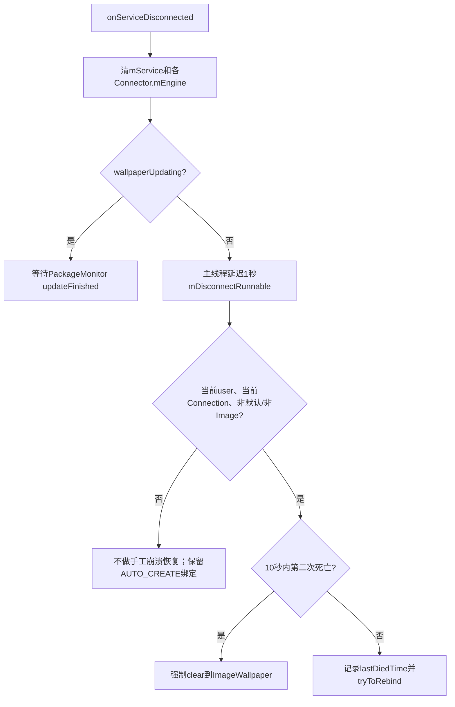

# 第 396 章 Android Wallpaper Service 死亡、包更新、重绑超时与崩溃回退链

> 源码基线：Android 11 / API 30 / `android-11.0.0_r48`。本章只在 macOS 阅读源码，不编译。重点不是背“崩溃后会重启”，而是分清四条路径：原绑定自动重连、WPMS主动强制重绑、PackageMonitor更新重绑、最终强制回到ImageWallpaper。

## 1. 为什么本章容易读错

Service进程死亡、APK替换、组件禁用和强制停止都会让壁纸消失，但它们进入的回调、延迟、默认目标和持久化结果不同。

## 2. 两个参与者

ActivityManager维护`bindServiceAsUser`绑定与Service进程；WallpaperManagerService（WPMS）保存WallpaperData、Connection、Connector和崩溃时间。

## 3. WallpaperConnection身份

它同时实现`ServiceConnection`和`IWallpaperConnection.Stub`：前者接收AMS连接生命周期，后者接收远端WallpaperService的Engine/颜色/首帧回调。

## 4. 绑定带AUTO_CREATE

`BIND_AUTO_CREATE`意味着远端进程被杀后，旧ServiceConnection绑定通常仍有效；Service重新运行时可再次收到`onServiceConnected`。

## 5. 断连不等于解绑

`onServiceDisconnected`文档明确说绑定仍保留；WPMS此时没有立刻`unbindService`，先进入延迟判断。

## 6. 绑定永久死亡是另一回调

APK更新可能触发`onBindingDied`，它要求调用者解绑再绑；r48 WallpaperConnection没有覆写它，使用接口默认空实现。

## 7. null binding也是空实现

若WallpaperService的`onBind`返回null，系统会回调`onNullBinding`；r48同样没覆写，因此这两种情形主要依赖包监控或其他切换收敛。

## 8. 三个Runnable

`mDisconnectRunnable`判断一次断连是否算崩溃，`mTryToRebindRunnable`每秒重试失败的bind，`mResetRunnable`监督已接受bind是否在10秒内真正连上。

## 9. 两个10秒不是同一计时器

`MIN_WALLPAPER_CRASH_TIME=10000`判断两次断连是否太近；`WALLPAPER_RECONNECT_TIMEOUT_MS=10000`限制重绑恢复时间。

## 10. 还有一个1秒

`onServiceDisconnected`延迟1秒跑断连判断，给同一Looper上可能稍晚到达的“包正在更新”广播留窗口。

## 11. 使用uptimeMillis

崩溃窗口和重绑窗口均用`SystemClock.uptimeMillis()`，深度睡眠时间不计入，不是墙上时钟的10秒。

## 12. 四条恢复主线

普通第三方崩溃、系统默认/ImageWallpaper崩溃、APK替换和组件永久消失，必须分别推演。

## 13. 总状态图



## 14. 断连第一步

回调持`mLock`记录日志，即使回调的ComponentName与当前WallpaperData.component不等也只报错，不因此提前return。

## 15. 清Service代理

`mService=null`阻止后续把Connector当成仍可attach的远端Service。

## 16. 清每屏Engine引用

所有`connector.mEngine`直接置null；这里没有调用`engine.destroy`，因为远端进程已经失联。

## 17. Token此时不删除

断连回调不调用Connector.disconnectLocked，所以WMS Token仍留着；后续重连/主动重绑/清壁纸再决定资源收敛。

## 18. 为什么不立即清默认壁纸

进程暂时被杀可能由内存压力或包替换造成，立刻清会把一次可恢复故障变成永久用户选择变化。

## 19. 只跟踪仍是当前Connection的对象

断连时先判断`mWallpaper.connection == this`；旧Connection迟到的回调不能操作已经切换的新壁纸。

## 20. 更新中不投递断连任务

若`wallpaperUpdating=true`，预期旧APK退出，交给更新完成回调重新验证和绑定。

## 21. 广播竞态的双保险

即使断连时flag还是false而已投递任务，1秒后Runnable会再次检查`!wallpaperUpdating`，更新开始若已到达就能拦住误判。

```java
// onServiceDisconnected() 中先做一次判断
if (!mWallpaper.wallpaperUpdating) {
    mContext.getMainThreadHandler().postDelayed(mDisconnectRunnable, 1000);
}

// 一秒后的 mDisconnectRunnable 中还会再判断
if (!mWallpaper.wallpaperUpdating
        && mWallpaper.userId == mCurrentUserId
        && !Objects.equals(mDefaultWallpaperComponent, wpService)
        && !Objects.equals(mImageWallpaper, wpService)) {
    // 才进入第三方壁纸的崩溃处理
}
```

## 22. 但1秒不是绝对保证

若包更新广播异常迟到超过1秒，第一次断连仍可能先记`lastDiedTime`并尝试重绑；代码靠“两次近距离死亡才立即重置”进一步降误伤。

## 23. mDisconnectRunnable再验代际

Runnable首先比较`this == mWallpaper.connection`；期间用户或组件已切换，就只记debug日志并结束。

## 24. 仅处理当前用户

要求`mWallpaper.userId == mCurrentUserId`；后台用户WallpaperData的断连不会触发本手工崩溃回退。

## 25. 默认组件豁免

当前组件等于`mDefaultWallpaperComponent`时不进入两次崩溃规则，避免产品内置默认动态壁纸被自己回退逻辑反复替换。

## 26. ImageWallpaper豁免

内置静态`mImageWallpaper`也被排除，否则“回退目标自身崩溃”会递归再次clear到自己。

## 27. 豁免不代表没有恢复

它们仍保留AUTO_CREATE绑定，AMS可以重新拉起并回调同一Connection；只是WPMS不启动`lastDiedTime/tryToRebind/reset`这一套监督。

## 28. fallback也落入Image豁免

多显示fallback固定绑定ImageWallpaper，因此其进程断连不会走第三方两次崩溃回退。

## 29. 第一次有效死亡

若`lastDiedTime==0`或旧时间距现在不少于10秒，写入当前uptime并调用`tryToRebind`。

## 30. 成功连接不清lastDiedTime

源码没有在`onServiceConnected`把它置0；因此第一次后10秒内再次死亡会被视为连续崩溃，稳定超过窗口后下一次才覆盖旧时间。

## 31. 第二次有效死亡

条件是旧时间非0且`lastDiedTime + 10000 > now`，严格小于10秒；恰好等于边界不算“窗口内”。

```java
if (mWallpaper.lastDiedTime != 0
        && mWallpaper.lastDiedTime + MIN_WALLPAPER_CRASH_TIME
        > SystemClock.uptimeMillis()) {
    clearWallpaperLocked(true, FLAG_SYSTEM, mWallpaper.userId, null);
} else {
    mWallpaper.lastDiedTime = SystemClock.uptimeMillis();
    tryToRebind();
}
```

## 32. 第二次直接强制清

调用`clearWallpaperLocked(true, FLAG_SYSTEM, userId, null)`，`defaultFailed=true`明确跳过产品默认组件，直接绑定ImageWallpaper。

## 33. 为什么不是普通默认

当前故障组件可能本来就是配置默认；强制ImageWallpaper提供最小、内置、静态的最终兜底。

## 34. 第二次路径不写崩溃EventLog

r48只在`tryToRebind`耗尽窗口的else分支写`WP_WALLPAPER_CRASHED`；近距离第二次死亡直接clear，没有同一条EventLog写入。

## 35. clear会改变长期状态

它清source/crop（存在时）、重置颜色与pending，并强制bind ImageWallpaper；Service连上后组件写入XML，重启不会自动回到崩溃的第三方组件。

## 36. tryToRebind第一道门

进入后再次持锁检查`wallpaperUpdating`；若更新开始已到达就return，不再安排自己的重试，等待updateFinished接管。

## 37. 强制绑定同一组件

调用`bindWallpaperComponentLocked(wpService, true, false, ...)`；`force=true`绕过“组件没变就直接成功”的快捷分支。

## 38. 主动重绑会换Connection

成功的bind请求创建new WallpaperConnection；对当前壁纸先detach旧Connection，再把WallpaperData.connection指向新对象。

## 39. detach清哪些延迟任务

移除旧Connection的reset、disconnect和tryToRebind Runnable，同时unbind、断开各Connector Token/Engine并清Connector数组。

## 40. bind返回true的含义

只表示包/权限/metadata校验通过且`bindServiceAsUser`接受请求；不表示`onServiceConnected`已来，更不表示Engine首帧。

## 41. 接受bind后启动监督

`mWallpaper.connection.scheduleTimeoutLocked()`针对刚换上的新Connection投递10秒`mResetRunnable`。

## 42. bind立即失败的含义

Service不存在、权限/metadata不合格或AMS拒绝绑定会返回false，尚没有新Connection可等待。

## 43. 失败每秒重试

只要`now-lastDiedTime < 10000`，主线程Handler延迟1秒再次运行`mTryToRebindRunnable`。

## 44. 重试间隔与总窗口

窗口起点是第一次有效断连记录的lastDiedTime，不是每次bind失败时重置；所以最多约10秒而非无限续期。

## 45. 主动重绑时序

```mermaid
sequenceDiagram
    participant D as mDisconnectRunnable
    participant W as WPMS
    participant A as AMS
    participant C as New WallpaperConnection
    D->>W: lastDiedTime=uptime; tryToRebind
    W->>A: bindServiceAsUser(force same component)
    alt bind请求被接受
        W->>W: detach old Connection
        W->>W: 安装new Connection并调度10秒reset
        A-->>C: onServiceConnected
        C->>W: attach all display Connectors
        C->>W: remove reset/rebind callbacks
    else bind立即失败
        W->>W: 10秒内每隔1秒重试
    end
```

## 46. mResetRunnable监督什么

它监督“bind请求接受却迟迟没有onServiceConnected”的黑屏情形，与bind立即false的每秒重试分支不同。

## 47. reset运行线程

`scheduleTimeoutLocked`把它投到`FgThread.getHandler()`，而断连和重试Runnable投到system_server主线程Handler；状态最终都在`mLock`下串行。

## 48. reset的两个豁免

关机时直接忽略；`wallpaperUpdating`或WallpaperData已非当前user时也不clear。

## 49. reset超时目标

同样调用`clearWallpaperLocked(true, FLAG_SYSTEM, ...)`强制ImageWallpaper，但该分支不写`WP_WALLPAPER_CRASHED`。

## 50. onServiceConnected先验代际

只有`mWallpaper.connection == this`才接受Binder；被替换旧Connection的迟到连接不会覆盖新Service代理。

## 51. 连接成功后的动作

保存`IWallpaperService`代理、遍历Connector执行attach、非fallback保存当前user XML，然后取消reset和每秒rebind任务。

## 52. 它不删除mDisconnectRunnable

同一AUTO_CREATE Connection若在1秒内自动重连，先前断连任务仍可能执行并记录这次真实死亡；主动force重绑则detach旧Connection时会删除旧任务。

## 53. 自动重连与主动重绑可交错

旧绑定由AMS自动恢复，同时1秒后WPMS可能再force bind；代际比较和detach避免旧Connection最终覆盖新账，但会造成额外启动/解绑工作。

## 54. 再attach会遍历原Connector

自动重连同一Connection保留Connector账并再次调用connectLocked；断连阶段没有移Token，而connectLocked仍会请求addWindowToken并attach，r48无显式“已add”状态位。

## 55. Engine引用重建

远端Service每display创建新Engine并通过`attachEngine(engine, displayId)`回填；旧Engine Binder引用已在断连时清空。

## 56. onServiceConnected先保存XML

代码在Engine真正attach/首帧前就保存非fallback组件，因此持久化成功点仍早于画面成功。

## 57. tryToRebind耗尽窗口

bind持续返回false且窗口已过时，强制ImageWallpaper并写崩溃EventLog，组件名被截到最大日志长度。

## 58. EventLog不是每次死亡日志

普通断连有Slog，只有“连续bind失败耗尽”进入`EventLogTags.WP_WALLPAPER_CRASHED`；不能用该Atom计数所有Crash。

## 59. clear失败的最后状态

若ImageWallpaper本身配置不存在/不合法，`clearWallpaperLocked`记录“Default wallpaper component not found”，clear组件连接并发送reply，系统可能暂时无壁纸。

## 60. 更新监控注册范围

`MyPackageMonitor.register(... UserHandle.ALL, true)`监听所有用户和外部应用变化，但每个回调先要求`mCurrentUserId == getChangingUserId()`。

## 61. PackageMonitor线程

注册时Looper传null，基类选`BackgroundThread.getHandler()`；它不是WPMS主线程，但所有共享状态仍进入`mLock`。

## 62. 更新开始来自REMOVED replacing

PackageMonitor遇`ACTION_PACKAGE_REMOVED`且`EXTRA_REPLACING=true`时调用`onPackageUpdateStarted`，这不是永久卸载。

## 63. 更新开始只关心当前组件包

当前user WallpaperData存在、wallpaperComponent非null且包名匹配，才把`wallpaperUpdating=true`。

## 64. 同时取消reset

若Connection存在，移除FgThread上的`mResetRunnable`，避免正常APK替换的连接空窗被10秒监督误清。

## 65. 没取消哪些任务

updateStarted不显式移除disconnect/rebind Runnable；但二者执行时都会检查`wallpaperUpdating`并return。

## 66. 更新中Service断连

onServiceDisconnected清mService/Engine引用，却因flag true不投递新的disconnect任务；旧WMS Token暂时保留到finish主动detach。

## 67. 更新完成来自ADDED replacing

PackageMonitor按顺序调用`onPackageUpdateFinished`、`onPackageModified`，最后还会`onSomePackagesChanged`。

## 68. finish先清flag

匹配当前组件包时设置`wallpaperUpdating=false`，让新版本能够进入正常绑定/故障处理。

## 69. finish先清组件连接

`clearWallpaperComponentLocked`先把`wallpaperComponent=null`，再detach旧Connection，完成unbind、Token和三个Runnable清理。

```java
wallpaper.wallpaperUpdating = false;
clearWallpaperComponentLocked(wallpaper);
if (!bindWallpaperComponentLocked(wpService, false, false, wallpaper, null)) {
    clearWallpaperLocked(false, FLAG_SYSTEM, wallpaper.userId, null);
}
```

## 70. 仍保留旧ComponentName局部变量

清账前已保存`wpService`，随后用它重新执行完整ServiceInfo、BIND_WALLPAPER、wallpaper metadata与ambient权限校验。

## 71. finish绑定不是force

调用`bindWallpaperComponentLocked(wpService, false, false, ...)`；因为component已置null且Connection已detach，不会命中changingToSame快捷返回。

## 72. 更新后bind失败

若新APK删除/禁用Service、改坏权限或metadata，日志说明“不再可用”，然后`clearWallpaperLocked(false, FLAG_SYSTEM, ...)`。

## 73. false与true回退差异

这里`defaultFailed=false`，先尝试产品配置的默认壁纸组件；只有默认配置为null才选ImageWallpaper，与Crash监督强制true不同。

## 74. 更新完成重绑提前持久化

新Service的`onServiceConnected`才保存组件XML；finish时bind仅接受并不等最终连上，而且这条bind没有主动schedule 10秒reset。

## 75. 更新finish可能无监督黑屏

若`bindServiceAsUser`返回true却永远不回onServiceConnected，updateFinished路径本身没有调用`scheduleTimeoutLocked`；需依赖后续系统连接生命周期，而非tryToRebind的10秒监督。

## 76. onPackageModified做什么

只对当前组件包调用`doPackagesChangedLocked(true, wallpaper)`；更新finish已成功重绑时它通常只验证ServiceInfo仍存在。

## 77. modified校验比bind弱

这里仅`getServiceInfo`判断组件是否存在，不重新解析WallpaperInfo metadata或检查BIND_WALLPAPER；单独PACKAGE_CHANGED可能让已运行的不合法新配置继续到下次bind。

## 78. 组件被禁用/删除

若getServiceInfo抛`NameNotFoundException`，立即普通clear到配置默认；nextWallpaperComponent若消失只置null。

## 79. onSomePackagesChanged可能重复检查

同一个ADDED replacing事件在finish/modified后还会调用一次；操作通常幂等，但必须理解回调不是“一次更新一个函数”。

## 80. 永久卸载路径

`isPackageDisappearing`返回`PACKAGE_PERMANENT_CHANGE`时，当前组件被普通clear；不会等待崩溃两次。

## 81. 临时消失也会clear

`doPackagesChangedLocked`把`PACKAGE_TEMPORARY_CHANGE`同样视为需要清理；例如真正force-stop执行或外部应用暂不可用可改变壁纸选择。

## 82. 替换阶段为何不被当卸载

REMOVED replacing只调用updateStarted，PackageMonitor没有把它标成`mSomePackagesChanged`，因此WPMS的`onSomePackagesChanged`不会在半包状态调用clear。

## 83. 包更新恢复图

```mermaid
sequenceDiagram
    participant P as PackageMonitor/BackgroundThread
    participant W as WPMS
    participant O as Old Connection
    participant N as New APK Service
    P->>W: REMOVED replacing / updateStarted
    W->>W: wallpaperUpdating=true; cancel reset
    O-->>W: onServiceDisconnected
    W->>W: 清Service/Engine，不做Crash reset
    P->>W: ADDED replacing / updateFinished
    W->>W: updating=false; clear component; detach old
    W->>N: 重新完整校验并bind
    alt bind失败
        W->>W: clear(false)到配置默认
    else Service连接
        N-->>W: onServiceConnected并重新attach各屏
    end
```

## 84. force-stop查询有doit参数

`ACTION_QUERY_PACKAGE_RESTART`先以`doit=false`询问是否有受影响对象；`ACTION_PACKAGE_RESTARTED`再以true执行。

## 85. 当前组件查询阶段不清

命中current package会令`changed=true`，但只有`doit=true`才调用clear，这使系统能先得到“会受影响”的回答。

## 86. next组件的查询副作用

nextWallpaperComponent命中disappearing时直接置null，没有受`doit`保护；仅查询force-stop也可能修改下一组件账。

## 87. 返回值漏算next

`changed`只在当前component命中时置true；若只命中next，代码虽把next清null却可能返回false，是r48边界缺口。

## 88. wallpaperUpdating不是包级集合

它是每个WallpaperData的boolean；PackageMonitor基类虽有updatingPackages集合，但r48相关代码注释掉添加，不由WPMS查询使用。

## 89. 只检查current user的后果

后台用户APK被卸载/更新时其WallpaperData可能保留旧ComponentName；切换到该用户后`switchWallpaper`绑定失败，再走Direct Boot判定或clear收敛。

## 90. fallback不在mWallpaperMap查询结果里

包监控取`mWallpaperMap.get(mCurrentUserId)`，不会直接重建独立`mFallbackWallpaper`；ImageWallpaper fallback主要依赖其AUTO_CREATE绑定及其他主壁纸切换时的updateFallbackConnection。

## 91. default组件更新的特殊组合

它在PackageMonitor更新finish中会detach/rebind，但普通disconnect崩溃规则将它豁免；“更新恢复”和“运行期Crash恢复”政策不同。

## 92. ImageWallpaper包更新

若它正是当前system WallpaperData组件，更新监控会处理当前账；独立fallback账仍没有单独的finish分支。

## 93. mShuttingDown只影响reset

关机时`mResetRunnable`不强行拉回默认；disconnect Runnable本身没有同一mShuttingDown判断，但Service生命周期通常由系统关机顺序控制。

## 94. Reply如何收敛

主动detach若旧Connection持`mReply`会发送null并清空，避免用户切换/设置调用永远等；Crash恢复传入reply通常为null。

## 95. 颜色不会由断连立即重提取

onServiceDisconnected只清Service/Engine，不清`primaryColors`或广播颜色；成功新Engine attach后会request颜色。

## 96. 多显示全部共用死亡命运

一个WallpaperService进程承载多Engine，进程断连会把同一Connection所有display的mEngine一起置null，再整体恢复组件。

## 97. 单屏主与fallback相互独立

第三方主Connection崩溃时fallback ImageWallpaper可能继续画外屏；默认屏黑屏恢复不意味着所有display同时无画面。

## 98. attach传输失败的旁路

Connector.connectLocked若RemoteException且当前不是更新、整个Connection尚无Engine，会直接`bindWallpaperComponentLocked(null,false,false,...)`尝试配置默认；它不走lastDiedTime两次规则。

## 99. null解析默认的顺序边界

`changingToSame(null, wallpaper)`发生在null被解析成产品默认组件之前；活动账的wallpaperComponent通常非null，所以即使它本来就是产品默认，也不会因“解析后相同”走快捷返回，而会继续新建绑定。只有Connection存在且wallpaperComponent本身也为null时才会提前返回。

## 100. Service自身destroy与进程死不同

WallpaperService正常`onDestroy`会逐Engine detach，但只有AMS连接丢失才进入WPMS onServiceDisconnected；不能把Engine.destroy回调等同于进程Crash。

## 101. “重绑成功”的四个层级

依次是bind返回true、onServiceConnected、attachEngine、engineShown/真正buffer；reset只覆盖前两层之间的超时，后两层没有本章同等10秒总监督。

## 102. 锁的价值

PackageMonitor在BackgroundThread、ServiceConnection在system_server主线程、reset在FgThread；`mLock`把Connection代际、updating和lastDiedTime检查组成原子决策。

## 103. 锁不能保证远端完成

bind、oneway attach和Engine回调跨进程异步，持锁只保护本地账；“账已切到new Connection”仍可能暂时没有画面。

## 104. 诊断一次闪黑后恢复

按时间找onServiceDisconnected、1秒disconnect判断、AUTO_CREATE onServiceConnected或force bind、每display attachEngine和首帧，而不是只看进程PID重建。

## 105. 诊断突然变静态壁纸

区分10秒内第二次死亡、rebind立即失败耗尽10秒、accepted bind的reset超时和配置默认更新失败；前三类强制Image，更新失败先走产品默认。

## 106. 诊断升级后一直黑

确认updateStarted/Finished用户ID、finish bind返回、onBindingDied默认空实现、onServiceConnected是否到达；特别注意finish accepted bind没有schedule reset。

## 107. 诊断EventLog缺失

两次近距离死亡与accepted-bind reset都会clear却不写`WP_WALLPAPER_CRASHED`，所以EventLog缺失不能证明未触发Crash回退。

## 108. 诊断后台用户异常

包监控和disconnect恢复都过滤current user；切换用户时才可能暴露陈旧component并由switchWallpaper重新判断。

## 109. 开发者建议

升级时保持Service组件名、BIND_WALLPAPER权限和wallpaper metadata连续；Service启动/`onBind`必须可靠，避免bind被接受却永不连接。

## 110. 系统修改建议

若修r48，应重点测试onBindingDied/onNullBinding、updateFinished accepted-bind超时、next在doit=false时被修改，以及所有clear分支的遥测一致性。

## 111. 本章只读练习说明

下面恰好四项，只在macOS阅读r48源码，不编译；每项都画出时间、线程、Connection代际、updating、lastDiedTime与最终组件六列。

## 112. macOS只读练习一：两次崩溃

运行 `sed -n '1140,1395p' frameworks/base/services/core/java/com/android/server/wallpaper/WallpaperManagerService.java`，推演t=0首次死亡、t=2秒连接、t=8秒再死和t=12秒再死的不同结果。

## 113. macOS只读练习二：bind两类失败

同读`tryToRebind`与`mResetRunnable`，分别模拟`bindServiceAsUser=false`和返回true但没有`onServiceConnected`，标出每秒retry与FgThread reset的差别。

## 114. macOS只读练习三：APK替换竞态

运行 `sed -n '330,465p' frameworks/base/core/java/com/android/internal/content/PackageMonitor.java` 和 `sed -n '1480,1585p' frameworks/base/services/core/java/com/android/server/wallpaper/WallpaperManagerService.java`，排列disconnect先到、updateStarted先到两种序列。

## 115. macOS只读练习四：force-stop查询缺口

运行 `sed -n '1548,1630p' frameworks/base/services/core/java/com/android/server/wallpaper/WallpaperManagerService.java`，让查询包只匹配nextWallpaperComponent，验证doit=false时字段和返回值各是什么。

## 116. 易错结论一：Service断连立刻换默认

错误。先清远端引用、通常延迟1秒判断；第三方第一次有效死亡会尝试重绑，10秒内第二次才立即强制ImageWallpaper。

## 117. 易错结论二：两个10秒是一条超时

错误。一个比较两次死亡间隔；另一个同时约束bind失败重试窗口，并监督已接受bind等待onServiceConnected。

## 118. 易错结论三：包更新失败也强制Image

错误。updateFinished重绑失败调用`clear(false)`，先选产品配置默认；Crash恢复的`clear(true)`才绕过它。

## 119. 本章复读后的修正

复读源码后补正五点：r48未覆写onBindingDied/onNullBinding；成功连接不清lastDiedTime；近距离第二死与reset超时不写崩溃EventLog；updateFinished的accepted bind没有schedule reset；force-stop查询可清next却返回false。

## 120. 本章结论与下一章入口

Wallpaper恢复是“Connection代际+三类Runnable+PackageMonitor”共同状态机：更新用flag接管，普通第三方用两次死亡和10秒重绑，最终才静态兜底。下一章研究Wallpaper备份、restorecon、文件恢复与组件恢复后的代际一致性。
