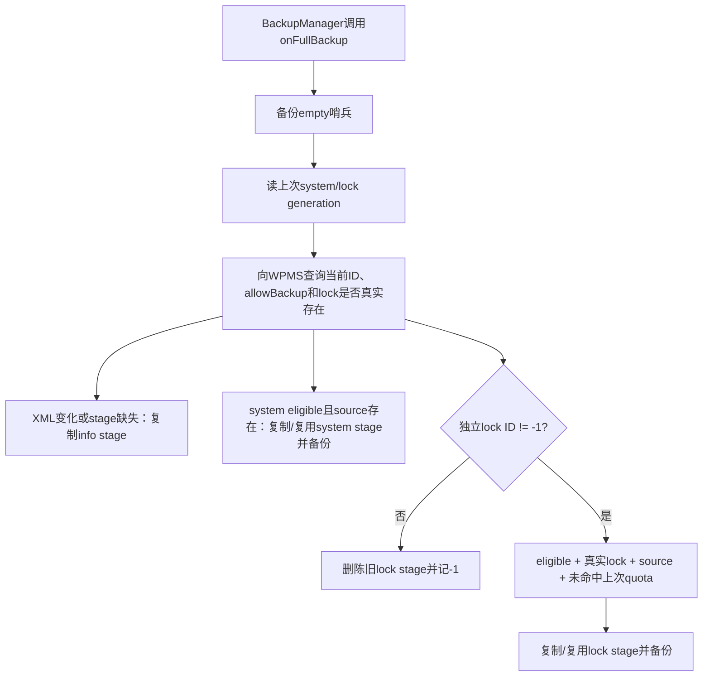
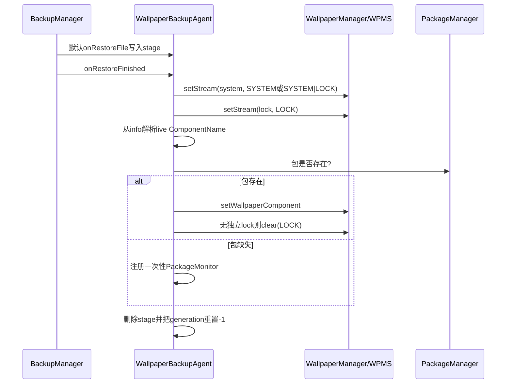
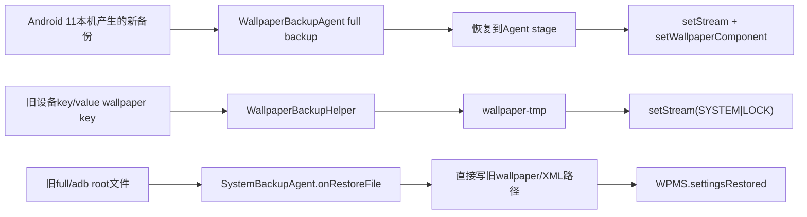

# 第 397 章 Android Wallpaper 备份恢复：Stage、Generation、Quota、静态/动态与延迟组件链

> 源码基线：Android 11 / API 30 / `android-11.0.0_r48`。本章只在 macOS 阅读源码，不编译。Android 11同时保留“现代WallpaperBackup APK”和“SystemBackupAgent兼容旧数据”两套恢复入口，阅读时必须先辨认数据格式。

## 1. 现代实现在哪里

`frameworks/base/packages/WallpaperBackup`是独立系统APK，BackupAgent类为`com.android.wallpaperbackup.WallpaperBackupAgent`。

## 2. 为什么不是WPMS自己上传

WallpaperManagerService（WPMS）拥有状态与权限，BackupAgent负责与BackupManager的full-backup协议、配额、stage和restore生命周期对接。

## 3. Manifest身份

APK使用platform证书、`android.uid.system`共享UID，进程名声明为`system`，BackupAgent允许前台备份且`killAfterRestore=false`。

## 4. fullBackupOnly

现代Agent设置`android:fullBackupOnly=true`；其key/value `onBackup/onRestore`方法只是满足抽象接口，实际为空。

## 5. 只处理system user

`getWallpaperDir()`固定`Environment.getUserSystemDirectory(USER_SYSTEM)`；源码和SystemBackupAgent都留有secondary user TODO。

## 6. 三个源文件

读取`wallpaper_info.xml`、system的`wallpaper_orig`和独立lock的`wallpaper_lock_orig`，不是直接备份显示crop文件。

## 7. 为什么备份original

目标设备尺寸、比例和纹理上限可能不同；恢复原图后通过新设备WPMS重新生成crop更合理。

## 8. 三个stage名

Agent私有files目录内使用`wallpaper-info-stage`、`wallpaper-stage`和`wallpaper-lock-stage`，full backup上传这些副本。

## 9. 注释与实现不一致

注释说“use links as the stage”，r48实际调用`FileUtils.copyFileOrThrow`复制，不是创建硬链接；性能判断应信执行代码。

## 10. 为什么需要stage

WPMS文件可在备份期间继续变化；stage提供一份供full-backup读取的相对稳定副本，并允许generation未变时复用。

## 11. empty哨兵

`empty`文件每次都进入backup，确保没有可备份图像时数据流仍非空，不被preflight当作完全无数据而忽略。

## 12. 两份generation偏好

Agent私有SharedPreferences保存`system_gen`和`lock_gen`，与WPMS的wallpaperId比较决定是否重拷stage。

## 13. 备份全景图



## 14. generation从哪里来

Agent分别调用`getWallpaperIdForUser(FLAG_SYSTEM/LOCK, USER_SYSTEM)`；独立lock账不存在时lock ID为-1。

## 15. ID是内容代际近似

正常set会生成新ID，因此可避免重复复制大图；但它不是文件hash，异常直接改文件或账/文件串代可能骗过缓存。

## 16. stage缺失会强制复制

即使generation相同，只要stage不存在，仍从当前源文件复制，避免偏好还在而缓存文件已被清理时漏备。

## 17. metadata刷新条件

system或lock任一ID变化，或infoStage不存在，就复制当前XML到infoStage。

## 18. metadata上传条件

只要源`wallpaper_info.xml`存在，就调用backupFile(infoStage)；即使图像`allowBackup=false`，XML仍可能上传。

## 19. 元数据包含什么

它包含crop、default display尺寸/padding、颜色、name、backup位和非ImageWallpaper组件名；不包含原图像素。

## 20. allowBackup不是总开关

WPMS的`isWallpaperBackupEligible`只返回目标WallpaperData.allowBackup；现代Agent用它门控system/lock图像，不门控info XML与empty。

## 21. 调用者限制

WPMS只允许SYSTEM_UID调用`isWallpaperBackupEligible`，否则抛SecurityException；这与Backup APK的system共享UID配套。

## 22. system图片条件

必须`sysEligible && wallpaper_orig.exists()`；满足后按generation更新stage、上传stage并异步apply新system generation。

## 23. generation何时推进

只有实际走到system图片备份分支才保存当前ID；不合格或源不存在会保留旧generation，后续仍可重试。

## 24. XML与图像不是事务

info可以成功stage/上传，而大图复制或backup随后失败；恢复端必须容忍只有metadata、只有部分stage。

## 25. 锁屏真实存在的三重判断

Agent既看lockGeneration是否-1，又用`getWallpaperFile(FLAG_LOCK)`确认公开语义存在，还检查`wallpaper_lock_orig`物理文件。

## 26. 为什么还查FD

目录里可能留有未使用的lock孤儿文件；`getWallpaperFile`在共享system/lock时返回null，避免把潜伏文件误当当前选择。

## 27. FD立刻关闭

这里只用非null判断存在性，`IoUtils.closeQuietly`立即释放，真正备份仍从固定source路径复制。

## 28. 无独立lock

lockGeneration==-1时，不上传lock stage；若本代发生变化且旧stage存在则删除，并把LOCK_GENERATION记成-1。

## 29. 共享锁屏如何表达

“没有lock stage”本身表示锁屏应跟随system；恢复端据此把system image设置为`SYSTEM|LOCK`。

## 30. lock图像条件

`lockEligible && hasLockWallpaper && source exists && !mQuotaExceeded`同时成立才上传。

## 31. lock generation推进

只有真正备份lock image时写当前ID；被quota或eligibility跳过不会假装已完成。

## 32. broad catch

`onFullBackup`主体catch `Exception`并只记日志，不继续向上抛；Error不在此范围，部分文件可能已写入本轮数据流。

## 33. stage不是原子快照

XML、system、lock逐个复制，期间WPMS仍可set新壁纸；generation在复制前读取且最后无复验，三者可能跨代。

## 34. SharedPreferences apply异步

generation更新用`apply()`，进程异常退出可能让备份数据已写但偏好未落盘；下次多复制一次通常安全。

## 35. quota回调

BackupManager调用`onQuotaExceeded(actual, quota)`时，Agent在私有files目录创建`quota`哨兵并写一个字节。

## 36. quota只影响下一轮

本轮超额发生后无法撤回已提交项；下次onCreate看到哨兵才令`mQuotaExceeded=true`。

## 37. 只跳过lock

下一轮仍备份empty、metadata和system，只禁止lock图像，优先保住主屏内容。

## 38. finally删除quota哨兵

无论本轮成功或异常，onFullBackup finally都会删quota文件；若仍超额，BackupManager稍后再次回调并重建。

## 39. 交替尝试策略

因此超额场景可能形成“本轮两图超额→下轮跳lock→再下一轮又尝试两图”的交替，而不是永久禁用lock。

## 40. mQuotaExceeded是onCreate快照

finally删文件不会改变本次内存boolean；同一Agent实例若异常被重复调用onFullBackup，仍可能继续按旧true跳lock。

## 41. 关键备份源码

```java
final boolean sysEligible = mWm.isWallpaperBackupEligible(FLAG_SYSTEM);
final boolean lockEligible = mWm.isWallpaperBackupEligible(FLAG_LOCK);

if (sysEligible && mWallpaperFile.exists()) {
    if (sysChanged || !imageStage.exists()) {
        FileUtils.copyFileOrThrow(mWallpaperFile, imageStage);
    }
    backupFile(imageStage, data);
}

if (lockEligible && hasLockWallpaper
        && mLockWallpaperFile.exists() && !mQuotaExceeded) {
    backupFile(lockImageStage, data);
}
```

## 42. restore先落stage

Agent不覆写`onRestoreFile`，使用BackupAgent默认实现把full-backup条目恢复到自己的stage文件。

## 43. onRestoreFinished统一应用

等所有文件恢复结束，再按stage组合调用WallpaperManager；这比每收到一个文件就立即改屏幕更容易保持顺序。

## 44. 恢复顺序

先system stage，再lock stage，最后解析wp组件并切换动态WallpaperService。

## 45. sysWhich计算

有lock stage时system只设`FLAG_SYSTEM`；没有lock stage时设`FLAG_SYSTEM|FLAG_LOCK`，恢复共享语义。

## 46. stage缺失是合法状态

可能源设备禁止图像备份或没有用户图；restoreFromStage只日志并跳过，不把缺图当异常。

## 47. info缺失会阻止静态应用

即使imageStage存在，restoreFromStage也先解析info里的crop；解析失败返回null，代码不会调用setStream。

## 48. crop默认值

找到目标`wp/kwp`标签但缺某属性时用0；四边全0是empty Rect，传给setStream时转换为null，让目标设备自行选完整图裁剪。

## 49. 找不到标签的微妙结果

parseCropHint初始Rect为0并遍历到EOF；XML可读但没有目标tag时仍返回empty而非null，于是会应用stage并使用null crop。

## 50. setStream允许再次备份

恢复调用固定传`allowBackup=true`，所以新WallpaperData会被标为可备份，不照搬源XML里可能的backup=false。

## 51. setStream不是直接搬文件

它通过WPMS公开设置协议写source、FileObserver生成目标crop、绑定ImageWallpaper、保存新ID并等待completion，沿用第386章链路。

## 52. completion不等像素首帧

WallpaperManager最多等待WPMS设置completion；仍不保证ImageWallpaper Worker已`eglSwapBuffers`。

## 53. 两张图分两次事务

system setStream完成后才执行lock setStream，没有跨两次调用的共同rollback；第二步失败会留下已恢复的system。

## 54. system与lock stage来源可跨代

备份阶段不是原子快照，恢复阶段即使顺序正确也无法知道两个stage是否来自同一用户操作代际。

## 55. 动态组件从XML解析

`parseWallpaperComponent(infoStage, "wp")`读取component属性并`unflattenFromString`；ImageWallpaper在WPMS保存XML时本就不写component，因此结果null代表静态。

## 56. 包存在判断很粗

`servicePackageExists`只调用getPackageInfo检查包，不确认具体Service组件、BIND_WALLPAPER权限、action或metadata仍有效。

## 57. 包存在时设置组件

调用`mWm.setWallpaperComponent(wpService, USER_SYSTEM)`；WPMS随后才做完整组件校验。

## 58. 客户端返回值缺陷延续

r48 WallpaperManager的setWallpaperComponent在Binder无异常时返回true，不反映服务端bind false；BackupAgent也不检查返回值，包内组件已消失可能被误当已应用。

## 59. 动态组件应用前已有静态占位

Agent先恢复image stage，再切live；包有效时最终显示动态壁纸，静态source仍可作为迁移/回退内容。

## 60. 无独立lock时的live语义

`applyToLock=true`，设置live后调用`clear(FLAG_LOCK)`，删除因system stage产生的独立lock账，让live system透到锁屏。

## 61. 为什么先set live再clear lock

set live若当前静态system与lock共享，会先迁移静态图到lock；随后clear lock明确撤掉它，恢复源设备“live同时作为lock”的语义。

## 62. 有lock stage时

`applyToLock=false`，保留已恢复的独立静态锁屏，让live仅作为system。

## 63. 包不存在时不立刻换live

先保留静态stage结果，并注册PackageMonitor，等待对应包安装后再应用组件。

## 64. 为什么killAfterRestore=false

延迟监控只存在Agent进程内存，restore结束后不能立刻杀进程，否则尚未安装的live组件永远没有本监听器接手。

## 65. 监控仍非持久队列

如果进程后来死亡或系统重启，PackageMonitor对象丢失；代码没有把待恢复ComponentName写入独立持久任务。

## 66. 监听所有user

`register(... UserHandle.ALL, true)`，onPackageAdded只比包名、不检查`getChangingUserId`；secondary user同包先安装也可能触发对system user的应用尝试并随后unregister。

## 67. 只比包名

触发后直接set原ComponentName，不先确认该具体Service现已存在；客户端静默成功语义可能让无效组件也消耗唯一机会。

## 68. 恢复期门

onPackageAdded首先调用`isDeviceInRestore`；若已不在setup/deferred personalization，立即unregister且不应用。

## 69. 如何判定恢复期

system user `USER_SETUP_COMPLETE==0`，或`USER_SETUP_PERSONALIZATION_STATE==STARTED`即为true。

## 70. Setting缺失

捕获`SettingNotFoundException`后返回false；下一次任意packageAdded便会注销监控。

## 71. 其他包安装

仍在restore时，包名不匹配就保持监听；不在restore时，无论安装哪个包都会先注销。

## 72. 命中后一次性

调用set组件、按需clear lock，然后无条件unregister；没有校验Engine连接/首帧，也没有第二次安装重试。

## 73. 延迟组件源码

```java
public void onPackageAdded(String packageName, int uid) {
    if (!isDeviceInRestore()) {
        unregister();
        return;
    }
    if (componentName.getPackageName().equals(packageName)) {
        mWm.setWallpaperComponent(componentName);
        if (applyToLock) {
            mWm.clear(FLAG_LOCK);
        }
        unregister();
    }
}
```

## 74. restore finally总清stage

info、system、lock stage无论成功失败都删除，恢复失败后不能靠同一批stage自动重试。

## 75. generation也重置

SharedPreferences用`commit()`同步写system/lock为-1，迫使下一次备份重新评估并重建stage。

## 76. commit结果未检查

返回boolean被忽略；写失败时旧generation可能留下，但stage已删除，stage缺失条件仍会触发重拷。

## 77. 外层catch粒度

onRestoreFinished把两次静态恢复和组件恢复放在一个try；前一步抛Exception会跳过后续步骤，再进入finally删除全部stage。

## 78. setStream的IOException

例如system恢复失败会直接阻止lock和组件应用；代码没有逐项独立catch继续。

## 79. update组件的IOException来源

主要是`clear(FLAG_LOCK)`；若set组件已发生而clear失败，外层只日志，可能留下live system与独立lock占位。

## 80. 现代恢复时序图



## 81. metadata并非原样装回WPMS

现代Agent只从XML读crop与component；不会直接把原ID、颜色、尺寸、padding、name或allowBackup整体写回。

## 82. 新ID由目标设备生成

每次setStream/组件设置沿正常API生成新wallpaperId，避免把源设备ID当目标设备全局代际。

## 83. 多显示信息缺失

XML本来只保存default DisplayData，Backup代码还有multi-display TODO；外屏尺寸/padding和per-display画面语义不会随备份恢复。

## 84. 动态壁纸业务数据不在这里

只恢复组件选择，不备份第三方WallpaperService自身SharedPreferences、下载资源或账号状态；那些取决于该应用自己的备份。

## 85. allowBackup对动态组件的歧义

WPMS字段属于WallpaperData静态图账，切到live时未必清掉旧source/allowBackup；现代Agent可先备份旧静态source，再用XML component恢复live选择。

## 86. info永远优先保留选择线索

即使图片不eligible，component metadata仍可能让目标设备恢复live选择；“禁止备份图像”不等于禁止备份组件名。

## 87. 旧SystemBackupAgent角色

Android 11注释明确：Wallpaper现由独立包处理，SystemBackupAgent只消费旧设备生成的数据，不再用旧Helper生产新壁纸备份。

## 88. WallpaperBackupHelper.performBackup为空

key/value旧Helper不写新数据；restoreEntity只识别历史magic key，把图写到`wallpaper-tmp`后调用公开`setStream(in)`。

## 89. 旧key/value默认语义

`setStream(InputStream)`等价于null crop、allowBackup=true、`SYSTEM|LOCK`，旧数据无法表达独立lock或live组件。

## 90. stage最后删除

无论write/apply结果如何，`wallpaper-tmp`在finally删除；错误只日志，不向旧数据源保留本地重试文件。

## 91. 旧full/adb restore入口

SystemBackupAgent.onRestoreFile只识别root domain中的`wallpaper_info.xml`和旧`wallpaper`路径；其他文件仍传给FullBackup.restoreFile且outFile为null，输入字节会被完整读完并丢弃，不落盘。

## 92. 每个识别文件后调用settingsRestored

它不是等整批完成：恢复metadata或image任一个后，都立即Binder调用WPMS.`settingsRestored()`，文件顺序可影响中间结果。

## 93. settingsRestored调用权限

WPMS只检查callingUid==SYSTEM_UID，异常文本称system process，但代码验证的是UID而非PID。

## 94. legacy固定user0

方法直接load user system、生成新ID、allowBackup=true，明确TODO secondary users。

## 95. legacy恢复live组件

若XML的next component非ImageWallpaper，尝试bind它；失败再bind配置默认，并无现代Agent的“等包安装”监控。

## 96. legacy live分支success过早

无论目标bind和默认bind结果，随后都`success=true`；因此可能继续保存XML但实际上没有可用Connection。

## 97. legacy静态name为空

若`wallpaper.name==""`就认为已有恢复文件可用，generateCrop并force bind next（通常ImageWallpaper）。

## 98. named resource

`name="res:package:type/name"`时可从目标已安装包打开raw resource，同时写source和crop，并sync两个流。

## 99. name为null风险

代码先`"".equals(name)`安全地得到false，随后`restoreNamedResourceLocked`直接调用`wallpaper.name.length()`；损坏/缺属性可触发未捕获NPE越过预期失败返回。

## 100. named restore写两份同字节

它不按目标屏重新裁剪，先把resource原字节同时写source/crop，随后settingsRestored又调用generateCrop，结果取决于Observer与同步调用顺序。

## 101. legacy失败删除目录无力

失败分支调用`getWallpaperDir(0).delete()`而非递归删除，返回值也不检查；目录通常非空，所以并不保证清掉坏文件。

## 102. legacy最后仍保存XML

无论success，末尾重新持锁`saveSettingsLocked(0)`；失败时只把name置空，其他已解析字段可能被持久化。

## 103. 现代与legacy不要混

现代流程通过setStream重建，不调用settingsRestored；legacy direct-file/旧Helper才进入兼容方法。



## 104. 诊断“只恢复了主屏”

先看备份是否因quota跳过lock、源是否有独立lock、lock ID/FD/file三条件及restore stage是否存在，而不是先怀疑Keyguard绘制。

## 105. 诊断“图片没恢复但live恢复了”

图像可能allowBackup=false或源/stage缺失，metadata仍被备份并可恢复component，这是代码允许的组合。

## 106. 诊断“live包装好却没自动恢复”

检查Agent进程是否仍活、设备是否仍在setup/deferred restore、安装发生在哪个user、包名是否匹配，以及具体Service是否真实存在。

## 107. 诊断“恢复后裁剪不同”

目标设备重新使用源cropHint和自身尺寸/纹理限制生成crop；这是跨设备适配，不保证像素级相同。

## 108. 诊断“本轮备份没有lock”

查看上一轮quota sentinel、mQuotaExceeded快照、lock allowBackup、getWallpaperFile结果与source文件，而非只看目录里是否残留lock文件。

## 109. 隐私审计

allowBackup=false只阻止对应source图像，info XML仍含颜色、crop、name与组件名；若产品要求完全不上传，需要额外策略。

## 110. 可靠性改进方向

可为三份stage记录共同generation/hash、逐项恢复隔离异常、持久化待安装组件、按user过滤PackageMonitor，并验证具体Service后再消耗一次性监听。

## 111. 本章只读练习说明

下面恰好四项，只在macOS读r48源码，不编译；每项画“源文件—stage—Backup数据—公开API—WPMS最终账”五列。

## 112. macOS只读练习一：四种eligibility

运行 `sed -n '75,235p' frameworks/base/packages/WallpaperBackup/src/com/android/wallpaperbackup/WallpaperBackupAgent.java`，组合system/lock allowBackup、独立lock和quota，列出实际backupFile调用。

## 113. macOS只读练习二：恢复stage矩阵

运行 `sed -n '235,390p' frameworks/base/packages/WallpaperBackup/src/com/android/wallpaperbackup/WallpaperBackupAgent.java`，分别推演仅info、info+system、三stage、image无info四种输入。

## 114. macOS只读练习三：延迟live安装

运行 `sed -n '390,500p' frameworks/base/packages/WallpaperBackup/src/com/android/wallpaperbackup/WallpaperBackupAgent.java`，模拟system user缺包、secondary user先安装同包和setup已结束三条序列。

## 115. macOS只读练习四：现代/legacy对照

运行 `sed -n '90,220p' frameworks/base/services/core/java/com/android/server/backup/SystemBackupAgent.java` 与 `sed -n '3280,3410p' frameworks/base/services/core/java/com/android/server/wallpaper/WallpaperManagerService.java`，标出谁调用setStream、谁调用settingsRestored。

## 116. 易错结论一：allowBackup=false时什么都不备份

错误。现代Agent仍备份empty，且只要存在就备份info XML；被禁止的是对应原图stage。

## 117. 易错结论二：现代恢复原样覆盖wallpaper_info.xml

错误。默认restore只重建Agent私有stage，随后仅解析crop/component并调用公开WallpaperManager API生成目标设备的新账。

## 118. 易错结论三：live包缺失会永久放弃

不完全正确。现代Agent在restore期注册内存PackageMonitor尝试延迟应用；但它非持久、只比包名且一次性，可靠性有限。

## 119. 本章复读后的修正

复读后补正六点：stage注释称link但实现是copy；metadata不受allowBackup门控；quota只在下一轮跳lock且finally清哨兵；缺tag的可读XML返回empty crop；包存在只检查package；legacy失败的目录delete通常不递归生效。

## 120. 本章结论与下一章入口

现代Wallpaper备份不是复制运行目录，而是用ID缓存stage、按eligibility挑原图、恢复时重走setStream/组件API；legacy路径则保留直接文件兼容。下一章研究WallpaperManager公开缓存、Bitmap加载、默认资源与跨进程FD生命周期。
