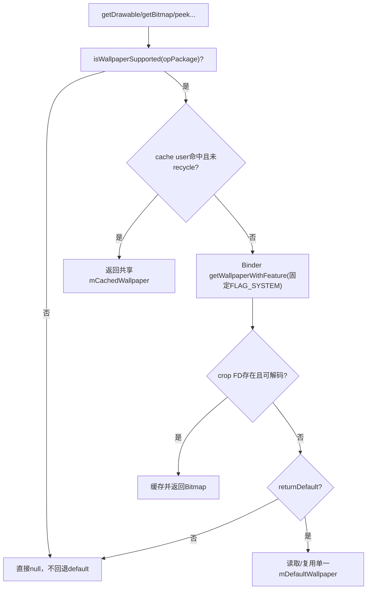
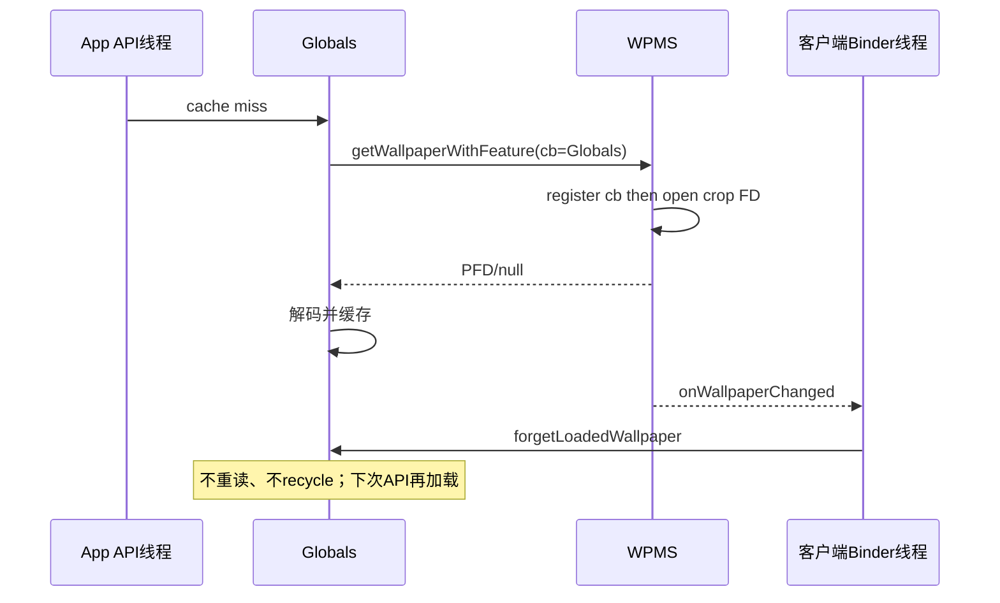
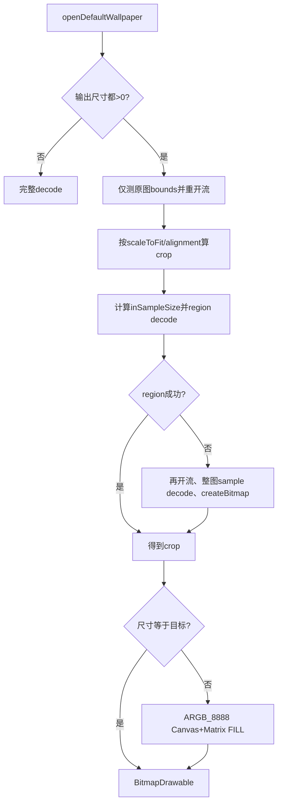

# 第 398 章 Android WallpaperManager 图片缓存、FD解码、默认资源裁剪与Clear语义链

> 源码基线：Android 11 / API 30 / `android-11.0.0_r48`。本章只在 macOS 阅读源码，不编译。客户端`WallpaperManager`不是薄Binder壳：它在进程内共享Bitmap、做权限兼容、全量读FD、颜色空间转换，并有两套含义不同的clear。

## 1. sGlobals是进程级单例

同一应用进程所有WallpaperManager实例共用一个`Globals`，不是每Context一份。

## 2. 首个Context决定Looper

`initGlobals`只在sGlobals为null时创建，颜色回调默认Handler使用第一次初始化传入的main Looper。

## 3. 每实例仍有Context

opPackageName、attributionTag、userId、display与ColorManagementProxy来自本次WallpaperManager实例，和共享cache形成混合所有权。

## 4. 两份Bitmap缓存

`mCachedWallpaper`保存当前静态system crop，`mDefaultWallpaper`保存内置默认静态图。

## 5. 当前缓存只带user键

额外字段只有`mCachedWallpaperUserId`；没有which、hardware、display、density、Context或ColorManagementProxy键。

## 6. default连user键也没有

`mDefaultWallpaper`是整个进程一份，不区分user、which、资源配置或overlay。

## 7. API入口族

getDrawable/getFastDrawable/getBitmap允许默认回退；peekDrawable/peekFastDrawable只看当前；getWallpaperFile直接把FD交给调用者。

## 8. getBuiltInDrawable是独立路径

它每次打开factory default流并按参数裁剪，不使用Globals的current/default Bitmap cache。

## 9. which的隐藏陷阱

`peekWallpaperBitmap(... which ...)`把which用于默认图回退，但`getCurrentWallpaperLocked`写死向服务请求`FLAG_SYSTEM`。

## 10. 因此不能读取当前lock Bitmap

即使调用内部peek传FLAG_LOCK，当前文件阶段仍取system；which只有current读取失败并允许default时才影响默认流。

## 11. wallpaperSupportsWcg受影响

该API接受system或lock，却复用peek；r48对LOCK实际可能检查system Bitmap，不能视为独立lock图的准确结果。

## 12. 总读取图



## 13. support检查在cache之前

每次调用先Binder查询`isWallpaperSupported`；即使内存已有Bitmap，策略变为不支持也直接null。

## 14. service为空

构造DisabledWallpaperManager等场景mService可null，support检查跳过，但getCurrent记录Service未运行并返回null，随后可能读本地default。

## 15. cache命中不复制

返回同一个Bitmap对象；调用者若获得mutable版本并修改像素，会污染本进程后续所有WallpaperManager读取。

## 16. recycle检测

缓存Bitmap已recycle时视为miss并清引用；但调用者recycle共享对象会迫使其他使用者失效甚至在绘制中出错。

## 17. user切换缓存

userId不同时清旧缓存并加载新user；只保留最近一个用户，而此前注册的服务端callback并未注销。

## 18. miss先清userId为0

`mCachedWallpaperUserId=0`只是空状态哨兵；Bitmap非null才算命中，因此不会把user0空cache误当结果。

## 19. hardware参数不在键中

第一次`getBitmap(true)`或`getBitmap(false)`决定缓存解码形态；后续相反请求仍直接返回同一Bitmap。

## 20. mutable与hardware互斥

解码回调`setMutableRequired(!hardware)`；hardware=false强制mutable，hardware=true只是允许ImageDecoder选择硬件配置。

## 21. ColorManagementProxy不在键中

首次解码使用调用实例的display支持色域集合；其他display/context随后共享转换结果。

## 22. 多显示误差

Globals current图片本来也只读system crop且无display参数；外屏fallback或不同显示色域不会生成独立客户端缓存。

## 23. Binder请求参数

传opPackageName、attributionTag、Globals自身callback、固定FLAG_SYSTEM、out Bundle和目标user。

## 24. 服务端先查读图权限

有READ_WALLPAPER_INTERNAL则通过，否则StorageManager按callingPid/uid/package/feature执行read-images权限语义。

## 25. 跨user裁决

`handleIncomingUser`要求合法跨用户权限；客户端hidden getBitmapAsUser并不绕过服务端身份。

## 26. exactly-one which

服务端getWallpaperWithFeature要求精确SYSTEM或LOCK；Globals固定SYSTEM天然满足。

## 27. 服务端不lazy load

从目标Map直接get，system用户账未建立或lock独立账不存在就返回null，不替lock回退system。

## 28. callback注册早于文件检查

服务端先`wallpaper.callbacks.register(cb)`，再检查cropFile.exists；即使本次返回null，后续变化仍可通知客户端失效cache。

## 29. 重复注册不计数

RemoteCallbackList按Binder去重，register同一Globals会先unregister旧项再linkToDeath，不会因多次miss累计引用计数。

## 30. 不显式unregister

Globals没有“停止监听图片变化”API；进程死亡由RemoteCallbackList清理，切换user后同Binder可能留在多个WallpaperData callback表。

## 31. outParams未使用

服务端返回default display desired width/height，但getCurrentWallpaperLocked创建Bundle后不读取，Bitmap尺寸来自实际crop解码。

## 32. 返回的是crop

FD打开`wallpaper.cropFile`只读，而非wallpaper_orig；客户端看到的是WPMS已经面向设备生成的显示图。

## 33. FD所有权

Binder返回ParcelFileDescriptor；客户端包装`AutoCloseInputStream`并用try-with-resources，正常、IOException和多数解码异常都会关闭FD。

## 34. 先完整拷到堆

代码用BufferedInputStream逐字节读入ByteArrayOutputStream，再`toByteArray`创建ImageDecoder.Source。

## 35. 内存峰值

至少可能同时存在ByteArrayOutputStream内部数组、toByteArray副本和解码Bitmap；大crop会造成显著瞬时内存。

## 36. 逐字节不等于逐系统调用

外层BufferedInputStream减少底层read次数，但Java循环仍逐byte执行，CPU效率低于块复制。

## 37. OOM处理

读取或解码中的OutOfMemoryError与IOException被catch，日志后返回null；随后get类API可尝试default。

## 38. SecurityException兼容

targetSdk < O_MR1（27）时吞权限异常并日志；targetSdk>=27重新抛出。

## 39. RemoteException不同

服务死亡被`rethrowFromSystemServer`，不会像OOM/IO一样静默回退default。

## 40. 解码与缓存源码

```java
if (mCachedWallpaper != null && mCachedWallpaperUserId == userId
        && !mCachedWallpaper.isRecycled()) {
    return mCachedWallpaper;
}
mCachedWallpaper = getCurrentWallpaperLocked(context, userId, hardware, cmProxy);

// getCurrentWallpaperLocked() 内部固定读取 system
mService.getWallpaperWithFeature(
        context.getOpPackageName(), context.getAttributionTag(),
        this, FLAG_SYSTEM, params, userId);
```

## 41. 颜色空间策略

ColorManagementProxy从当前Context display读取支持的wide color spaces；源色域不受支持时令ImageDecoder转到sRGB。

## 42. sRGB总被支持

`isSupportedColorSpace`对sRGB直接true，其余必须出现在display支持集合。

## 43. null源色域

被判断为不支持并设置target sRGB，同时打印源ColorSpace；实际ImageDecoder通常能提供解析结果。

## 44. default解码不同

`getDefaultWallpaper`使用BitmapFactory.decodeStream，不经过ColorManagementProxy，也没有hardware/mutable选择。

## 45. default流会关闭

该小路径finally调用`IoUtils.closeQuietly`，与稍后的getBuiltInDrawable资源管理不同。

## 46. default只在current失败后

动态壁纸通常可能没有静态crop或保留旧crop，返回行为取决于Map/crop文件；getDrawable不是动态Engine的截图API。

## 47. 动态壁纸有旧crop时

若旧静态crop仍存在，getWallpaperWithFeature会返回它，即使屏幕正在显示live；因此客户端Bitmap不必等于当前合成画面。

## 48. returnDefault=false

peekDrawable/peekFastDrawable在无可读crop时返回null，不读取factory资源。

## 49. returnDefault=true

getDrawable/getFastDrawable/getBitmap加载factory system default；但support检查false或RemoteException仍可能阻止这一回退。

## 50. default cache未检查recycled

当前cache命中检查`isRecycled`，mDefaultWallpaper返回前没有同样检查；调用者recycle默认Bitmap后可持续拿到recycled对象直到失效。

## 51. default which串扰

单一mDefaultWallpaper不带which；若内部先缓存system default，后续允许default的lock请求可能复用它，尽管`openDefaultWallpaper(LOCK)`应为null。

## 52. onWallpaperChanged

Binder回调不立刻重读，只调用forgetLoadedWallpaper，把current/default两个引用和user ID清空。

## 53. 回调线程

IWallpaperManagerCallback Stub方法运行在客户端Binder线程；forget只持Globals监视器，不向UI直接发消息。

## 54. 任一已注册user变化

同一Globals若曾读多个user并留在各自CallbackList，任何一个WallpaperData变化都清当前最近user的cache，属于过度失效但保证不陈旧。

## 55. 手工forget

公开`forgetLoadedWallpaper()`同样只丢引用，不recycle Bitmap；已有调用者仍可继续持有。

## 56. 为什么不recycle

Bitmap可能仍被Drawable/View使用，Globals无所有权证明；强制recycle会破坏外部绘制。

## 57. config变化不会自动清

default资源overlay/density/night或display色域改变，不一定触发wallpaper callback；单例cache可能跨配置沿用旧解码。

## 58. 失效时序图



## 59. getDrawable包装

用`BitmapDrawable(Resources,bm)`并`setDither(false)`，Bitmap本体仍是共享cache。

## 60. getFastDrawable目标

避免BitmapDrawable的缩放/属性能力，使用定制FastBitmapDrawable直接绘共享Bitmap。

## 61. Fast bounds

构造时bounds等于Bitmap尺寸；后续setBounds只计算居中偏移，不缩放图像。

## 62. SRC合成

Paint设置PorterDuff SRC；drawBitmap把源像素直接覆盖目标区域。

## 63. 不支持属性

setAlpha、setColorFilter、setDither、setFilterBitmap都抛UnsupportedOperationException，不是静默忽略。

## 64. opacity固定OPAQUE

无论Bitmap是否真的含alpha，getOpacity返回OPAQUE；它假设壁纸最终是不透明背景。

## 65. getWallpaperFile不走cache

每次直接Binder请求指定which/user，传cb=null，因此不会注册图片变化callback。

## 66. FD由调用者关闭

文档明确调用者负责；忘记close会泄漏本进程FD，与getBitmap内部自动关闭不同。

## 67. getWallpaperFile可正确读lock

它把调用者which原样传服务端；独立lock不存在返回null，不回退system，和Globals Bitmap固定SYSTEM形成对照。

## 68. hidden权限兼容

同样对target<27吞SecurityException返回null，新应用抛出；非法which在Binder前客户端直接IllegalArgumentException。

## 69. factory system来源优先级

`openDefaultWallpaper(SYSTEM)`先查系统属性路径，文件存在且能打开就用；否则回退framework的`default_wallpaper`资源。

## 70. 路径只查exists

目录或不可读文件也可能exists，FileInputStream失败后被忽略并回退资源。

## 71. factory lock未实现

r48代码整段注释，`openDefaultWallpaper(FLAG_LOCK)`直接返回null。

## 72. 非LOCK值

函数只对`which==FLAG_LOCK`特殊处理；其他值包括非法组合都会按SYSTEM打开，本方法自身不严格校验。

## 73. getBuiltInDrawable先严格校验

该API要求精确SYSTEM或LOCK，因此组合会IllegalArgumentException；LOCK随后因无默认流返回null。

## 74. alignment会clamp

水平/垂直值限制到[0,1]，0靠左/上、0.5居中、1靠右/下。

## 75. 非正输出尺寸

outWidth<=0或outHeight<=0时直接完整decode，不执行裁剪/缩放。

## 76. 正尺寸先测bounds

第一次decode仅`inJustDecodeBounds=true`；宽高为0就返回null。

## 77. 流不能rewind

测量后重新调用openDefaultWallpaper，而不是reset旧流；后续region失败还会第三次打开。

## 78. 不允许放大

outWidth/outHeight分别min输入尺寸，请求比factory图更大只返回至多原图大小。

## 79. scaleToFit=true

`getMaxCropRect`按输入/输出宽高比裁掉多余方向，使用alignment决定裁剪窗口位置，再缩至目标尺寸。

## 80. scaleToFit=false

直接在原图中取outWidth×outHeight像素矩形，alignment决定位置，通常不需要比例缩放。

## 81. roundOut

浮点crop向外取整，保证覆盖目标区域；可能比理想宽高多1像素，最后再精确scale。

## 82. sample计算

用crop宽/目标宽和高比值的较小整数，>1时作为inSampleSize减少region decode内存。

## 83. region优先

BitmapRegionDecoder只解目标区域；失败记录日志并转为整图decode+内存crop。

## 84. fallback坐标缺口

整图fallback若使用inSampleSize，Bitmap尺寸已缩小，但`Bitmap.createBitmap`仍传原图坐标的roundedTrueCrop；可能越界抛IllegalArgumentException，源码未catch。

## 85. 最后强制FILL

crop尺寸仍不等目标时创建ARGB_8888 Bitmap，用Matrix.ScaleToFit.FILL与filter paint绘制。

## 86. 中间Bitmap不recycle

scale产生tmp后只把局部变量crop换成tmp；旧crop等待GC，瞬时内存可同时包含两张。

## 87. getBuiltInDrawable流泄漏

r48方法多次打开BufferedInputStream，却没有finally/close；正常完整decode、bounds/region和fallback路径都存在描述符/资源流延迟回收风险。

## 88. 早return更明显

bounds为0、crop非法、decode失败等分支直接return，也不关闭已打开流。

## 89. 裁剪流程图



## 90. clear()名称误导

公开`clear()`并不调用WPMS.clearWallpaper；它打开factory SYSTEM流，再`setStream(stream,null,false)`。

## 91. 这个overload默认两类

三参数setStream默认`FLAG_SYSTEM|FLAG_LOCK`，所以clear()把factory静态图设置为system+lock，并令allowBackup=false。

## 92. 与产品默认组件不同

服务端clearWallpaper(SYSTEM)会选择配置default live或ImageWallpaper；公开clear()固定把factory静态资源写进ImageWallpaper链。

## 93. clear(which)的SYSTEM位

只要含SYSTEM就先调用clear()，即使which仅SYSTEM也会通过setStream同时影响lock语义。

## 94. clear(which)的LOCK位

含LOCK再调用hidden service clear lock；若刚clear()已设置共享system+lock，独立lock Map通常已不存在，第二步成为no-op。

## 95. clear(LOCK)单独

不读factory lock（本来也没有），直接移除独立lock，让锁屏回退system。

## 96. clearWallpaper() hidden

它依次service clear LOCK、再SYSTEM，使用WPMS默认组件策略；与公开clear()是不同语义。

## 97. factory流为null风险

设备既无属性文件又无default资源时，clear()仍把null InputStream传setStream；客户端copy链可能NPE，并且服务端已可能open/truncate目标source。

## 98. completion实际最长约60秒

`WallpaperSetCompletion.waitForCompletion`连续两次`await(30s)`；回调后两次都迅速结束，无回调时约60秒。第386章旧的30秒表述已据此修正。

## 99. timeout仍无结果

两个await的boolean均被忽略；约60秒后返回新ID，不抛TimeoutException，也不证明crop成功。

## 100. clear语义源码

```java
public void clear() throws IOException {
    setStream(openDefaultWallpaper(mContext, FLAG_SYSTEM), null, false);
}

public void clear(int which) throws IOException {
    if ((which & FLAG_SYSTEM) != 0) clear(); // setStream 默认 SYSTEM|LOCK
    if ((which & FLAG_LOCK) != 0) {
        clearWallpaper(FLAG_LOCK, mContext.getUserId());
    }
}
```

## 101. 诊断Bitmap不是当前画面

动态WallpaperService不通过crop FD提供实时截图；先确认当前component、遗留crop和API本意。

## 102. 诊断LOCK WCG错误

检查`wallpaperSupportsWcg(LOCK)`最终仍固定请求FLAG_SYSTEM，以及cache是否被此前system/hardware调用预热。

## 103. 诊断硬件Bitmap不符合请求

cache key没有hardware；调用forgetLoadedWallpaper后以目标参数首个加载可暂时规避，但并发调用仍有先后竞争。

## 104. 诊断跨display颜色偏差

ColorManagementProxy由每实例display生成，Bitmap却进进程单cache；第一个解码者决定后续复用结果。

## 105. 诊断权限异常

区分isWallpaperSupported返回false、StorageManager read-images拒绝、跨user拒绝与targetSdk<27兼容吞异常。

## 106. 诊断FD泄漏

getWallpaperFile由业务close；getBitmap内部自动close；getBuiltInDrawable r48源码缺少close，是三条不同责任链。

## 107. 诊断默认图陈旧

配置/overlay改变不一定触发wallpaper callback；主动forget可清，但默认cache仍不按Resources配置建键。

## 108. 诊断clear后锁屏变化

确认调用的是公开clear/clear(which)还是hidden clearWallpaper；前者SYSTEM路径实际setStream SYSTEM|LOCK。

## 109. API使用建议

不要修改或recycle返回的共享Bitmap；大图读取放后台；直接FD务必close；需要真实lock原图用getWallpaperFile(LOCK)，不要借WCG helper推断。

## 110. framework修复建议

cache key至少加入user/which/hardware/color-space context；块读取或直接ImageDecoder FD；getBuiltInDrawable统一try-with-resources，并修sample fallback坐标。

## 111. 本章只读练习说明

下面恰好四项，只在macOS读r48源码，不编译；每项记录API参数、实际Binder which、cache key、FD所有者和返回对象可变性。

## 112. macOS只读练习一：cache参数串扰

运行 `sed -n '400,525p' frameworks/base/core/java/android/app/WallpaperManager.java`，依次推演user0 hardware=true、user0 false、user10 false、user0 false，写出每次是否解码。

## 113. macOS只读练习二：SYSTEM/LOCK对照

运行 `sed -n '890,1025p' frameworks/base/core/java/android/app/WallpaperManager.java` 和 `sed -n '2190,2250p' frameworks/base/services/core/java/com/android/server/wallpaper/WallpaperManagerService.java`，比较wallpaperSupportsWcg(LOCK)与getWallpaperFile(LOCK)。

## 114. macOS只读练习三：factory裁剪

运行 `sed -n '650,835p' frameworks/base/core/java/android/app/WallpaperManager.java`，手算1920×1080输入到400×400、alignment 0/0.5/1时两种scaleToFit crop。

## 115. macOS只读练习四：两套clear

运行 `sed -n '1725,1770p;1935,1995p;2135,2165p' frameworks/base/core/java/android/app/WallpaperManager.java`，对clear()、clear(SYSTEM)、clear(LOCK)、clearWallpaper()列最终system/lock关系与最长等待。

## 116. 易错结论一：Bitmap cache按which区分

错误。当前cache只带user，实际Binder current读取还固定FLAG_SYSTEM；default cache连user/which都没有。

## 117. 易错结论二：getBitmap返回独立副本

错误。它返回进程共享对象，首次hardware/颜色管理选择还会影响后续调用；不要修改或recycle。

## 118. 易错结论三：clear(SYSTEM)只改主屏

错误。公开clear的SYSTEM分支调用默认SYSTEM|LOCK的setStream；它也不同于服务端“恢复产品默认组件”。

## 119. 本章复读后的修正

复读后补正六点：current which被写死SYSTEM；cache漏hardware/色域键；default不检查recycled；服务端先注册callback再验crop；built-in裁剪流未关闭且sample fallback坐标未缩放；completion重复await使最坏等待约60秒。

## 120. 本章结论与下一章入口

WallpaperManager图片读取是“服务端crop FD+客户端全量堆拷贝+过度共享cache”，默认图与clear又有独立语义。下一章研究Wallpaper命令行、dumpsys诊断、权限Shell入口与可观测性盲区。
