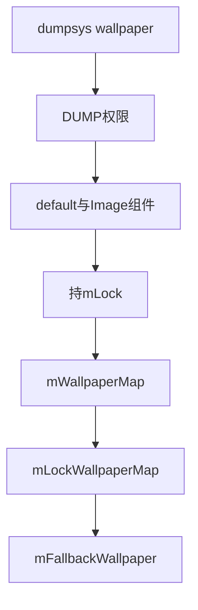
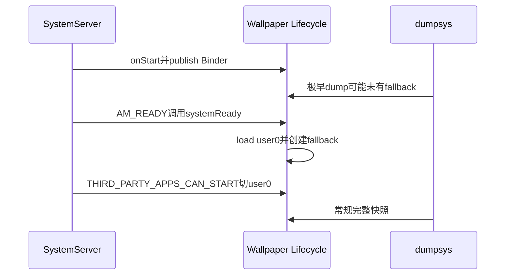
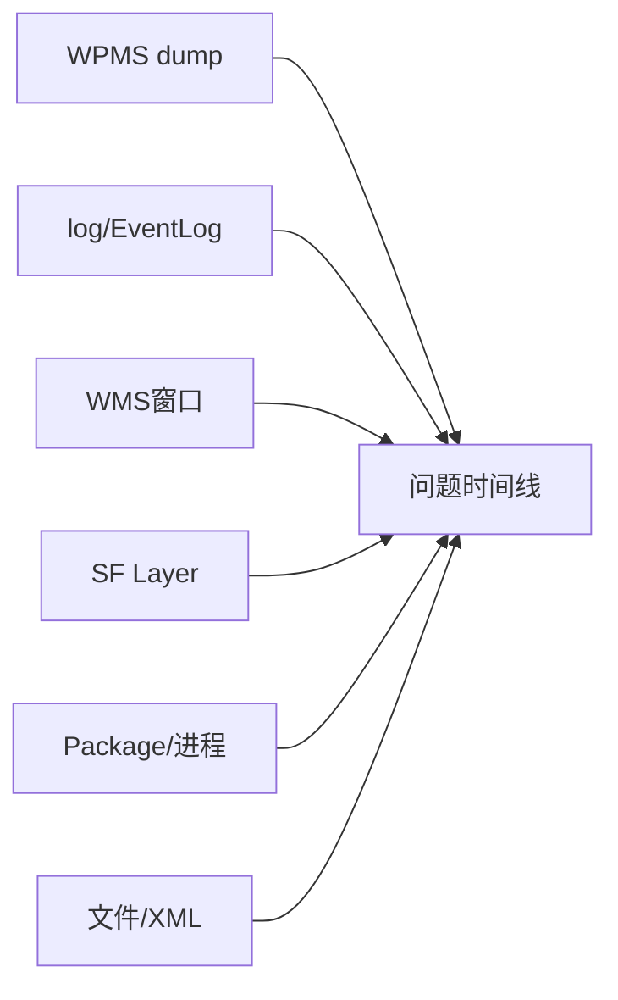

# 第 399 章 Android Wallpaper dumpsys 源码诊断：状态字段、跨服务证据与可观测性盲区

> 源码基线：Android 11 / API 30 / `android-11.0.0_r48`。本章只在macOS读源码，不运行adb、不编译。目标是知道每行dump能证明什么，以及还缺哪些证据。

## 1. 先给结论

r48没有专用Wallpaper ShellCommand；主要只读入口是`dumpsys wallpaper`。

## 2. 服务名

Lifecycle用`Context.WALLPAPER_SERVICE`发布Binder，值为`wallpaper`。

## 3. 没有cmd wallpaper

WPMS未覆写`onShellCommand`，源码树也没有WallpaperShellCommand；不能照搬新版本命令。

## 4. 不推荐service call

事务序号随AIDL变化且可能修改状态，本章只研究dump。

## 5. 权限门

`DumpUtils.checkDumpPermission`要求android.permission.DUMP，否则只输出Permission Denial。

## 6. 普通应用不能dump

公开WallpaperManager权限不等于DUMP；adb shell在系统环境中通常具备诊断权限。

## 7. args没有解析

WPMS.dump接收args但完全不读，服务自身不支持`--user`、`--display`过滤。

## 8. 持锁打印

主体在`mLock`内遍历，慢输出可能短暂阻塞设置、连接和回调。

## 9. 不远调Engine

它只打印本地账和Binder引用，因此较安全，也无法取得远端实时绘制状态。

## 10. 三个区块

System、Lock、Fallback依次输出。

## 11. 输出总图



## 12. default组件

`mDefaultWallpaperComponent`是产品默认live候选，可以为null。

## 13. Image组件

`mImageWallpaper`是静态图渲染Service，是最终内置兜底。

## 14. System只列已加载user

遍历mWallpaperMap不触发lazy load，缺少条目不等于磁盘无数据。

## 15. wallpaperId

它是内容代际，不证明crop、连接、Engine或首帧成功。

## 16. DisplayData是全局

`forEachDisplayData`遍历服务级mDisplayDatas，不是当前user私有值。

## 17. 重复打印缺口

全局DisplayData被放在每个System user块里重复输出，容易误判为per-user隔离。

## 18. displayId含义

尺寸账存在不代表Connection有该屏Connector。

## 19. width/height

是desired minimum hints，不是物理分辨率或Surface尺寸。

## 20. padding

非default不持久化；dump只是当前内存快照。

## 21. cropHint

是裁剪提示，不是最终Bitmap像素边界。

## 22. name

主要服务命名资源恢复，不是壁纸UI标题。

## 23. allowBackup

只表示图像eligibility，不能证明metadata没有上传。

## 24. wallpaperComponent

这是当前内存组件；静态通常为ImageWallpaper。

## 25. next不输出

`nextWallpaperComponent`缺失，Direct Boot/current-next分叉需XML或日志。

## 26. Connection非null

只证明绑定账已建立，不证明onServiceConnected已到。

## 27. Connection对象地址

可在同一次system_server运行期对比代际，重启后无稳定意义。

## 28. mInfo.component

仅WallpaperInfo非null才打印；ImageWallpaper的mInfo刻意为null。

## 29. Connector字段

每屏打印displayId、Token、Engine三个引用。

## 30. Engine null的多义性

可能未连接、attach未回、刚断连或屏未ready。

## 31. Token非null不等于已add

Token在Connector构造时就存在，dump无added状态位。

## 32. mService非null

说明保存了IWallpaperService代理，不说明Engine或Surface存在。

## 33. mLastDiedTime计算错误感

输出是`lastDiedTime - uptimeMillis()`，不是raw timestamp。

## 34. 负数解释

死亡约2秒前通常显示-2000；从未死的0会显示巨大的负uptime。

## 35. 0与久远事件难区分

dump不同时给raw值/uptime，且成功连接不清lastDiedTime。

## 36. Lock区更精简

只打印user、id、cropHint、name、allowBackup。

## 37. Lock为空不是无锁屏

它表示没有独立lock账，锁屏共享system。

## 38. Lock不显示文件

source/crop exists、size、mtime与SELinux标签都不可见。

## 39. Lock不显示颜色

primaryColors字段也被省略。

## 40. Fallback固定全局账

它通常是user0的ImageWallpaper补位对象，不随当前user变化。

## 41. fallback Connector

外屏列在这里通常说明主动态组件不支持多屏。

## 42. fallback ID非内容隔离

多个display共享同一Fallback WallpaperData ID。

## 43. 极早dump可NPE

Binder在onStart发布，fallback到AM_READY initialize才创建；dump直接解引用它。

## 44. 启动时序



## 45. currentUser不输出

不能把列表第一项当当前用户。

## 46. mLastWallpaper不输出

display-ready真实路由指针只能从源码/日志间接判断。

## 47. waitingForUnlock不输出

Direct Boot临时fallback状态不可见。

## 48. wallpaperUpdating不输出

APK更新是否接管崩溃恢复必须看日志。

## 49. pending不输出

imageWallpaperPending、whichPending、setComplete都缺失。

## 50. Runnable不输出

disconnect/rebind/reset任务和deadline均不可见。

## 51. listeners不输出

颜色callbacks与Keyguard listener数量都看不到。

## 52. 普通callbacks也不输出

客户端图片缓存是否已注册无法从dump确认。

## 53. 文件状态不输出

source/crop/XML/tmp四份状态需额外证据。

## 54. Surface不输出

Engine非null不等于Window/Surface/buffer存在。

## 55. 首帧不输出

engineShown与eglSwapBuffers均没有dump字段。

## 56. 资格原因不输出

缺Connector时不知道是access、system decor还是ready问题。

## 57. colors不输出

WallpaperData和默认图颜色缓存均省略。

## 58. DEBUG配置

r48 `DEBUG=false`、`DEBUG_LIVE=true`，绑定恢复日志比裁剪细节更容易看到。

## 59. dump与log互补

dump是瞬时账，logcat是历史事件。

## 60. EventLog不完整

WP_WALLPAPER_CRASHED只覆盖重绑持续失败，不覆盖所有clear。

## 61. 第一证据

dumpsys wallpaper回答WPMS认为的component/Connection/Connector。

## 62. 第二证据

dumpsys window回答WallpaperToken、窗口、target与可见性。

## 63. 第三证据

SurfaceFlinger层信息回答是否有Layer/buffer参与合成。

## 64. 第四证据

dumpsys package核验Service、enabled、权限、Direct Boot与metadata。

## 65. 第五证据

activity/process/service dump和log确认PID、bind、崩溃、重启。

## 66. 第六证据

userdebug/root才适合查`/data/system/users/<id>`；量产shell常无权限。

## 67. 当前macOS替代

用rg/sed把字段映射回写入点与消费者，不需要设备。

## 68. 证据拼图



## 69. 黑屏顺序

依次查component、Connection、Service、Engine、WMS窗口、Surface和buffer。

## 70. 静态旧图

比较ID/cropHint/component，再补文件mtime与ImageWallpaper纹理日志。

## 71. 外屏无图

查主mInfo、主/fallback Connector与Engine，再查WMS decor/token。

## 72. 外屏user0图

Fallback user0且对应display Connector存在是强证据。

## 73. 锁屏共享

目标user无Lock条目而有System条目，表示共享。

## 74. 更新黑屏

dump看连接，log看updateStarted/Finished与onBindingDied。

## 75. Crash回退

component变Image加断连/clear日志，比lastDied负数更可靠。

## 76. -2500的意义

大约表示记录在当前uptime前2.5秒，不是剩余时间。

## 77. 大负数不可定性

可能lastDied=0，也可能很久前死过。

## 78. Map缺user

可能只是未加载，dump不触发loadSettings。

## 79. Connection null

后台user或尚未绑定都可能；Lock静态账本来无Connection。

## 80. Service有值Engine全null

可能attach尚未回或display资格无Connector。

## 81. Engine与Service瞬时一致性

断连在锁内同时清两者，标准r48快照通常不会出现半清。

## 82. DisplayData与Connector分离

尺寸账可有display而主/fallback都无Connector。

## 83. 假--user

`dumpsys wallpaper --user 10`看似过滤，WPMS实际忽略args并输出全部已加载user。

## 84. 输出顺序非时间

SparseArray按key，Connector倒序；行次序不代表创建先后。

## 85. Binder字符串不持久

只可在同一运行期比较是否换代理。

## 86. 敏感信息

组件/name/crop受DUMP保护，笔记不应收集真实壁纸像素。

## 87. 不修改设备

本章不用set/clear/service call，符合macOS只读规则。

## 88. 未来最小采集

先时间戳、wallpaper dump、相关logcat与window dump，再增加重证据。

## 89. 故障后立即采

1秒/10秒状态机很快收敛，过晚只看见ImageWallpaper。

## 90. 两次dump差分

对比ID、Connection、Service/Engine与display集合。

## 91. DisplayData先去重

否则每个user重复块会制造伪差异。

## 92. XML对照

dump是current，XML component/next在Direct Boot可与它分叉。

## 93. fallback无独立XML

它是运行账，dump是主要入口之一。

## 94. dump也会扰动

持锁写PrintWriter，慢消费者会延长临界区。

## 95. 不产生lazy副作用

它不加载用户Map。

## 96. 不提取颜色

不会触发Bitmap decode。

## 97. 不ping Binder

代理非null也可能已死而回调未到。

## 98. 权限源码

```java
protected void dump(FileDescriptor fd, PrintWriter pw, String[] args) {
    if (!DumpUtils.checkDumpPermission(mContext, TAG, pw)) return;
    pw.println(mDefaultWallpaperComponent);
    synchronized (mLock) {
        // 只遍历本地状态；args未使用
    }
}
```

## 99. 三层可信度

ID/component是WPMS账，Binder字段是连接引用，二者都不是像素证明。

## 100. 事件可信度

Slog证明走过分支，EventLog只覆盖特定异常，completion也不表示首帧。

## 101. 报告模板

记录tag、user/display、期望system/lock、dump、日志、窗口/Surface与文件代际。

## 102. 组件模板

列default/current/next、ServiceInfo和Direct Boot状态。

## 103. 多显示模板

每屏列main/fallback Connector、Token、Engine、decor/access与Layer。

## 104. Crash模板

列断连、updating、lastDied、bind返回、connected、reset与clear类型。

## 105. 文件模板

列四文件exists/size/mtime、ID和crop；无权限写“未观测”。

## 106. dump改进

补currentUser、next、pending、updating、waiting、raw crash time与任务deadline。

## 107. 多显示改进

DisplayData只打印一次，并显示资格拒绝原因和Token added状态。

## 108. 首帧改进

记录attach/engineShown/最近buffer，但避免同步远调。

## 109. 安全改进

继续守DUMP权限，对路径/name酌情脱敏。

## 110. 本章模型

WPMS dump只是本地账快照；窗口、合成、文件和事件必须另取证。

## 111. 本章只读练习说明

下面恰好四项，只在macOS读r48源码；每项写“能证明/不能证明/还需证据”。

## 112. macOS只读练习一：逐行标注

运行 `sed -n '3410,3510p' frameworks/base/services/core/java/com/android/server/wallpaper/WallpaperManagerService.java`，标出字段来源、单位和生命周期。

## 113. macOS只读练习二：确认无cmd

运行 `rg -n 'onShellCommand|WallpaperShellCommand' frameworks/base/services/core/java/com/android/server/wallpaper frameworks/base/cmds`，确认r48没有专用入口。

## 114. macOS只读练习三：黑屏证据树

从第388—391、395—396章各选component、Service、Engine、Token、Surface、buffer检查点，标出dump缺项。

## 115. macOS只读练习四：概念diff

设计currentUser、next/updating/pending、文件exists和Runnable deadline输出；不得远调Engine且保留DUMP门。

## 116. 易错结论一：r48有cmd wallpaper

错误。没有专用ShellCommand。

## 117. 易错结论二：Engine非null就是已显示

错误。仍缺Window、Surface、buffer与visibility。

## 118. 易错结论三：Lock为空就是没锁屏

错误。它表示共享system。

## 119. 本章复读后的修正

复读补正：args不解析；全局DisplayData按user重复；lastDied是反向差值；fallback早期可未初始化；dump省略updating/next/pending/colors/files/首帧。

## 120. 本章结论与下一章入口

有效诊断来自多证据拼图。第400章将收束300—400，建立Wallpaper端到端故障树，并执行本批次结构与可理解性总审计。
