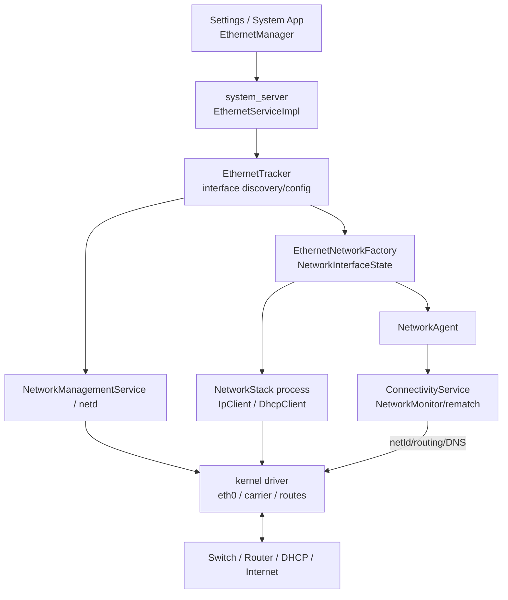
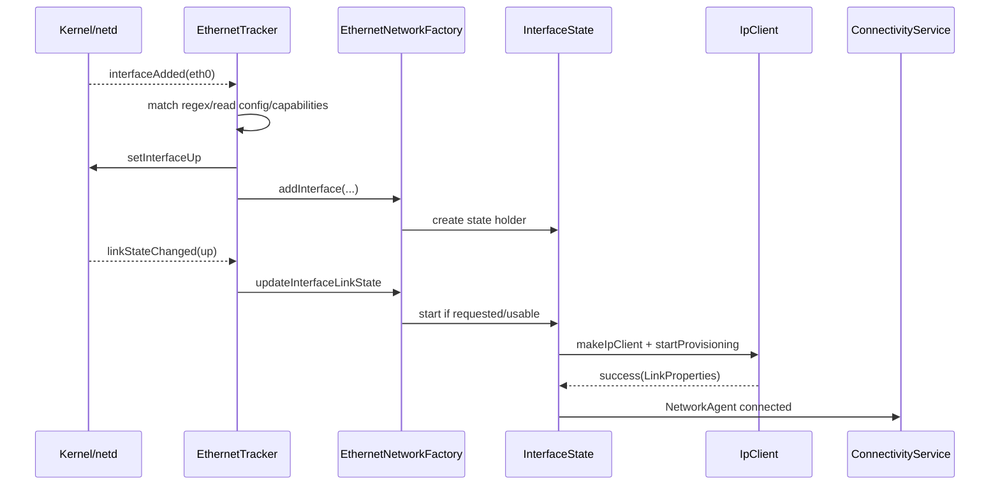
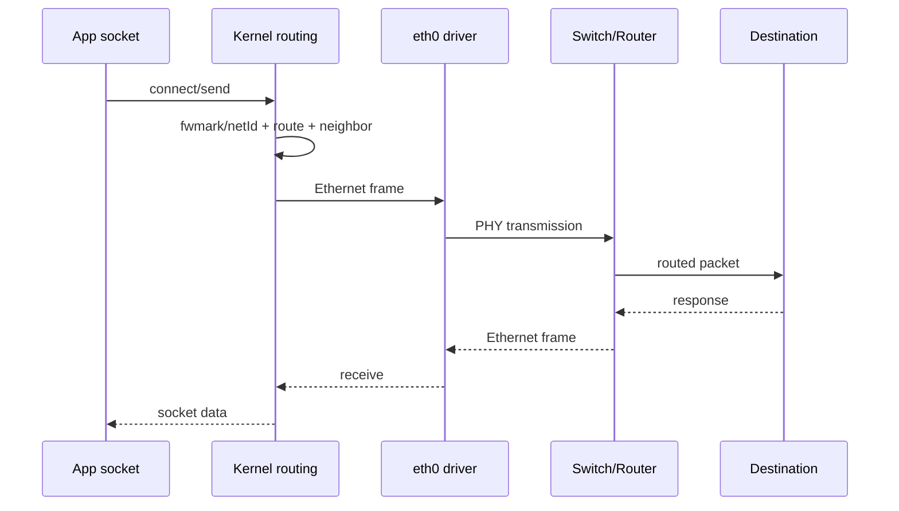

# 40 Android 以太网系统、EthernetService 与 IpClient

> 源码版本：Android 11 / API 30 / `android-11.0.0_r48`  
> 学习方式：macOS 只读源码，不要求编译  
> 前置章节：[24 网络栈](./24-Android网络栈ConnectivityService与NetworkAgent.md)、[37 Wi-Fi](./37-AndroidWiFi系统WifiService与ClientModeImpl.md)、[39 网络共享](./39-Android网络共享TetheringIpServer与NAT.md)

以太网看似只是“插上网线”，但 Android 仍要完成接口发现、carrier/link 判断、IP 配置、NetworkAgent 注册、互联网验证和默认网络竞争。本章把这些完成点分开，避免把 Linux interface 的 `UP` 标志误认为“网络已经可用”。

---

## 1. 五个完成点

```text
interface discovered
 → physical link/carrier up
 → IP provisioned
 → NetworkAgent registered
 → validated/default selected
```

任何相邻两步都不等价。最典型的现象是 link up 但 DHCP 失败，或已有 IP 但网关/DNS/互联网验证失败。

---

## 2. 总体架构



控制面跨 system_server、NetworkStack 与 kernel；稳态数据包不会逐个经过 Java Service。

---

## 3. Android 11 核心源码

```text
frameworks/base/core/java/android/net/EthernetManager.java
frameworks/base/core/java/android/net/IEthernetManager.aidl
frameworks/base/core/java/android/net/IEthernetServiceListener.aidl
frameworks/opt/net/ethernet/java/com/android/server/ethernet/EthernetService.java
frameworks/opt/net/ethernet/java/com/android/server/ethernet/EthernetServiceImpl.java
frameworks/opt/net/ethernet/java/com/android/server/ethernet/EthernetTracker.java
frameworks/opt/net/ethernet/java/com/android/server/ethernet/EthernetNetworkFactory.java
frameworks/opt/net/ethernet/java/com/android/server/ethernet/EthernetConfigStore.java
frameworks/base/services/net/java/android/net/ip/IpClientUtil.java
frameworks/base/services/net/java/android/net/ip/IpClientManager.java
packages/modules/NetworkStack/src/android/net/ip/IpClient.java
packages/modules/NetworkStack/src/android/net/dhcp/DhcpClient.java
packages/modules/NetworkStack/src/android/net/ip/IpReachabilityMonitor.java
frameworks/base/core/java/android/net/NetworkAgent.java
frameworks/base/services/core/java/com/android/server/ConnectivityService.java
frameworks/base/services/core/java/com/android/server/NetworkManagementService.java
```

---

## 4. 核心进程

- EthernetService/Tracker/NetworkFactory：`system_server`。
- IpClient/DhcpClient：NetworkStack 模块进程。
- ConnectivityService：`system_server`。
- netd：native daemon。
- driver、接口状态、路由与包收发：kernel。

`IpClientCallbacks` 从 NetworkStack 经 Binder 回到 system_server；回调线程与 Ethernet handler 状态机需要正确串行化。

---

## 5. EthernetService 与 Impl

`EthernetService` 是 SystemService 生命周期外壳；`EthernetServiceImpl` 实现 Binder API并持有 Tracker。它负责：

- 服务启动。
- 接口列表/可用状态查询。
- listener 注册。
- IP configuration 读写。
- 权限检查与 dump。

API 返回配置已受理，不等于该接口已经重新 provision 成功。

---

## 6. EthernetManager

系统/特权客户端通过它查询接口、监听 availability、读取或设置 `IpConfiguration`。Android 11 许多 Ethernet 管理 API 仍是隐藏或系统 API，普通第三方 App 权限有限。

listener 的 “available” 更接近 Framework 是否有可管理/可提供网络的接口状态，不能替代 ConnectivityManager 的 validation/default callback。

---

## 7. EthernetTracker

Tracker 是接口发现与配置总管：

- 监听 interface added/removed/link state。
- 用 regex 识别 Ethernet interface。
- 读取资源默认配置和持久化配置。
- 解析 capabilities、静态 IP 等。
- 把接口加入/更新到 EthernetNetworkFactory。

物理驱动先暴露 Linux interface，Tracker 才能把它提升成 Android Ethernet 候选网络。

---

## 8. 接口过滤

系统通常用配置 regex 匹配 `eth0` 等名字，并排除不该作为普通 Ethernet 网络的接口。USB/RNDIS、虚拟接口、测试接口即使长得像网卡，也不必然由 EthernetTracker 接管。

定制设备“内核有 ethX 但 Android 看不到 Ethernet”时，应先查 regex、资源 overlay 和 interface observer，而不是直接怀疑 DHCP。

---

## 9. interface added 主链



实际是否立即 start 还与 NetworkRequest 和 factory score/模式有关。

---

## 10. admin up 与 carrier up

Linux 接口有多种状态：

- admin `UP`：软件允许接口工作。
- carrier/link up：PHY 检测到物理链路。
- running/lower-up：驱动派生状态。

`setInterfaceUp()` 只设置管理状态。网线未插、交换机端口关闭或协商失败时仍没有 carrier。

---

## 11. 物理链路协商

PHY 会协商速率、双工、节能等能力。link flap 会触发 repeated up/down，导致 IpClient、NetworkAgent 被反复启动/停止。

低吞吐或大量错误还可能来自网线、双工、驱动与 PHY，不一定在 Android Framework。

---

## 12. EthernetNetworkFactory

它向 ConnectivityService 表达 Ethernet transport 的供给能力，管理多接口，并为每接口维护 `NetworkInterfaceState`。主要职责：

- 接收 interface/link/config 变化。
- 响应网络请求。
- 启停 IP provisioning。
- 创建/更新 NetworkAgent。
- 汇总接口状态。

Factory 不是数据包工厂；它是 Android Network 请求/供给模型中的 provider/factory。

---

## 13. 每接口状态对象

一个 Ethernet interface 至少关联：

- interface name/HW address。
- NetworkCapabilities。
- IpConfiguration。
- link state。
- IpClient/IpClientManager。
- LinkProperties。
- NetworkInfo/NetworkAgent。

多网口设备必须逐接口分析，不能用一个全局“Ethernet connected”状态覆盖它们。

---

## 14. NetworkCapabilities

典型能力包括 `TRANSPORT_ETHERNET`、INTERNET、NOT_RESTRICTED、NOT_METERED 等，但可由资源/配置定制。

capability 是声明和选择条件，不是实时连通证据。声明 INTERNET 后仍要由 NetworkMonitor 验证。

---

## 15. score 与默认网络竞争

Ethernet 常具有较高稳定 score，因此可能优先于 Wi-Fi/蜂窝成为默认网络；最终由 ConnectivityService 综合 score、validation、capabilities、用户/策略和请求 rematch。

“插网线一定抢默认网络”不是绝对规则，特别是受限、未验证或显式请求场景。

---

## 16. IpConfiguration

它组合：

- IP assignment：DHCP 或 STATIC。
- StaticIpConfiguration：address、gateway、DNS、domains。
- Proxy settings：none/static/PAC。

它是期望配置，不是当前 LinkProperties。当前实际地址/路由要看 provisioning 结果。

---

## 17. EthernetConfigStore

配置存储让特定 interface 的 IP/proxy 配置跨重启保留。Tracker 启动时读取，资源默认值可补充初始配置。

接口名变化、硬件替换或配置格式迁移可能让旧条目不再命中。持久化成功也不证明静态网关真实存在。

---

## 18. DHCP 与静态 IP

| 模式 | 系统获得什么 | 常见失败 |
|---|---|---|
| DHCP | 地址、网关、DNS、lease 等 | server 不响应、VLAN/交换机、地址池耗尽 |
| STATIC | 用户/设备策略提供地址、网关、DNS | 网段错误、冲突、错误网关/DNS |

静态模式跳过 DHCP 交互，但仍需邻居发现、route、DNS 和 validation。

---

## 19. 创建 IpClient

Ethernet 通过 `IpClientUtil.makeIpClient(context, ifName, callbacks)` 请求 NetworkStack 异步创建 IpClient。当前分支直接保存 `IIpClient`；`start()` 用 `ConditionVariable` 等待创建回调，然后才启动 provisioning。

```java
mIpClientCallback = new IpClientCallbacksImpl();
IpClientUtil.makeIpClient(mContext, name, mIpClientCallback);
mIpClientCallback.awaitIpClientStart();
provisionIpClient(mIpClient, mIpConfig, sTcpBufferSizes);
```

这是 `NetworkInterfaceState.start()` 的裁剪源码。`onIpClientCreated(IIpClient)` 给 `mIpClient` 赋值并打开 ConditionVariable。重点是：底层创建仍跨 Binder 异步完成，但 Ethernet 的这段调用路径选择等待回调后再继续；不要把“异步 IPC”误解成调用方一定完全不等待。

---

## 20. IpClient 配置什么

- IPv4 DHCP 或静态地址。
- IPv6 link-local、RA/SLAAC。
- routes、DNS、MTU、proxy。
- provisioning timeout。
- reachability monitor。
- APF/filter 等接口能力。

IpClient 不负责选择该 Ethernet 是否成为默认网络，那是 ConnectivityService 的职责。

---

## 21. DHCP DORA

```text
DISCOVER → OFFER → REQUEST → ACK
```

DHCP 包在 Ethernet broadcast domain 内交换。link up 只让帧可能传输；VLAN 错误、port isolation、DHCP snooping 或 server 故障都可能让 DORA 卡住。

---

## 22. IPv6 provisioning

IPv6 通常通过 link-local、Router Solicitation/Advertisement、SLAAC、RDNSS 等形成 LinkProperties。它可与 IPv4 DHCP 并行。

所以 IPv4 DHCP 失败不必然表示完全无 IP；设备可能 IPv6 可用。反过来，只有 link-local IPv6 不能证明可到互联网。

---

## 23. provisioning success 的边界

IpClient 的 success 表示当前 LinkProperties 满足 provisioning 条件，例如获得所需地址/路由。它不等于 NetworkMonitor 已验证公网。

```text
link up
 → IpClient provisioning success
 → NetworkAgent connected
 → NetworkMonitor validation
 → default network rematch
```

---

## 24. LinkProperties

它描述实际链路：

- interface name。
- LinkAddress。
- routes/default gateway。
- DNS/domains。
- MTU、proxy。
- stacked links。

排障时不要只看 `ip addr`；错误 DNS、缺 default route 或 stacked interface 同样影响联网。

---

## 25. NetworkAgent 创建

provisioning 成功后，每接口状态对象创建 Ethernet NetworkAgent，把 NetworkInfo、capabilities、LinkProperties、score 交给 ConnectivityService。

后续 LinkProperties 变化通过 agent 更新；link down/provision failure 则断开 agent 并清理 IpClient。

---

## 26. NetworkAgent connected 不等于 validated

connected 表示 provider 宣布逻辑网络可用。NetworkMonitor 还要执行 DNS/HTTP/HTTPS 等探测，可能得到 VALIDATED、CAPTIVE_PORTAL 或无互联网。

企业内网没有公网是合法场景；未 validated 不等于接口配置必然错误，但会影响默认网络选择。

---

## 27. Captive portal

酒店/企业有线网也可能要求 portal 登录。此时 DHCP、gateway 和 DNS 都可能正常，validation 被重定向。

用户登录后 NetworkMonitor 重新验证。只追 EthernetTracker 找不到 portal 状态机，应回到 NetworkMonitor/ConnectivityService。

---

## 28. 数据路径



EthernetService 和 IpClient 不逐包参与稳态传输。

---

## 29. ARP 与邻居发现

IPv4 通过 ARP 找网关 MAC；IPv6 通过 Neighbor Discovery。即使地址和 default route 都存在，邻居解析失败仍无法把 IP 包封装成可发送的 Ethernet frame。

`ip neigh` 的 INCOMPLETE/FAILED、重复地址和交换机安全策略是重要证据。

---

## 30. IpReachabilityMonitor

它观察关键邻居（gateway/DNS 等）的可达性变化，在邻居失败时通知 IpClient。回调可能触发 reachability lost、重新 provisioning 或网络状态改变。

一次短暂 neighbor failure 不总等于物理 link down；二者证据层次不同。

---

## 31. link down 主链

```text
kernel/netd link state callback
 → EthernetTracker
 → EthernetNetworkFactory update link
 → InterfaceState stop
 → IpClient stop/shutdown
 → NetworkAgent disconnected
 → ConnectivityService rematch default network
```

如果 Wi-Fi/蜂窝可用，App 新连接可切换；旧 TCP socket 是否恢复取决于绑定和传输协议。

---

## 32. interface removed 与 link down

- link down：接口对象还在，网线/PHY 不通，可稍后恢复。
- interface removed：kernel interface 消失，Tracker 要移除状态对象与配置中的运行态关联。

USB Ethernet 拔出常是 removed；物理 RJ45 拔线通常只是 carrier down，依驱动而异。

---

## 33. 多网口

设备可有 `eth0`、`eth1`，每个具有独立 capabilities、IP config、LinkProperties、score 和 NetworkAgent。ConnectivityService 可以同时保留多张 Network。

同名配置、地址冲突、相同子网和默认路由竞争是多网口常见问题。

---

## 34. VLAN

VLAN interface 可能由系统/厂商或网络工具创建，例如 `eth0.100`。它是否被 EthernetTracker regex 接管、如何获得配置取决于产品集成。

物理 eth0 carrier up 不证明目标 VLAN 的 tagged traffic 正确到达 DHCP server。

---

## 35. USB Ethernet

USB host 接入 USB 网卡后，kernel driver 创建新接口，再走相同 Ethernet discovery/provisioning 主链。USB 枚举成功和 Ethernet link/IP 成功仍是不同层。

不要与第 39 章的 USB tethering 混淆：前者手机通常是上网客户端，后者手机向 USB 对端共享网络。

---

## 36. Ethernet tethering

同一物理类型也可作为下游共享接口。此时 Tethering/IpServer 给它配置私网地址并跑 DHCP server，而普通 Ethernet client 模式由 EthernetNetworkFactory 创建 IpClient 跑 DHCP client。

判断方向的关键是：手机在该接口上运行 DHCP client 还是 DHCP server。

---

## 37. MAC 地址

MAC 来自硬件/驱动或设备配置。重复 MAC、交换机 port security、802.1X、准入控制都可能导致 link up 但业务不通。

Android Framework 的普通 DHCP 主链不会替企业网络完成所有 802.1X supplicant 配置，产品可能需要额外集成。

---

## 38. 静态 IP 示例

```text
address: 192.168.10.20/24
gateway: 192.168.10.1
DNS:     192.168.10.1, 1.1.1.1
```

必须验证 gateway 在前缀内、地址未冲突、交换机 VLAN 正确、DNS 可达。格式合法只是 API 校验通过，不是网络证明。

---

## 39. Proxy

IpConfiguration 可带 static/PAC proxy，进入 LinkProperties 后供遵循系统代理的 App 使用。原生 socket 或自带网络栈可能不使用该代理。

“浏览器不通但 ping 通”除 DNS/portal 外，还应检查 proxy/PAC。

---

## 40. Metered 与 restricted

Ethernet 常默认 NOT_METERED，但产品可配置不同 capabilities。受限网络可能只匹配具有相应权限/请求的应用。

不能用 transport=ETHERNET 推导所有策略属性。

---

## 41. 默认网络切换

当 Ethernet validated 且 score 更优：

```text
ConnectivityService rematch
 → Ethernet 成为系统默认 Network
 → 更新默认 DNS/netId/routes
 → 未显式绑定的新 socket 走 Ethernet
```

显式 `bindProcessToNetwork()`、`Network.bindSocket()` 或 VPN 可改变具体 socket 的选择。

---

## 42. Wi-Fi 与 Ethernet 同时存在

两张网络可同时 registered；默认只是一种系统选择。应用用 NetworkRequest 可拿非默认 Network。

设置页图标不一定展示全部可用网络，诊断应看 ConnectivityService 中所有 NetworkAgentInfo。

---

## 43. NetworkFactory 请求模型

旧式 NetworkFactory 根据请求数量、score/filter 决定 `startNetwork()`/`stopNetwork()`。Ethernet 的实现还会考虑 link availability。

不要把 `startNetwork` 理解成给 PHY 上电；在此处主要是启动此接口的 IP provisioning/NetworkAgent 生命周期。

---

## 44. 配置变更

从 DHCP 改静态 IP，通常需要停止当前 IpClient/agent，再以新配置启动，或由实现进行相应重配。切换期间存在短暂断网。

配置写入成功和新 provisioning success 应分别记录。

---

## 45. DHCP lease 更新

DhcpClient 会维护租约 T1/T2、续租/重绑。续租失败最终可能失去 provisioning，NetworkAgent 断开或重新获取地址。

“插线几小时后断网”应看 lease 时间轴，不只看首次 DORA。

---

## 46. 地址冲突

静态地址或异常 DHCP 可能产生重复 IPv4；IPv6 DAD 也可能失败。症状包括邻居表来回变化、间歇可达、交换机日志报 MAC move。

link 和 DHCP ACK 均不能完全排除地址冲突。

---

## 47. MTU

Ethernet 常为 1500，但 VLAN、隧道、上游 PPPoE 等路径可能更小。大包失败、小包正常、TLS 卡住时检查 LinkProperties MTU 和 PMTU/ICMP。

不要把 Ethernet 固定等同于 jumbo frame 或固定 1500 端到端。

---

## 48. “网线已插但无网”分层

| 层 | 证据 | 常见问题 |
|---|---|---|
| interface | `ip link` 是否存在 | driver/枚举/regex |
| physical | carrier、速率、错误计数 | 线缆/PHY/交换机 |
| IP | address/route/DNS、DHCP | server/VLAN/静态配置 |
| neighbor | ARP/ND gateway | 冲突/隔离/port security |
| Android Network | NetworkAgent/capabilities | factory/IpClient callback |
| validation/app | portal、DNS、socket binding | 公网/策略/VPN/proxy |

---

## 49. 典型时间线

| 时间 | 事件 | 尚不能证明 |
|---|---|---|
| 09:00:00.1 | eth0 interface discovered | 网线已通 |
| 09:00:00.5 | carrier up | 获得 IP |
| 09:00:01.4 | DHCP ACK | gateway/互联网可达 |
| 09:00:01.6 | IpClient provisioning success | 网络 validated |
| 09:00:01.8 | NetworkAgent connected | 已成为默认网络 |
| 09:00:02.5 | validation success/rematch | 通常可作为互联网默认网络 |

时间仅为教学示例，不是 Android 固定期限。

---

## 50. dumpsys 与只读观察

```bash
adb shell dumpsys ethernet
adb shell dumpsys connectivity
adb shell dumpsys network_stack
adb shell ip link
adb shell ip address
adb shell ip route show table all
adb shell ip neigh
```

输出和权限依 build 而异。macOS 不接设备也可先从各类 `dump()` 方法学习字段。

---

## 51. 日志对齐

按时间轴关联：interface observer、link state、EthernetTracker/Factory、IpClient/DhcpClient、NetworkAgent、NetworkMonitor。

最后出现的 provisioning failure 可能由更早的 carrier flap 触发；不要只看末行。

---

## 52. 源码路线一：服务启动

```text
frameworks/opt/net/ethernet/java/com/android/server/ethernet/EthernetService.java
frameworks/opt/net/ethernet/java/com/android/server/ethernet/EthernetServiceImpl.java
frameworks/opt/net/ethernet/java/com/android/server/ethernet/EthernetTracker.java
```

练习：找 SystemService 生命周期、Tracker start、接口 observer 注册和线程归属。

---

## 53. 源码路线二：接口发现

```text
frameworks/opt/net/ethernet/java/com/android/server/ethernet/EthernetTracker.java
frameworks/base/services/core/java/com/android/server/NetworkManagementService.java
```

练习：追 interfaceAdded、regex、setInterfaceUp、link callback 和 remove。

---

## 54. 源码路线三：NetworkFactory

```text
frameworks/opt/net/ethernet/java/com/android/server/ethernet/EthernetNetworkFactory.java
frameworks/base/core/java/android/net/NetworkAgent.java
```

练习：找每接口状态、start/stop、IpClient callback 和 NetworkAgent 创建点。

---

## 55. 源码路线四：IP provisioning

```text
frameworks/base/services/net/java/android/net/ip/IpClientUtil.java
frameworks/base/services/net/java/android/net/ip/IpClientManager.java
packages/modules/NetworkStack/src/android/net/ip/IpClient.java
packages/modules/NetworkStack/src/android/net/dhcp/DhcpClient.java
```

练习：区分 makeIpClient 异步创建、startProvisioning 和 success/failure callbacks。

---

## 56. 源码路线五：验证与默认网络

```text
frameworks/base/services/core/java/com/android/server/ConnectivityService.java
packages/modules/NetworkStack/src/com/android/server/connectivity/NetworkMonitor.java
```

练习：追 Ethernet NetworkAgent 注册、validation capability 更新和 rematch。

---

## 57. 八组只读练习

1. **五点图**：interface、carrier、IP、registered、validated。
2. **发现链**：从 interfaceAdded 追到 NetworkFactory。
3. **状态表**：对比 admin up、carrier up 和 connected。
4. **DHCP 链**：追 IpClient → DhcpClient → callback。
5. **静态配置纸算**：验证 address/gateway/DNS/subnet。
6. **默认竞争图**：Ethernet、Wi-Fi、cellular 同时存在。
7. **断线清理图**：link down 到 NetworkAgent disconnect。
8. **故障证据表**：按六层给“插线无网”取证。

---

## 58. 初学者易混淆的十二点

1. interface 存在不等于 carrier up。
2. admin up 不等于物理 link up。
3. link up 不等于 DHCP 成功。
4. DHCP ACK 不等于互联网可达。
5. provisioning success 不等于 validated。
6. NetworkAgent connected 不等于默认网络。
7. IpConfiguration 不是实时 LinkProperties。
8. IpClient 不负责默认网络选择。
9. NetworkFactory 不逐包处理流量。
10. 多网口各有独立 NetworkAgent。
11. USB Ethernet client 与 USB tethering 方向相反。
12. Ethernet transport 不自动等于 unmetered/unrestricted。

---

## 59. 自测题

1. EthernetTracker 与 NetworkFactory 如何分工？
2. admin up 和 carrier up 有何区别？
3. IpClient 在哪个进程？
4. DHCP 与静态配置分别如何进入 LinkProperties？
5. provisioning success 能否证明公网可达？
6. Ethernet 为什么可能不成为默认网络？
7. link down 与 interface removed 有何区别？
8. ARP 失败为何会在已有 default route 时断网？
9. 多网口为何不能用一个全局 connected 状态？
10. Ethernet tethering 与 Ethernet client 模式如何区分？
11. Wi-Fi 和 Ethernet 能否同时 registered？
12. 小包通、大包失败要考虑什么？

---

## 60. 参考答案

1. Tracker 发现/配置接口；Factory 管每接口 provisioning 与 NetworkAgent。
2. 前者是软件启用，后者是 PHY 检测到实际链路。
3. NetworkStack 模块进程，通过 Binder callbacks 通信。
4. IpClient 按 IpConfiguration 启动 DHCP 或应用静态配置并汇总实际链路属性。
5. 不能，还要 NetworkMonitor validation。
6. 可能未验证、score/capability 不匹配或受策略/显式绑定影响。
7. 前者接口仍在；后者接口对象从 kernel 消失。
8. route 只指出 next hop，仍需解析网关 MAC 才能发送 Ethernet frame。
9. 每个接口的 link、配置、capabilities 和 agent 都独立。
10. 手机跑 DHCP server 是下游共享；跑 DHCP client 是上游客户端。
11. 可以，默认网络只是其中一张的角色。
12. MTU、PMTU、VLAN/隧道开销与 ICMP 过滤。

---

## 61. 最终主线

```text
kernel/driver 创建 eth interface
 → EthernetTracker observer 发现并匹配 regex
 → 读取 IpConfiguration/Capabilities，设置 interface admin up
 → EthernetNetworkFactory 创建每接口状态
 → carrier up 且需要网络时创建 IpClient
 → DHCP/静态 IPv4 与 IPv6 RA/SLAAC provisioning
 → callbacks 产生 LinkProperties
 → 创建 Ethernet NetworkAgent
 → ConnectivityService 注册、NetworkMonitor 验证、默认网络 rematch
 → App socket 经 netId/routing、ARP/ND、driver 和 PHY 传输
```

读完后遇到“插网线没网”，应依次问：接口是否被 Android 识别、carrier 是否真实 up、IpClient 是否取得完整地址/路由/DNS、NetworkAgent 是否注册、网络是否 validated、具体 App socket 是否选择了这张 Network。这样才能把物理、IP 和 Android 策略问题分开。
