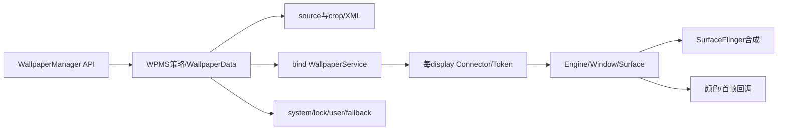
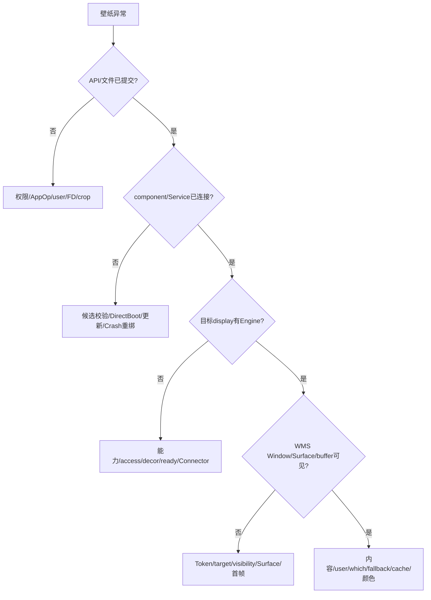
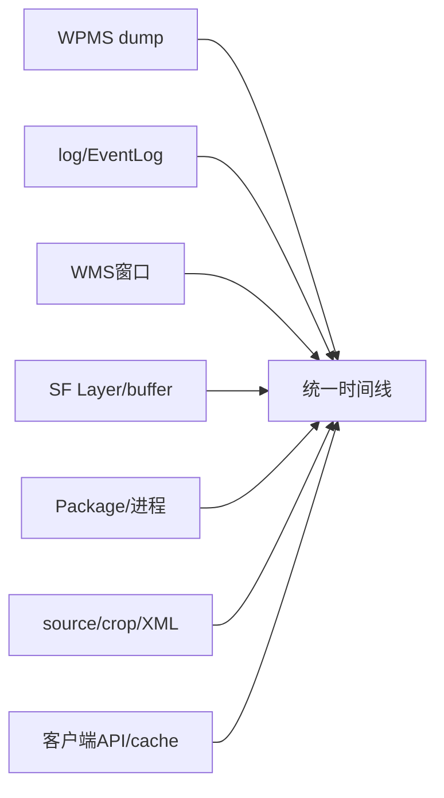

# 第 400 章 Android Wallpaper 端到端故障树、源码阅读复盘与 300—400 阶段收束

> 源码基线：Android 11 / API 30 / `android-11.0.0_r48`。本章只在macOS读源码，不编译。它不重复前15章细节，而是教你面对“壁纸不对”时如何选择入口、建立时间线、跨进程追证并避免过早下结论。

## 1. 先定义问题

“壁纸不对”必须拆成设置失败、内容错误、屏幕错误、生命周期错误、颜色错误或恢复错误。

## 2. 六种症状

常见是返回失败、黑屏、旧图、锁屏串图、外屏缺图、重启/升级后变化。

## 3. 第一个维度：user

确认调用user、前台user、fallback user0和Direct Boot解锁状态。

## 4. 第二个维度：which

区分SYSTEM、LOCK、SYSTEM|LOCK，以及无独立lock时的共享语义。

## 5. 第三个维度：display

确认default、主Connection Connector还是fallback Connector。

## 6. 第四个维度：内容类型

静态图走source/crop/ImageWallpaper；live走第三方WallpaperService。

## 7. 第五个维度：成功层级

API返回、文件提交、bind接受、Service连接、Engine attach、首帧是六个不同成功点。

## 8. 第六个维度：时间

设置、FileObserver、包更新、断连1秒、重连10秒和user switch必须排成时间线。

## 9. 一句话模型

WallpaperData管内容与组件，DisplayData管提示，Connection/Connector管每屏远端资源，WMS/SF管真正显示。

## 10. 总链路

## 11. 静态设置入口

先查setBitmap/setStream参数、权限、AppOp、user限制和which。

## 12. FD返回非成功

服务先open TRUNCATE source并生成ID；返回FD只表示可以开始写。

## 13. 客户端写入

Bitmap压PNG或Stream原样复制，close才触发FileObserver后半段。

## 14. completion上限

r48连续两次await(30s)，无回调最坏约60秒，且timeout boolean被忽略。

## 15. FileObserver成功点

一般callback可早于crop；专用completion在save后，但仍无success字段。

## 16. crop失败

失败会删crop，却可能继续bind/save/callback，非0 ID不能证明可显示。

## 17. 文件四件套

source、crop、wallpaper_info.xml与tmp没有共同事务/generation。

## 18. 静态渲染者

system_server不画像素，SystemUI ImageWallpaper的GLEngine/EGL负责。

## 19. Worker异步

onSurfaceRedrawNeeded只post，framework reportShown可能早于eglSwapBuffers。

## 20. 一帧后回收

ImageWallpaper延迟1秒销毁EGL Context/Surface，下次重建shader/texture。

## 21. live选择入口

候选必须存在、BIND_WALLPAPER、匹配action、metadata可解析，ambient另需权限。

## 22. bind返回true

只表示请求被接受，不代表connected/Engine/首帧。

## 23. 切换非事务

新bind接受后旧Connection已detach，onServiceConnected才保存XML。

## 24. Engine主线程

远端Binder attach经HandlerCaller进入WallpaperService主Looper。

## 25. attach顺序

attachEngine回WPMS早于onCreateEngine，Surface callback又更晚。

## 26. reportShown限制

Engine updateSurface finally可reportShown，不验证应用真正post buffer。

## 27. WMS目标

FLAG_SHOW_WALLPAPER、转场和prev target决定Wallpaper窗口是否需要可见。

## 28. Token不是像素

Connector Token存在只证明对象账，Window/Surface/buffer需另证。

## 29. Offset

WMS可同时改Surface位置/缩放并按需回调Engine归一化offset。

## 30. Command

r48 sync command不等待/不返回Engine Bundle，不能当可靠请求响应。

## 31. system/lock不变量

无lock Map/kwp即共享system；有则独立静态lock。

## 32. SYSTEM-only迁移

切新system前旧共享静态图两次rename成lock，非原子。

## 33. SYSTEM|LOCK

移除lock Map但可能留下孤儿文件。

## 34. 查询差异

共享LOCK的File=null、ID=-1、Backup=false，Colors才回退system。

## 35. Keyguard语义

LockscreenWallpaper null常表示让system/live透过，不是“没有背景”。

## 36. user switch

每user账lazy load，mLastWallpaper代表当前主系统壁纸。

## 37. Direct Boot

不感知解锁的live组件临时用不入Map的ImageWallpaper账，解锁再收敛。

## 38. observer边界

用户切走不停止旧Observer，后台文件事件仍可能进入服务。

## 39. 多显示能力

ImageWallpaper或metadata supportsMultipleDisplays=true由主Connection占合格多屏。

## 40. 单屏live

只占default，其他usable非default由固定user0 fallback ImageWallpaper。

## 41. usable资格

组件UID必须hasAccess；非default还要WMS显示system decor。

## 42. 能力不是兜底

主声明多屏后fallback整体撤出，主资格遗漏屏不会自动再补。

## 43. display ready

onDisplayAdded为空，DisplayPolicy ready才增量connect。

## 44. DisplayData全局

按display而非user，只有default写各user XML。

## 45. 颜色生产

静态WPMS解码crop提取，动态Engine主动上报。

## 46. 动态多屏颜色

同一WallpaperData只有一份primaryColors，多个display可互相覆盖。

## 47. 无listener优化

没有颜色listener时提取入口直接return。

## 48. Globals监听缺口

客户端只有一个registered boolean，本地listener不存user/display路由。

## 49. 图片Globals缓存

current Bitmap只按user键控，实际读取固定SYSTEM。

## 50. hardware串扰

第一次hardware/mutable选择被共享缓存沿用。

## 51. FD内存峰值

crop完整读入ByteArrayOutputStream，再toByteArray并解码。

## 52. factory默认

system属性文件优先，再framework资源；LOCK默认在r48未实现。

## 53. public clear陷阱

clear()用factory stream调用默认SYSTEM|LOCK setStream，不是服务端产品默认clear。

## 54. 动态崩溃第一步

onServiceDisconnected清Service/Engine，延迟1秒避让包更新广播。

## 55. 第一次第三方死亡

记录lastDiedTime并force重绑。

## 56. 10秒内第二死

clear(true)强制ImageWallpaper。

## 57. 两类重连超时

bind false每秒retry；bind true未connected由FgThread reset监督。

## 58. 更新接管

updateStarted置updating并取消reset，finish清旧Connection后重验旧组件。

## 59. 更新失败目标

clear(false)先走产品默认，与Crash clear(true)不同。

## 60. onBindingDied缺口

r48未覆写onBindingDied/onNullBinding。

## 61. 备份eligibility

allowBackup门控原图，不门控info XML。

## 62. stage

注释称link，实现用copy；system/lock/info没有共同原子快照。

## 63. quota

上轮超额让下一轮只跳lock，finally删哨兵，后续再尝试。

## 64. 现代恢复

从stage解析crop/component，重走setStream和setWallpaperComponent。

## 65. 缺live包

注册非持久一次性PackageMonitor，且只比包名、不筛changing user。

## 66. legacy恢复

SystemBackupAgent仍兼容旧key/value和direct-file数据，不能与现代流程混读。

## 67. dumpsys能力

r48无专用cmd wallpaper；dump只给WPMS本地账。

## 68. dump盲区

不显示currentUser、next/updating/pending/waiting、任务、文件、颜色和首帧。

## 69. DisplayData重复

dump在每个System user下重复同一全局尺寸账。

## 70. lastDied误读

输出是lastDied-uptime；大负数可能是0或久远事件。

## 71. 故障树入口

## 72. 返回0

优先查服务、策略、权限与FD open。

## 73. 返回非0黑屏

查crop、component、Connection、Engine、Window、Surface、buffer。

## 74. 显示旧图

查文件代际、客户端缓存、ImageWallpaper纹理重载。

## 75. live变静态

查Crash clear(true)、更新clear(false)与Direct Boot临时fallback。

## 76. 锁屏错图

先判lock Map，再查SYSTEM-only迁移与SYSTEM|LOCK清账。

## 77. 外屏黑

查supportsMulti、access、decor、ready与fallback分工。

## 78. 外屏错用户

确认是否固定user0 fallback。

## 79. 重启后尺寸变

非default不持久化，default过小值会ensureSane。

## 80. 升级后黑

查PackageMonitor finish、具体Service合法性和accepted bind无reset缺口。

## 81. 颜色不更新

查listener、Engine上报、primaryColors共享和Globals路由。

## 82. getBitmap不对

它不是live截图，cache固定SYSTEM且遗漏hardware/display键。

## 83. 证据矩阵

## 84. 不要只看一行

Engine非null、ID非0、completion到达都不是最终显示证明。

## 85. 不要混线程

标明Binder线程、system主线程、Background/FgThread、Wallpaper主线程与Image Worker。

## 86. 不要混进程

应用、system_server、SystemUI/第三方Service、WMS与SurfaceFlinger职责不同。

## 87. 不要混对象账

WallpaperData、DisplayData、Connection、Connector、Engine不是同一生命周期。

## 88. 不要混文件

source、crop、XML、tmp必须逐个确认。

## 89. 不要混默认

产品default live、ImageWallpaper、factory default bitmap、fallback是四个概念。

## 90. 不要混fallback

Direct Boot临时fallback与多显示长期fallback不是同一WallpaperData。

## 91. 不要混回调

一般change、set completion、engineShown、colors、WMS finishDrawing语义不同。

## 92. 不要混时间

返回时、save时、首帧时和故障收敛时可相差很大。

## 93. 源码阅读第一步

从症状选择公开API或系统事件入口，不从巨大Service文件第一行顺读。

## 94. 第二步

画对象所有权和user/which/display三维坐标。

## 95. 第三步

标出所有Binder、Handler、FileObserver与线程切换。

## 96. 第四步

给每个boolean/ID/回调写严格成功语义。

## 97. 第五步

追失败分支、finally、timeout、旧回调与代际比较。

## 98. 第六步

用相邻类交叉验证：Manager、WPMS、WallpaperService、WMS、SystemUI。

## 99. 第七步

把结论分为源码确定、合理推断、需设备验证。

## 100. 第八步

复读文档，专查“总是、一定、立即、成功”等过强词。

## 101. 本批次修正例

completion并非最多30秒，而是两次30秒await最坏约60秒。

## 102. 第二个修正例

产品default clear不等于public clear()写factory static。

## 103. 第三个修正例

fallback固定user0，不能假设随当前user。

## 104. 第四个修正例

DisplayData不是per-user，即使default值写进各user XML。

## 105. 第五个修正例

dumpsys的lastDied不是原始timestamp。

## 106. 学习输出标准

每章必须可回答进程、线程、输入输出与跨边界四问。

## 107. 图的标准

图用于对象关系、状态分支和跨进程序列，不替代边界文字。

## 108. 源码片段标准

只贴决定性条件，前后用中文解释变量语义和失败路径。

## 109. 练习标准

macOS只读、可复现、能迫使读者回源码而非背结论。

## 110. 恢复标准

00-学习进度.md必须给当前章节、完成校验和下一步，README必须有链接摘要。

## 111. 本章只读练习说明

下面恰好四项，只读r48源码，不编译；每项产出一页自己的故障树。

## 112. macOS只读练习一：静态黑屏

串读第386、389、391章列出的源码范围，从setStream到eglSwapBuffers标六个成功点。

## 113. macOS只读练习二：live升级黑屏

串读`bindWallpaperComponentLocked`、MyPackageMonitor和WallpaperConnection三个区域，推演bind accepted但never connected。

## 114. macOS只读练习三：外屏锁屏错图

同时画user/which/display立方体，放入主Connection、fallback user0与lock Map。

## 115. macOS只读练习四：设计证据包

为“返回非0但屏幕旧图”列最小dump/log/WMS/SF/文件证据，不实际运行命令。

## 116. 易错结论一：读完单类就懂Wallpaper

错误。像素链跨Manager、WPMS、远端Service、WMS与SF。

## 117. 易错结论二：所有状态都按user

错误。WallpaperData按user，DisplayData和fallback等含全局状态。

## 118. 易错结论三：回调等于成功

错误。必须明确是哪种回调及其所在成功层级。

## 119. 本章复读后的修正

复读后统一了default/fallback、current/next、system/lock、bind/connected/Engine/首帧和30×2秒completion术语，并把诊断结论限制到对应证据层。

## 120. 阶段结论

第385—400章已经形成Android 11 Wallpaper从API、文件、组件、Engine、WMS/SF到多用户、多显示、恢复和诊断的完整阅读闭环；下一步先审计第301—400章全部文档，再等待你确认新的章节范围。
