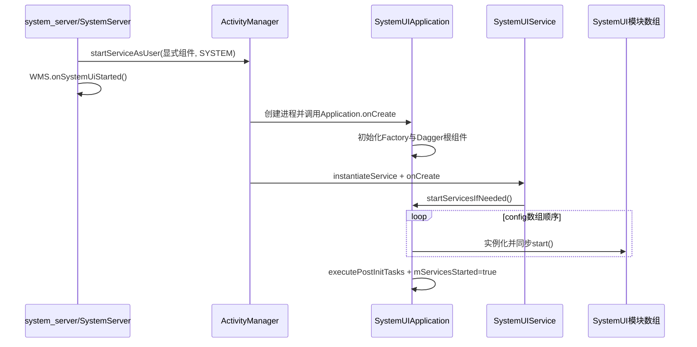
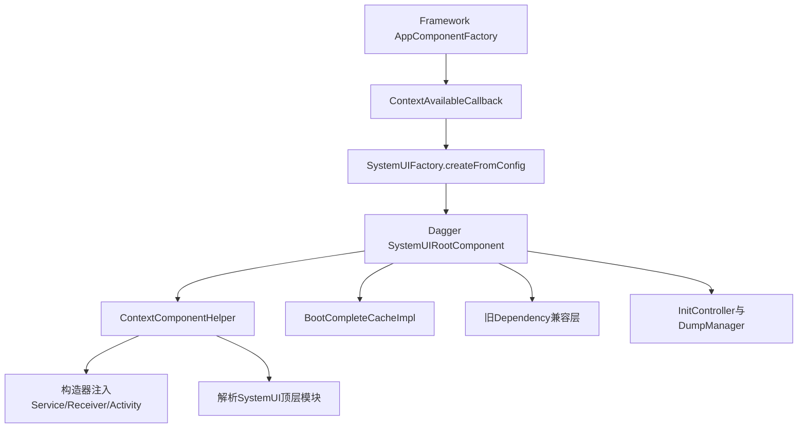
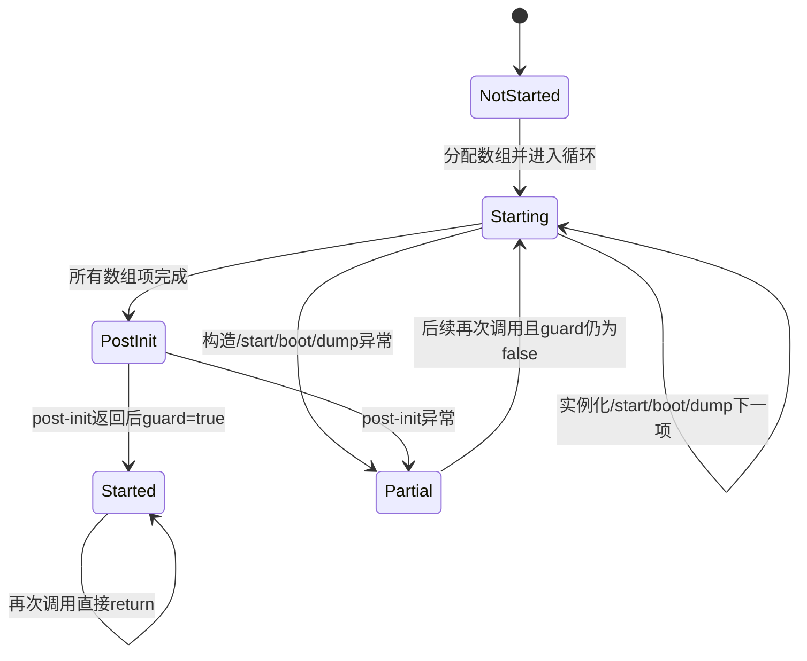

# 第 401 章 Android SystemUI 进程启动：SystemUIApplication、服务数组与 BootComplete 分发链

> 源码基线：Android 11 / API 30 / `android-11.0.0_r48`。本章只在 macOS 阅读本地源码，不编译。目标不是背一份类名清单，而是能区分“system_server 发出启动请求”“SystemUIService 进入 onCreate”“某个 SystemUI 模块执行 start”“模块收到 onBootCompleted”这四个不同完成点。

## 1. 本章先回答什么

开机时是谁启动 `com.android.systemui` 进程，Application、Service 和二十多个 `SystemUI` 模块按什么顺序出现，以及进程晚启动或崩溃重启时怎样补发 boot-complete 语义。

## 2. SystemUI 不是普通界面应用

状态栏、通知栏、锁屏、导航栏、音量面板等都在这里，但它仍运行在独立应用进程中。它通过 Binder 接收 system_server 命令，也通过普通 Android Application、Service、Receiver 和资源机制完成自身启动。

## 3. 本章源码入口

主入口是 `SystemServer.startSystemUi()`、`AndroidManifest.xml`、`SystemUIAppComponentFactory`、`SystemUIApplication`、`SystemUIFactory`、`SystemUIService`、`BootCompleteCacheImpl` 与 `res/values/config.xml`。

## 4. 先建立五层模型

第一层是 system_server 发启动请求；第二层是 ActivityManager 创建/复用进程；第三层是 Application 建 Dagger 根图；第四层是 Service 触发组件数组；第五层是各业务模块自己注册监听并进入工作状态。

## 5. 四个“已启动”不能混用

`startServiceAsUser()` 返回、`SystemUIService.onCreate()` 进入、`SystemUI.start()` 返回、整个数组和 post-init 全部完成，分别是四个时间点。排查半启动故障时必须明确日志属于哪一层。

## 6. SystemUI 的系统端入口

`SystemServer` 在系统服务启动流程中调用 `startSystemUi(context, windowManagerF)`。它不直接 new SystemUIApplication，也不逐项 new 状态栏模块，而是走 ActivityManager 的 Service 启动机制。

## 7. 组件名不是在 SystemServer 写死

`PackageManagerInternal.getSystemUiServiceComponent()` 返回显式 `ComponentName`。这样产品可以通过包管理内部配置确定实际 SystemUI Service，而 SystemServer 不依赖具体 Java 类名。

## 8. SystemServer 的决定性片段

```java
private static void startSystemUi(Context context, WindowManagerService windowManager) {
    PackageManagerInternal pm = LocalServices.getService(PackageManagerInternal.class);
    Intent intent = new Intent();
    intent.setComponent(pm.getSystemUiServiceComponent());
    intent.addFlags(Intent.FLAG_DEBUG_TRIAGED_MISSING);
    context.startServiceAsUser(intent, UserHandle.SYSTEM);
    windowManager.onSystemUiStarted();
}
```

显式 Intent 被送给 system user；`FLAG_DEBUG_TRIAGED_MISSING` 是调试/问题归类标志，不是“保证服务必定启动”的开关。

## 9. WMS 回调的严格语义

`windowManager.onSystemUiStarted()` 紧跟在 `startServiceAsUser()` 后面调用。由代码顺序只能证明 SystemServer 已经提交启动请求，不能证明目标进程已创建、Service 已回调，更不能证明状态栏已经画出首帧。

## 10. 主启动总图



## 11. 为什么图中 WMS 回调在前

SystemServer 和目标 SystemUI 进程并发推进。WMS 回调发生在发起者线程，而 Application/Service 生命周期要等 AMS 调度目标进程，所以不能拿两边日志的书写位置推断目标进程已完成初始化。

## 12. Manifest 定义进程骨架

`frameworks/base/packages/SystemUI/AndroidManifest.xml` 的 Application 使用包默认进程 `com.android.systemui`，设置 `persistent=true`、`directBootAware=true` 和 `defaultToDeviceProtectedStorage=true`。

## 13. persistent 的含义

它表达系统希望该进程常驻，并允许系统在进程退出后重启它；它不等于永不崩溃，也不等于内存里的单例与监听会跨进程死亡保存。

## 14. Direct Boot 的含义

`directBootAware` 使组件可在用户凭据加密存储尚未解锁时运行；`defaultToDeviceProtectedStorage` 使默认存储上下文指向设备加密区。模块若需要 CE 数据，仍须自己等待用户解锁，不能因 Application 已启动就假定 CE 可读。

## 15. SystemUIService 的声明

主 Service 名为 `.SystemUIService`。r48 Manifest 中它是 exported，但没有用声明权限保护；本章只记录源码事实，不把它直接推导为可利用漏洞，因为实际调用还受组件、后台启动、UID、SELinux 和服务既有状态等共同约束。

## 16. Application 的 AppComponentFactory

Manifest 指定 `.SystemUIAppComponentFactory`。Android Framework 在反射创建 Application、Service、Activity、Receiver 和 Provider 时，先给这个工厂一次接管实例化的机会。

## 17. 为什么工厂必须早于 Application.onCreate

`SystemUIApplication.onCreate()` 第一件关键工作就是调用事先注入的 `mContextAvailableCallback`。这个回调来自 AppComponentFactory；若没有先安装，Dagger 根图就无法按预期建立。

## 18. Application 实例化回调

工厂正常创建 Application 后，如果对象实现 `ContextInitializer`，就设置一个 callback。callback 收到 Context 时先 `SystemUIFactory.createFromConfig(context)`，再让根组件对 AppComponentFactory 做成员注入。

## 19. 回调不是普通业务监听

它构成“Framework 反射创建对象”与“SystemUI Dagger 对象图”之间的引导桥。后续构造器注入能工作，依赖这个最早的 bootstrap 已经完成。

## 20. Service 如何使用构造器注入

工厂创建 Service 时先用 `ContextComponentHelper.resolveService(className)` 查 Dagger 映射。找到就直接返回注入完成的对象；找不到才退回 Framework 默认反射实例化。

## 21. Activity 与 Receiver 同理

Activity、Service、BroadcastReceiver 都优先查对应 resolver，再 fallback。这个设计允许一部分组件迁入 Dagger，未迁入的组件仍沿用传统无参构造，不必一次改完全部代码。

## 22. Provider 是不同路径

ContentProvider 仍由 Framework 创建，然后 AppComponentFactory 对其做成员注入；不要把 Service 的构造器注入结论机械套到 Provider。

## 23. SystemUIApplication.onCreate 顶部约束

源码注释明确要求依赖注入保持在方法顶部。这里用 `TimingsTraceLog("SystemUIBootTiming")` 包住 `DependencyInjection`，便于从 trace 区分 Dagger bootstrap 与后续模块启动耗时。

## 24. 第一批保存的对象

Application 从 `SystemUIFactory.getInstance().getRootComponent()` 取得根组件，再保存 `ContextComponentHelper` 与 `BootCompleteCacheImpl`。后续模块实例化、配置分发和启动补偿都依赖这些对象。

## 25. 为什么又调用 setTheme

源码说明 Manifest 的 Application theme 只对 Activity 继承有效；SystemUI 的 Service 也可能创建 View，因此 Application 再调用 `setTheme(R.style.Theme_SystemUI)`，并要求与 Manifest 配置保持同步。

## 26. SystemUIFactory 来自资源

`createFromConfig()` 读取 `config_systemUIFactoryComponent`，用当前 Context 的 ClassLoader 加载类并实例化。默认是 `SystemUIFactory`，TV 或厂商资源覆盖可换成派生工厂。

## 27. Factory 是进程静态单例

`mFactory != null` 时立即返回。它只保证当前进程本次生命期内不重复初始化；进程死亡重启后静态字段全部重新建立。

## 28. Factory 初始化失败策略

类名为空会抛 RuntimeException；加载、构造或 init 的任意 `Throwable` 会记录警告再包装成 RuntimeException。这里选择 fail-fast，因为没有完整根图的 SystemUI 继续运行通常只会产生更难理解的半成品。

## 29. Dagger 根组件如何建立

默认工厂调用 `DaggerSystemUIRootComponent.builder()`，传入 `DependencyProvider` 和保存 Context 的 `ContextHolder`。根组件是当前 SystemUI 进程共享单例对象图的入口。

## 30. 根组件并非业务模块数组

Dagger 图负责“对象怎样构造、依赖从哪里来”；`config_systemUIServiceComponents` 负责“哪些顶层模块按什么顺序 start”。两者相交但不等价。

## 31. 旧 Dependency 为什么仍提前启动

`SystemUIFactory.init()` 主动 new `Dependency`，再让 Dagger 注入并调用 `dependency.start()`。源码注释说明大量旧代码仍依赖静态 `Dependency.get()`，所以它是从 service-locator 向 Dagger 迁移期的兼容桥。

## 32. Factory 与根图关系图



## 33. 当前 user 决定启动分支

完成根图和 theme 后，Application 检查 `Process.myUserHandle()`。system user 与非 system user 走完全不同的启动策略。

## 34. system user 分支不立即启动模块

它只注册 BOOT_COMPLETED 与 LOCALE_CHANGED Receiver。真正全量调用 `startServicesIfNeeded()` 的入口是稍后由 AMS 创建的 `SystemUIService.onCreate()`。

## 35. 为什么由 Service 触发全量启动

SystemServer 已通过显式 Service 表达“现在需要 SystemUI”。Application 只负责进程级 bootstrap，Service 则成为可由系统服务启动协议控制的业务总开关。

## 36. BOOT_COMPLETED Receiver 的优先级

IntentFilter 使用 `SYSTEM_HIGH_PRIORITY`。优先级只影响广播分发顺序，不会把 Receiver 变成独立线程，也不会保证它先于一切开机工作。

## 37. Receiver 的第一道短路

`onReceive()` 首先检查 `mBootCompleteCache.isBootComplete()`；若已经为 true 就直接 return。这样可以防止重复调用各模块 `onBootCompleted()`。

## 38. 首次广播处理顺序

缓存仍为 false 时，Receiver 先注销自己，再设置缓存，最后在 `mServicesStarted` 为 true 时遍历现有模块调用 `onBootCompleted()`。

## 39. 一个细微的注册残留

若缓存在广播到达前已因 `sys.boot_completed=1` 被设为 true，Receiver 命中开头 return，不会执行 `unregisterReceiver(this)`。这意味着该动态 Receiver 可留到进程结束；它以后只做一次布尔判断，不能误说成会重复分发模块回调。

## 40. 广播早于模块完成会怎样

正常情况下 Application 和 Service 生命周期及动态 Receiver 默认都在主线程，同一线程不会在一段同步启动循环中间抢占执行另一个回调。概念上仍有两种合法顺序：先 boot 再启动模块，或先模块完成再收到 boot。

## 41. 先收到 boot 的路径

Receiver 把 cache 设为 true；以后启动数组时，每个模块 `start()` 后立刻调用它自己的 `onBootCompleted()`。因此晚创建模块不会永久错过开机语义。

## 42. 先完成模块的路径

数组启动完时 cache 仍为 false，不调用 boot hook；稍后 Receiver 遍历整个 `mServices`，为每个模块补发一次。

## 43. LOCALE_CHANGED 的门槛

Locale Receiver 在 boot cache 为 false 时直接忽略；boot 后调用 `NotificationChannels.createAll(context)`，用新语言重建系统通知渠道的显示名称。

## 44. 为什么不在 boot 前改渠道

系统尚未完成 boot 时相关服务与用户状态可能未稳定。r48 代码用 BootCompleteCache 做明确门槛；这是此版本实现，不应外推成所有 Locale 监听都必须如此。

## 45. 非 system user 先识别子进程

代码取得当前进程名和 Application 默认进程名；若当前名以 `默认名 + ":"` 开头，就 return。截图、tuner 等冒号子进程不需要整套 per-user SystemUI 模块。

## 46. 子进程 return 前已经做过什么

进程名判断位于依赖注入与 setTheme 之后，所以子进程仍建立自己的 Factory/Dagger 根图，只是不再启动顶层模块数组。不能说“子进程完全不初始化 SystemUI”。

## 47. secondary user 的正常主进程

非 system user 且不是冒号子进程时，Application 直接调用 `startSecondaryUserServicesIfNeeded()`。注释解释系统 BOOT_COMPLETED 已针对主 SystemUI 进程发送，不能等待它再次驱动当前 secondary user。

## 48. per-user 数组很小

r48 默认 `config_systemUIServiceComponentsPerUser` 只有 `NotificationChannels`。产品资源可以覆盖，因此读设备行为时要检查最终资源，不能只背 AOSP 默认值。

## 49. SecondaryUserService 的作用

Manifest 还有 exported=false 的 `SystemUISecondaryUserService`，其 onCreate 同样请求 per-user 数组。Application 已经启动过时，共享 `mServicesStarted` 会让第二次调用成为 no-op。

## 50. 共享 guard 为什么没有冲突

system user 和每个 secondary user 运行在各自 user/进程语境中，静态对象与 Application 字段并不跨进程共享。在单个进程内，这个 guard 表示只选择并完成一种顶层数组启动。

## 51. 两类组件清单入口

`SystemUIFactory.getSystemUIServiceComponents(resources)` 读取完整数组；`getSystemUIServiceComponentsPerUser(resources)` 读取 per-user 数组。资源数组就是可覆盖的启动配置。

## 52. 数组是可执行顺序

循环严格按资源索引实例化、start、boot hook、dump 注册。前项可以为后项准备依赖或状态；随意调整顺序可能改变时序，不只是改变 README 式清单。

## 53. r48 默认前几项

完整数组开头依次包含 `NotificationChannels`、`KeyguardViewMediator`、`Recents`、`VolumeUI`、`Divider`、`StatusBar` 等。后面还有电源、铃声、键盘、PiP、全局操作、屏幕装饰、认证、主题与无障碍组件。

## 54. 厂商项也在数组中

默认配置包含 vendor service 入口，产品/设备 overlay 还能替换整个或部分资源。学习某台设备必须同时追资源 overlay 合并结果。

## 55. startServicesIfNeeded 的线程契约

注释要求只能在主线程调用，但方法本身没有运行时 `Looper` 断言。r48 的标准入口来自 Application/Service 主线程；自定义调用方若破坏契约，源码不会自动纠正。

## 56. 第一行幂等判断

`mServicesStarted` 为 true 就返回。它防止“完成后的重复启动”，但没有单独的 `mServicesStarting` 状态，所以不能阻止启动过程中的重入。

## 57. 数组先按目标长度分配

`mServices = new SystemUI[services.length]` 在循环前执行。若中途失败，前半部分有对象、后半部分是 null，形成可诊断的部分初始化现场。

## 58. 为什么检查系统属性

SystemUI 可能在 BOOT_COMPLETED 广播之后才首次启动，或进程在 boot 后崩溃重启。此时动态 Receiver 不可能收到历史广播，所以代码检查 `sys.boot_completed` 是否为 `"1"`。

## 59. 属性补偿的边界

属性只把 BootCompleteCache 置 true，再由模块启动循环补调 hook；它不重放原始 Intent，也不重现广播 extras、顺序或其他 Receiver 的副作用。

## 60. BootCompleteCache 的真实来源

这里的“boot complete”由 BOOT_COMPLETED 广播或 `sys.boot_completed` 属性推导，不是 SystemUI 直接订阅 SystemService boot phase。命名相似不代表信号源相同。

## 61. DumpManager 在循环前取得

根组件创建/提供 DumpManager，随后每个成功启动的模块按类名注册。这样后续 `SystemUIService.dump()` 可以统一分派模块诊断信息。

## 62. 每项先尝试 Dagger

循环调用 `mComponentHelper.resolveSystemUI(clsName)`。resolver 根据类名查 provider；命中时对象的复杂构造依赖由 Dagger 满足。

## 63. Dagger 未命中的反射 fallback

源码执行：

```java
SystemUI obj = mComponentHelper.resolveSystemUI(clsName);
if (obj == null) {
    Constructor constructor = Class.forName(clsName)
            .getConstructor(Context.class);
    obj = (SystemUI) constructor.newInstance(this);
}
mServices[i] = obj;
```

fallback 要求恰好存在 public `(Context)` 构造器；不是任意无参构造器，也不会自动完成 Dagger 字段注入。

## 64. 反射异常如何处理

Class 不存在、构造器不匹配、不可访问、实例化失败或 InvocationTargetException 被包装成 RuntimeException。循环没有跳过坏项继续启动余下模块。

## 65. start() 是同步调用

对象写入 `mServices[i]` 后立即调用 `mServices[i].start()`。方法本身在当前主线程同步执行；模块内部可以再 post 异步任务，但“所有 start 都异步”是错误结论。

## 66. start 抛异常不会被该 catch 接住

try/catch 只包实例化区域，`start()` 位于其后。模块 start 抛出的 RuntimeException/Error 会直接中断后续数组、post-init 和最终 guard 赋值。

## 67. 一项慢会拖住后面全部

循环串行执行。某模块在 start 中做磁盘 I/O、Binder 同步等待或复杂构造，会延迟状态栏之后的模块，并占住 SystemUI 主线程。

## 68. 一秒只是告警阈值

每项使用 `System.currentTimeMillis()` 计算耗时，超过 1000ms 打 warning；不会超时取消，也不会自动把工作移到后台。

## 69. 计时器的限制

`currentTimeMillis` 是墙上时钟，理论上会受时钟调整影响，不如 monotonic 时钟适合严格耗时。这里主要用于粗粒度启动告警，trace 才更适合完整时间线。

## 70. boot hook 位于 start 之后

cache 已 true 时，每项先 `start()`，再 `onBootCompleted()`。所以模块可以先在 start 建立成员和监听，再消费 boot-complete 语义。

## 71. dump 注册更靠后

顺序是 start → 可选 boot hook → `dumpManager.registerDumpable`。如果 start 或 boot hook 抛异常，本项可能已产生副作用，却尚未进入统一 dump 清单。

## 72. 循环后的 post-init

所有数组项结束后调用 `InitController.executePostInitTasks()`。这是需要等常规模块都建好后再执行的一次性尾部任务，下一章会专门拆解。

## 73. guard 最后才设 true

`mServicesStarted = true` 位于 post-init 之后。因此只有全部模块、boot hook、dump 注册和 post-init 都顺利返回，Application 才承认本轮启动完成。

## 74. 失败现场状态机



## 75. 没有 rollback

中途异常时源码不会倒序注销前面模块、撤销 Receiver 或清空 Dagger 单例。若进程未立即死亡而有人重试，前面模块可能再次 start，产生重复监听风险。

## 76. 启动重入风险

因为没有 starting guard，某个模块的 start 若同步再次调用 Application 的 `startServicesIfNeeded()`，内层会看到 false 并重新分配数组、从第一项开始。标准模块应避免这种调用。

## 77. 为什么常态下风险不明显

官方入口简单且主线程串行，模块通常不回调总入口；启动异常往往让进程崩溃重启，新的进程从干净内存开始。但读源码时仍要区分“常态未触发”和“代码结构绝对不可能”。

## 78. BootCompleteCache 的线程安全核心

`BootCompleteCacheImpl` 用 `AtomicBoolean` 保存最终状态，`setBootComplete()` 通过 compare-and-set 保证 false→true 只成功一次。

## 79. listener 为什么是弱引用

缓存保存 `WeakReference<BootCompleteListener>`，避免单纯为了等待 boot 而永久强持有对象。回调时已回收的 listener 会被跳过。

## 80. setBootComplete 的回调线程

成功 CAS 后，实现在同步块内遍历并直接调用 listener，然后清空列表。它没有切换线程；回调运行在调用 `setBootComplete()` 的线程上。

## 81. addListener 的返回值很重要

若 boot 已完成，`addListener` 返回 true，并且不会再调用 listener。调用方必须根据返回值立即走“已经完成”的路径，不能只被动等回调。

## 82. 双重检查避免竞态

add 先在锁外读 atomic，再进入 listener 锁后复查；否则 boot 可能正好发生在第一次检查与加入列表之间，导致新 listener 永远收不到通知。

## 83. removeListener 的边界

boot 已完成后 listener 列表已经清空，remove 直接无事可做；boot 前则在锁内移除对应弱引用。这是一次性门闩，不是可反复开关的状态机。

## 84. 模块 hook 与 cache listener 是两套机制

Application 对顶层 `SystemUI[]` 显式调用 `onBootCompleted()`；其他对象也可向 BootCompleteCache 注册 listener。两条路径共享同一状态，但不要假定每个顶层模块都通过 listener 收到回调。

## 85. SystemUI 抽象基类很薄

`SystemUI` 保存 Context，要求子类实现 `start()`，并提供默认空实现的 `onBootCompleted()`、`onConfigurationChanged()` 和 `dump()`。生命周期协议由 Application 循环约定，不是 Framework Service 生命周期。

## 86. 顶层模块不是 Android Service

`StatusBar`、`PowerUI` 等多数只是 `SystemUI` 子类。它们由资源数组和 Dagger/反射创建，不由 AMS 分别管理，没有各自的 `ServiceRecord`。

## 87. SystemUIService 才是 Android Service

它本身通过 AppComponentFactory 和 Dagger 构造器注入 Main Handler、DumpHandler、BroadcastDispatcher、LogBufferFreezer 和 BatteryStateNotifier。

## 88. Service.onCreate 第一项业务

调用 `((SystemUIApplication) getApplication()).startServicesIfNeeded()`。只有这次同步调用返回，才继续安装日志冻结、可选电池通知和 Binder 代理诊断。

## 89. Service 后续初始化顺序

先让 `LogBufferFreezer` attach 到 BroadcastDispatcher；资源允许时启动未知电池状态通知；debuggable 构建还配置故意崩溃属性与 Binder proxy 数量监测。

## 90. debug.crash_sysui 的位置

调试属性检查发生在顶层模块数组已经启动以后。它用于 RescueParty 调试；触发时进程会带着已经发生的启动副作用崩溃，而不是在任何模块之前退出。

## 91. Binder proxy 水位

debuggable 构建启用计数，水位是 1000/900；达到限制时回调投递到主 Handler 并记录哪个 UID 向 SystemUI 发送过多 Binder proxy。这是泄漏诊断，不是普通 Binder 事务限流说明。

## 92. AuxiliaryDumpService

主 Service 最后以 system user 启动 `SystemUIAuxiliaryDumpService`，用于 bugreport 时补充 dump 信息。它是诊断辅助组件，不是启动业务模块数组的第二入口。

## 93. onBind 返回 null

`SystemUIService` 是 started service，不向绑定客户端公开业务 Binder。SystemUI 与 system_server 的实际交互分散在 StatusBar、CommandQueue 等 Binder/回调链中，下一批章节会逐条追踪。

## 94. Service.dump 的默认优先级

无参数 dump 被改写为 `--dump-priority CRITICAL`，因为源码将这种调用推断为 bugreport 场景。显式参数则原样交给 `DumpHandler`。

## 95. 配置变化如何进入模块

`SystemUIApplication.onConfigurationChanged()` 只在 `mServicesStarted` 为 true 时处理：先通知根组件的 ConfigurationController，再逐项调用顶层模块自己的 hook。

## 96. 两条配置路径可能相遇

某模块既可能注册 ConfigurationController listener，又覆盖 `SystemUI.onConfigurationChanged()`。两种机制是否都使用要按具体类核对，不能看到总循环就断言每个对象只收一次。

## 97. 启动未完成时的配置变化

guard 仍为 false 就整体忽略 Application 的这条分发。模块初始化时应从当前 Resources/Configuration 建立初始状态，不能依赖必有一条历史配置回放。

## 98. system user 的完整时间线

进程创建 → 工厂/Dagger → 注册 boot/locale → SystemUIService 创建 → 全数组同步 start → post-init → guard=true；boot 信号可以在模块启动前已由属性确认，也可以在启动后由广播到来。

## 99. secondary user 的时间线

进程创建 → 工厂/Dagger → 排除冒号子进程 → Application 直接启动 per-user 数组 → 每项因系统早已 boot 而通常由属性补齐 hook。它不需要等待主用户那次历史广播重发。

## 100. boot 后进程重启的时间线

新的静态 Factory、根图、Application 和模块全部重建；动态 Receiver 重新注册；启动数组前读到 `sys.boot_completed=1`，于是每个新模块在 start 后立刻收到 boot hook。

## 101. “persistent 保存状态”是误解

persistent 只影响进程管理优先级/重启策略。崩溃前的 Java 堆、mServicesStarted、listener 列表和 Dagger 单例都消失；需要恢复的状态必须来自系统服务、Settings、文件或重新查询。

## 102. “BOOT_COMPLETED 启动 SystemUI”是误解

主链是 SystemServer 显式启动 SystemUIService。BOOT_COMPLETED 在这里主要为模块提供阶段通知；SystemUIService 甚至可能在 boot 信号之前就启动数组。

## 103. “资源数组只是依赖声明”是误解

它是顺序执行清单。Dagger 才描述构造依赖；数组缺项意味着对应顶层模块不会由这条主循环 start，顺序变化也会改变观察到的系统状态。

## 104. “Dagger 命中失败就无法启动”是误解

resolver 返回 null 时有 `(Context)` 反射 fallback。真正的边界是类与构造器必须匹配，而且 fallback 对象不会自动得到 Dagger 构造器依赖。

## 105. “mServicesStarted 防住所有重复”是误解

它只在整轮成功末尾置 true；中途异常、post-init 异常和同步重入都处于 false。诊断重复注册时应检查是否发生部分启动或自调用。

## 106. 一条实用排错分层

先找 SystemServer 发请求日志，再找 Application DependencyInjection trace，再看每项 `loading/running` 与超过 1 秒警告，最后查 post-init、Service 后续日志和具体模块 dump。

## 107. 如何定位“状态栏没出来”

不要直接断言 StatusBar.start 失败。先确认进程、SystemUIService、数组是否走到 StatusBar 索引；再区分 start 返回、窗口创建、WMS 接受、Surface 首帧和显示合成。

## 108. 如何定位“重启后部分功能重复”

若是完整进程重启，旧 Java listener 理应随进程消失；若同一进程内捕获异常后重试，则要检查 guard 仍 false、前项是否已经注册到外部服务，以及模块 start 是否幂等。

## 109. 如何定位“secondary user 缺功能”

先确认进程名是否被冒号子进程判断排除，再检查产品最终的 per-user 资源数组。不要拿 system user 的完整数组作为 secondary user 必然启动清单。

## 110. 本章最小心智模型

SystemServer 只按 Service 协议点火；AppComponentFactory/Factory/Dagger 先造对象图；SystemUIService 让 Application 按资源顺序同步启动顶层模块；BootCompleteCache 把广播已错过和进程重启统一成一次性阶段状态。

## 111. 本章练习说明

下面恰好四项练习，全部只读 `android-11.0.0_r48` 本地源码，不运行编译、不修改源码。每项建议输出一张时间线和一段“这个成功点不能证明什么”。

## 112. macOS只读练习一：标注四个启动完成点

用 `rg -n "startSystemUi|startServicesIfNeeded|mServicesStarted" frameworks/base` 找入口，在纸面画出 startService 请求、Service.onCreate、单模块 start 和全数组完成四个时间点，并为每点写一个不能推出的结论。

## 113. macOS只读练习二：核对真实启动数组

阅读 `packages/SystemUI/res/values/config.xml` 里的完整与 per-user 两个数组，再用 `rg "config_systemUIServiceComponents"` 查 overlay；记录 StatusBar 的前后邻居，以及产品覆盖为什么可能改变顺序。

## 114. macOS只读练习三：推演 boot 后崩溃重启

串读 `SystemUIApplication` 与 `BootCompleteCacheImpl.kt`，假设 BOOT_COMPLETED 已发出、SystemUI 随后被杀，写出新进程如何借 `sys.boot_completed` 让每个新模块在 start 后收到 hook。

## 115. macOS只读练习四：构造部分启动故障树

假设数组第六项 `start()` 抛 RuntimeException，只读推演 `mServices`、`mServicesStarted`、DumpManager 和前五项监听的状态；再说明同进程重试与进程崩溃重启为什么结论不同。

## 116. 易错点一：Application 一创建就启动全量模块

对 system user 不成立。Application 先建根图并注册 Receiver，全量数组由 SystemUIService.onCreate 触发；secondary user 正常主进程才在 Application 中直接启动 per-user 数组。

## 117. 易错点二：onBootCompleted 总由广播线程调用

不成立。它可能在 BOOT_COMPLETED Receiver 遍历时调用，也可能在启动循环检测到 cache 已完成后紧跟 start 调用；BootCompleteCache listener 也在 set 调用线程同步执行。

## 118. 易错点三：WMS.onSystemUiStarted 表示 UI 已就绪

不成立。SystemServer 在提交 Service 启动请求后立即调用它；目标进程的 Application、Service、模块、窗口和首帧仍可能尚未发生。

## 119. 复读源码后的修正

本章复查了三处最容易写过头的地方：system user 的模块不是由 Application 直接启动；`mServicesStarted` 在 post-init 后才置 true，不能防启动中重入；boot cache 已被系统属性置位时 Receiver 会直接 return，因而可能保留注册但不会重复分发。所有“成功”表述已限制在对应源码层级。

## 120. 本章结论

Android 11 r48 的 SystemUI 启动是一条“系统端显式 Service 点火 + 进程内依赖注入 bootstrap + 资源数组顺序执行 + 一次性 boot 阶段补偿”的链。掌握请求、对象图、模块 start、boot hook 与首帧之间的距离后，下一章继续深读 `SystemUIRootComponent`、`Dependency`、`ContextComponentHelper` 与 `InitController`，解释对象究竟由谁提供、延迟任务为何放在数组末尾。
