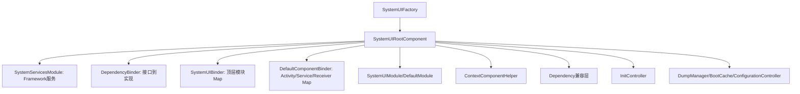
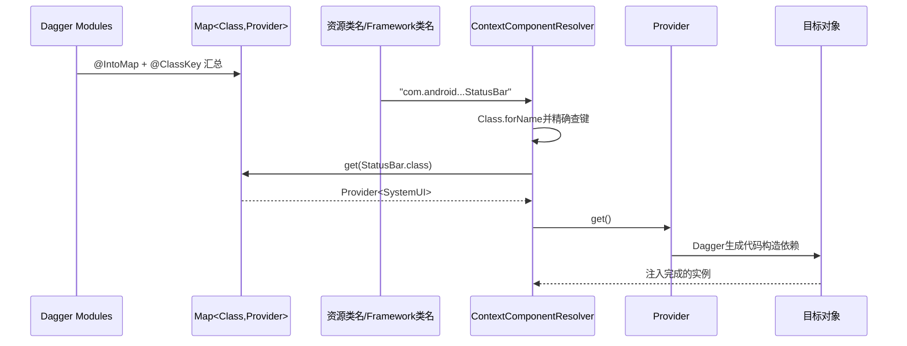
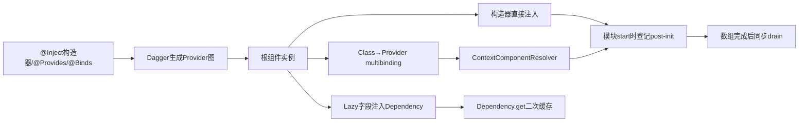

# 第 402 章 Android SystemUI Dagger 根组件、Dependency、ContextComponentHelper 与 InitController

> 源码基线：Android 11 / API 30 / `android-11.0.0_r48`。本章只在 macOS 阅读源码，不编译。第401章已经回答“何时启动模块”，本章继续回答“对象由谁创建、接口为何能得到实现、资源里的类名怎样接到Dagger Provider、为什么还有全局Dependency，以及启动尾部任务如何收敛”。

## 1. 本章核心问题

SystemUI 里一个构造器可能有十几个参数，却看不到调用方逐项 new。答案不是“Java 自动创建”，而是 Dagger 在构建时生成对象图代码，运行时按 binding、scope、Provider 与 component 组装对象。

## 2. 先区分四种机制

`SystemUIRootComponent` 管完整依赖图；`ContextComponentResolver` 把 Framework 给出的类名转为 Provider；`Dependency` 为旧代码提供静态查询和二次缓存；`InitController` 延后执行必须等所有顶层模块就绪的任务。

## 3. 为什么不能把它们统称“单例容器”

根组件有作用域规则，resolver 只是查表，Dependency 又维护自己的缓存，InitController 则维护一次性任务队列。四者的数据结构和生命周期完全不同。

## 4. Dagger 解决的三个问题

它决定具体类型怎么构造、接口绑定哪个实现、同一个对象是否复用。它不决定资源数组的启动顺序，也不自动调用每个 `SystemUI.start()`。

## 5. 运行时反射不是主依赖路径

Dagger 根据 `@Inject`、`@Provides`、`@Binds` 等注解生成 Java 代码。标准依赖解析主要是生成代码调用；第401章的 `(Context)` 反射只是顶层模块未进入 multibinding map 时的兼容 fallback。

## 6. 根组件从哪里创建

默认 `SystemUIFactory.buildSystemUIRootComponent()` 调用 `DaggerSystemUIRootComponent.builder()`，放入 `DependencyProvider` 与 `ContextHolder` 后 build。

## 7. DaggerSystemUIRootComponent 是生成类

源码树里看到的是接口和 module；`DaggerSystemUIRootComponent` 来自 Dagger 注解处理生成。当前 Mac 只读学习不必编译，也不应因源目录找不到手写文件就判断类不存在。

## 8. RootComponent 的作用域

`SystemUIRootComponent` 标记 `@Singleton`。在同一个根组件实例中，标为 Singleton 的 binding 按 Dagger 语义复用；进程重启或新建另一根组件则是另一套实例。

## 9. 单例不是系统全局

SystemUI 主进程、截图冒号子进程和不同 user 进程各自 bootstrap，各有自己的根组件。这里的 Singleton 最多是“该 component 实例范围”，不是跨进程共享对象。

## 10. 根组件总览



## 11. 根组件包含哪些 module

r48 接入 `DefaultComponentBinder`、`DependencyProvider`、`DependencyBinder`、`PipModule`、`SystemServicesModule`、`ContextHolder`、`SystemUIBinder`、`SystemUIModule` 和 `SystemUIDefaultModule`。

## 12. module 是规则集合

它可以声明构造来源、接口映射、多重绑定和 subcomponent。module 本身不是所有业务对象的仓库，也不表示列出的对象在 build 时全部立即实例化。

## 13. ContextHolder 的作用

Factory 把启动时 Context 放进 `ContextHolder`，其 `@Provides` 方法把该 Context 暴露给对象图。许多构造器依赖 Context，最终都追到这里。

## 14. Context 的生命周期边界

传入的是 SystemUI 进程的 Application 语境，根图按进程长期持有它是有意设计。若误传短命 Activity Context 才会形成生命周期错配；默认工厂没有这样做。

## 15. SystemServicesModule 做什么

它把 `context.getSystemService()`、`ServiceManager.getService()` 或 Framework 静态入口包装成 Dagger binding，例如 PowerManager、DisplayManager、IStatusBarService、IWindowManager 等。

## 16. Framework manager 与 Binder interface 不同

`AudioManager` 这类是 Context manager；`IStatusBarService` 这类是 Binder 接口代理。它们都可被注入，但进程边界、调用线程和失败语义不能因同为构造器参数而混淆。

## 17. DependencyBinder 做什么

它大量使用 `@Binds` 把接口映射到实现，例如 `BluetoothController → BluetoothControllerImpl`、`ActivityStarter → ActivityStarterDelegate`、`TunerService → TunerServiceImpl`。

## 18. @Binds 不等于立刻 new

它告诉 Dagger：需要接口时使用这个实现的 binding。实例何时创建、是否缓存，还取决于请求发生时间与对应 scope。

## 19. @Provides 适合工厂逻辑

当对象不能只靠一个 `@Inject` 构造器表达，module 可写 `@Provides`。例如 BatteryController 的 provider 显式 new 实现并调用 `init()` 后返回。

## 20. provider 中的副作用

若 `@Provides` 在返回前调用 init/注册监听，那么“第一次请求这个依赖”本身就可能产生副作用。所谓 lazy 只推迟了副作用，并没有消除它。

## 21. @Nullable binding

r48 某些 binding 可返回 null，例如无蓝牙硬件时的 `LocalBluetoothManager` 或默认 leak report email。调用方与兼容层必须按可空契约处理，不能认为注入字段永不为 null。

## 22. qualifier 为什么必要

同一 Java 类型可能有多个语义实例，如 `@Main Handler`、`@Background Handler`、`@Named(TIME_TICK_HANDLER_NAME) Handler`。qualifier 与类型共同构成依赖键。

## 23. 只按 Handler.class 查询会丢语义

Dependency 兼容层为特殊 Handler/Looper 定义 `DependencyKey`，而新 Dagger 构造器直接写 qualifier。两者都在避免“同类型多个实例”被错误混用。

## 24. SystemUIModule 的接口绑定

它把 `BootCompleteCache` 绑定到 `BootCompleteCacheImpl`、把 `ContextComponentHelper` 绑定到 `ContextComponentResolver`，并声明通知行等 subcomponent 与 optional binding。

## 25. optional binding 的目的

`@BindsOptionalOf` 允许某些形态提供 StatusBar、Divider、HeadsUpManager 等，也允许另一形态缺失。消费者必须请求 Optional/可选形式，不能把“图可构建”误说成每种设备都有同一实现。

## 26. SystemUIDefaultModule 的定位

它提供可以被具体 SystemUI 形态替换的默认实现，例如 HeadsUpManagerPhone、QSFactory、Recents 和 ShadeController。TV 等产品可通过不同 module/factory 改写部分图。

## 27. Factory 是可替换边界

`config_systemUIFactoryComponent` 可选择派生工厂；派生类可覆盖 root component 构建或其他创建方法。因此分析设备代码时要先确认实际 Factory，不要默认永远是 AOSP phone 图。

## 28. 根组件暴露 provision method

接口提供 `provideBootCacheImpl()`、`getContextComponentHelper()`、`createDumpManager()`、`getInitController()`、`getConfigurationController()` 等方法，让启动代码从对象图取得少数根级能力。

## 29. 方法名 create 不保证每次新对象

`createDumpManager()` 名字虽然含 create，返回 binding 的复用行为仍由 Dagger scope 决定。r48 接口上标了 Singleton，阅读时应看 scope，不凭英文方法名推断实例数量。

## 30. member injection 入口

根组件还声明 `inject(SystemUIAppComponentFactory)`、`inject(ContentProvider)` 和 `inject(KeyguardSliceProvider)`。它们对已由 Framework 创建的对象填充字段，不重新替换该对象身份。

## 31. 构造器注入与成员注入

构造器注入能让对象从创建起就具备完整依赖；成员注入发生在对象已被构造之后，中间存在“字段尚未注入”的阶段，因此调用顺序更敏感。

## 32. ContextComponentHelper 只是接口

它定义 resolveActivity、resolveService、resolveBroadcastReceiver、resolveSystemUI 和 resolveRecents。真正实现 `ContextComponentResolver` 由 Dagger 构造。

## 33. Resolver 的五张表

构造器收到五个 `Map<Class<?>, Provider<T>>`，不同组件类别各用一张表。同一个 Class 即使理论上实现多个基类，也不会自动跨类别查找。

## 34. Map 从哪里来

`SystemUIBinder`、`DefaultServiceBinder`、`DefaultActivityBinder`、`DefaultBroadcastReceiverBinder` 等用 `@IntoMap + @ClassKey` 把 binding 汇总为 Dagger multibinding map。

## 35. 一个 SystemUI Map 项

```java
@Binds
@IntoMap
@ClassKey(StatusBar.class)
public abstract SystemUI bindsStatusBar(StatusBar sysui);
```

键是 `StatusBar.class`，值不是预先创建的 StatusBar，而是能在请求时提供 `SystemUI` 的 Provider。

## 36. 为什么值是 Provider

如果 Map 直接放实例，构建根图时就可能创建所有候选组件。Provider 保留按需创建能力，也让 Dagger 自己执行构造依赖与 scope 逻辑。

## 37. Provider.get 是否总返回同一实例

不一定。若 binding 有合适 scope，Dagger 会复用；没有 scope 时可能每次创建。resolver 本身不缓存 get 结果，它只把 Provider 结果交给调用者。

## 38. 顶层启动通常只 resolve 一次

第401章主数组每项只 resolve 一轮，并把对象放入 `mServices[]`。因此即使某 binding 无 scope，正常主启动也通常只持有这一份；Framework Service 的多次实例化则是另一场景。

## 39. Resolver 的查找代码

```java
private <T> T resolve(String className, Map<Class<?>, Provider<T>> creators) {
    try {
        Class<?> clazz = Class.forName(className);
        Provider<T> provider = creators.get(clazz);
        return provider == null ? null : provider.get();
    } catch (ClassNotFoundException e) {
        return null;
    }
}
```

它先把字符串转成 Class，再做精确 Class 键查找，不按父类、接口或简单类名模糊匹配。

## 40. Resolver 仍用了一点反射

这里的 `Class.forName` 只用于把资源/Framework 给出的字符串变成 Map key；对象依赖的构造仍由 Provider/Dagger 完成。要区分“类名解析反射”和“反射调用构造器”。

## 41. ClassNotFound 的语义

resolver 捕获后返回 null。对 SystemUI 主数组而言，Application 随后还会自己 `Class.forName` 并尝试 `(Context)` 构造，最终仍可能抛出更明确的启动异常。

## 42. Provider 异常不被吞掉

catch 只接 `ClassNotFoundException`；Provider.get 内的构造异常、依赖 provider 异常或运行时异常直接向上传播。resolver 不是故障隔离器。

## 43. map 未命中不等于错误

它可能是有意保留的旧式组件，随后走 `(Context)` fallback。`NotificationChannels`、部分外设/厂商顶层项是否命中，应以 `SystemUIBinder` 和包含 module 的真实 map 为准。

## 44. map 命中带来的收益

StatusBar 这类复杂对象可以用构造器声明依赖，测试可替换 binding，产品可换实现，编译期还能发现缺失依赖或重复 Map key 等图错误。

## 45. DefaultServiceBinder 示例

`SystemUIService`、`DozeService`、`ImageWallpaper`、`KeyguardService`、`TakeScreenshotService` 和 `RecordingService` 等进入 Service map，使 AppComponentFactory 能返回构造器注入实例。

## 46. Framework fallback 仍存在

Service map 没有对应 Class 时，AppComponentFactory 调用父实现，通常要求 Framework 能按普通组件规则实例化。迁移期可以让新旧组件共存。

## 47. mComponentHelper 为空的补救

Activity/Service/Receiver 实例化时若工厂字段意外为空，r48 会再次用根组件 inject 工厂。注释说全新格式化设备上观察过此情况；它是容错，不应成为正常初始化顺序。

## 48. 补救的前提

代码直接调用 `SystemUIFactory.getInstance().getRootComponent()`，因此 Factory 必须已经建立。若连 Factory 都是 null，这段补救自身也无法独立 bootstrap。

## 49. multibinding 总图



## 50. 为什么还要旧 Dependency

r48 仍有大量代码写 `Dependency.get(Foo.class)`，尤其旧 View、Presenter 和逐步迁移中的类。Factory 因而在根图建立后立刻创建并启动兼容层。

## 51. Dependency 自己不是 Dagger component

它是一个被 Dagger 成员注入了大量 `Lazy<T>` 的普通 Java 对象，内部再维护 `mProviders` 和 `mDependencies` 两张 ArrayMap。

## 52. DependencyInjector 是 subcomponent

根组件 `createDependency()` 返回 `Dependency.DependencyInjector`，然后 `createSystemUI(dependency)` 对刚 new 的 Dependency 做成员注入。

## 53. 为什么先 new 再注入

这是迁移设计：Dependency 保留旧静态 API 和内部缓存实现，真正对象来源改由 Dagger Lazy 提供。它不是推荐新代码继续复制的模式。

## 54. Dependency.start 做什么

它把 Class 或 DependencyKey 映射到 `Lazy<T>::get` 形式的 creator，最后才设置静态 `sDependency = this`。start 不会主动遍历并创建全部实际依赖。

## 55. lazy 的两层含义

第一层是 Dagger `Lazy<T>` 通常在第一次 get 时取得并缓存结果；第二层是 Dependency 还把结果放进 `mDependencies`。旧 API 因而形成 Dagger 与兼容层双重缓存语境。

## 56. 注释中的性能期望

源码希望依赖延迟初始化以避免 TV 创建无用 phone 能力，但也希望真正会使用的对象尽量在 SystemUI 启动阶段取得，避免用户交互时第一次构造造成卡顿。这是空间、启动与运行时延迟之间的折中。

## 57. 静态 get 的调用链

`Dependency.get(Foo.class)` → `sDependency.getDependency` → 同步的 `getDependencyInner` → 查 mDependencies → creator → Dagger Lazy.get → 缓存结果。

## 58. getDependencyInner 为什么 synchronized

它避免两个线程同时发现缓存未命中并各建一个对象，也把 mDependencies 和自动 dump 注册放在同一个串行临界区内。

## 59. 同步不代表主线程

任意线程都能调用静态 get；第一次构造会发生在调用线程。若 provider 有线程亲和副作用，却被后台线程首次触发，synchronized 不会自动切回主线程。

## 60. 第一次 get 的决定性片段

```java
T obj = (T) mDependencies.get(key);
if (obj == null) {
    obj = createDependency(key);
    mDependencies.put(key, obj);
    if (autoRegisterModulesForDump() && obj instanceof Dumpable) {
        mDumpManager.registerDumpable(obj.getClass().getName(), (Dumpable) obj);
    }
}
```

成功创建的 Dumpable 会自动用运行时类名注册；测试可关闭自动注册，避免 mock 与真实对象同名冲突。

## 61. null 值的细节

ArrayMap.get 对“不存在”和“键映射到 null”都返回 null。可空 provider 若给出 null，兼容层下次仍会进入 create 路径；Dagger Lazy 本身可能已缓存 null，但 Dependency 层无法用 get 区分。

## 62. Unsupported dependency

key 必须是 `DependencyKey` 或 Class，且要存在于 mProviders；否则抛 IllegalArgumentException，并报告已知 provider 数量。静态查询不是能 new 任意 Class 的通用 ServiceLocator。

## 63. 静态 sDependency 的窗口

它在 `start()` 填完整张 provider 表之后才赋值。若某代码在此之前调用 `Dependency.get`，会因 sDependency 为 null 失败；Factory 因此把兼容层初始化放得非常早。

## 64. DependencyKey 的身份

该类没有覆盖 equals/hashCode，键按对象身份工作。调用方应使用 `Dependency.MAIN_HANDLER` 等公开静态常量，自己 new 一个同名 key 也不会命中已有 provider。

## 65. Class key 的身份

Class 对象同时包含 ClassLoader 身份。同名类若由不同 ClassLoader 加载，不是同一个 key；这也是插件类不应随意拿来查询宿主 Dependency 的原因之一。

## 66. destroy 做了什么

`Dependency.destroy(Foo.class, callback)` 从 mDependencies 移除缓存，若是 Dumpable 则注销，然后可调用销毁回调。它只接收 Class，不接收 DependencyKey。

## 67. destroy 不一定造出全新 Dagger 对象

下一次兼容层 get 会再次调用原 `Lazy<T>`；若 Lazy 或 Dagger binding 已缓存实例，可能仍返回同一对象。因此 destroy 的“从 Dependency 缓存移除”不能一概表述为“彻底销毁对象图实例”。

## 68. clearDependencies 更有限

它只把静态 `sDependency` 设为 null，注释用于独立进程 teardown 避免 Context 泄漏；它不遍历 mDependencies 调 destroy，也不销毁根组件。

## 69. Dependency 的生命周期约束

源码注释要求这些对象通常与 SystemUI 同寿命，并自行管理监听：没有客户端时不应无谓持有绑定服务或 Receiver。兼容容器不会替每个依赖自动调用 start/stop。

## 70. Dependency 不是权限边界

`Dependency.get` 是进程内 Java API，解决对象访问，不验证 Binder UID、Android 权限或 user。安全裁决仍在具体系统服务/Controller 的跨进程入口。

## 71. 两种取对象路径会不会得到同一份

构造器注入 Foo 与 `Dependency.get(Foo.class)` 都可能最终追到同一 scoped binding，但必须看具体 scope/provider。不能仅凭类型相同保证引用恒等。

## 72. 迁移新代码的方向

`Dependency.get` 已标 Deprecated，注释指向 dagger 文档。新代码优先把依赖写进构造器，让对象图显式、可测试，并避免隐藏的第一次 get 线程与时机。

## 73. 隐藏依赖为何难测试

方法内部随时静态 get，使构造签名看不出真正前置条件；测试还要操作全局 sDependency。构造器注入则让依赖在创建点完整暴露。

## 74. 隐藏依赖为何易卡顿

调用代码看起来只是一行 get，但首次访问可能构造 Controller、查询系统服务、注册监听甚至做 Binder 调用。性能分析必须识别缓存 miss。

## 75. Dagger scope 也不是生命周期回调

Singleton 只规定实例复用，不会自动调用 Android `onDestroy`、Controller.stop 或 Receiver.unregister。生命周期仍要由拥有者显式实现。

## 76. 构造依赖环在哪里发现

纯 Dagger 构造环通常在生成图时被诊断，Provider/Lazy 可用于打断立即构造环；静态 Dependency.get 则把某些运行时环隐藏到方法执行阶段，可能表现为初始化顺序问题。

## 77. Provider 与 Lazy 不同

Provider 表达“每次请求提供一个值”，是否复用看 binding；Dagger Lazy 表达“首次需要时取得并在该 Lazy 中缓存”。不要因为两者都有 get() 就认为语义完全相同。

## 78. map 中为什么用 Provider 而非 Lazy

Framework 组件理论上可被多次创建，resolver 不应无条件把所有 Activity/Service 变成一份对象。各具体 binding 的 scope 才决定是否共享。

## 79. Activity 尤其不能随便 Singleton

Activity 是 Framework 管理的界面实例，多次启动可能需要多个对象。进入 multibinding map 只表示可构造器注入，不表示它应变成全进程单例。

## 80. SystemUI 顶层类的 scope 要逐个看

有些类被标 Singleton，有些由 provider 提供，有些未加 scope。`@IntoMap` 本身不自动施加 Singleton。

## 81. InitController 为什么存在

StatusBar 启动过程中会创建通知 presenter 等对象，但某些连接动作必须等所有常规依赖/顶层模块完成。直接在构造器里做会撞到尚未建立的协作者。

## 82. 它保存什么

一个 `ArrayList<Runnable> mTasks` 和布尔 `mTasksExecuted`。没有 Handler、Executor、线程池或持久化文件，所以任务就在调用 execute 的线程同步运行。

## 83. addPostInitTask 的门槛

若任务已经全部执行过，再 add 会抛 IllegalStateException；否则按追加顺序加入列表。它强制调用方在启动收束点之前登记。

## 84. execute 的算法

```java
while (!mTasks.isEmpty()) {
    mTasks.remove(0).run();
}
mTasksExecuted = true;
```

任务按 FIFO 执行，每次先从列表移除再 run，最后才把 executed 设为 true。

## 85. 任务运行线程

标准入口是 `SystemUIApplication.startServicesIfNeeded()` 的主线程，所以任务通常在 SystemUI 主线程执行。InitController 自身没有线程断言，换调用方就可能破坏假设。

## 86. 任务可以在执行中追加

因为 `mTasksExecuted` 直到 while 结束才置 true，某个 Runnable 若同步 add 新任务，新任务会进入同一列表并在本轮后续执行。

## 87. 追加也可能制造无限循环

任务若每次运行都重新加入自己，while 永远不空。r48 没有任务数上限或超时；官方两个使用点没有这样做。

## 88. execute 再次调用

成功完成后列表为空，再次 execute 不抛异常，只是跳过 while 并再次写 true。真正被禁止的是完成之后 add 新任务。

## 89. Runnable 抛异常的状态

当前任务已从列表移除，之前任务也已消耗，剩余任务仍在列表，`mTasksExecuted` 还保持 false，异常向上传给 SystemUIApplication。

## 90. 异常后的重试不是全量重放

若同进程再次 execute，已成功/已抛出的任务不会自动回来，只继续当前列表残余项。与此同时第401章的 `mServicesStarted` 仍为 false，顶层模块却可能从头再次 start，形成两套不对称重试行为。

## 91. InitController 也没有 rollback

前几个 Runnable 的副作用不会因后一个失败而撤销。任务应尽量短、幂等，或让致命失败直接结束进程以取得干净重启语境。

## 92. r48 有几个真实登记点

在 SystemUI 主源码中搜索到 StatusBar 和 StatusBarNotificationPresenter 两处调用。结论限定为当前 r48 搜索结果，产品分支可以增加。

## 93. StatusBar 的尾部任务

它保存启动时得到的 disabledFlags1/2，登记 `setUpDisableFlags`。这样初始 disable 状态在其他模块和视图基本建立后统一应用。

## 94. NotificationPresenter 的尾部任务

它延后把 presenter、entry manager、view hierarchy、lockscreen/media/visual stability 等互相接线，并注册通知生命周期扩展与 interrupt suppressor。

## 95. 为什么这类接线不放构造器

构造器适合建立对象不变量，不适合假定整个 SystemUI 世界已经启动。post-init 明确表达“依赖对象可构造”与“所有协作者已经完成顶层 start”是两个阶段。

## 96. post-init 顺序从哪里来

任务登记发生在各模块 start/对象初始化过程中，执行顺序是实际 add 的先后。它不是按 Runnable 类名排序，也不是 Dagger 自动拓扑排序。

## 97. post-init 与 Handler.post 不同

Handler.post 是排进 Looper 稍后执行，可能让当前启动方法先返回；InitController.execute 是当场同步 drain，只有全部 Runnable 返回，SystemUIApplication 才会设置 started guard。

## 98. post-init 与 boot hook 不同

boot hook 表达系统开机阶段已完成，可在模块 start 后逐项调用；post-init 表达本进程本轮组件装配完成，在整个数组之后执行。两者时序信号来源完全不同。

## 99. 完整对象生成链



## 100. 诊断“对象是 null”第一问

先看 binding 是否允许 Nullable，再看请求的是不是正确 qualifier，最后看是 constructor injection、resolver map、Dependency key 还是反射 fallback 路径。

## 101. 诊断“类明明在却 resolver 返回 null”

类存在只让 `Class.forName` 成功；还必须有相同 ClassLoader 下的精确 `@ClassKey` map 项。没有 map 项会返回 null，并不表示 APK 缺这个类。

## 102. 诊断“创建了两份 Controller”

检查 binding scope、是否通过两个不同根组件/进程、是否同时有无 scope Provider 与手工 new、以及测试是否既 inflate 真实对象又向 Dependency 注入 mock。

## 103. 诊断“第一次点击很卡”

搜索点击链里的 `Dependency.get` 或 Dagger Lazy.get，看是否首次创建重对象；再查 provider/init 是否注册服务、做磁盘/Binder工作，并确认线程。

## 104. 诊断“post-init 后才报错”

列出 add 顺序、每个 Runnable 的前置对象、异常发生前已完成的任务与列表残余；不要只看最终 `mServicesStarted=false` 就假定所有尾部任务都没执行。

## 105. 诊断“destroy 后状态还在”

Dependency 只移除自己的缓存；Dagger Lazy/scoped binding 可能仍持对象，外部系统服务也可能仍保存 callback。必须沿所有权逐层确认销毁边界。

## 106. Dagger 编译成功不等运行成功

图完整只能证明静态 binding 可连接；`@Provides` 可以运行时返回 null/抛异常，Framework Binder 可以不可用，Provider.get 也可能执行失败。

## 107. 运行成功不等生命周期正确

对象能构造并不证明 listener 注册/注销对称、用户切换已刷新或多 display 状态隔离。这些属于具体 Controller 的状态机，后续章节逐项分析。

## 108. 阅读构造器的固定方法

对每个参数标注：来源 module、scope、qualifier、是否 Lazy/Provider/Optional、是否 Binder proxy、首次使用线程。这样复杂构造器会变成可追踪的依赖表。

## 109. 阅读 module 的固定方法

区分 `@Binds`、`@Provides`、`@IntoMap`、`@BindsOptionalOf` 和 subcomponent；再查具体实现是否有 `@Singleton`，不要把 module include 当成实例化。

## 110. 本章一句话模型

Dagger 是显式对象图，resolver 是类名到 Provider 的桥，Dependency 是带静态入口与二次缓存的迁移层，InitController 是同步一次性尾队列；四者合起来完成 SystemUI 进程内装配，但各自都不替业务组件管理完整生命周期。

## 111. 本章练习说明

下面恰好四项，全部只读 r48 源码，不编译。每项都要写出“实例键是什么、第一次创建在哪里、谁缓存、在哪个线程执行”四个答案。

## 112. macOS只读练习一：追一条接口绑定

从 `DependencyBinder` 的 `BluetoothController → BluetoothControllerImpl` 开始，用 `rg -n "BluetoothControllerImpl|provideBluetoothController" packages/SystemUI/src` 找构造器、scope和首次请求点，画出接口到实例的链。

## 113. macOS只读练习二：核对StatusBar Map

串读 `SystemUIBinder`、`ContextComponentResolver` 与 `SystemUIApplication`，说明资源字符串怎样变成 Class key、Provider 如何创建 StatusBar，以及 map 未命中时为何才走 `(Context)` 反射。

## 114. macOS只读练习三：拆Dependency双缓存

选择 `CommandQueue.class`，从注入的 `Lazy<CommandQueue>` 追到 mProviders、mDependencies 和 DumpManager；推演首次 get、第二次 get、destroy 后再次 get 各可能返回什么。

## 115. macOS只读练习四：推演post-init异常

阅读 `InitController` 两个真实 add 调用点，假设第二个 Runnable 抛异常，记录列表、mTasksExecuted、mServicesStarted 和已执行副作用；再比较同进程重试与进程重启。

## 116. 易错点一：根组件build会创建所有对象

错误。大量 binding 由 Provider/Lazy 按需创建；build 主要建立对象图与 provider 结构，只有生成代码为满足立即请求而需要的对象才会出现。

## 117. 易错点二：@IntoMap 自动让对象单例

错误。它只汇总 map 项；实例复用看具体 binding 的 scope。resolver 自身也不缓存 Provider.get 的结果。

## 118. 易错点三：InitController 是异步队列

错误。标准路径在主线程同步 remove(0).run，任务全部返回后才设置 SystemUI 启动 guard；Runnable 自己 post 才会产生新的异步边界。

## 119. 复读源码后的修正

本章复读后收紧四处表述：resolver 的 Class.forName 只做精确键转换而非依赖构造；Provider.get 是否复用由 scope 决定；Dependency.destroy 不能保证绕过 Dagger Lazy 得到新实例；post-init 任务异常后已移除任务不会重放、剩余任务却仍保留。这样避免把四层缓存/生命周期混成一个“全局单例池”。

## 120. 本章结论

SystemUI r48 的依赖装配既有编译期 Dagger 主图，也有按 Class 汇总的 Framework 组件桥，还有旧 Dependency 静态入口与启动末尾 InitController。能逐层回答 key、Provider、scope、缓存和线程，才真正看懂“这个对象从哪里来”。下一章进入 `BroadcastDispatcher`，追按 user/Handler 集中注册、广播转发与注销竞态。
