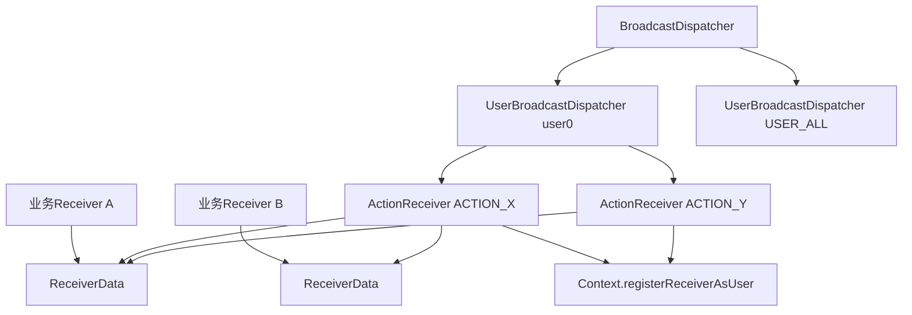
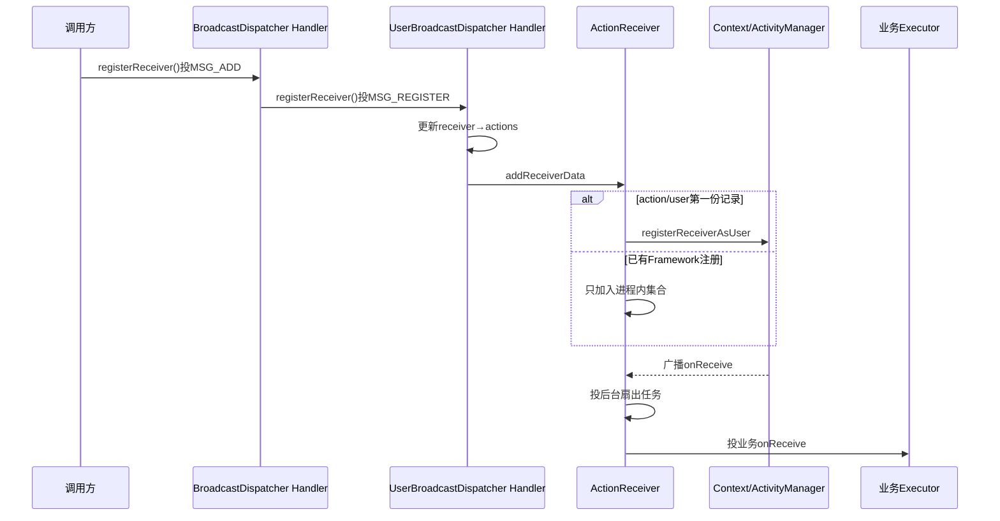
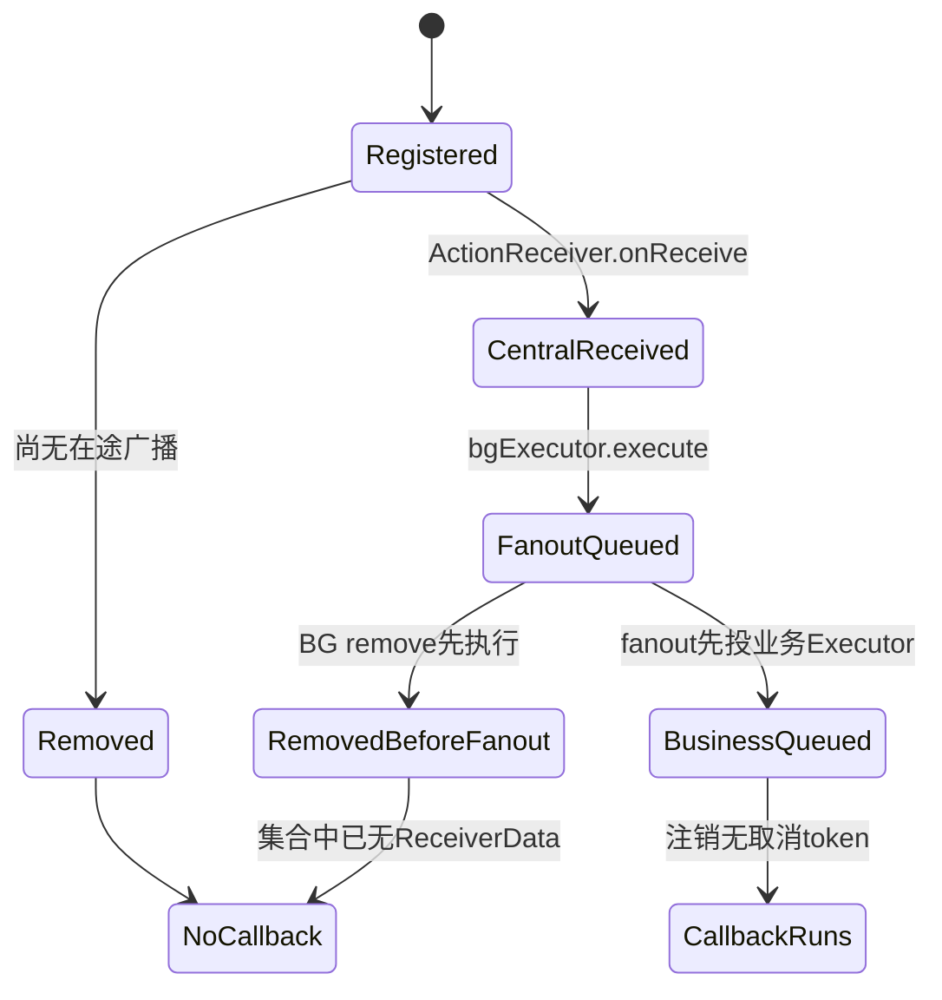

# 第 403 章 Android SystemUI BroadcastDispatcher：按用户注册、Handler/Executor 分发与注销竞态

> 源码基线：Android 11 / API 30 / `android-11.0.0_r48`。本章只在 macOS 阅读源码，不编译。重点是建立“调用方登记记录”和“Context 真正注册的 Receiver”两层模型，并看清注册、收到、扇出、注销分别经过哪些队列。

## 1. 为什么需要集中分发

SystemUI 有大量 Controller、Tile、View 和 Service 监听相同系统广播。若每个对象都直接向 Context 注册，会产生许多 Framework ReceiverDispatcher 和重复 onReceive 入口。

## 2. BroadcastDispatcher 的基本策略

它按 `userId + action` 合并 Framework 注册：同一用户下监听同一 action 的多个业务 Receiver，共享一个 `ActionReceiver`，收到后再在进程内筛选并扇出。

## 3. 合并不等于只有一个系统注册

不同 user 或不同 action 仍对应不同 ActionReceiver。节省量取决于业务监听的 action 重合度，不是把整个 SystemUI 所有广播压成一个 Context Receiver。

## 4. 四类对象

`BroadcastDispatcher` 是总入口；每个 user 有一个 `UserBroadcastDispatcher`；每个 user/action 有一个 `ActionReceiver`；每次业务登记保存一份 `ReceiverData`。

## 5. ReceiverData 保存什么

它是 Kotlin data class，字段为业务 `BroadcastReceiver`、`IntentFilter`、回调 `Executor` 和请求的 `UserHandle`。这些都是引用，没有复制 Filter 或 Intent。

## 6. 三张索引表

总入口用 SparseArray 按 user 找 UBR；UBR 用 action 找 ActionReceiver；UBR 还用业务 Receiver 找它登记过的 action 集合，以便注销时反向删除。

## 7. 一句话数据结构

`userId → action → 多个 ReceiverData` 是正向分发链，`receiver → actions` 是反向清理链。

## 8. 初始化由 Dagger Provider 完成

`DependencyProvider.providesBroadcastDispatcher()` 创建对象、调用 `initialize()` 再返回，并标记 Singleton。拿到依赖的调用方看到的是已启动初始化流程的同一根图实例。

## 9. initialize 做两件事

先向 DumpManager 注册自身，再向后台 Handler 发送“取得启动用户”消息；随后通过 Dispatcher 自己注册 `ACTION_USER_SWITCHED`、user=ALL。

## 10. 对象关系总图

## 11. Dispatcher 自己也是 BroadcastReceiver

它继承 BroadcastReceiver，仅用于接收用户切换 action。这个内部 Receiver 也走同一套集中分发，而不是直接调用 Context 注册。

## 12. 起始 currentUser

后台 Handler 字段初值是 system user，随后 `MSG_SET_STARTING_USER` 调 `ActivityManager.getCurrentUser()` 修正实际前台用户。

## 13. 初始化消息顺序

Provider 在把实例交给其他依赖前先 initialize，set-starting-user 消息也先于内部 user-switch Receiver 的 add 消息入队；正常后续调用会排在它们之后。

## 14. 仍是异步初始化

initialize 返回时后台消息未必已经执行。Singleton “已经提供”不等于 currentUser 查询和 Context 注册均已完成，只是相关命令已排入同一后台 Looper。

## 15. 注册 API 有两种

旧 `registerReceiverWithHandler` 把 Handler 包成 `HandlerExecutor`；新 `registerReceiver` 直接接收 Executor。Handler 版本在 r48 已标 Deprecated。

## 16. 默认回调线程

Executor 省略或传 null 时使用 `context.mainExecutor`。因此集中匹配发生在后台，不代表业务 Receiver 默认也在后台；默认仍回到主线程。

## 17. 默认 user

user 参数省略时使用 `context.user`。在 system user 的主 SystemUI 进程通常是 user0，但代码语义是 Context 所属 user，不应在所有进程里硬写成 0。

## 18. Filter 先同步校验

register 调用在线程本地先执行 `checkFilter`，非法就立即抛 IllegalArgumentException；只有合法记录才发 `MSG_ADD_RECEIVER`。

## 19. 必须至少一个 action

没有 action 的 filter 无法进入按 action 合并的数据结构，因此直接拒绝。它不是“注册成功但永远匹配不到”。

## 20. 禁止的 data 约束

Data authority、path、scheme 和 MIME type 都不支持。需要 URI/MIME 精确匹配的组件必须直接使用 Context 或其他适合机制。另一个 r48 边缘是检查代码没有查看 `countMimeGroups()`，但聚合 `createFilter()` 也不复制 MIME group；若隐藏调用方加入它，约束可能通过入口却被静默丢掉，不能视为受支持能力。

## 21. priority 必须为零

Dispatcher 拒绝修改过 priority 的 filter。因为多个业务 Receiver 被合并为一个 Framework Receiver，它无法保留各业务监听者在系统广播队列中的独立优先级。

## 22. categories 被允许

Filter 可以带 category；ActionReceiver 会维护聚合 category 集合，并在进程内对每份原始 filter 再做 `matchCategories`。

## 23. 不支持注册权限

公开 API 没有 broadcastPermission 参数，底层 `registerReceiverAsUser` 传 null permission。需要限制发送者必须持某权限的 Receiver 不能直接迁到这条通用路径。

## 24. 不适合 sticky 广播

类注释明确说不能用来获取 register 返回的 sticky Intent，也不能依赖 sticky 重投递语义。注册本身被异步化且 Context 返回值没有传回调用方。

## 25. 注册调用的严格完成点

`registerReceiver()` 返回只表示 filter 合法且 add 消息已入队；ReceiverData 尚不一定进 UBR，更不一定已调用 Context 注册。

## 26. 第一层消息

总 Handler 收到 `MSG_ADD_RECEIVER`，解析 userId，取得/创建对应 UBR，再调用 `uBR.registerReceiver(data)`。

## 27. 第二层消息

UBR 的 register 不直接改表，而是向同一个后台 Looper 上自己的 Handler 再发 `MSG_REGISTER_RECEIVER`。因此从公开 API 到真实表修改至少跨两次消息处理。

## 28. 为什么仍用同一个 Looper

总表和各 UBR 表都约定只在 BG thread 修改。不同 Handler 共享 bgLooper，可以串行化这些状态而无需给每张表加锁。

## 29. Handler 对象不同但线程相同

“两个 Handler”不等于“两条线程”。消息都进同一个 Looper 队列，只是 target 不同；分析顺序要看入队时间。

## 30. 注册链时序图

## 31. USER_CURRENT 如何解析

总 Handler 处理 add 时，若 ReceiverData.user.identifier 是 `USER_CURRENT`，就替换为当时 `handler.currentUser` 的整数值。

## 32. CURRENT 是注册时快照

记录最终进入某个具体 userId 的 UBR。以后用户切换只更新 currentUser 字段，不会自动把既有 CURRENT 登记从旧 UBR 搬到新 UBR。

## 33. 需要跟随用户怎么办

调用方应监听用户切换并注销/按新 user 重注册，或根据业务使用 USER_ALL 后在回调内按 sending user 过滤。选择取决于数据隔离与事件需求。

## 34. 用户切换更新也有延迟

内部 ActionReceiver 收到 USER_SWITCHED 后先异步扇出到 Dispatcher 的 mainExecutor 回调，Dispatcher.onReceive 再向后台 Handler 投 `MSG_USER_SWITCH`。

## 35. 临界窗口的 CURRENT

如果新 CURRENT 注册消息在 user-switch 更新消息之前被后台 Handler 处理，它仍可能解析到旧 currentUser。需要严格跟随切换的业务不能只把 CURRENT 当实时查询函数。

## 36. USER_ALL 是真实分组

`identifier=-1` 通过合法性检查，并创建 userId=-1 的 UBR；底层以 `UserHandle.of(-1)` 注册 all-users Receiver。

## 37. 负 userId 校验

代码拒绝小于 `USER_ALL(-1)` 的最终 userId。CURRENT(-2)在 add 时先解析；USER_NULL 或其他未支持特殊负值会抛 IllegalStateException。

## 38. unregisterForUser 的 CURRENT 陷阱

注销方法直接把传入 user.identifier 放进 msg.arg1，不像注册那样解析 CURRENT。传 CURRENT(-2)通常找不到实际存放在具体 userId 下的 UBR；更稳妥的是传实际 user 或用全局 unregister。

## 39. 获取 UBR 的细微开销

源码写 `receiversByUser.get(userId, createUBRForUser(userId))`。方法参数会先求值，所以即使 key 已存在，也会构造一个最终被丢弃的默认 UBR；这是 r48 的额外分配，不改变选中的已有对象。

## 40. UBR 不会在空时删除

总 SparseArray 没有清除 user entry 的路径。进程生命期内见过的 user UBR 会保留空 map/Handler 引用，通常 user 数很少，但 dump 中仍可能看到空用户项。

## 41. UBR 的线程断言

真正 register/unregister handler 用 `Preconditions.checkState(bgHandler.looper.isCurrentThread)`。这比顶层注释更强，错误线程直接抛状态异常。

## 42. 正向加入 action

UBR 先把 filter 的全部 action 加进 `receiverToActions[receiver]`，再为每个 action 取得/创建 ActionReceiver 并调用 `addReceiverData`。

## 43. 一个 filter 多个 action

同一 ReceiverData 会同时出现在多个 ActionReceiver 集合里。收到任一 action 时只由对应 ActionReceiver 扇出，业务 Receiver 仍只收到一次该 Intent。

## 44. ActionReceiver 的身份

它固定绑定一个 action 和一个 userId，自身是实际传给 Context 的 BroadcastReceiver；类注释要求所有集合修改只发生在背景线程。

## 45. 第一个消费者触发系统注册

`receiverDatas.add(data)` 成功且 size 变 1 时，ActionReceiver 用聚合 filter 调 registerAction，然后把 `registered=true`。

## 46. 后续同 action 消费者

若没有带来新 category，只加入 receiverDatas，不再向 Context 注册。于是一次系统进程投递可服务多个 SystemUI 对象。

## 47. ReceiverData 的去重标准

它是 data class，equals 比较四个字段。相同 receiver 但不同 Filter 对象、Executor 或 UserHandle 可以形成多份记录；注销按 receiver 身份会删掉该 user 下所有相关记录。

## 48. 不要注册后修改 Filter

Dispatcher 保存调用方传入的同一个 IntentFilter 引用。异步 add 尚未处理或登记完成后再修改，会使反向 action 集合、聚合 categories 与原 filter 匹配产生不一致或竞态。

## 49. category 聚合为何要重注册

底层 Framework filter 必须覆盖所有业务记录可能接收的 category。新记录引入 category 时，ActionReceiver 先注销旧 Framework Receiver，再用扩大的 filter 注册。

## 50. 重注册不是无缝事务

unregister 与 register 是两个连续调用，中间理论上有广播窗口；register 抛异常时本地 receiverDatas/categories 已改过，也没有完整 rollback。

## 51. activeCategories 是并集

`createFilter()` 只包含固定 action 与当前 activeCategories。数据 scheme/type 等已在入口被拒绝，所以底层 filter 的表达能力有意缩小。

## 52. 删除时 category 不会缩小

只要还有别的 ReceiverData，`removeReceiver` 不重算 activeCategories。被删记录独有的 category 可能继续留在 Framework 聚合 filter，导致额外唤醒，但进程内原 filter 匹配仍阻止错误业务投递。

## 53. 最后一项删除才清 category

receiverDatas 变空且 registered=true 时注销 Context Receiver、置 false，并清空 activeCategories。

## 54. 空 ActionReceiver 仍留在 map

UBR 不从 `actionsToActionsReceivers` 删除该对象。以后同 action 新登记会复用这个空 ActionReceiver 并重新注册。

## 55. Framework 注册参数

UBR 调 `context.registerReceiverAsUser(actionReceiver, UserHandle.of(userId), filter, null, bgHandler)`：系统投递入口运行在 bgHandler，发送者权限参数为 null。

## 56. 第一次线程切换

ActivityThread/ReceiverDispatcher 把 ActionReceiver.onReceive 调到指定 bgHandler。因此业务广播不会先进入 SystemUI 主线程再分流。

## 57. Action 必须一致

ActionReceiver.onReceive 检查 `intent.action == action`，不符就抛 IllegalStateException。这是内部不变量保护，正常 Framework filter 不应送错 action。

## 58. 广播 ID 只用于日志

AtomicInteger 自增 id 把“收到”与后续各业务 Receiver 的“已分发”日志关联。它不是系统 broadcast sequence，也不用于去重或确认。

## 59. 第二次后台排队

ActionReceiver 已在 bgHandler 回调中，却仍调用 `bgExecutor.execute` 执行扇出。r48 的 Background Executor 也基于背景 Looper，因而把工作排到当前回调之后，让 Framework onReceive 尽快返回。

## 60. “立即归还 AMS”是什么意思

中央 Receiver 不等待业务 Receiver 执行；它只安排后台扇出就返回。这样多个业务处理者不会共同占用 Framework 注册 Receiver 的同步回调时长。

## 61. 代价是丢失系统广播事务控制

业务 Receiver 不能依赖自己的延迟 onReceive 去延长中央广播的 ActivityManager 完成期限，也不应期望 setResult/abortOrderedBroadcast 影响后续系统 Receiver。

## 62. pendingResult 被复制的含义

扇出前代码把 ActionReceiver 的 pendingResult 赋给业务 Receiver，使其可读取 sending user 等上下文；但中央 onReceive 已返回/Framework 可完成该结果，不能把它当成每个业务 Receiver 独立拥有的 goAsync 生命周期。

## 63. 第三次按业务 Executor 排队

后台扇出对每个匹配记录调用它自己的 Executor。不同 Receiver 可以选择 main、专用 Handler 或其他 Executor，执行顺序与并发性由这些 Executor 决定。

## 64. 默认业务 Receiver 回主线程

这就是常见链：Framework → SystemUI BG Handler → BG Executor 下一拍 → mainExecutor → 业务 onReceive。看日志时会有多个排队间隔。

## 65. category 二次匹配

Action 已由 ActionReceiver 固定，只需判断 `filter.matchCategories(intent.categories) == null`。每份原始 filter 独立决定是否接收。

## 66. Android category 匹配别直觉化

IntentFilter 的规则重点是 Intent 携带的每个 category 都要在 filter 中存在；不能简单理解为“filter 写了 category，Intent 必须也写”。分析具体结果应读 matchCategories 实现或用测试矩阵。

## 67. 同一个 Intent 引用被扇出

代码不 clone Intent/Extras。多个业务 Receiver 应把输入视为只读；若某个异步执行者修改同一 Intent，其他执行者可能看到变化甚至发生并发数据问题。

## 68. receiverDatas 也没有显式快照

后台 Executor 遍历集合时，标准实现与注册/注销共享同一 bgLooper，因而串行。若产品替换为真正并发 Executor，就会破坏 ActionReceiver 注释依赖的无锁前提。

## 69. 为什么注入 bgExecutor 仍要核实现

接口类型只有 Executor，看不出是否同线程。r48 `ConcurrencyModule.provideBackgroundExecutor` 返回绑定 background Looper 的 ExecutorImpl，才保证修改与扇出串行。

## 70. 业务异常怎么处理

`it.receiver.onReceive` 外没有 try/catch；异常会沿该业务 Executor 的 Runnable 向外传播，后面的 dispatched 日志也不会记录。默认 mainExecutor 上的未处理异常可能让 SystemUI 进程崩溃。

## 71. 一个慢业务 Receiver

它不会拖住中央 Framework Receiver，但会占用自己的 Executor。多个业务 Receiver 共用 mainExecutor 时，前一个长任务仍会延迟后续主线程任务和其他广播回调。

## 72. 合并不是性能免责

Dispatcher 减少系统注册/入口次数，却不减少每个业务回调的实际工作。错误地在 onReceive 做重 I/O 仍会卡对应 Executor。

## 73. 全用户注销 API

`unregisterReceiver(receiver)` 向总 Handler 投 remove 消息；处理时遍历当前所有 UBR，并给每个 UBR 再投一条 unregister 消息。

## 74. 这里的“全用户”含义

它删除这个 receiver 在所有具体 user 和 USER_ALL 分组中的每份登记，不只是删除以 UserHandle.ALL 注册的那一项。

## 75. 指定用户注销

`unregisterReceiverForUser` 只查 msg.arg1 对应 UBR；不存在就 no-op。它不会检查该 Receiver 是否真的登记，也不会同步等待清理完成。

## 76. 注销调用返回的完成点

公开方法返回只表示 remove 消息入队。UBR 表、ActionReceiver 集合与 Context 注册此刻都可能仍保持原状。

## 77. 同线程消息通常保持调用顺序

register 后立即 unregister 会依次经过总 Handler，再分别向同一 Looper 的 UBR Handler 排队；标准单 Looper 设计使最终 register/remove 顺序收敛，但中间仍不是同步完成。

## 78. 已排入业务 Executor 的回调不会取消

一旦后台扇出已经把业务 Runnable 交给 mainExecutor，之后注销只从登记表移除，源码没有 token 去取消已排队 Runnable。

## 79. 尚未扇出的广播可能被注销挡住

如果 remove 在 bgLooper 上先于扇出任务执行，receiverDatas 已删除，后续遍历就看不到它。是否还回调取决于两个消息的实际时间线。

## 80. 注销不是内存屏障式承诺

调用方不能以“unregister 方法已返回”为界断言以后绝不会再收到一次回调。生命周期结束时，Receiver 自身还应检查 owner 状态或使用 generation/token 忽略旧任务。

## 81. UBR 的反向清理

handleUnregister 读取 `receiverToActions[receiver]`，让每个对应 ActionReceiver remove，再删反向 map 键并记录日志。

## 82. 重复注销是容忍的

找不到反向 action 时使用空集合，仍删除键并写 unregistered 日志，不向调用方抛“not registered”。这与直接 Context.unregisterReceiver 的异常语义不同。

## 83. Context 注销异常被内部捕获

ActionReceiver 的 unregisterAction 包装捕获 IllegalArgumentException，记录附带 IllegalStateException 的错误日志，但不重新抛给业务调用方。

## 84. 捕获后的本地状态

wrapper 返回后 ActionReceiver 仍会设 registered=false、清 category。若 Framework 与本地状态真的不一致，代码选择记录而不是阻断清理流程。

## 85. 生命周期所有权仍属于调用方

Dispatcher 不知道 Activity、View、Controller 何时销毁。调用者必须在对称时点 unregister；集中化只改变注册实现，不自动修复泄漏。

## 86. 匿名 Receiver 特别要保存引用

注销按 BroadcastReceiver 对象身份。注册后若没有保存同一个匿名对象，就无法构造“等价新对象”去删除旧记录。

## 87. 同一 Receiver 多次登记

全局 unregister 会删除其所有 user/action/filter 记录。若只想撤销其中一份 filter，r48 API 没有按 ReceiverData 精确注销，需使用不同 Receiver 实例或重构所有权。

## 88. user switch 不清旧 UBR

MSG_USER_SWITCH 只赋 currentUser。它不注销旧用户的具体登记，也不删除旧 UBR；这允许显式监听后台 user，但 CURRENT 快照的调用方必须自己管理迁移。

## 89. 安全边界之一：user

底层 registerReceiverAsUser 决定从哪个 user 范围接收；业务回调还应核对 `sendingUser` 与自身状态，尤其 USER_ALL 监听者不能把当前前台 user 当作事件来源。

## 90. 安全边界之二：sender

Dispatcher 没有权限参数，action 名本身不构成鉴权。若 action 不是受保护系统广播或显式受限广播，业务 Receiver 应验证来源能力/数据，或改用带 permission 的 Context 注册。

## 91. 安全边界之三：Intent 内容

集中层只看 action/category，不验证 extras、Component、package、URI grant 或 UID 归属。具体 Controller 仍负责业务校验。

## 92. dump 输出什么

打印 current user，然后遍历每个 UBR；每个 action 显示 registered、Receiver 列表与聚合 categories。它能回答本地登记账，不能证明 AMS 当前 ReceiverList 完全一致。

## 93. dump 没有 Executor 详情

输出只打印 Receiver 对象，不显示每份 filter 的全部 category、Executor/Handler、注册时间或 pending 消息，因而无法单靠 dump 判断回调线程和注销竞态。

## 94. dump 的线程一致性限制

maps 约定只在 BG thread 修改，但 dump 直接遍历而未显式 post/加锁。若与注册注销并发，输出是 best-effort 快照；不要把缺一行立即解释成稳定事实。

## 95. 日志的两层登记

Logger 分别记录业务 Receiver registered/unregistered，以及 ActionReceiver 真正向 Context registered/unregistered。排错时必须看清是哪一层。

## 96. broadcastId 串时间线

`Broadcast received` 为中央入口，随后每个 `dispatched to` 表示业务 onReceive 已返回到日志点。没有 dispatched 可能是未匹配、尚在队列或回调异常。

## 97. dispatched 不是业务完成 ACK

它只在同步 `onReceive` 返回后写。如果业务 Receiver 自己 post 异步工作，日志不等待那项工作完成。

## 98. 常见故障：注册后立刻发广播没收到

先检查 register 只是异步两跳；广播可能发生在 Context 注册真正完成前。需要无窗口语义的路径不应把这个 Dispatcher 注册返回当同步栅栏。

## 99. 常见故障：切用户后仍收旧用户事件

检查当初是否用 CURRENT；它已解析成旧 userId 且不会自动迁移。再查是否其实用了 USER_ALL，以及回调有没有按 sending user 过滤。

## 100. 常见故障：注销后又回调一次

画出中央收到、bg扇出、业务 Executor 入队、remove 两跳四个时点。若业务 Runnable 已入队，注销不会取消它。

## 101. 常见故障：系统注册数仍很多

Dispatcher 按 user/action 各注册一份。大量不同 action、多 user 或大量需要 data/permission 而直接 Context 注册的组件，都会保留较多系统注册。

## 102. 常见故障：收到无关 category 唤醒

聚合 category 是并集且非最后删除时不缩小；Framework 可能送到中央 Receiver，但原 ReceiverData 的 matchCategories 仍决定是否真正扇出。

## 103. 常见故障：Receiver 崩掉 SystemUI

定位它的 Executor；默认 mainExecutor 上异常未捕获可结束进程。集中分发并没有为每个消费者建立崩溃隔离沙箱。

## 104. 与直接 Context 注册比较

直接注册可支持 data、permission、priority 和 sticky 返回，完成点也更接近调用；Dispatcher 提供 action 合并、按业务 Executor 扇出、统一 dump/log 与 user 分组。

## 105. 选择原则

只需 action/category、允许异步登记且不参与 ordered result 的 SystemUI 内部监听适合 Dispatcher；需要严格 Framework 广播协议能力时应保留直接 Context 路径。

## 106. 线程阅读口诀

先找公开 API 调用线程，再找 BD Handler，再找 UBR Handler，再找 Context 注册 Handler，再找 bgExecutor，最后找每个 Receiver Executor；不能用一个“后台线程”概括全部边界。

## 107. user 阅读口诀

记录请求 UserHandle、add 处理时解析的实际 userId、Context 注册 user、Intent sending user 和回调当时前台 user；五者可能不相同。

## 108. 注销阅读口诀

问 remove 消息是否处理、反向 map 是否有 action、ActionReceiver 是否仍有其他记录、Context 是否真注销、业务 Runnable 是否已排队。

## 109. 性能阅读口诀

区分减少 Framework 注册次数、中央 onReceive 快速返回、业务总工作量和主线程排队四件事；优化其中一项不代表其余三项自动改善。

## 110. 本章最小模型

BroadcastDispatcher 是“按 user/action 合并的无锁单后台 Looper 注册账 + 每 Receiver Executor 扇出器”，不是完整 IntentFilter 代理，也不是同步注册/同步注销或安全校验器。

## 111. 本章练习说明

下面恰好四项，只读 r48 源码，不编译。每项必须画消息队列时间线，并注明方法返回时尚未完成的工作。

## 112. macOS只读练习一：画完整三跳分发

从 `BatteryControllerImpl` 的登记点出发，追到 BD Handler、UBR Handler、ActionReceiver、bgExecutor 和默认 mainExecutor；标出 Context 真注册与业务 onReceive 的线程。

## 113. macOS只读练习二：推演CURRENT切换窗口

假设 user0→user10 切换，安排 USER_SWITCHED 扇出与一条 CURRENT add 的两种入队顺序，说明记录最终落在哪个 UBR，以及为什么既有登记不会迁移。

## 114. macOS只读练习三：推演注销后末次回调

假设广播已被 ActionReceiver 收到但业务 mainExecutor 尚未运行，此时调用 unregister；分别让 remove 在 bg扇出之前和之后执行，判断业务 Receiver 是否仍回调。

## 115. macOS只读练习四：审计一个不适用Filter

找一个需要 scheme、MIME、permission、priority 或 sticky 返回的 SystemUI 直接 Context 注册点，解释它为什么不能原样迁到 BroadcastDispatcher，并写出错误迁移会丢失的语义。

## 116. 易错点一：CURRENT 会自动跟随用户

错误。r48 在 add 消息处理时把 CURRENT 解析为具体整数，此后只更新 currentUser 字段，不迁移旧 ReceiverData。

## 117. 易错点二：unregister 返回后绝无回调

错误。注销本身是两层消息，已经进入业务 Executor 的 Runnable 没有取消 token；Receiver 还需用生命周期状态防旧回调。

## 118. 易错点三：集中分发支持完整广播协议

错误。它只支持 action/category、拒绝 data/priority、无注册 permission/sticky 返回，并让中央 Receiver 尽快结束，业务回调不应参与 ordered result/goAsync 控制。

## 119. 复读源码后的修正

本章复读后删除了其他版本才有的 pending-removal 设计，严格限定 r48 只有 Handler 消息与三张索引表；并补正 CURRENT 是快照、unregisterForUser 不解析 CURRENT、activeCategories 非最后删除不缩小、Intent/Filter 均未复制，以及 bgExecutor 在本版本与修改线程共享 background Looper。这些细节决定竞态结论。

## 120. 本章结论

Android 11 r48 的 BroadcastDispatcher 用 per-user/per-action ActionReceiver 合并 Context 注册，再通过 background Looper 和业务 Executor 解耦系统广播回调。它换来了更少注册、统一日志与线程选择，也引入异步完成点、CURRENT 快照、聚合 category 和注销末次回调边界。下一章进入 `CommandQueue` 与 system_server 的 `StatusBarManagerService`，分析 Binder 命令如何按 display 路由到多个 SystemUI 回调。
