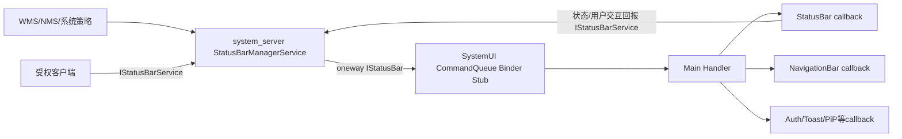
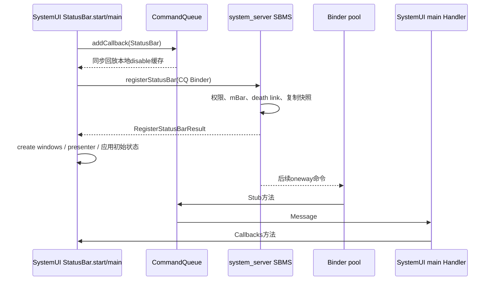
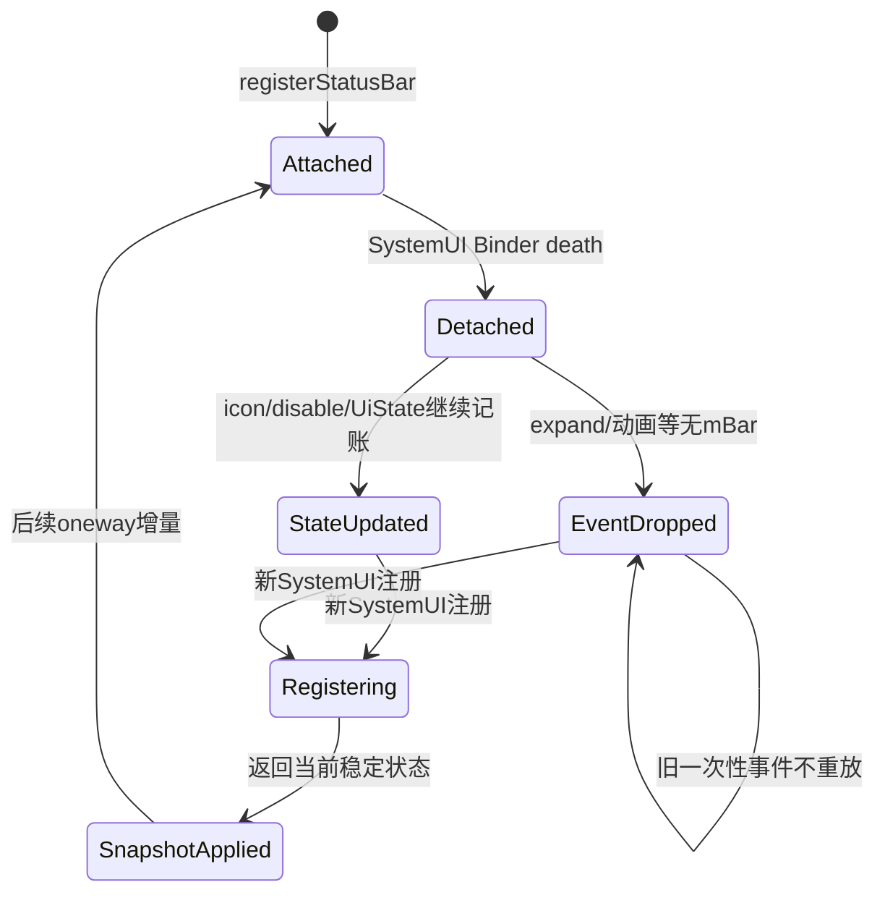

# 第 404 章 Android CommandQueue 与 StatusBarManagerService：跨进程命令、Display 路由和回调链

> 源码基线：Android 11 / API 30 / `android-11.0.0_r48`。本章只在 macOS 阅读源码，不编译。目标是看懂 system_server 怎样把控制命令送入 SystemUI 主线程，以及 SystemUI 重启后哪些状态能靠注册快照恢复、哪些瞬时事件会永久丢失。

## 1. 两个进程

`StatusBarManagerService` 运行在 system_server，`CommandQueue` 运行在 `com.android.systemui`。二者用 Binder 连接，不能把方法名相同误解成普通 Java 直接调用。

## 2. 两个 AIDL 方向

`IStatusBar` 是 system_server → SystemUI 的命令接口；`IStatusBarService` 是 SystemUI/受权调用方 → system_server 的服务接口。

## 3. CommandQueue 的三重身份

它继承 `IStatusBar.Stub`，是 Binder 服务端对象；实现 `CallbackController<Callbacks>`，是进程内观察者中心；实现 DisplayListener，维护 display 删除事件和每屏 disable 状态。

## 4. 名字为什么叫 Queue

Binder pool 线程进来的方法通常不直接碰 UI，而是编码成 Message 投到 main Looper；主 Handler 再遍历 Callbacks。它既是线程切换队列，也是部分命令的合并器。

## 5. StatusBarManagerService 的职责

它保存图标、disable token、每 display UiState、当前 user 和 SystemUI 回调 Binder；对调用方做权限检查，再把系统策略变化转发到 IStatusBar。

## 6. 三段成功点

system_server 更新本地状态、oneway Binder 事务成功入队、CommandQueue 主线程 callback 返回，是三个不同完成点；窗口动画或像素首帧还要更后。

## 7. IStatusBar 是 oneway

AIDL 顶部声明 `oneway interface IStatusBar`。system_server 调用通常不等待 SystemUI 执行方法体，也没有业务返回值。

## 8. oneway 不等于一定送达

目标 Binder 已死可抛 RemoteException；事务成功也只表示异步传输被接受。SystemUI 后续主线程可能拥塞、进程可能崩溃、业务 callback 也可能失败。

## 9. IStatusBarService 不是 oneway

例如 `registerStatusBar()` 同步返回 `RegisterStatusBarResult`。SystemUI 主线程会等待 system_server 权限检查、登记与快照组装完成。

## 10. 双向总图

## 11. system_server 的内部调用方

WMS、NMS、电源、输入法、Biometric 等可通过 LocalServices 的 `StatusBarManagerInternal` 或服务引用发命令，不需要都绕公开 SDK。

## 12. 外部入口仍有权限

StatusBarManagerService 按接口使用 `STATUS_BAR`、`EXPAND_STATUS_BAR`、`STATUS_BAR_SERVICE`、`MANAGE_BIOMETRIC_DIALOG` 等权限。CommandQueue 本身不是权限裁决点。

## 13. register 的专用权限

`registerStatusBar(IStatusBar bar)` 先执行 `enforceStatusBarService()`。普通 App 不能把自己的 Binder 注册成系统状态栏。

## 14. 注册由谁发起

`StatusBar.start()` 取得 `IStatusBarService`，先让自身成为 CommandQueue callback，再调用 `mBarService.registerStatusBar(mCommandQueue)`。

## 15. 为什么传 CommandQueue

它就是 `IStatusBar.Stub` 的 Binder 实现。跨进程后 system_server 保存的是 `IStatusBar` 代理/接口，后续所有命令落到同一 CommandQueue 对象。

## 16. register 第一项状态变化

服务把 `mBar = bar`，为它链接 DeathRecipient，并通知 GlobalActionsProvider 状态栏可用性变化。

## 17. linkToDeath 的意义

SystemUI 进程死亡时 system_server 得到 binderDied，置 mBar=null，再通知全局操作监听者 UI 不可用。它不是让 SystemUI 自动重启的机制；重启由进程/Service 管理链负责。

## 18. link 失败的边界

r48 捕获 RemoteException 只记录错误，register 仍继续组装快照。此时 mBar 字段已赋值，但死亡监控未成功，不能把 register 返回等同于 death link 完整。

## 19. 旧 Binder 替换边界

register 直接覆盖 mBar，并调用同一个 DeathRecipient link，没有在这段代码里先显式 unlink 旧 mBar。正常重启通常旧对象已死；极端并发重注册仍需把 death 回调归属作为源码风险点，而非假定有 generation 防护。

## 20. 快照为何必要

SystemUI 可能在 system_server 已运行很久后启动/重启。过去的 oneway 命令不会自动重放，所以服务返回当前图标、disable、外观、IME、transient 等状态。

## 21. 图标快照

服务在 `mIcons` 锁下复制出新的 ArrayMap。它传递图标账的一个快照，不把内部可变 Map 直接交给远端。

## 22. UiState 快照

在 `mLock` 下读取默认 display 的 appearance、regions、IME、fullscreen、immersive、transient types，以及按当前 user 汇总的 disable1/2。

## 23. 快照只针对默认 display

源码 TODO 明确说当前 register result 的 status bar 状态只工作在 default display。虽然服务内部已有 SparseArray<UiState>，重连快照并未返回每个 display 的完整 Map。

## 24. RegisterStatusBarResult 包含什么

图标、两组 disable flags、appearance/regions、IME token/visibility/back disposition/switcher、导航栏颜色归 IME、fullscreen/immersive 和 transient bar types。

## 25. 快照不包含什么

展开通知栏、切换 recents、显示一次性 toast、相机手势等事件没有“当前值”，不会放进结果；断连期间发生就可能丢失。

## 26. state 与 event 的恢复差异

有稳定当前值的能力适合保存在 SBMS 并随 register 返回；只表达“做一次”的命令若 mBar=null 通常被忽略，没有通用离线队列。

## 27. register 返回的完成点

它证明 system_server 接受回调并给出快照；不证明 SystemUI 已创建窗口、应用快照、执行 post-init 或绘制状态栏。

## 28. 注册时序

## 29. 为什么先 addCallback

StatusBar 在注册 Binder 前先进入本地 callback 列表，确保随后到达的 CommandQueue 消息能找到它。

## 30. 先收到的 disable 是本地默认值

CommandQueue 构造器只预置 default display 的 0/0；addCallback 会立即同步回放当前 map，所以 StatusBar 最初先收到一次“不禁用”。真正注册结果的 flags 稍后在 StatusBar post-init 路径应用。

## 31. 初始状态并非全走 CommandQueue

StatusBar 直接消费 RegisterStatusBarResult：创建窗口、处理 transient/appearance/IME，并把 icons 再调用 CommandQueue.setIcon 排入主 Handler。不同字段的恢复入口并不统一。

## 32. 初始 disable 延后到 post-init

StatusBar 捕获 result 的 disabledFlags1/2，向 InitController 登记 `setUpDisableFlags`，等顶层模块数组完成后执行。第402章的 post-init 因而直接参与注册恢复链。

## 33. 同步 register 会暂时占主线程

StatusBar.start 在主线程调用远端同步 Binder。system_server 若锁竞争或卡住，SystemUI 启动也会被拖住；这不是 CommandQueue Handler 能消除的等待。

## 34. 注册期间来的 oneway 命令

目标 Binder pool 可收到并向主 Handler 排消息；但主线程正在执行 start/同步 register/初始化，通常要等当前主调用栈退出后才处理这些消息。

## 35. 快照与增量如何收敛

状态变更在服务锁内更新并发 oneway，快照也在相应锁下读取。注册窗口可能出现快照重复加增量，但幂等状态命令应最终以较新消息收敛。

## 36. RemoteException 常被吞掉

SBMS 很多 `mBar.foo()` 包在空 catch 中。失败不会让调用方得到 UI 已失败的业务错误，也没有统一重试；是否可恢复依赖服务是否保留状态和下次注册快照。

## 37. mBar 为 null 的行为

大多数转发先判断非 null，否则什么也不做。持久状态可能已经写进 mIcons/UiState/disable records；纯事件则直接消失。

## 38. death 后还保留的账

SystemUI Binder 清空不等于清空图标、disable token、当前 user 或每屏 UiState。新 SystemUI 注册时可读取这些 system_server 所有的状态。

## 39. CommandQueue 从哪里创建

`StatusBarDependenciesModule` 以 `@Provides @Singleton` new `CommandQueue(context, protoTracer)`。它在根组件内复用，并被 StatusBar、导航栏、认证、Toast、PiP 等共享。

## 40. 构造器做什么

保存 ProtoTracer，向 DisplayManager 注册 DisplayListener，Handler 指定 main Looper，并预置 default display 的 disable pair=(0,0)。

## 41. CommandQueue 没有 start 方法

它不是资源数组中的 SystemUI 顶层项；第一次由 Dagger 请求构造时就完成 DisplayListener 登记，之后由其他模块 addCallback。

## 42. mLock 保护什么

Binder pool 可并发调用 Stub 方法，mLock 串行化部分状态更新、removeMessages 与新 Message 入队，使同一 CommandQueue 的命令编码顺序更可控。

## 43. mLock 不保护 callback 列表

`mCallbacks` 的 add/remove 没有同步，设计依赖标准调用发生在 main thread。错误线程注册观察者会与 Handler 遍历产生数据竞争。

## 44. Callback 接口为何很大

它用 default 空方法把状态栏、导航、Recents、认证、Toast、PiP、全局操作等命令汇成一个观察者协议；实现者只覆盖关心的项。

## 45. 大接口的代价

订阅者看起来都注册同一 CommandQueue，但实际关心集合不同。排错必须搜索具体 callback 方法实现，不能看到 addCallback 就认定对象消费所有命令。

## 46. addCallback 的即时回放

加入列表后遍历 `mDisplayDisabled`，同步调用新 callback 的 disable(..., animate=false)。它不经过 main Handler，运行在线程就是 addCallback 的调用线程。

## 47. 为什么标准调用必须在 main

即时回放可能直接改 UI；如果后台线程 addCallback，就会在后台收到 disable。源码没有线程断言，调用约定比类型系统更重要。

## 48. removeCallback 的边界

它只从列表删除，不撤销已经由 callback 自己注册的其他监听，也不取消 CommandQueue 消息。消息处理时读取实时列表，已删除者通常不再被调用。

## 49. 新 callback 可能看到旧在途事件

Message 入队时不保存 callback 快照；若事件排队后、处理前有新 callback 加入，它也会参与这次遍历。订阅完成点不是事件 generation 边界。

## 50. callback 异常没有隔离

Handler 循环直接调用实现，没有逐 callback try/catch。一个实现抛异常可阻止后续观察者收到该消息，并可能崩溃 SystemUI 主线程。

## 51. Message 编码

命令类型占 what 的高 16 位，`MSG_MASK` 取类型；低 16 位为历史/索引空间。参数放 arg1/arg2、obj 或池化 SomeArgs。

## 52. Binder 参数已跨进程复制

Parcelable/数组/Bundle 从 system_server 到 SystemUI 经 Parcel；进入 CommandQueue 后同一对象引用又可能分享给多个 callbacks，callbacks 不应互相修改输入。

## 53. coalescing 是什么

许多入口先 `mHandler.removeMessages(MSG_X)`，再放最新消息。主线程来不及处理的同类旧命令被删除，只保留最后一次。

## 54. 为什么能合并状态

disable、IME、外观等表达“当前状态”，中间值常可舍弃；最终 UI 只需收敛到最新值。类注释称被合并命令应是幂等的。

## 55. 不是所有命令都合并

icon set/remove 明确写“don't coalesce”；window state、app transition 等也按事件逐项排队。是否合并必须逐方法看 removeMessages，不能凭命令类别猜。

## 56. 展开/收起类命令

expand notifications、collapse panels、expand settings、toggle panel 等会移除同类型旧消息，抑制短时间重复请求。它更像 burst 去重，尤其 toggle 不宜仅用数学幂等理解。

## 57. coalescing 的范围是全局类型

`removeMessages(MSG_DISABLE)` 不带 display token，所以会删除所有尚未处理的 disable 消息，不只同 display。最新一条 callback 事件胜出，但 mDisplayDisabled map 已保存每屏最新 pair。

## 58. 多 display 的潜在通知缺口

display0 与 display1 快速各来一次 disable，第二次可能删除第一条主线程通知；map 仍有两屏状态，新 callback 会回放两屏，但既有 callback 未必立即再收到第一屏最新值。

## 59. IME 合并也跨 display

`setImeWindowStatus` 移除全部 MSG_SHOW_IME_BUTTON，仅保留最新；单会话 IME 切屏时，handler 还会给上一 display 主动发送 invisible 状态。

## 60. disable 先写缓存

入口在锁内先 `setDisabled(displayId,state1,state2)`，再移除旧消息、创建新消息。即使 UI callback 尚未执行，查询 map 已看到最新状态。

## 61. main线程的快速路径

若 `disable` 本来就在 CommandQueue main Looper，它直接调用 `mHandler.handleMessage(msg)`，不再排队，以便隐藏动作快速生效。

## 62. 快速路径仍在 mLock 内

callback 遍历发生在 synchronized 区域。Java 锁对同线程可重入，但 callback 做长工作会延长锁持有，并阻塞 Binder pool 线程提交其他受锁命令。

## 63. 其他命令通常没有快速路径

例如 icon 即便主线程调用也会 post。初始 icon 快照因此在 StatusBar.start 中转为消息，等当前启动栈之后才实际分发。

## 64. toggleRecentApps 的异步 Message

它额外调用 `msg.setAsynchronous(true)`，允许在 Looper 存在同步屏障时越过屏障；这不等于另开线程，仍由 main Looper 处理。

## 65. startTracing 的特殊点

CommandQueue 在 Stub 方法线程、mLock 内直接调用 ProtoTracer.start/stop，然后才发 main callback 的 tracing state。并非每项工作都严格只在 Handler 中发生。

## 66. Handler 的统一分发

`H.handleMessage` 取高位 type，遍历 mCallbacks 调对应 default method。大多数循环按 0→size-1，display removed 则反向遍历。

## 67. 遍历没有快照

callback 若在回调中 add/remove 列表，可能改变当前循环索引和后续接收者。实现者应避免在同步回调中任意修改订阅集合，或延后操作。

## 68. SomeArgs 的目的

当 Message 的两个整数和一个 obj 不够时，用池化容器打包 display、布尔、token、数组等。消费后多数 case 显式 recycle，遗漏会降低对象池复用而非改变业务参数。

## 69. disable 状态查询

`getDisabled(displayId)` 若 map 无项会创建 0/0 pair 并放入。查询本身有写副作用；标准调用需在 mLock 或主线程语境核对。

## 70. panelsEnabled 只看默认屏

它检查 default display 的 DISABLE_EXPAND、DISABLE2_NOTIFICATION_SHADE 与 ONLY_CORE_APPS，源码 TODO 明确多屏支持未完整。

## 71. DisplayListener 的线程

构造器以 mHandler 注册 DisplayListener，所以 `onDisplayRemoved` 已在主线程，可直接遍历 callbacks，不再 post 一次。

## 72. display 删除的本地清理

先在 mLock 下从 mDisplayDisabled 删除，再反向通知每个 callback `onDisplayRemoved(displayId)`。onDisplayAdded/Changed 在 CommandQueue r48 中为空。

## 73. system_server 也维护 display UiState

SBMS 用 SparseArray 保存 appearance、transient、fullscreen、immersive、disable 与 IME 状态，DisplayListener 删除对应 state；两边各自有账，不是一张跨进程共享 Map。

## 74. displayId 是路由键不是自动对象

CommandQueue 只把整数交给 callbacks；StatusBar/NavigationBarController 等必须自己找到该屏窗口/导航实例。传了 displayId 不代表所有消费者已支持多屏。

## 75. default-only 与 multi-display 混合现实

r48 部分 IStatusBar 命令带 displayId，内部 UiState 也分屏；但 register 快照、panelsEnabled、disable 公共入口仍有 default-display TODO。应按具体方法判断支持程度。

## 76. IME 的上一屏补偿

非 multi-client IME 从 displayA 切到 B 时，CommandQueue 先给 A callbacks 发送 token=null、IME_INVISIBLE、默认 back disposition，再发 B 的新状态。

## 77. INVALID_DISPLAY 被丢弃

`handleShowImeButton` 遇 INVALID_DISPLAY 直接 return，不更新 last display，也不通知 callbacks。这是明确输入门槛。

## 78. mLastUpdatedImeDisplayId

它只在主 Handler 的处理方法末尾更新，避免 Binder pool 并发直接改。进程重启后初值 INVALID，靠注册快照恢复默认屏 IME 状态。

## 79. disable 的 system_server 聚合

客户端以 token/user 提交 disable1/2，SBMS 保存 DisableRecord，并按当前 user OR 汇总 net flags；token Binder 死亡可移除记录并重新计算。

## 80. 为什么 token 很重要

它让“谁施加了禁用”具备生命周期。调用进程死亡后 DeathRecipient 能撤销对应限制，避免状态栏永久被一个已消失客户端锁住。

## 81. disableLocked 的顺序锁

源码注释强调更新 callback/本地账与调用 mBar 要保持同序，因此在 mLock 内 manage record、计算 net、更新 UiState、post notification delegate 并发 oneway disable。

## 82. 传非当前 user 的细节

记录写目标 user，但当前真正应用的 net1/net2仍按 `mCurrentUserId` 汇总。用户切换时另有路径重算；不能把 disableForUser 返回理解为该后台 user 的 UI 立即出现变化。

## 83. 图标的 system_server 账

setIcon 在 mIcons 锁下创建 StatusBarIcon、写 Map，再调用 mBar.setIcon；visibility 修改同一对象后也发 setIcon，remove 则先删账再通知。

## 84. 图标命令为什么不合并

slot 的 set/remove 顺序决定最终存在性，且不同 slot 共享同一 MSG_ICON type；粗暴 removeMessages 会误删其他 slot 的变化，所以 r48 保留每项。

## 85. 状态栏进程死亡时图标不丢

图标主账在 system_server；新 StatusBar 注册后得到 Map copy，并逐项调用 CommandQueue.setIcon 重建进程内图标控制器。

## 86. 一次性动画不会恢复

如 charging animation、camera gesture、expand panel 在 mBar=null 时没有持久账。进程恢复后重播旧动画通常也没有意义。

## 87. transient bars 介于状态与事件

SBMS UiState 保存当前 transient type 集合，所以注册结果能恢复“当前处于 transient”的默认屏状态；后续 show/abort 命令仍按增量变化发送。

## 88. appearance regions 的语义

它们描述一块状态栏跨不同窗口区域时的外观，连同 displayId 送到 callbacks；真正浅色/深色图标切换由 LightBar 等消费者完成。

## 89. 安全方向不能倒置

SystemUI 接受 IStatusBar 命令靠的是注册给 system_server 的私有 Binder 引用，不是导出一个任意 App 可查询的公共服务；App 请求状态栏功能要经过 SBMS 权限入口。

## 90. SystemUI 回报也要鉴权

点击通知、面板显示、全局操作显示/隐藏等由 SystemUI 调 IStatusBarService，服务端强制 STATUS_BAR_SERVICE，并在需要时 clearCallingIdentity 后进入 NMS/关机等内部逻辑。

## 91. clearCallingIdentity 的位置

它发生在服务端权限确认后，用 system_server 身份调用内部 delegate；不是让未经授权的调用者越过前面的 permission check。

## 92. Binder death 与业务状态

death 只把 mBar 置 null、通知可用性；不会清 mIcons/UiState/disable records。SystemUI 本地 mCallbacks 等则随进程死亡全部消失。

## 93. 重启恢复完整链

SystemUI 新进程重建 CommandQueue/Callbacks → StatusBar 重新 register → SBMS 返回当前快照 → StatusBar 建窗口并应用 → 后续 oneway 增量继续。

## 94. 死亡窗口的事件丢失

mBar=null 到新 register 之间，纯事件没有目标；服务没有统一 EventQueue。诊断“重启后某次弹窗没出现”要先判断它是不是可快照状态。

## 95. RemoteException 后 mBar 不一定立刻清

多数 catch 为空，不在每次发送失败处设 null；通常依赖 Binder death 回调最终清理。因此短窗口内更多命令仍可能尝试同一死代理并被吞掉。

## 96. DeathRecipient 的并发疑点

r48 binderDied 直接使用当前 mBar 调 unlink 再置 null，没有 token/generation 参数核对。若旧 death 与新 register 极端交错，源码缺少显式“只清对应旧 Binder”的保护；这是代码审计风险，不代表常态必现。

## 97. CommandQueue 没有 ACK

Callbacks 返回只在 SystemUI 进程内结束；IStatusBar oneway 调用方不会收到“某个 callback 已执行”的反馈。需要完成协议的功能必须另设回调/状态查询。

## 98. coalescing 也没有丢弃日志

removeMessages 直接删旧 Message，没有为每项记录“被新状态覆盖”。只看 callback 日志可能看不到中间命令曾经到达 Binder Stub。

## 99. 诊断工具第一组：服务账

查看 statusbar service dump 中 icons、disable records、UiState、current user 和 bar attach，判断 system_server 是否持有目标状态与回调。

## 100. 第二组：SystemUI队列与消费者

查 CommandQueue 方法入口/主线程 trace、具体 callback dump 和窗口状态。CommandQueue r48 没有为所有 pending Message 提供完整 dump，需结合日志/trace。

## 101. 第三组：Binder与进程

确认 SystemUI PID 是否变化、registerStatusBar 时间、death 日志和 RemoteException。进程重启会让所有旧本地 callback/队列证据消失。

## 102. “服务账正确但UI旧”怎么拆

检查 mBar 是否 attach、oneway 是否发出、CommandQueue 是否被 coalesce、main 是否堵塞、callback 是否仍注册、displayId 是否有对应窗口。

## 103. “UI重启后图标回来但动画没来”

这是 state/event 恢复差异的预期表现：icons 有 system_server Map 和注册快照，一次性动画没有持久事件队列。

## 104. “外屏状态不对”

先确认命令是否带正确 displayId，再查 SBMS 是否为该屏建 UiState、CommandQueue 是否全局 coalesce、消费者是否真正多屏；不要只看到 AIDL 有 displayId 就判链路完整。

## 105. “两个callback只有一个执行”

检查前一个是否抛异常、是否在回调内改 mCallbacks、后一个是否在消息处理前被 remove。分发器没有逐观察者隔离。

## 106. 一条命令的固定阅读法

从 SBMS 调用源与权限开始，确认是否先持久化；再看 IStatusBar 是否 oneway、CommandQueue 是否 removeMessages、Message 参数、Handler case 和所有 callback 实现。

## 107. 一个快照字段的固定阅读法

找 system_server 所有权、锁与更新入口，核对 RegisterStatusBarResult 是否携带、SystemUI start 在哪个阶段消费，以及后续增量是否可能重复覆盖。

## 108. 一个 display 问题的固定阅读法

同时追 SBMS mDisplayUiState、AIDL displayId、CommandQueue mDisplayDisabled、DisplayListener 和具体 UI Controller 的 per-display Map，缺一层都可能回退 default。

## 109. 一个时序问题的固定阅读法

标注 system_server 锁、oneway enqueue、Binder pool Stub、main Message、coalescing 删除和 callback；“调用顺序”必须明确属于哪条队列。

## 110. 本章最小模型

SBMS 是带权限和可恢复状态账的控制中心；IStatusBar 是无 ACK 的异步下行；CommandQueue 是 Binder线程→主线程的合并/扇出桥；Callbacks 才把命令落到各 UI 子系统。

## 111. 本章练习说明

下面恰好四项，只读 r48 本地源码，不编译。每项都要区分稳定状态、瞬时事件、Binder完成点和主线程完成点。

## 112. macOS只读练习一：追一次disable

从 `StatusBarManagerService.disableForUser` 追 DisableRecord、current-user OR、UiState、oneway mBar.disable、CommandQueue removeMessages/快速路径和 StatusBar callback，画出锁与线程。

## 113. macOS只读练习二：模拟SystemUI重启

列出 register result 的全部字段，再任选 icon、IME、expand panel 三项，判断断连期间发生后哪些能恢复、哪些会丢，并指出恢复消费代码位置。

## 114. macOS只读练习三：构造双屏coalesce

让 display0 和 display1 的 disable 在主线程处理前连续到达，推演 mDisplayDisabled、pending MSG_DISABLE 和既有 callback 最终观察；再说明新 callback add 时为何能看到两屏 Map。

## 115. macOS只读练习四：找三个CommandQueue消费者

选择 NavigationBarController、AuthController、ToastUI，分别搜索 add/removeCallback 与覆盖方法，记录命令是否带 displayId、业务是否另有异步边界、销毁时是否对称注销。

## 116. 易错点一：IStatusBar调用返回等于UI完成

错误。它是 oneway，最多表示异步 Binder 提交；CommandQueue 还要过 Binder pool、main Message 和 callback，像素更晚。

## 117. 易错点二：CommandQueue所有命令都合并

错误。只有显式 removeMessages 的类型合并，icons、window state、transition 等保留多条；合并范围还可能跨 display。

## 118. 易错点三：register快照覆盖所有屏和事件

错误。r48 主要返回 default-display 当前状态；纯事件不在快照，多屏链也处于部分支持状态。

## 119. 复读源码后的修正

本章复读后把“主线程桥”限定为 callbacks：start/stop tracing 仍在 Stub 调用线程操作 ProtoTracer；补上 addCallback 的 disable 回放是同步调用方线程、disable main快速路径在锁内、全局 removeMessages 可跨display覆盖，以及 DeathRecipient 没有 Binder generation 核对。由此避免把 CommandQueue 写成绝对串行、完整多屏、可靠 ACK 队列。

## 120. 本章结论

Android 11 r48 用 StatusBarManagerService 保存安全边界与可恢复状态，用 oneway IStatusBar 把增量命令交给 CommandQueue，再由 main Handler 按需合并并扇给多个 UI callback。理解 state/event、snapshot/increment、Binder/main、default/per-display 四组差异，就能解释多数“服务说发了、UI却没变”的问题。下一章进入 DumpManager、DumpHandler、LogBuffer 和 bugreport 优先级，建立 SystemUI 自身的诊断证据体系。
