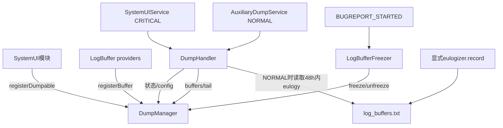
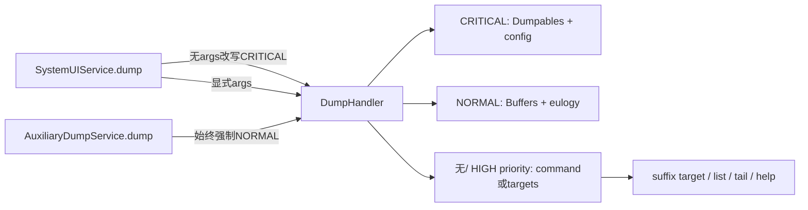
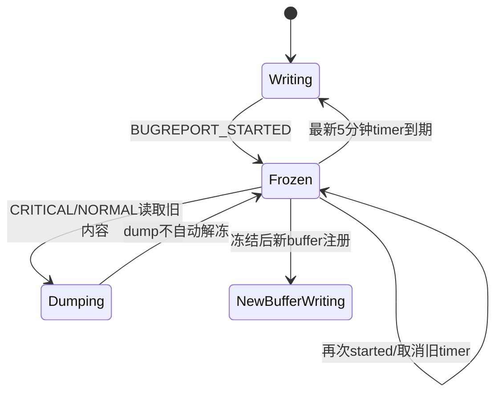

# 第 405 章 Android SystemUI DumpManager、DumpHandler、LogBuffer 冻结与 Bugreport 诊断链

> 源码基线：Android 11 / API 30 / `android-11.0.0_r48`。本章只在 macOS 阅读源码，不编译，也不实际执行 adb。目标是分清状态 dump、环形日志、bugreport 优先级、冻结窗口和崩溃前 eulogy 五种证据。

## 1. 为什么 SystemUI 自建诊断层

SystemUI 组件很多、日志频繁，全部长期写 logcat 成本高；只 dump 当前字段又缺少历史。r48 用 Dumpable 状态快照与 LogBuffer 近期事件互补。

## 2. 四个核心类

`DumpManager` 管注册表，`DumpHandler` 解析命令并选择输出，`LogBuffer` 保存结构化环形消息，`LogBufferFreezer` 在 bugreport 开始时暂停覆盖。

## 3. 第五个补充类

`LogBufferEulogizer` 在少数致命一致性异常抛出前，把所有 buffer 写到文件，供下一次 bugreport 读取最近一次崩溃前日志。

## 4. 两类注册对象

Dumpable 通常输出“现在是什么状态”；LogBuffer 输出“最近发生过什么”。DumpManager 为二者保存两张独立 Map，但名称命名空间共享。

## 5. 证据不能互相替代

当前状态正确不证明历史从未错；日志出现请求不证明最终状态已落地。诊断应把时间线与快照按同一对象 key/display/user 对齐。

## 6. 总体证据图

## 7. DumpManager 是 Singleton

根组件内共享同一注册表。进程重启后表重新建立，之前只存在内存里的 Dumpable/Buffer 注册全部消失。

## 8. dumpables Map

key 是注册名，value 保存 name 与 Dumpable 引用。常见 name 是完整类名，但 API 允许任意不冲突字符串。

## 9. buffers Map

LogBuffer 用自己的短名注册，例如 `NotifLog`、`QSLog`、`BroadcastDispatcherLog`。名称用于命令行 target 和输出标题。

## 10. 名称跨两张表唯一

`canAssignToNameLocked` 先查 dumpables，再查 buffers；同名若已属于不同对象就抛 IllegalArgumentException。

## 11. 同对象重复注册

若相同 name 对应的正是同一个对象，检查允许，并用新 RegisteredDumpable wrapper 覆盖；它是幂等容忍，不允许同名不同实例。

## 12. 为什么重复实例会暴露问题

通常意味着 scope 错误、模块重复 start 或测试 mock 与真实对象同时注册。直接抛错比静默覆盖更利于发现生命周期缺陷。

## 13. unregister 只覆盖 Dumpable

r48 有 `unregisterDumpable(name)`，没有对称公开的 unregisterBuffer。Buffer 被设计成进程级长期对象。

## 14. Dependency 自动注册

第402章看到旧 `Dependency.get` 第一次创建 Dumpable 时会按运行时类名注册；顶层 SystemUI 模块则在启动循环中注册。

## 15. 构造时自注册

BootCompleteCacheImpl 等对象在 init 中注册；LogModule 的 provider 创建 LogBuffer 后调用 `attach(dumpManager)`。注册时机随对象第一次构造而变化。

## 16. 未实例化就可能未出现在 dump

Lazy binding 从未请求，provider 就未执行，Buffer/对象也不会登记。dump 的缺项既可能是故障，也可能只是该形态从未创建它。

## 17. 所有公开操作同步

DumpManager 注册、列表、dump、freeze 都标 `@Synchronized`，以 manager 实例锁保护两张 Map。

## 18. dump 时也持 Manager 锁

`dumpDumpables` 遍历并直接调用每个模块 dump，整个过程没有释放 Manager 锁。慢模块会阻塞新的注册、注销、freeze 和其他 dump。

## 19. 锁不保证模块内部一致

Manager 锁只保护注册表，不保护业务模块字段。每个 Dumpable 仍要自己同步或声明输出是 best-effort 快照。

## 20. dumpTarget 的 suffix 匹配

目标用 `registeredName.endsWith(target)` 查找，因此完整名、包尾段或短类名都可能命中。

## 21. suffix 可能歧义

存在多个相同结尾时返回遍历遇到的第一个，不报告多匹配；而且先搜 dumpables 再搜 buffers。诊断脚本最好用足够唯一的名字。

## 22. 目标不存在

`dumpTarget` 走完两张表后静默返回，没有“not found”。空输出不应直接解释成组件 dump 为空。

## 23. dumpables 全量输出

每项先打印 name、分隔线，再调用 `Dumpable.dump(fd,pw,args)`；原始 args 会传给每个模块。

## 24. buffers 全量输出

每项打印 `BUFFER name` 和分隔线，再调用 `LogBuffer.dump(pw,tailLength)`。Buffer 不接 FileDescriptor 和原始 args。

## 25. 输出顺序

它取决于 ArrayMap 当前迭代顺序与注册/删除历史，不应把先后当成组件依赖或事件因果。

## 26. DumpHandler 是路由器

SystemUIService/Auxiliary Service 的 dump 统一进入它；它负责解析 priority、tail、list、help 和 target，再调用 DumpManager。

## 27. 开始计时

dump 先 `Trace.beginSection`，记录 uptime，结束时输出 “Dump took Nms” 并 `Trace.endSection`。

## 28. 参数错误的 trace 缺口

parse 抛 ArgParseException 时 catch 打印错误并直接 return，没有 finally 执行 `Trace.endSection`，也不输出耗时。这是 r48 的控制流事实。

## 29. 三个 priority 字符串

解析器接受 CRITICAL、HIGH、NORMAL；非法值或缺参数会得到可读错误。

## 30. CRITICAL 输出

调用 `dumpCritical`：全量 Dumpable 状态，再输出 SystemUI vendor/global/per-user 组件配置。目标是短而关键的 bugreport 前段。

## 31. NORMAL 输出

调用 `dumpNormal`：全量 LogBuffer，再尝试读取最近崩溃 eulogy。它可能很长，因此放在 Auxiliary Service 的 normal 段。

## 32. HIGH 的 r48 特殊行为

HIGH 被接受，但 when 没有 `dumpHigh`，会进入 parameterized 路径。若又没有 command/target，结果只是 “Nothing to dump :(”，不能说 HIGH 等价 CRITICAL。

## 33. 无 priority 的参数化路径

可执行 bugreport-critical、bugreport-normal、dumpables、buffers、help 或按 target 输出。

## 34. config 分支的解析落差

`dumpParameterized` 有 `"config"` 分支，但 COMMANDS 数组不含 config；直接传 config 会被当 target，而不是 command。r48 的 plain config 路径实际上不可按直觉到达。

## 35. help 的到达方式

`-h/--help` 在 flag 解析时直接把 command 设为 help；COMMANDS 数组不含 help 仍不影响这一入口。

## 36. flags 会从 target 列表移除

解析使用 mutable list，识别 flag 后删掉 flag 与参数；剩余 nonFlagArgs 才用于命令/targets。

## 37. rawArgs 仍保留原数组

调用 Dumpable 时传 `args.rawArgs`，其中仍含 DumpHandler 自己的 flags。业务 dump 若也解析参数，需容忍这些内容。

## 38. --tail 的语义

只影响 LogBuffer，指定最近 N 条。N≤0 表示全量；N 大于当前 size 也自然输出全部。

## 39. 负 tail 不被拒绝

解析只做 `toInt()`，负数合法进入 Buffer，随后按 ≤0 处理成全量。它不会表示“倒数负条”。

## 40. --list 的语义

配合 dumpables/buffers 只列名字；没有 target/command 时会分别列两类。配合具体 target 并不会让 dumpTarget 自动改成只列。

## 41. 多 target

按用户给出的顺序逐个 suffix 查找，可以混合 Dumpable 与 Buffer；重复 target 会重复输出。

## 42. 服务优先级分流图

## 43. SystemUIService 无参处理

其 dump 收到 args.length=0 时主动改为 `--dump-priority CRITICAL`，用于 bugreport 关键段推断。

## 44. 显式参数不会被强改

用户传 target、buffers 或 flags 时，主 Service 原样交给 DumpHandler；因此可用同一 Service 做交互式只读诊断。

## 45. Auxiliary Service 强制 NORMAL

它完全忽略调用者 args，构造固定 NORMAL 数组。职责就是在 bugreport normal 段输出长 buffers。

## 46. 为什么有两个 Android Service

bugreport 对 CRITICAL 段有严格体量/时间期望；拆分可让关键状态先出现，而高容量历史日志稍后输出。

## 47. Auxiliary 何时启动

第401章看到 SystemUIService.onCreate 最后 startServiceAsUser(system)。它是 started service，onBind 返回 null。

## 48. Dumpables 应保持克制

DumpManager 注释明确它们进入 CRITICAL，不应输出过量数据。详细逐事件历史应放 LogBuffer。

## 49. LogBuffer 的设计目标

高频日志尽量不在写入时拼字符串，复用 LogMessageImpl；只有需要 dump 或 echo logcat 时才调用 printer 生成文本。

## 50. 一条日志两阶段

`obtain` 取得/重置 message，initializer 只把数值/字符串字段填入；`push` 放入 deque，未来 printer 从 message 字段构造最终行。

## 51. printer 不能捕获外部变量

源码特别要求只读取 LogMessage 字段，否则每次调用可能分配新的闭包对象，破坏低分配目标。

## 52. 时间戳

obtain 使用 `System.currentTimeMillis()` 写墙上时钟，dump 用固定 US Locale 格式。系统改时可能让日志时间非单调。

## 53. 环形缓冲

ArrayDeque 保存最近消息；空间不足时复用/移除最旧对象。`maxLogs` 还包括为 document/push 两阶段预留的弹性池语义，不要把常态 deque size 简化成永远正好 maxLogs。

## 54. poolSize 的用途

连续 document 尚未 push 时可能同时借出多个 message；poolSize 允许一定弹性，避免立即分配，同时防止在途对象复用冲突。

## 55. paired log 的常态复用

buffer 大于 `maxLogs-poolSize` 时 obtain 先 removeFirst 复用，再 push 回尾部，最老历史被覆盖。

## 56. push 的上限保护

若 deque 已等于 maxLogs，记录错误并移除最旧项再加入；它是异常/非典型调用序列的保护。

## 57. obtain 与 push 各自同步

二者都是 `@Synchronized`，但两次调用之间没有共同锁持有；多线程可交错，只要每个借出的 message 不被错误共享。

## 58. dump 也同步

遍历期间阻塞该 Buffer 的 obtain/push，确保 deque 不被并发修改；大量 dump 会短暂增加日志写入等待。

## 59. tail 起点

tailLength>0 时 start=buffer.size-tailLength；若为负，所有索引都≥负数，所以仍输出全部。

## 60. 一行格式

日期、LogLevel、tag、printer 结果依次输出。Buffer 名在 DumpManager 外层标题中，不重复写到每行。

## 61. logcat echo

push 后查询 LogcatEchoTracker：buffer 或 tag 达到阈值就立即 printer 并写 Logcat；否则只保留结构化 message。

## 62. debug 与 production

LogModule 在 debuggable 构建用可从 Settings 调整的 Debug tracker，非 debug 用 Prod 实现。文档中的 settings 调试开关不能假定 production 同样开放。

## 63. LogModule 的容量不同

DozeLog 100、NotifLog/NotifSectionLog 1000、QSLog/BroadcastDispatcherLog 500 等，容量是按领域权衡，不是统一保留时长。

## 64. 容量不是时间窗口

Buffer 按条数覆盖；高频期可能几秒就冲掉旧证据，低频期可保留很久。诊断要结合事件速率。

## 65. freeze 的入口标记

`LogBuffer.freeze()` 在 frozen=false 时先写一条 “name frozen” DEBUG 到自身，然后把 frozen=true。

## 66. frozen 后 log

常规 `log` 直接跳过，`push` 也 return；既不进 Buffer，也不会从这条 Buffer echo 到 logcat。

## 67. frozen 时 document

obtain 返回新 dummy LogMessage，调用方仍能填字段；后来 push 被丢弃，避免复用 deque 中要保护的历史对象。

## 68. unfreeze 的细节

实现先调用 log("unfrozen") 再把 frozen=false；由于 log 看到仍 frozen，这条 buffer 内 marker 实际不会写入。Freezer 自己另用 Log.i 记录解冻。

## 69. freeze 不阻止 dump

冻结的是新增/覆盖，旧 deque 仍可遍历输出，正适合 bugreport 在稳定快照上读取。

## 70. 冻结为何需要全 Buffer

bugreport 收集可能耗时；若继续高频写，关键故障前消息可能在轮到 SystemUI normal dump 前已被覆盖。

## 71. LogBufferFreezer 的触发广播

attach 经 BroadcastDispatcher 为 USER_ALL 注册 `com.android.internal.intent.action.BUGREPORT_STARTED`，回调 Executor 是 Main DelayableExecutor。

## 72. attach 不是构造时自动完成

SystemUIService 在顶层模块启动后调用 `mLogBufferFreezer.attach`。这之前存在短暂未注册窗口。

## 73. 默认冻结时长

注入构造器使用 5 分钟。它不是监听 bugreport 完成事件，而是固定延时后自动 unfreeze。

## 74. pendingToken 是取消句柄

DelayableExecutor.executeDelayed 返回 Runnable；调用它用于取消先前计划。再次收到 started 时先取消旧解冻，再重新冻结并从新时点计 5 分钟。

## 75. 重复 freeze 是幂等的

已 frozen 的 Buffer 不再写第二条 frozen marker；但 Freezer 会重新安排统一解冻时间。

## 76. 新 Buffer 不继承冻结

DumpManager.freezeBuffers 只遍历当时 buffers Map，没有 manager 级 frozen 标志。冻结后才第一次构造/attach 的 LogBuffer 仍可写入。

## 77. 注册异步窗口

BroadcastDispatcher.registerReceiver 自身是两层 Handler 异步注册；attach 返回不证明 Context 已监听 started 广播。极早 bugreport 理论上可能错过冻结。

## 78. 冻结状态机

## 79. 时间固定窗口的限制

bugreport 超过 5 分钟时后半程可能已恢复覆盖；很快完成时仍会冻结到 timer。r48 不以真实完成信号精确收敛。

## 80. Freezer 没有 detach

匿名 Receiver 由进程级 Dispatcher 持有，设计成 SystemUIService 进程生命期常驻；重复 attach 会再注册新匿名对象，因此 onCreate 正常只应调用一次。

## 81. Eulogizer 的目标

当 SystemUI 即将因一致性异常抛出时，在进程死亡前把内存 Buffer 落到 `filesDir/log_buffers.txt`。

## 82. 它不是全局 UncaughtExceptionHandler

r48 只有显式调用 `mEulogizer.record(exception)` 的代码路径触发，搜索主要在 NotifCollection 断言/重入错误。普通任意崩溃不保证生成 eulogy。

## 83. record 返回同一个异常

泛型方法写完后返回 reason，调用点可写 `throw eulogizer.record(new IllegalStateException(...))`，保存证据后继续原本崩溃语义。

## 84. 写入是同步的

record 在调用线程 dump 所有 Buffer 到文件，可能延迟异常真正抛出；它用于紧急证据，不适合常规高频路径。

## 85. 最小写入间隔

文件距上次写入小于 5 分钟就拒绝重写，避免崩溃循环频繁 I/O；仍返回原异常。

## 86. 文件覆盖

使用 CREATE + TRUNCATE_EXISTING，每次成功记录只保留最近一次 eulogy，不累积多次文件历史。

## 87. 文件内容

墙上时间、触发异常堆栈、所有 active buffers 和记录耗时。它不自动附带所有 Dumpable 当前状态。

## 88. 写失败策略

捕获 Exception，写 Logcat 后继续返回原 reason；诊断保存失败不会吞掉原业务异常。

## 89. NORMAL 时读取

DumpHandler 在当前 buffers 后调用 `readEulogyIfPresent`；文件存在且年龄不超过 48 小时才追加“most recent crash”段。

## 90. 文件不存在是正常情况

IOException 被当作没有 eulogy 静默忽略；UncheckedIOException 会记录错误。

## 91. 年龄使用墙上时间

当前时间减 lastModified；改时可产生负值或异常年龄，影响 5 分钟限写与 48 小时读取判断。

## 92. eulogy 不是当前进程日志

它可能来自上一次已崩溃进程，而前面的 normal buffers 来自现在进程。输出标题明确分段，分析时不能把两条时间线直接当同一 PID。

## 93. DumpHandler 计时用 uptime

与日志/eulogy 年龄的 wall clock 不同；dump duration 不受改时直接影响，更适合耗时。

## 94. fd 的边界

Dumpable 可接收 FileDescriptor，LogBuffer 只写 PrintWriter。大多数文本诊断不需要直接写 fd，但接口保留能力。

## 95. dump 运行线程

Android Service.dump 通常由 Binder/dumpsys 调用线程进入，不自动切主线程。Dumpable 若读取 UI 主线程专属结构，要自己同步或复制。

## 96. dump 也可能扰动系统

Manager 持锁、Buffer 持锁、模块自身再持锁；大量或阻塞式 dump 会影响注册与日志写入。诊断代码也要控制复杂度。

## 97. 死锁审计

检查锁顺序：DumpManager→模块/Buffer；若业务模块在持自身锁时反向 register/dump Manager，可能形成环。`@Synchronized` 不是无成本安全。

## 98. 隐私边界

Buffer 会进入 bugreport/adb dump，initializer 不应写入不必要的敏感正文、token 或个人数据。低分配不等于可无限记录。

## 99. “日志没出现”第一棵故障树

检查 Buffer 是否已实例化/attach、是否 frozen、容量是否覆盖、level 是否只影响 logcat而非buffer、目标 suffix 是否匹配、是否选了 CRITICAL 而非 NORMAL。

## 100. “dump对象没出现”

检查注册时机、名称、是否因同名抛错、是否被 unregister、是否错误使用 buffer 命令，以及 target 不存在的静默行为。

## 101. “bugreport只有状态没历史”

确认 AuxiliaryDumpService 是否启动并进入 NORMAL 段；主 SystemUIService 默认无参只输出 CRITICAL。

## 102. “eulogy没有生成”

先确认崩溃点是否显式调用 record、距上次写是否小于5分钟、文件写是否异常；不能把所有 SystemUI crash 都当成 eulogizer 管辖。

## 103. “eulogy太旧/时间奇怪”

核对设备墙钟变化、lastModified、48小时门槛与 PID；不要用 uptime 日志与 wall timestamp 直接相减。

## 104. “冻结后仍有新日志”

判断该 Buffer 是否在 freeze 之后才 attach，或日志其实来自 Logcat/另一 Buffer；manager 没有把冻结状态继承给新注册项。

## 105. 最小证据包

关键 Dumpables、相关 Buffer tail、SystemUI PID/重启时间、system_server 对端状态和一条用户操作时间线，通常比无筛选全量输出更易读。

## 106. target 选择建议

先 `--list` 确认精确名称，再用足够长 suffix；高频 Buffer 先 tail 100，缺上下文再扩大，避免证据噪声。

## 107. 状态与日志对表

为同一 key 写“最后日志事件、dump当前值、预期状态、跨进程对端值”；若不一致，再查丢回调、coalescing、进程重启或旧 generation。

## 108. priority 选择建议

CRITICAL 看核心状态与启动配置，NORMAL 看所有内存历史和崩溃 eulogy，交互 target 看单对象；r48 不要依赖 HIGH 自动给出中等集合。

## 109. 文档阅读建议

源码注释给了命令示例，但仍需读 parser 的 COMMANDS/flags；实现与帮助文本可能存在 config/HIGH 这类落差。

## 110. 本章最小模型

DumpManager 是同步注册/输出账，DumpHandler 是优先级和 target 路由，LogBuffer 是可冻结条数环，Freezer 保护 bugreport 前历史，Eulogizer只为显式致命路径保存上次进程证据。

## 111. 本章练习说明

下面恰好四项，只读 r48 源码，不编译、不执行 adb。每项输出“命令会走哪个分支、会看到哪类证据、会遗漏什么”。

## 112. macOS只读练习一：手工解析五组参数

在纸面推演空参数、`--dump-priority CRITICAL`、`--dump-priority HIGH`、`NotifLog --tail 30`、`config`，逐步写 mutArgs、command、targets 和最终输出分支。

## 113. macOS只读练习二：追一个LogBuffer

从 LogModule 的 BroadcastDispatcherLog provider 到 attach、logger.log、obtain/initializer/push、可选logcat echo与normal dump，标出字符串真正生成的两个时点。

## 114. macOS只读练习三：推演重复bugreport

假设0分钟、2分钟各收到 BUGREPORT_STARTED，再在6分钟第一次查看 timer，说明取消token、最新解冻时点、旧buffer与2分钟后新attach buffer的 frozen 状态。

## 115. macOS只读练习四：审计一次NotifCollection崩溃

选择一个 `throw mEulogizer.record` 调用点，说明写文件线程、5分钟限写、原异常是否改变，以及新进程 normal dump 在48小时内如何同时显示当前buffer与旧eulogy。

## 116. 易错点一：所有dump都包含日志

错误。主Service默认CRITICAL只含Dumpables+config；长LogBuffers和eulogy属于NORMAL/Auxiliary或显式buffer target。

## 117. 易错点二：freeze会冻结未来所有buffer

错误。它只遍历当时已注册项，DumpManager没有全局冻结状态；晚attach Buffer仍写。

## 118. 易错点三：所有SystemUI崩溃都有eulogy

错误。r48 必须有代码显式调用 record，且还受5分钟限写和I/O成功约束。

## 119. 复读源码后的修正

本章复读后补正：HIGH只有解析值没有专属输出；plain config 未进入 COMMANDS；参数错误提前return遗漏Trace.endSection；unfreeze marker因调用时仍frozen不会进入Buffer；冻结不继承给新注册项；eulogy主要由NotifCollection显式断言触发。这些都比“dumpsys能看到全部”更接近r48真实边界。

## 120. 本章结论

Android 11 r48 把 SystemUI 诊断拆成当前状态、近期环形历史、bugreport优先级、冻结保护和上次致命异常文件。只有先选对证据类型和 Service，再理解名称、tail、冻结、容量与进程时间线，dump 才能支持结论。下一章进入 ConfigurationController，研究资源 Configuration、密度、字体、Locale、主题与各组件重建/增量更新。
