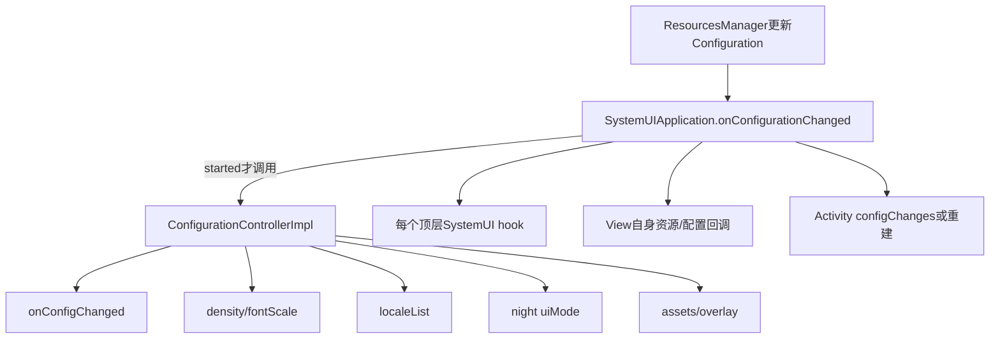
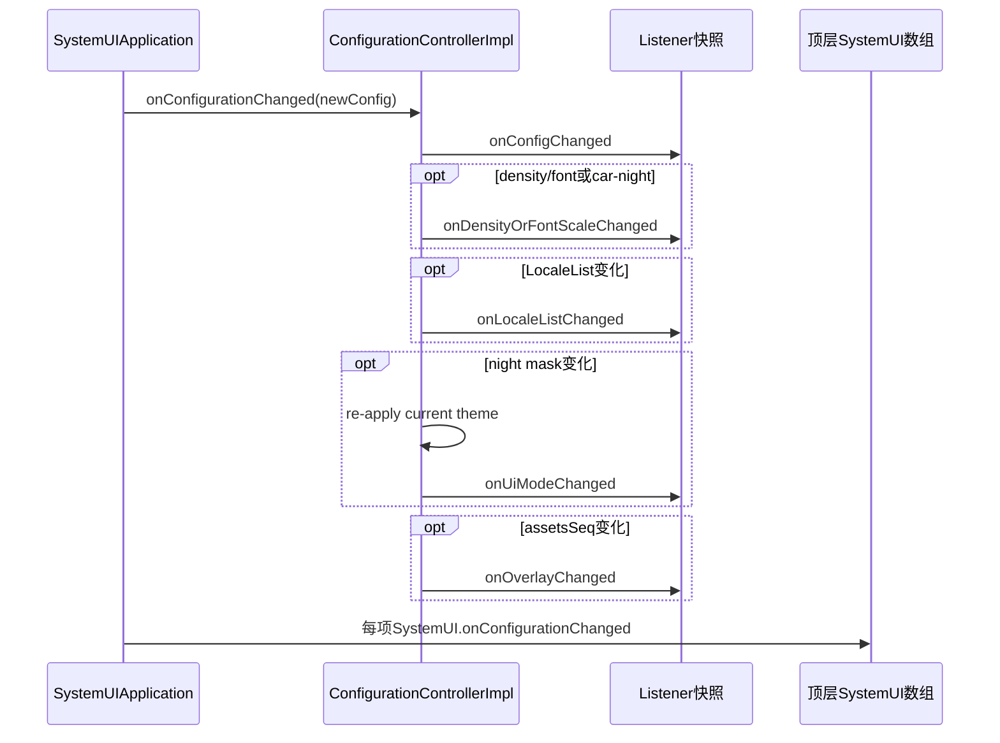
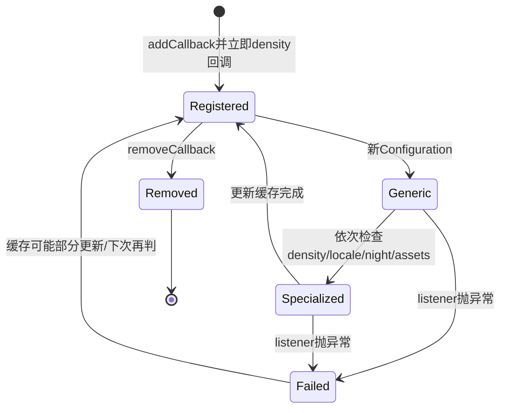

# 第 406 章 Android SystemUI ConfigurationController：资源配置、密度、主题、Locale 与重建链

> 源码基线：Android 11 / API 30 / `android-11.0.0_r48`。本章只在 macOS 阅读源码，不编译。重点是区分 Application 配置回调、ConfigurationController 差分回调、顶层 SystemUI hook、View/Activity 自己的配置机制，以及 overlay/theme 两条不同变化链。

## 1. 配置变化不只等于旋转

Configuration 还包含密度、字体缩放、Locale、布局方向、night mode、屏幕尺寸、键盘、资源 assets 序列等。不同字段需要的更新成本不同。

## 2. SystemUI 为什么不能全靠 Activity 重建

状态栏、通知管线和多种 Controller 是进程级长寿对象，不属于某个 Activity。它们必须收到增量回调、主动重读资源或重建局部 View。

## 3. 本章主类的位置

接口位于 `statusbar/policy/ConfigurationController.java`，r48 实现实际在 `statusbar/phone/ConfigurationControllerImpl.kt`，不是同目录同语言文件。

## 4. 谁提供实例

`DependencyProvider.provideConfigurationController` 以 `@Singleton @Provides` 返回新实现；根组件和旧 Dependency 兼容层最终共享这份进程内 Controller。

## 5. 谁把新配置送进来

Framework 更新进程 Resources 后调用 `SystemUIApplication.onConfigurationChanged(newConfig)`。Application 再先通知 ConfigurationController，后通知顶层 `SystemUI[]`。

## 6. 启动 guard

Application 只有 `mServicesStarted=true` 才做这两类分发。启动未完成时来的回调不会由它缓存重放，模块初始化必须读取当前 Resources 建立初态。

## 7. 两条进程级路径

一条是 Controller 向所有 ConfigurationListener 分发细分类别；另一条是 Application 逐个调用顶层模块 `onConfigurationChanged`。具体模块可能同时参与两条。

## 8. 第三条 View 路径

已经 attach 的 View 层级还可能由 Framework 调自身 `View.onConfigurationChanged`。因此同一资源变化可从 Controller、SystemUI hook 和 View 三处到达。

## 9. 第四条 Activity 路径

SystemUI Activity 是否重建取决于 Manifest `configChanges` 与 Framework 规则；声明处理的字段走 onConfigurationChanged，未声明的字段可能销毁重建 Activity。

## 10. 总分发图



## 11. Controller 保存哪些缓存

它保存 density、fontScale、构造时是否 car mode、night uiMode、LocaleList，以及一个 `lastConfig` 用于检测 assets path 变化。

## 12. 不保存完整初始配置

`lastConfig = Configuration()` 后没有在 init 中 `setTo(currentConfig)`。density等字段单独取当前值，但 assets diff 的基线最初是空 Configuration。

## 13. inCarMode 是固定值

构造时根据 UI_MODE_TYPE_MASK 计算为 val，之后不随新 Configuration 更新。代码只用它决定 night mode 切换是否额外触发 density/font 回调。

## 14. uiMode 只缓存 night 位

`uiMode = current.uiMode & UI_MODE_NIGHT_MASK`，没有保存 type、desk、car 等完整 uiMode；专用 `onUiModeChanged` 只对 night mask 差异触发。

## 15. LocaleList 是结构比较

Kotlin `!=` 会走 equals 语义；内容相同的不同 LocaleList 对象不会仅因引用不同触发回调。

## 16. listener 列表

使用普通 ArrayList，没有线程锁。标准调用依赖 SystemUI 主线程；接口本身没有 Looper 断言。

## 17. addCallback 的即时行为

加入后立刻同步调用新 listener 的 `onDensityOrFontScaleChanged()`，让它加载初始尺寸资源。

## 18. 即时回调线程

它就在 add 的调用线程运行，不会自动 post main。后台线程误注册且回调改 View，会破坏线程约束。

## 19. add 不去重

同一对象重复 add 会在列表出现多次，并立即收到多次初始 density 回调；remove 一次只移除一个匹配项。

## 20. listener快照

每次分发先 `ArrayList(listeners)`，避免遍历原列表时发生 ConcurrentModificationException。

## 21. 快照还检查存活

执行每个回调前再判断 `this.listeners.contains(it)`。本轮前面回调移除了后面 listener，后者就不会被调用。

## 22. 新增者不参与当前轮

分发开始后新 add 的 listener 不在旧快照中，只收到 add 自带的 density 初始回调，不会补收到本轮其他类别。

## 23. listener异常没有隔离

调用外没有 try/catch；某 listener 抛异常会中断后续 listener、缓存更新和其他专用类别，可能导致下次重复判断为“仍有变化”。

## 24. 第一类回调永远先发

`onConfigurationChanged` 先向快照中存活 listener 调 `onConfigChanged(newConfig)`，然后才计算/分发各专用变化。

## 25. 通用回调看原对象

所有 listener 收到同一个 newConfig 引用。它应被视为只读；任意 listener 修改它会影响后续差分与其他消费者。

## 26. density/font判断

新 densityDpi 或 fontScale 与缓存不同就触发 `onDensityOrFontScaleChanged`。

## 27. car mode 的额外条件

若 Controller 构造时已在 car mode，night uiMode 改变也触发 density/font 回调，保证车载资源/尺寸相关对象刷新。

## 28. 后来进入 car mode 的边界

inCarMode 不更新，所以进程构造时非 car、后来 type 变 car时，不会因这一 val 自动启用额外规则；通用 onConfigChanged 仍会先收到变化。

## 29. density缓存何时更新

专用 listener 全部返回后才写 `this.density/fontScale`。中途异常会留下旧缓存。

## 30. Locale回调

新 LocaleList 不等旧缓存时，先把缓存改成新值，再遍历调用 `onLocaleListChanged`。

## 31. Locale与布局方向

Configuration.updateFrom 会把 Locale 变化可能同时标记 CONFIG_LAYOUT_DIRECTION，但 r48 ConfigurationListener 没有 layout-direction 专用方法。

## 32. 布局方向如何处理

依赖通用 `onConfigChanged`、View自身 layout direction 更新、Activity/View重建或业务对象自己的配置比较；不能写成 Controller 有专门回调。

## 33. uiModeChanged判断

只比较 UI_MODE_NIGHT_MASK。UI_MODE_TYPE 等其他位变化不会触发 `onUiModeChanged`，但仍进入通用回调与 lastConfig 更新。

## 34. 为什么重新applyStyle

night位变化时先 `context.theme.applyStyle(context.themeResId,true)`，强制重新解析当前 theme 的属性。

## 35. applyStyle不是换theme id

它把当前 themeResId 重新应用到现有 Application theme；与 StatusBar 根据壁纸颜色调用 `context.setTheme(newId)` 是不同操作。

## 36. uiMode缓存顺序

applyStyle 后先更新 this.uiMode，再调用 listener `onUiModeChanged`。回调里查询 Controller 语义已是新值。

## 37. overlay检测

最后执行 `lastConfig.updateFrom(newConfig)`，若返回 bitmask 含 `ActivityInfo.CONFIG_ASSETS_PATHS` 就触发 `onOverlayChanged`。

## 38. assetsSeq 的作用

Configuration.updateFrom 在 assetsSeq 从未定义/旧值变成新值时设置 CONFIG_ASSETS_PATHS；Runtime Resource Overlay 改变常通过这条资源路径反映。

## 39. 第一次diff的边界

lastConfig 初始为空，第一次 Application 配置分发若 newConfig.assetsSeq 有定义，可能被视为 assets paths 改变，即使用户此刻没有主动切 overlay。

## 40. overlay回调在最后

同一次变化可依次收到通用、density、locale、uiMode、overlay。listener需要让操作幂等，避免多类回调都重建同一 View 时产生重复成本。

## 41. 实现决定性代码

```kotlin
listeners.filterForEach({ this.listeners.contains(it) }) {
    it.onConfigChanged(newConfig)
}
if (density != this.density || fontScale != this.fontScale ||
        inCarMode && uiModeChanged) {
    listeners.filterForEach({ this.listeners.contains(it) }) {
        it.onDensityOrFontScaleChanged()
    }
}
if (lastConfig.updateFrom(newConfig) and ActivityInfo.CONFIG_ASSETS_PATHS != 0) {
    listeners.filterForEach({ this.listeners.contains(it) }) { it.onOverlayChanged() }
}
```

## 42. 位运算优先级

Kotlin中这里的中缀 `and` 对 Int 做位与，结果与0比较；它不是布尔短路 and。

## 43. lastConfig做完整更新

虽然 Controller 只用 CONFIG_ASSETS_PATHS bit，updateFrom仍把许多已定义字段复制进 lastConfig，为下一轮 assets比较维持连续基线。

## 44. 通用回调覆盖其他字段

orientation、screenWidthDp、smallestScreenWidthDp、keyboard、colorMode 等没有专用接口，listener若关心必须在 onConfigChanged 自己比较或重读资源。

## 45. notifyThemeChanged独立入口

它不接 Configuration、不比较缓存，只把 `onThemeChanged` 发给当前 listener 快照。

## 46. 谁调用notifyThemeChanged

r48 搜索到 StatusBar.updateTheme：根据锁屏壁纸中性色是否支持深色文字，选择 light或默认SystemUI theme；theme id 真变化后调用通知。

## 47. 主题变化链

壁纸颜色/主题策略 → StatusBar计算themeResId → Context.setTheme → notifyThemeChanged → listener重取颜色/重建局部布局。

## 48. overlay变化链

ThemeOverlayController更新OverlayManager → Resources assetsSeq/config变化 → Application回调 → Controller检测CONFIG_ASSETS_PATHS → onOverlayChanged。

## 49. 两者可同时影响颜色

overlay替换资源与theme id切换都可能改变最终attr；listener常在 onOverlayChanged 中再调用 theme更新逻辑，但不能假定两个回调总成对或同序。

## 50. 差分时序图



## 51. Controller先于顶层hook

Application代码顺序固定：ConfigurationController全部回调结束后，才遍历 mServices。若 Controller listener 抛异常，顶层 hook 整轮也到不了。

## 52. 同一模块可能双收

StatusBar既注册为 ConfigurationListener，又是SystemUI顶层对象；Controller专用回调与顶层通用hook可能都触及其子对象。

## 53. 双收不必然是bug

两条路径可能负责不同职责：专用回调精细刷新依赖，顶层hook转给外部组件。只有重复执行同一非幂等操作才是问题。

## 54. 顶层例子VolumeUI

它覆盖 SystemUI.onConfigurationChanged，再转给 VolumeComponent；VolumeDialog内部还有自己的controller/view回调。

## 55. 顶层例子PipUI

PipUI把新Configuration交给 PipManager，后者更新bounds/touch等；这些逻辑不一定注册 ConfigurationController。

## 56. 顶层例子PowerUI

PowerUI在配置变化时重新读取温度警告阈值等资源。配置变化可能影响策略数据，不只是界面尺寸。

## 57. FragmentService路径

FragmentHostState收到配置后 post到Handler，再让 FragmentHostManager决定是否重建/分发 Fragment；这里额外出现一层异步。

## 58. View自身回调

QSPanel、通知行、导航按钮等大量 View override onConfigurationChanged。Framework ViewRoot分发与Controller监听可能同时发生。

## 59. AutoReinflateContainer设计

它保存layout资源id，变化时 removeAllViews 再 inflate，并通知 InflateListener新child对象。

## 60. 它监听哪些专用类别

density/font、overlay、uiMode、locale都会调用 `inflateLayout()`；通用onConfigChanged没有覆盖。

## 61. 初次add造成再次inflate

构造器已经 inflate 一次；attach时 addCallback 立即触发 density回调，因此通常又重inflate一次。这是初始化契约带来的成本。

## 62. attach/detach对称

onAttachedToWindow add，onDetached remove，避免离屏 View 被Controller长期强持有。

## 63. InflateListener必须换引用

旧child已从层级移除；listener要用回调给的新 View 更新缓存。继续持旧按钮/文本引用会修改不可见对象。

## 64. 多类别同轮重复inflate

若density、night和overlay在同一 Configuration 同时变，Container可能连续inflate三次；r48 Controller不做跨类别合并。

## 65. 业务层可自行去重

例如 NotificationPanelViewController 的 theme listener缓存 themeResId，相同就return，避免被强制 theme通知重复重建。

## 66. StatusBar的density处理

转给BrightnessMirror、UserInfo/UserSwitcher、KeyguardUserSwitcher、通知图标区域和HeadsUpManager等，体现进程级对象主动重读dimen。

## 67. StatusBar的overlay处理

先刷新BrightnessMirror，再让NotificationPanel更新theme，之后调用自身onThemeChanged；注释强调先获得新的keyguard indication View id再重建相关controller。

## 68. StatusBar的uiMode处理

r48这段主要转给BrightnessMirrorController；其他 listener各自响应night资源。不要假定StatusBar会统一重建全部shade。

## 69. NotificationPresenter的职责

density变化遍历通知entry/row、guts等重新取尺寸；uiMode变化让通知行刷新昼夜模式；overlay又可复用density刷新路径。

## 70. Locale变化不只文本

排序规则、日期格式、布局宽度和无障碍描述都可能变化。r48 Controller只给事件，具体对象决定重建或重新bind。

## 71. NotificationChannels另有路径

第401章 SystemUIApplication 直接监听 LOCALE_CHANGED，并在boot后重建通知渠道名称；它不依赖 ConfigurationController locale回调。

## 72. 为什么会有重复Locale通道

长寿进程里不同资源拥有者需要不同恢复时点：渠道需NotificationManager交互，View文本则跟配置刷新。统一一个回调并不能自动满足所有生命周期。

## 73. overlay不是theme picker本身

ThemeOverlayController读取Settings Secure JSON并调用 OverlayManager应用包；ConfigurationController只观察最终资源配置变化，不解析选择策略。

## 74. overlay按用户

ThemeOverlayController读取当前user，并把部分overlay应用到SystemUI user0及启用managed profiles；资源变化与用户切换结合，排错要标user。

## 75. Application Context theme

SystemUI在Application上setTheme，Service创建View会继承；night改变时Controller重apply该theme。Activity仍有自己的Theme/Context包装。

## 76. ContextThemeWrapper缓存

已经用不同ContextThemeWrapper inflate的View不一定因Application theme改动自动重算全部属性，常需reinflate或主动重设颜色。

## 77. Resources对象会更新

Framework可在现有ResourcesImpl上应用新配置；再次getDimension/getColor得到新值，但已经缓存为int/Drawable的业务字段不会自动改变。

## 78. 何时只重读资源

对象结构不变、只有尺寸/颜色值变化时可更新LayoutParams、paint或drawable，成本低且保留状态。

## 79. 何时局部reinflate

layout资源分支、View类型、主题属性树或overlay id可能变化时，重新inflate容器更可靠，但要迁移运行状态和监听。

## 80. 何时Activity重建

由Framework根据Manifest未处理的config bit决定；Activity重建不能替进程级Controller、Service窗口和overlay View自动收尾。

## 81. Manifest configChanges是承诺

声明某字段表示组件自己正确处理，Framework可能不重建它。漏刷新资源是组件责任，不是声明越多越好。

## 82. Service没有Activity自动重建模型

SystemUIService和顶层SystemUI对象持续存活，依赖Application分发/Controller/业务hook；这是本章主线存在的原因。

## 83. display配置并非只有一份

Application Configuration常代表进程/默认资源语境；多display Context可能有不同bounds/density。按屏窗口还需读取其display Context配置。

## 84. Controller缓存是单份

r48 ConfigurationControllerImpl只有一个density/font/uiMode/locale缓存，没有按display Map。不能用它完整表达每块屏幕不同Configuration。

## 85. 多屏组件怎么办

NavigationBarController、ScreenDecorations、Pip等有自己的display回调、per-display Context或配置差分；Application全局事件只是输入之一。

## 86. 旋转的特殊性

orientation/bounds变化走通用回调或View/Display机制，没有专用 `onRotationChanged`。部分组件还从Display.getRotation独立查询。

## 87. fontScale与density合并回调

listener无法从无参专用方法直接知道是哪一项变了，通常统一重读所有尺寸/字号资源；需要精确差异可保存自己的旧值。

## 88. uiMode只比较night的限制

car/desk type变化不触发专用uiMode回调。关心完整uiMode的listener必须看onConfigChanged参数。

## 89. notifyThemeChanged无状态

连续两次调用会连续分发，即使theme id没变。标准StatusBar调用前自己比较 id，但其他测试/调用者可能强制通知。

## 90. listener删除语义

remove按对象equals查找；大多listener用身份equals。若自定义equals把不同实例判相等，可能移除非预期项。

## 91. 回调状态机



## 92. 缓存部分更新故障

Locale缓存先更新再回调，density缓存在回调后更新，uiMode也在回调前更新；异常发生点不同会留下不同的“已承认新配置”状态。

## 93. 没有事务rollback

前面listener重建成功、后面失败时不会还原旧View，也不会撤回已更新缓存。配置处理应幂等并尽量避免抛异常。

## 94. 没有Handler合并

Controller同步处理每次Application回调，不像CommandQueue removeMessages；短时间多次overlay/rotation可能连续刷新。

## 95. 主线程卡顿风险

大批listener同步reinflate会延长Application配置回调和SystemUI主线程帧；应把必要UI更新留主线程，重计算按安全方式拆出。

## 96. 不能随意后台inflate

LayoutInflater、Theme与View对象通常要求主线程语境。性能优化不能简单把整个配置回调扔Executor。

## 97. 诊断第一步：确认输入

记录旧/新 density、fontScale、locales、night mask、assetsSeq、orientation与displayId，先确定Framework实际送了什么。

## 98. 第二步：确认启动状态

若 mServicesStarted=false，Application不分发；若进程刚重启，对象应从当前Resources初始化，不依赖历史回调。

## 99. 第三步：确认订阅

检查add时机、是否重复、detach是否移除、callback是否在变化前已注册，以及它关心通用还是专用方法。

## 100. 第四步：确认重建层级

区分只重读资源、局部reinflate、Fragment重建、Activity重建和进程重启。层级越大，状态迁移与闪烁风险越高。

## 101. “字体变了但控件没变”

查listener是否收到density/font、是否缓存TextSize、是否使用sp资源、旧View是否仍被持有，以及add是否在错误线程。

## 102. “切深色部分区域没变”

查night mask、applyStyle、onUiModeChanged、onThemeChanged、overlay与具体View是否重取attr；不要只看Activity主题。

## 103. “换overlay后旧布局id”

查assetsSeq/CONFIG_ASSETS_PATHS是否变化、onOverlayChanged是否到达、容器是否reinflate、controller是否仍缓存旧child引用。

## 104. “切语言渠道名没变”

ConfigurationController locale只更新监听对象；渠道名称依赖SystemUIApplication的LOCALE_CHANGED且要求boot cache=true。

## 105. “外屏尺寸错”

确认组件读取的是Application资源还是display Context资源；单份ConfigurationController cache不足以证明外屏密度已正确。

## 106. 阅读listener的固定问题

它何时add/remove、即时density回调是否安全、哪些方法覆盖、是否reinflate、旧引用如何替换、同轮多类别是否幂等。

## 107. 阅读资源的固定问题

值来自dimen/color/layout/style还是overlay；读取发生在构造、attach、每帧还是配置回调；缓存是否随Context/display/user区分。

## 108. 阅读Activity的固定问题

Manifest处理哪些config bit、未处理时能否重建、saved state是否完整、进程级依赖是否仍指向旧Activity/View。

## 109. 阅读主题的固定问题

区分night Resources、Application theme id、ContextThemeWrapper、RRO assets和壁纸颜色派生主题；它们可能先后变化。

## 110. 本章最小模型

Application提供总入口，ConfigurationController同步做有限字段差分，listeners增量刷新，顶层SystemUI/View/Activity各有并行路径；SystemUI配置更新不是一场统一重建。

## 111. 本章练习说明

下面恰好四项，只读r48源码，不编译。每项输出旧值、新值、触发回调顺序、重建层级和可能保留的旧引用。

## 112. macOS只读练习一：推演夜间模式切换

分别假设Controller构造时是普通模式和car mode，只改变night mask，写出通用、density、uiMode、overlay是否触发及缓存更新顺序。

## 113. macOS只读练习二：追AutoReinflateContainer

从构造inflate、attach add即时回调、overlay+locale同轮变化到连续reinflate，说明InflateListener如何取得新child、旧引用为何失效。

## 114. macOS只读练习三：对比theme与overlay

串读StatusBar.updateTheme、notifyThemeChanged、ThemeOverlayController和CONFIG_ASSETS_PATHS检测，画两条来源、共同消费者及可能重复回调。

## 115. macOS只读练习四：审计一个外屏组件

选择NavigationBarController或ScreenDecorations，列出Application ConfigurationController、DisplayListener、per-display Context和View回调四层，判断尺寸资源真正从哪里读。

## 116. 易错点一：Controller有所有配置专用回调

错误。r48接口只有通用、density/font、overlay、uiMode、theme、locale；旋转、最小宽度、布局方向等需其他路径。

## 117. 易错点二：onUiModeChanged表示完整uiMode

错误。实现只比较night mask；type变化仍需通用onConfigChanged处理，inCarMode还是构造时固定值。

## 118. 易错点三：一次变化只通知一次

错误。同一newConfig可触发多个专用回调，之后Application还调用顶层SystemUI hook，View/Activity也可能各自处理。

## 119. 复读源码后的修正

本章复读后删掉了新版本才有的layoutDirection/smallestWidth专用接口；补正lastConfig没有用初始Resources初始化、inCarMode为固定val、add不去重且同步回放density、listener异常可阻断缓存/顶层hook，以及overlay与theme是两条来源。所有结论限于r48。

## 120. 本章结论

Android 11 r48 的SystemUI配置处理是一张多入口增量网：Application先驱动单例Controller按有限字段差分，再驱动顶层模块；View、Fragment和Activity还有自身机制。看懂缓存更新顺序、listener生命周期、theme/overlay区别和多屏Context，才能解释“资源已变但某块UI没变”。下一章进入PluginManager、PluginInstance、ClassLoader、版本检查与崩溃保护。
