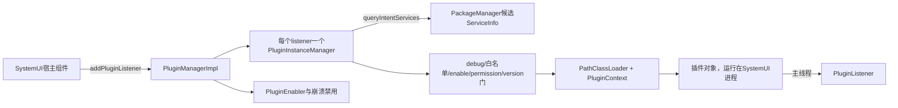
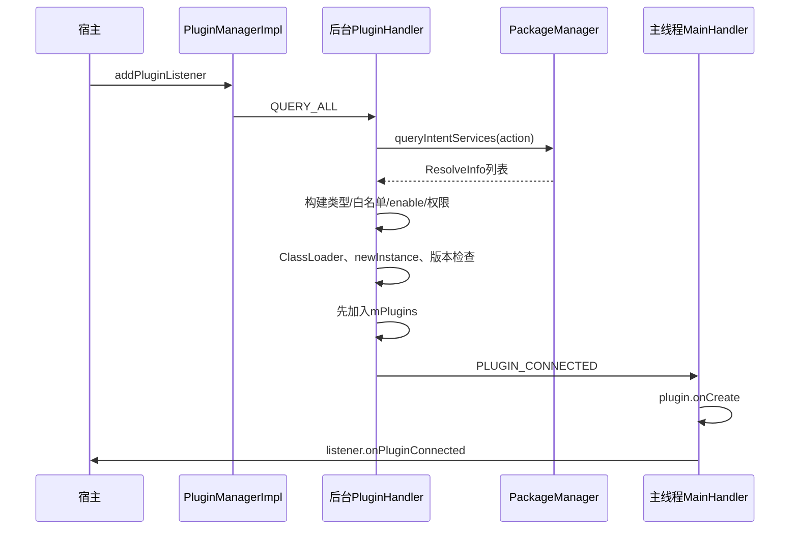
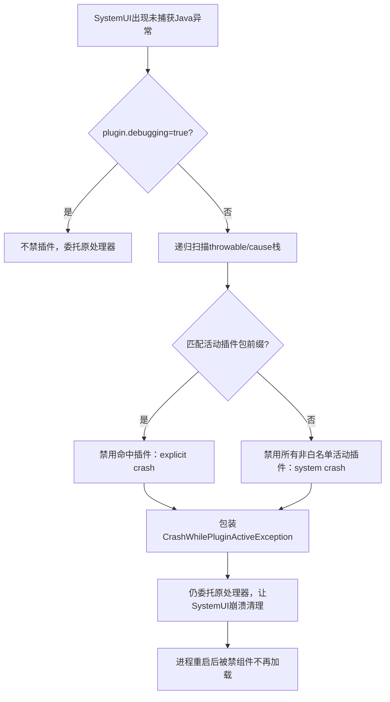

# 第 407 章 Android SystemUI PluginManager：插件发现、ClassLoader、版本检查与崩溃保护链

> 源码基线：Android 11 / API 30 / `android-11.0.0_r48`。本章只在 macOS 阅读源码，不安装插件、不启动 SystemUI、不编译。SystemUI 插件把第三方或产品 APK 的代码直接加载进 SystemUI 进程，能力很强，故发现、权限、版本、类隔离和故障恢复必须连起来理解。

## 1. 先纠正“插件进程”直觉

插件 APK 并不因此拥有独立插件进程。它的实现类由 SystemUI 的 `PathClassLoader` 加载并在 SystemUI 进程实例化，插件代码崩溃可以直接带崩 SystemUI。

## 2. r48 的核心类名

全局入口是 `PluginManagerImpl`，每个 listener/action 对应一个 `PluginInstanceManager`。这一版没有后续重构中的独立 `PluginInstance` 类，读新文章时不要反套类名。

## 3. 接口模块与实现模块

插件契约在 `packages/SystemUI/plugin`、`plugin_core`，加载实现位于 `shared/.../plugins`，产品侧初始化器在 SystemUI `src/.../plugins`。拆模块是为了让插件编译期依赖接口而非整套 SystemUI 实现。

## 4. Plugin 是普通接口

`Plugin` 提供默认 `getVersion()`、`onCreate()`、`onDestroy()`。具体插件接口继续继承它，并用注解声明 action 和版本依赖。

## 5. PluginListener 是宿主接点

宿主实现 `onPluginConnected(plugin, pluginContext)` 开始使用插件，并在 `onPluginDisconnected(plugin)` 丢掉引用。断开默认方法为空，宿主若保存插件就必须自己覆盖清理。

## 6. 谁创建 PluginManager

`DependencyProvider.providePluginManager` 返回 `new PluginManagerImpl(context, new PluginInitializerImpl())`；旧 `Dependency` 再把该 Dagger Lazy 暴露给传统调用者。

## 7. 构造时做了什么

Manager读取后台Looper、白名单和PluginEnabler，创建PluginPrefs，替换进程级uncaught exception pre-handler，并把initializer初始化任务post到后台Looper。

## 8. 构造不等于开始扫描

没有listener或one-shot请求时，它不会查询PackageManager，也不注册包变化Receiver。插件框架采用按需激活，普通设备可以几乎不承担加载成本。

## 9. 初始化任务的作用

`PluginInitializerImpl.onPluginManagerInit` 允许插件申请 `ActivityStarter` 依赖。这个任务异步执行，因此“Manager已构造”和“依赖白名单已准备”不是同一完成点。

## 10. 总体对象图



## 11. action 从哪里来

常用重载从插件接口的 `@ProvidesInterface(action=...)` 读取action。接口没有注解或action为空时，`PluginManager.Helper.getAction` 直接抛RuntimeException。

## 12. 添加listener的四个动作

它记录action到PluginPrefs、创建InstanceManager、调用`loadAll()`、把listener→manager放入map，最后启动广播监听。`loadAll`只是向后台Handler投`QUERY_ALL`。

## 13. listener 是 map 的键

同一个listener再次添加会覆盖map里的旧manager，但源码没有先destroy旧manager。旧对象可能仍有排队任务或回调，是调用方必须避免的重复注册边界。

## 14. allowMultiple 的含义

false时一次action期望至多一个候选；PackageManager查询结果大于1会记录警告并整批拒绝，而不是随便选第一个。true才逐个加载所有合格候选。

## 15. 插件如何被“发现”

后台以action构造Intent并调用`queryIntentServices(intent, 0)`。Manifest中的service在这里充当可查询的组件声明和实现类名索引。

## 16. 声明Service不等于启动Service

代码没有`bindService`或`startService`。它拿`ServiceInfo.name`后通过ClassLoader和反射`newInstance()`直接构造该类，所以不会得到Android Service的attach/onCreate生命周期。

```java
List<ResolveInfo> result = mPm.queryIntentServices(new Intent(mAction), 0);
ComponentName name = new ComponentName(
        info.serviceInfo.packageName, info.serviceInfo.name);
Class<?> pluginClass = Class.forName(cls, true, classLoader);
T plugin = (T) pluginClass.newInstance();
```

这四行分别代表“查组件声明、取得类名、加载类、普通反射构造”；中间没有Service管理器参与。

## 17. 为什么仍用service声明

PackageManager已经提供action过滤、组件启停、包更新通知和ServiceInfo标签等管理能力。插件框架借它做注册表，但运行模型仍是进程内普通对象。

## 18. 发现线程

常规`loadAll`、包变化查询在initializer提供的后台Looper执行，避免主线程做PM查询和类加载。连接/断开生命周期回调再切到main Handler。

## 19. 主线程生命周期顺序

普通插件连接时先`plugin.onCreate(sysuiContext, pluginContext)`，再`listener.onPluginConnected`；断开时先listener，再`plugin.onDestroy()`。

## 20. Fragment 例外

如果对象是`PluginFragment`，InstanceManager跳过Plugin的onCreate/onDestroy，让Fragment自身生命周期负责，避免两套生命周期重复执行。

## 21. mPlugins 的所属线程并不纯粹

常规消息在后台改列表，但one-shot的`getPlugin()`会在UI线程直接调用`handleQueryPlugins`。源码没有统一锁住mPlugins，理解它要结合API调用约束而非假定严格线程封闭。

## 22. 初次全量查询

`QUERY_ALL`先为旧列表逐个向主线程发送disconnect，再清列表并重新查询。重扫不是原位刷新，宿主会观察到旧实例断开、新实例连接。

## 23. 包变化查询

manager依次排`REMOVE_PKG`和`QUERY_PKG`。同一后台Handler保证先从列表移除并投disconnect，再尝试加载新包并投connect。

## 24. 禁止多实例时的增量边界

若allowMultiple=false且当前列表仍非空，针对另一包的QUERY_PKG会跳过。包变化前的REMOVE只移相同包，所以已有合法实例会继续占位。

## 25. 用户解锁

Manager收到`ACTION_USER_UNLOCKED`后对map中每个InstanceManager执行`loadAll`。它做全量重扫，并不是只补Direct-Boot-unaware候选。

## 26. 第一扇门：构建类型

非debuggable构建只允许白名单组件；debuggable构建才允许外部原型插件。源码还在真正加载点再次检查，避免只依赖较早判断。

## 27. 白名单两种写法

资源项可以是完整ComponentName，也可以只是包名。组件白名单精确保护该组件；获取ClassLoader时则只检查包，所以组件项也使所属包通过package级检查。

## 28. 白名单不是权限替代品

通过生产构建白名单后，候选仍要启用、持PLUGIN权限并通过版本检查。每一扇门解决的威胁不同，不能合并理解。

## 29. 第二扇门：组件启用状态

`PluginEnabler.isEnabled`只把PackageManager明确的DISABLED视为关闭；DEFAULT、ENABLED等都视为可用。

## 30. 第三扇门：签名权限

候选包必须被PackageManager判定持有`com.android.systemui.permission.PLUGIN`。SystemUI Manifest定义它为signature权限，普通不同签名应用无法正常获得。

## 31. 权限检查不是Binder隔离

它只是加载前准入。一旦加载，代码就在SystemUI UID、进程和权限环境内执行，所以插件必须被视为高度可信代码。

## 32. 第四扇门：ApplicationInfo

框架读取候选包ApplicationInfo，得到sourceDir、split APK和native library路径。包在查询与加载之间消失会进入异常捕获并返回null。

## 33. 第五扇门：版本契约

实例甚至会在版本检查前被`newInstance()`构造；若版本无效，该临时对象不会收到onCreate，但构造器副作用已经可能发生，故插件构造器应保持轻量。

## 34. 反射构造限制

r48调用已弃用的`Class.newInstance()`，要求可访问无参构造器。构造、静态初始化、类解析的任何Throwable都被加载层捕获并记录，候选被忽略。

## 35. 加载失败不会必然禁用

普通ClassNotFound、构造异常或权限失败只导致本轮不连接；自动禁用主要发生在未捕获崩溃处理和用户点版本错误通知动作时。

## 36. ClassLoader按包缓存

PluginManager以packageName为键缓存PathClassLoader，同包多个插件组件共享一份类定义与静态状态。

## 37. 更新为何必须清缓存

包added/changed/replaced/removed到来时先`clearClassLoader(pkg)`。不移除旧loader，重新反射仍可能执行旧APK代码。

## 38. 清缓存不卸载类

移除map项只是不再供未来加载使用；旧插件实例、Class对象、线程或静态引用存在时，旧loader仍可存活，直到所有强引用释放并被GC。

## 39. PathClassLoader路径

`LoadedApk.makePaths`组合base/split代码路径和native library路径，再创建以过滤器为parent的PathClassLoader。

## 40. parent过滤器的目的

插件接口类必须来自SystemUI宿主，保证类型身份一致；插件自己的库和复制代码则可从插件APK加载，避免宿主偶然同名库全面污染其解析。

## 41. ClassLoaderFilter的关键规则

对`com.android.systemui.plugin`前缀直接交给SystemUI base loader；其他名称先走system classloader，非系统类找不到就抛出，使插件不能随意链接SystemUI内部实现。

## 42. 前缀是 singular 但能覆盖 plugins

字符串`com.android.systemui.plugins...`同样以`com.android.systemui.plugin`开头，因此公开插件API包会命中过滤规则。不要把它误读成拼写错误。

## 43. 类型身份为什么重要

若插件APK自己加载另一份Plugin接口，即使全限定名相同，JVM也会因ClassLoader不同认为是不同类型，强转失败。父加载规则正是避免这类Linkage问题。

## 44. PluginContextWrapper

框架先为插件ApplicationInfo创建应用Context，再包一层覆盖`getClassLoader()`。插件读取自身资源时用pluginContext，而非只用SystemUI Context。

## 45. LayoutInflater也必须换Context

Wrapper首次请求Inflater时，从base取得后`cloneInContext(this)`并缓存。这样XML中的自定义View会使用插件ClassLoader解析。

## 46. 其他系统服务

除LayoutInflater外，Wrapper直接转发base Context的系统服务。它不是安全沙箱，也不会代理插件对系统服务的所有访问。

## 47. sysuiContext 与 pluginContext

onCreate同时收到二者：前者适合宿主能力和资源，后者适合插件资源、主题、类加载。混用常造成资源ID、Inflater或主题错误。

## 48. 连接并非Binder连接

`onPluginConnected`只是主线程对象生命周期通知，没有IBinder、ServiceConnection或死亡通知。插件与宿主是直接Java调用。

## 49. 加载主时序

后台完成发现、门禁、类加载、构造和版本检查；主线程随后做onCreate和listener连接。后台列表已先加入实例，再发送连接消息。

## 50. 加载时序图



## 51. 注解版本模型

`VersionInfo`读取`@ProvidesInterface`、`@Requires/@Requirements`、`@DependsOn/@Dependencies`，形成Class→版本/required表。版本比较不是一个全局整数。

## 52. 宿主期望表

Factory对宿主传入的接口类调用`new VersionInfo().addClass(cls)`；第一个加入的类同时成为legacy默认版本来源。

## 53. 插件实际表

加载后对插件实现类执行`addClass(pluginClass)`。实现类通常用Requires声明自己期望的宿主接口版本，并可声明依赖的其他插件API。

## 54. 精确版本匹配

同一Class的expected与actual版本必须相等，没有“大于等于即可”的兼容规则。兼容新增方法应通过默认实现等方式避免随意升版本。

## 55. 缺少required依赖

比较完插件声明后，宿主表中仍剩且标为required的Class会抛“Missing required dependency”。optional项可以不由插件声明。

## 56. 插件声明未知接口

若宿主期望表没有该Class，VersionInfo会尝试读取该Class自己的ProvidesInterface版本；仍没有注解则判无有效接口并拒绝。

## 57. too old 与 too new

异常的`isTooNew`根据宿主版本是否小于插件声明版本计算。通知据此提示更新插件或检查系统OTA，但真正兼容性仍由精确比较决定。

## 58. legacy回退

如果插件实现类没有生成任何注解版本信息，框架调用`plugin.getVersion()`，要求等于宿主默认版本；成功时PluginInfo中的VersionInfo为null。

## 59. legacy依赖限制

`dependsOn`要求PluginInfo版本表非null且包含目标Class，因此legacy成功加载并不表示可以通过PluginDependency请求任意宿主对象。

## 60. 版本错误的用户动作

框架发布警告通知并附“Disable plugin”广播。发现版本错本身只返回null，只有动作被触发后PluginEnabler才真正禁用组件。

## 61. 禁用的实现

PluginEnablerImpl用PackageManager设置组件DISABLED且`DONT_KILL_APP`，并在SharedPreferences按flattened ComponentName记录原因。

## 62. ENABLED的实现

重新启用会明确设置COMPONENT_ENABLED_STATE_ENABLED并删掉原因记录，而不是恢复到Manifest DEFAULT状态。

## 63. 原因值存在别名

r48中`DISABLED_MANUALLY`与`DISABLED_INVALID_VERSION`都等于1。持久化后无法区分这两种来源，这是阅读更新恢复逻辑的重要细节。

## 64. 包更新自动重启用

ACTION_PACKAGE_REPLACED若组件可从URI解析，且原因是显式崩溃、系统崩溃或invalid version，就setEnabled。由于原因1别名，手工禁用也可能被归入该条件。

## 65. 更新广播的ComponentName边界

普通系统package replaced URI通常只给包名，`unflattenFromString(pkg)`可能得到null；该自动重启用分支因此依赖广播数据具体形态，不能只看条件就断言总会执行。

## 66. PluginPrefs记录什么

它持久化宿主曾注册过的action集合，供Tuner插件页发现类型；还用一个hasPlugins布尔值表示历史上至少连接过插件。

## 67. hasPlugins不是当前状态

一旦置true源码不在断开时清除，所以它不能回答“现在是否有活动插件”，只能作为曾使用过插件的提示。

## 68. 常规广播监听

首次有listener时注册package added/changed/replaced/removed、PLUGIN_CHANGED、DISABLE_PLUGIN和USER_UNLOCKED。onReceive默认运行在注册Context主线程。

## 69. Manager广播只做路由

包变化入口会清ClassLoader并向各InstanceManager排后台消息；真正PM查询和加载不在onReceive里完成。

## 70. 同一Receiver多次注册

startListening以不同filter/permission组合多次registerReceiver同一对象，stop时一次unregisterReceiver。分析攻击面和重复接收必须看每份注册，而非只看一个filter变量最终内容。

## 71. 动态Receiver不是自动可信入口

PLUGIN_CHANGED和DISABLE_PLUGIN有带PLUGIN权限的注册，也存在无permission注册。r48代码还会直接解析URI，故实际产品应依靠debug/白名单/签名门并谨慎对待外部广播输入。

## 72. malformed URI边界

DISABLE_PLUGIN路径对data、substring和ComponentName结果缺少完整空值防护。正常通知会构造约定格式，但异常发送者可能制造RuntimeException。

## 73. remove listener

map存在时移除并调用manager.destroy；若map变空则尝试stopListening。不存在的listener静默return。

## 74. destroy并非强取消

它复制当前mPlugins并向main发送disconnect，却不清列表、也不移除后台待处理消息。已排查询理论上仍可能继续产生连接，宿主生命周期应避免晚到回调造成泄漏。

## 75. one-shot前提

`getOneShotPlugin`强制在UI线程调用；它同步查询并只取第一项，直接调用plugin.onCreate后返回对象，不经过PluginListener。

## 76. one-shot manager不进map

临时InstanceManager没有保存在mPluginMap。返回后Manager只记包名与`mHasOneShot`，因此常规包变化不会让这个对象自动断开重连。

## 77. one-shot更新策略

其包变化时框架提示“Restart SysUI for changes to take effect”，并保持广播监听。原因是旧返回对象仍由调用方持有，热替换无法可靠改掉它。

## 78. one-shot永不停止监听

`stopListening`发现mHasOneShot就return；一旦成功拿到过one-shot，本进程余生保持Receiver注册。

## 79. one-shot选择并不处理多候选警告吗

它创建manager时allowMultiple=false，因此查询多于一个候选会整体拒绝，`getPlugin()`返回null，并非无条件取PackageManager第一项。

## 80. getPlugin的生命周期差异

它先移除主Handler中所有PLUGIN_CONNECTED消息，再取列表第一个并直接onCreate。若该manager意外产生多个连接消息，这个全类型remove会一起清除。

## 81. PluginDependency的两层许可

插件必须在版本注解中声明dependsOn目标Class，同时宿主PluginDependencyProvider必须显式allow该Class。任一条件不满足都会抛IllegalArgumentException。

## 82. 为什么不直接给Dependency

这防止插件把SystemUI全局对象图当服务定位器任意读取；只向协议声明且宿主批准的少量对象开放。

## 83. 默认仅开放ActivityStarter

r48 initializer初始化时允许ActivityStarter。其他能力若有更合适归属，应由相应宿主初始化，而不是无限堆到全局provider。

## 84. 依赖对象仍是进程内引用

取得对象后调用没有Binder隔离，插件可以阻塞主线程、保存引用或抛异常。许可控制能力范围，但不提供故障隔离。

## 85. 崩溃处理安装位置

Manager用`Thread.setUncaughtExceptionPreHandler`安装进程级前置处理器，并保存之前的pre-handler作为最终委托对象。

## 86. 它只处理未捕获异常

被业务try/catch吞掉的插件错误、ANR、native crash或进程被杀不一定经过这条Java handler。不要把它称为完整插件沙箱。

## 87. 栈匹配策略

处理器递归检查Throwable及cause的每个StackTraceElement，让每个InstanceManager用`className.startsWith(pluginPackage)`寻找可能相关插件。

## 88. 前缀匹配可能宽泛

包`a.b`也会匹配`a.bc.SomeClass`，源码没有在包名后补点边界；判断是保守启发式，不是对真正责任插件的证明。

## 89. 命中后的原因

匹配到的非白名单活动插件被标为`DISABLED_FROM_EXPLICIT_CRASH`。同一插件出现在多个manager时会重复尝试禁用，但结果以boolean聚合。

## 90. 无法归因时

如果整个cause链没匹配任何插件，框架禁用所有manager当前列表中的非白名单插件，原因是`DISABLED_FROM_SYSTEM_CRASH`，优先让下次SystemUI启动恢复可用。

## 91. 崩溃恢复图



## 92. 白名单插件不自动禁用

白名单被视为OS组成部分，disable返回false。若只有白名单插件活动，框架最终可能没有disabledAny，也不会包装异常。

## 93. 禁用不等于本次继续运行

PluginExceptionHandler最终总调用原异常处理器。本次SystemUI仍正常崩溃；禁用是为下一次进程启动排除可疑代码。

## 94. 异常包装的意义

至少禁用一个插件后，原Throwable被包进CrashWhilePluginActiveException作为cause，便于崩溃记录说明插件活跃，但原始栈仍在cause中。

## 95. plugin.debugging开关

系统属性为true时完全跳过自动禁用，直接委托原处理器，方便开发者反复调试而不被框架关掉组件。

## 96. cause递归使用位或

`disabledAny | checkStack(cause)`不是短路`||`，即使本层已命中仍会检查cause，可能再禁用其他插件。

## 97. suppressed异常未扫描

实现只递归cause，没有遍历Throwable.getSuppressed；可疑插件只出现在suppressed栈时可能进入“无法归因，禁用全部”的路径。

## 98. 加载阶段Throwable被捕获

插件静态初始化或构造抛错被`handleLoadPlugin`的catch(Throwable)吞下并记录，不会到uncaught handler，因此通常也不会自动禁用或杀SystemUI。

## 99. listener异常会怎样

主线程`plugin.onCreate`或`listener.onPluginConnected`没有局部try/catch，未捕获时会进入进程级插件异常处理；若栈能匹配插件包则下次禁用。

## 100. onDestroy异常会怎样

断开链同样没有隔离。listener先执行，若它抛异常，插件自己的onDestroy到不了；若plugin.onDestroy抛出则可能触发全进程崩溃处理。

## 101. 版本错误通知并非隔离证据

对象已经构造、类已加载，只是没有进入onCreate/connected。恶意静态初始化仍已运行，所以最强准入仍是构建类型、白名单和signature权限。

## 102. 包更新不是原子切换

Receiver清loader、后台移旧并主线程disconnect、再后台加载并主线程connect；期间宿主可能处于无插件fallback状态，新插件失败则保持断开。

## 103. 宿主必须准备fallback

插件是可选扩展，候选缺失、重复、权限不足、版本错误、被禁用或加载异常都合法地产生零连接。核心SystemUI不能依赖插件必然存在。

## 104. 宿主引用纪律

只在connected后使用，在disconnected第一时间移除回调、View和对象引用。否则旧ClassLoader无法回收，更新后还可能把事件发给旧代码。

## 105. 插件线程纪律

onCreate/listener生命周期在主线程，插件不应做磁盘、PM查询或重计算。插件自行启动线程时必须在onDestroy停止，否则更新后旧loader长期存活。

## 106. dump能看到什么

PluginManager.dump只打印listener→PluginInstanceManager映射及action字符串，不展开活动PluginInfo、版本、启用原因、ClassLoader缓存或待处理消息。

## 107. 诊断第一组证据

先查SystemUI日志中的Found、cannot load、invalid version、Disabling plugin和Reloading；再查PackageManager组件启用状态、权限、service action与白名单资源。

## 108. 诊断第二组证据

确认是“未发现、门禁失败、版本失败、构造失败、主线程连接崩溃”哪一层。只看到没有onPluginConnected，不能直接归因ClassLoader。

## 109. macOS阅读路线

从PluginManager接口和Plugin契约开始，再读Impl的注册/Receiver/ClassLoader/异常处理，之后读InstanceManager线程与加载门，最后读VersionInfo、Enabler和具体消费者。

## 110. 本章最小心智模型

action负责发现，门禁负责可信，ClassLoader负责类型边界，VersionInfo负责协议兼容，main Handler负责生命周期，Enabler加进程重启负责崩溃后的恢复。

## 111. 阅读前自测

若能解释为何“Service已被query到”不等于Service已启动、为何清ClassLoader不等于卸载旧类、为何禁插件后SystemUI仍会崩溃，就抓住了主线。

## 112. macOS只读练习一：追一次普通插件加载

从一个带ProvidesInterface的宿主接口出发，找action、消费者addPluginListener、Manifest候选声明；写出后台与主线程切换，并标注五扇加载门。

## 113. macOS只读练习二：手算版本表

选择一个插件接口及其DependsOn/Requires注解，分别画宿主VersionInfo与插件VersionInfo，推演相等、过新、过旧、缺required和legacy五种结果。

## 114. macOS只读练习三：推演包更新

从PACKAGE_REPLACED进入，记录旧loader移出缓存、REMOVE_PKG、disconnect、QUERY_PKG、new loader和connect顺序，并列出旧对象仍被宿主持有时的后果。

## 115. macOS只读练习四：推演崩溃归因

构造插件栈命中、仅cause命中、无命中、白名单命中和plugin.debugging五种情形，写出禁用对象、reason、异常是否包装及本次进程结局。

## 116. 易错点一：插件Service运行在独立进程

错误。Service声明只是PM发现索引；r48直接反射实例化插件类，普通方法、生命周期和崩溃都发生在SystemUI进程。

## 117. 易错点二：版本不兼容会立即自动禁用

错误。它发布通知并拒绝连接，用户触发Disable action才设置组件禁用；构造器和静态初始化还发生在版本检查之前。

## 118. 易错点三：崩溃保护能避免SystemUI崩溃

错误。pre-handler先为下次启动禁用可疑插件，然后仍委托原处理器结束本次进程；它是恢复策略，不是异常隔离容器。

## 119. 复读源码后的修正

复读r48后，本章改用实际`PluginInstanceManager`而非新版本PluginInstance；补正Service只query不bind、one-shot manager不入map、PluginPrefs只表历史、版本错不立即禁用、手工与invalid reason同值，以及ClassLoader缓存清除不等于卸载旧类。崩溃路径也限定为未捕获Java异常与cause栈启发式匹配。

## 120. 本章结论

SystemUI插件不是远程扩展，而是受多道准入门控制的进程内动态代码。可靠性来自宿主fallback、严格生命周期、API类身份、精确版本检查和“崩溃后禁用、重启恢复”的组合，而不是进程隔离。下一章进入TunerService，研究Settings.Secure调谐项、Tunable监听、用户切换与Demo模式。
