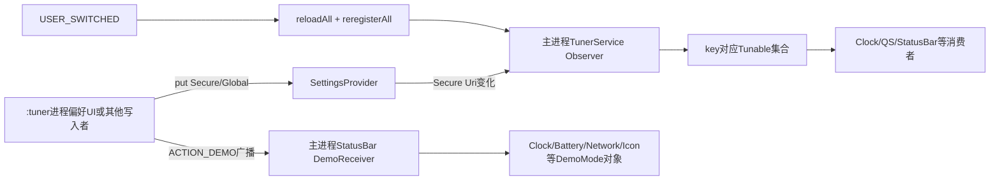
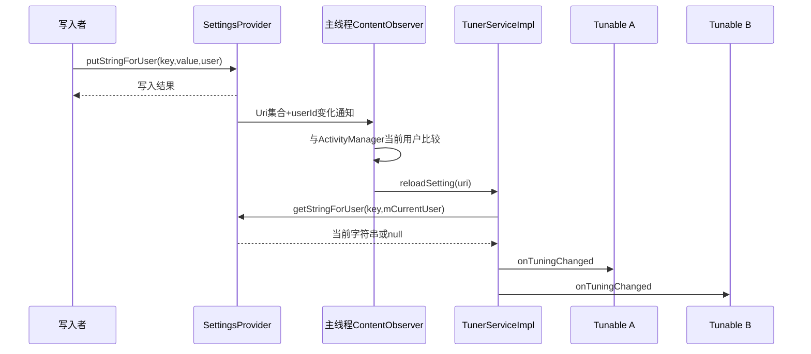
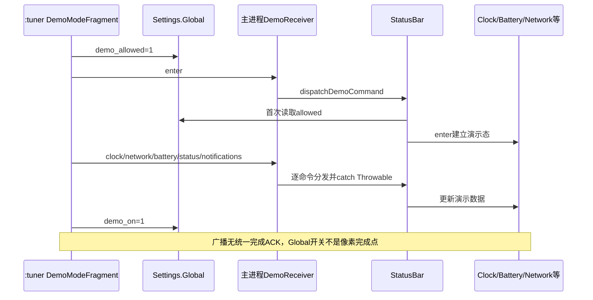

# 第 408 章 Android SystemUI TunerService：Settings.Secure 调谐、Tunable、多用户与 Demo Mode 链

> 源码基线：Android 11 / API 30 / `android-11.0.0_r48`。本章只在 macOS 阅读源码，不修改设置、不发送demo广播、不编译。目标是区分TunerService的按用户Secure键、Tunable观察网络、Tuner UI独立进程，以及Demo Mode的Global键和广播命令链。

## 1. Tuner不是一份独立数据库

TunerService主要包装`Settings.Secure`按用户读写，再把ContentObserver变化扇给进程内Tunable。值的真正持久化和权限控制仍属于SettingsProvider。

## 2. r48的两层类型

`TunerService`定义抽象读写、注册、清理API和Tunable接口，`TunerServiceImpl`实现多用户、观察者、版本升级与reset。

## 3. Dagger如何提供

`DependencyBinder`以`@Binds`把Singleton `TunerServiceImpl`绑定为TunerService；旧Dependency再暴露Lazy，很多传统View仍用`Dependency.get`取得它。

## 4. Tunable协议很小

只有`onTuningChanged(key, newValue)`，newValue允许null。业务自己解析布尔、整数、集合或结构化字符串。

## 5. parseIntegerSwitch

辅助方法把非零整数视为true；value为null或格式错误时回退defaultValue。它没有trim，包含空白的异常字符串会走默认值。

## 6. 当前用户字段

所有普通get/set都把`mCurrentUser`传给Settings.Secure的ForUser API。用户切换不是换ContentResolver，而是换userId。

## 7. Secure与Global必须分开

调谐键通常是每用户Secure；`sysui_demo_allowed`和UI的`sysui_tuner_demo_on`是Settings.Global，对全设备共享。

## 8. 三个运行位置

SettingsProvider持久化值，主SystemUI进程中的TunerService服务长期消费者，`:tuner`进程中的TunerActivity展示设置页。静态单例和Dependency不跨进程共享。

## 9. TunerActivity不是Service入口

Activity只是偏好UI；主SystemUI中的状态栏、QS、时钟等即使从未打开TunerActivity，也会注册Tunable并消费Secure设置。

## 10. 总体结构图



## 11. 构造先遍历所有用户

Impl调用UserManager.getUsers，对每个UserInfo暂时设置mCurrentUser，读取`sysui_tuner_version`并按需升级。

## 12. 版本值是每用户Secure

TUNER_VERSION通过普通get/set包装读写，因此每个用户独立记录当前版本4，不是一个全局schema版本。

## 13. 升级可能多次读取

构造代码先在if中getValue一次，再把第二次getValue结果传给upgrade。两次SettingsProvider读取之间理论上可被其他写入改变。

## 14. oldVersion小于1

它读取状态栏图标黑名单，若非null则解析集合并加入`rotate`和`headset`，再写回正在遍历的用户。

## 15. null黑名单不创建新值

旧用户没有该设置时这一步什么也不写；它不会为了升级强行创建仅含两个slot的黑名单。

## 16. oldVersion小于2

调用`setTunerEnabled(context,false)`隐藏TunerActivity。该静态方法内部以ActivityManager当前前台用户创建user Context，不使用循环中的mCurrentUser。

## 17. 多用户升级的错位边界

构造遍历所有用户时，old<2分支可能反复操作同一个当前前台用户的组件状态，而不是逐个操作正在迁移的用户。

## 18. 版本3为何没有逻辑

源码注明“3 Removed because of a revert”。版本号历史不是每个整数都对应现存迁移代码。

## 19. oldVersion小于4

捕获当时userId，并向mainHandler延迟5秒执行`clearAllFromUser(user)`，意图等消费者先注册键后再清旧Tuner数据。

## 20. 先写版本、后延迟清理

upgrade末尾立即把版本写4；清理任务5秒后才发生。进程在此间死亡会留下“已升级”版本，使延迟清理不再由下次构造补做。

## 21. 延迟清理不是事务

每用户各排一个Runnable，没有持久任务标记、成功确认或重试。版本写入与真正清键之间不存在原子性。

## 22. 清理范围来自注册表

`clearAllFromUser`遍历`mTunableLookup.keySet()`，只清当前进程曾注册过的键。它不会枚举Settings.Secure中所有`sysui_`项。

## 23. 为什么要等5秒

构造TunerService时消费者可能尚未addTunable，立即清理会看到空keySet；等待只是经验性窗口，晚于5秒注册的旧键仍不会被清。

## 24. 版本键不会被自己清掉

除非某消费者显式监听TUNER_VERSION，否则它不在lookup中，所以升级后写入的版本4通常不会被延迟clear置null。

## 25. 三个reset黑名单

QS tiles、Always-On Display、媒体恢复已成为真实用户设置，虽仍使用Tunable基础设施，但clearAll跳过它们。

## 26. “使用Tunable”等于“实验项”吗

不等于。RESET_BLACKLIST正说明观察机制也服务正式功能，不能凭addTunable调用就判断设置可安全重置。

## 27. 构造最后恢复当前用户

遍历结束后用`ActivityManager.getCurrentUser()`覆盖mCurrentUser，然后创建CurrentUserTracker并startTracking。

## 28. CurrentUserTracker共享Receiver

Tracker内部UserReceiver是进程静态单例，多个tracker共享一份ACTION_USER_SWITCHED注册，并对callback列表做快照分发。

## 29. startTracking不立即回调

首次注册时Receiver缓存当前userId，但不会主动调用TunerService.onUserSwitched。Impl已经自行初始化mCurrentUser，所以不依赖初始回放。

## 30. destroy只停用户追踪

Impl.destroy调用stopTracking，却不unregister自身ContentObserver、清lookup或取消升级Runnable。Singleton正常不销毁；测试或Dependency.destroy时要看到这个不完整生命周期。

## 31. addTunable按key执行

可变参数中的每个key都独立建集合、注册URI并立即回调初值。同一Tunable监听多个键会同步收到多次回调，顺序与keys参数一致。

## 32. lookup的结构

顶层是ConcurrentHashMap<String, Set<Tunable>>，value实际是ArraySet。顶层并发容器不使内部集合线程安全。

## 33. API没有主线程断言

Observer和常见UI消费者在main，但add/remove本身不检查Looper。跨线程调用可能与ArraySet迭代竞争，不能因ConcurrentHashMap就认定全链线程安全。

## 34. 第一个listener注册URI

key先转为`Settings.Secure.getUriFor(key)`；mListeningUris没有该URI时，才针对mCurrentUser注册ContentObserver。

## 35. 相同key只注册一次Observer

多个Tunable共享同一URI观察，SettingsProvider变化一次后由TunerService在进程内扇出，减少跨进程observer数量。

## 36. 注册后立刻同步初值

add最后直接getStringForUser，并在调用add的线程同步执行`tunable.onTuningChanged`。这不是排队到下一帧的异步初始化。

## 37. DejankUtils的作用

初值读取包在`whitelistIpcs`中，是对已知同步Binder/Provider访问的jank标记豁免，不会把调用搬到后台，也不意味着读取免费。

## 38. 重复add同一对象

ArraySet不会重复保存同一实例，但每次add仍会重新读取并同步回调初值。去重的是长期集合，不是初始化事件。

## 39. 回调可能重入

初始回调发生在add内部；消费者若在回调中再次add/remove或触发设置写入，就可能重入TunerService。源码没有统一延迟层。

## 40. 决定性源码

```java
if (!mListeningUris.containsKey(uri)) {
    mListeningUris.put(uri, key);
    mContentResolver.registerContentObserver(uri, false, mObserver, mCurrentUser);
}
String value = DejankUtils.whitelistIpcs(() -> Settings.Secure
        .getStringForUser(mContentResolver, key, mCurrentUser));
tunable.onTuningChanged(key, value);
```

先建立观察，再读取和回放，可缩小“读完旧值后才开始观察”造成的丢变化窗口。

## 41. removeTunable做什么

它遍历所有key集合并移除该对象；LeakDetector启用时也从总集合移除。无需调用方记住原来注册了哪些key。

## 42. remove不会删除空key

空ArraySet仍留在lookup，URI仍留在mListeningUris，ContentObserver也继续注册。注册过的键集合只增长不缩小。

## 43. 空key变化的成本

Observer仍会收到事件，reloadSetting拿到空集合并完成一次Settings读取，只是没有业务回调。

## 44. 空key影响clearAll

即使所有Tunable都移除，历史key仍在lookup，因此clearAll仍会把它置null。reset范围是“曾注册”，不是“当前有人监听”。

## 45. reloadSetting如何定位key

先由URI查mListeningUris得到key，再取得对应集合，读取当前用户Secure字符串并逐个同步回调。

## 46. 变化回调没有快照

源码直接for-each当前Set。某个Tunable在回调中增删同集合可能影响遍历，甚至引发并发修改行为；消费者应避免结构性重入。

## 47. listener异常没有隔离

一个onTuningChanged抛RuntimeException会中断本轮后续Tunable；Observer在main Handler上运行，还可能造成SystemUI主线程崩溃。

## 48. selfChange参数被忽略

Observer不区分自身setValue还是外部Settings写入，只要user和URI匹配就重读并分发。

## 49. 写入完成不等回调完成

setValue调用Settings.Secure.put返回后，ContentObserver通知仍是独立异步链；调用者不应假设所有Tunable已更新。

## 50. 设置变化时序图



## 51. Observer运行线程

构造时显式传`new Handler(Looper.getMainLooper())`，因此Provider分发最终在SystemUI主线程执行reload和业务回调。

## 52. 新版集合URI回调

r48覆盖`onChange(boolean, Collection<Uri>, int flags, int userId)`，逐URI reload；不是只依赖旧的单URI或无URI重载。

## 53. 用户过滤条件

它比较通知userId与`ActivityManager.getCurrentUser()`，不是直接比较mCurrentUser。通常二者一致，但切换瞬间存在时序窗口。

## 54. reload使用哪个user

过滤通过后实际读取仍用mCurrentUser。若ActivityManager已切新用户而Tracker回调尚未来，理论上可能用旧mCurrentUser读取。

## 55. 用户切换回调顺序

先设置mCurrentUser=newUserId，再`reloadAll()`把所有已知key的新用户值同步给Tunable，最后`reregisterAll()`把ContentObserver改注册到新用户。

## 56. 为什么先reload

切换发生时必须立即把UI从旧用户值收敛到新用户当前值，不能等待下一次Settings变化才更新。

## 57. reloadAll也无快照

它直接遍历ConcurrentHashMap keySet和各ArraySet；顶层弱一致不代表内部value安全，回调增删仍需谨慎。

## 58. reregisterAll先总注销

只要mListeningUris非空，就对mObserver执行一次unregister，再按全部URI和新mCurrentUser逐个注册。

## 59. 重注册窗口

reload完成到各URI重新注册之间，设置若再次变化可能没有observer事件；已读到切换时快照，但窗口内后续写入存在漏通知风险。

## 60. 无监听键时快速返回

mListeningUris为空则reregisterAll不做任何事。用户追踪仍继续，为未来首次add使用正确mCurrentUser。

## 61. Secure键的典型消费者

QS tile列表、亮度条显示、快速设置格数、状态栏icon blacklist、时钟秒针、运营商名、旁路/媒体等都复用这套回调。

## 62. 字符串协议由消费者定义

TunerService不校验范围、schema或转义；非法值通常由各消费者default/fallback处理，不同消费者的健壮性可能不同。

## 63. getValue重载

字符串无默认版可返回null；字符串默认版仅在null时回退；int版使用Settings默认值并处理不存在或解析失败的Provider语义。

## 64. setValue的返回被丢弃

底层putString/putInt返回boolean，但抽象API是void，调用者无法从TunerService直接判断Provider写入是否成功。

## 65. clearAll的第一步是Global

不论传入哪个user，先把`DemoMode.DEMO_MODE_ALLOWED`写null。Global是设备级，因此清一个后台用户也影响全设备demo许可。

## 66. clearAll的第二步是exit广播

它发送ACTION_DEMO并携带command=exit，要求主StatusBar退出演示状态；没有等待接收和UI恢复完成。

## 67. clearAll的第三步是Secure键

遍历lookup，跳过RESET_BLACKLIST，其余用`putStringForUser(...,null,user)`删除目标用户值。

## 68. 清理不是单次批事务

Global写、demo广播、每个Secure put逐项发生，中途异常或进程死亡可留下部分清理结果，观察者也会逐项触发。

## 69. ACTION_CLEAR入口

Manifest中的`TunerService$ClearReceiver`仅接CLEAR_TUNER且exported=false；收到后从主进程Dependency取得TunerService并clearAll当前用户。

## 70. 为什么重置UI要发广播

TunerActivity运行在`:tuner`进程，不能直接调用主进程内单例。`showResetRequest`确认后发应用内隐式广播，让主SystemUI按自己的lookup清理。

## 71. reset还做两件UI工作

它为当前用户禁用TunerActivity，并把`seen_tuner_warning`置0，使下次重新启用时再次展示风险提示。

## 72. 组件启用是按用户的

静态userContext以ActivityManager当前用户创建包Context，再通过其PackageManager设置TunerActivity组件状态，且DONT_KILL_APP不杀现有进程。

## 73. isTunerEnabled很严格

只有组件状态显式等于ENABLED才返回true；Manifest里TunerActivity默认enabled=false，所以DEFAULT正确地被视为未开启。

## 74. TunerActivity运行在独立进程

Manifest指定`:tuner`，打开偏好页不会把Activity对象放进主SystemUI。它仍共享同一UID和Settings权限，但堆、静态字段、Dependency实例各自独立。

## 75. TunerActivity选哪个Fragment

Intent action是`com.android.settings.action.DEMO_MODE`时展示DemoModeFragment，否则展示TunerFragment。

## 76. 普通Tuner页面的动态裁剪

没有历史插件就隐藏plugins项，不支持AOD就隐藏doze项，非debuggable构建移除nav bar、lockscreen、PIP等debug-only页面。

## 77. 警告对话框

当前用户Secure `seen_tuner_warning`为0时弹警告；点确认写1。它只是知情提示，不改变TunerService准入或设置权限。

## 78. TunerActivity销毁的特殊动作

onDestroy调用`Dependency.destroy(FragmentService.class, destroyAll)`，影响的是`:tuner`进程自己的Dependency缓存和Fragment hosts，不是主SystemUI那份单例。

## 79. DemoMode不属于Secure调谐主链

DemoModeFragment直接观察/写Settings.Global并发送ACTION_DEMO，没有通过TunerService.addTunable。它与Tuner UI相邻，但数据和通知机制不同。

## 80. 两个Global键

`sysui_demo_allowed`表示允许命令，`sysui_tuner_demo_on`只是偏好页“正在展示”开关状态。StatusBar真实运行态另存在内存boolean `mDemoMode`。

## 81. UI开关不是真实状态证明

进程重启会丢mDemoMode，而Global DEMO_MODE_ON可能仍为1；重新打开页面能显示开，但不证明当前StatusBar仍处于demo。

## 82. Demo Receiver的权限

StatusBar按UserHandle.ALL注册ACTION_DEMO并要求发送者拥有`android.permission.DUMP`，普通应用不能合法伪造演示命令。

## 83. Receiver线程和错误边界

未指定Handler，回调在主线程；它规范化command并用try/catch(Throwable)包住dispatch，单条恶意/错误demo命令通常只记日志，不击穿SystemUI。

## 84. allowed的缓存边界

StatusBar仅当`mDemoModeAllowed`为false时读取Global；一旦读到true就缓存为true，Global后来改0不会主动把字段复位。

## 85. 禁用开关如何尽量收敛

DemoModeFragment关闭allowed前先把on开关取消并发送exit，再写Global 0。这样正常UI路径先退出，但缓存true意味着未来有DUMP权限的命令仍可能被接受直到进程重启。

## 86. 自动enter

收到非enter/exit命令且mDemoMode=false时，StatusBar递归dispatch enter，然后继续处理原命令。调用者可以只发clock等命令而隐式进入。

## 87. enter和exit的扇出

modeChange会通知Volume、Clock View、Battery、Icon、Network、Notifications和Operator等相关对象，让各模块建立或清除自己的演示状态。

## 88. 命令是松散Bundle协议

clock读hhmm，network读wifi/mobile/level/datatype等，battery读level/plugged；DemoMode接口不定义强类型参数，各实现自行解析缺省和非法值。

## 89. startDemoMode发送多条广播

依次enter、clock、network、network fully、battery、status hide和notifications hide，最后把DEMO_MODE_ON写1。sendBroadcast返回不代表所有主线程视觉更新已完成。

## 90. Intent被复用

Fragment不断覆盖command并追加extra，旧extra会保留到后续广播；消费者按当前命令读取关心字段，协议依赖忽略无关extra。

## 91. Demo Mode时序图



## 92. demo时间不是永远10:10

代码默认1010，但尝试取Android版本major并格式化为`major%24:00`；Android 11通常显示11:00。注释里的经典10:10只是fallback历史。

## 93. network为何发两次

先用sims=1等数据让SIM控制对象存在，再带fully=true发送同一network命令，源码注释明确要求这个顺序。

## 94. status hide如何构造

循环volume、bluetooth、location等固定slot，每次向复用Intent追加`icon=hide`，最后只发送一次status广播。

## 95. stopDemoMode

发送command=exit后立刻把Global DEMO_MODE_ON写0。退出广播尚未处理完时，偏好开关已可能显示off。

## 96. clearAll先撤allowed再exit是否可行

若StatusBar曾接受demo，mDemoModeAllowed缓存已true，exit仍会通过；若进程刚重启，mDemoMode本来也为false。这个顺序依赖当前实现的内存状态。

## 97. bars命令

StatusBar把opaque、translucent、semi-transparent、transparent、warning映射到bar mode，再驱动shade与导航栏transition；未知字符串不处理。

## 98. notifications命令

只改变状态栏notification icon area可见性，不会删除NotificationManager中的通知或改变通知数据库。

## 99. demo是显示覆盖层

真实电量、网络和时间源仍在后台变化，各模块暂时展示命令给的模拟状态；exit要让每个模块恢复真实源。

## 100. 多显示边界

StatusBar这份receiver和字段属于具体主StatusBar实例，部分命令还显式使用mDisplayId导航栏。不要默认一条demo命令对所有display上的全部SystemUI镜像完全一致。

## 101. 多用户边界

Receiver注册UserHandle.ALL，但allowed和demo_on是Global；命令来源用户与当前StatusBar显示用户没有按用户Tuner值那样的天然隔离。

## 102. Secure观察与Demo观察不同

TunerService的Observer按userId过滤并切换注册；DemoModeFragment的Global observer无user参数，StatusBar又靠广播和内存字段驱动。

## 103. 诊断Tunable不生效

依次确认写入的user、key URI、lookup是否注册、observer当前注册user、onChange过滤、getString结果、listener解析和UI刷新，不能只看Settings值。

## 104. 诊断用户切换串值

记录ActivityManager当前user、mCurrentUser变化、reloadAll与reregisterAll顺序；重点寻找切换窗口内写入和未移除历史observer键。

## 105. 诊断reset不彻底

检查目标key是否曾在主进程lookup注册、是否命中RESET_BLACKLIST、清的是哪个user，以及写null是否成功。clearAll从不承诺清遍所有Secure设置。

## 106. 诊断demo开关与画面不一致

同时检查两个Global键、StatusBar进程是否重启、mDemoModeAllowed缓存、mDemoMode内存态、ACTION_DEMO权限/日志和各子模块是否收到exit。

## 107. 性能边界

初始add同步跨Provider读取；变化回调在main逐listener执行；大量重活会阻塞SystemUI。消费者应在回调里快速解析/更新或自行调度。

## 108. 内存边界

忘记remove会被lookup强持有；即使remove，空key、URI和observer不会收缩。LeakDetector只在启用的构建中跟踪总Tunable集合。

## 109. macOS推荐阅读顺序

先读TunerService API和Impl数据结构，再读一个简单消费者；随后读CurrentUserTracker、Manifest进程声明、TunerFragment，最后单独追DemoModeFragment→StatusBar。

## 110. 本章最小心智模型

TunerService是“按用户Settings.Secure观察与扇出器”；TunerActivity是可隐藏的独立进程UI；Demo Mode是“Global许可/界面标记+特权广播+主进程内存态”。

## 111. 阅读前自测

若能解释remove后为何仍观察URI、版本4升级为何可能漏清键、用户切换为何先reload后重注册、demo_on为何不能证明画面状态，就掌握了关键边界。

## 112. macOS只读练习一：追一个Tunable

选Clock秒针或QS亮度条，从addTunable、初值回调、Secure写入、ContentObserver到UI更新画线程图，并标出null/非法值fallback。

## 113. macOS只读练习二：推演用户切换竞态

假设user0切user10，在reloadAll前、reload与reregister之间、重注册后各写一次同key，逐次判断observer事件、实际读取user和最终UI。

## 114. macOS只读练习三：审计clearAll

列出当前活动键、历史空键、从未注册键和三个blacklist键，对user0与user10分别推演Global demo、exit广播、Secure删除和回调结果。

## 115. macOS只读练习四：追Demo Mode

从DemoModeFragment开启到StatusBar扇出，再模拟SystemUI进程重启、Global仍为1和关闭allowed，解释UI switch、mDemoMode与真实图标为何可能不同步。

## 116. 易错点一：TunerService保存所有调谐配置

错误。值在SettingsProvider；TunerService只记本进程曾监听的key和listener，clearAll也只遍历这份历史注册表。

## 117. 易错点二：removeTunable会注销对应Observer

错误。它只从各ArraySet移除对象，空key、URI和ContentObserver注册都保留到进程结束或用户切换总重注册。

## 118. 易错点三：Demo Mode是普通Secure Tunable

错误。r48主要由两个Global键、带DUMP权限的ACTION_DEMO和StatusBar内存态组成，未走TunerService Tunable回调。

## 119. 复读源码后的修正

复读后补正`:tuner`与主SystemUI各有自己的静态对象；upgrade先写版本再排5秒非持久清理，old<2组件操作使用前台user而非循环user；remove不收缩URI；Observer过滤ActivityManager user却读取mCurrentUser；Demo allowed一旦true会被StatusBar缓存，demo_on也只是UI标记。结论均限定r48。

## 120. 本章结论

Tuner链的难点不在Settings API，而在用户维度、同步初值、主线程扇出、只增长的观察表和非事务reset；Demo Mode又是相邻但不同的Global+广播状态机。下一章进入SystemUI多用户进程、UserSwitcherController、UserTracker与切换清理，系统化整理“当前用户”在各组件中的含义。
