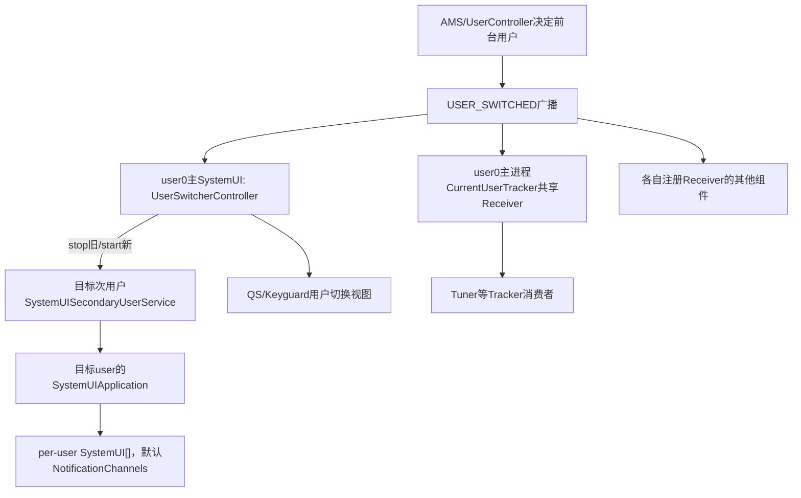
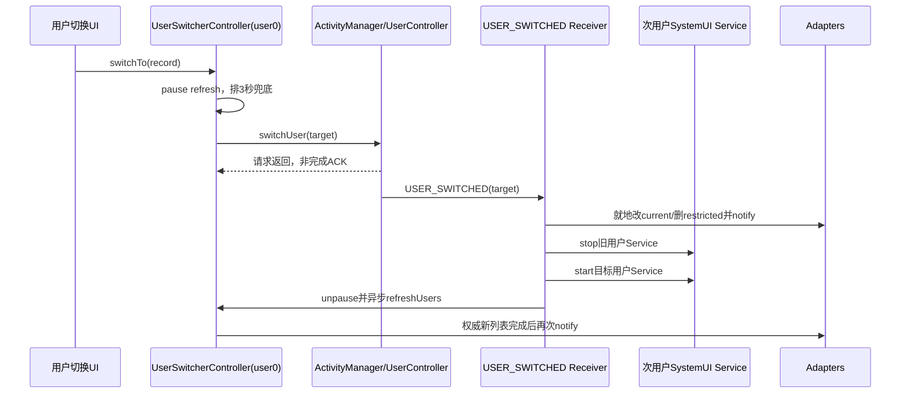
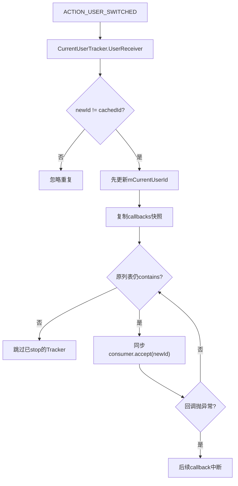

# 第 409 章 Android SystemUI 多用户进程：UserSwitcherController、CurrentUserTracker 与切换清理链

> 源码基线：Android 11 / API 30 / `android-11.0.0_r48`。本章只在 macOS 阅读源码，不创建、删除或切换真实用户，不编译。重点区分system user SystemUI进程、当前前台用户、次用户自己的SystemUI进程、用户列表模型和各组件用户回调。

## 1. “SystemUI属于哪个用户”有两层答案

system user的主SystemUI长期运行完整组件；当前非system用户还可拥有自己UID空间下的SystemUI进程，只启动per-user组件。前台用户变化不等于主SystemUI进程换了user。

## 2. system user不等于current user

很多Controller对象始终活在user0进程，却必须用`ActivityManager.getCurrentUser()`处理user10等前台用户的数据。把Context user当成前台user会产生串用户错误。

## 3. 用户切换不是一次回调

AMS先执行用户状态机和窗口切换，再发USER_SWITCHED；SystemUI中用户列表、通知、主题、媒体、Tuner、导航等各自收敛，没有一个全局事务把它们同时切完。

## 4. 本章三类核心对象

`UserSwitcherController`生成可展示/可操作用户模型；`CurrentUserTracker`复用USER_SWITCHED广播；`SystemUISecondaryUserService`保证当前次用户的SystemUI进程及per-user模块存在。

## 5. r48没有统一UserTracker接口

这一版主要类名是`CurrentUserTracker`，不少组件仍自己注册USER_SWITCHED。后续版本的UserTracker API不能直接套到r48。

## 6. UserSwitcherController的进程位置

它是system user主SystemUI中的Singleton，查询所有用户并驱动QS/Keyguard切换UI，不会为每个次用户各维护一张全局列表。

## 7. 次用户服务是什么

`SystemUISecondaryUserService`只是started Service，onCreate调用Application的`startSecondaryUserServicesIfNeeded()`，onBind返回null。

## 8. 默认per-user数组很小

r48基础config里只有`NotificationChannels`；产品overlay可替换数组。不要误以为次用户会启动StatusBar等完整主数组。

## 9. 冒号子进程仍被排除

SystemUIApplication发现进程名是包名加冒号（如`:tuner`、`:screenshot`）就return，不把它误当次用户主进程启动per-user数组。

## 10. 多进程多用户结构图



## 11. Controller构造的监听面

它监听USER_ADDED、REMOVED、INFO_CHANGED、SWITCHED、STOPPED、UNLOCKED，观察三个Global设置，监听Keyguard状态和电话状态，然后异步refreshUsers。

## 12. 广播注册为system user

通过BroadcastDispatcher以UserHandle.SYSTEM注册，因为Controller属于user0主进程并管理全设备用户列表；事件中的EXTRA_USER_HANDLE表示被影响用户。

## 13. 一个空IntentFilter

构造中还用SELF权限和空filter再次register同一receiver；空filter没有action，正常不会匹配任何广播，是r48遗留的无效注册形态。

## 14. 三个Global设置

simple switcher、add users when locked、allow switching when system user locked都会触发刷新；onChange直接读取前两个，第三个由UserManager switchability判断间接体现。

## 15. 初值通过手调Observer

注册设置observer后立即调用`mSettingsObserver.onChange(false)`，同步建立simple/addWhenLocked初态并发起一次refresh，构造末尾又refresh一次。

## 16. 初始可能并发两次refresh

两次AsyncTask没有合并或generation标记；若先发任务较晚完成，可能用较旧快照覆盖后发任务结果。

## 17. refresh先保存头像缓存

主线程从旧mUsers提取未被force的Bitmap，交给后台任务复用；目标用户头像变化时用force id跳过缓存重取。

## 18. force请求会累积

即使refresh处于pause，forcePictureLoadForId也先写SparseBooleanArray，待unpause时使用，避免切换窗口吞掉头像刷新意图。

## 19. force ALL的语义

密度或字体变化传USER_ALL，使所有旧Bitmap不复用，再按新资源尺寸缩放头像。

## 20. refresh后台工作

调用`UserManager.getUsers(true)`取非dying用户，读取当前前台user和switchability，加载头像，构造真实用户、guest与add-user占位记录。

## 21. AsyncTask的线程切换

doInBackground做UserManager/Binder与Bitmap工作；onPostExecute回主线程替换整个mUsers并notifyAdapters。

## 22. 没有任务序号防陈旧结果

多个refresh重叠时，完成顺序未必等于发起顺序；任何非null结果都会覆盖mUsers。诊断列表回退要考虑旧AsyncTask晚到。

## 23. UserRecord不是只有UserInfo

它还记录picture、guest、current、addUser placeholder、restricted、admin restriction和switchToEnabled；null info在guest/add占位中是合法状态。

## 24. 普通用户过滤

只加入enabled且`supportsSwitchToByUser()`的非guest用户；managed profile等不一定作为独立可切换卡片出现。

## 25. guest被单独追加

找到实际guest时先暂存guestRecord，普通用户循环结束后再追加。没有guest且允许创建时添加info=null的“新建访客”占位。

## 26. add user也是占位

允许创建且未达到数量上限时，最后追加isAddUser=true、info=null的记录，点击后走确认对话框而非switchUser。

## 27. 创建资格的两条路

当前用户为admin/system且system无base DISALLOW_ADD_USER，或全局addUsersWhenLocked允许且system无base restriction，才有创建入口。

## 28. restricted的含义

占位在`addUsersWhenLocked=false`时标为restricted，锁屏安全且不可解锁时Adapter会过滤；它与DevicePolicy管理员禁用字段是两套状态。

## 29. admin-only restriction

若DISALLOW_ADD_USER由管理员强制但不是base restriction，记录仍可存在并标`isDisabledByAdmin/enforcedAdmin`，UI可引导查看管理员原因。

## 30. switchToEnabled来自前台用户

UserManager检查当前前台user的switchability；不可切换时其他记录禁用，但当前普通用户仍可保持enabled视觉语义，guest记录按canSwitchUsers处理。

## 31. 电话状态为何触发刷新

通话可影响UserManager的切换资格。PhoneStateListener只在状态真正变化时refresh，不直接自己决定禁用规则。

## 32. 主叫线程没有统一断言

Controller主要由main Handler、BroadcastDispatcher和AsyncTask post result驱动；UserManager重活在后台。但公开switch/remove方法默认UI调用，源码不逐个assert main。

## 33. pauseRefresh的目的

发起switch/logout后暂缓重建列表，避免AMS尚未完成切换时按旧currentId刷新造成闪动。

## 34. pause最长3秒

首次pause排mUnpauseRefreshUsers三秒；重复pause不会延长。若USER_SWITCHED先到，它会主动run并取消timeout。

## 35. Binder失败也会等timeout

switchUser抛RemoteException时catch只记日志，pause仍为true，直到3秒Runnable恢复刷新。

## 36. pause不是阻止广播处理

USER_SWITCHED仍会先就地修改现有mUsers的isCurrent、尝试清restricted、通知Adapter，并启停次用户Service；但当前restricted占位因info=null会先continue，实际清理边界见后文。

## 37. 发起切换的真正入口

`switchToUserId`先pause，再调用`ActivityManager.getService().switchUser(id)`；返回值未用于确认，SystemUI以之后的USER_SWITCHED作为状态收敛信号。

## 38. “点击完成”不是“切换完成”

Binder请求被接受后，用户解锁、进程启动、窗口切换、各SystemUI listener刷新仍可继续。UI不应把方法返回当成完成ACK。

## 39. switchTo(UserRecord)分流

新guest占位先createGuest；add-user占位弹dialog；点击当前guest弹退出dialog；从ephemeral guest切别人也先走退出确认；其余才switchUser。

## 40. 决定性切换代码

```java
protected void switchToUserId(int id) {
    try {
        pauseRefreshUsers();
        ActivityManager.getService().switchUser(id);
    } catch (RemoteException e) {
        Log.e(TAG, "Couldn't switch user.", e);
    }
}
```

代码没有等待USER_SWITCHED、USER_UNLOCKED或目标SystemUI服务启动，所以这只是请求边界。

## 41. USER_SWITCHED先处理对话框

若退出guest dialog仍显示则取消并清引用，防止切换后旧用户对话框继续覆盖新用户界面。

## 42. 就地更新isCurrent

遍历当前mUsers，为每个真实record用`copyWithIsCurrent`替换；不等待后台重查就让Adapter快速显示新current。

## 43. lastNonGuest的更新条件

只有新current记录已存在于mUsers且非guest时才更新。列表陈旧或目标缺失会保留旧值，之后退出guest仍会再次验证目标UserInfo。

## 44. restricted立即移除

注释意图是在新用户不是admin时立刻删restricted项，避免AsyncTask慢时让无权入口短暂可点；但r48构造的restricted guest/add占位都`info=null`，循环更早的continue会把它们跳过。

## 45. 边遍历边remove的处理

若未来或产品代码出现`info!=null && isRestricted`记录，删除后虽`i--`，N仍是切换前final大小；循环继续以旧N为上限，必须核对ArrayList缩短后的尾部访问。

## 46. r48的潜在越界缺陷

源码删除record后没有同步减N，循环条件仍`i < N`；若该分支确实删除至少一项，后续`mUsers.get(i)`会在尾部越界。当前基础构建因info-null提前跳过而通常不触发，这是潜伏在不可达/扩展路径后的缺陷。

## 47. notify发生在完整refresh前

Adapter先看到只更新current标记、restricted占位可能仍保留的旧列表；随后unpause启动AsyncTask，完成后才得到按新用户权限重建的权威列表，属于两阶段UI收敛。

## 48. 先停旧次用户Service

mSecondaryUser非NULL时用stopServiceAsUser停止旧用户的SystemUISecondaryUserService并清字段。

## 49. 再启新次用户Service

新UserInfo存在且不是system user时startServiceAsUser，并立即把mSecondaryUser记为该id；没有等待Service.onCreate成功。

## 50. 切换主时序图



## 51. Service启动的真实作用

注释明确“purely to ensure a persistent SystemUI application is created for that user”。它是进程保活/点火锚点，不承载业务Binder。

## 52. 目标Application也会主动启动per-user数组

非system用户主进程的SystemUIApplication.onCreate会调用startSecondaryUserServicesIfNeeded；Service.onCreate再调用一次时由mServicesStarted guard变成no-op。

## 53. stopService不逐对象清理

停止旧started Service不会逐个调用per-user SystemUI对象的自定义destroy；若进程无其他组件，AMS以后可回收整个进程，清理依赖进程生命周期。

## 54. mSecondaryUser只是内存账

主SystemUI重启后字段回到USER_NULL，不会主动发现并stop此前记录的旧Service；它只从下一次USER_SWITCHED开始建立新账。

## 55. startService成功也不是模块完成

Service创建、Application根图、per-user数组start/post-init和NotificationChannels创建仍分阶段，mSecondaryUser赋值只表示请求已发。

## 56. system user切回路径

先stop旧secondary Service；新user是0时不start任何secondary Service，完整主SystemUI原本就一直运行。

## 57. USER_UNLOCKED的特殊过滤

Controller只因system user解锁而refresh；非system user unlock广播直接return。普通前台标记在USER_SWITCHED已处理。

## 58. INFO_CHANGED强制头像

从extra取changed userId传refresh，使旧Bitmap不复用；名字和其他字段也随全列表重查更新。

## 59. ADDED/REMOVED/STOPPED

这些分支没有专门逻辑，统一落到refreshUsers。STOPPED可能改变用户可见/可切换集合。

## 60. adapter以弱引用登记

Controller不强持有BaseUserAdapter；notify时倒序遍历，活对象notifyDataSetChanged，已GC弱引用就从列表移除。

## 61. Adapter没有显式remove

弱引用避免View销毁后必须注销，但垃圾回收前仍可能收到通知。它不是精确生命周期信号。

## 62. Keyguard过滤

安全锁屏显示、凭据安全且不可dismiss时，restricted记录被隐藏；Keyguard状态改变只notify Adapter，不重查UserManager。

## 63. Keyguard消失时延后一拍

为减少转场成本，not showing时用Handler post通知；showing时立即通知。UI短暂状态由转场性能权衡决定。

## 64. getUserCount与getCount不同

安全Keyguard下前者额外跳过guest后计数，后者只在遇到restricted时停止；调用方必须确认想要“用户数”还是Adapter行数。

## 65. 过滤依赖记录顺序

遇到第一个restricted就break，假设restricted占位位于末尾。若未来产品改变record排序，前方正常用户也可能被隐藏。

## 66. current user name的假设

`getCurrentUserName`直接取mUsers[0]，没有搜索isCurrent。若UserManager返回顺序未把current放首位，名称可能不是前台用户，是需用dump验证的边界。

## 67. Fullscreen开关的维度

先读当前Context对应的Settings.System `enable_fullscreen_user_switcher`覆盖值，否则用资源bool。注释要求重启SystemUI/设备，方法本身没有observer。

## 68. simple switcher是Global

`lockscreenSimpleUserSwitcher`默认来自framework资源，ContentObserver变化会刷新列表和Adapter。

## 69. add users when locked是Global

它扩大“任何人可创建”的UI入口，但仍受system base restriction和UserManager数量上限；不等于绕过DPM/UserManager检查。

## 70. allow switching when system locked

Observer虽监听它却不存字段，refresh中的getUserSwitchability根据系统政策重新计算canSwitchUsers。

## 71. 添加普通用户

确认且非monkey后同步调用createUser、生成默认头像并setUserIcon，然后发起switch。创建与切换之间无回滚事务。

## 72. 添加用户在主线程吗

AddUserDialog.onClick在主线程直接调用UserManager创建与设置头像，可能有Binder/磁盘成本；r48没有像refresh那样搬到AsyncTask。

## 73. 删除当前用户的顺序

removeUserId若目标正current，先发起切到system，紧接着调用removeUser，没有等待USER_SWITCHED；系统服务必须处理这种请求竞态。

## 74. exitGuest也不等待

先switchToUserId(target)，随后立即removeUser(guest)。切换请求失败时源码也没有据返回值阻止删除。

## 75. ephemeral guest离开

从当前ephemeral guest点其他用户不会直接切，先弹退出guest dialog，并把目标record.resolveId作为退出目标。

## 76. guest placeholder的resolveId

guest或info=null返回USER_NULL；若从ephemeral guest点“新访客”类记录，目标可能无效，实际UI通常通过可用record约束避免。

## 77. 非ephemeral guest续用提示

只有系统guest不是ephemeral时注册GuestResumeSessionReceiver；首次进入写每guest的Settings.System标志，后续进入询问继续还是清空会话。

## 78. Guest标志是每用户System设置

键`systemui.guest_has_logged_in`按guest userId保存；新guest得到新id，因此初始为0。

## 79. wipe前重新核对身份

Receiver向AMS取current UserInfo，要求id等于对话框user且isGuest，避免对话框晚到后误删别的用户。

## 80. wipe先markForDeletion

标记成功后才createGuest，使旧guest不再占有效guest名额；失败就保持原会话。

## 81. 创建新guest成功路径

请求switch到新guest，再remove旧guest，同样不等待切换完成；异常只捕RemoteException。

## 82. 创建失败路径

切回system、删除旧guest并WMS lockNow，避免继续留在已标记删除的guest；三个动作也不是原子事务。

## 83. CurrentUserTracker的共享模型

每个Tracker把`this::onUserSwitched` Consumer交给进程静态UserReceiver；第一位tracker才向BroadcastDispatcher注册，最后一位移除时注销。

## 84. callback是强引用

共享Receiver的ArrayList强持有Consumer，忘记stopTracking会连同Tracker/宿主泄漏；它不像UserSwitcher Adapter使用WeakReference。

## 85. startTracking去重

相同Consumer对象不存在时才加入。字段mCallback固定保存method reference，使同一Tracker重复start不会重复登记。

## 86. 首次注册只缓存current id

它调用ActivityManager.getCurrentUser设置mCurrentUserId，但不立即通知callback。消费者构造时必须自行读取初态。

## 87. 用户广播去重

新id与缓存相同就不分发；只有真正变化才更新缓存并遍历callback快照。

## 88. 快照加contains检查

callback执行中可以stop另一个tracker；被从原列表移除者即使在快照里也会跳过。执行中新增者等下次切换。

## 89. callback异常未隔离

一个Consumer抛异常会阻断后续CurrentUserTracker，并可能击穿BroadcastDispatcher业务执行线程；各消费者必须快速且稳健。

## 90. 最后注销是异步链

BroadcastDispatcher.unregisterReceiver本身排后台消息；UserReceiver却立即把mReceiverRegistered=false。紧接着重新add可能与旧注销排队形成竞态。

## 91. Tracker分发图



## 92. Tracker不是全局唯一真相

StatusBar主题、Notifications、Navigation、Controls等仍可能各注册自己的Receiver，回调顺序取决于注册与executor，不由CurrentUserTracker统一排序。

## 93. UserInfoController是另一张账

它单独监听USER_SWITCHED和profile/info变化，异步查询当前user头像、名字、账户，再通知自己的listener；不要与UserSwitcherController列表混为一份缓存。

## 94. UserInfo任务会cancel旧任务

reload先cancel(false)旧AsyncTask再创建新任务，但cancel(false)不打断已运行代码；旧onPostExecute通常因cancel转onCancelled而不提交，比UserSwitcher列表多一层陈旧结果防护。

## 95. 单用户设备名称来源不同

UserInfoController在用户数<=1时尝试读Contacts Profile display name，否则用UserInfo.name；用户切换器列表始终以UserInfo.name展示普通用户。

## 96. 每用户Context用于什么

UserInfoController为当前user创建`android`包Context，用其Resources/ContentResolver读用户profile；但UserManager仍从主mContext取得。

## 97. 用户切换清理不是destroy all

长寿Controller通常保留对象，只换current user字段、重注册observer、清缓存或重载数据；次用户专属进程则可通过stop Service后进程回收整体清理。

## 98. 必须分类缓存的user维度

单值current-user缓存需在switch时替换；按user map可保留但键必须正确；Global数据无需切；system-user管理账与foreground-user显示账不能混用。

## 99. 广播到达不等用户解锁

USER_SWITCHED表示前台归属切换，目标credential-encrypted数据可能仍锁定；依赖CE的组件还需USER_UNLOCKED或Direct Boot处理。

## 100. profile不等full user切换

managed profile启停/解锁通常不成为ActivityManager current user，却会改变通知、头像badge、可见profile集合；需监听profile相关事件而非只靠USER_SWITCHED。

## 101. dump能看到什么

UserSwitcherController打印lastNonGuest、当前mUsers每条toString和simple标志；不打印pause、secondaryUser、force头像、设置、AsyncTask代数或Adapter数。

## 102. UserRecord dump的价值

可看到name/id、guest/add/current/picture/restricted/admin/switchEnabled，能判断“后端无记录”还是“记录存在但Adapter过滤/禁用”。

## 103. 诊断切换按钮无效

先查record switchToEnabled与admin/restricted，再查switchUser Binder异常、3秒pause、USER_SWITCHED是否到达，不要直接归因目标进程未启动。

## 104. 诊断列表旧头像

查INFO_CHANGED extra user、force flag是否在pause累积、并发AsyncTask完成顺序、Bitmap复用和density触发USER_ALL。

## 105. 诊断次用户通知渠道缺失

确认目标user SystemUI进程、SecondaryUserService onCreate、per-user数组overlay内容、mServicesStarted以及该用户解锁/资源状态。

## 106. 诊断旧用户仍有SystemUI进程

stopService只是去掉started锚点，进程还可能有其他组件；检查进程/Service实际状态，不能由mSecondaryUser字段推断已被杀。

## 107. 安全边界

UI记录是否可点只是第一层，最终UserManager/AMS仍检查限制、通话和用户状态。不要把灰色按钮当唯一授权控制。

## 108. 性能边界

头像/UserManager查询放AsyncTask，但AddUser和部分ActivityManager调用仍在main；频繁重叠refresh还可能浪费工作并造成结果倒序。

## 109. macOS阅读顺序

先读SystemUIApplication与per-user config，再读SecondaryUserService；随后读UserSwitcher refresh/switch Receiver，最后对比CurrentUserTracker、GuestResume和UserInfoController。

## 110. 本章最小心智模型

user0主SystemUI是控制面，当前次用户SystemUI是小型per-user数据面；USER_SWITCHED是多组件收敛触发器，UserSwitcher列表只是其中一张异步快照。

## 111. 阅读前自测

若能说明主Context user为何不等前台user、switchUser返回为何不算完成、stop secondary Service为何不等进程已死、Tracker为何不能代表全部消费者，就抓住了核心。

## 112. macOS只读练习一：画双进程切换链

推演user0→user10→user0，列出主SystemUI一直存在、旧/新SecondaryUserService启停、目标Application per-user数组和各阶段完成点。

## 113. macOS只读练习二：制造陈旧refresh

假设任务A查询旧用户后阻塞，任务B在USER_SWITCHED后先完成，再让A完成；写出mUsers结果、Adapter两次画面及可加入的generation修复思路。

## 114. macOS只读练习三：审计guest退出

分别推演persistent guest继续/清空、ephemeral guest点普通用户、新guest创建失败和switchUser失败，标注mark、create、switch、remove、lock的非事务顺序。

## 115. macOS只读练习四：比较三种用户监听

对比UserSwitcherController Receiver、CurrentUserTracker共享Receiver、UserInfoController独立Receiver，列出注册user、初始回放、线程、缓存、注销和异常隔离。

## 116. 易错点一：切换用户会重启同一个SystemUI进程

错误。user0完整主进程通常持续运行，前台次用户还可有自己的SystemUI进程；主Controller切换的是显示账和次用户Service锚点。

## 117. 易错点二：USER_SWITCHED后所有组件已切完

错误。它只是各组件开始/继续收敛的事件，异步列表、Settings重注册、CE解锁、进程和UI刷新都有独立时间线。

## 118. 易错点三：CurrentUserTracker统一管理全部用户回调

错误。r48仍有大量独立Receiver和专用Controller；Tracker只复用一部分消费者，且不提供初始callback或异常隔离。

## 119. 复读源码后的修正

复读后改用r48真实CurrentUserTracker而非后续UserTracker；补出UserSwitcher在USER_SWITCHED中启停次用户Service、refresh无generation、pause只3秒、remove/guest退出不等切换ACK。还修正restricted占位因info-null提前continue而未被立即删除；若扩展路径让删除分支可达，固定final N又会造成潜在越界。另区分Adapter弱引用与Tracker强引用、USER_SWITCHED与USER_UNLOCKED。

## 120. 本章结论

SystemUI多用户设计是“user0控制面长期存在、次用户按需小进程、多个组件各自收敛”的分布式状态机。可靠阅读必须为每份Context、缓存、设置、广播和进程标出userId与完成边界。下一章进入ScreenLifecycle、WakefulnessLifecycle和BootCompleteCache，比较三类观察者状态机的回放与异常边界。
