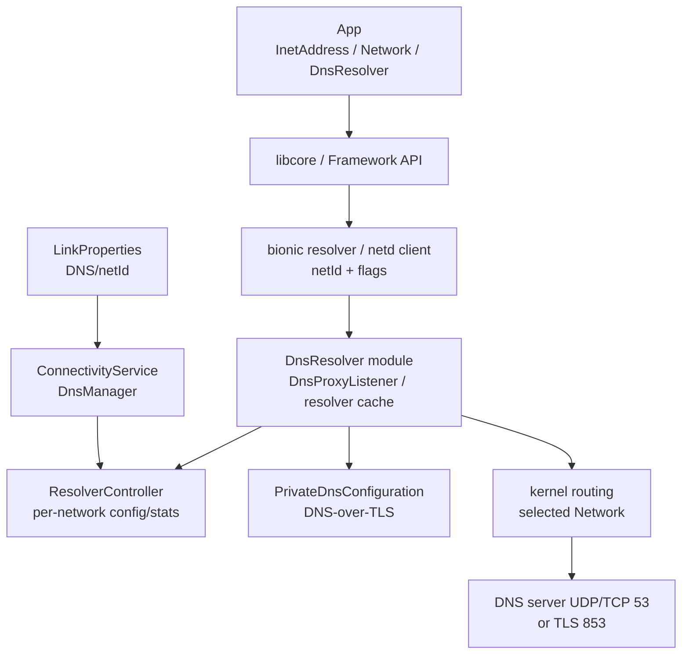
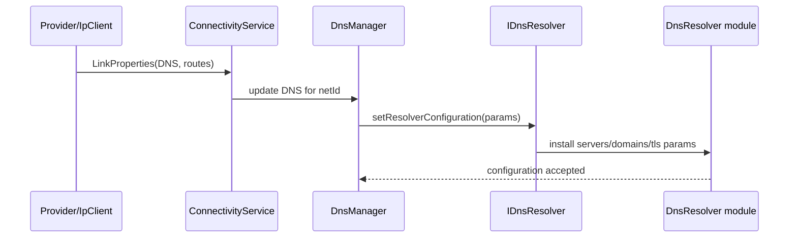
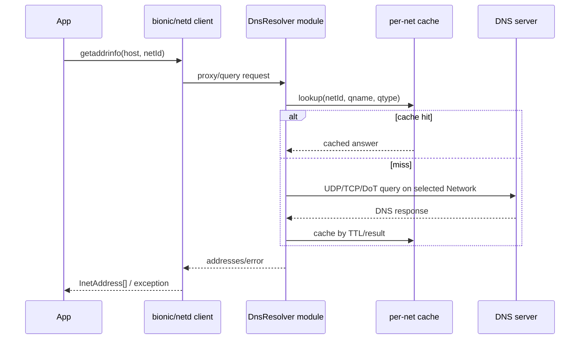

# 41 Android DNS、DnsResolver、netd 与 Private DNS

> 源码版本：Android 11 / API 30 / `android-11.0.0_r48`  
> 学习方式：macOS 只读源码，不要求编译  
> 前置章节：[24 网络栈](./24-Android网络栈ConnectivityService与NetworkAgent.md)、[38 VPN](./38-AndroidVPN系统VpnServiceTUN与网络路由.md)、[40 以太网](./40-Android以太网系统EthernetService与IpClient.md)

DNS 把域名转换成地址，但在 Android 中它还必须回答“使用哪张 Network 的 DNS、是否命中该网络缓存、是否强制 Private DNS、结果应交给哪个异步请求”。DNS 成功也只得到地址，后续 TCP/QUIC/TLS/HTTP 仍可能失败。

---

## 1. 四个完成点

```text
DNS servers configured for a netId
 → query sent/answered
 → hostname resolved to addresses
 → application connects to one address
```

“配置里有 8.8.8.8”“nslookup 成功”“App 页面打开”分别处于不同层。

---

## 2. 总体架构



普通同步 hostname resolution 与公开异步 `DnsResolver` API 的入口不同，但最终都会进入按 Network 管理的 native resolver 数据面。

---

## 3. Android 11 核心源码

```text
frameworks/base/core/java/android/net/DnsResolver.java
frameworks/base/core/java/android/net/Network.java
frameworks/base/core/java/android/net/PrivateDnsConnectivityChecker.java
frameworks/base/services/core/java/com/android/server/connectivity/DnsManager.java
frameworks/base/services/core/java/com/android/server/ConnectivityService.java
packages/modules/NetworkStack/src/com/android/server/connectivity/NetworkMonitor.java
packages/modules/NetworkStack/src/com/android/networkstack/util/DnsUtils.java
packages/modules/DnsResolver/DnsProxyListener.cpp
packages/modules/DnsResolver/DnsResolverService.cpp
packages/modules/DnsResolver/ResolverController.cpp
packages/modules/DnsResolver/res_send.cpp
packages/modules/DnsResolver/res_cache.cpp
packages/modules/DnsResolver/getaddrinfo.cpp
packages/modules/DnsResolver/PrivateDnsConfiguration.cpp
packages/modules/DnsResolver/DnsTlsDispatcher.cpp
packages/modules/DnsResolver/DnsTlsTransport.cpp
packages/modules/DnsResolver/binder/android/net/IDnsResolver.aidl
system/netd/client/NetdClient.cpp
bionic/libc/dns/net/getaddrinfo.c
bionic/libc/dns/include/resolv_netid.h
```

Android 11 的 resolver 已模块化到 `packages/modules/DnsResolver`；旧文章中的 `system/netd/resolv` 路径不适用于这里。

---

## 4. 进程与边界

- App Java/native 调用：应用进程。
- bionic resolver/netd client：调用进程内 native library。
- DnsResolver service：`com.android.resolv` APEX 相关 native service。
- DnsManager/ConnectivityService：`system_server`。
- NetworkMonitor：NetworkStack 模块进程。
- DNS server：LAN、运营商、公共或企业服务器。

一次查询可能跨 library、Unix socket/Binder、native service、kernel 和远端 DNS。

---

## 5. 三类 Java 入口

| API | 特点 |
|---|---|
| `InetAddress.getAllByName(host)` | 同步、使用进程/默认网络语义 |
| `Network.getAllByName(host)` | 明确在指定 Network 上解析 |
| `DnsResolver.query(...)` | 异步，可指定 Network、类型和 flags |

应用自带 DoH library 可能完全绕过系统 resolver，因此系统 Private DNS 设置未必控制它。

---

## 6. InetAddress 主链

简化理解：

```text
InetAddress.getAllByName
 → libcore/native bridge
 → android_getaddrinfofornet(context)
 → resolver proxy/module
 → cache or network query
 → addrinfo → InetAddress[]
```

同步 API 会阻塞调用线程，不能在主线程进行不确定时长的网络解析。

---

## 7. Network.getAllByName

`Network` 对象封装 netId。指定它解析可保证 DNS 查询和后续显式绑定连接使用同一逻辑网络。

如果在 Wi-Fi 上解析，却让 socket 从蜂窝连接，split DNS、企业内网地址、CDN 答案可能失配。

---

## 8. DnsResolver 异步 API

典型形态：

```java
DnsResolver.getInstance().query(
        network, "example.com", DnsResolver.FLAG_EMPTY,
        executor, cancellationSignal, callback);
```

callback 可能返回多个地址或 `DnsException`。Executor 决定回调执行位置；CancellationSignal 是取消意图，不等于远端 DNS 必然停止处理已发查询。

---

## 9. A 与 AAAA

- A：IPv4 address。
- AAAA：IPv6 address。

系统/应用可能并行或按策略查询两者，再根据可达性和 Happy Eyeballs 选择连接顺序。AAAA 成功但 IPv6 path 黑洞会造成连接慢，而不是 DNS 查询失败。

---

## 10. DNS packet 基础

查询包含 transaction ID、flags、question name/type/class；响应包含 answer、authority、additional records 和 rcode。

常见 rcode：

```text
NOERROR   正常，答案区也可能为空
NXDOMAIN  域名不存在
SERVFAIL  服务器处理失败
REFUSED   服务器拒绝
```

超时没有 rcode，因为根本没收到可接受响应。

---

## 11. UDP、TCP 与截断

传统 DNS 通常先用 UDP 53。响应设置 TC 位或过大时可改用 TCP 53。EDNS0 允许协商更大的 UDP payload，但仍受 MTU、fragment 和中间设备影响。

“小域名能查、大响应失败”应考虑 UDP fragment、EDNS0 和 TCP fallback。

---

## 12. netId 是核心索引

Android 不是只有一份全局 `/etc/resolv.conf`。resolver configuration、cache、stats 和 Private DNS 都按 netId 关联。

```text
Wi-Fi netId 100 → DNS A / cache A
Cell netId 101  → DNS B / cache B
VPN netId 102   → DNS C / cache C
```

同一域名在不同网络可以返回不同地址，缓存不能随意混用。

---

## 13. 未指定 Network 时

`NETID_UNSET` 不表示“没有网络”；resolver/netd 会结合 process network、DNS network、UID/VPN 和系统默认网络选择实际 netId。

显式 Network、process binding、VPN 和默认网络共同作用，不能只看当前 Wi-Fi 图标。

---

## 14. DnsManager

ConnectivityService 中的 DnsManager 负责把每张 Network 的 `LinkProperties` 和 Private DNS 设置转换成 resolver configuration，调用 `IDnsResolver.setResolverConfiguration()`，并维护系统属性/状态兼容逻辑。

它配置 resolver，不负责逐条回答 DNS packet。

---

## 15. DNS server 从哪里来

- DHCPv4 option。
- IPv6 RA/RDNSS 或 DHCPv6/网络栈信息。
- 静态 IP 配置。
- VPN VpnConfig。
- Private DNS hostname 解析出的目标 IP。
- 企业/厂商策略。

LinkProperties 是当前 Network DNS 列表的重要来源。

---

## 16. 配置下发时序



accepted 只说明本地配置更新成功，不证明服务器可达。

Android 11 的真实代码会从 `LinkProperties` 取普通 DNS，并按 Private DNS 模式填写 TLS 字段：

```java
paramsParcel.netId = netId;
paramsParcel.servers = NetworkUtils.makeStrings(lp.getDnsServers());
paramsParcel.tlsName = strictMode ? privateDnsCfg.hostname : "";
paramsParcel.tlsServers = strictMode
        ? NetworkUtils.makeStrings(privateDnsCfg.ips)
        : useTls ? paramsParcel.servers : new String[0];
mDnsResolver.setResolverConfiguration(paramsParcel);
```

这是裁剪后的 `DnsManager.sendDnsConfigurationForNetwork()`；原代码还会过滤 strict server 的可达性并写入采样、重试、transport 和 validation tracking 参数。这里最值得观察的是：automatic/opportunistic 复用网络提供的 DNS 地址尝试 TLS，而 strict 同时携带 provider hostname 和已解析候选 IP。

---

## 17. ResolverParams

配置通常包含：

- netId。
- nameserver addresses。
- search domains。
- sampling/timeout/retry 参数。
- TLS name/servers。
- transport types/options。

参数由版本、实验 flags 和设备配置影响，不应从一台设备的 dumpsys 推导所有 Android 固定值。

---

## 18. Search domain

查询短名 `printer` 时，resolver 可结合 search domain 尝试 `printer.corp.example`。ndots/search 顺序影响实际发送的查询次数和延迟。

完整域名与带尾点的 absolute name 可具有不同搜索处理。企业环境排障要记录原始 query name。

---

## 19. 缓存

resolver 按 netId 缓存正向和负向结果，并遵循 TTL/策略。缓存命中可不发网络包。

因此抓包没看到查询，不证明 App 没做解析；可能命中缓存、hosts、应用缓存或自带 resolver。

---

## 20. 正缓存与负缓存

- 正缓存：域名 → A/AAAA 等结果。
- 负缓存：NXDOMAIN 或无记录状态，依据 DNS SOA/策略保存。

修复 DNS server 后仍短暂失败，可能是负缓存未过期。重启 App 不一定清除 system resolver cache。

---

## 21. TTL 不等于连接寿命

TTL 只控制 DNS record 缓存时间。已经建立的 TCP/QUIC connection 不会因 TTL 到期自动断开；连接池也可能继续使用旧地址。

DNS 切流后观察生效速度要同时考虑 resolver、应用缓存和长连接。

---

## 22. getaddrinfo 不只发 DNS

它还处理：

- numeric address，无需 DNS。
- address family/socket hints。
- hosts/static entries。
- canonical name。
- A/AAAA 组合和排序。

把所有 `getaddrinfo` 错误都称作“DNS server 错误”并不准确。

---

## 23. 地址排序

拿到多个 IPv4/IPv6 地址后，resolver/libc 会按 RFC/本地策略排序；应用还可能实现 Happy Eyeballs，交错尝试。

第一个地址连不上但第二个成功时，用户可能只感到延迟。日志应保存候选列表与每次 connect 结果。

---

## 24. DnsProxyListener

传统 libc proxy protocol 请求由 `DnsProxyListener` 接收，解析 command/netId/flags，调用 resolver，并把结果或错误序列化回客户端。

它是进程间桥梁，不是权威 DNS server，也不会自己拥有 `example.com` 的答案。

---

## 25. DnsResolverService AIDL

`IDnsResolver` 主要给系统组件管理 resolver：配置网络、创建/销毁 cache、查询 stats、Private DNS validation 等。普通 App 不靠它直接取得所有 hostname 答案。

公开 `android.net.DnsResolver` 与系统 `IDnsResolver` 名字相似，但 API 层级和调用者不同。

---

## 26. 查询主链



---

## 27. Private DNS 三种模式

| UI/内部模式 | 含义 |
|---|---|
| Off | 使用明文 DNS，不尝试 DoT |
| Automatic/opportunistic | 尝试对网络提供的 DNS 建 DoT，失败可回落明文 |
| Private DNS provider hostname/strict | 验证指定 hostname，失败时不应静默回落明文 |

具体 UI 文案随产品而变，安全差异是“是否允许 fallback”。

---

## 28. DoT 是什么

DNS-over-TLS 通常通过 TCP 853 建 TLS，把 DNS message 放入加密通道。它保护手机到 DoT server 之间的查询机密性/完整性。

DoT 不隐藏后续连接的目标 IP，也不等于 VPN；运营商仍可看到连接元数据。

---

## 29. Strict hostname 的两阶段问题

要连接 `dns.example` 的 DoT，系统先需要得到它的 IP，这产生 bootstrap 问题。NetworkMonitor/系统会用绕过 Private DNS 的解析路径获得候选 IP，再对这些 IP 做 TLS hostname/certificate 验证。

bootstrap 明文查询不意味着之后所有业务 DNS 都明文；必须区分配置发现和稳态查询。

---

## 30. TLS 验证

Strict 模式要验证：

- TCP 853 可达。
- TLS handshake。
- 证书链可信。
- hostname 匹配。
- 时间有效。

能 ping DNS IP 或 TCP 853 connect 成功都不能证明证书验证成功。

---

## 31. Opportunistic 行为

自动模式通常针对网络提供的 DNS IP 探测 DoT；验证成功者用于加密查询，全部失败可使用明文 DNS以保持连通性。

因此 UI 显示 Automatic 不保证每次查询都已加密，要看 validation 状态。

---

## 32. Strict 失败为何像“全网坏了”

如果强制 provider 无法解析、端口被拦、证书失败，系统按安全承诺不能回落明文，域名请求大量失败；直接访问 IP 可能仍通。

这是 fail-closed 策略，不应粗暴归因于 Wi-Fi 无互联网。

---

## 33. NetworkMonitor 的作用

NetworkMonitor 接收 Private DNS 配置变化，解析 strict hostname、触发 probe，并把已解析/验证配置回报 ConnectivityService。它还执行网络 validation/captive portal 探测。

Private DNS validation 与互联网 validation 相关但不是同一个完成点。

---

## 34. LinkProperties 中的 Private DNS

ConnectivityService 会把 Private DNS active/server name/validated servers 等状态反映到 LinkProperties，使系统组件和 callbacks 能观察当前网络状态。

字段出现 hostname 不等于所有 server 已 validated，应检查 validated address 集合和模式。

---

## 35. VPN 与 DNS

VPN NetworkAgent 可提供 DNS servers 和 routes。被 VPN 覆盖的 UID 默认解析应使用 VPN netId 的 DNS；split VPN、allowed/disallowed apps 和 bypass 会改变选择。

VPN App 自己的 tunnel server bootstrap socket/DNS 还要避免递归，具体实现可能绑定 underlying Network。

---

## 36. Captive portal 与 DNS

Portal 网络可能劫持 DNS、只放行部分域名，或让 DNS 正常但 HTTP 被重定向。DNS success 不能排除 captive portal。

NetworkMonitor 使用 DNS/HTTP/HTTPS 多类证据判断，不能拿一次 `getAllByName` 替代 validation。

---

## 37. Private DNS 与 portal

Strict DoT 在登录前可能被 portal 防火墙阻断，导致 portal hostname 也难解析。系统需要谨慎处理 validation、bypass probe 和用户登录流程。

诊断时记录“登录前/后”和 Private DNS mode，避免把时序问题当随机故障。

---

## 38. DNS64 与 NAT64

IPv6-only 网络可通过 DNS64 为只有 A record 的目标合成 AAAA，配合 NAT64/CLAT 访问 IPv4 服务。

合成地址不是权威服务器原始 AAAA。抓包和日志看到特殊 NAT64 prefix 时，应检查 Network 的 NAT64 prefix 与 Dns64Configuration。

---

## 39. 应用自带 DoH

浏览器/SDK 可用 HTTPS 443 查询自选 resolver：

- 可能绕过系统 DNS cache/Private DNS。
- 流量看起来像普通 HTTPS。
- 可绑定或未绑定特定 Network。
- 企业 split DNS 可能失效。

系统日志没有查询不代表应用没解析。

---

## 40. 错误语义

Java 常见表现为 `UnknownHostException`，底层可能来自：NXDOMAIN、timeout、SERVFAIL、网络切换、无可用 DNS、Private DNS validation 或地址族无结果。

异常类型常压缩了底层细节，需结合 resolver stats/log、rcode 和网络状态。

---

## 41. 超时与重试

resolver 会根据 server stats、timeout、retry 和并发策略选择/重试服务器。首个 DNS server 不响应不一定立即失败，也不保证严格按列表顺序逐一等待固定秒数。

不要把一次总耗时除以 server 数量推导实现。

---

## 42. Server health/stats

ResolverController/DnsStats 记录成功、错误、超时和延迟样本，辅助服务器选择和 dumpsys。短期失败与长期不可用的处理可能不同。

统计是历史窗口，不证明下一次查询必然成功。

---

## 43. 缓存旁路 flags

`DnsResolver` flags 可请求不查缓存或不写缓存等行为，具体常量与权限/实现以源码为准。NetworkMonitor 探测可能故意绕缓存获得新证据。

普通 App 反复查询却总命中旧答案，与测试工具显式 no-cache 的结果可能不同。

---

## 44. 取消与竞态

异步 A/AAAA 查询可能一项先成功、另一项晚到；取消、Network lost 和 callback executor 又会产生竞态。实现需保证 callback 至多按契约交付，关闭 FD/监听。

“用户取消后抓包仍见响应”不自动表示 callback 泄漏，响应可能已在途且被丢弃。

---

## 45. 网络切换与缓存

Wi-Fi → cellular 后 netId 改变，resolver 使用另一份配置/cache。旧 Network 对象上的显式查询仍可能失败或继续指向 losing network。

应用缓存若不按 Network 隔离，可能在新网络复用企业内网旧地址。

---

## 46. 多地址连接失败分层

```text
DNS returned [IPv6-A, IPv4-B]
 → IPv6-A connect timeout
 → IPv4-B connect success
```

这是解析成功、第一条连接路径失败、第二条成功。只上报“DNS took 3s”会误导，应分别计时 DNS 与 connect attempts。

---

## 47. 典型时间线

| 时间 | 事件 | 能证明什么 |
|---|---|---|
| 10:00:00.000 | App 请求解析 | 仅开始调用 |
| 10:00:00.002 | cache miss，选 Wi-Fi netId | 确定 resolver 上下文 |
| 10:00:00.030 | A response | IPv4 解析成功 |
| 10:00:00.045 | AAAA response | IPv6 解析成功 |
| 10:00:00.050 | 返回排序地址 | DNS 阶段结束 |
| 10:00:00.300 | TLS connection success | 其中一个地址的业务链成功 |

时间仅为教学示例。

---

## 48. “能 ping IP，域名不通”排查

1. 确认 ping 使用的是 IP 而非先解析域名。
2. 查看当前 socket/process/VPN 对应 Network/netId。
3. 查看该 Network 的 LinkProperties DNS。
4. 区分明文/Private DNS mode 与 validation。
5. 观察 query 是否发出、rcode/timeout。
6. 排除应用自带 DoH/缓存。

---

## 49. “解析成功但页面打不开”排查

保存返回的全部地址，逐项检查 route、connect、TLS certificate/SNI、HTTP、proxy 和 MTU。DNS 只完成名字到地址，不能为后续层背锅。

---

## 50. “只有企业域名失败”

优先检查 split DNS、VPN UID 范围、查询是否走企业 Network、search domain、应用 DoH、企业 DNS ACL。公共 DNS 不知道内部 zone 是正常现象。

---

## 51. “Private DNS 无法连接”

分解为：provider hostname bootstrap、候选 IP route、TCP 853、TLS handshake、证书/hostname、服务端 DNS query。逐层获取证据，不能只测试 53 端口。

---

## 52. dumpsys 与只读观察

```bash
adb shell dumpsys dnsresolver
adb shell dumpsys connectivity
adb shell dumpsys network_stack
adb shell getprop | grep -i dns
```

旧 `net.dns*` 属性不能完整代表现代按 netId resolver 状态。输出/权限依 build 而异。

---

## 53. 抓包位置与端口

```text
UDP/TCP 53 → 传统明文 DNS
TCP 853     → DNS-over-TLS
HTTPS 443   → 可能是 DoH，也可能普通业务
```

缓存命中无包；VPN/底层接口抓包看到的层也不同。抓不到 53 不足以证明没解析。

---

## 54. 源码路线一：同步解析

```text
frameworks/base/core/java/android/net/Network.java
bionic/libc/dns/net/getaddrinfo.c
bionic/libc/dns/include/resolv_netid.h
system/netd/client/NetdClient.cpp
packages/modules/DnsResolver/DnsProxyListener.cpp
```

练习：从 `Network.getAllByName` 追 netId 如何进入 native resolver context。

---

## 55. 源码路线二：异步解析

```text
frameworks/base/core/java/android/net/DnsResolver.java
system/netd/client/NetdClient.cpp
packages/modules/DnsResolver/DnsProxyListener.cpp
```

练习：追 query FD/listener、Executor、CancellationSignal 和 A/AAAA callback 合并。

---

## 56. 源码路线三：配置

```text
frameworks/base/services/core/java/com/android/server/connectivity/DnsManager.java
frameworks/base/services/core/java/com/android/server/ConnectivityService.java
packages/modules/DnsResolver/ResolverController.cpp
packages/modules/DnsResolver/binder/android/net/IDnsResolver.aidl
```

练习：从 LinkProperties DNS 追到 ResolverParamsParcel 与 per-net cache。

---

## 57. 源码路线四：查询与缓存

```text
packages/modules/DnsResolver/getaddrinfo.cpp
packages/modules/DnsResolver/res_send.cpp
packages/modules/DnsResolver/res_cache.cpp
packages/modules/DnsResolver/ResolverController.cpp
```

练习：区分 cache hit、network send、timeout/retry、response cache 和 stats。

---

## 58. 源码路线五：Private DNS

```text
packages/modules/DnsResolver/PrivateDnsConfiguration.cpp
packages/modules/DnsResolver/DnsTlsDispatcher.cpp
packages/modules/DnsResolver/DnsTlsTransport.cpp
packages/modules/NetworkStack/src/com/android/server/connectivity/NetworkMonitor.java
frameworks/base/services/core/java/com/android/server/connectivity/DnsManager.java
```

练习：画 strict hostname bootstrap、TLS validation、配置回报和查询链。

---

## 59. 八组只读练习

1. **四点图**：configured、answered、resolved、connected。
2. **netId 表**：Wi-Fi/cellular/VPN 各写 DNS/cache。
3. **同步链**：InetAddress 到 getaddrinfo/resolver。
4. **异步链**：DnsResolver A/AAAA、取消和 callback。
5. **缓存纸算**：正/负 TTL 与切网。
6. **DoT 图**：automatic 与 strict 失败行为。
7. **多地址图**：DNS timing 与 connect timing 分开。
8. **故障表**：对三种典型现象分层取证。

---

## 60. 初学者易混淆的十二点

1. DNS server 已配置不等于可达。
2. DNS 成功不等于网站可连接。
3. Android 不是只有全局 resolv.conf。
4. cache 按 netId 隔离。
5. NETID_UNSET 不等于不选网络。
6. A 与 AAAA 成功是两类结果。
7. Private DNS automatic 不保证始终加密。
8. strict 失败不允许静默明文回退。
9. DoT 不是 VPN。
10. Network validation 不等于 Private DNS validation。
11. App 自带 DoH 可绕过系统 resolver。
12. UnknownHostException 不只代表 NXDOMAIN。

---

## 61. 自测题

1. InetAddress、Network 和 DnsResolver 三种入口有何区别？
2. 为什么 DNS cache 必须按 netId 隔离？
3. NETID_UNSET 如何选择实际网络？
4. DHCP DNS 怎样进入 resolver？
5. NXDOMAIN 与 timeout 有何区别？
6. UDP DNS 何时切 TCP？
7. automatic 与 strict Private DNS 的关键差异？
8. strict provider 为什么有 bootstrap 问题？
9. DoT 成功能否隐藏目标网站 IP？
10. DNS64 做了什么？
11. 抓不到 53 包能否证明没有解析？
12. 返回 IP 后页面仍失败应查什么？

---

## 62. 参考答案

1. 默认同步、指定 Network 同步、指定 Network/类型/flags 的异步 API。
2. 不同网络有 split DNS、不同答案和访问范围。
3. 结合 process/DNS network、UID/VPN 和系统默认网络。
4. IpClient 更新 LinkProperties，ConnectivityService/DnsManager 下发 ResolverParams。
5. 前者收到“域名不存在”；后者没及时收到可接受响应。
6. 响应截断或策略/大小要求 TCP fallback 时。
7. automatic 失败可明文回退；strict 应 fail closed。
8. 连接 DoT hostname 前先要获得其 IP。
9. 不能，后续 IP 连接元数据仍可见。
10. 在 IPv6-only 网络为 A-only 目标合成 NAT64 AAAA。
11. 不能，可能缓存、DoT、DoH、hosts 或抓错 Network。
12. 地址逐项 route/connect、TLS/SNI、HTTP、proxy、MTU。

---

## 63. 最终主线

```text
Network provider 产生 LinkProperties DNS
 → ConnectivityService/DnsManager 按 netId 下发 resolver config
 → App 通过 InetAddress、Network 或 DnsResolver 发起解析
 → bionic/netd client 携带 netId/flags
 → DnsResolver module 查询 per-net cache
 → miss 时经 UDP/TCP 53 或已验证 DoT 853 访问 DNS server
 → 校验 response、缓存 TTL、返回 A/AAAA 并排序
 → App 选择地址建立 TCP/QUIC/TLS/HTTP 连接
```

面对域名故障，先问：查询属于哪张 Network、该 netId 配了哪些 DNS、是否命中缓存、实际走明文还是 DoT/DoH、返回了哪些地址、应用连接哪一个地址失败。把解析与连接分开，才不会把所有网络问题都归因于 DNS。
