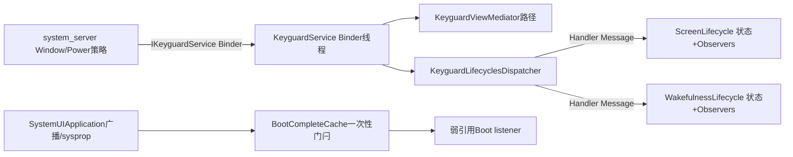
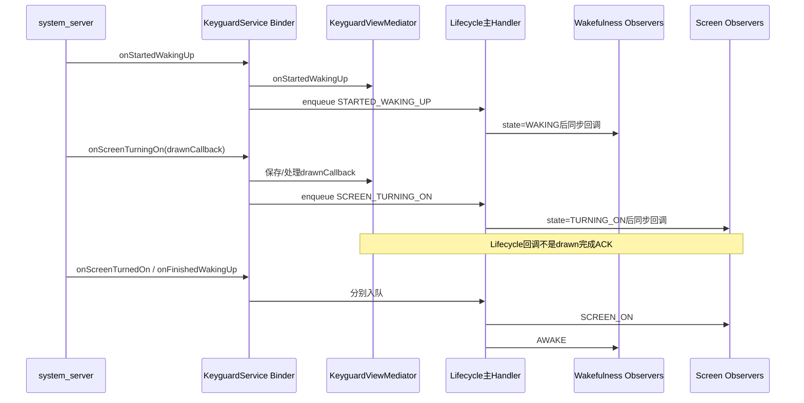
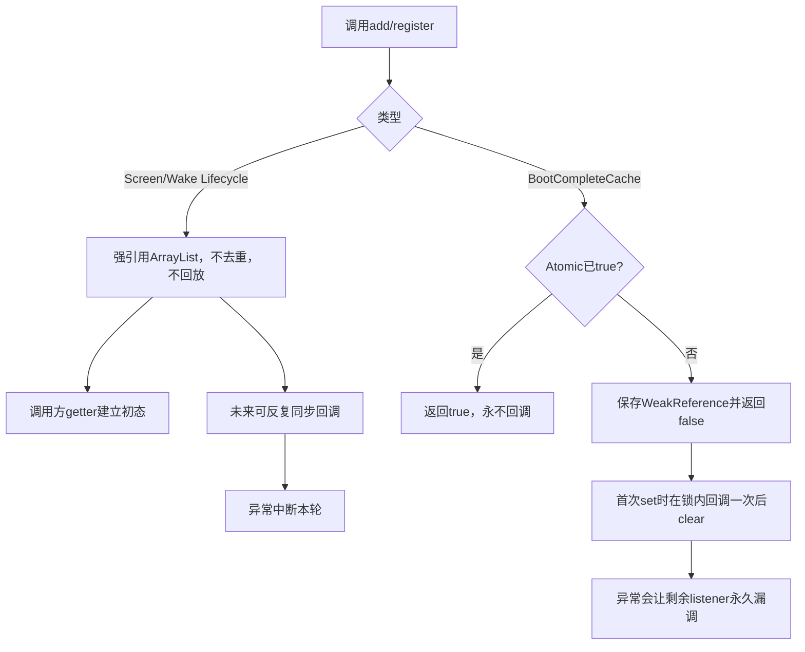

# 第 410 章 Android SystemUI ScreenLifecycle、WakefulnessLifecycle 与 BootCompleteCache：观察者状态机

> 源码基线：Android 11 / API 30 / `android-11.0.0_r48`。本章只在 macOS 阅读源码，不操作真机电源键、不编译。目标是比较可反复变化的screen/wakefulness状态、一次性boot门闩，以及监听注册、线程切换、重入、异常和回放契约。

## 1. 三者都叫“生命周期”但语义不同

Screen反复OFF/ON，Wakefulness反复ASLEEP/AWAKE；BootComplete只从false变true一次。不能用同一套listener直觉理解。

## 2. ScreenLifecycle跟踪什么

它记录Keyguard从WindowManager收到的屏幕turning/turned阶段，是SystemUI内部屏幕状态镜像，不是直接轮询Display硬件。

## 3. WakefulnessLifecycle跟踪什么

它记录started/finished waking与going-to-sleep阶段，更接近设备交互/唤醒流程，不等于面板当前是否发光。

## 4. BootCompleteCache跟踪什么

它缓存SystemUIApplication认定系统已到boot completed的门闩，并让晚启动模块快速查询；它不表示某个用户已解锁。

## 5. 两个状态机彼此独立

设备可在Doze/AOD等场景中出现“wakefulness已睡、screen仍有显示阶段”的组合。不要人为规定两个整数必须同步。

## 6. 基础Lifecycle极简

Java `Lifecycle<T>`只有ArrayList、add、remove和按索引dispatch，没有Handler、状态、去重、快照、锁或异常隔离。

## 7. 状态由子类保存

Screen保存mScreenState，Wakefulness保存mWakefulness；基础类不知道当前状态，也不能为新Observer自动回放。

## 8. 事件来源

system_server经IKeyguardService Binder通知KeyguardService，后者先调用KeyguardViewMediator相关方法，再让KeyguardLifecyclesDispatcher投主线程消息。

## 9. Dispatcher是线程桥

Binder入口可能运行在Binder线程；KeyguardLifecyclesDispatcher用无参Handler把8类事件转到它创建时所在线程，正常Dagger/Service构造路径是主Looper。

## 10. 总体路径图



## 11. Screen的四个状态

0 OFF、1 TURNING_ON、2 ON、3 TURNING_OFF，初值固定OFF。没有@IntDef约束调用参数，因为set方法私有且dispatch方法固定传常量。

## 12. Wakefulness的四个状态

0 ASLEEP、1 WAKING、2 AWAKE、3 GOING_TO_SLEEP，初值ASLEEP，并用SOURCE级@IntDef帮助编译检查。

## 13. 初值不一定是物理真相

新SystemUI进程构造时无条件从OFF/ASLEEP开始；若进程在设备已亮屏时重启，要等system_server重新告知状态才能收敛。

## 14. addObserver不回放

新Observer只进入列表，不会根据getter立即调用onScreenTurnedOn或onFinishedWakingUp。消费者需先查询当前整数建立初态。

## 15. 查询再注册有窗口

若不同线程先get再add，中间可能发生事件而漏掉；源码没有原子“注册并返回状态”API。主线程串行调用是常见隐含约束。

## 16. 注册再查询也需幂等

先add再get可避免永久漏状态，却可能刚收到回调又读取同一状态；消费者初始化必须允许重复应用。

## 17. add不去重

同一个Observer添加两次会在每轮收到两次回调；remove只移除ArrayList中第一处相等对象，重复项仍留存。

## 18. null也能被加入

add没有非空检查；dispatch到null时method reference consumer会抛NullPointerException并终止后续分发。

## 19. state先更新再回调

两个子类都先set整数和traceCounter，再dispatch。Observer回调中调用getter看到新状态。

## 20. 回调失败后状态不回滚

某Observer抛异常时，状态已经变化，后续Observer却没收到；形成“全局状态新、listener局部状态半更新”。

## 21. Screen不抑制重复事件

连续两次dispatchScreenTurnedOn会两次set ON并两次回调。它信任上游事件序列。

## 22. Wakefulness抑制相同目标

每个dispatch先判断已经处于目标状态就return，所以重复StartedWakingUp等不会重复回调。

## 23. 抑制规则只看目标

它不验证合法前态；ASLEEP可直接dispatchFinishedWakingUp变AWAKE，AWAKE也可直接FinishedGoingToSleep变ASLEEP。

## 24. 不是严格状态机验证器

Screen连相同目标都不抑制，Wake只做幂等目标检查；两者都不拒绝跳步、倒序或缺阶段。

## 25. Trace counter

每次实际set分别写`screenState`或`wakefulness`计数器，Perfetto可把整数变化放到时间线上；Wake重复被return时不写trace。

## 26. dump只给当前整数

Screen/Wake dumpsys不打印Observer列表、最近事件时间、来源线程、重复/异常计数或状态名，需要对照常量翻译。

## 27. Dispatcher的消息编号不同

Dispatcher内部SCREEN_TURNING_ON=0等只是Message.what，和ScreenLifecycle状态TURNING_ON=1不是同一枚举。看日志数字时先确认类型。

## 28. Dispatcher不合并消息

每次dispatch都obtainMessage/sendToTarget，没有removeMessages；快速on/off会按入队序列逐项处理。

## 29. 同一发送线程的顺序

同一Binder调用链先后enqueue通常由Looper FIFO保持；多个Binder线程并发调用时，实际顺序由谁先入队决定。

## 30. Handler构造的隐含要求

字段使用`new Handler()`而非显式Main Looper，它绑定对象创建线程的Looper；正常路径依赖KeyguardService/Dagger在main构造，测试后台构造无Looper会失败。

## 31. 未知消息直接崩

handleMessage default抛IllegalArgumentException。dispatch方法包可见且只由同包KeyguardService用固定常量，限制了正常输入面。

## 32. Binder入口先验权限

KeyguardService允许SYSTEM_UID直接通过，否则检查CONTROL_KEYGUARD；Lifecycle不是面向任意应用的广播接口。

## 33. Mediator通常先于Lifecycle投递

started sleep、finished sleep、started wake、screen turning/turned等方法先调用Mediator，再enqueue Lifecycle消息；但Mediator内部也常post自己的Handler，最终执行顺序仍要看各队列。

## 34. finished waking的差异

KeyguardService的onFinishedWakingUp只投WakefulnessLifecycle，没有同方法调用Mediator；不要假定8个入口模板完全一致。

## 35. screen turning off的差异

onScreenTurningOff也只投ScreenLifecycle；onScreenTurnedOff才先通知Mediator再投Lifecycle。

## 36. turning on的drawn callback不在Lifecycle

IKeyguardDrawnCallback交给KeyguardViewMediator处理，ScreenLifecycle Observer没有完成ACK。收到onScreenTurningOn不等锁屏已绘制。

## 37. Binder返回也不是UI完成

Dispatcher只排main Message就返回，observer、动画、drawn callback都可能尚未完成。

## 38. 状态与像素证据分层

SCREEN_ON代表事件阶段，不证明SurfaceFlinger已经合成可见帧；排查黑屏还要看Keyguard drawn、ViewRoot、Surface和显示电源。

## 39. Wakeful AWAKE也非可交互全证明

它不包含Keyguard是否可dismiss、shade状态、屏幕亮度、touch窗口或应用焦点，只是唤醒阶段维度。

## 40. 决定性基础代码

```java
public void dispatch(Consumer<T> consumer) {
    for (int i = 0; i < mObservers.size(); i++) {
        consumer.accept(mObservers.get(i));
    }
}
```

动态size、按索引、无快照和无try/catch共同决定了后面的重入行为。

## 41. 回调中新增Observer

因为循环每次重新读取size，新加入到尾部的Observer会在同一轮被继续访问；若每个新Observer又添加一个，甚至可让本轮无限增长。

## 42. 回调中删除自己

当前元素移除后，下一元素左移到当前索引，但for循环仍i++，所以下一个Observer被跳过。

## 43. 回调中删除更后的元素

被删项不会调用，其他索引可能正常前移；没有contains二次判断或快照语义可依赖。

## 44. 回调中删除更前元素

当前及后续元素左移，i++后也可能跳过一个。复杂重入会让回调集合不可预测。

## 45. 一个Observer抛异常

Lifecycle不捕获，当前dispatch立即退出；若在主Looper会成为SystemUI主线程未捕获异常，后续消息也可能因进程崩溃来不及处理。

## 46. 没有同步保护

跨线程add/remove与main dispatch可发生ArrayList竞态。设计预期是主线程注册和回调，但API未通过assert或注解强制。

## 47. 长寿Observer无需移除吗

StatusBar、BiometricUnlockController等进程级对象可终身注册；Activity/View类如AuthContainerView必须在消失时remove，避免Lifecycle强引用泄漏。

## 48. Observer接口默认方法

消费者只实现关心阶段，减少空方法；但无法从类型上声明“只关心最终ON”，仍被同一列表强持有。

## 49. Screen和Wake监听可同时注册

同一组件常组合两个状态决定策略，例如生物识别、媒体层级和StatusBar；必须分别处理到达次序而非假定成对回调。

## 50. 唤醒与亮屏时序图



## 51. 上图顺序不是硬件唯一顺序

不同设备策略、Doze和并发消息可改变screen/wake事件相对次序；消费者应按独立状态组合而非写死单一序列。

## 52. BootCompleteCache接口的特殊返回值

`addListener`返回当前是否已经boot complete。返回true时listener以后永远不会被调用，调用方应立即执行自己的boot后初始化或已在注册前建立初态。

## 53. add不是“立即回调”

boot已完成时它只return true，不同步调用onBootComplete。这与很多Observable的粘性回放语义相反。

## 54. boot未完成时保存弱引用

Cache不强持有listener；调用方若没有别的强引用，GC后setBootComplete会看到null并跳过。

## 55. 弱引用避免什么

短生命周期对象忘记remove时不一定被Cache永久泄漏；代价是“成功add”也不保证一定回调，生命周期所有权仍需调用方明确。

## 56. 重复add仍允许

同一强存活listener添加两次会保存两个WeakReference，boot时收到两次回调；没有identity去重。

## 57. AtomicBoolean是门闩

`compareAndSet(false,true)`保证并发set只有一个调用者进入通知分支；之后状态不可恢复false。

## 58. add的双重检查

先在锁外get，进listeners锁后再get；避免第一次false后、真正入表前另线程已经set造成永久漏通知。

## 59. 线性化理解

若set先把Atomic改true，add第二次检查会return true而不入表；若add先在锁内入表，set随后取得同一锁并回调，不存在中间丢失。

## 60. remove在boot后直接return

状态true后列表本应已清空，remove不再加锁。若通知异常导致clear没执行，残留也不会由remove清理。

## 61. remove顺带清死引用

boot前removeIf会删除referent已null或identity等于目标的项；使用`===`而非equals，避免两个逻辑相等listener互删。

## 62. set先置true再回调

listener执行时isBootComplete已经true；它再add别的listener会得到true且新listener不会加入本轮。

## 63. 回调线程

setBootComplete在哪个线程调用，listener就在哪个线程同步执行。SystemUIApplication正常从main广播或main启动补偿调用，所以生产主路径通常在main。

## 64. 回调在listeners锁内

实现synchronized后forEach调用listener，直到全部结束才clear并释放锁。慢listener阻塞其他boot前add/remove。

## 65. reentrant remove不会死锁吗

listener里remove先看到bootComplete=true便直接return，不进入锁；reentrant add也直接return true，因此常见重入不会等待自己持有的锁。

## 66. listener异常是严重边界

forEach没有try/finally；一个listener抛异常会阻断后续listener，`listeners.clear()`也到不了，但Atomic已true，未来set不会重试。

## 67. 残留列表变成不可达事件

异常后dump因isBootComplete=true不打印listeners，remove又直接return；弱引用列表留在对象内直到referent GC/进程结束，却没有再次分发机会。

## 68. Cache dump的listener输出有限

boot前打印的是WeakReference对象的toString，通常不是referent的清晰类名；死引用也可能仍显示一个WeakReference地址。

## 69. Boot complete来源一：广播

system user Application注册高优先级BOOT_COMPLETED Receiver；收到且cache仍false时先unregister自己、set门闩，再在servicesStarted时逐模块调用onBootCompleted。

## 70. 来源二：系统属性补偿

启动模块前若cache false且`sys.boot_completed=1`，直接set门闩，解决SystemUI在boot广播之后才重启/启动的问题。

## 71. 属性只是一份完成证据

Cache注释说SystemService.PHASE_BOOT_COMPLETED，实际r48由Application依据广播或属性建立本进程镜像，并非直接向SystemServiceManager查询phase。

## 72. 每个进程各有Cache

Singleton作用域只在当前SystemUI进程；user0主进程、次用户主进程和可能构造根图的子进程不共享同一个AtomicBoolean。

## 73. 次用户没有boot广播依赖

次用户per-user数组启动前同样检查全局sysprop；boot早已完成时可把本进程Cache置true，并立即给新模块调用onBootCompleted。

## 74. Cache listener与SystemUI hook是两条路

BootCompleteCache通知显式addListener对象；Application还直接遍历mServices调用SystemUI.onBootCompleted。顶层模块不靠自动注册Cache listener。

## 75. 模块在boot后启动

start每个模块后检查cache，true就立刻调用该模块onBootCompleted，再注册dump；因此晚启动模块仍得到hook。

## 76. 模块在boot前启动

广播到来后Application遍历已完成启动的mServices调用hook。主线程串行通常避免广播在启动for循环中间插入。

## 77. mServicesStarted guard的含义

广播早于整个数组完成时理论上不遍历；但同main Looper上启动阻塞使普通广播难以中途执行。仍应以代码guard而非时间猜测解释。

## 78. Receiver残留边界

若启动属性补偿先把cache设true，先前注册的BOOT_COMPLETED Receiver仍在；以后收到广播会因顶部isBootComplete直接return，且不会unregister。

## 79. 重复set没有副作用

Atomic compareAndSet失败就完全return，不重复callback、不重复clear，也不记录第二来源。

## 80. BootComplete不是LOCKED_BOOT_COMPLETED

代码监听标准BOOT_COMPLETED并读sys.boot_completed；Direct Boot、用户解锁和credential storage可用性要另看USER_UNLOCKED等事件。

## 81. listener的正确模板

先建立可查询的当前业务初态，调用add并检查返回true时立即执行boot后动作；动作需幂等，以应对重复注册或其他路径已执行。

## 82. PhoneStateMonitor的做法

它在add前已经同步读取default home，再用boot listener重读；虽然忽略boolean，boot已完成时也已有合理初态，后续包广播还能更新。

## 83. Assist行为的做法

激活时add listener后又直接读取default home，因此返回true不回调也不会留下null；停用时remove，但boot后remove按契约无事可做。

## 84. 弱listener应保存在字段

只传一个无其他强引用的临时对象可能被GC；捕获宿主的lambda若宿主字段或其他注册持有，才有稳定生命周期。

## 85. Cache不提供等待

没有Future、Latch await或超时；消费者只能查询或监听，不应在主线程阻塞等boot。

## 86. Cache不记录时间

dump只有boolean和boot前弱引用列表，无法回答何时、由广播还是属性、哪个线程set，需结合SystemUIApplication日志/trace。

## 87. 三者的持有策略对比

Lifecycle强持Observer且反复通知；BootCache弱持listener且只通知一次；使用者的remove责任和“是否一定回调”正好不同。

## 88. 三者的回放策略对比

Screen/Wake add后不回放但可getter；Boot add返回boolean也不回调；都要求调用方主动把“注册未来变化”与“获取当前状态”组合起来。

## 89. 三者的线程安全对比

Lifecycle没有锁/原子；Boot状态原子且listener表加锁，但业务callback本身仍同步、无异常隔离。线程安全容器不等业务分发安全。

## 90. 三者的重入对比

Lifecycle动态ArrayList可能同轮调用新增者或跳过元素；Boot set后add/remove走快速返回，不改变本轮快照，但listener异常可让剩余永远丢失。

## 91. 契约对照图



## 92. 屏幕Observer常见职责

StatusBar、BiometricUnlock等在turning/turned阶段准备窗口、动画、媒体或解锁逻辑；它们收到的是阶段事件，不拥有上游电源状态机。

## 93. Wake Observer常见职责

Assist handle、认证UI、媒体层级等用started/finished阶段调整可见性、计时和动画；耗时工作会阻塞同一主线程后续Observer。

## 94. Getter适合状态判断不适合历史

它只能告诉当前整数，不能判断是否刚经历跳步、重复事件、某listener是否漏回调；历史需trace/log或组件自己的时间戳。

## 95. Screen duplicate的实际影响

Observer如果在onScreenTurnedOn无条件注册Receiver/启动动画，重复上游事件会重复副作用；业务必须幂等或自己缓存。

## 96. Wake duplicate抑制也非业务幂等替代

只抑制连续相同目标；WAKING→AWAKE→WAKING会再次回调，符合新周期。业务仍要为跨周期正确清理。

## 97. 两个Lifecycle没有destroy

Singleton没有统一清空Observer接口；短命对象必须自行remove，进程级对象则随进程结束释放。

## 98. Dispatcher也没有destroy

Handler消息一旦入队不可按owner取消，SystemUI主进程生命周期内持续有效；测试需控制Looper并清消息环境。

## 99. BootCache也没有reset

测试若在同一Dagger图内set true，不能恢复false；应创建新实例/组件隔离用例，而不是期待remove或反射式重置。

## 100. 诊断状态卡住

先查KeyguardService Binder入口是否到达、permission异常、Dispatcher Message是否处理、getter/dump整数，再查具体Observer；不要从某个UI没动反推上游没事件。

## 101. 诊断部分Observer没收到

检查前一个listener异常、重复/重入add-remove、是否在事件后才注册、是否注册到另一进程的Singleton，以及进程是否重启导致初值重置。

## 102. 诊断boot后逻辑没跑

检查addListener返回值是否被忽略、listener是否仅弱引用被GC、前序listener是否抛异常，以及对象到底走Cache listener还是SystemUI hook。

## 103. 诊断boot状态false

确认当前进程是否执行startServicesIfNeeded属性补偿或收到BOOT_COMPLETED；不要用user0主进程的true推断`:tuner`/次用户进程同样true。

## 104. trace与dump组合

dump给当前screen/wake/boot快照，Perfetto counter给状态变化时间；再叠加Binder、Looper和绘制轨迹才能解释延迟。

## 105. 代码审查问题一

新listener是否明确处理初态？若只add不get，晚注册会一直等到下一周期，当前UI可能错误。

## 106. 代码审查问题二

回调是否会增删同一Lifecycle列表或抛异常？若会，应post变更、做快照或在业务边界隔离错误。

## 107. 代码审查问题三

Boot listener是否有强持有者并检查add返回？一次性弱listener的失败通常沉默，最难从现场发现。

## 108. 代码审查问题四

是否把状态阶段误当视觉完成、用户解锁或业务初始化完成？需要为真正完成点寻找独立ACK。

## 109. macOS阅读顺序

先读Lifecycle十几行并手算重入，再读Screen/Wake差异；随后从KeyguardService追Dispatcher，最后读BootCache并回到SystemUIApplication两条set来源。

## 110. 本章最小心智模型

Screen/Wake是主线程反复事件镜像，基础容器弱规范；Boot是线程安全一次性门闩，但弱引用和异常仍会丢业务通知。

## 111. 阅读前自测

若能解释add为何不等初态、Screen为何可重复而Wake不重复、回调自删为何跳下一个、Boot add返回true为何不会回调，就掌握了核心。

## 112. macOS只读练习一：手算Lifecycle重入

列表A/B/C中让A新增D、B删除自己、C抛异常，逐索引写实际调用序列、最终列表和状态整数；再改为快照分发比较。

## 113. macOS只读练习二：拼一次唤醒时序

从IKeyguardService startedWaking、screenTurningOn/drawn callback、screenOn、finishedWaking画Binder/Handler/Observer/绘制四条线，并区分请求与完成。

## 114. macOS只读练习三：推演Boot并发

让线程A add第一次检查false，线程B set true，再让A进入锁；另交换锁顺序，证明双重检查为何不丢事件，并加入listener抛异常情形。

## 115. macOS只读练习四：审计一个消费者

选择BiometricUnlock或Assist behavior，检查初态getter、add/remove对称、回调线程、幂等、异常与进程重启，写出最可能的漏事件点。

## 116. 易错点一：Lifecycle.addObserver会立即告诉当前状态

错误。它只追加强引用；消费者必须查询getter，而且需要处理查询/注册窗口和重复初始化。

## 117. 易错点二：SCREEN_ON表示首帧已显示

错误。drawn callback在Mediator另一条链，Lifecycle整数也不证明SurfaceFlinger已合成像素。

## 118. 易错点三：Boot listener注册后总会回调一次

错误。已boot时只返回true；未boot时又是弱引用，且前序listener异常可能阻断，调用方必须建立初态和幂等fallback。

## 119. 复读源码后的修正

复读后补正Screen不抑制重复而Wake只按目标抑制、两者都不验证合法转移；Lifecycle动态列表非快照，回调自删会跳项、新增会同轮执行。BootCache则在锁内回调、异常后Atomic已true且clear未执行，剩余listener永久漏调；属性补偿先set还会让BOOT Receiver日后早退不注销。所有结论限于r48。

## 120. 本章结论

观察者框架真正重要的不是接口名，而是状态是否可逆、是否回放、持有强弱、线程、重入和异常后的账。第401—410章至此建立了SystemUI启动与基础设施底座；下一章进入StatusBar启动总链，连接CommandQueue、窗口、通知、Keyguard与导航组件装配。
