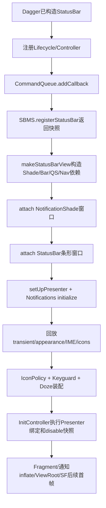
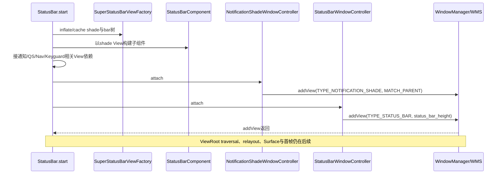
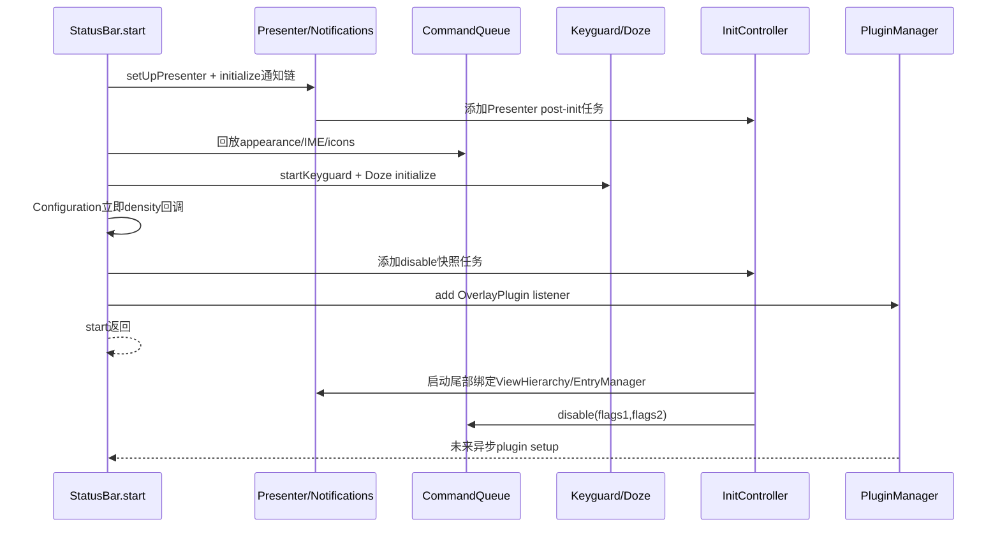

# 第 411 章 Android SystemUI StatusBar 启动总链：CommandQueue、窗口、通知、Keyguard 与导航装配

> 源码基线：Android 11 / API 30 / `android-11.0.0_r48`。本章只在 macOS 阅读源码，不编译。第401—410章建立了进程与基础设施，本章把它们接进StatusBar.start，重点区分对象已注入、Binder注册、View构造、Window加入、通知监听、Keyguard装配、post-init与首帧。

## 1. StatusBar是装配总协调者

r48的StatusBar仍很庞大：它把状态栏、通知shade、QS、导航栏、Keyguard、Doze、插件和系统服务接到一起，但具体逻辑已分散在许多Controller中。

## 2. 构造完成不等start完成

Dagger构造器注入数十个依赖，只建立对象引用和少量构造副作用；SystemUIApplication随后才调用StatusBar.start执行窗口与运行时连接。

## 3. start在哪个线程

它由SystemUIApplication主线程按服务数组顺序同步调用。方法内部既有同步Binder，也会投Handler、Fragment transaction、异步通知和post-init任务。

## 4. start返回也不是首帧

WindowManager.addView只建立ViewRoot/窗口请求，Fragment commit尚可排队，通知行还要异步inflate，Surface合成更在后面。

## 5. 本章六个完成层

依次区分：依赖图存在、SBMS连接、View树存在、Window attach、业务管线初始化、像素可见。任何一层成功都不能代替后一层证据。

## 6. 第一步注册生命周期

StatusBar先向ScreenLifecycle和WakefulnessLifecycle添加Observer；add不回放初态，后续还会用PowerManager等路径补部分当前状态。

## 7. 基础控制器挂接

设置Bypass heads-up、Bubble expand、颜色listener和StatusBarStateController callback，为后面窗口存在后的状态变化准备入口。

## 8. 获取系统服务

取得WindowManager、DreamManager Binder、WMS、DPM、Accessibility、StatusBarManagerService、KeyguardManager和WallpaperManager等。

## 9. 默认display基线

从WindowManager拿default Display，保存mDisplayId和尺寸；StatusBar主实例围绕默认display，导航控制器随后可创建多display导航栏。

## 10. 启动总览图



## 11. CommandQueue先订阅

`mCommandQueue.addCallback(this)`发生在向SBMS注册前，确保register之后立刻到来的下行命令已有消费者。

## 12. addCallback会同步回放

r48 CommandQueue添加callback时会在调用线程回放其当前disable状态；此刻Presenter和窗口尚未完全建立，所以StatusBar很多路径依赖默认值或后续快照重放。

## 13. 向SBMS注册什么

SystemUI把CommandQueue这个IStatusBar Binder交给`IStatusBarService.registerStatusBar`，system_server由此拥有向新SystemUI进程发命令的入口。

## 14. register是同步Binder

主线程等待system_server返回RegisterStatusBarResult；RemoteException被`rethrowFromSystemServer`，start直接失败，不做部分初始化回滚。

## 15. result是一份恢复快照

包含icons、disable flags、appearance regions、transient bar types、IME token/可见性/back disposition、app fullscreen/immersive等。

## 16. 为什么既有callback又有result

callback承接注册后的增量事件，result恢复SystemUI死亡期间system_server仍保存的当前状态，避免重新启动后界面全用默认值。

## 17. 快照也不是原子UI

各字段在start后半段按不同顺序应用；期间新增量命令还可能进CommandQueue main Handler，恢复是多步收敛而非单个事务。

## 18. result被直接解引用

register正常返回后代码假定非null；若服务异常返回null，后续make/create和字段读取会NPE，没有空快照fallback。

## 19. createAndAddWindows的两步

先`makeStatusBarView(result)`完成庞大View/Controller装配，再依次attach NotificationShadeWindow和StatusBarWindow。

## 20. make先更新资源主题

重读display尺寸、资源与theme，再inflate窗口，确保初始layout和颜色尽量使用当前Configuration。

## 21. SuperStatusBarViewFactory是缓存工厂

Shade Window、StatusBar Window和Shelf各只inflate一次；多个Controller调用get拿到同一View实例，而不是各建一棵树。

## 22. 注入式Inflater

工厂用InjectionInflationController包装LayoutInflater，让XML中的部分View由Dagger相关机制构造，再连接LockIcon等Controller。

## 23. Shade窗口树

`super_notification_shade`包含NotificationPanel、stack scroller、scrim、backdrop、QS frame、bouncer容器、keyguard indication等全屏内容。

## 24. StatusBar窗口树

`super_status_bar`是顶部条形窗口容器，折叠状态栏Fragment的View稍后放入其中；它与全屏shade不是同一Window。

## 25. StatusBarComponent子图

用已inflate的NotificationShadeWindowView构建StatusBarComponent，得到WindowViewController、StatusBarWindowController和NotificationPanelViewController。

## 26. 为什么用子组件

这些对象共享特定View实例并形成局部scope，避免根Singleton在View出现前就拿到错误或空引用。

## 27. setupExpandedStatusBar

NotificationShadeWindowViewController在Window attach前连接内部触摸、panel等依赖；View存在不等已经有ViewRoot。

## 28. stack scroller是通知容器

从shade树找到notification stack，交给NotificationLogger和后续Presenter/NotificationsController使用。

## 29. IconArea手工工厂

NotificationIconAreaController仍通过SystemUIFactory创建，注释承认若直接注入会形成StatusBar循环依赖。

## 30. Shelf的建立

工厂inflate NotificationShelf但不立即attach root，并构建NotificationRowComponent初始化其Controller；随后IconArea把AOD icons等接到Shelf。

## 31. DarkIcon与插件依赖

IconArea注册为DarkIconReceiver，StatusBar再允许插件依赖DarkIconDispatcher和StatusBarStateController；第407章的双重依赖许可在此扩展。

## 32. 折叠状态栏用Fragment

FragmentHostManager为CollapsedStatusBarFragment注册tag listener，再用普通`commit()`replace到status_bar_container。

## 33. commit不是commitNow

transaction可在当前start返回Looper后才执行，mStatusBarView和HeadsUpAppearanceController的最终实例可能晚于makeStatusBarView调用点。

## 34. tag listener承担重建接线

Fragment View出现或重建时，保存PhoneStatusBarView，设置bar/panel/scrim，注入通知图标区域，并恢复旧View的展开fraction。

## 35. HeadsUp Controller会重建

旧HeadsUpAppearanceController先destroy，新实例再readFrom旧状态，避免配置重建后完全丢失显示状态。

## 36. 异步Fragment的安全要求

start中在Fragment就绪前调用的方法必须容忍mStatusBarView为空；后续依赖顶部View的逻辑通常放在tag listener。

## 37. HeadsUp关系网

HeadsUpManager连接VisualStability、Panel、Logger、TouchableRegion等；这些listener建立后才具备完整悬浮通知行为。

## 38. createNavigationBar的位置

它在makeStatusBarView中、Window attach之前调用NavigationBarController创建导航栏，并把register快照传入。

## 39. 多显示导航

`includeDefaultDisplay=true`，Controller还可为合格外显创建NavigationBarFragment；StatusBar自身mDisplayId仍指default display。

## 40. 决定性启动骨架

```java
mCommandQueue.addCallback(this);
RegisterStatusBarResult result = mBarService.registerStatusBar(mCommandQueue);
createAndAddWindows(result);
setUpPresenter();
setImeWindowStatus(mDisplayId, result.mImeToken, result.mImeWindowVis,
        result.mImeBackDisposition, result.mShowImeSwitcher);
startKeyguard();
mInitController.addPostInitTask(
        () -> setUpDisableFlags(result.mDisabledFlags1, result.mDisabledFlags2));
```

真实源码在这些骨架步骤之间还有appearance、icons、策略和广播装配。

## 41. 锁屏壁纸与indication

按feature与Wallpaper支持决定是否实例化LockscreenWallpaper，并把indication area、ambient indication容器接给相应Controller。

## 42. Scrim的三张View

behind、in-front和bubble scrim交给ScrimController；可见性再反向影响Shade Window flags和LockIcon。

## 43. Media backdrop

NotificationMediaManager连接前后backdrop、Scrim和锁屏壁纸；shade depth还用资源最大缩放动态改变backdrop scale。

## 44. UserSwitcher按能力创建

UserManager报告启用用户切换时才创建KeyguardUserSwitcher，并使用shade树中的用户容器/header。

## 45. QS是可替换Extension

QS frame通过ExtensionController选择QS插件或默认QSFragment，并由ExtensionFragmentListener接到FragmentHost。

## 46. QS也可能晚到

Fragment创建后tag listener才取得QSPanel并设置BrightnessMirror；make方法结束不保证mQSPanel已非null。

## 47. 当前灭屏补偿

若PowerManager.isScreenOn为false，代码直接调用自身BroadcastReceiver模拟SCREEN_OFF，使初态不必等待下一次广播。

## 48. 广播面建立

注册close system dialogs、screen off、device monitoring，另以DUMP权限注册Demo命令，并显式执行user setup初始回调。

## 49. make结束仍未attach

此时View和大量Controller已建立，但两棵Window root还没交给WindowManager；不要从对象非null推断可见。

## 50. 两扇Window时序图



## 51. Shade Window LayoutParams

MATCH_PARENT全屏、TYPE_NOTIFICATION_SHADE、初始NOT_FOCUSABLE，带split touch、watch outside、waking touch和system bar backgrounds，PixelFormat.TRANSLUCENT。

## 52. 独立Binder token

Shade和StatusBar各创建新Binder作为Window token字段，并设置包名/title/cutout always；这不是Activity token。

## 53. Shade不适配system inset

`setFitInsetsTypes(0)`，由自身布局/Insets逻辑处理系统栏区域；soft input使用ADJUST_RESIZE。

## 54. attach后的主题与Keyguard

Shade addView后复制LayoutParams、onThemeChanged，并若KeyguardMediator已showing且未occluded就同步设置keyguardShowing状态。

## 55. StatusBar条形Window

MATCH_PARENT×status_bar_height、TYPE_STATUS_BAR、初始NOT_FOCUSABLE，带force-show私有flag的状态控制能力。

## 56. Factory保证同一bar View

StatusBarWindowController构造时已从缓存工厂取StatusBarWindowView；StatusBar.make再次get得到同一对象，attach不会加另一份副本。

## 57. addView返回不是WMS最终完成

客户端创建ViewRoot并提交add请求，但measure/layout/draw、Surface创建与合成仍异步。启动耗时统计也不会等像素。

## 58. attach失败没有回滚

Shade已add而StatusBar条形add失败时，createAndAddWindows抛出，源码没有移除第一扇Window恢复干净状态。

## 59. attach后注册壁纸监听

如果支持Wallpaper，按ALL users监听WALLPAPER_CHANGED并手动调用一次receiver建立当前supportsAmbient等初态。

## 60. Presenter为何在窗口后

它需要Shade WindowView、Panel、StackScroller、Shelf等View引用，因此必须等make/attach路径已构造这些对象。

## 61. Presenter不是通知数据源

StatusBarNotificationPresenter主要协调View hierarchy、shade状态、remote input、keyguard和展示策略；NotificationListener/EntryManager才承接通知数据。

## 62. setUpPresenter的对象链

先建ActivityLaunchAnimator，再建Presenter，连接Shelf和RemoteInput，构建NotificationActivityStarter并注入ListContainer/Guts。

## 63. NotificationsController.initialize

注册NotificationListener为system service，绑定list controller、row binder、clicker、HeadsUp和新旧NotifPipeline分支。

## 64. 通知注册也是跨进程边界

registerAsSystemService把SystemUI listener交给NotificationManagerService；注册返回不等所有active notifications已完成row inflation。

## 65. 新旧管线feature分支

新NotifPipeline可初始化；若新渲染未启用，r48仍让EntryManager连接listener，并挂group/heads-up/remote-input传统链。

## 66. Presenter还有post-init工作

其构造会向InitController添加任务，稍后才setUp ViewHierarchyManager、EntryManager listeners和lifetime extenders等。

## 67. initialize完成仍非完整Presenter

StatusBar.start中setUpPresenter返回时，InitController队列尚未在SystemUIApplication启动尾部执行，通知展示关系仍有延迟部分。

## 68. 为什么先Presenter后disable快照

源码注释要求初始notification state在CommandQueue.disable前建立，避免disable驱动UI时Presenter/容器尚未准备。

## 69. transient快照

result包含状态栏transient type时直接showTransientUnchecked，使新进程恢复沉浸模式临时栏状态。

## 70. appearance快照

用displayId、appearance、regions和IME navbar color ownership恢复明暗图标与栏外观。

## 71. app fullscreen/immersive

两个boolean从result写入StatusBar字段，为后续模式判断提供当前应用状态。

## 72. IME快照

SBMS保存的IME token、visibility、back disposition和switcher标志传给setImeWindowStatus，解决SystemUI重启期间IME状态不中断。

## 73. icon快照

遍历ArrayMap，通过CommandQueue.setIcon逐个回灌；该方法走CommandQueue自己的消息/coalesce语义，不一定在for循环内立刻画完。

## 74. 回放顺序可见

transient→appearance→app flags→IME→icons；disable却被保存到post-init最后，不按result字段天然顺序一次应用。

## 75. 快照与增量竞态

register返回后system_server可能发新icon/IME命令；旧快照回放若晚到可能短暂覆盖新状态，最终取决于CommandQueue排队与coalesce顺序。

## 76. internal banner Receiver

以SELF权限注册cancel/setup内部操作，避免任意应用控制SystemUI提示条。

## 77. Wallpaper ambient复位

启动时尝试让WallpaperManager退出ambient mode；RemoteException被忽略，因为不应阻断整个StatusBar。

## 78. IconPolicy较晚init

快照icons入队后才`mIconPolicy.init()`安装电话、电池、蓝牙等策略icon listener；它们后续可更新相应slot。

## 79. SignalPolicy单独构造

StatusBarSignalPolicy连接NetworkController与IconController，负责移动网络/Wi-Fi等状态栏信号展示。

## 80. Keyguard装配前提

Windows、Panel、StackScroller和bouncer container都已存在，startKeyguard才取得BiometricUnlockController并注册StatusBarKeyguardViewManager。

## 81. startKeyguard做什么

把StatusBar、bouncer、Panel、生物识别、dismiss registry、lock icon、stack、bypass和falsing交给KeyguardViewManager。

## 82. 反向连接

Indication、Biometric、RemoteInput、DynamicPrivacy、LightBar、Media和KeyguardDismissUtil再保存ViewManager/UnlockController引用，形成完整解锁协作图。

## 83. startKeyguard不等Keyguard可见

它完成对象接线，不等待bouncer inflate、锁屏drawn或IKeyguardDrawnCallback完成。

## 84. UpdateMonitor与Doze

随后注册KeyguardUpdateMonitor callback，并用刚创建的icon area、keyguard manager、shade controllers和ambient container初始化DozeServiceHost。

## 85. Configuration add的即时回调

StatusBar向ConfigurationController add时，会同步收到density/font初始回调；此刻多数依赖已建立，顺序刻意晚于View构造。

## 86. 仍有nullable防线

density回调对BrightnessMirror等部分对象判null，说明启动/重建顺序仍可能让子组件尚未准备。

## 87. Battery Lifecycle

BatteryController通过AndroidX Lifecycle观察StatusBar，并把mLifecycle设RESUMED；这是另一套生命周期，不是第410章ScreenLifecycle。

## 88. disable为何post-init

保存result的disabledFlags1/2到Runnable，等所有SystemUI服务start和InitController前序任务完成后再调用CommandQueue.disable。

## 89. disable post任务顺序

StatusBarNotificationPresenter可能更早在start过程中入队自己的任务，StatusBar最后加入disable；InitController按FIFO drain，故通知绑定通常先于disable快照。

## 90. start末尾是插件注册

OverlayPlugin listener允许多插件，普通加载在后台，连接回主线程后再post setup；插件显然不是StatusBar.start同步完成的一部分。

## 91. 后半段时序图



## 92. OverlayPlugin连接又post一次

PluginInstanceManager本已在main调用listener，StatusBar listener仍向mMainThreadHandler post setup，确保在当前连接回调退出后再触碰Window/Nav View。

## 93. plugin可强制shade保持展开

Callback维护mOverlays集合，更新WindowController forcePluginOpen与collapseDesired listener；断开时需移除防止窗口永久打开。

## 94. plugin列表匿名且长期

StatusBar没有保存PluginListener字段用于remove，因为它与进程级StatusBar同寿命；重复start却会再注册一份listener，是启动非幂等的一例。

## 95. 整个start没有统一事务

任一步异常都会沿SystemUIApplication启动链抛出，已注册callback、Receiver、Window、Service listener不会自动撤销。

## 96. mServicesStarted仍由Application控制

StatusBar.start返回后，其他SystemUI模块还要启动、post-init还要执行；最后Application才把全局guard置true。

## 97. 配置回调的双路径

Application只在全服务完成后分发ConfigurationController和顶层SystemUI hook；但StatusBar自己注册的Controller callback已存在。

## 98. Boot hook可能紧跟start

若BootCompleteCache启动前已true，SystemUIApplication在StatusBar.start返回后立即调用StatusBar.onBootCompleted，再继续下一个模块。

## 99. start耗时统计的边界

Application统计同步start墙钟；它包含registerStatusBar与addView等同步时间，不含Fragment后续执行、通知inflate、插件和首帧。

## 100. 默认显示与多显示不要混淆

register result多为default display主状态，NavigationBarController可扩展其他display；StatusBar Window/NotificationShade主树仍围绕mDisplayId。

## 101. 诊断“状态栏完全没出现”

先分层检查StatusBar是否在服务数组、start是否异常、registerStatusBar、两次addView、Fragment commit、ViewRoot和Surface，而不是先查通知数据。

## 102. 诊断“有背景没顶部图标”

Shade Window attach可能成功但CollapsedStatusBarFragment/tag listener尚未完成，或icon快照/Policy未接好；检查两扇Window和Fragment分别。

## 103. 诊断“通知不显示”

确认Presenter、NotificationListener注册、EntryManager/NotifPipeline分支、row binder、list container以及InitController post任务，窗口存在只是容器条件。

## 104. 诊断“重启后IME图标错”

对照RegisterStatusBarResult快照、setImeWindowStatus回放和注册后增量CommandQueue消息时序，关注跨display coalesce。

## 105. 诊断“disable启动时闪一下”

初始Window先以较默认状态attach，disable快照故意延到post-init；短暂可见差异可能是顺序结果，再确认最终flags是否应用。

## 106. 诊断“Keyguard对象非null但黑屏”

startKeyguard只完成接线；继续查Mediator、drawn callback、ScreenLifecycle、ViewRoot绘制、Scrim与SurfaceFlinger。

## 107. dump证据拼图

组合StatusBar dump、CommandQueue/SBMS、WindowManager窗口、Notification管线、Keyguard、NavigationBar和SurfaceFlinger；单份dump看不到完整启动代数。

## 108. 阅读源码的切分法

先只读start骨架，再进入makeStatusBarView；不要第一次就追每个listener实现，否则会在数百依赖间失去顺序主线。

## 109. macOS推荐搜索点

依次定位`start()`、`registerStatusBar`、`createAndAddWindows`、`makeStatusBarView`、`setUpPresenter`、`startKeyguard`、`setUpDisableFlags`和Application post-init。

## 110. 本章最小心智模型

StatusBar.start是一个无回滚的同步装配脚本，内部不断创建未来异步工作；SBMS快照恢复控制面，两扇Window提供容器，Presenter/Keyguard/Nav再提供业务能力。

## 111. 阅读前自测

若能解释为什么两扇Window、为什么disable最后回放、为什么Fragment commit和通知初始化晚于start、为什么Keyguard接线不等drawn，就掌握了主线。

## 112. macOS只读练习一：标注start完成层

把StatusBar.start按源码顺序抄成20个节点，为每个节点标注同步/Handler/Fragment/Binder/Window/像素，并圈出最早可用的证据。

## 113. macOS只读练习二：推演SystemUI重启快照

假设重启时应用沉浸、IME可见、已有五个icon和disable2，追register result到transient、appearance、IME、icons、post-init disable的实际顺序。

## 114. macOS只读练习三：制造部分启动失败

分别让SBMS Binder、Shade addView、StatusBar addView、NotificationListener注册和startKeyguard抛异常，列出已经留下的Receiver/Window/listener与可观测现象。

## 115. macOS只读练习四：追一个通知首帧

从NotificationsController.initialize、NotificationListener、Entry/NotifPipeline、row binder、stack container到ViewRoot/SF，证明StatusBar.start返回不是通知像素完成点。

## 116. 易错点一：StatusBar只有一个Window

错误。r48至少把全屏TYPE_NOTIFICATION_SHADE与顶部TYPE_STATUS_BAR分别addView，导航栏又由NavigationBarController创建其他Window/Fragment。

## 117. 易错点二：registerStatusBar返回后UI已恢复

错误。它只给控制面快照；各字段、Window、Presenter、Fragment和图标按后续顺序逐步应用。

## 118. 易错点三：StatusBar.start返回表示启动完成

错误。其他SystemUI服务、InitController、Fragment、插件、通知inflate、View traversal和Surface合成都可能尚未完成。

## 119. 复读源码后的修正

复读r48后补正两扇Window attach发生在Presenter之前，折叠状态栏与QS均可能通过Fragment晚到；通知initialize仍有Presenter post-init尾巴；icon快照走CommandQueue而disable快照刻意最后执行。还区分startKeyguard对象接线、IKeyguardDrawnCallback与像素首帧，并保留失败无rollback边界。

## 120. 本章结论

StatusBar启动不是单点创建，而是“先接系统控制面、再造窗口容器、再装业务管线、最后回放策略”的多阶段收敛。看懂顺序后，状态栏、shade、通知、Keyguard和导航的故障才能按层定位。下一章先深入较小的StatusBarWindowController，研究顶部条形窗口的LayoutParams、高度与force-visible状态，并与真正承担焦点、触摸、Keyguard标志的Shade窗口划清边界。
