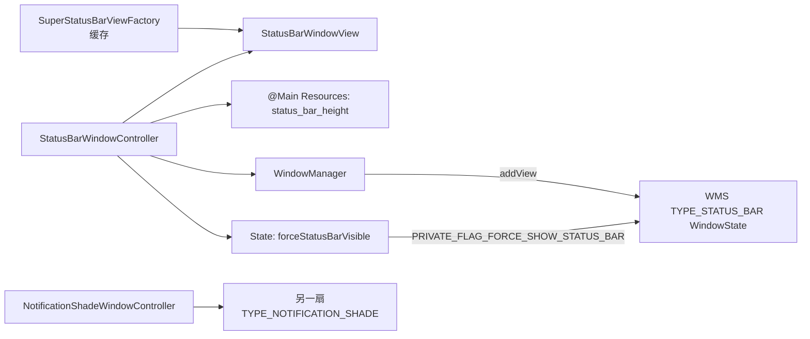
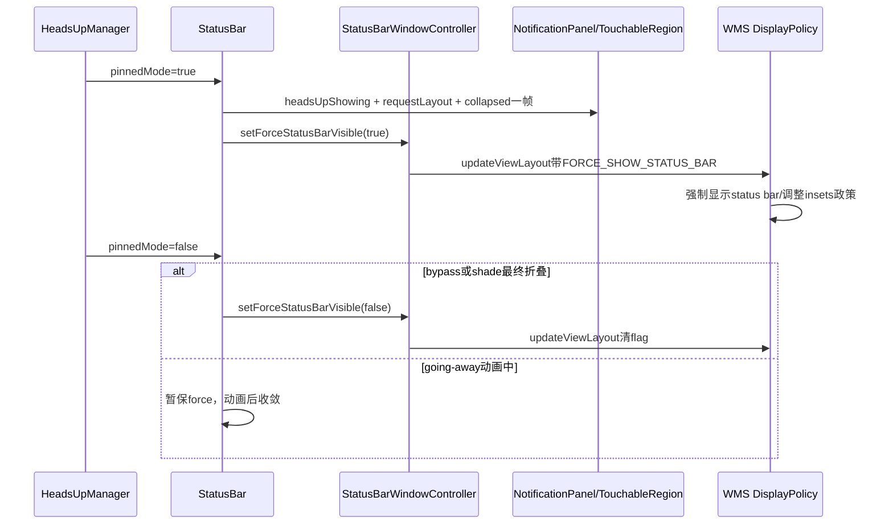

# 第 412 章 Android SystemUI StatusBarWindowController：顶部窗口、高度、Force Visible 与职责边界

> 源码基线：Android 11 / API 30 / `android-11.0.0_r48`。本章只在 macOS 阅读源码，不编译。章节计划提到窗口参数、焦点、触摸和Keyguard标志，但复读r48后必须先纠正职责：StatusBarWindowController只管理顶部TYPE_STATUS_BAR窗口的高度和force-visible私有flag；复杂焦点、触摸、Keyguard、Doze与Wallpaper主要属于NotificationShadeWindowController和View层。

## 1. 这个类比名字小得多

`StatusBarWindowController`只有约150行：保存View、两份LayoutParams、状态栏高度和一个boolean State。它不是整个StatusBar窗口体系的总控制器。

## 2. 它控制哪扇窗口

控制`super_status_bar`生成的`StatusBarWindowView`，Window type为`TYPE_STATUS_BAR`，高度通常就是framework的`status_bar_height`。

## 3. 它不控制哪扇窗口

下拉通知、QS、Bouncer、Scrim和Keyguard主体位于全屏`TYPE_NOTIFICATION_SHADE`窗口，由NotificationShadeWindowController管理。

## 4. 两扇窗口必须分账

顶部条形窗口负责常驻状态栏容器；Shade窗口可全屏展开、改变焦点和触摸策略。两者由StatusBar.start连续attach，但LayoutParams完全不同。

## 5. 类的三个外部能力

公开方法只有`getStatusBarHeight()`、`refreshStatusBarHeight()`、`attach()`和`setForceStatusBarVisible()`，没有setFocusable、setKeyguardShowing或setTouchable。

## 6. Singleton与View子图

类标记`@Singleton`，StatusBarComponent暴露它；构造时从Singleton SuperStatusBarViewFactory取得缓存的StatusBarWindowView。

## 7. 为什么不会inflate两份

StatusBar.makeStatusBarView也调用工厂getStatusBarWindowView，但工厂缓存第一次结果，因此Controller attach的正是StatusBar保存的同一View对象。

## 8. 构造时不加窗口

构造只取得View、Resources和WindowManager，读取初始高度；真正`addView`直到StatusBar.createAndAddWindows末尾。

## 9. 默认状态

`mBarHeight=-1`后立即从资源赋值；State中的`mForceStatusBarVisible`默认false；mLp在attach前为null。

## 10. 对象与窗口图



## 11. 高度来源

读取`com.android.internal.R.dimen.status_bar_height`，这是framework内部资源，不是SystemUI自己的普通dimen。

## 12. @Main Resources的意义

构造器拿主资源对象，Configuration更新后同一Resources可解析到当前方向、密度和产品overlay对应的高度。

## 13. 高度是像素整数

`getDimensionPixelSize`已把dp/resource density转换成px并取整，mBarHeight不是dp。

## 14. 高度不是DisplayCutout本身

资源可由设备配置考虑刘海，但Controller不读取DisplayCutout几何；具体左右/瀑布边距由StatusBarWindowView和子View处理。

## 15. Window宽度

attach创建宽度`MATCH_PARENT`、高度mBarHeight的LayoutParams，形成顶部横条，而非全屏透明触摸层。

## 16. Window type

使用系统专用`TYPE_STATUS_BAR`，WMS DisplayPolicy把它识别为status bar提供者并应用专门的insets/可见性政策。

## 17. 初始public flags

只有`FLAG_NOT_FOCUSABLE | FLAG_SPLIT_TOUCH | FLAG_DRAWS_SYSTEM_BAR_BACKGROUNDS`，没有NOT_TOUCHABLE。

## 18. NOT_FOCUSABLE的真实含义

这扇条形窗口不抢键盘焦点、通常不成为IME目标；它不等于不能接收触摸。

## 19. 为什么仍能触摸

没有`FLAG_NOT_TOUCHABLE`，且窗口范围覆盖顶部高度，触摸可交给StatusBarWindowView/PhoneStatusBarView等View逻辑。

## 20. SPLIT_TOUCH

允许多指事件按pointer目标拆分，避免一个子View拿到第一指后强占全部后续pointer。

## 21. DRAWS_SYSTEM_BAR_BACKGROUNDS

声明窗口参与系统栏背景绘制语义；实际颜色和图标明暗还由bar appearance、Fragment和LightBar链处理。

## 22. PixelFormat.TRANSLUCENT

窗口支持透明区域和合成，不表示每个像素都透明，也不表示Surface没有buffer。

## 23. COLOR_SPACE_AGNOSTIC私有flag

`PRIVATE_FLAG_COLOR_SPACE_AGNOSTIC`告诉合成/窗口体系这类系统UI窗口不应因应用色域产生普通内容式颜色空间约束。

## 24. 独立Binder token

`mLp.token = new Binder()`提供窗口token身份；它不是Activity token，也没有对外Binder接口。

## 25. Gravity.TOP

条形窗口锚定显示顶部；高度变化时仍从顶部向下占据区域。

## 26. fitInsetsTypes为0

窗口不要求WindowManager自动为某类system insets缩进，避免状态栏窗口再被自己的inset推开。

## 27. title与packageName

title设为`StatusBar`便于dumpsys/window诊断，packageName用于WMS归属与日志。

## 28. Cutout always

`LAYOUT_IN_DISPLAY_CUTOUT_MODE_ALWAYS`允许窗口布局进入cutout区域；安全内容边距由View层再处理。

## 29. attach只有一次预期

它没有mAttached guard；第二次对同一View调用addView通常会抛“already has a parent/has been added”类异常。

## 30. attach失败不自清理

addView抛异常时mLpChanged复制不会执行；Controller没有catch、removeView或重试事务。

## 31. mLp与mLpChanged

mLp表示最近提交/用于update的参数，mLpChanged作为期望状态草稿；attach后先把mLp完整复制到mLpChanged建立共同基线。

## 32. 为什么保留两份

后续先只修改草稿，再用`mLp.copyFrom(mLpChanged)`算差异；无差异就不调用WindowManager.updateViewLayout。

## 33. copyFrom返回变化位

返回0说明所有受比较字段相同；非0才触发一次relayout请求，减少重复Binder/ViewRoot工作。

## 34. update并非立即合成

updateViewLayout更新客户端ViewRoot参数并向WMS relayout；系统栏真正显示、insets变化和Surface合成仍是后续链。

## 35. Controller没有锁

State和LayoutParams直接可变，预期所有调用在SystemUI主线程；API未做Looper assert，跨线程使用会竞态。

## 36. Controller不实现Dumpable

r48没有给它注册DumpManager，无法直接从专属dump看到mBarHeight、force state和两份LayoutParams。

## 37. 诊断需借外部证据

用dumpsys window查看StatusBar WindowState/LayoutParams，再结合StatusBar日志、资源值和WMS DisplayPolicy判断。

## 38. attach在Shade之后

StatusBar.createAndAddWindows先attach全屏NotificationShade，再attach顶部StatusBar；第二步失败可能留下只存在Shade的部分启动状态。

## 39. ViewRoot完成层

addView返回只能证明客户端接入过程未同步抛错，不能证明首次measure/layout/draw或SurfaceFlinger合成完成。

## 40. 决定性源码

```java
private void apply(State state) {
    applyForceStatusBarVisibleFlag(state);
    applyHeight();
    if (mLp != null && mLp.copyFrom(mLpChanged) != 0) {
        mWindowManager.updateViewLayout(mStatusBarView, mLp);
    }
}
```

State先投影到草稿，copyFrom再把差异提交到mLp；mLp为null时只改草稿，不发窗口更新。

## 41. refresh读取新资源

重新解析status_bar_height，只有新值与mBarHeight不同才保存并apply；相等时完全不触发update。

## 42. 谁调用refresh

StatusBar.updateResources在配置变化时调用；同方法还更新QSPanel、PhoneStatusBarView、NotificationPanel和BrightnessMirror。

## 43. 更新高度不重建Window

attach后只改LayoutParams.height并updateViewLayout，同一StatusBarWindowView和ViewRoot继续存在。

## 44. 高度变化也会重画

WMS relayout和ViewRoot重新布局会让子View获得新尺寸，后续可能产生新buffer，但Controller不等待完成。

## 45. refresh没有listener

它不主动通知NotificationIconArea等消费者；这些对象需要时通过StatusBar.getStatusBarHeight读取当前值或各自处理资源变化。

## 46. NotificationIconArea的使用

其`getHeight()`转到StatusBar，再转到Controller；通知图标区域因此与当前状态栏资源高度保持同一来源。

## 47. cutout边距另算

StatusBarWindowView.onApplyWindowInsets读取左右system bar inset和waterfall top，修改每个FrameLayout child margin。

## 48. top inset被特别处理

它先把mTopInset清0，只在DisplayCutout存在时取waterfallInsets.top，不直接把普通状态栏top inset再次叠加。

## 49. child margin更新

只有left/right/top实际变化才写LayoutParams并requestLayout，避免每次Insets回调都无条件重排。

## 50. 高度更新时序图

```mermaid
sequenceDiagram
    participant A as SystemUIApplication/StatusBar
    participant C as StatusBarWindowController
    participant R as Main Resources
    participant VR as ViewRootImpl
    participant W as WMS
    A->>C: updateResources -> refreshStatusBarHeight
    C->>R: getDimensionPixelSize(status_bar_height)
    alt 高度未变化
        C-->>A: return
    else 高度变化
        C->>C: mBarHeight=new; mLpChanged.height=new
        C->>C: mLp.copyFrom(mLpChanged)
        C->>VR: WindowManager.updateViewLayout
        VR->>W: relayout新高度
        W-->>VR: 新frame/insets/surface信息
        VR->>VR: 后续measure/layout/draw
    end
```

## 51. refresh可在attach前调用

mLp为null时apply只改mLpChanged草稿和mBarHeight，不调用WindowManager；随后attach直接用最新mBarHeight创建实际mLp。

## 52. attach会重置草稿基线

addView后`mLpChanged.copyFrom(mLp)`，把attach创建的参数覆盖进草稿，保证后续diff从真实窗口基线开始。

## 53. attach前force的边界

若先setForce(true)，草稿会带flag但mLp为null；attach又创建不带force的新mLp并复制回草稿，于是此前force意图丢失。

## 54. 为什么正常路径没踩到

StatusBar只在Heads-up等运行时调用setForce，发生在createAndAddWindows/attach之后；类本身却没有保护这个调用顺序。

## 55. State只有一个boolean

没有keyguardShowing、panelExpanded、dozing、bouncer、scrim或topUi字段，证明复杂Shade状态不属于这个类。

## 56. setForce总是apply

即使传入值与当前State相同，也再次投影flag和高度；copyFrom最终为0时不会updateViewLayout。

## 57. force flag如何设置

true对mLpChanged.privateFlags按位OR `PRIVATE_FLAG_FORCE_SHOW_STATUS_BAR`，false按位AND反码清除，不破坏其他私有flag。

## 58. 私有flag的framework定义

注释明确：只可由TYPE_STATUS_BAR设置；若状态栏隐藏，设置后应再次显示。

## 59. WMS DisplayPolicy处理

finishPostLayoutPolicyLw检查StatusBar Window attrs，看到force flag就调用StatusBarController强制show并要求必要的layout redo。

## 60. InsetsPolicy也读取

它用该flag判断status bar是否要transient force-show，影响system bar控制目标和可见性政策。

## 61. force不是View.VISIBLE

Controller没有直接setVisibility；它把政策意图写到Window LayoutParams，由WMS决定系统栏窗口/insets如何显示。

## 62. force不是常驻锁

调用方必须在Heads-up/展开结束后清false；否则WMS会继续认为状态栏要求强制显示。

## 63. 主要触发：Pinned Heads-up

进入pinned mode时StatusBar同时让Shade Controller记录headsUpShowing，并对顶部StatusBar Window设置force true。

## 64. 为什么需要force

当前应用可能沉浸隐藏状态栏，但Heads-up需要顶部区域可见/可触；私有flag让WMS临时打破应用隐藏请求。

## 65. Heads-up还有触摸区域链

StatusBar要求Panel View layout，并让Shade暂时force collapsed一帧，以先更新internal insets，避免窗口resize前误接触摸。

## 66. 上述触摸不由本类计算

本类只force顶部栏可见；TouchableRegion、Shade window collapsed和View requestLayout在其他Controller/View中完成。

## 67. Pinned退出不总立刻清force

若bypass Keyguard成立，代码直接false；其他路径可能等Panel/Heads-up going-away动画结束或makeExpandedInvisible统一清理。

## 68. 为什么延迟清除

过早取消force可能在Heads-up消失动画尚未完成时让沉浸应用重新隐藏顶部栏，造成内容被截断或闪烁。

## 69. makeExpandedInvisible兜底

Shade真正折叠并标记不可见时，同时`setPanelVisible(false)`和`setForceStatusBarVisible(false)`，把两扇窗口状态共同收敛。

## 70. force账可能短暂为true

Heads-up对象已unpin但going-away动画仍在时，State保留true是设计过渡，不应仅凭业务通知状态判泄漏。

## 71. 真正泄漏的症状

所有Heads-up和Shade均结束后，WMS仍显示PRIVATE_FLAG_FORCE_SHOW_STATUS_BAR，沉浸应用无法隐藏顶部栏，才说明清理链可能漏掉。

## 72. Keyguard是否直接控制force

本类没有setKeyguardShowing；Keyguard主要改变Shade Window flags、focus、wallpaper和可见性，顶部force只在相关动画/Heads-up路径间接使用。

## 73. 一个误导性源码注释

StatusBarKeyguardViewManager有注释称“StatusBarWindowController forever in fadingAway state”，附近实际调用的是NotificationShadeWindowController，说明历史重命名注释不可代替调用点。

## 74. 阅读注释的规则

先看变量静态类型和真正setter，再用注释理解意图；大类拆分后旧类名很容易遗留。

## 75. 焦点由谁管理

顶部Window固定NOT_FOCUSABLE；Shade Controller根据keyguard、bouncer、panel、remote input等动态加减NOT_FOCUSABLE和ALT_FOCUSABLE_IM。

## 76. IME由谁管理

StatusBarWindowController没有softInputMode或IME状态；Shade窗口使用ADJUST_RESIZE并根据remote input/bouncer决定焦点。

## 77. 可触摸由谁管理

顶部窗口没有动态NOT_TOUCHABLE setter；Shade Controller有setNotTouchable，TouchableRegionManager/View则计算Heads-up等局部区域。

## 78. Keyguard flag由谁管理

FLAG_SHOW_WALLPAPER、PRIVATE_FLAG_KEYGUARD、orientation、timeout、brightness等都在NotificationShadeWindowController状态合并中。

## 79. Top UI由谁报告

Shade Controller通过IActivityManager.setHasTopUi管理SystemUI是否占据Top UI；本类没有ActivityManager依赖。

## 80. Doze由谁管理

Shade Controller处理dozing、AOD、doze亮度和input features；顶部Controller没有doze字段。

## 81. 章节标题的准确修正

因此本章的“焦点、触摸与Keyguard”重点是划清边界，而不是声称这个类实现了它们；详细状态合并留到第416章。

## 82. StatusBarWindowView也很轻

它主要处理WindowInsets/cutout margins及静态cutout辅助计算，不覆写dispatchTouchEvent或Keyguard状态机。

## 83. 触摸业务在PhoneStatusBarView

真正的panel手势、bar expansion和Scrim交互由嵌套的PhoneStatusBarView/Panel相关类处理，WindowView只是外层FrameLayout。

## 84. Insets忽略visibility

WindowView用`getInsetsIgnoringVisibility(systemBars())`取得稳定左右边距，避免系统栏显示/隐藏造成内容横向跳动。

## 85. Waterfall inset

曲面瀑布屏顶部安全距离作为child topMargin；普通矩形屏通常为0。

## 86. cornerCutout辅助方法

根据cutout safe inset、corner cutout padding和rounded corner padding取最大左右值，保护顶部图标内容。

## 87. 旋转cutout判断

按portrait/landscape/seascape选top/left/right bounds；upside-down直接返回null，假定cutout始终位于物理顶部。

## 88. 高度参数的cutout过滤

若传入非负statusBarHeight且cutout bounds.top在栏高以下之外，认为不侵入状态栏内容并返回null。

## 89. 中间cutout不当corner处理

只有bounds贴左或贴右才返回对应corner margin；居中刘海由其他布局区域分隔逻辑处理。

## 90. Controller与View的分工

Controller管理Window级几何和WMS policy flag；WindowView管理Insets到child margins；Fragment/ViewController管理内容、动画和触摸。

## 91. Heads-up force时序图



## 92. WMS看到的是Window attrs

业务State不跨进程传输，真正证据是updateViewLayout后的LayoutParams.privateFlags；State true但提交失败时WMS仍可能是旧值。

## 93. RemoteException在哪里处理

WindowManager/ViewRoot调用内部可能抛RuntimeException；Controller没有try/catch，错误向主线程上抛，不只记录日志。

## 94. apply不是原子跨服务事务

先改本地State/草稿，再update；若update失败，本地已经认为true/新高度，WMS却可能未应用，后续同值set可能因copyFrom基线变化表现复杂。

## 95. copyFrom在失败前已改mLp

条件判断会先把mLp复制成期望值，再调用updateViewLayout；若后者抛错，本地mLp与WMS真实状态可能分叉。

## 96. 下一次相同apply可能不重试

因为mLp已经等于mLpChanged，copyFrom返回0，可能不再调用update；恢复需要另一次字段变化或重建，这是典型本地先记账风险。

## 97. 高度更新也有同样风险

update失败后mBarHeight和mLp均已是新值，重复refresh读到相同高度会直接return，无法自动补发。

## 98. 为什么生产中少见

WindowManager update失败多意味着View未attach、token/进程严重异常，SystemUI往往崩溃重启；源码没有设计细粒度自愈。

## 99. 多显示边界

Controller只持一个Context WindowManager和一棵StatusBarWindowView，面向主display；外显主要由NavigationBar和其他per-display组件处理。

## 100. 旋转如何作用

默认display Configuration/Resources变化后刷新高度，WindowView再按新Insets/cutout改child margin；两层更新可能分不同回调到达。

## 101. 诊断“顶部栏高度错误”

依次检查当前resource值、mBarHeight调用路径、dumpsys window frame、ViewRoot layout、StatusBarWindowView Insets和子View margin。

## 102. 诊断“沉浸模式栏不消失”

查看WMS StatusBar attrs是否仍含FORCE_SHOW_STATUS_BAR，再回到Heads-up pinned/going-away、bypass和makeExpandedInvisible清理路径。

## 103. 诊断“顶部无法点击”

先确认StatusBar Window frame、View visibility和触摸region；NOT_FOCUSABLE不是NOT_TOUCHABLE，不要把键盘焦点flag当原因。

## 104. 诊断“Keyguard时窗口异常”

先查NotificationShadeWindowController状态与Shade Window attrs；本类只有栏高和force flag，除非故障表现明确落在顶部TYPE_STATUS_BAR。

## 105. 诊断“刘海遮图标”

检查StatusBarWindowView onApplyWindowInsets、cutout/waterfall、CollapsedStatusBarFragment内容padding，而非只改顶层Window高度。

## 106. dumpsys window搜索

用只读输出定位title `StatusBar`、type、frame、flags/privateFlags、requested size和insets provider，再与`NotificationShade`条目分开。

## 107. 源码审查问题一

新状态是否真属于Window policy，还是View业务？把View可见性塞进Controller会扩大两份LayoutParams同步复杂度。

## 108. 源码审查问题二

setter能否在attach前调用？当前force前置会被attach基线覆盖，新字段若需要前置必须在attach创建mLp时apply State。

## 109. 源码审查问题三

update失败是否需要重试/回滚？当前copyFrom先改本地实际参数，异常后可能抑制相同值重试。

## 110. 本章最小心智模型

一棵缓存View、一个固定高度TYPE_STATUS_BAR Window、两份LayoutParams和一个force boolean；其余复杂状态都在别处。

## 111. 阅读前自测

若能解释NOT_FOCUSABLE为何仍可触摸、force为何由WMS执行、attach前force为何丢失、Keyguard flags为何不在本类，就掌握了核心。

## 112. macOS只读练习一：逐字段翻译LayoutParams

抄写attach中的width/height/type/public flags/private flags/token/gravity/insets/title/cutout，为每个字段写“解决什么、不解决什么”。

## 113. macOS只读练习二：手算两份LayoutParams

从attach后baseline开始，依次setForce(true)、重复true、refresh新高度、false，写出State、mLpChanged、copyFrom结果和update次数。

## 114. macOS只读练习三：推演attach前调用

构造后先setForce(true)，再refresh高度，再attach；逐行证明高度保留而force丢失，并写一个只读概念修复方案。

## 115. macOS只读练习四：追Heads-up清理

推演普通沉浸应用、bypass Keyguard、Panel展开和going-away动画四种unpin路径，标出何时force false及WMS最终attrs。

## 116. 易错点一：StatusBarWindowController控制整个通知shade

错误。它只控制顶部TYPE_STATUS_BAR；全屏Shade及焦点、Keyguard、Doze、Wallpaper由NotificationShadeWindowController处理。

## 117. 易错点二：FLAG_NOT_FOCUSABLE表示不能触摸

错误。键盘焦点与pointer触摸是两套机制；本窗口没有NOT_TOUCHABLE，顶部View仍可接收触摸。

## 118. 易错点三：setForce直接把View设为VISIBLE

错误。它更新TYPE_STATUS_BAR的私有Window flag，WMS DisplayPolicy/InsetsPolicy再决定强制显示和system bar政策。

## 119. 复读源码后的修正

复读r48后，本章没有把计划标题中的焦点、触摸、Keyguard状态硬塞给此类；核准它只有height和force State。进一步补出attach非幂等、attach前force被基线覆盖、copyFrom先改本地导致update失败后可能不重试，以及Keyguard源码注释仍残留旧Controller名称。结论限于r48。

## 120. 本章结论

StatusBarWindowController的价值在于把顶部系统栏的Window policy保持极小：资源高度负责几何，force flag负责沉浸场景下临时可见，View层负责Insets和内容。准确划清它与Shade窗口的边界，才能避免调错类。下一章进入StatusBarIconController，研究slot、IconManager、黑白主题和多容器同步。
