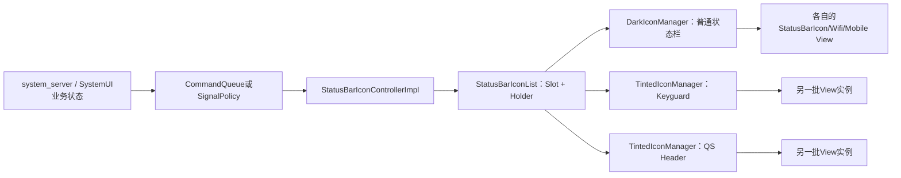
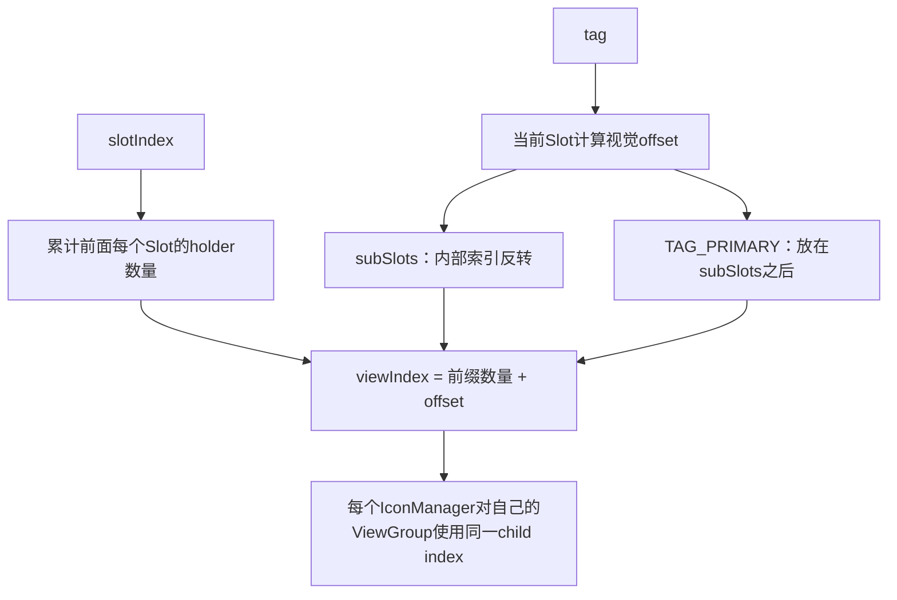
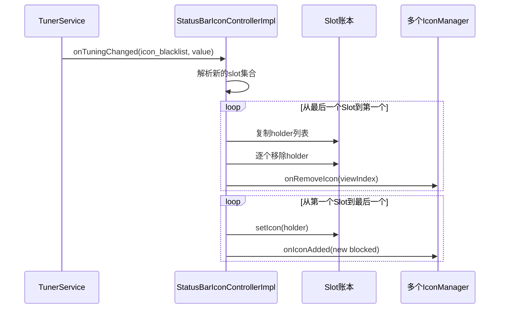

# 第 413 章 Android SystemUI StatusBarIconController：图标槽、IconManager、黑白主题与多容器同步

> 源码基线：Android 11 / API 30 / `android-11.0.0_r48`。本章只在 macOS 上阅读、检索和推演源码，不编译。重点不是记住某个图标资源，而是看懂“状态账本如何投影成多套View”。

## 1. 本章先解决什么问题

状态栏右侧同时出现Wi-Fi、移动网络、闹钟、VPN等图标。锁屏、普通状态栏和Quick Settings头部又可能各有一套容器。若每个容器都各自保存业务状态，很快就会不同步；r48用StatusBarIconController集中保存状态，再把它投影到多个IconManager。

## 2. 一句话心智模型

把StatusBarIconControllerImpl看成“图标仓库加广播站”，把IconManager看成“某个ViewGroup的投影器”，把DarkIconDispatcher或固定tint看成“投影后的上色策略”。

## 3. 本章源码地图

主文件是：

- `StatusBarIconControllerImpl.java`：接收命令、保存状态并通知所有容器；
- `StatusBarIconList.java`：slot、tag和View索引算法；
- `StatusBarIconHolder.java`：统一包装普通、Wi-Fi和移动网络三类状态；
- `StatusBarIconController.java`：接口以及IconManager、DarkIconManager、TintedIconManager；
- `DarkIconDispatcherImpl.java`：按区域和dark intensity计算动态颜色。

## 4. 它运行在哪个进程

这些类都运行在SystemUI进程。来自system_server的系统图标命令先跨Binder到CommandQueue，再由CommandQueue切到SystemUI主线程回调Controller；Controller到IconManager、ViewGroup的后半段不再跨进程。

## 5. 它主要运行在哪个线程

CommandQueue的图标回调、Fragment/View生命周期、Tuner回调和View增删按正常启动路径都在主线程完成。这里没有锁，也没有把mSlots或mIconGroups设计成并发集合，因此源码默认调用者遵守主线程串行约束。

## 6. 为什么需要slot

slot是稳定的逻辑名字，例如`wifi`、`mobile`、`alarm_clock`。业务代码不必知道图标此刻是第几个View，只需说“更新mobile slot”，列表层再把逻辑位置换算成具体child index。

## 7. slot不是View的id

slot是字符串账本键；View id属于布局树。一个slot可暂时没有holder，也可因多SIM拥有多个holder，所以不能把slot简单等同于一个ImageView。

## 8. 三层对象不要混淆

`Slot`回答“哪个逻辑位置”；`StatusBarIconHolder`回答“该位置保存什么状态”；`StatusIconDisplayable`实现类回答“这个状态在某个容器里如何显示”。

## 9. 从输入到像素的总链

前半段更新唯一账本，后半段对每个已注册容器执行同一种增删改事件。每个容器拥有不同View实例，但它们对应同一批holder状态。

## 10. 图一：状态账本到多个容器



## 11. Controller的继承与接口

`StatusBarIconControllerImpl`继承`StatusBarIconList`，又实现Tunable、ConfigurationListener、Dumpable、CommandQueue.Callbacks和StatusBarIconController。继承提供账本算法，接口把调谐、配置、诊断和命令输入汇集到同一个单例。

## 12. Dagger如何暴露它

DependencyBinder用`@Binds`把`StatusBarIconControllerImpl`绑定为`StatusBarIconController`。调用方大多依赖接口，只有Demo分发等少数旧路径向实现类强转。

## 13. 构造函数的第一件事

构造函数读取framework资源`config_statusBarIcons`并传给父类。父类据此按产品定义顺序预建一批空Slot；此时只是有“货架”，还没有图标holder和View。

## 14. 默认slot顺序从哪里来

r48默认数组位于`frameworks/base/core/res/res/values/config.xml`，包含alarm_clock、rotate、VPN、Wi-Fi、mobile、battery等名称。产品overlay可改变该数组，因此不要把索引硬编码为AOSP默认值。

## 15. 构造函数还注册什么

它向ConfigurationController注册密度/字体回调，向CommandQueue注册图标命令回调，并向TunerService注册`icon_blacklist`。TunerService注册时会同步送来当前值，所以黑名单通常在容器建立前已初始化。

## 16. mIconGroups保存什么

`mIconGroups`保存IconManager对象，每个对象绑定一个具体ViewGroup。它不是弱引用，也不自动跟随View生命周期；创建方必须在销毁或detach时调用`removeIconGroup`。

## 17. mIconBlacklist保存什么

它保存被用户调谐或资源默认项屏蔽的slot名字。这里的blocked和holder本身的visible不是同一概念：前者偏向容器展示政策，后者属于图标状态。

## 18. r48中几个看似多余的字段

实现类声明mLightContext、mDarkContext和mIsDark，但本版本没有实际使用；`loadDimens()`也是空方法。阅读旧架构时应以调用和赋值为准，不要根据字段名补出不存在的功能。

## 19. 第一个容器何时出现

CollapsedStatusBarFragment在`onViewCreated`中创建DarkIconManager并注册。Controller可能已经从CommandQueue收到启动快照，因此`addIconGroup`必须把当前全部状态回放给新容器，而不能只监听未来增量。

## 20. 普通状态栏为何用DarkIconManager

普通状态栏背景可能在浅色和深色内容间切换。DarkIconManager让每个新View注册为DarkReceiver，颜色由DarkIconDispatcher根据区域和强度动态更新。

## 21. Keyguard为何用TintedIconManager

KeyguardStatusBarView创建TintedIconManager，并根据锁屏主题计算固定颜色后调用`setTint`。它需要的是该容器统一静态颜色，不是普通状态栏的按区域动态过渡。

## 22. QS Header也是独立投影

QuickStatusBarHeader也创建自己的TintedIconManager，在attach时注册、detach时注销。它与Keyguard即使都使用TintedIconManager，也拥有不同ViewGroup和不同View实例。

## 23. addIconGroup不是只做add

它先把manager追加进mIconGroups，然后遍历所有Slot，再按View顺序遍历holder，计算每个holder的全局viewIndex，并逐个调用`group.onIconAdded`。

## 24. 为什么回放必须按View顺序

同一slot的sub-slot内部存储顺序和视觉顺序相反。如果按内部列表顺序直接addView，初建容器的排列会与增量插入后的排列不一致。

## 25. addIconGroup允许重复吗

源码没有contains检查。同一个IconManager注册两次，会被回放两遍并在列表中出现两次，后续事件也会重复执行，通常造成重复View或索引错误。生命周期配对应由调用方保证。

## 26. removeIconGroup做了两件事

它先调用`group.destroy()`清空该容器，再从mIconGroups移除第一个相等对象。DarkIconManager的destroy还会逐个注销DarkReceiver，避免Dispatcher继续持有旧View。

## 27. 注销不是删除中央状态

removeIconGroup只销毁一个投影，mSlots里的holder仍保留。以后新建容器时，addIconGroup会再次从中央账本恢复完整内容。

## 28. 普通图标如何新增

`setIcon(slot, resourceId, description)`先找tag 0 holder。若不存在，就构造SYSTEM用户、SystemUI包名的StatusBarIcon，包装成Holder并走统一setIcon；若存在，则原地换Icon和描述并发update。

## 29. 为什么普通图标使用tag 0

接口把`TAG_PRIMARY`定义为0，表示slot的主holder。大多数普通系统图标每个slot只有一个，所以无需sub-slot。

## 30. StatusBarIcon来自哪里

有一条兼容路径直接接收CommandQueue传来的`StatusBarIcon`。icon为null时会清空整个slot；非null时包装成Holder。它保留了跨Binder系统图标协议与新统一Holder模型之间的适配层。

## 31. Wi-Fi为何不是普通ImageView状态

Wi-Fi图标可能同时表达信号、进出活动、间隔和可见性，使用`WifiIconState`并创建`StatusBarWifiView`。Controller用TYPE_WIFI holder统一参与slot排序，但IconManager会选择复合View。

## 32. setSignalIcon的空值语义

state为null时删除该slot的tag 0；非空时，若holder不存在则新增，存在则替换Wi-Fi state并更新每个容器。空值是“删除对象”，visible=false只是“对象保留但隐藏”。

## 33. 移动网络为何需要多个holder

多SIM设备可能同时显示多个移动网络状态。它们都属于mobile slot，但各自以subscription id作为tag，因此一个slot里可以有多个TYPE_MOBILE holder。

## 34. Holder如何统一三种类型

Holder的type为TYPE_ICON、TYPE_WIFI或TYPE_MOBILE，分别保存StatusBarIcon、WifiIconState或MobileIconState。`isVisible`和`setVisible`再按type委托到实际状态对象。

## 35. Holder不是不可变值对象

Controller会直接修改Holder内部引用，例如替换icon字段或调用`setMobileState`。随后把同一Holder交给各manager更新。这里靠主线程时序，而不是不可变快照实现一致性。

## 36. setMobileIcons会修改传入列表

方法直接调用`Collections.reverse(iconStates)`，因此会原地反转调用者传入的List。这是容易忽略的副作用；r48的SignalPolicy传入`copyStates`新列表，避免污染自己的mMobileStates。

## 37. 为什么要反转移动网络列表

Slot的视觉规则让先存入的sub-holder更靠右，而SignalPolicy列表通常按期望从左到右排列。先reverse，再逐个set，最终View顺序才回到产品期望。

## 38. setMobileIcons不会主动删缺失tag

它只遍历传入states做新增或更新，没有对账删除旧tag。正常SignalPolicy在订阅集合变化时先`removeAllIconsForSlot(mobile)`，再等待各订阅状态重建，所以完整性依赖上游协议。

## 39. 未知slot会发生什么

`getSlotIndex`找不到名字时，不报错，而是在mSlots索引0插入新Slot。这样扩展图标能工作，但也意味着拼写错误会永久改变本进程内的slot顺序。

## 40. 决定性源码：新增或更新的分流

下面是r48的核心逻辑，先更新中央账本，再决定向所有投影发送add还是set：

```java
public void setIcon(int index, @NonNull StatusBarIconHolder holder) {
    boolean isNew = getIcon(index, holder.getTag()) == null;
    super.setIcon(index, holder);

    if (isNew) {
        addSystemIcon(index, holder);
    } else {
        handleSet(index, holder);
    }
}
```

## 41. super.setIcon究竟做什么

父类只执行`mSlots.get(index).addHolder(holder)`。tag 0覆盖主holder，非0 tag若不存在才追加subSlots；它不创建View，也不知道有多少IconManager。

## 42. 非0 tag已存在时为何仍能更新

公开setIcon先用`getIcon(index, tag)`判断已有holder；移动网络更新路径直接修改找到的旧holder再调用handleSet。若外部直接用一个同tag的新Holder调用setIcon，父类对已存在subtag是no-op，而handleSet却会把传入的新Holder投给View，可能造成账本与View引用不一致；正常生产路径避开了这种用法。

## 43. addSystemIcon如何投影

它取slot名、计算viewIndex、计算blocked，然后对mIconGroups逐个调用`onIconAdded`。每个manager依据Holder type创建自己的StatusBarIconView、StatusBarWifiView或StatusBarMobileView。

## 44. View索引不是slot索引

前面的slot可能为空，也可能含多个holder。因此child index等于“前面所有非空slot的holder数”加“当前slot内该tag的视觉偏移”，不能直接使用slotIndex。

## 45. getViewIndex的前缀计数

算法从0遍历到slotIndex-1，把每个slot的`numberOfIcons()`累加。它的复杂度是O(slot数)，状态栏图标规模很小，所以r48选择简单可读的线性计算。

## 46. 主holder和sub-holder的内部结构

Slot单独保存mHolder作为tag 0主项；其他tag放在mSubSlots ArrayList。主项逻辑优先，但视觉上排在当前slot所有sub-holder之后。

## 47. sub-slot为何倒序显示

注释明确说内部列表升序保存，但View逻辑反向。`getHolderListInViewOrder`从mSubSlots尾部走到头部，最后才追加mHolder。

## 48. 一个手算例子

假设mobile内部subSlots依次为SIM1、SIM2，没有主holder，前面slot共3个图标；视觉顺序是SIM2、SIM1，所以SIM2的child index为3，SIM1为4。

## 49. 新增SIM3时发生什么

内部列表变为SIM1、SIM2、SIM3；SIM3的视觉offset为0，于child index 3插入，旧View自动后移，结果为SIM3、SIM2、SIM1。上游的reverse正是用来控制最终次序。

## 50. 图二：slot、tag与child index换算



## 51. IconManager的职责边界

IconManager负责把Holder翻译成View并插入绑定的ViewGroup。它不保存全局slot账，也不接收Binder；Controller才负责状态和多容器扇出。

## 52. IconManager构造时读取什么

它从group取得Context，并读取framework的`status_bar_icon_size`保存为mIconSize。这个值在构造时固定，普通IconManager自身没有自动重新读取资源的逻辑。

## 53. DisableStateTracker做什么

每个IconManager为group安装DisableStateTracker，监听CommandQueue的`DISABLE2_SYSTEM_ICONS`，按禁用状态控制整个group。它处理的是整组系统图标政策，不是某个slot的visible或blacklist。

## 54. attach监听为何有补偿分支

若创建IconManager时group已经attached，单纯添加OnAttachStateChangeListener会错过过去的attach事件，因此构造函数显式调用tracker的`onViewAttachedToWindow`完成注册。

## 55. addHolder的类型分派

TYPE_ICON调用addIcon，TYPE_WIFI调用addSignalIcon，TYPE_MOBILE调用addMobileIcon。未知type返回null；当前Holder只定义三种类型。

## 56. 普通图标View如何创建

IconManager构造`StatusBarIconView(context, slot, null, blocked)`，调用`view.set(icon)`，再按计算出的index和LayoutParams插入group。

## 57. blocked在哪里生效

blocked只传给StatusBarIconView构造器。Wi-Fi和mobile创建方法没有blocked参数；这些信号图标的屏蔽主要由StatusBarSignalPolicy同时监听blacklist并把状态visible设为false，而不是靠这里统一拦截。

## 58. visible和View.GONE的关系

Controller更新Holder的visible后，manager把状态交给具体View的set/apply方法，由View决定可见性与内部子元素。Controller不直接对所有child调用setVisibility。

## 59. setIconVisibility只处理tag 0

它固定查`getIcon(index, 0)`，所以适用于普通主图标和Wi-Fi主holder，不会逐个切换mobile sub-holder。移动网络可见性包含在每个MobileIconState中。

## 60. 相同visible为何直接返回

若holder不存在或当前可见性已等于目标值，方法不广播更新。这减少无效View操作，也说明调用完成只代表状态无需变化，不代表刚绘制一帧。

## 61. handleSet如何更新多容器

它重新计算目标child index，然后对每个IconManager调用`onSetIconHolder`。Manager按type把状态交给现有同类型View，并不重建View。

## 62. 类型变化是否安全

同一slot/tag若从普通ICON直接变成WIFI，isNew为false，Manager会把现有child强转成StatusBarWifiView，可能崩溃。正常协议要求一个slot/tag的Holder类型稳定；若要换类型，应先remove再add。

## 63. 删除整个slot的顺序

`removeAllIconsForSlot`取得视觉顺序副本，逐个先计算当前viewIndex、再从Slot删除tag、再让每个group删除该index。每删一个后后续索引重新计算，因此能跟随列表收缩。

## 64. 为什么先复制holder列表

如果直接迭代mSubSlots同时删除，会触发迭代结构变化。`getHolderListInViewOrder`返回新ArrayList，允许安全地边遍历副本边修改原Slot。

## 65. removeIcon(index, tag)的特殊算法

单tag版本先从Slot删除，再用`getViewIndex(index, 0)`计算待删child。对主holder和常见调用有效，但对任意subtag并不直观；多SIM订阅集合变化走的是经过验证的整slot删除路径。

## 66. 单删subtag的潜在边界

若内部为[A、B]，视觉为[B、A]：删除A后以剩余数量算出的index 1恰好正确；删除B后同一算法却也得到1，而B原本在index 0，会删错child。公开接口虽允许tag，r48生产主线在订阅变化时使用整slot删除；扩展调用者不能假定任意subtag单删都正确。

## 67. setExternalIcon不是新增图标

它假定slot的tag 0 View已经存在，找到child后把它强转ImageView，改成FIT_CENTER、adjustViewBounds并调整高度。若holder不存在或对应复合View，可能越界或类型错误，所以这是受协议约束的兼容操作。

## 68. 可访问性live region如何设置

Controller遍历slot的所有holder，计算各自viewIndex，再直接访问每个manager的group child设置accessibilityLiveRegion。它假设所有投影结构与中央账本严格同构。

## 69. 多容器同步的真正含义

同步不是共用一个View，也不是DataBinding自动观察，而是Controller按相同索引向所有manager同步发送命令。任一manager异常会中断当前forEach，后面的容器可能收不到该次事件。

## 70. 没有事务和回滚

先更新中央Slot，再逐个改View。若第三个容器addView失败，前两个已改变、中央账本也已改变，源码没有回滚。SystemUI依赖主线程、受控容器和稳定协议把异常概率降到很低。

## 71. 动态黑白主题从哪里开始

LightBarController根据系统栏背景appearance决定图标应该偏亮还是偏暗，并通过LightBarTransitionsController把0到1的dark intensity交给DarkIconDispatcherImpl。

## 72. dark intensity是什么意思

它是颜色插值进度，而不是屏幕亮度。Dispatcher在light-mode icon color与dark-mode icon color之间用ArgbEvaluator计算mIconTint。

## 73. 为什么还需要mTintArea

状态栏背景可能只在部分横向区域为浅色。mTintArea用屏幕逻辑坐标描述应该采用dark tint的区域；具体DarkReceiver结合自己的位置决定使用目标tint还是默认颜色。

## 74. DarkReceiver注册会立即回放

`addDarkReceiver`把receiver放入ArrayMap后，立刻调用一次`onDarkChanged`，传入当前area、intensity和tint。因此刚创建的图标无需等待下一次主题事件就能取得正确颜色。

## 75. applyDark用于什么

普通图标内容更新后，DarkIconManager的`onSetIcon`会调用Dispatcher.applyDark，让这个已有View用当前颜色状态重新应用tint。

## 76. DarkIconManager新增流程

它先通过addHolder创建View，再把返回的View强转为DarkReceiver注册。r48的三种StatusIconDisplayable实现都满足该契约，否则这里会发生ClassCastException。

## 77. DarkIconManager删除流程

删除child前先从Dispatcher移除DarkReceiver，再交给父类removeViewAt。顺序很重要：若只删View不注销，Dispatcher的ArrayMap仍会强引用离屏View。

## 78. destroy为何逐个注销

整个Fragment View销毁时，DarkIconManager遍历现有children注销receiver，然后removeAllViews。这样Controller移除投影的同时也断开颜色分发链。

## 79. TintedIconManager如何新增

它创建View后立即调用`setStaticDrawableColor(mColor)`和`setDecorColor(mColor)`。mColor由拥有该容器的Keyguard或QS代码根据主题主动设置。

## 80. setTint为何遍历全部child

主题变化时，不只未来新增View要用新颜色，已有View也必须更新。setTint先保存mColor，再遍历实现StatusIconDisplayable的child同步drawable与decor颜色。

## 81. 动态dark与固定tint不能混为一谈

DarkIconManager注册到全局Dispatcher，颜色可随区域和动画变化；TintedIconManager只持一个整数颜色，由宿主显式刷新。两者都叫“图标变色”，生命周期和数据源却不同。

## 82. Demo Mode为何属于Manager

Demo展示的是某个容器的演示View，而不是改写真实中央slot账。Controller把demo命令发给可demo的manager，各manager在自己的LinearLayout内创建DemoStatusIcons覆盖层。

## 83. Demo进入条件

收到非EXIT命令且mDemoStatusIcons为空时，Manager创建demo对象并标记mIsInDemoMode。后续真实Wi-Fi/mobile增删还会同步给demo对象，维持演示结构所需的对应关系。

## 84. Demo退出边界

EXIT时先让demo对象处理命令，再remove并置null。DarkIconManager还要把DemoStatusIcons从DarkIconDispatcher注销；否则会留下颜色receiver。

## 85. mDemoable控制什么

某个Manager可用`setIsDemoable(false)`拒绝演示命令。Controller分发前也检查isDemoable；这不影响真实系统图标继续同步。

## 86. blacklist的默认值

若Tuner值为null，`getIconBlacklist`读取SystemUI资源`config_statusBarIconBlackList`；r48默认含rotate和headset。若有字符串值，则按逗号split并忽略空项。

## 87. 空字符串与null不一样

null表示采用资源默认黑名单；空字符串split后没有有效slot，表示用户显式不屏蔽任何项。这种“缺省”和“空集合”的差异在设置迁移时很重要。

## 88. blacklist变化为何全量重建

已创建StatusBarIconView把blocked保存为构造参数语义，简单更新holder不能改变这一属性。Controller因此先保留所有Holder，删除所有slot View，再按新blocked值重新add。

## 89. 重建的第一阶段

它从最后一个Slot向前遍历，把每个Slot的`getHolderList()`副本存进ArrayMap，然后调用removeAllIconsForSlot。倒序处理可减少对前面视觉索引变化的干扰。

## 90. 重建的第二阶段

再从第一个Slot向后遍历保存的holder，并逐个调用统一setIcon。中央slot顺序没有被删除，只有holder被剥离和重新装回；所有投影View会重新创建。

## 91. 图三：blacklist变化的重建时序



## 92. 重建期间有短暂空窗吗

同一主线程调用栈中，所有旧View先被移除，再全部加入。通常Choreographer不会在调用栈中间绘制一帧，但源码没有事务容器；布局、可访问性或异常观察仍可能看到中间状态。

## 93. holder列表的两种顺序

`getHolderList()`返回主holder再接内部subSlots，用于保存和重新set；`getHolderListInViewOrder()`返回反向subSlots再主holder，用于按child顺序遍历。名字相近，目的不同。

## 94. 黑名单重建是否复制状态对象

没有深拷贝。ArrayMap保存Holder引用，随后同一批Holder重新插入Slot。主线程内这样能保留状态，但若外部并发修改对象就没有隔离保证。

## 95. 密度变化处理是否完整

实现类收到`onDensityOrFontScaleChanged`后只调用空的`loadDimens()`；它没有遍历mIconGroups调用Manager同名方法。Manager虽然定义了重设LayoutParams的方法，但本类主线没有调用它。

## 96. Manager的mIconSize会重新读取吗

mIconSize是构造时final字段。即便直接调用Manager的density方法，它也会用旧mIconSize创建新LayoutParams。具体宿主View可能通过重建Fragment/View取得新资源；不能把这个空回调误写成完整热更新。

## 97. DarkIconManager的padding也会过期吗

mIconHPadding同样在构造时读取，之后没有配置回调刷新。View重建时会重新读取；若产品要求不重建情况下即时变化，需要额外实现和验证。

## 98. dump能看到什么

Controller只打印shouldLog为true的IconManager容器及其StatusIconDisplayable children，然后调用父类dump打印所有slot及sub-slot数量。普通CollapsedStatusBarFragment把DarkIconManager标记为shouldLog。

## 99. dump看不到什么

它不打印每个Manager的生命周期来源，也不直接打印blacklist、dark receiver表或最近事件时序。颜色问题还要结合DarkIconDispatcher dump，业务状态问题还要看SignalPolicy/CommandQueue。

## 100. 排查“一个容器缺图标”

若中央slot有holder且其他容器正常，优先查目标View是否调用addIconGroup、是否被重复remove、child结构是否已失配，以及Manager是否在某次异常后漏掉增量。

## 101. 排查“所有容器都缺图标”

先查上游是否调用setIcon/setSignalIcon/setMobileIcons，再查holder visible、Tuner blacklist和DISABLE2_SYSTEM_ICONS。所有容器同时异常更像中央状态或全局政策问题。

## 102. 排查“颜色不对”

普通状态栏查DarkIconDispatcher的mTintArea、mDarkIntensity、receiver注册；Keyguard/QS查TintedIconManager宿主是否调用setTint。不要只看图标资源本身。

## 103. 排查“顺序不对”

先区分slot顺序与同slot tag顺序。前者来自config_statusBarIcons和未知slot头插；后者来自subSlots内部追加、视觉反转，以及setMobileIcons对输入列表的原地reverse。

## 104. 排查“更新后类型崩溃”

检查同一slot/tag是否从ICON换成WIFI或MOBILE而未先删除。handleSet假定已有child类型与新Holder type一致，并直接强转。

## 105. 排查“detach后仍泄漏”

确认宿主在onDestroyView/onDetachedFromWindow调用removeIconGroup。DarkManager还必须执行destroy才能注销所有DarkReceiver；只从View树移除group并不足够。

## 106. Controller的四类可见性政策

至少要分清：Holder state的visible、普通StatusBarIconView的blocked、整组DISABLE2_SYSTEM_ICONS、容器或父布局自身visibility。它们可叠加，任何一层都可能让像素不可见。

## 107. add完成是否等于屏幕已显示

不等于。addView只修改当前ViewGroup树并请求后续layout/draw；是否已经过下一次测量、绘制、Surface合成，还要用帧或截图证据判断。

## 108. 本章的进程边界

system_server下发StatusBarIcon时有Binder边界；CommandQueue之后的Controller、Slot、Manager、View都在SystemUI进程。SignalPolicy产生Wi-Fi/mobile状态时，后半链甚至完全是SystemUI进程内调用。

## 109. 本章的线程边界

Binder线程收到命令后由CommandQueue Handler投主线程；主线程内再同步遍历mIconGroups。Dark color动画也通过UI时序更新receiver。源码没有为后台直接setIcon提供保护。

## 110. 最值得记住的不变量

正常情况下，每个已注册IconManager的child数量、类型和顺序都应是中央Slot中所有holder的同构投影。Controller的viewIndex算法和成对生命周期调用共同维护这个不变量。

## 111. 阅读本章后的自测

你应该能回答：为什么一个mobile slot能有多个View；为什么新创建Keyguard容器能立刻出现旧图标；为什么blacklist变化要重建；为什么普通状态栏和锁屏颜色链不同；为什么slotIndex不能直接当child index。

## 112. macOS只读练习一：手算slot到View索引

只使用`rg`和`sed`打开`StatusBarIconList.java`。假设前两个slot分别有1、2个holder，第三个slot内部subSlots为A、B且主holder为P，写出第三个slot的视觉顺序以及A、B、P的全局child index，再用`viewIndexOffsetForTag`逐项验证。

## 113. macOS只读练习二：追踪新增容器的状态回放

从CollapsedStatusBarFragment的`onViewCreated`找到DarkIconManager注册点，再进入`addIconGroup`，记录Slot遍历顺序、holder列表顺序、blocked计算和onIconAdded最终创建的三种View。整个过程只阅读，不运行、不改源码。

## 114. macOS只读练习三：推演黑名单切换

选一个已有普通ICON holder和一个mobile sub-holder，逐行推演`onTuningChanged`的“保存—全删—重加”。特别标出blocked参数在哪种View构造中被使用，以及SignalPolicy为什么还要自己监听blacklist。

## 115. macOS只读练习四：比较两条着色链

分别从CollapsedStatusBarFragment和KeyguardStatusBarView找到Manager创建点，画出DarkIconManager→DarkIconDispatcher与TintedIconManager→setTint两条调用链。记录receiver即时回放、detach清理和主题更新触发方式的差异。

## 116. 易错点一：一个slot永远只有一个View

错误。tag 0是主holder，非0 tag形成subSlots；mobile用subId作tag，一个mobile slot可投影为多个StatusBarMobileView。

## 117. 易错点二：多个界面复用同一个图标View

错误。Controller复用的是中央Holder状态，每个IconManager都为自己的ViewGroup创建独立View。Android View也不能同时拥有多个parent。

## 118. 易错点三：黑白主题由Controller直接改颜色

错误。Controller负责状态和结构扇出；普通状态栏由DarkIconDispatcher按区域/强度着色，Keyguard与QS多由TintedIconManager接受宿主的固定颜色。

## 119. 复读源码后的修正

复读r48后，本章删掉了“配置变化会完整刷新所有Manager尺寸”的想当然描述：实现类回调只进入空loadDimens，Manager尺寸还是构造时值。又补充了未知slot头插、addIconGroup无去重、setMobileIcons原地reverse且不删除缺失tag、类型更新必须稳定、黑名单对复合信号View并非统一blocked拦截，以及单删subtag算法需要谨慎推演等版本边界。

## 120. 本章结论

StatusBarIconController的核心不是“画一个小图标”，而是维护`slot + tag + holder`唯一账本，并以精确child index同步投影到普通状态栏、锁屏和QS等多个容器。把状态、结构、可见性政策和着色策略四层分开，才能定位“缺图标、错顺序、颜色错或生命周期泄漏”。下一章进入StatusBarSignalPolicy，追Wi-Fi、移动网络、飞行模式、以太网与黑名单如何生成这些Holder状态。
