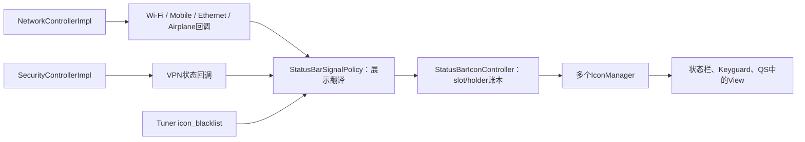
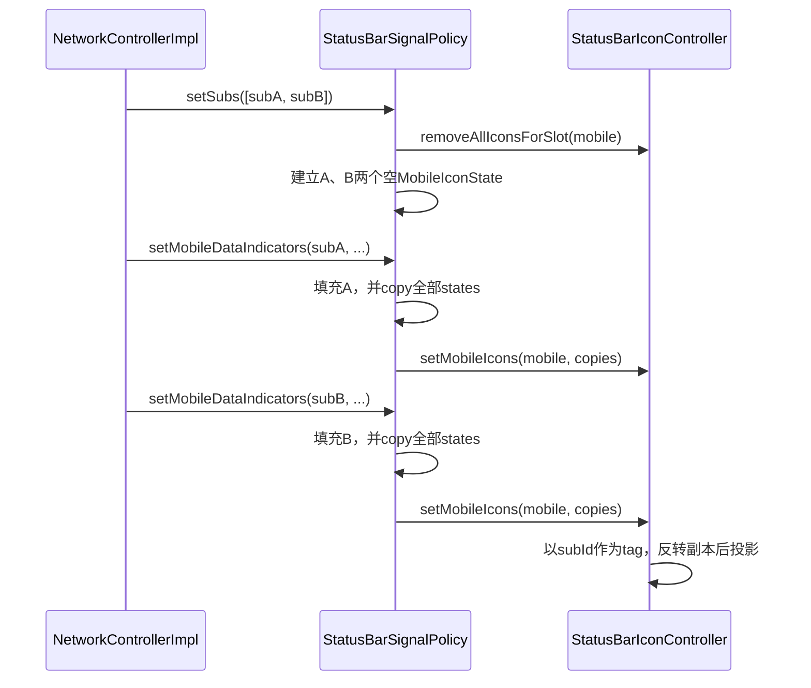
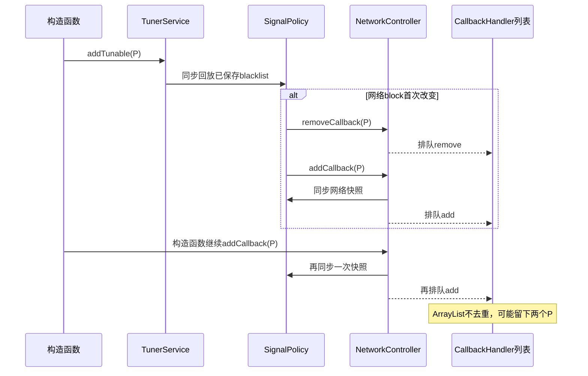

# 第 414 章 Android SystemUI StatusBarSignalPolicy：网络、Wi-Fi、移动网络、VPN与飞行模式图标

> 源码基线：Android 11 / API 30 / `android-11.0.0_r48`。本章只在 macOS 阅读和推演源码，不编译。上一章研究“图标账本怎样投影到View”，本章研究“网络状态怎样被翻译成账本输入”。

## 1. 本章要回答的核心问题

Wi-Fi、移动网络、以太网、飞行模式和VPN来自不同Controller，为何最后能进入同一个状态栏图标体系？StatusBarSignalPolicy就是适配层：它接收上游回调，套用黑名单和展示政策，构造IconState，再调用StatusBarIconController。

## 2. 一句话心智模型

NetworkController和SecurityController负责“知道网络/安全事实”，SignalPolicy负责“把事实翻译成状态栏表达”，IconController负责“保存并投影表达”。

## 3. 不要被Policy这个词误导

它不是system_server的Window policy，也不管理真实网络连接；它只运行在SystemUI进程，为状态栏信号图标做展示决策。

## 4. 本章主文件

主文件是`StatusBarSignalPolicy.java`，上游要配合阅读`NetworkControllerImpl.java`、`CallbackHandler.java`、WifiSignalController、MobileSignalController、EthernetSignalController和SecurityControllerImpl；下游仍是上一章的StatusBarIconController。

## 5. 对象在哪里创建

StatusBar在启动后段执行`new StatusBarSignalPolicy(mContext, mIconController)`。它发生在IconPolicy初始化之后、Keyguard启动之前，生命周期通常与长寿命StatusBar实例一致。

## 6. 它运行在哪个进程

全部Policy代码运行于SystemUI进程。Connectivity、Telephony和VPN事实可能来自更底层服务或系统回调，但到达本类时已经经过各Controller封装。

## 7. 它主要运行在哪个线程

NetworkController未来增量经CallbackHandler主Looper分发；构造时的NetworkController.addCallback初始快照则在调用线程同步执行，正常是SystemUI主线程。SecurityController回调可能来自不同线程，本类显式post到主Handler更新VPN。

## 8. 五个slot

构造函数从framework字符串资源取得airplane、mobile、wifi、ethernet和vpn五个slot名。它们必须与StatusBarIconList的配置及其他图标生产者使用的名字一致。

## 9. 两类上游

Wi-Fi、移动网络、以太网和飞行模式来自NetworkController.SignalCallback；VPN来自SecurityControllerCallback。它们不会共享同一份原始状态，但最终都调用IconController。

## 10. 图一：从事实到View的分层



## 11. 构造函数保存哪些依赖

显式参数只有Context和StatusBarIconController；NetworkController与SecurityController通过旧Dependency容器取得。随后还从TunerService注册黑名单回调。

## 12. config_showActivity

`mActivityEnabled`在构造时读取SystemUI布尔资源`config_showActivity`，决定是否显示网络收发小箭头。r48默认值是false，产品overlay可以打开。

## 13. 这个资源会动态刷新吗

不会。本类不是ConfigurationListener，mActivityEnabled只在构造时读取一次。若运行期overlay或配置变化不重建Policy，旧值继续使用。

## 14. 构造注册顺序

顺序是：先addTunable，再NetworkController.addCallback，最后SecurityController.addCallback。addTunable会同步回调当前值，这个顺序对后面讨论的重复注册边界很关键。

## 15. destroy负责什么

destroy从TunerService、NetworkController和SecurityController分别注销。StatusBar生产主线没有调用mSignalPolicy.destroy，因为对象预期与StatusBar同寿；测试或替换生命周期仍应显式清理。

## 16. NetworkController.addCallback不是纯注册

它先同步调用setSubs、setIsAirplaneMode、setNoSims，再让Wi-Fi、Ethernet和每个MobileSignalController同步notify当前快照，最后才通过CallbackHandler异步把listener加入未来增量列表。

## 17. 为什么初始页面能马上有图标

因为addCallback在返回前直接回放当前网络快照，不必等待下一次广播或网络变化。SignalPolicy会立即把这些快照写入IconController。

## 18. 初始回放和增量分发线程不同吗

API没有统一强制：初始回放就在addCallback调用线程；增量由CallbackHandler的主Looper执行。StatusBar在主线程构造Policy，所以正常路径最终都落在主线程，但扩展调用者仍需知道这个区别。

## 19. CallbackHandler如何保存监听者

r48用ArrayList保存SignalCallback，MSG_ADD_REMOVE_SIGNAL处理时直接add或remove，没有contains去重。remove只移除第一个相等项。

## 20. 注册窗口不是原子事务

快照同步回放完成后，“加入未来监听列表”的Message才排队。若状态事件已在队列中或恰好落在快照与注册之间，存在排序窗口；通常后续状态会收敛，但不能把addCallback当成带generation的原子订阅。

## 21. Tuner黑名单在本类做什么

它只关心airplane、mobile、wifi和ethernet四个slot，分别更新mBlock字段；没有mBlockVpn，VPN的blacklist主要由IconController对普通StatusBarIconView的blocked政策处理。

## 22. 为什么改变黑名单要重注册NetworkController

本类不缓存所有上游原始IconState。block位改变后，它通过removeCallback再addCallback，借助addCallback的同步快照重新计算所有网络图标。

## 23. 重注册并不销毁Policy

只是短暂从NetworkController未来回调列表移除再加入；Tuner和Security监听保持不变，mMobileStates与mWifiIconState也仍在同一个对象中。

## 24. 启动时的重复注册边界

若持久Tuner值在构造同步回调时首次把某个网络block从false改成true，onTuningChanged会先执行一次remove/add；构造函数随后又无条件addCallback一次。CallbackHandler不去重，队列最终可能保存同一个Policy两次。

## 25. 重复注册的后果

未来每个网络事件可能回调两次；一次remove只删掉一个副本，destroy也可能残留另一个。默认r48 blacklist只有rotate和headset，通常不触发，但用户已保存wifi/mobile等屏蔽项时值得警惕。

## 26. mForceBlockWifi是什么

字段参与`mBlockWifi = blockWifi || mForceBlockWifi`，但r48本类没有任何赋值或setter，所以始终是默认false。它是版本残留或预留，不能据此声称存在额外强制策略。

## 27. mWifiVisible是什么

字段声明后没有读写，也是无效残留。真实Wi-Fi可见性保存在mWifiIconState.visible，而不是mWifiVisible。

## 28. Wi-Fi回调参数很多

setWifiIndicators收到enabled、状态栏IconState、QS IconState、收发活动、description、transient和label。本类只消费状态栏IconState、活动；enabled、qsIcon、description、isTransient、statusLabel没有参与状态栏输出。

## 29. Wi-Fi的基础visible

`visible = statusIcon.visible && !mBlockWifi`。既要上游认为应显示，也要本Policy未屏蔽。

## 30. Wi-Fi活动箭头

activityIn/out还要同时满足mActivityEnabled和visible。隐藏Wi-Fi时活动箭头也被强制false，避免复合View内部残留活动提示。

## 31. 为什么先copy旧WifiIconState

本类把信号状态当近似值对象：从旧状态copy出newState，再覆盖本次字段，最后整体交给Controller并把mWifiIconState指向新对象。这样已经交给View的旧引用不会被中途改写。

## 32. Wi-Fi state保存哪些字段

包括visible、resId、activityIn/out、slot、contentDescription，以及airplaneSpacerVisible和signalSpacerVisible两个纯布局字段。

## 33. airplaneSpacerVisible的来源

它取mIsAirplaneMode，告诉StatusBarWifiView是否在Wi-Fi图标旁保留飞行模式间隔。它不表示Wi-Fi本身是否开启。

## 34. signalSpacerVisible的来源

它只检查mMobileStates中的第一项：若存在且typeId不为0，就显示Wi-Fi与移动网络数据类型图标之间的间隔。

## 35. 为什么只看第一张SIM

这是r48布局约定，不是完整网络真相。mMobileStates顺序来自订阅列表，StatusBarIconController又会反转视觉投影，因此“first”是Policy协议中的参考项。

## 36. Wi-Fi何时创建Holder

只有`state.visible && state.resId > 0`时，updateWifiIconWithState才调用setSignalIcon，随后setIconVisibility(true)。否则只调用setIconVisibility(false)。

## 37. 首次回调就是隐藏会怎样

若IconController里尚无Wi-Fi holder，setIconVisibility(false)会直接返回，所以不会创建空View；但Policy仍保存mWifiIconState，后续变为可见时再创建。

## 38. 隐藏是否删除holder

不会。已有holder只把visible改为false，保留View和状态位置。这样再次显示时可以原地更新，减少结构重建。

## 39. resId为0的意义

即使visible为true，只要resId不大于0，本Policy仍走隐藏分支。可见状态和有效drawable必须同时成立。

## 40. 决定性源码：Wi-Fi的布局附加状态

```java
WifiIconState newState = mWifiIconState.copy();
newState.visible = statusIcon.visible && !mBlockWifi;
newState.resId = statusIcon.icon;
newState.airplaneSpacerVisible = mIsAirplaneMode;
MobileIconState first = getFirstMobileState();
newState.signalSpacerVisible = first != null && first.typeId != 0;
updateWifiIconWithState(newState);
mWifiIconState = newState;
```

## 41. 飞行模式回调做什么

setIsAirplaneMode计算`icon.visible && !mBlockAirplane`保存到mIsAirplaneMode。若结果为true且resId有效，就设置airplane普通图标并显示，否则隐藏已有图标。

## 42. 飞行模式变化会立即更新Wi-Fi间隔吗

不会。本方法没有复制并重发mWifiIconState；airplaneSpacerVisible要等下一次setWifiIndicators才重算。上游通常会连带刷新网络状态，但源码本身存在短暂陈旧窗口。

## 43. setSubs为何先于移动数据状态

NetworkController.addCallback明确先发送订阅列表，再逐个MobileSignalController notify。Policy必须先建立以subId为键的MobileIconState骨架，后续数据回调才能找到目标。

## 44. hasCorrectSubs比较什么

它同时比较数量和每个位置的subscription id。ID集合相同但顺序变化也被视为不同，会清空并重建mobile slot。

## 45. 订阅变化的清理顺序

先让IconController删除mobile slot所有holder和View，再清空mMobileStates，最后按新订阅顺序创建只有subId的空MobileIconState。

## 46. setSubs为何不立即画新图标

注释依赖上游协议：setSubs之后应紧接setMobileDataIndicators。空State尚无信号强度和可见性，因此这里只拆旧结构并准备新骨架。

## 47. 如果后续数据回调没来

mobile图标会保持为空。源码没有超时、重试或从旧订阅继承状态；完整性依赖NetworkController回调序列。

## 48. 未知subId如何处理

getState线性查找，找不到就Log.e并直接返回，不自动创建。这样避免迟到的旧订阅事件污染新列表，但该次状态会丢弃。

## 49. 移动网络回调的状态映射

visible取statusIcon.visible且未block；strengthId取statusIcon.icon；typeId取statusType；还保存内容描述、数据类型描述、roaming和活动方向。

## 50. 图二：订阅列表与移动图标重建



## 51. 为什么每次发送全部MobileStates

一个subId变化后，Policy调用`MobileIconState.copyStates(mMobileStates)`发送完整列表。下游以subId新增或更新，可保持多SIM整体顺序。

## 52. 为什么必须深复制每个state

mMobileStates是Policy继续原地修改的工作集。复制后交给IconController，避免下一次回调提前改变当前View所引用的对象，源码注释称其为value type semantics。

## 53. Controller还会反转这个List

上一章确认setMobileIcons会原地reverse输入。这里传的是新建copy列表，所以Policy内部mMobileStates顺序不受影响；若直接传工作列表，第一张SIM语义会被破坏。

## 54. typeChanged并非任意类型变化

它只在statusType从0变非0或从非0变0时为true。LTE切到5G若两者resId都非0，不会触发Wi-Fi spacer重算，因为间隔只关心“有没有数据类型图标”。

## 55. 为什么mobile变化要更新Wi-Fi

Wi-Fi的signalSpacerVisible取决于第一张SIM的typeId。第一张SIM的类型从无到有或从有到无时，需要复制当前Wi-Fi state并重新投影。

## 56. Objects.equals避免什么

重算后的Wi-Fi copy若与旧state完全相等，就不调用IconController，避免无意义更新。WifiIconState.equals包含父类字段、resId和两个spacer字段。

## 57. mobile活动箭头的门槛

activityIn/out只与上游活动值和mActivityEnabled相与，没有再与state.visible相与。整个MobileView隐藏时内部箭头虽可能保存true，但不会产生可见像素；这与Wi-Fi的写法不完全一致。

## 58. mobile使用哪些回调参数

状态栏使用statusIcon、statusType、activity、typeContentDescription、subId、roaming；qsIcon、qsType、HTML描述、网络description和isWide在本类不参与输出。

## 59. needsLeadingPadding是否被赋值

MobileIconState定义、copy、equals和hashCode都包含它，但r48 StatusBarSignalPolicy没有给它赋值，保持false，是另一个版本残留字段。

## 60. 移动网络可见性由几层决定

上游statusIcon.visible已考虑radio/airplane等网络事实；Policy再应用mBlockMobile；下游还有IconController、IconManager整组disable和父View可见性。

## 61. Ethernet输入来自哪里

EthernetSignalController根据当前网络是否connected构造IconState，并用getCurrentIconId给出资源。它通过NetworkController和CallbackHandler到达Policy。

## 62. Ethernet方法中的反直觉代码

方法计算`visible = state.visible && !mBlockEthernet`，但后面完全没有使用这个局部变量；只要resId>0就setIcon并setIconVisibility(true)，否则隐藏。

## 63. 这一定造成用户可见错误吗

不一定。正常EthernetSignalController在不可显示时通常给出0资源，且IconController自身blacklist会把普通StatusBarIconView标为blocked，所以两层协议常掩盖这个疏漏。但本方法单独看确实忽略state.visible和mBlockEthernet。

## 64. 扩展上游为何要小心

若自定义Ethernet回调传`visible=false`但仍给正resId，本Policy会要求显示。不能只看计算出的visible变量猜测行为，必须继续读控制流。

## 65. VPN为何来自SecurityController

VPN是否启用、是否品牌化与当前用户/工作资料安全状态有关，SecurityController已经维护这些信息；SignalPolicy不直接查询ConnectivityManager。

## 66. VPN更新分两步

updateVpn先选品牌VPN或普通VPN资源，无论是否可见都setIcon确保holder存在，然后setIconVisibility(vpnVisible)。

## 67. VPN为什么先set再hide

即便当前VPN关闭，也预先建立带正确资源和可访问性描述的主holder，再将visible设false；以后开启时可原地显示。

## 68. Security回调为何post主线程

SecurityController.fireCallbacks可能由网络回调或后台状态刷新触发，而且持有mCallbacks锁遍历。Policy的onStateChanged只post updateVpn，既切到UI线程，也避免在Security锁内同步反查其状态。

## 69. VPN事件是否合并

没有removeCallbacks或序号。连续多次onStateChanged会排多个Runnable；每个Runnable执行时读取SecurityController“当前值”，所以通常重复收敛到最新状态，而不是重放每次历史快照。

## 70. VPN注册有初值回放吗

SecurityControllerImpl.addCallback只去重并加入列表，不主动调用onStateChanged；Policy构造也没有显式updateVpn。因此VPN初值要等下一次Security事件，r48存在启动期暂不建立VPN holder的窗口。

## 71. VPN为什么没有mBlockVpn

它是普通StatusBarIcon，Controller自己的icon_blacklist重建会把vpn slot的StatusBarIconView构造为blocked。本Policy没有重复实现这一层。

## 72. airplane和ethernet为何又有block字段

历史实现对不同图标路径保留了重复政策：Policy可不生成/隐藏，Controller又能对普通Icon应用blocked。重复不代表两层行为完全等价，调试时要分别检查。

## 73. setNoSims做什么

r48实现明确no-op。无SIM提示不通过本类生成独立状态栏系统图标，不能从接口存在推断页面一定显示一个No SIM图标。

## 74. setMobileDataEnabled做什么

同样no-op。移动数据总开关变化会通过MobileSignalController的实际状态更新间接反映，本类不单独画开关图标。

## 75. SignalIconState的公共字段

它保存visible、activityOut、activityIn、slot和contentDescription，并提供copyTo、equals和hashCode基础实现。Wi-Fi与Mobile在其上添加各自字段。

## 76. equals为何不先判断this==o

注释说希望把它当值类型，即使同一引用也按字段比较。缺少引用快速路径只影响性能，不改变相等语义。

## 77. hashCode少字段是不是契约错误

父类hash只用了visible、activityOut和slot，遗漏activityIn与description会增加碰撞，但相等对象仍一定有相同hash，因此没有违反Java基本契约。

## 78. WifiIconState.copy是否完整

先由父类copyTo复制共通字段，再复制resId与两个spacer布尔值；r48当前字段都覆盖。

## 79. MobileIconState.copy是否完整

创建同subId对象，再复制父类字段、strengthId、typeId、roaming、needsLeadingPadding和类型内容描述。工作状态与下游状态因此分离。

## 80. 这些状态是不是Parcelable

不是。它们只在SystemUI进程内从Policy传到IconController和View，不需要Binder序列化。上游跨进程细节已由NetworkController等层消化。

## 81. blacklist变化的正常刷新链

Tuner同步送新值，Policy更新block字段，remove/add Network callback；add立即回放订阅、飞行模式、Wi-Fi、Ethernet、Mobile当前状态，从而按新block重新生成图标。

## 82. Controller也同时监听同一Tuner key

StatusBarIconControllerImpl会全删全加所有holder以更新blocked；SignalPolicy会重取网络快照。两个listener的调用顺序影响中间增删次数，但主线程结束后目标是收敛到新政策。

## 83. 这两个listener组成事务吗

不是。它们分别操作账本、View和网络回调，没有统一锁、批次号或完成回调。异常或重复注册可能让中间状态和最终次数偏离理想路径。

## 84. mIsAirplaneMode只跟踪展示状态

它已包含`!mBlockAirplane`，所以含义是“飞行模式图标应显示”，不一定等同设备真实airplane setting。它被用于Wi-Fi spacer，黑名单也会影响布局间隔。

## 85. 第一张SIM也只是展示状态

getFirstMobileState取Policy列表第一个对象，其typeId来自最近一次该subId回调。若新setSubs后第一张SIM数据回调尚未来，typeId暂为0，Wi-Fi spacer可能暂时隐藏。

## 86. 回调异常如何传播

CallbackHandler遍历ArrayList时没有对每个SignalCallback try/catch；某listener异常可能中断本轮后续listener。SignalPolicy内部调用IconController异常也不会在本类回滚。

## 87. 回调列表可重复意味着什么

除构造边界外，任何调用方重复addCallback都可能收到重复增量。StatusBarSignalPolicy自身的onTuningChanged重注册假设remove与add严格配平，但ArrayList并不替它维护集合不变量。

## 88. destroy也不是同步屏障

NetworkController.removeCallback只向CallbackHandler发Message；此前已排队的状态Runnable可能仍执行，监听移除也要等主队列处理。Tuner和Security注销则有各自实现语义。

## 89. 网络状态更新等于像素完成吗

不等于。Policy同步调用IconController只更新holder和View属性；layout、draw、Surface提交与屏幕合成发生在后续帧。

## 90. 五条输出链的共同模板

上游IconState → 应用block/资源有效性 → 构造或更新slot状态 → IconController广播给多个Manager。mobile与Wi-Fi用复合Holder，airplane/ethernet/VPN用普通StatusBarIcon。

## 91. 图三：Tuner重注册与重复注册窗口



## 92. 排查Wi-Fi不显示

依次查statusIcon.visible、statusIcon.icon是否大于0、mBlockWifi、Holder visible、IconController blacklist、DISABLE2_SYSTEM_ICONS和目标容器。只看Wi-Fi enabled参数不够，因为本类根本没使用它。

## 93. 排查Wi-Fi旁间距错误

查mIsAirplaneMode是否已更新、之后是否又收到Wi-Fi回调、第一张MobileIconState.typeId是否为0，以及setSubs后mobile数据回调是否齐全。

## 94. 排查多SIM顺序错误

先看NetworkController订阅列表顺序，再看Policy mMobileStates顺序，再记住IconController对copy列表原地reverse以及Slot视觉反序。不要只凭subId数值排序猜测。

## 95. 排查某张SIM不更新

查setSubs是否先建立该subId，随后getState是否打印Unexpected subscription；迟到旧事件会被丢弃，新事件若早于订阅列表也同样丢弃。

## 96. 排查VPN启动后暂时缺失

查SecurityController在Policy注册后是否触发onStateChanged，以及主Handler中的updateVpn是否执行。addCallback本身不会回放VPN初值。

## 97. 排查网络回调次数翻倍

检查启动时icon_blacklist是否已包含wifi/mobile/airplane/ethernet，跟踪构造中的Tuner同步回调和两次Network addCallback，再看CallbackHandler mSignalCallbacks是否重复。

## 98. 排查Ethernet可见性异常

同时记录state.visible与state.icon。r48方法算了visible却只按resId分支；还要确认IconController blocked是否最终把View隐藏。

## 99. dump能直接看到Policy吗

本类未实现Dumpable，也没有自己的dump。需组合NetworkController dump、StatusBarIconController dump、Tuner值和日志推断状态；重复callback则可用临时断点或代码阅读确认。

## 100. 为什么本类状态“尽量少”

注释明确只为padding追踪少量状态。网络事实仍由上游Controller权威保存，本类通过重新注册获取快照，而不是复制一整套网络状态机。

## 101. 少状态的优点

降低重复业务逻辑和陈旧缓存范围，Policy只关注展示字段；例如VPN每次Runnable都向SecurityController读取当前值。

## 102. 少状态的代价

黑名单变化要通过重注册刷新；Wi-Fi spacer依赖几个局部缓存和回调顺序；没有初值回放的Security链会留下启动窗口。

## 103. 本章的进程边界

Policy本身到IconController没有进程切换。更早的Connectivity/Telephony/VPN数据可能跨服务边界，但已经由对应Controller封装；不要把每个Policy方法都标成Binder入口。

## 104. 本章的线程边界

Network增量通常由CallbackHandler投主线程，Security回调由Policy再post主Handler。初始Network快照是同步直调；remove/add监听本身又通过Message异步生效。

## 105. 本章的输入输出

输入是Tuner字符串、Network IconState/订阅快照、Security VPN状态；输出是五个slot的普通或复合Holder更新，以及Wi-Fi布局spacer状态。

## 106. 最重要的职责边界

SignalPolicy不决定网络是否真的连接，IconController也不决定；上游Controller给事实，本类做状态栏语义，下游负责结构、颜色和绘制。

## 107. 最重要的时序边界

初始快照、监听加入、Tuner同步回放和异步增量不是一个原子步骤。理解队列顺序比只读方法名更能解释重复、短暂陈旧和漏事件窗口。

## 108. 最重要的值语义边界

Wi-Fi用copy-on-update，mobile每次深复制完整列表，再由IconController反转副本。这里刻意避免共享可变工作状态，但Holder和View层仍有自己的可变对象。

## 109. 最重要的布局边界

airplaneSpacerVisible与signalSpacerVisible不是网络事实，而是复合Wi-Fi View为了相邻图标对齐保存的展示状态。

## 110. 最重要的版本边界

r48存在未使用的mWifiVisible、未赋值的mForceBlockWifi与needsLeadingPadding、Ethernet visible局部量未消费、Security注册无VPN初值回放等历史痕迹；后续Android版本可能已重构，不能跨版本套结论。

## 111. 阅读本章后的自测

你应能解释：为何setSubs只建骨架；为何mobile要复制列表；为何第一张SIM影响Wi-Fi间隔；为何VPN要post主线程；为何Tuner回调可能造成重复Network注册；为何Ethernet的visible变量不能证明它会隐藏。

## 112. macOS只读练习一：还原初始回放顺序

用`rg`和`sed`从StatusBar构造SignalPolicy进入NetworkControllerImpl.addCallback，按顺序记录setSubs、airplane、noSims、Wi-Fi、Ethernet、各Mobile和setListening。标出同步调用与Handler排队的分界，不运行代码。

## 113. macOS只读练习二：手推双SIM与Wi-Fi间隔

假设订阅[A、B]，先让A的typeId从0变LTE，再让B变5G，写出每一步mMobileStates、发给IconController的copy顺序、Controller反转后的视觉顺序，以及何时会重发WifiIconState。

## 114. macOS只读练习三：复现重复注册推演

假设启动前Tuner的icon_blacklist已含wifi，从构造addTunable开始，列出CallbackHandler队列中的remove、add、add三条消息，并在依次处理后写出mSignalCallbacks内容。再推演一次destroy为何可能只删一个副本。

## 115. macOS只读练习四：核对五类可见性

分别为Wi-Fi、mobile、airplane、ethernet、VPN建立表格，记录上游visible、block字段、resId门槛、Holder类型和最终下游政策。重点用源码证明Ethernet计算的visible没有进入分支、VPN没有初值回放。

## 116. 易错点一：SignalPolicy负责监听真实网络硬件

错误。它监听的是NetworkController和SecurityController提供的高层回调，不直接管理Wi-Fi、Telephony、Ethernet或VPN连接。

## 117. 易错点二：addCallback只是把listener放进列表

错误。NetworkControllerImpl会先同步回放整套当前快照，最后才异步把listener加入CallbackHandler列表，这个顺序既提供初值也产生竞态窗口。

## 118. 易错点三：所有blacklist都只由本类处理

错误。本类只保存四个网络block且没有VPN block；IconController也监听同一Tuner key并重建普通图标View，信号复合View又依赖本类更新visible。

## 119. 复读源码后的修正

复读r48后，本章特别修正了三种容易凭直觉写错的说法：SecurityController.addCallback不会回放VPN初值；setEthernetIndicators虽然计算visible却没有使用；NetworkController.addCallback先同步回放、后异步登记且不去重。结合TunerService同步初值，又推导出启动时已有网络blacklist可能触发同一Policy双重注册。另核准飞行模式不会立即重发Wi-Fi spacer、mobile type只在0/非0跨界时刷新spacer，以及多个字段在本版未使用。

## 120. 本章结论

StatusBarSignalPolicy是一层精简但强时序依赖的展示适配器：它把Network/Security事实加上Tuner政策，生成五个slot的普通或复合图标状态，并用少量缓存维持Wi-Fi与移动网络间距。读懂初始快照、异步注册、订阅重建和值对象复制后，才能解释状态栏网络图标的缺失、重复、短暂陈旧与顺序问题。下一章进入CollapsedStatusBarFragment，研究这些系统图标、通知图标和时钟怎样在折叠状态栏中按disable与状态动画显示。
