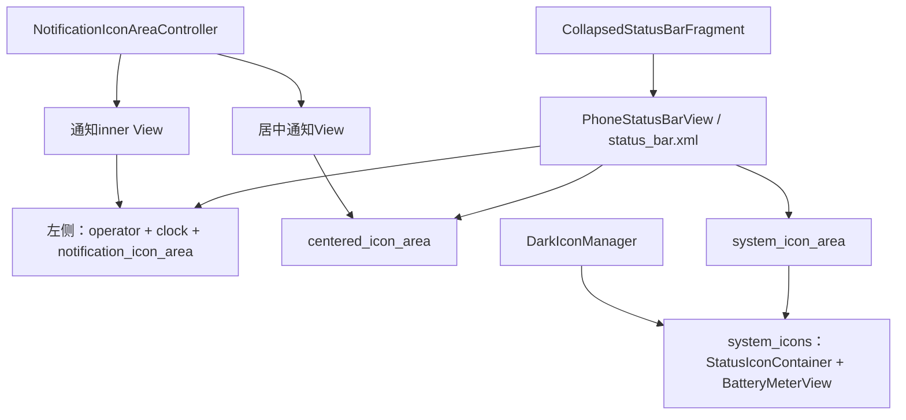
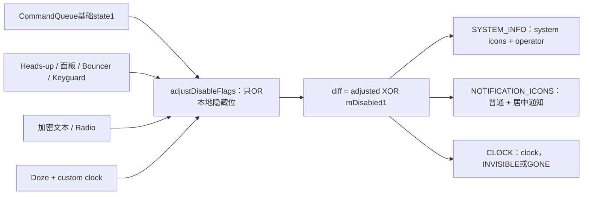
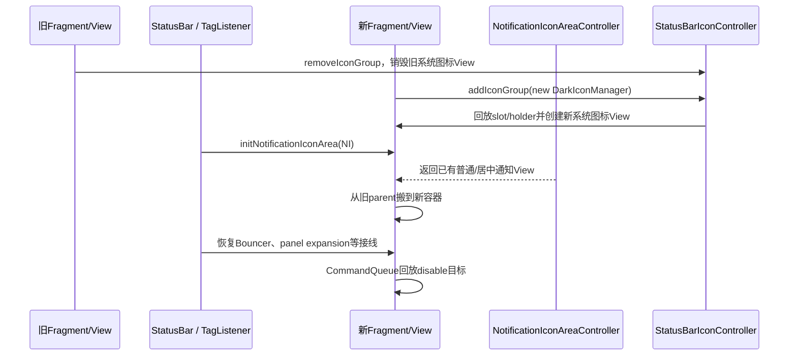

# 第 415 章 Android SystemUI CollapsedStatusBarFragment：布局、禁用标志、动画与系统图标区域

> 源码基线：Android 11 / API 30 / `android-11.0.0_r48`。本章只在 macOS 阅读、检索和推演源码，不编译。重点是折叠状态栏View如何把外部disable位与SystemUI本地状态合并，而不是泛讲Fragment API。

## 1. 本章先解决什么问题

状态栏折叠时，时钟、通知图标、系统图标和运营商名并不总是一起出现。面板展开、Bouncer、Heads-up、Doze、加密启动和应用disable请求都会改变它们；CollapsedStatusBarFragment就是这几块View的装配与显示协调者。

## 2. 一句话心智模型

把它看成“折叠状态栏的显示仲裁器”：CommandQueue给基础disable位，本类再叠加当前UI情境，最后用alpha动画和VISIBLE/INVISIBLE/GONE控制各区域。

## 3. 它不负责什么

它不保存通知业务数据，不生成网络状态，不管理全屏Shade Window，也不直接绘制每个系统图标。通知区由NotificationIconAreaController提供，系统图标由上一章的IconController/IconManager投影。

## 4. 本章源码地图

主文件是`CollapsedStatusBarFragment.java`；布局看`res/layout/status_bar.xml`和`system_icons.xml`；基础disable缓存与回放看CommandQueue；面板/Bouncer条件来自StatusBar和NotificationPanelViewController。

## 5. 它运行在哪个进程

Fragment、PhoneStatusBarView、CommandQueue回调和动画都在SystemUI进程。disable命令最早可来自system_server，但到本类时已由CommandQueue切到SystemUI主线程。

## 6. 它主要运行在哪个线程

Fragment生命周期、View操作、StatusBarStateController回调和CommandQueue disable均在主线程。类中没有锁，所有View引用都假设在有效Fragment View生命周期内访问。

## 7. 为什么使用Fragment

折叠状态栏View需要在配置/主题变化时重建，同时StatusBar主体比View活得更久。FragmentHostManager管理重新inflate，StatusBar通过tag listener接住新Fragment并重新接线。

## 8. 它持有哪些核心View

mStatusBar是PhoneStatusBarView；mSystemIconArea是右侧系统信息容器；mClockView是时钟；mNotificationIconAreaInner是通知图标内层；mCenteredIconArea是居中通知区域；mOperatorNameFrame是可选运营商名。

## 9. 四个区域并非同一来源

时钟和system_icon_area来自status_bar.xml；普通与居中通知区的具体inner View来自长寿命NotificationIconAreaController，再被搬进新布局；系统图标children由DarkIconManager回放生成。

## 10. 图一：布局与对象所有权



## 11. onCreate只取依赖

本类从旧Dependency容器取得KeyguardStateController、NetworkController、StatusBarStateController、StatusBar和CommandQueue。此时Fragment View尚未inflate，不能操作具体区域。

## 12. onCreateView做什么

它只inflate`R.layout.status_bar`并返回。根节点实际类型是PhoneStatusBarView，后续onViewCreated直接强转，布局替换必须维持这个类型契约。

## 13. status_bar根布局的角色

根View高度是status_bar_height，包含lights-out提示、主要status_bar_contents和加密紧急文本ViewStub。它是折叠条内容，不是上一章的TYPE_STATUS_BAR WindowController本身。

## 14. 左侧区域的结构

左侧FrameLayout里既include Heads-up状态栏布局，又有status_bar_left_side；后者依次包含可选operator ViewStub、Clock和notification_icon_area。

## 15. 中间为何有cutout space

`cutout_space_view`为顶部刘海预留空间，PhoneStatusBarView根据DisplayCutout调整其宽度与可见性，使左右内容避开切口。

## 16. centered_icon_area是什么

它是独立居中容器，用来承载NotificationIconAreaController提供的居中通知图标View。Fragment隐藏/显示通知区时会与普通通知区成对操作。

## 17. system_icon_area里有什么

它include`system_icons.xml`，其中StatusIconContainer承载Wi-Fi、mobile、VPN等IconManager图标，BatteryMeterView作为独立child存在。隐藏system_icon_area会把整组信号与电池一起隐藏。

## 18. onViewCreated先恢复什么

若savedInstanceState含`panel_state`，就把SparseArray层级状态交给新的PhoneStatusBarView恢复。这里恢复的是View hierarchy状态，不是mDisabled1等Fragment字段。

## 19. 为什么disable状态不靠Bundle恢复

onResume注册CommandQueue时，addCallback会同步回放每个display当前disabled1/2。因此当前权威基础位来自CommandQueue缓存，而不是旧Fragment私有字段。

## 20. DarkIconManager何时创建

onViewCreated找到R.id.statusIcons，创建DarkIconManager、设置shouldLog=true并注册到StatusBarIconController。注册动作会把中央slot账本的所有现有holder回放为新View。

## 21. 电池是否由DarkIconManager创建

不是。BatteryMeterView已静态写在system_icons布局里；DarkIconManager只管理StatusIconContainer中的动态系统图标children。

## 22. 初始显示为何主动重置

onViewCreated调用showSystemIconArea(false)和showClock(false)，将visibility设VISIBLE、alpha设1。随后CommandQueue当前disable快照再决定是否隐藏，避免继承旧动画alpha。

## 23. 通知区为什么稍后初始化

NotificationIconAreaController由StatusBar创建，Fragment View重建时通过FragmentHostManager tag listener调用`initNotificationIconArea`。因此onViewCreated本身还拿不到这两个通知View。

## 24. initNotificationIconArea如何搬View

先取得Controller的notification inner；若已有parent，就从旧parent remove，再add到新Fragment的notification_icon_area。居中通知View也执行相同步骤。

## 25. 为什么不是重新new通知View

通知图标区域由更长寿命Controller维护状态与监听。重建折叠条时搬迁同一View可减少通知管线重接，但必须先解除旧parent，因为Android View只能有一个parent。

## 26. 初始化通知区的默认策略

两个View接入后调用showNotificationIconArea(false)，先置VISIBLE/alpha 1；当前disable回放或后续recompute再施加真实政策。

## 27. tag listener还做了什么

StatusBar拿到新PhoneStatusBarView后重新设置Bar、Panel和ScrimController，恢复旧View的expansion fraction/expanded与Bouncer状态，重建HeadsUpAppearanceController，并把新View交给ShadeWindow与lights-out控制器。

## 28. Fragment并不独自完成重建

Fragment只负责自己的View与回调；跨重建状态迁移和其他长寿命Controller接线由StatusBar的tag listener负责。这解释了源码注释所说的“awkward lifecycle”。

## 29. onResume注册两条监听

它向CommandQueue注册CommandQueue.Callbacks，并向StatusBarStateController注册StateListener。前者立即回放disable快照；后者去重登记，但不回放当前状态。

## 30. onPause为何注销

View暂不处于resume时停止接收disable与状态事件，避免操作非活动界面。CommandQueue remove只移除一个匹配callback，正常Fragment生命周期保持一次add配一次remove。

## 31. onDestroyView清理什么

从StatusBarIconController移除DarkIconManager，destroy会注销DarkReceiver并清空动态系统图标；若设备使用加密紧急文本，还从NetworkController移除mSignalCallback。

## 32. 紧急文本条件是否会动态变化

r48 NetworkControllerImpl的`hasEmergencyCryptKeeperText()`直接返回静态`EncryptionHelper.IS_DATA_ENCRYPTED`，所以创建与销毁时的条件稳定，成对注册不会因中途变化失配。

## 33. operator name如何启用

若SystemUI资源`config_showOperatorNameInStatusBar`为true，就inflate operator_name ViewStub并保存结果；r48默认false，产品overlay可开启。

## 34. ViewStub为何只在需要时inflate

默认产品无需运营商名，保留stub可减少View层级和测量成本。inflate后原stub被实际View替换，mOperatorNameFrame用于之后动画。

## 35. 加密紧急文本如何初始化

若设备处于旧式data encrypted阶段，就inflate emergency_cryptkeeper_text Stub，并向NetworkController注册只关心飞行模式的SignalCallback；否则直接从parent移除Stub。

## 36. 为何飞行模式触发重算

加密启动期间，`isRadioOn()`实际取`!mAirplaneMode`。飞行模式变化会影响系统信息区是否应隐藏，因此callback调用CommandQueue.recomputeDisableFlags。

## 37. recompute不是修改基础位

它从CommandQueue按display取已缓存disabled1/2，再调用disable分发。Fragment随后重新运行adjustDisableFlags，把新的radio/UI状态叠加到同一组原始位上。

## 38. Network addCallback也有初值回放

如上一章所述，NetworkController.addCallback会同步回放airplane等状态，最后才异步登记未来监听；因此紧急文本初始化时通常会立刻触发一次disable重算。

## 39. mSignalCallback只消费什么

它只覆写setIsAirplaneMode，其他SignalCallback默认方法为空。这里不创建Wi-Fi/mobile图标，只借网络状态变化重新评估折叠条政策。

## 40. 决定性源码：基础位叠加本地位

```java
public void disable(int displayId, int state1, int state2, boolean animate) {
    if (displayId != getContext().getDisplayId()) return;
    state1 = adjustDisableFlags(state1);
    final int old1 = mDisabled1;
    final int diff1 = state1 ^ old1;
    mDisabled1 = state1;
    // 只对变化的SYSTEM_INFO、NOTIFICATION_ICONS和CLOCK更新View
}
```

## 41. state1与state2的区别

接口收到两组disable位，但本Fragment完全忽略state2，只处理state1中的DISABLE_SYSTEM_INFO、DISABLE_NOTIFICATION_ICONS和DISABLE_CLOCK。

## 42. 为什么先检查displayId

CommandQueue可保存多个display的disable状态；Fragment只应响应自己Context所在display。其他display事件直接返回，不改变mDisabled1。

## 43. adjustDisableFlags的本质

它不会清除调用方位，只根据SystemUI当前情境使用OR追加隐藏位。返回值是“基础请求 + 本地临时政策”的合成结果。

## 44. mDisabled1保存什么

保存adjust之后的合成位，而不是CommandQueue原始位。这个细节影响diff计算和onDozingChanged的再次输入。

## 45. diff1为何用异或

`state1 ^ old1`能找出从0变1和从1变0的位。只有相关位变化时才启动对应区域动画，避免每次disable回放都重复操作View。

## 46. 时钟为何还有额外条件

即使DISABLE_CLOCK位没变，展开状态改变也可能让clockHiddenMode在INVISIBLE与GONE之间切换。因此代码还比较当前visibility与目标隐藏模式。

## 47. DISABLE_SYSTEM_INFO控制哪些View

置位时隐藏system_icon_area和operator name；清除时显示二者。通知图标与时钟不由该位直接控制。

## 48. DISABLE_NOTIFICATION_ICONS控制哪些View

置位时同时隐藏普通notification inner和centered icon area；清除时同时显示。lights-out点和Heads-up布局由别的Controller控制。

## 49. DISABLE_CLOCK控制什么

只控制R.id.clock，但隐藏目标可能是INVISIBLE或GONE。运营商名不随clock位，而随SYSTEM_INFO位。

## 50. 图二：disable位到区域的映射



## 51. Heads-up首先影响什么

`headsUpShouldBeVisible()`为true时，adjust无条件OR DISABLE_CLOCK，让Heads-up状态栏内容有空间，不与普通时钟重叠。

## 52. Heads-up是否一定隐藏系统图标

不一定。它直接只加clock位；是否隐藏其余区域还要看shouldHideNotificationIcons、Bouncer和Keyguard例外。

## 53. shouldHideNotificationIcons的第一条

若PhoneStatusBarView不是closed，且StatusBar/PanelController认为展开时应隐藏状态栏图标，就返回true。

## 54. 展开时为何有时仍显示

NotificationPanelViewController在Heads-up appearance可见时返回false；全宽与mShowIconsWhenExpanded等布局政策也会影响结果，所以“面板不closed”不是唯一条件。

## 55. shouldHideNotificationIcons的第二条

若StatusBar的`hideStatusBarIconsForBouncer()`为true，也返回true。这个值还可能包含mWereIconsJustHidden的500ms延迟，避免图标刚淡入又被全屏应用隐藏。

## 56. 为何Launch/Keyguard fading期间暂不追加全隐藏

adjust要求既不处于launch transition fading away，也不处于keyguard fading away，才根据shouldHide追加三个位。过渡期保留图标，交给既有fade动画协调，减少闪烁。

## 57. 全隐藏具体追加哪些位

同时OR NOTIFICATION_ICONS、SYSTEM_INFO和CLOCK，因此折叠条左右主要内容都会隐藏；Heads-up专用View可由HeadsUpAppearanceController另行显示。

## 58. Keyguard Heads-up例外

当状态正是KEYGUARD且Heads-up可见时，即便shouldHide为true，也不执行三位全隐藏。前面仍会隐藏clock，从而给锁屏Heads-up保留其他所需图标布局。

## 59. 加密启动为何隐藏通知图标

EncryptionHelper.IS_DATA_ENCRYPTED且NetworkController报告需要Emergency CryptKeeper文本时，adjust追加DISABLE_NOTIFICATION_ICONS，为紧急文本让出左侧区域。

## 60. Radio关闭为何隐藏系统信息

同一加密阶段若`isRadioOn()`为false，就追加DISABLE_SYSTEM_INFO，隐藏可能无意义的信号/电池组和运营商名；r48 isRadioOn直接是非飞行模式。

## 61. Doze custom clock追加什么

当isDozing且PanelController有自定义时钟时，追加DISABLE_CLOCK和DISABLE_SYSTEM_INFO，留下通知图标区域可用于Doze场景。

## 62. 它是否强制清除通知禁用位

不会。代码只OR另外两个位，没有清除基础state1中已有的DISABLE_NOTIFICATION_ICONS。注释“must show notification icons”描述常规布局意图，不是覆盖调用方禁用请求的强保证。

## 63. adjust的位只能加不能减

任何本地条件都只能把位从0变1。要撤销本地隐藏，通常必须用CommandQueue保存的原始位重新调用disable，让adjust在条件消失时不再添加该位。

## 64. onDozingChanged如何触发重算

它调用`disable(displayId, mDisabled1, mDisabled1, false)`，把当前合成mDisabled1同时当state1/state2输入；state2反正未使用。

## 65. 这个重算能独立清除旧本地位吗

不能保证。因为输入已经包含旧adjust追加的位，而adjust只OR不清除。比如Doze custom clock曾加CLOCK/SYSTEM_INFO，退出Doze时单靠此调用不会把它们减掉；需要其他路径用CommandQueue原始位recompute才能清理。

## 66. 为什么仍需要onDozingChanged

进入Doze时它能立即追加custom-clock所需位，并让clockHiddenMode在Doze条件下选择GONE；退出阶段通常还有StatusBar/面板状态重算配合。阅读本方法时应避免把它当完整可逆状态机。

## 67. onStateChanged为何为空

本类实现StateListener接口，但r48对普通状态整数变化没有处理；注册主要为了onDozingChanged。空方法是版本现状，不应补出不存在的KEYGUARD/NORMAL切换逻辑。

## 68. clockHiddenMode为什么区分两种隐藏

面板展开/展开中、Keyguard不显示且不Doze时返回INVISIBLE，保留Clock占据的布局空间，避免QS展开动画左右内容跳位；其他情况返回GONE，释放空间。

## 69. INVISIBLE与GONE的共同点

都不绘制也不接收触摸；差异是INVISIBLE仍参与测量布局，GONE不参与。alpha 0只是动画属性，最终visibility才决定布局语义。

## 70. 系统和通知区域为何固定INVISIBLE

hideSystemIconArea和hideNotificationIconArea都走animateHide，目标固定INVISIBLE，以保持折叠条布局骨架；只有clock根据场景可能GONE。

## 71. 非动画隐藏的顺序

先cancel当前ViewPropertyAnimator，再setAlpha(0)，再setVisibility目标状态，立即完成，没有等待帧动画。

## 72. 动画隐藏的参数

目标alpha 0，持续160ms，无delay，使用ALPHA_OUT；结束动作才把visibility切到INVISIBLE或GONE。

## 73. 动画期间visibility是什么

在end action执行前通常仍是VISIBLE，只是alpha逐渐变为0。因此“disable已处理”不等于View立即进入最终visibility。

## 74. 动画显示先做什么

cancel旧动画并立即setVisibility(VISIBLE)。非动画路径直接alpha 1；动画路径设置alpha 1、持续320ms、delay 50ms、ALPHA_IN。

## 75. 为什么显示比隐藏慢

r48常量规定fade-in 320ms加50ms延迟，而hide 160ms无延迟，视觉上优先快速腾出空间，再柔和恢复内容。

## 76. 没有显式start也会动画吗

会。ViewPropertyAnimator的属性调用会安排自动启动；只有Keyguard fading分支为了覆盖时序后显式start。

## 77. cancel为何还要withEndAction(null)

源码注释指出同一帧hide后立刻show时，cancel不一定移除尚未真正启动动画的end action。若旧end action随后运行，会把刚显示的View再次设为隐藏，因此show显式清空它。

## 78. Keyguard fading如何同步

若KeyguardStateController正在fading away，show动画改用Keyguard提供的duration与delay，插值器换成LINEAR_OUT_SLOW_IN，并立即start，使图标淡入与解锁动画对齐。

## 79. 哪些动画参数会被覆盖

前面设置的320ms、50ms和ALPHA_IN在Keyguard分支分别被新duration、delay和插值器覆盖；alpha目标仍为1。

## 80. 连续hide/show的最终状态靠什么保证

每次先cancel；show还清理旧hide end action，并立即VISIBLE。正常主线程串行调用下，最后一次命令定义目标，但仍要考虑动画结束回调和后续disable事件。

## 81. hideOperatorName为何判null

默认配置不inflate operator ViewStub，mOperatorNameFrame为null。系统信息位变化仍可安全处理，不需要为默认产品创建无用View。

## 82. 通知区方法为何不判null

hide/show直接使用mNotificationIconAreaInner和mCenteredIconArea，假定StatusBar tag listener已调用initNotificationIconArea，再发生相关disable处理。这个跨对象初始化顺序是隐含契约。

## 83. 若初始化顺序被扩展代码破坏

在通知View仍为null时触发NOTIFICATION_ICONS变化会进入animateHiddenState并空指针。AOSP启动接线保证顺序，自定义FragmentHost或异步改造必须重新验证。

## 84. mDisabled1为何可能与真实像素暂时不一致

字段在动画启动前就更新，View可能还在160ms淡出；或者View已被别的父容器隐藏。它表示本Fragment目标政策，不是屏幕合成完成证据。

## 85. CommandQueue addCallback会去重吗

不会，内部mCallbacks是列表且直接add；Fragment生命周期正常配平避免重复。重复onResume或漏onPause会让disable回调重复，remove一次也只删一个。

## 86. StatusBarStateController会去重吗

会。其addCallback遍历RankedListener，已有相等listener就返回；同一个Fragment在这条链上不会重复登记。

## 87. 两条监听的回放语义不同

CommandQueue add立即对各display回放disable；StatusBarStateController add只登记、不回放状态。因此onViewCreated主动设置初值，Doze后续靠回调。

## 88. 保存View hierarchy能保存什么

onSaveInstanceState调用mStatusBar.saveHierarchyState，能保存有id且支持状态保存的child状态；然后以SparseArray存入Bundle。它不保存外部Controller监听关系或动画队列。

## 89. 重建时通知inner View的状态归谁

由于NotificationIconAreaController返回同一个内层View并从旧parent搬迁，其内部通知图标状态可跨新status_bar布局继续存在；但新parent的布局、alpha和visibility仍由Fragment重新设置。

## 90. 重建时系统图标状态归谁

旧DarkIconManager销毁旧children；新Manager注册后从StatusBarIconController中央holder账全量回放，生成一批新View。它与通知区的“搬同一View”策略不同。

## 91. 图三：Fragment重建与两类图标恢复



## 92. 排查“系统图标全没了”

先查DISABLE_SYSTEM_INFO合成位，再查system_icon_area visibility/alpha、DarkIconManager是否已注册、StatusIconContainer children和父PhoneStatusBarView是否可见。

## 93. 排查“只有通知图标没了”

查DISABLE_NOTIFICATION_ICONS、shouldHideNotificationIcons、加密紧急文本、普通与centered两个View的visibility，以及NotificationIconAreaController是否成功接入新parent。

## 94. 排查“时钟消失但留下空位”

检查clockHiddenMode是否因面板未closed、Keyguard未showing且非Doze返回INVISIBLE。这是为动画保留布局，不一定是bug。

## 95. 排查“时钟消失且布局收缩”

目标是GONE，通常处于closed、Keyguard showing或Dozing之一。还要确认动画end action已执行，不能只在淡出中途检查。

## 96. 排查“图标刚显示又消失”

跟踪同一帧hide/show顺序、旧end action是否被withEndAction(null)清理、后续CommandQueue recompute，以及Bouncer的mWereIconsJustHidden 500ms延迟。

## 97. 排查“退出Doze仍隐藏”

检查mDisabled1是否包含先前adjust追加的CLOCK/SYSTEM_INFO，onDozingChanged是否只把合成位重新输入，以及之后是否从CommandQueue原始disable状态触发recompute。

## 98. 排查“副屏事件影响主屏”

记录回调displayId与Fragment Context displayId；代码首行不相等就return。若使用了错误display Context，Fragment会接受或拒绝错误事件。

## 99. 排查“配置重建后缺一组图标”

系统图标查新DarkIconManager回放；通知图标查View搬迁和tag listener；二者恢复机制完全不同，不能用同一个假设排查。

## 100. 测试源码能证明什么

r48测试覆盖基础SYSTEM_INFO、NOTIFICATION_ICONS、CLOCK的非动画显示隐藏，并验证正常0位恢复；它使用mock验证，不覆盖真实帧动画、Fragment重建时序或多display。

## 101. Doze测试的证据边界

测试在init时已经调用过notification View的VISIBLE，再用`atLeast(1)`验证，因此不能单独证明onDozingChanged这次调用把隐藏通知重新显示。阅读测试也要核对mock是否reset及断言是否锁定本次事件。

## 102. 本类为什么不实现Dumpable

r48 Fragment没有自己的dump；诊断要组合StatusBar/CommandQueue状态、View hierarchy、StatusBarIconController dump与动画属性。mDisabled1可通过调试或临时日志观察。

## 103. 本章的进程边界

system_server到CommandQueue之前可能跨Binder；Fragment接到disable后的adjust、diff和View动画都在SystemUI进程内。Network紧急回调也已在SystemUI Controller层。

## 104. 本章的线程边界

CommandQueue disable在主Looper可立即handle，Fragment生命周期与StateController也在主线程。ViewPropertyAnimator在后续帧推进，最终visibility由动画end action设置。

## 105. 本章的输入

基础输入是displayId、disabled1/2和animate；附加输入是PhoneStatusBarView开合、Panel策略、Bouncer/Heads-up、Keyguard fade、Encryption/Radio、Doze和custom clock。

## 106. 本章的输出

输出是时钟、系统信息区、运营商名、普通/居中通知区的alpha与visibility，以及通过生命周期建立或移除的IconManager和Network监听。

## 107. 最重要的不变量

有效View生命周期内，DarkIconManager注册必须与onDestroyView清理配平，通知区域必须先接线再接受相关disable变化，mDisabled1应代表最后一次合成目标位。

## 108. 最重要的状态分层

CommandQueue保存原始disable；Fragment保存adjust后的目标；View保存当前visibility/alpha；屏幕保存后续帧的像素结果。四层不应混写成一个“是否显示”布尔值。

## 109. 最重要的动画分层

hide/show请求、ViewPropertyAnimator目标、end action最终visibility和Surface像素完成是四个时点。源码方法返回只证明请求已设置。

## 110. 最重要的版本边界

r48仍使用平台`android.app.Fragment`、旧Dependency与StatusBar强耦合tag listener；后续版本可能迁移到Controller/Compose或不同状态模型，类名相同也不能照搬本章细节。

## 111. 阅读本章后的自测

你应能解释：为何clock有INVISIBLE/GONE两种隐藏；为何新系统图标View重建而通知inner被搬迁；为何Heads-up先隐藏clock；为何adjust只能OR位；为何onDozingChanged单独不能可靠清除旧本地位。

## 112. macOS只读练习一：画出status_bar布局树

只用`sed`读取status_bar.xml和system_icons.xml，画出operator、clock、notification area、cutout、centered area、StatusIconContainer与battery的父子关系。标注哪些View由XML创建，哪些由Controller运行时add进来。

## 113. macOS只读练习二：手算四组disable情境

分别令基础state1为0，并设置：Heads-up可见；面板展开需隐藏；加密且飞行模式；Doze加custom clock。逐行执行adjustDisableFlags，写出CLOCK、SYSTEM_INFO、NOTIFICATION_ICONS最终位及对应View目标。

## 114. macOS只读练习三：推演同帧hide后show

沿animateHiddenState和animateShow记录cancel、alpha、visibility、duration、delay和end action。解释为什么只cancel不够、withEndAction(null)解决什么，以及Keyguard fading会覆盖哪些参数。

## 115. macOS只读练习四：验证Doze退出边界

假设原始CommandQueue state1为0，进入Doze custom clock后mDisabled1含CLOCK|SYSTEM_INFO，再退出Doze并仅调用onDozingChanged。手算为何位仍保留；然后追CommandQueue.recomputeDisableFlags如何用原始0重新得到可清除结果。

## 116. 易错点一：Fragment管理整个StatusBar Window

错误。它管理折叠条内容View；TYPE_STATUS_BAR顶部Window由StatusBarWindowController管理，全屏Shade Window又属于NotificationShadeWindowController。

## 117. 易错点二：disable位就是最终屏幕像素

错误。位先经本地adjust，动画再改变alpha，end action最后改visibility，layout/draw/合成还在后续帧。

## 118. 易错点三：INVISIBLE与GONE只是写法不同

错误。INVISIBLE保留布局位置，GONE释放位置；clock在面板动画时刻意使用INVISIBLE防止内容跳动。

## 119. 复读源码后的修正

复读r48后，本章补正了几个直觉陷阱：system_icon_area还包含独立BatteryMeterView；通知View采用跨重建搬迁而系统图标采用holder回放重建；StatusBarStateController不回放初值而CommandQueue会；Doze custom clock只追加CLOCK/SYSTEM_INFO并不强制清除通知禁用。进一步指出mDisabled1保存adjust后位，onDozingChanged重新输入该合成值且adjust只OR，因此它不是独立可逆重算；现有Doze单测的atLeast VISIBLE也包含初始化调用，证据范围有限。

## 120. 本章结论

CollapsedStatusBarFragment把折叠状态栏拆成几块独立区域，以CommandQueue基础disable位为底，再叠加Heads-up、面板、Bouncer、Keyguard、加密和Doze政策，最后用不同visibility语义与动画时序落实到View。掌握“原始位—合成位—View目标—像素完成”四层，以及通知View搬迁和系统图标重建两种生命周期，才能准确定位折叠条的隐藏、闪烁和重建问题。下一章进入NotificationShadeWindowController，研究全屏Shade窗口的可见性、焦点、亮度、Keyguard和Wallpaper状态合并。
